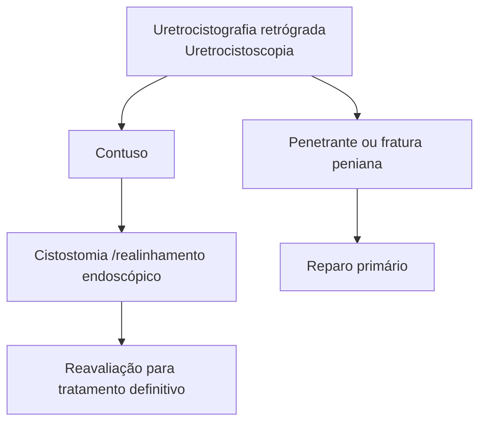
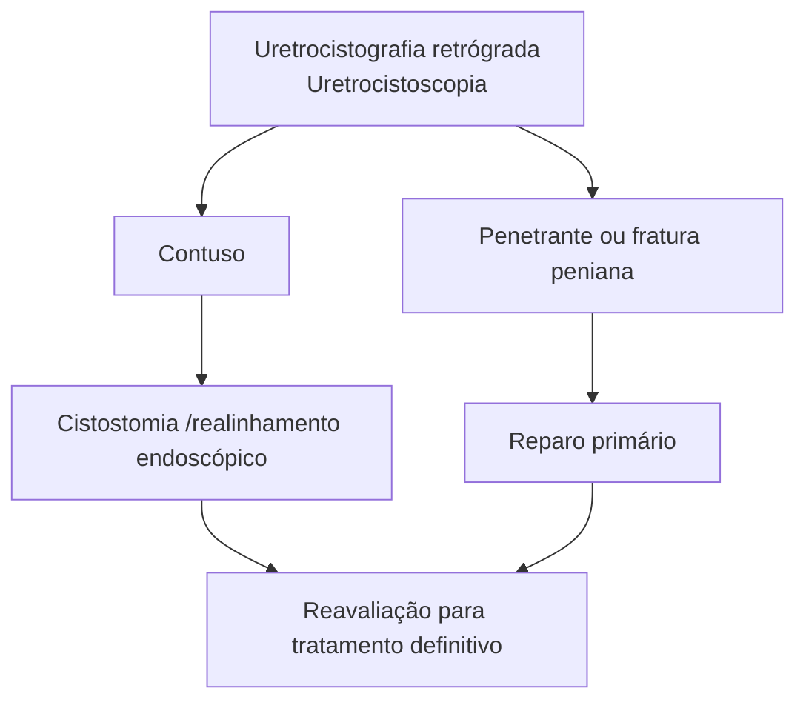

# UROLOGIA: PS - TRAUMA DE URETRA E ESTENOSE DE URETRA

## Trauma de Uretra:

- Posterior = Fratura de pelve
- Anterior = Trauma urogenital – queda a cavaleiro e iatrogênica.

- Suspeita: Uretrorragia, sangue no meato uretral, equimose de perineo, fraturas de pelve, etc
- Na dúvida = Uretrocistografia retrógrada!

## 1. TRAUMA DE URETRA

### 1.1 ANATOMIA DA URETRA:

- Uretra posterior: prostática e membranosa;
- Uretra anterior: bulbar e peniana.

**POSTERIOR**

The posterior urethra consists of:
- PROSTÁTICA
- MEMBRANOSA
- BULBAR
- PENIANA

**ANTERIOR**

**Figura 1** Topografia e divisões da uretra

**URETRA POSTERIOR**

Quase exclusivas de fx pelve
1 a 10% das fx
Fx anel anterior ou diástase púbica

**Figura 2** Fratura pélvica com trauma de uretra

- Anterior: relação com trauma urogenital, principalmente a queda a cavaleiro. Porém, a causa mais comum é iatrogênica, em casos de sondagem vesical.

### 1.2 CLASSIFICAÇÃO DO TRAUMA DE URETRA:

- Posterior: quase exclusiva de fratura da pelve, ocorrendo em 1-10% das fraturas de pelve. A fratura do anel anterior ou diástase púbica são os principais achados diante de fratura associada a lesão de uretra posterior;

### 1.3 SINAIS E SINTOMAS

- Uretrorragia (principal sintoma);
- Próstata não tocável;
- Hematoma perineal;
- Retenção urinária.

## 1.4 EXAMES COMPLEMENTARES

• Uretrocistografia retrógrada e miccional (padrão-ouro).
  • Fase retrógrada: avaliação por múltiplas imagens enquanto se injeta contraste retrogradamente, preenchendo toda a uretra até a bexiga;
  • Fase miccional: ocorre maior abertura do colo vesical, preenchendo melhor a uretra prostática. Figura 3
• Lesão completa de uretra anterior (vazamento do contraste na uretra anterior): Figura 4
• Lesão parcial de uretra posterior (há extravasamento, porém parte do contraste chega à bexiga): Figura 5

## 1.5 TRATAMENTO

• Trauma contuso: realiza-se cistostomia / realinhamento endoscópico, e, após, reavaliar para tratamento definitivo.
• Trauma penetrante ou fratura peniana: realiza-se reparo primário da uretra.

**Figura 4** Extravasamento de contraste em uretra anterior em uretrocistografia miccional

**Figura 5** Extravasamento de contraste em uretrocistografia miccional

## 1.6 PODE EVOLUIR PARA ESTENOSE DE URETRA:

• Causas traumáticas:
  • Iatrogênica, como sondagem ou instrumentação cirúrgica;
  • Traumatismo da uretra.
• Causas inflamatórias:
  • Pós-uretrites (ex: Gonocócica);
  • Balanite Xerótica Obliterante: doença crônica de causa mal definida, interrogando-se causas autoimunes ou pós-infecção viral, causando estenose e fechamento do meato uretral e alterações na glande, com aderências.

**Figura 3** Uretrocistografia miccional com melhora da estenose apresentada em fase miccional

Image A shows:
- UB (Urinary Bladder)
- Prostatic urethra
- Membranous urethra
- Bulbar urethra
- Penile urethra

Image B shows:
- UB (Urinary Bladder)
- Prostatic urethra
- Membranous urethra
- Bulbar urethra
- Penile urethra

PS - TRAUMA DE URETRA E ESTENOSE DE URETRA                                                                                        3

**Figura 6** Fluxograma do manejo do trauma de uretra

**Figura 7** Balanite Xerótica Obliterante.

## 1.7 TRATAMENTO

**Meato Uretral e Fossa Navicular:**
- Meatotomia / Meatoplastia;
- Retalhos de pele podem ser necessários;
- o enxerto de mucosa oral é uma opção na Balanite Xerótica Obliterante.

**Uretra Peniana:**
- Uretroplastia substitutiva, no qual há importante papel do enxerto de mucosa oral;
- Ou Dilatação uretral;
- Ou Uretrotomia interna (anelar): mais aplicável para a uretra bulbar.

**Uretra Bulbar:**
- Uretroplastia Anastomótica T-T: indicada para estenoses curtas, < 2,5 cm;
- Uretrotomia Interna: indicada para estenoses ainda menores, < 1 cm;
- Opção: Uretroplastia com enxerto.

**Uretra Posterior:**
- Uretroplastia Anastomótica com ou sem enxerto;
- Se houver dificuldade na conexão da anastomose, pode-se lançar mão das Manobras de Webster: 1- Liberação da uretra até ligamento suspensor do pênis; 2- Abertura dos corpos cavernosos; 3- Pubectomia inferior; 4- Transposição dos corpos cavernosos.

UROLOGIA

# REFERÊNCIAS

**Figura 3** Uretrocistografia miccional com melhora da estenose apresentada em fase miccional

**Figura 4** Extravasamento de contraste em uretra anterior em uretrocistografia miccional

Radswiki T, Urethral rupture. Case study, Radiopaedia.org

**Figura 5** Extravasamento de contraste em uretrocistografia miccional

Dixon A, Traumatic urethral injury. Case study, Radiopaedia.org

**Figura 7** Balanite Xerótica Obliterante.

Depasquale, I., Park, A.J. and Bracka, A. (2000), The treatment of balanitis xerotica obliterans. BJU International
