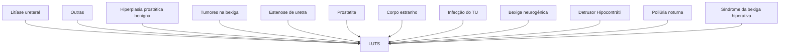

# UROLOGIA: UDN E DISFUNÇÕES MICCIONAIS

## 1. LUTS (LOWER URINARY TRACT SYMPTOMS)

• Armazenamento (capacidade da bexiga):
• Normalmente relacionados com disfunção do músculo detrusor
  • Aumento da frequência;
  • Urgência;
  • Urgeincontinência;
  • Noctúria.
• Esvaziamento (relacionado ao jato da urina):
• Relacionados com obstrução do trato urinário
  • Hesitação;
  • Esforço;
  • Jato Fraco;
  • Intermitência.

### 1.2 ETIOLOGIAS POSSÍVEIS NA LUTS:

• Hiperplasia prostática benigna;
• Síndrome da bexiga hiperativa;
• Poliúria noturna;
• Detrusor hipoantrátil;
• Bexiga neurogênica;
• Infecção de TU;
• Corpo estranho;
• Prostatite;
• Estenose de uretra;
• Tumores na bexiga;
• Litíase ureteral;
• Outras.

**Figura 1** Etiologias na LUTS

### 1.3 AVALIAÇÃO PRIMÁRIA:

**Anamnese é essencial;**
• Padrão miccional;
• Perdas associadas?
• Antecedentes neurológicos?
• Hábito intestinal;
• Diário miccional.

### 1.4 EXAME FÍSICO:

• Se lesão neurológica, avaliar nível da lesão;
• Se trauma recente, esperar o paciente sair de choque medular;
• Tônus Esfincteriano (urinário e fecal);

UROLOGIA

• Padrão de Continência. Retenção ou perdas?;
• Exames subsidiários a depender de hipóteses diagnósticas; Estudo urodinâmico (exame invasivo, nem todos tem indicação).
• Para realizar o estudo urodinâmico, utiliza-se 3 sondas (2 uretrais e 1 retal):
  • 1ª sonda - Conectada ao soro fisiológico para fazer o enchimento da bexiga (para fazer a segunda fase do estudo urodinâmico);
  • 2ª sonda - aferição da pressão vesical;
  • 3ª sonda - aferição da pressão abdominal.

**Figura 3** Curva de urofluxometria normal (sobe rápido e cai rápido).

**Figura 2** Estudo urodinâmico com suas respectivos traçados

**No estudo UDN tem 3 traçados:**
• Pressão vesical;
• Pressão abdominal;
• Subtração da pressão vesical pela abdominal a qual corresponde por consequência o valor da pressão detrusora.

## 1.5 INDICAÇÕES PARA O ESTUDO UDN:

**HPB:**
• Suspeita de Hipocontratilidade vesical;
• Lesões neurológicas;
• Próstatas pequenas;
• Início precoce ou tardio dos sintomas.

**IU (incontinência urinária):**
• Casos não índice;
• Dúvida de relato dos sintomas.

**BN (bexiga neurogênica):**
• Seguimento longo prazo;
• Alteração quadro;
• Planejamento Cirúrgico.

Normalmente utilizado para casos não índices na HPB ou IU, ou seja, não clássicos na qual seria importante uma avaliação invasiva, seja do grau de obstrução, pressões de perda abdominais ou força de contração detrusora. Entretanto, deve ser utilizado nos casos de BN para avaliar padrão de perda.

## 1.6 FASES DO ESTUDO URODINÂMICO:

**Urofluxometria livre:**
• Não invasiva → o paciente urina e é medido o fluxo urinário pelo tempo;
• Tempo de esvaziamento lento: Obstrução infravesical? Hipoatividade detrusora?;
• < 10 ml/seg → fluxo reduzido;
• > 15 ml/seg → fluxo normal.

**Figura 4** Exemplos de urofluxometria. A e B: sinusoidais (normal). C: fluxo reduzido e tempo prolongado (HPB). D: fluxo intermitente (HPB). E: tempo de esvaziamento prolongado em platô (estenose de uretra).

**Figura 5** Urofluxometria normal.

**Figura 6** Padrão de obstrução infravesical com fluxo intermitente atingindo pequenos fluxos máximos.

**Fase cistométrica:**
• Nessa fase, o paciente é sondado com as 3 sondas previamente explicadas;
• O traçado da subtração da pressão vesical pela abdominal traduz a pressão detrusora. Diferencia manobra de valsalva de uma alteração da bexiga, por exemplo;

UDN E DISFUNÇÕES MICCIONAIS                                                                                                                                               3

## Fase Miccional:

• Interrompe o soro na capacidade cistométrica máxima e autoriza-se o paciente a urinar, ainda com os transdutores na bexiga e no reto, observando a pressão vesical e a pressão detrusora que o paciente faz para esvaziar a bexiga;

• Altas pressões e baixo fluxo: Obstrução infravesical;

• Baixas pressões e baixo fluxo: Hipocontratilidade;

• Baixas pressões e alto fluxo: Normal.

**Figura 7** Fase cistométrica normal: sem perdas, sem hiperatividade detrusora (HD) e em baixas pressões.

• A infusão rápida de soro na bexiga pode desencadear hiperatividade detrusora que não representa a realidade clínica do paciente. Por isso, o enchimento da bexiga deve ser lento, com velocidade entre 20-50 ml/min;

• Na fase cistométrica, consegue-se analisar: Medição da CCM (capacidade máxima da bexiga); Complacência (capacidade da bexiga encher em baixas pressões); BN tem baixa complacência: Hiperatividade detrusora; Perdas aos esforços.

**Figura 8** Perdas urinárias aos esforços. VLPP (valsalva leak point pressure): menor valor da pressão no momento de perda. Observa-se que o pressão detrusora não aumentou durante o período de perda.

**Valsalva Leak Point Pressure Range**

**Figura 10** A pressão sob a qual o paciente perde urina traduz a hipótese diagnóstica. Perda acima de 100 cmH2O (hipermobilidade uretral). Perda abaixo de 60-40 cmH2O (algum grau de insuficiência esfincteriana).

Leakage at arrow = DLPP = 45 cm H₂O

**Figura 11** Perda de complacência (comum na BN). Observa-se aumento da pressão intravesical padrão constante ao ser infundido volume intravesical.

**Figura 12** Fluxo alto às custas de baixas pressões: normal.

## 1.7 BOOI (BLADDER OUTLET OBSTRUCTION INDEX):

**Cálculo:**

• BOOI = PdetQmax (Pressão detrusora no fluxo máximo) - 2 Qmax (fluxo máximo).

**Resultados:**

• BOOI > 40 = obstruído;

• BOOI 20-40 = equívoco;

• BOOI < 20 = não obstruído.

BOOI: **Figura 12**

## 1.8 BCI (BLADDER CONTRACTILITY INDEX):

**Cálculo:**

• BCI = Pdet Qmax + 5 Qmax.

**Resultados:**

• Forte > 150;

• Normal: 100-150;

• Fraca < 100. **Figura 14**

**Figura 12** BOOI

UROLOGIA

**SCHAEFER NOMOGRAM**

| Qmax (ml/s) | Pdet (cmH20) |    |    |     |    |     |     |     |
| ----------- | ------------ | -- | -- | --- | -- | --- | --- | --- |
| 25          | N-           | N+ | ST |     |    |     |     |     |
| 20          | N-           | N+ | ST |     |    |     |     |     |
| 15          | W+           |    |    |     |    |     |     |     |
| 10          | W-           |    |    |     |    |     |     |     |
| 5           | 0            |    | II | III | IV | V   | VI  |     |
| 0           | VW           |    |    |     |    |     |     |     |
|             | 0            | 20 | 40 | 60  | 80 | 100 | 120 | 140 |

**Figura 13** BCI

**Armazenamento**

**Esvaziamento**

Abertura da uretra

Pressão uretral cai

Pdet sobe

**Pure**

**Pdet**

Fluxo começa

**Q**

**EMG**

Esfíncter relaxa

**Figura 16 Eletroneuromiografia**

**Voiding phase**

Pabd (cm H₂O) 100-0

Pves (cm H₂O) 100-0

Pdet (cm H₂O) 100-0

Flow rate Q (per/sec) 50-0

**Figura 14** Fluxo baixo com pressão detrusora alta (obstrução infravesical)

**VídeoUrodinâmica:**

As imagens permitem uma análise funcional + anatomia no estudo contrastado;

• Útil para quando se pensa em grau de refluxo na disfunção miccional. Identifica topografia da obstrução, refluxo, grau de abertura do colo vesical e efeitos na uretra posterior.

**(A)**

**(B)**

**(C)**

**(D)**

**Figura 17 VídeoUrodinâmica:**

Pressure/Flow

Slow Flow

**Pdet no Qmax: 90**

**Qmax: 3,5**

High pdet

**OBSTRUÇÃO INFRAVESICAL**

Qvol 1000 ml

pves 100 cm H₂0

**BOOI = Pdet no Qmax – 2 Qmax.**

**BOOI = 90 - 7 = 83**

**Figura 15** Aplicação dos índices indica obstrução infravesical.

## 1.9 PARÂMETROS QUE PODEM SER ASSOCIADOS AO ESTUDOS URODINÂMICO:

**Eletromiografia:**

• Avalia musculatura do assoalho pélvico com eletrodos;

• Útil na suspeita de dissinergismo vesico esfincteriano.

UDN E DISFUNÇÕES MICCIONAIS

# REFERÊNCIAS

**Figura 3** Curva de urofluxometria normal (sobe rápido e cai rápido).

Acervo pessoal Medcof

**Figura 4** Exemplos de urofluxometria. A e B: sinusoidais (normal). C: fluxo reduzido e tempo prolongado (HPB). D: fluxo intermitente (HPB). E: tempo de esvaziamento prolongado em platô (estenose de uretra).

Acervo pessoal Medcof

**Figura 5** Urofluxometria normal.

Acervo pessoal Medcof

**Figura 6** Padrão de obstrução infravesical com fluxo intermitente atingindo pequenos fluxos máximos.

Acervo pessoal Medcof

**Figura 7** Fase cistométrica normal: sem perdas, sem hiperatividade detrusora (HD) e em baixas pressões.

https://link.springer.com/article/10.1007/s00192-011-1585-y

**Figura 8** Perdas urinárias aos esforços. VLPP (valsalva leak point pressure): menor valor da pressão no momento de perda. Observa-se que o pressão detrusora não aumentou durante o período de perda.

Domínio público Google

**Figura 9** A pressão sob a qual o paciente perde urina traduz a hipótese diagnóstica. Perda acima de 100 cmH2O (hipermobilidade uretral). Perda abaixo de 60-40 cmH2O (algum grau de insuficiência esfincteriana).

Domínio público Google

**Figura 10** Perda de complacência (comum na BN). Observa-se aumento da pressão intravesical padrão constante ao ser infundido volume intravesical.

https://slideplayer.com/slide/8039350/#google_vignette

**Figura 11** Fluxo alto às custas de baixas pressões: normal.

Domínio público Google

**Figura 12** BOOI

Domínio público Google

**Figura 13** BCI

Domínio público Google

**Figura 14** Fluxo baixo com pressão detrusora alta (obstrução infravesical)

https://pt.slideshare.net/GovtRoyapettahHospit/urodynamics-249372770

**Figura 15** Aplicação dos índices indica obstrução infravesical.

Domínio público Google

**Figura 16** Eletroneuromiografia

Domínio público Google

**Figura 17** VídeoUrodinâmica:.

https://www.nature.com/articles/s41598-017-07163-2. figure 1.
