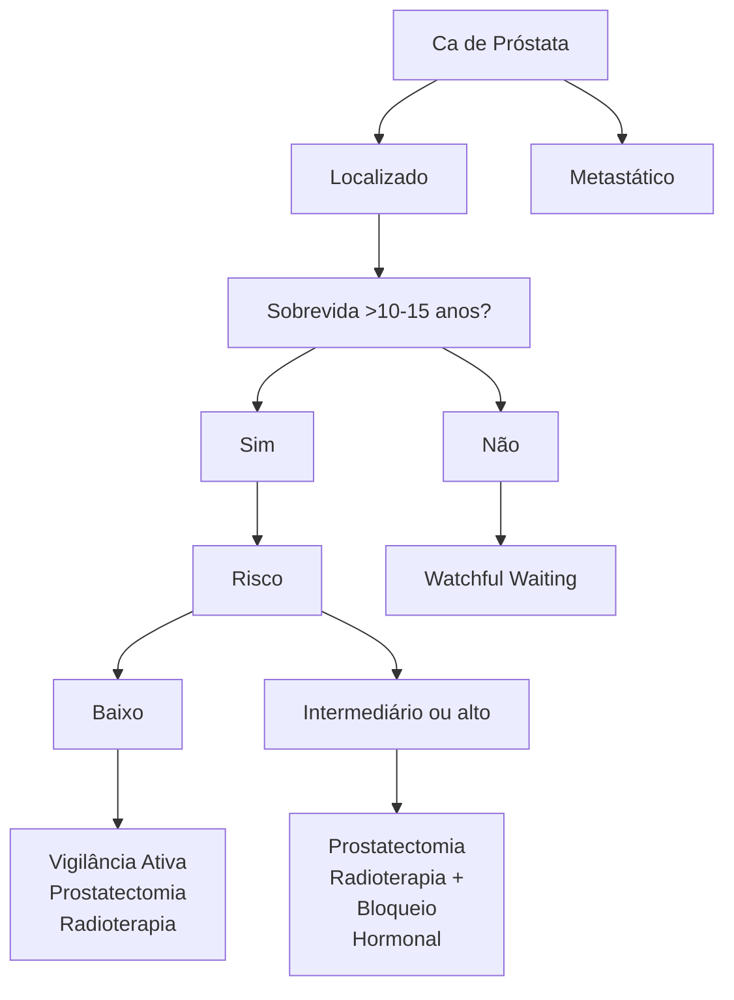
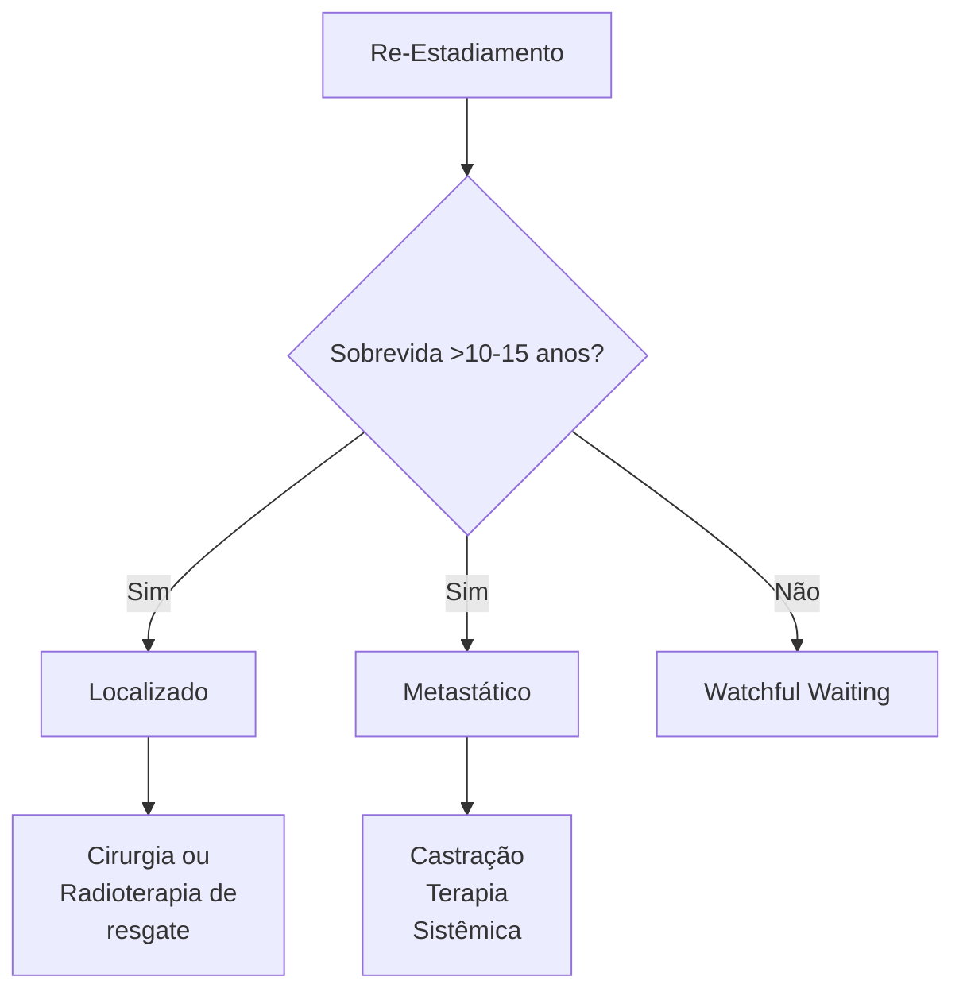

# URO-ONCOLOGIA: PRÓSTATA

## 1. EPIDEMIOLOGIA

- Em 2020, apenas no Brasil, foram 65840 novos casos, segundo o INCA, sendo o câncer mais incidente em homens. Em 2019, foi o 2º em mortalidade por câncer em homens;
- É tipicamente uma neoplasia de evolução lenta;
- É estimado que cerca de 1 em cada 8 homens terá câncer de próstata em algum ponto da vida.

## 2. FATORES DE RISCO

- História familiar: risco relativo de 5.08 quando existem mais de 2 familiares de primeiro grau afetados;
- Etnia: é mais comum em homens pretos;
- Idade
- Prostatite de repetição;
- Presença de mutações genéticas BRCA 2 (em até 5% dos casos);

OBS.: alguns fatores que são comumente pensados como fator de risco, como tabagismo, uso de testosterona ou masturbação, na realidade não são fatores de risco. No caso de reposição de testosterona, deve-se avaliar antes se o paciente já tem ou teve câncer de próstata. Não aumenta a incidência, mas não deve ser utilizada indiscriminadamente e sem avaliar risco x benefício quando o câncer já está instalado.

## 3. RASTREAMENTO

- O rastreamento é pensado para pacientes assintomáticos, saudáveis;
- Relembrando:
  - Zona periférica da próstata: cerca de 75% dos cânceres de próstata estão nessa região;

**Figura 1 - Zonas da próstata de McNeal**

Anatomia da próstata mostrando:
- Zona Central
- Zona Periférica
- Zona de Transição
- Zona Anterior
- Orientação: Posterior, Anterior, Direita

- Zona de transição: maioria dos nódulos de HPB.
- Rastreamento: toque retal + PSA;
- Antígeno Prostático Específico (PSA): não é específico para câncer.

**Figura 2 - Toque retal para avaliação da próstata**

Diagrama anatômico mostrando a relação entre Bexiga, Reto e Próstata durante o exame de toque retal.

UROLOGIA

• Valor de corte é o PSA > 2,5, podendo variar com guidelines, e com idade. Pacientes mais velhos, acima de 65 anos, pode-se considerar o corte em 4;
• Pode haver câncer com PSA normal, sendo importante a realização do toque retal para melhorar a sensibilidade (maior porcentagem de CA em zona periférica), mesmo que o toque sem alterações também não exclui a possibilidade de câncer de próstata;
• O valor de PSA **pode estar elevado** em casos de Hiperplasia prostática benigna, prostatite, toque, SVD ou ejaculação. E o **PSA pode estar baixo** em pacientes que fazem uso de inibidor de 5α-redutase (ex: finasterida) e obesidade.

**O PSA por si só pode trazer algum valor, mas pode-se utilizar de alguns refinamentos:**

**Densidade de PSA:**
• PSA (ng/ml) / volume prostático (cc) > 0,15 aumenta suspeição de câncer de próstata.

**Relação:**
• PSA livre/ PSA total:
  • <15%: muito baixo, aumenta suspeita de câncer;
  • Entre 15 e 25%: duvidosa;
  • > 25%: maior chance de ser HPB.

**Velocidade de aumento:**
• PSA aumentar mais de 0,75 ng/mL ao ano é sugestivo de benignidade, estando entre 4 e 10 ng/mL. No caso de câncer, esse aumento é progressivo e mais lento. Entretanto, se quadro metastático, com PSA já bastante elevado, o aumento pode ser exponencial.
• Estudos mostraram que o rastreamento não altera mortalidade, inclusive o US Task Force não indica o rastreamento com toque retal;
• É importante saber quais pacientes têm benefício do rastreamento, que pode ser oferecido ao paciente assintomático, sendo discutido os riscos e benefícios de forma individualizada, e ressaltar que o diagnóstico não significa necessariamente tratamento;
• Existem diferenças nos guidelines quanto ao rastreamento:
  • Iniciar aos 45 anos: negros e HF (em todos os guidelines);
  • Iniciar aos 50 anos: expectativa de vida > 15 anos, de acordo com a European Association of Urology;
  • Iniciar aos 55, e a partir de 69 anos, apenas se expectativa de vida de 10 a 15 anos, de acordo com a American Urological Association;
  • Iniciar aos 50, e a partir de 75 anos, apenas se expectativa de vida maior que 10 anos, de acordo com a Sociedade Brasileira de Urologia.

## 4.DIAGNÓSTICO

**Toque retal: importante para iniciar o estadiamento local:**
• Normal: T1;
• Nódulo: T2;
• Endurecida: T3;

• Pétrea: T4.

**Ressonância Magnética**

**Figura 3** Estadiamento T de câncer de próstata

**Multiparamétrica: importante também no estadiamento local. Deve ser realizada antes da biópsia:**
• Em fase T2: melhor análise da anatomia - ve-se hipossinal;

**Figura 4** Nódulo em região prostática periférica direita
• Difusão: avaliação funcional - há restrição da difusão.

**Figura 5** Restrição de difusão em nódulo prostático à direita posterior sugestivo de neoplasia
• Aparece preto em ADC

URO-ONCOLOGIA PRÓSTATA<page_header>
URO-ONCOLOGIA PRÓSTATA

**Figura 6** Aspecto do mesmo nódulo no mapa ADC

• PI-RADS:
  • 1: muito baixa probabilidade de câncer significante;
  • 2: baixa probabilidade de câncer significante;
  • 3: risco indeterminado de câncer significante;
  • 4: risco moderado de câncer significante;
  • 5: alta probabilidade de câncer significante.

• Sistemática (randômica): retirada de diversos fragmentos aleatoriamente;

**Figura 7** Biópsia de próstata: dá o diagnóstico definitivo do tumor

• Guiada (cognitiva ou fusão): se PI-RADS ≥ 3;

**Figura 8** Biópsia guiada (cognitiva ou fusão)

• Transretal x Transperineal:
  • Transperineal tem menos risco de infecção.
• **Escore de Gleason**: grau de desorganização das glândulas.

**Figura 9** Escore histológico de Gleason

• Padrão mais frequente (1 a 5) + 2º padrão mais frequente (1 a 5);
• A partir do Gleason 3, é considerado adenocarcinoma de próstata.

**International Society of Urological Pathology (ISUP):** estratificação de risco:
• ISUP 1: Gleason ≤ 6;
• ISUP 2: Gleason 3+4;
• ISUP 3: Gleason 4+3;
• ISUP 4: Gleason 4+4;
• ISUP 5: Gleason 9 e 10.

## 5. ESTADIAMENTO

### 5.1 ESTADIAMENTO LOCAL:

**Figura 10** Estadiamento T do câncer de próstata

**T1: não é percebido ao toque retal;**
• A: achado incidental de tumor em até 5% de tecido ressecado ( quando ressecção para tratamento de HPB);

• B: achado incidental de tumor em mais de 5% de tecido ressecado;
• C: tumor identificado em biópsia (por elevação de PSA).

**T2: tumor palpável confinado à próstata;**
• A: nódulo tumoral envolve até metade de um lobo prostático;
• B: nódulo tumoral envolve mais da metade de um lobo prostático;
• C: nódulo tumoral envolve os dois lobos prostáticos.

**T3: Extensão extra prostática, extracapsular;**
• A- sem invasão das vesículas seminais;
• B- com invasão das vesículas seminais.

**T4: invade estruturas adjacentes (reto e bexiga).**

**Tabela 1** Classificação de risco:

|             | BAIXO   | INTERMEDIÁRIO | ALTO         |
| ----------- | ------- | ------------- | ------------ |
| **ESTÁDIO** | Até T2a | T2b           | T2c ou acima |
| **ISUP**    | 1       | 2 ou 3        | 4 ou mais    |
| **PSA**     | < 10    | 10 a 20       | > 20         |

OBS.: baixo – necessita ter os 3 critérios; intermediário e alto – qualquer um dos critérios.

**Intermediário pode ser dividido em:**
• Favorável: ISUP 1 ou 2; PSA com 50% de fragmentos acometidos por tumor;
• Desfavorável: 2 ou 3 critérios para intermediário; ISUP 3; > 50% de fragmentos acometidos por tumor.

## 5.2 LINFONODOS (N):
• A principal disseminação linfática do tumor de próstata é para os **linfonodos ilíacos** (cadeias ilíacas externa e interna). Caso na linfadenectomia algum linfonodo dessa região venha positivo, é classificado como N1.
• Linfonodos acometidos acima da bifurcação das ilíacas são considerados metástase à distância (M1).

**Figura 11** Estadiamento N do câncer de próstata

## 5.3 METÁSTASE (M):
• (M1a: linfonodos acometidos acima das ilíacas comuns);

• Se qualquer metástase à distância → M1b;
• Exames:
  • Intermediário favorável ou menor: apenas RMN;
  • Se alto risco (se intermediário desfavorável, é opcional): cintilografia óssea; PET-PSMA: para pacientes de alto risco ou com recidiva bioquímica.

**Figura 12** PET-PMSE demonstrando captação em linfonodos abdominais e torácico (metástase)

# 6. TRATAMENTO

**Figura 13** Fluxograma de tratamento do câncer de próstata

## 6.1 TUMOR LOCALIZADO:

**Sobrevida menor que 10 a 15 anos:**
• Watchful Waiting: sem expectativa curativa. Consiste em paliação, com uma abordagem personalizada, objetivando aliviar os sintomas e melhorar a qualidade de vida do paciente, em qualquer estádio clínico.

**Sobrevida maior que 10 a 15 anos:**
• Risco baixo:
• Vigilância ativa: intenção curativa, com protocolo pré-definido, em que se faz seguimento com PSA, RMN e biópsia, objetivando minimizar sequelas. É um tumor que provavelmente não vai matar o paciente;
• Prostatectomia;
• Radioterapia.
• Intermediário ou alto (ambos têm desfecho

oncológico semelhante)
* Prostatectomia;
* Radioterapia + bloqueio hormonal.

**Prostatectomia:**

![Figura 14 - Prostatectomia - Imagem anatômica mostrando a próstata e estruturas adjacentes]

**Figura 14** Prostatectomia

* Radical: com pseudocápsula;
* Acessos: aberta, videolaparoscópica ou robótica;
* Vantagens:
  * Melhor estadiamento, pois permite a retirada completa da peça cirúrgica com margens conhecidas;
  * Zera PSA, facilitando seguimento;
  * Evita bloqueio hormonal.
* Desvantagens:
  * Risco cirúrgico e anestésico;
  * Maior custo imediato;
  * Toxicidade imediata.

**Radioterapia:**

* Irradiar loja prostática e pelve;
* Sempre com bloqueio hormonal associado;
* Não zera PSA: atinge nadir em 1 a 2 anos após fim do tratamento.
* Vantagens:
  * Adia riscos da cirurgia;
  * Preservação precoce de continência e potência, mas, a longo prazo, se iguala.
* Desvantagens:
  * Estadiamento inferior;
  * Dificulta seguimento com PSA;
  * Resgate cirúrgico mais difícil por lesões actínicas locais;
  * Lesões actínicas;
  * Disfunção erétil (mais tardiamente comparado à cirurgia);
  * Piorar sintomas de urgência urinária por irradiar bexiga.

## 6.2 METASTÁTICO:

* Castração:
  * Orquiectomia bilateral simples via escrotal;
  * Farmacológica (alternativa à orquiectomia): agonistas ou antagonistas de GnRH. Causa

disfunção erétil, perda de massa óssea e aumento de risco cardiovascular;
* Efeitos colaterais: disfunção erétil, perda de massa óssea e aumento de risco cardiovascular.
* Quimioterapia se não responsivo à hormonioterapia (droga mais comum: docetaxel);
* Drogas-alvo.

## 7. SEGUIMENTO

**Figura 15** Fluxograma seguimento câncer de próstata

### 7.1 PROSTATECTOMIA:

* PSA fica zerado após procedimento;
* PSA > 0,2 → Recidiva bioquímica.

### 7.2 RADIOTERAPIA:

* Nadir de PSA 1 a 2 anos após;
* PSA 02 pontos acima do valor considerado o nadir → Recidiva bioquímica.

### 7.3 EM CASO DE RECIDIVA:

**Re-estadiamento: RMN, CO, PET-PSMA:**

* Sobrevida menor que 10 a 15 anos: watchful waiting;
* Sobrevida maior que 10 a 15 anos:
* Localizado: cirurgia ou radioterapia de resgate:
  * Se tratamento anterior cirúrgico: radioterapia de resgate;
  * Se radioterapia com tratamento primário: resgate cirúrgico.
* Metastático: castração ou terapia sistêmica.

UROLOGIA

# REFERÊNCIA

**Figura 1** Zonas da próstata de McNeal

Adaptado de https://www.lecturio.com/pt/concepts/hiperplasia-benigna-da-prostata

**Figura 4** Nódulo em região prostática periférica direita

https://www.itnonline.com/content/novel-imaging-technique-improves-prostate-cancer-detection

**Figura 5** Restrição de difusão em nódulo prostático à direita posterior sugestivo de neoplasia

https://cdn.amegroups.cn/static/magazine_modules/imgRender/dist/index.html?imgSource=https://cdn.amegroups.cn/journals/amepc/files/journals/3/articles/14949/public/14949-PB3-R1.png

**Figura 6** Aspecto do mesmo nódulo no mapa ADC

https://cdn.amegroups.cn/static/magazine_modules/imgRender/dist/index.html?imgSource=https://cdn.amegroups.cn/journals/amepc/files/journals/3/articles/14949/public/14949-PB3-R1.png

**Figura 7** Biópsia de próstata: dá o diagnóstico definitivo do tumor

https://drlessandrocurcio.com.br/doencas-urologicas/cancer-de-prostata

**Figura 8** Biópsia guiada (cognitiva ou fusão)

Adaptado de https://www.diarioinduscom.com.br/Noticias/829915/um_olhar_revolucionario_sobre_o_diagnostico_do_cancer_de_prostata

**Figura 9** Escore histológico de Gleason

https://documentation.ehesp.fr/memoires/2021/mph/melissa_sawaya.pdf

**Figura 12** PET-PMSE demonstrando captação em linfonodos abdominais e torácico (metástase)

https://www.cancer.gov/news-events/cancer-currents-blog/2020/prostate-cancer-psma-pet-ct-metastasis
