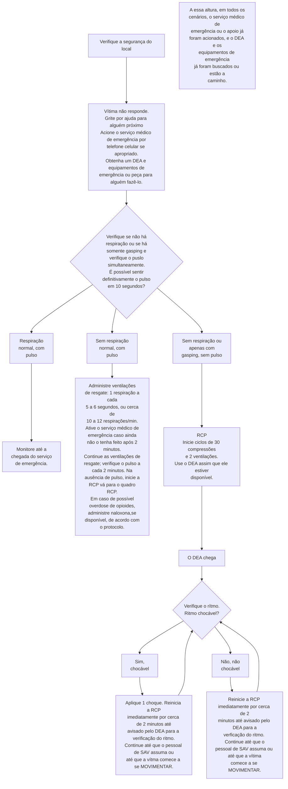
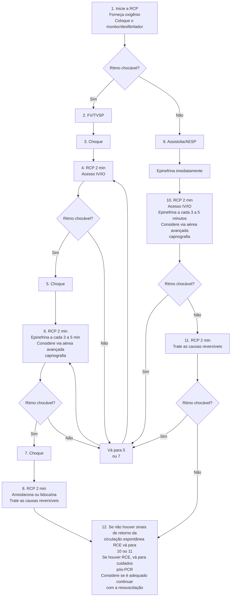
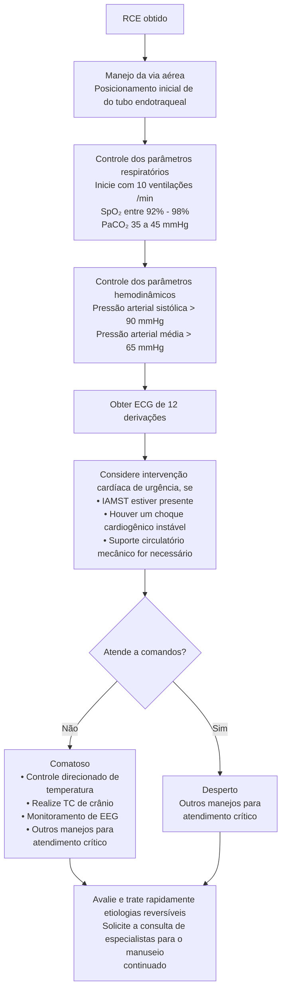

# ACLS E BLS

## BLS: principais passos! Segurança da cena, ajuda, DEA

- Checar respiração e pulso:
  - Normal→ monitorização
  - Com pulso, sem respiração => prover ventilação. 1 cada 6 segs pelo menos, vigilância para PCR.
  - Sem pulso, sem respiração => PCR
- **DEA:** pode ser usado por transeuntes.
- **ACLS**: definir ritmo; chocável (FV/TV) - aplicar choque, não chocável (AESP/ assistolia) - sem choque.
- **Compressões torácicas:** 100-120/min, profundidade adequada, sem interrupções*, trocar massageador.
- **Choque:** 200J bifásico e 360J monofásico
- **Ventilação:** não é imperativo intubar o paciente. 30:2/ sem via aérea definitiva: ininterrupta 1 ventilação a cada 6-8segs
- **Drogas:** Adrenalina (todas), Amiodarona e Lidocaína (FV/TV), demais drogas*

- **5Hs e 5Ts:** pensar a todo momento durante a PCR. Principalmente em ritmos não chocáveis.
- **5Hs:** Hipoxemia, Hidrogênio (acidose), Hiper/ hipocalemia, Hipotermia, Hipovolemia (Especialmente na pediatria)
- **5Ts:** Trombose coronária (IAM), TEP, Tamponamento pericárdico, Pneumotórax hipertensivo, Toxinas
- **Monitorização:** EtCO2, PAI (PA diastólica), sinais vitais, aumento de EtCO2, PAd => RCE
- **RCE:** ver o paciente da cabeça aos pés; ECG → supra → CATE; sem supra → posso esperar
- Controle direcionado de temperatura: ainda nos guidelines, mas sendo refutado.
- **Desfibrilação sequencial dupla.** Troca de vetor da PCR → FV/TV refratária.
- **Cesárea post-mortem:** 5 minutos de PCR em uma gestante → Realizar!

## 1. BLS - BASIC LIFE SUPPORT

### 1.1 CADEIA DE ATENDIMENTO

- PCR extra-hospitalar: recomendações e orientações gerais.
- Confira abaixo a Figura 1

### 1.2 FLUXOGRAMA

- Principais recomendações: garantir a segurança do local; verificar responsividade da vítima e, caso não haja, direcionar conduta e funções aos indivíduos transeuntes no local;
  1. Delegar função para: ligar ao serviço médico e buscar o DEA;
  2. Em situações atípicas (sem a possibilidade de auxílio), tentar ligar ao serviço de emergência para buscar auxílio.
- Verificar presença de pulso (em sítios centrais), e de incursões respiratórias;
  1. Respiração normal e pulso presente → monitorizar e aguardar chegada do serviço de emergência;

2. Sem respiração e com pulso → utilizar "pocket mask" ou respiração boca a boca. Na presença de AMBU, fornecer 1 ventilação a cada 6 segundos;

3. Sem respiração, ou apenas com gasping, sem pulso → iniciar massagem cardíaca – protocolo de RCP.

- Confira na página seguinte a Figura 2
- RCP → Ciclos de 30 compressões + 2 ventilações;
- Na presença do DEA:
  1. Ritmo chocável → aplicar 1 choque + reiniciar RCP imediatamente, por 2 minutos;
  2. Ritmo não chocável → Reiniciar RCP imediatamente por 2 minutos.
- OBS.: Sobre o DEA
  - Passo 1: Pressione o botão "ON";
  - Passo 2: Aplicar as pás, seguir as instruções do DEA;
  - Passo 3: Se instruído, aperte o botão de "CHOQUE".
  - PS: Instrumento feito para que leigos possam manejar um choque efetivo.
- Confira na página seguinte a Figura 3

**Figura 1** Cadeia de atendimento da PCR extra-hospitalar

Ativação da resposta de emergência → RCP de alta qualidade → Desfibrilação → Ressuscitação a vançada → Cuidados para parada cardíaca → Recuperação

EMERGÊNCIAS

**Figura 2** Fluxograma de atendimento à PCR pré-hospitalar (algoritmo do atendimento básico de vida)

ACLS/BLS

**Passo 1 –** pressione botão "ON" (de ligar)

----

**Passo 2 –** aplique as pás e siga as instruções do DEA

----

**Passo 3 –** Se instruído, aperte o botão de "choque"

**Figura 3** Passo a passo da utilização do DEA

## 1.3 SISTEMATIZANDO TODOS OS PASSOS MENCIONADOS

**Tabela 1** Sistematização do suporte básico de vida adulto

| Avaliação                                                                                                   | Avaliação, técnica e ação                                                                                                                                                                                                                                                                                                                                                                                                                                                                                                               | Imagem de suporte                                                                                                 |
| ----------------------------------------------------------------------------------------------------------- | --------------------------------------------------------------------------------------------------------------------------------------------------------------------------------------------------------------------------------------------------------------------------------------------------------------------------------------------------------------------------------------------------------------------------------------------------------------------------------------------------------------------------------------- | ----------------------------------------------------------------------------------------------------------------- |
| Verifique se a vítima responde                                                                              | Toque no ombro e chame em voz alta:
"Você está bem?"                                                                                                                                                                                                                                                                                                                                                                                                                                                                                | \[Image showing a person checking on a victim lying down, touching their shoulder]                                |
| Peça por ajuda para alguém próximo/acione o sistema de resposta de emergência e busque um DEA/desfibrilador | Grite por ajuda para alguém próximo

Acionar o serviço médico de emergência

Busque o DEA, se disponível, ou encarregue alguém de acionar o serviço médico de emergência e buscar um DEA ou desfibrilador                                                                                                                                                                                                                                                                                                               | \[Image showing two people, one attending to a victim and another calling for help]                               |
| Verifique a respiração e o pulso                                                                            | Para verificar se a respiração está ausente ou anormal (sem respiração ou apenas respiração agônica (gasping), verifique se o tórax se eleva e volta por, no mínimo, 5 e, no máximo, 10 segundos

Tente sentir o pulso por, no mínimo, 5, mas não mais de 10 segundos

Execute a verificação de pulso ao mesmo tempo em que verifica a respiração durante 10 segundos, para minimizar o atraso na RCP

Se, em 10 segundos, você definitivamente não sentir nenhum pulso, inicie a RCP com compressões torácicas | \[Image showing checking breathing by observing chest rise]

\[Image showing checking pulse on the wrist] |
| Desfibrile                                                                                                  | Se não sentir pulso, verifique se há ritmo chocável com um DEA/desfibrilador assim que ele chegar

Aplique choques, conforme indicado

Inicie a RCP imediatamente após cada choque, começando com as compressões                                                                                                                                                                                                                                                                                                        | \[Image showing defibrillation being performed on a victim]                                                       |

ACLS/BLS

# 2. ACLS – ADVANCED CARDIAC LIFE SUPPORT

## 2.1 CADEIA DE ATENDIMENTO

• Protocolo:
1. Acionamento do serviço médico de emergência;
2. RCP de alta qualidade;
3. Desfibrilação;

4. Ressuscitação avançada
5. Cuidados pós-PCR;
6. Recuperação.

## 2.2 FLUXOGRAMA

• Observe a imagem a seguir – Cadeia básica de atendimento ACLS.

### Qualidade da RCP

• Comprima com força (pelo menos 5 cm) e rápido (100 a 120/min) e aguarde o retorno total do tórax.
• Minimize interrupções nas compressões.
• Evite ventilação excessiva.
• Alterne os responsáveis pelas compressões a cada 2 minutos ou antes, se houver cansaço.
• Sem via aérea avançada, relação compressão-ventilação de 30:2
• Capnografia quantitativa com forma de onda: se ETCO2 estiver <10mmHg, melhorar qualidade da RCP
• Se PETCO₂ estiver baixo ou caindo, reavalie a qualidade da RCP
• PAI: pressão arterial diastólica <20: melhorar a qualidade da RCP

### Carga do Choque para Desfibrilação

• **Bifásica**: Recomendação do fabricante (por exemplo, dose inicial de 120 a 200 J): se desconhecida, usar o máximo disponível. A segunda dose e as subsequentes devem ser equivalentes, podendo ser consideradas doses mais altas.
• **Monofásica**: 360 J

### Tratamento Medicamentoso

• **Dose IV/IO de epinefrina:** 1 mg a cada 3 a 5 minutos
• **Dose IV/IO de amiodarona:** Primeira dose: Bolus de 300 mg. Segunda dose: 150 mg OU
• **Dose IV/IO de lidocaína:** Primeira dose: 1 a 1,5 mg/kg. Segunda dose: 0,5 a 0,75 mg/kg.

### Via aérea avançada

• Intubação endotraqueal ou via aérea extraglótica avançada
• Caprografia com forma de onda ou capnometria para confirmar e monitorar o posicionamento do tubo ET
• Quando houver uma via aérea avançada, administre 1 ventilação a cada 6 segundos (10 ventilações/min) com compressões torácicas contínuas

### Retorno da Circulação Espontânea (RCE)

• Pulso e pressão arterial
• Aumento abrupto prolongado da ETCO2 (tipicamente 35-40mmHg)
• Ondas de pressão arteria espontânea com monitoramento intra-arterial

### Causas reversíveis

• Hipovolemia
• Hidrogênio (acidemia)
• Hipo/hipercalemia
• Hipotermia
• Tensão do tórax por pneumotórax
• Tamponamento, cardíaco
• Toxinas
• Trombose coronária
• Trombose pulmonar

**Figura 4** Algoritmo de PCR para adultos

• Em cenário de parada cardiorrespiratória: Iniciar RCP; As compressões devem ser com força suficiente para um aprofundamento do tórax de 5 cm, com frequência entre 100-120 bpm, aguardando o retorno total do tórax;
• Fornecer oxigênio;
• Colocar o monitor/desfibrilador – Avaliar se o ritmo é chocável;
• Avaliação inicial - Ritmo chocável? Sim; FV/TVSP → Aplicar choque + reiniciar RCP por 2 minutos; Obter acesso IV ou IO. Não; Assistolia/AESP → aplicar epinefrina imediatamente; (1) Reiniciar RCP por 2 minutos; (2) Obter acesso IV ou IO; (3) Aplicar epinefrina a cada 3-5 minutos; (4) Considerar o uso de via aérea avançada, capnografia.
• Idealmente, de acordo com o protocolo ACLS, são orientados os locais para melhor posicionamento do líder da equipe e os membros da equipe durante simulações de casos e de eventos clínicos.

**Posições em equipes de alto desempenho para 6 pessoas**

| **Via aérea**                                                     |                                                          |                                        |
| ----------------------------------------------------------------- | -------------------------------------------------------- | -------------------------------------- |
| **Cronometrista
/ anotador**                                  | \[Figura central mostrando pessoa com coração no centro] | **Responsável pelo
desfibrilador** |
| **Responsável pela
compressão**                               |                                                          | **Instituto de RCP**                   |
| **Reme o responsável
pela compressão e
inicia o retorno** |                                                          | **Medicações IV/IO**                   |
| **Líder da equipe**                                               |                                                          |                                        |

**Figura 5** RCP com um time de alto desempenho

**Tabela 2** Funções do triângulo de ressuscitação

| FUNÇÕES DO TRIÂNGULO DE RESSUSCITAÇÃO                                                                                                                                                                                                                          |
| -------------------------------------------------------------------------------------------------------------------------------------------------------------------------------------------------------------------------------------------------------------- |
| Responsável pela compressão
Avalia o paciente
Executa as compressões de acordo com os protocolos locais
Alterna as pessoas a cada 2 minutos ou antes, se houver cansaço                                                                            |
| Responsável pelo desfibrilador/ instrutor de RCP
Busca e opera o DEA/monitor/desfibrilador e age como o instrutor de RCP designa
Se houver um monitor, coloca-o em uma posição em que possa ser visto pelo líder da equipe (ou pela maioria da equipe) |

| Via aérea
Abre a via aérea
Realiza ventilação com bolsa-máscara
Insere acessórios na via aérea conforme adequado                                          |
| --------------------------------------------------------------------------------------------------------------------------------------------------------------------- |
| A equipe tem seu próprio código. Nenhum membro da equipe deixa o triângulo, a não ser para alternar os responsáveis pelas compressões ou proteger a própria segurança |

**Tabela 3** Funções de liderança em uma RCP

| FUNÇÕES DE LIDERANÇA                                                                            |
| ----------------------------------------------------------------------------------------------- |
| Líder da equipe                                                                                 |
| Toda equipe de ressuscitação deve ter um líder definido                                         |
| Atribui funções aos membros da equipe                                                           |
| Toma decisões de tratamento                                                                     |
| Fornece feedback para o restante da equipe conforme a necessidade                               |
| Assume responsabilidade por funções não atribuídas                                              |
| Medicações IV/IO                                                                                |
| Uma função do profissional de SAV                                                               |
| Inicia o acesso IV/IO                                                                           |
| Administra medicações                                                                           |
| Cronometrista/anotador                                                                          |
| Anota os horários das intervenções e medicações (e comunica quando deverão ocorrer as próximas) |
| Anota a frequência e a duração das interrupções das compressões                                 |
| Informa isso ao líder da equipe (e ao restante da equipe)                                       |

• A AHA disponibiliza fluxogramas, para leigos e profissionais de saúde, para tratamento de pacientes com possível intoxicação por opiodes, nos quais se destaca a utilização de Naloxona (antídoto).

## 2.3 CAUSAS REVERSÍVEIS

• 5 Hs: Hipovolemia; Hipóxia; Hidrogênio, íon (acidose); Hipo ou hipercalemia; Hipotermia.
• *Hipoglicemia (especialmente na Pediatria)
• 5 Ts: Tensão (pneumotórax hipertensivo); Tensão no tórax (Pneumotórax hipertensivo); Tamponamento cardíaco; Toxinas; Trombose pulmonar; Trombose coronária.

ACLS/BLS

## 2.4 TRATAMENTO MEDICAMENTOSO

Dose IV/IO de epinefrina; 1 mg a cada 3-5 minutos.
OU
Dose IV/IO de lidocaína: 1ª dose: 1-1,5 mg/Kg; 2ª dose: 0,5-0,75 mg/ Kg.
OU
Dose IV/IO de amiodarona: 1ª dose: bolus de 300 mg; 2ª dose: 150 mg.

• Recomendação de Amiodarona e Lidocaína. Atualizada de 2023: Amiodarona ou lidocaína podem ser consideradas para FT/TVSP não responsiva a desfibrilação. Essas drogas podem ser particularmente úteis para pacientes com parada cardíaca presenciada, para quem o tempo de administração da droga pode ser menor (Classe IIb, NE B-R);

• Recomendação para Magnésio: atualizada de 2023. O uso rotineiro de magnésio para parada cardíaca não é recomendado em pacientes adultos (Classe III: sem benefício, NE C-LD); O magnésio pode ser considerado para Torsades de pointes (ou seja, TV polimórfica associada a intervalo QT longo) (Classe IIb, NE C-LD).

• Recomendação para o Cálcio: atualizada de 2023 Estudo realizado em 2021 – Conclusão: Entre adultos com parada cardíaca extra-hospitalar, o tratamento com cálcio EV não apresentou melhora significativa de retorno à circulação espontânea de modo sustentado. Utilizar Ca apenas se bem indicado

• Qualidades da RCP: Comprima com força (pelo menos 5 cm) e rapidez (100-120/min) e aguarde o retorno total do tórax; Minimize interrupções nas compressões; Evite ventilação excessiva; Alterne as pessoas que aplicam as compressões a cada 2 minutos ou antes, se houver cansaço; Sem via aérea avançada: relação compressão ventilação de 30-2; Capnografia quantitativa com forma de onda; Se ETCO2 < 10 mmHg, tente melhorar a qualidade da RCP.

• Pressão intra-arterial: Se pressão na fase de relaxamento (diastólica) < 20 mmHg, tente melhorar a qualidade da RCP.

• Carga do choque: Bifásica – Recomendação do fabricante (ex.: dose inicial de 120-200 J); se desconhecida, usar máximo disponível; A segunda aplicação e as subsequentes devem ser equivalentes, podendo ser consideradas doses mais altas. Monofásica: 360J.

• Via aérea avançada: intubação endotraqueal ou via aérea supraglótica avançada; Capnografia com forma de onda ou capnometria para confirmar e monitorar o posicionamento do tubo ET; Quando houver uma via aérea avançada, administre 1 ventilação a cada 6 segundos (10 ventilações/min) com compressões torácicas contínuas.

OBS.: a intubação orotraqueal não é mandatória em um cenário de PCR. De outro modo, é imperativo garantir uma boa ventilação.

• Retorno à circulação espontânea: melhora de pulso e pressão arterial; Aumento abrupto prolongado no ETCO2 (normalmente ≥ 35 - 40 mmHg); Sinal de onda espontâneo na pressão arterial com monitorização intra-arterial.

• Angiografia coronária: 2020: Atualizado; O CATE não necessita de imediato para pacientes que não possuem supra de ST, ou sinais de instabilidade elétrica, hemodinâmica.

• Cuidados pós-PCR – Avaliar: Nível de consciência; Via aérea; Inspeção pulmonar; Eletrocardiograma; Diurese; Monitorização contínua; Necessidade de drogas vasoativas.

• Demais condutas: Estabilização hemodinâmica; Otimização da ventilação mecânica; Controle glicêmico adequado; Diagnosticar e tratar isquemias miocárdicas agudas; Controle direcionado de temperatura; Avaliar prognóstico de recuperação neurológica.

• Portanto: pacientes pós RCE que apresentam:
  • ECG com supra
  • Instabilidade elétrica
  • Instabilidade hemodinâmica

• CATE imediato. Demais, esperar!

• Possível etiologia de PCR materna: A – Anestesia (complicações anestésicas); B – hemorragia ("Bleeding"); C – Cardiovascular; D – Medicamentos ("drugs"); E – Embolia; F – Febre; G – causas gerais não obstétricas de PCR (Hs e Ts); H – hipertensão

EMERGÊNCIAS

**Fase de estabilização inicial**

## Fase de estabilização Inicial

• A ressuscitação é contínua durante a fase pós-RCE e muitas destas atividades podem ocorrer ao mesmo tempo. No entanto, se a priorização for necessária, siga estas etapas:

• Manejo da via aérea: capnografia com forma de onda ou capnometria para confirmar e monitorar o posicionamento do tubo endotraqueal

• Controle dos parâmetros respiratórios: titule Fio2, para Spo2, de 92% a 98%; inicie em 10 ventilações/min; titule para

• PaCO2, de 35 a 45 mmHg

• Controle dos parâmetros hemodinâmicos: administre cristaloides e/ou vasopressores ou inotrópicos, visando uma pressão arterial sistólica
  • >90 mmHg ou pressão arterial média
  • >65 mmHg

## Manejo contínuo e atividades de urgência

• Estas avaliações devem ser realizadas ao mesmo tempo, para que as decisões sobre o controle direcionado da temperatura recebam alta prioridade como intervenções cardíacas.

• Avaliação inicial de eletrocardiograma (ECG) de 12 eletrodos: considere a hemodinâmica para tomar decisões em intervenções cardíacas

• Controle direcionado de temperatura: se o paciente não estiver atendendo a comandos, inicie o controle direcionado de temperatura assim que possível; comece entre 32°C e 36°C durante 24 horas usando um dispositivo de resfriamento com loop de feedback

• Outros manejos para atendimento crítico:

• monitoramento contínuo da temperatura central (esofágica, retal, bexiga)

• Manutenção de normoxia, normocapnia e euglicemia

• Monitoramento contínuo ou intermitente por eletroencefalograma (EEG)

• Ventilação mecânica protetora dos pulmões

## Hs e Ts

• Hipovolemia
• Hidrogênio (acidemia)
• Hipo/hipercalemia
• Hipotermia
• Tensão do tórax por pneumotórax
• Tamponamento, cardíaco
• Toxinas
• Trombose coronária
• Trombose pulmonar

**Figura 6** Fluxograma do manejo do paciente crítico e cuidados pós-PCR

ACLS/BLS                                                                                                                            9

## 2.5 PCR NA GRAVIDEZ

### Continue com SBV/SAVC
- RCP de alta qualidade
- Desfibrilação, se indicada
- Outras intervenções de SAVC (por exemplo, epinefrina)

↓

### Acione a equipe de PCR materna

↓

### Considere a etiologia da PCR

↓                                                           ↓

### Execute intervenções maternas
- Execute o manejo da via aérea
- Administre O2, a 100%, evite ventilação em excesso
- Obtenha acesso IV acima do diafragma
- Se o paciente estiver recebendo magnésio IV, pare e administre cloreto de cálcio ou gluconato.

↓

### Continue com SBV/SAVC
- RCP de alta qualidade
- Desfibrilação, se indicada
- Outras intervenções de SAVC (por exemplo, epinefrina).

### Execute intervenções obstétricas
- Realize o deslocamento uterino lateral contínuo
- Desconecte os monitores fetais
- Prepare-se para cesariana de emergência

↓

### Realize cesariana de emergência
- Se nenhum RCE acontecer em cinco minutos, considere uma cesariana de emergência imediata

### PCR materna
- O planejamento da equipe deve ser feito em colaboração com os serviços de obstetrícia, de neonatologia, de emergência, de anestesiologia, de terapia intensiva e de PCR.
- As prioridades para mulheres grávidas em PCR devem incluir a administração de RCP de alta qualidade e o alívio da compressão aortocaval com deslocamento uterino lateral.
- O objetivo da cesariana de emergência é melhorar os resultados para a mãe e para o feto.
- Idealmente, realize a cesariana de emergência em 5 minutos, dependendo dos recursos e dos conjuntos de habilidades do profissional.

### Via aérea avançada
- Na gravidez, uma via aérea difícil é comum. Escolha o profissional mais experiente.
- Realize intubação endotraqueal ou via aérea extraglótica avançada.
- Realize capnografia com forma de onda ou capnometria para confirmar e monitorar o posicionamento do tubo ET.
- Quando houver via aérea avançada, administre 1 ventilação a cada 6 segundos (10 ventilações/min) com compressões torácicas contínuas.

**Figura 7** PCR na gravidez

## 2.6 BÔNUS
• Estratégias de desfibrilação:

### Dual sequential defibrillation (DSD)

**Posicionamento dos desfibriladores:**
- Defib 1: posição anterolateral direita superior
- Defib 2: posição anterior central
- Defib 1: posição lateral esquerda inferior

**Configuração DSD com desfibrilador externo (DV):**
- 1A: posição anterior direita superior
- 2B: posição posterior esquerda
- 2A: posição anterior esquerda
- 1B: posição anterior direita inferior

**Figura 8** Estratégias úteis para FV/ TV refratárias

EMERGÊNCIAS

# REFERÊNCIAS

**Figura 1** Cadeia de atendimento da PCR extra-hospitalar

Adaptado de: ECC guidelines (2020 – American Heart Association)

**Figura 2** Fluxograma de atendimento à PCR pré-hospitalar (algoritmo do atendimento básico de vida)

Adaptado de: https://eccguidelines.heart.org/

**Figura 3** Passo a passo da utilização do DEA

Adaptado de: https://eccguidelines.heart.org/
