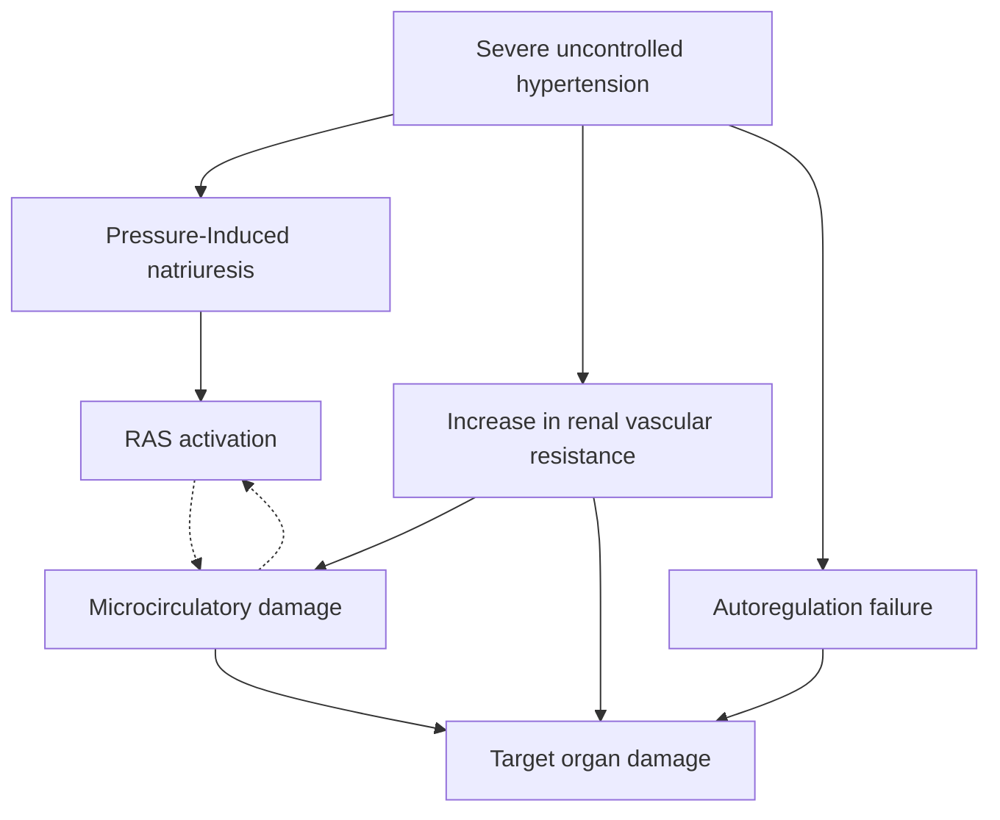

# EMERGÊNCIAS HIPERTENSIVAS

• **Emergência hipertensiva (EH):** PAS >180 mmHg e/ou PAD > 120 mmHg e lesão de órgão-alvo;
• Quais são os órgãos-alvo? Neurológico, cardíaco, vascular, renal;
• **Urgência hipertensiva (UH):** termo não existe mais e deve deixar de ser utilizado. Pressão arterial elevada assintomática:
  • Não precisa internar e pode ser tratada com anti-hipertensivos orais e encaminhamento ambulatorial.
• Na prova, o que é chamado de emergência hipertensiva? Encefalopatia hipertensiva, EAP hipertensivo, eclâmpsia, dissecção aórtica, infarto agudo do miocárdio com hipertensão associada, AVC, crise renal esclerodérmica, intoxicação por simpatomiméticos:
  • Mediante paciente com PA elevada e na suspeita de lesão de órgão-alvo, realizar investigação completa para identificar o caso;
• Avaliar fatores contribuintes para elevação de PA (que não EH): dor, agitação, hipervolemia, abstinência etc.
• **Tratamento:** redução da PA, além do tratamento específico para condição alvo, se existente.
  • Reduzir PA no primeiro momento em até 25%, com meta de normalização posteriormente
  • Exceções: AVC (trombólise), dissecção aguda de aorta, AVCh.
  • Utilizar vasodilatadores endovenosos (Brasil): nitroglicerina e nitroprussiato.
  • Depois, fazer o descalonamento com anti-hipertensivos orais.

## 1. CONCEITOS

• Como podemos definir um paciente com quadro de emergência hipertensiva?
  • Pacientes com pressão sistólica > 180 mmHg ou pressão diastólica > 120 mmHg e com sinais de lesão de órgão-alvo. Entre os órgãos afetados temos os sistemas: neurológico; cardíaco; vascular; renal.
• E a urgência hipertensiva?
  • Termo em desuso, começou a ser chamada de pressão arterial elevada assintomática, ou seja, elevação da pressão a valores de emergência hipertensiva, mas sem comprometimento do órgão-alvo.
• Sobre as emergências hipertensivas:
  • Eventos incomuns no departamento de emergência. Estimativas americanas afirmam que eles respondem por cerca de 1-2/1.000.000 casos;
  • As emergências mais comuns foram os eventos cerebrovasculares e o edema pulmonar cardiogênico.

### 1.1 FISIOPATOLOGIA

• Há alguma causa conhecida para emergência hipertensiva? Exemplos: EAP hipertensivo; eclâmpsia; dissecção aguda de aorta; infarto agudo do miocárdio; AVC; crise renal esclerodérmica; intoxicação por simpatomiméticos; hipertireoidismo; dor incontrolável.: Há uma causa conhecida? Investigar sempre! Há uma causa secundária? Tratá-la!
• As emergências hipertensivas são divididas em **primárias e secundárias**:
  • **Primárias:** a pressão arterial é o causador de todo o problema. Exemplos: Encefalopatia hipertensiva, SCAPE, IAM tipo II por hipertensão e lesão renal aguda.
  • **Secundárias:** a doença tem sua própria fisiopatologia, mas a hipertensão é um contribuinte importante e deve ser tratada também. exemplo: Eclâmpsia, AVCi e AVCh, dissecção de aorta.

**Figura 1** Fluxograma: fisiopatologia emergências hipertensivas

• O que vamos precisar avaliar nesse grupo de pacientes? Presença de TCE; Presença de sintomas neurológicos (estupor, coma, agitação, delirium, AVC); papiledema, evidência de lesões hipertensivas; dor torácica; náuseas ou vômitos; dor torácica; Dor nas costas de forte intensidade; dispneia; gestação, sinais de eclâmpsia, pré-eclâmpsia; uso de drogas. Realizar sempre avaliação clínica ampla, exames direcionados para sua hipótese diagnóstica e tratamento da PA junto ao quadro clínico.

## 1.2. QUAIS EXAMES SOLICITAR?

• Solicitar de acordo com a suspeita;
• Quais exames pedir?
  • ECG;
  • RX;
  • Urina tipo I;
  • Eletrólitos e função renal.
• TSH e T4L;
• Troponina e BNP;
• TC crânio ou RNM de crânio;
• TC contrastada de aorta.

## 2. TRATAMENTO

• Há realmente uma emergência hipertensiva?
  • Geralmente há necessidade de uma PAM > 135 mmHg naqueles pacientes que precisam de um tratamento intensivo da pressão (HAS) ou um pico pressórico muito elevado em pacientes normotensos;
  • Há sinal de lesão no órgão-alvo? Lesão renal aguda, alteração do nível de consciência e confusão, isquemia (ex.: infarto tipo II), edema pulmonar.

| Pressão arterial média (mmHg)          | 60   | 120                 | 160                      |
| -------------------------------------- | ---- | ------------------- | ------------------------ |
| Fluxo sanguíneo cerebral (mL/100g/min) | \~25 | 50-100 (Normotenso) | 50+ (Hipertenso crônico) |

**Figura 2** Pressão arterial

• O tratamento ideal da emergência hipertensiva varia de acordo com a emergência em questão, mas temos algumas medidas gerais – com algumas exceções:
• Não abaixar a pressão muito rápido;
• Lembrar a regrinha de ouro: 10-20% nas primeiras 1h-2h do quadro; 5-15% nas primeiras 24 horas até atingir 25% do valor inicial;Posterior normalização se possível.

**Exceções**

• Acidente vascular encefálico isquêmico: se trombólise → manter PA < 185/110mmHg; se não → tolerar até 220/120mmHg; Após trombólise, manter <180x105.

• Dissecção aguda de aorta: a pressão arterial sistólica deve ser reduzida rapidamente para 100-120mmHg (PAS); lembre-se de sempre utilizar primeiro o betabloqueador e depois o vasodilatador, isso porque o vasodilatador pode causar uma taquicardia reflexa;
• Acidente vascular cerebral hemorrágico: normalmente pressão arterial sistólica mantida entre 140-160 mmHg;
• Talvez seja mais adequado o uso da PAM, é o que o manguito realmente está medindo;
• PAM provavelmente tem uma correlação melhor; o risco parece estar mais associado à PAD do que à PAS; é mais fácil de se guiar através da PAM (1 variável apenas).

## 3. E A URGÊNCIA HIPERTENSIVA?

• Não há necessidade de admissão ou encaminhamento hospitalar e tratamento agressivo da PA desses pacientes;
• O tratamento é com anti-hipertensivos orais e encaminhamento para acompanhamento ambulatorial;
• Sempre avaliar tratar condições que podem estar levando o paciente a apresentar aumento da pressão arterial:
  • Dor: analgesia adequada;
  • Agitação: benzodiazepínicos, antipsicóticos;
  • Hipervolemia: diuréticos;
  • Abstinência: benzodiazepínicos, opioides;
  • Retenção urinária: sondagem vesical.
• Sempre acalmar o paciente quanto a benignidade do quadro e não necessidade de tratamento intensivo na emergência.

## 4. ANTI-HIPERTENSIVOS NA LITERATURA

• Agentes tituláveis: duração da ação menor que 30 minutos; devem ser dados em infusão contínua; exemplos: nitroglicerina, nitroprussiato, esmolol e clevedipina;
• Agentes quase tituláveis: duração da ação entre 1-2h; administrados em infusão contínua, mas com manejos mais complicados; exemplos: diltiazem, nicardipina;
• Agentes não tituláveis (bolus): duração da ação maior que 1-2 horas; medicações administradas em bolus; exemplos: labetalol, metoprolol.

## 5. MEDICAÇÕES

• Nitroglicerina (5mg/mL):
  • Promove vasodilatação coronariana;
  • Tem meia-vida curta;
  • Contraindicações: utilização de inibidores da fosfodiesterase; hipertensão intracraniana; PRESS;
  • Efeitos adversos: dor de cabeça, taquicardia reflexa e taquifilaxia.
• Nitroprussiato de sódio (25mg/mL):
  • Tem meia vida-curta;
  • Pode ocasionar roubo de fluxo coronariano, aumento da pressão intracraniana e variações abruptas de pressão arterial;
  • A infusão contínua piora a acidose lática e pode promover intoxicação por cianeto;

EMERGÊNCIAS                                                                                                                                                   3

• Transicionar as medicações em endovenosas para a via oral. Temos como opções:
  • Bloqueadores dos canais de cálcio;
  • IECA/BRA;
  • Hidralazina;
  • Nitratos;
  • Betabloqueadores;
  • Clonidina.
