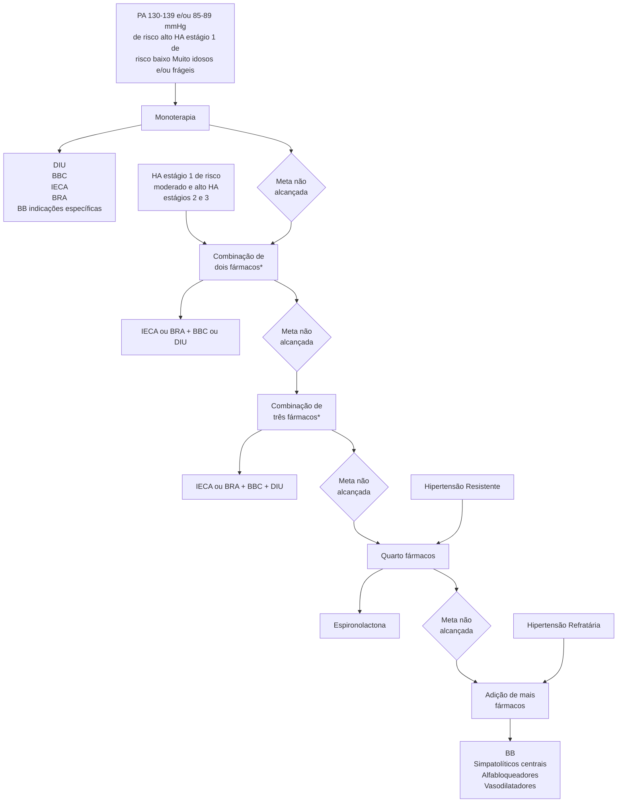
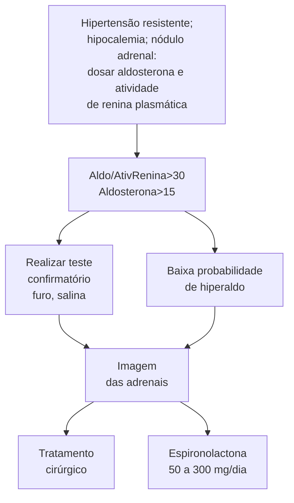

HAS Primária (CM)

# HAS AMBULATORIAL

• **Diagnóstico:** Pressão Arterial (PA) ≥ 140 x 90 mmHg em 2 consultas (SBC); OU PA ≥ 180 x 110 mmHg medida isolada; OU Medidas residenciais (MRPA ou MAPA) com PA média ≥ 130 x 80 mmHg.

• **HA mascarada:** Níveis pressóricos normais no consultório, mas elevados no MAPA ou MRPA. HA avental branco: PA elevada no consultório, mas normal fora dele.

• **Tratamento:**
  • Não farmacológico – perder peso, dieta DASH, regular o consumo de Na e álcool, atividade física;
  • Farmacológico: IECA/BRA, DIU, BCC são primeira linha. Iniciar com duas medicações em doses otimizadas se estágios 2 ou 3 (PAS 160 – 179 e/ou PAD 100-109).

• **HAS resistente:** 3 fármacos. **HAS refratária:** 5 fármacos. E ainda se mantém hipertenso.

• **HAS secundária:** Investigar se HA estágio 3 antes dos 30 ou após os 55 anos; HAS resistente ou refratária, uso de medicações associadas à hipertensão; tríade do Feocromocitoma ou indícios de SAHOS (síndrome da apneia/hipopneia obstrutiva do sono); assimetria ou ausência de pulsos em MMII (membros inferiores), hipocalemia espontânea ou importante induzida por diuréticos < 3,0 mEq/L:

• As principais causas de HAS secundária são: SAHOS, estenose bilateral de artérias renais, coarctação de aorta, feocromocitoma, hiper e hipotireoidismo, hiperaldosteronismo primário, síndrome de Cushing.

• **Crises hipertensivas** são divididas em: pseudocrise (PA aumentada por outros motivos – dor, ansiedade), urgência hipertensiva (PA≥ 180x120 com sintomas, mas sem lesão de órgão-alvo ex: epistaxe, IC descompensada), emergência hipertensiva (PA≥ 180x120 com lesão de órgão-alvo), HAS crônica não controlada (PA≥ 180x120 sem sintomas ou lesões de órgão-alvo).

• Via de regra, emergência hipertensiva deve ser tratada com nitroprussiato de sódio EV em sala de emergência.

## 1. INTRODUÇÃO

• A Hipertensão Arterial Sistêmica (HAS) é o principal fator de risco modificável com associação independente, linear e contínua para doenças cardiovasculares (DCV), doença renal crônica (DRC) e morte prematura.

## 2. DIAGNÓSTICO

• Pressão Arterial (PA) ≥ 140 x 90 mmHg em 2 consultas (SBC);
• OU – PA ≥ 140 x 90 mmHg + alto risco cardiovascular (consultar tabela abaixo); OU
• PA ≥ 180 x 110 mmHg medida isolada; OU
• Medidas residenciais (MRPA – Medida Residencial da PA – ou MAPA – Medida Ambulatorial da PA) com PA média ≥ 130 x 80 mmHg.

**Tabela 1 Fatores de risco coexistentes na hipertensão arterial**

| Fatores de risco coexistentes na hipertensão arterial (alto risco cardiovascular)                                                                                  |
| ------------------------------------------------------------------------------------------------------------------------------------------------------------------ |
| Sexo masculino                                                                                                                                                     |
| Idade: > 55 anos no homem e > 65 na mulher                                                                                                                         |
| DCV prematura em parentes de 1º grau (homens < 55 anos e mulheres < 65 anos)                                                                                       |
| Tabagismo                                                                                                                                                          |
| Dislipidemia: LDL – colesterol ≥ 100 mg/dL e/ou não HDL – colesterol 130mg/dL e/ou HDL – colesterol ≤ 40 mg/dL no homem e ≤ 46 mg/dL na mulher e/ou TG > 150 mg/dL |
| Diabetes melito                                                                                                                                                    |
| Obesidade (IMC ≥ 30 kg/M2)                                                                                                                                         |

• Confira na página seguinte a **Figura 1**

## 3. CONCEITOS

### 3.1 HIPERTENSÃO ARTERIAL (HA) MASCARADA
• Níveis pressóricos normais no consultório mas elevados no MAPA ou MRPA (acontece em pessoas com alta carga de estresse no cotidiano, por exemplo).

### 3.2 HA AVENTAL BRANCO
• PA elevada no consultório, mas normal fora dele.

### 3.3 ETAPAS IMPORTANTES A SEREM REALIZADAS NA PRIMEIRA CONSULTA
• Confirmação do diagnóstico;
• Classificar entre HA Primária ou secundária? HA secundária é aquela causada por alguma doença de base, enquanto que a primária não. Quando desconfiar de HA secundária?
• HA estágio 3 <30 anos ou > 55 anos;
• HAS resistente ou refratária;
• Uso de medicações sabidamente hipertensivas;
• Suspeita de feocromocitoma, SAHOS;
• Assimetria ou ausência de pulsos em MMII;
• Hipocalemia espontânea ou importante.

### 3.4 ESTRATIFICAÇÃO DE RISCO CARDIOVASCULAR (RCV)
• Pesquisar ativamente Lesão de órgão-alvo: Pesquisar por meio da solicitação do ECG (em busca de HVE), dosagem de creatinina com TFG e pesquisa de microalbuminúria ou relação albumina/creatinina na urina (em busca de DRC). Importante realizar o Índice Tornozelo Braquial (ITB) para pesquisa de Doença Arterial Obstrutiva Periférica (DAOP). Exame de fundo de olho para pesquisar retinopatia hipertensiva.

CARDIOLOGIA

**Dorso recostado na cadeira e relaxado**

**Sem conversas durante e entre as medições**

**Manguito de tamanho adequado ao braço**

**Braço deve estar apoiado na altura do coração**

**Acrômio**

**Olécrano**

**Pés apoiados no chão**

**Esses equipamentos devem ser validados e sua calibração deve ser verificada anualmente, de acordo com as orientações do INMETRO**

**Figura 1** Técnica adequada para aferição da pressão arterial

## 3.5 METAS DA PA

• Atenção para a maior tolerabilidade para idosos frágeis.

**Tabela 2** Metas de pressão arterial

| Meta                 | RCV Baixo ou Moderado | RCV Alto |
| -------------------- | --------------------- | -------- |
| PA Sistólica (mmHg)  | < 140                 | 120-129  |
| PA Diastólica (mmHg) | < 90                  | 70-79    |

**Tabela 3** Metas de pressão arterial

|                | PAS consultório
Limiar de tratamento | PAS consultório
Meta | PAD consultório
Limiar de tratamento | PAD consultório
Meta |
| -------------- | ---------------------------------------- | ------------------------ | ---------------------------------------- | ------------------------ |
| Hígidos        | ≥ 140                                    | 130-139                  | ≥ 90                                     | 70-79                    |
| Idosos frágeis | ≥160                                     | 140-149                  | ≥90                                      | 70-79                    |

HAS AMBULATORIAL                                                                                                    3

# 4. TRATAMENTO

## 4.1 TRATAMENTO NÃO FARMACOLÓGICO

**Tabela 4** Tratamento não farmacológico

| Medida                         | Redução aproximada da PAS/PAD                                                                                          | Recomendação                                                                                                                        |
| ------------------------------ | ---------------------------------------------------------------------------------------------------------------------- | ----------------------------------------------------------------------------------------------------------------------------------- |
| Controle de peso               | 20-30% de diminuição da PA para cada 5% de perda corporal                                                              | Manter IMC < 25 kg/m2 até 65 anos.
Manter IMC < 27 kg/m2 após 65 anos.
Manter CA < 80 cm nas mulheres e < 94 cm nos homens. |
| Padrão alimentar               | Redução de 6,7/3,5 mmHg                                                                                                | Adotar dieta DASH                                                                                                                   |
| Restrição do consumo de sódio  | Redução de 2 a 7 mmHg na PAS e de 1 a 3 mmHg na PAD com redução progressiva de 2,4 a 1,5 g sódio/dia, respectivamente. | Restringir o consumo diário de sódio para 2,0 g, ou seja, 5 g de cloreto de sódio.                                                  |
| Moderação no consumo de álcool | Redução de 3,31/2,04 mmHg com a redução de 3-6 para 1-2 doses\*/dia                                                    | Limitar o consumo diário de álcool a 1 dose nas mulheres e pessoas com baixo peso e 2 doses no homem                                |

**Figura 2** Fluxograma de tratamento da HAS ambulatorial

## 4.2 ATIVIDADE FÍSICA

**Tabela 5** Recomendações de prática de atividade física e exercício físico.

| Recomendações de prática de atividade física e exercício físico.          |
| ------------------------------------------------------------------------- |
| Redução do comportamento sedentário - NE: B GR: IIb:                      |
| Levantar por 5 minutos a cada 30 minutos sentado                          |
| Recomendação atividade física populacional - NE: A, GR: I                 |
| Realizar, pelo menos, 150 minutos por semana de atividade física moderada |
| Treinamento físico - aeróbico complementado pelo resistido - NE: A. GR: I |

## 4.3 TRATAMENTO FARMACOLÓGICO - MEDICAMENTOS DE PRIMEIRA LINHA

• Legenda: M: Mecanismo de ação; EA: Efeitos adversos; CI: Contraindicação.

• IECA (inibidor da enzima conversora de angiotensina I):
  • M: Inibe enzima conversora de angiotensina I e a degradação de bradicinina (a bradicinina promove a vasodilatação).
  • EA: Tosse seca (nesses casos, opta-se por trocar por BRA), angioedema, erupção cutânea, hipercalemia. Em caso de declínio da função renal > 30% após introdução do remédio, pensar em estenose bilateral de artérias renais.
  • CI: Na gravidez. Se K+ > 5,5.

• BRA:
  • M: Bloqueio dos receptores AT1 antagonizando a ação da angiotensina II (vasoconstritor).
  • EA: Hipercalemia, contraindicado na gravidez. Não associar BRA e IECA.
• Diuréticos Tiazídicos (DIU):
  • M: Redução do volume circulante e volume extracelular. Redução da resistência vascular periférica (RVP), principalmente após um tempo de uso. Principais representantes da classe: Hidroclorotiazida e Clortalidona (diurético mais potente).
  • EA: Hiperuricemia (gota), hipocalemia, hipomagnesemia (arritmias), maior risco de DM tipo 2.
• Bloqueador de canal de cálcio (BCC):
  • M: Redução da resistência vascular periférica por diminuição da concentração de cálcio nas células musculares lisas vasculares.
  • EA: Edema maleolar, cefaleia, tontura, rubor facial, dermatite ocre, hipertrofia gengival. Dentre os Diidropiridínicos, o Anlodipino e o nifedipino são os principais representantes.
• Estágios (determina com quantos medicamentos o tratamento irá iniciar):
  • Estágio 1: PAS 140-159 e/ou PAD 90-99.
  • Estágio 2: PAS 160 – 179 e/ou PAD 100-109.
  • Estágio 3: PAS ≥ 180 e/ou PAD ≥ 110.
  • Confira na página anterior a Figura 2.
• HA resistente: Em uso de 3 anti-hipertensivos, incluindo um diurético, em dose adequada, e ainda hipertenso ou controlado com 4 drogas. Mais relacionada à retenção persistente de fluidos: indicada espironolactona.
• HA refratária: Em uso de 5 anti-hipertensivos, incluindo um diurético de longa ação e espironolactona e ainda hipertenso. Mais relacionada à hiperreatividade simpática.

**Figura 3** Estenose unilateral de artéria renal.

**Figura 4** Corrosão das costelas por um recrutamento das artérias do tórax como circulação colateral para os membros inferiores.

## 5. HAS SECUNDÁRIA

### 5.1 SÍNDROME DA APNEIA OBSTRUTIVA DO SONO
• Causa mais comum de hipertensão secundária.
• Roncos, sonolência diurna, fadiga, dificuldade de concentração.
• Relacionado a obesidade e aumento na circunferência cervical.
• Diagnóstico: polissonografia.

### 5.2 RENOVASCULAR
• Sopro abdominal, EAP repetição, piora de função renal > 20% após inícios de IECA/BRA.
• Diagnóstico: Doppler de artérias renais, angio TC/RM, arteriografia renal (padrão ouro).
• Em mulheres jovens, pensar em displasia fibromuscular como etiologia da estenose.
• Em idosos, pensar em aterosclerose. Figura 3

### 5.3 COARCTAÇÃO DE AORTA
• Desconfiar se o paciente apresentar PA e pulsos reduzidos em MMII (pelo menos 10 mmHg que os MMSS).
• Rx Tórax: **corrosão de costelas** (circulação colateral para irrigação da parte inferior do corpo).
• ECO e/ou angio TC de tórax para o diagnóstico.

**Figura 5** Coarctação de aorta: observar ingurgitação da circulação colateral (setas brancas).

HAS AMBULATORIAL                                                                                                                  5

## 5.4 HIPERALDOSTERONISMO PRIMÁRIO

- Quando suspeitar: hipocalemia + hipertensão resistente.
- Se Aldosterona/ Atividade de Renina > 30 ou Aldosterona > 15, realizar teste confirmatório, que, se positivo, deve prosseguir com imagem das adrenais.
- O tratamento pode ser cirúrgico ou clínico, com espironolactona 50-300 mg/dia.

**Figura 6** Fluxograma para investigação de HAS resistente

## 5.5 SÍNDROME DE CUSHING

- O Diagnóstico é formado com Cortisol urinário (24h) > 55 mcg e Teste de supressão do cortisol positivo (cortisol matinal basal e matinal 8h após dexametasona > 1,8 mcg/dL).
- RNM → indicada para a pesquisa de tumoração.
- Confira na página seguinte a **Figura 7**

## 5.6 FEOCROMOCITOMA

- Hipertensão paroxística com cefaleia, sudorese e palpitações.
- Diagnóstico: Metanefrinas plasmáticas livres (ideal) ou metanefrinas + catecolaminas urinárias (mais acessível). Se os anteriores forem positivos, solicitar TC e RM para pesquisa do feocromocitoma.
- Tratamento cirúrgico.

## 5.7 OUTRAS CAUSAS DE HIPERTENSÃO SECUNDÁRIA

**Tabela 6** Outras causas de hipertensão secundária

| Diagnóstico      | Quadro clínico                                      | Investigação   |
| ---------------- | --------------------------------------------------- | -------------- |
| Hipotireoidismo  | Ganho de peso, fadiga, queda de cabelo, fraqueza    | TSH e T4 livre |
| Hipertireoidismo | Perda de peso, palpitações, exoftalmia, hipertermia | TSH e T4 livre |

# 6. CRISE HIPERTENSIVA

## 6.1 CONCEITOS

- PSEUDOCRISE HIPERTENSIVA
  - PA elevada em contexto de sintomas inespecíficos
- URGÊNCIA HIPERTENSIVA
  - PAD ≥ 120 mmHg sem lesão de órgão alvo
- EMERGÊNCIA HIPERTENSIVA
  - PAD ≥ 120 mmHg com lesão de órgão alvo aguda e progressiva
- Na pseudocrise hipertensiva, será administrado apenas anti-hipertensivo.
- Lesões de órgão-alvo: Dissecção aguda de aorta; Infarto agudo do miocárdio; Angina instável; Edema agudo de pulmão; HAS acelerada maligna; AVCi, AVCh, HSA; Síndromes hipertensivas na gestação.

## 6.2 CONDUTA

- Urgência hipertensiva: Anti-hipertensivo VO (captopril, clonidina) e reavaliação ambulatorial precoce.
- Emergência hipertensiva: Anti-hipertensivo IV (maioria das vezes: nitroprussiato) e internação hospitalar.
- Emergências Hipertensivas em situações especiais:

**Tabela 7** Emergências hipertensivas

| Hipertensão
Acelerada Maligna | Retinopatia com PAPILEDEMA, necrose fibrinoide de arteríolas renais (IRA rapidamente progressiva) e endarterite obliterante → IRA, IC. |
| --------------------------------- | -------------------------------------------------------------------------------------------------------------------------------------- |
| Encefalopatia
Hipertensiva    | Confusão mental, cefaleia, náuseas e vômitos.                                                                                          |
| AVCi                              | Reduzir a PA < 185 x 110 mmHg SE TROMBÓLISE. Do contrário, tolerar até 220 x 120 mmHg.                                                 |
| AVCh                              | Alvo de PAS < 160 mmHg.                                                                                                                |

- Edema agudo de pulmão é uma emergência hipertensiva que deve ser tratada da seguinte forma: Nitrato EV (nitroprussiato, nitroglicerina). Preferir nitroglicerina em pacientes em IAM. Furosemida (0,5-1 mg/kg); Decúbito elevado e pernas pendentes; Oxigênio - VNI; Morfina → para o desconforto respiratório.

CARDIOLOGIA

**Figura 7** Características da Síndrome de Cushing

- Bochechas vermelhas
- Coxins de gordura (corcova de búfalo)
- Face em forma de lua
- Facilidade de contusões equimoses
- Pele fina
- Estrias vermelhas
- Alcalose por hipercalemia
- Osteoporose Antebraços e pernas finos
- Abdome "em pêndulo"
- Má cicatrização de feridas

**Figura 8** Fundo de olho: Papila bem delineada. Retinografia revelando disco óptico de limites nítidos no olho direito.

**Figura 9** Fundo de olho: Papila com contornos borrados/ mal definidos (papiledema). Borramento dos bordos do disco óptico no olho esquerdo.

HAS AMBULATORIAL

# REFERÊNCIAS

**Figura 2** Fluxograma de tratamento da HAS ambulatorial

Adaptado de: Diretrizes Brasileiras de Hipertensão Arterial – 2020. Barroso et al.

**Figura 3** Estenose unilateral de artéria renal.

https://radiopaedia.org/cases/renal-artery-stenosis-1?lang=us

https://doi.org/10.1161/CIRCULATIONAHA.108.838029

**Figura 4** Corrosão das costelas por um recrutamento das artérias do tórax como circulação colateral para os membros inferiores.

https://doi.org/10.1161/CIRCULATIONAHA.108.838029

**Figura 5** Coarctação de aorta: observar ingurgitação da circulação colateral (setas brancas).

https://doi.org/10.1161/CIRCULATIONAHA.108.838029

**Figura 8** Fundo de olho: Papila bem delineada. Retinografia revelando disco óptico de limites nítidos no olho direito.

https://doi.org/10.1590/S0034-72802009000300009

**Figura 9** Fundo de olho: Papila com contornos borrados/ mal definidos (papiledema). Borramento dos bordos do disco óptico no olho esquerdo.

https://doi.org/10.1590/S0034-72802009000300009
