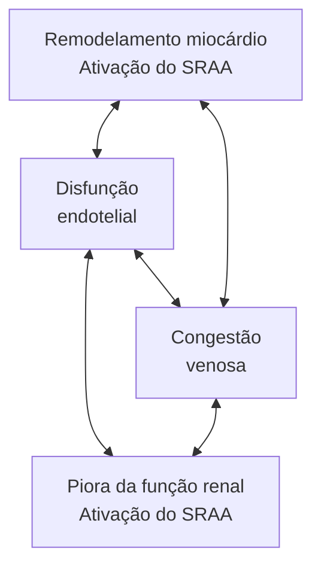
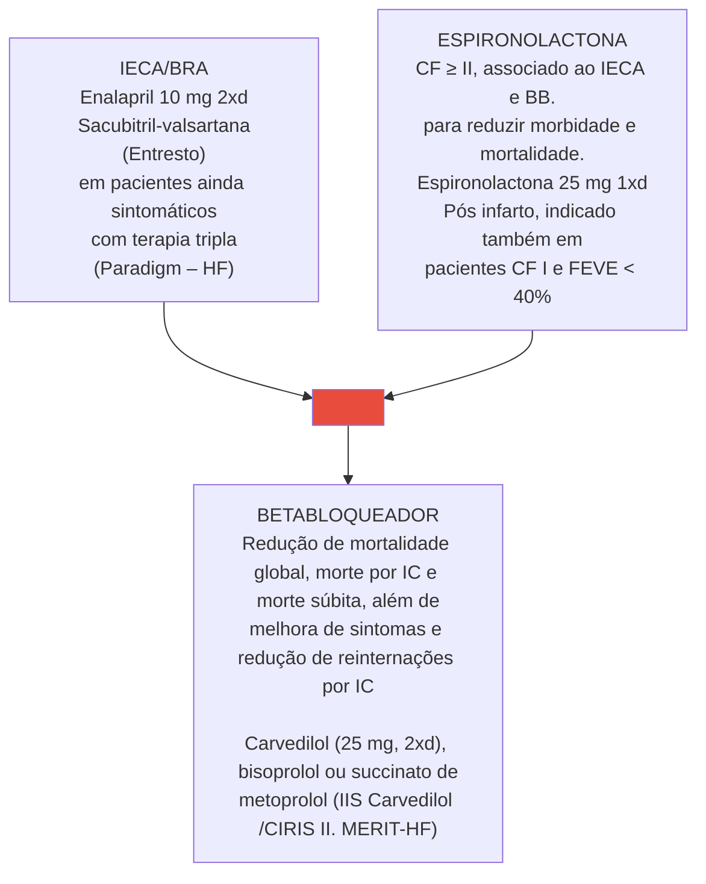
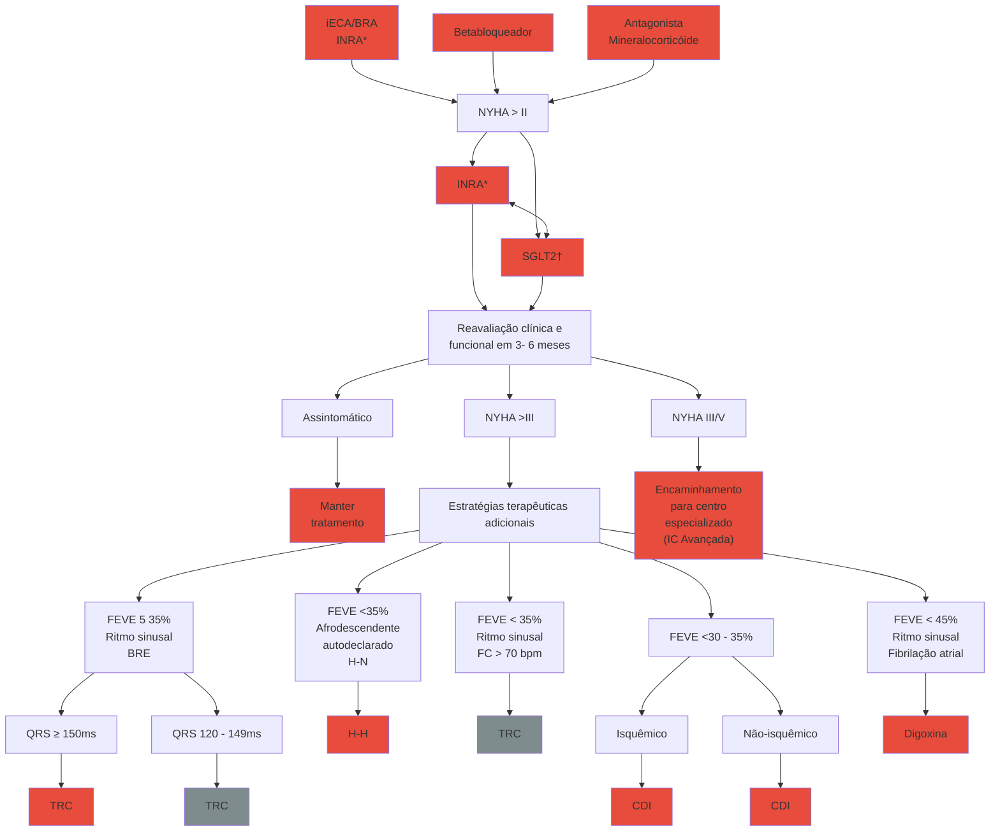
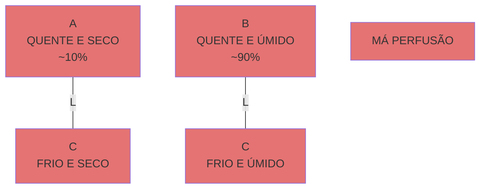

ICC Ambulatorial (CM)

# INSUFICIÊNCIA CARDÍACA -MANEJO AMBULATORIAL

• A Insuficiência Cardíaca é uma síndrome clínica resultante da dificuldade do coração em receber ou em ejetar sangue adequadamente.
• A fração de ejeção do ventrículo esquerdo pode estar preservada (≥ 50%), levemente reduzida (40 – 49%) ou reduzida ( ≤ 40%).
• Manifestação clínica: sintomas de má perfusão e/ou de congestão.
  • Critérios de Framingham:
  • Maiores (mais específicos): DPN, Turgência jugular a 45°, refluxo hepatojugular, estertores pulmonares crepitantes, cardiomegalia ao raio-X de tórax, edema pulmonar agudo, B3.
  • Menores: edema do tornozelo bilateral, tosse noturna, dispneia aos mínimos esforços, derrame pleural, taquicardia.
• Exames complementares importantes: Radiografia de tórax, Bnp, ECG, ecocardiograma.
• Classificação NYHA: baseada em sintomas (aplica-se aos estágios C e D da classificação do ACC).
• Diagnóstico na IC FEP: É clínico... usar os escores (ex: H2FPEF) se dúvida.
• Tratamento da ICFE REDUZIDA com redução de mortalidade:

• Betabloqueador (apenas carvedilol, succinato de metoprolol, bisoprolol), IECA/BRA, espironolactona. Se com essa terapia o paciente permanecer sintomático, associar iSGLT-2 e trocar IECA/BRA por Sacubitril-Valsartana.
• Na troca de IECA para Sacubitril-Valsartana (INRA) deve-se esperar 36 horas entre a última dose do IECA e a primeira de INRA pelo risco de angioedema (washout)
• Se mesmo em terapia quádrupla o paciente permanecer sintomático, considerar terapias adicionais a depender do perfil do paciente: hidralazina + nitrato (negro, contraindicação a IECA/BRA), ivabradina (FC > 70 bpm, ritmo sinusal), terapia de ressincronização cardíaca (BRE), digoxina (fibrilação atrial com FC ainda não controlada).
• O CDI reduz as taxas de morte súbita em todos os pacientes com IC FE ≤ 35%, mas aqueles com etiologia isquemica tem benefício maior, pois têm mais fibrose (substrato para arritmias malignas).
• Tratamento da ICFE PRESERVADA: iSGLT-2, diuréticos para congestão, tratamento da etiologia e das comorbidades.

## 1. CONSIDERAÇÕES INICIAIS

### 1.1 DEFINIÇÃO

• Clássica: Incapacidade cardíaca em bombear sangue suficiente para atender às demandas metabólicas do tecido ou, o faz às custas de elevadas pressões de enchimento.
• Moderna: Sinais e sintomas resultantes dos prejuízos no enchimento ventricular ou na ejeção de sangue.
• Classificações: Fração de ejeção: ICFE reduzida: ≤ 40%; ICFE levemente reduzida: 40 – 49%; ICFE preservada: ≥ 50%.

OBS: ICFE melhorada é definida como o quadro com FE ≤ 40%, com elevação de, pelo menos, 10% para níveis acima de 40% após o tratamento. Nesses casos, deve-se manter o tratamento medicamentoso.

### 1.2 CLASSIFICAÇÃO DO ACC

• Enfatiza o desenvolvimento e progressão da doença; Logo, correlaciona fatores de risco, alterações estruturais/funcionais e presença de sintomas.

**Critérios:**

**A.** Presença de fatores de risco para o desenvolvimento de IC – HAS, DAC, uso de cardiotóxicos, história familiar de cardiomiopatias;

**B.** Presença de alterações estruturais e/ou aumento das pressões de enchimento e/ou aumento de BNP/ troponina, sem sintomatologia;

**C.** Sinais e sintomas de IC; D – IC refratária ("avançada").

### 1.3 ETIOLOGIAS

• Alterações estruturais e/ou funcionais cardíacas: Infartos prévios – etiologia isquêmica; Hipertensão arterial;
• Doença de Chagas;
• Valvopatias;
• Cardiomiopatias – dilatadas, hipertróficas, restritivas;
• Outras causas: Congênitas; Cardiotoxicidade; Alcoólica; Taquicardiomiopatia; Miocardites; Periparto.

## 2. MANIFESTAÇÕES CLÍNICAS E DIAGNÓSTICO

### 2.1 EXPRESSÃO CLÍNICA

• A expressão clínica vem da limitação do coração em atender as demandas teciduais, levando a sinais e sintomas de baixo débito. Temos também altas pressões de enchimento, com congestão pulmonar e sistêmica.

### 2.2 SINAIS E SINTOMAS

• Critérios de Framingham: Diagnóstico: 2 critérios maiores e 1 menor OU 1 critério maior e 2 critérios menores;
• Confira na página seguinte a Tabela 1

### 2.3 EXAMES COMPLEMENTARES

• BNP e NT-proBNP: São biomarcadores diagnósticos e prognósticos;
  1. Pior prognóstico: valores elevados ou que não reduzem com tratamento;

2. Situações que podem elevar: anemia, DRC, idade avançada;
3. Situações que podem reduzir: obesidade;
4. Níveis improváveis para IC: BNP <100 pg/mL ou NT-proBNP < 300pg/mL
• ECG – eletrocardiograma;
• Radiografia de tórax;
• Ecocardiograma; Demonstra capacidade para detectar alterações funcionais (pelo aumento das pressões de enchimento – disfunção diastólica, aumento de PSAP) ou estruturais. É útil no seguimento do paciente com IC.

**Tabela 1 Critérios de Framingham**

| Critérios maiores                 | Critérios menores             |
| --------------------------------- | ----------------------------- |
| Dispneia paroxística noturna      | Edema do tornozelo bilateral  |
| Turgência jugular a 45°           | Tosse noturna                 |
| Refluxo hepatojugular             | Dispneia aos mínimos esforços |
| Estertores pulmonares crepitantes | Derrame pleural               |
| Cardiomegalia ao raio-X de tórax  | Taquicardia                   |
| Edema pulmonar agudo              |                               |
| B3                                |                               |

## 2.4 CLASSIFICAÇÃO NYHA

• Baseada nos sintomas; Ou seja, aplica-se aos pacientes do estágio C e D da classificação do ACC (sintomáticos), dividindo os pacientes em classes funcionais I, II, III e IV. Figura 1

## 3. FISIOPATOLOGIA

• Em longo prazo: Há perpetuação dos danos estruturais cardíacos, favorecendo a ativação contínua dos mecanismos neuro-hormonais. Assim, em última instância, ocorre remodelamento do ventrículo esquerdo.

**Figura 2 Fisiopatologia da insuficiência cardíaca**

----

**New York Heart Association (NYHA)**
# Classificação de insuficiência cardíaca

**Classe I - Sem limitação da atividade física. Atividade física comum não causa sintomas**

**Classe II - Leve limitação da atividade física. Confortável em repouso. Atividade física comum causa sintomas.**

**Classe III - Limitação acentuada da atividade física. Confortável em repouso, mas menos do que a atividade normal já causa sintomas.**

**Classe IV - Limitação severa e desconforto com atividade física. Sintomas presentes mesmo em repouso.**

**Figura 1 Esquema representativo da classificação NYHA**

INSUFICIÊNCIA CARDÍACA MANEJO AMBULATORIAL                                                                              3

## 4. TRATAMENTO - ICFE REDUZIDA

### 4.1 NÃO FARMACOLÓGICO
• Evitar sal > 7g/dia; Reabilitação cardiopulmonar para ICFEr em classes funcionais II e III (NYHA); Exercício aeróbico; Útil para melhorar a qualidade de vida e capacidade funcional. Vacinação – influenza e pneumococo; Reduz a frequência de descompensações.

### 4.2 FARMACOLÓGICO
• Até pouco tempo atrás, era marcado pela tríade: IECA/ BRA, betabloqueadores e espironolactona. **Figura 3**
• Betabloqueadores:
  • NA IC FE REDUZIDA, apenas três reduzem mortalidade: carvedilol, bisoprolol e succinato de metoprolol.
  • Abaixo, alguns detalhes a mais sobre a classe dos betabloqueadores.
    • Seletivos: bloqueiam apenas o receptor B1: Bisoprolol, succinato de metoprolol, atenolol, nebivolol.
    • Não seletivos: Carvedilol, pindolol, propranolol.
  • Contraindicações: BAV 1° grau com intervalo PR > 240 ms; BAV 2° ou 3° grau; Choque; Hipotensão grave; Asma/DPOC grave – especialmente para os medicamentos não- cardiosseletivos; DAOP crítica – especialmente para os medicamentos não-cardiosseletivos.

• Efeitos colaterais: Broncoespasmo; Especialmente para os medicamentos não-cardiosseletivos. Hipotensão; Bradicardia; Fraqueza, sonolência (nos primeiros dias); Piora da DAOP.
• Terapia quádrupla: útil ao paciente sob terapia tripla, que ainda permanece sintomático; IECA/BRA ou INRA – inibidor do receptor da angiotensina e neprilisina; Antagonista dos receptores mineralocorticóides; Betabloqueador; iSGLT2; Estudo Emperor-Reduced/DAPA-HF; Demonstrou redução da mortalidade na ICFEr CF ≥ II.
• O paciente ainda continua sintomático (CF ≥ II), mesmo em uso de terapia quádrupla? Em termos de avaliação/prova de residência; Avaliar o perfil do paciente e indicar conduta adicional.
• Hidralazina + nitrato: contraindicação à IECA/BRA ou indivíduo autodeclarado negro.
• Ivabradina: ritmo sinusal e FC > 70 bpm.
• TRC: ritmo sinusal e BRE (QRS > 120 ms). **Figura 4**
• Digoxina: fibrilação atrial e FC ainda não controlada.

OBS.: Lembre-se, a ivabradina inibe a corrente If do nó sinusal. Logo, tende a ser utilizada em associação ao betabloqueador e não tem efeito em pacientes com fibrilação atrial.

ATENÇÃO: Cardiodesfibrilador implantável (CDI): indicado nos casos de FEVE < 35%. Maior benefício na etiologia isquêmica (Ia) do que na não isquêmica (IIa). Tal instrumento demonstrou redução de mortalidade, mesmo em cenários em que nunca houve arritmias graves.

**Figura 3** Tratamento base da insuficiência cardíaca

[ECG waveform showing V1 lead with wide QRS complexes characteristic of bundle branch block pattern, labeled as 'W']

**Figura 4** ECG com BRE.

## 4.3 TERAPIA DE RESSINCRONIZAÇÃO CARDÍACA

• Reduz o tempo de estimulação para o ventrículo esquerdo, diminuindo possíveis assincronias;
• Ainda, altera o eixo do ECG – A mudança no eixo do ECG é uma das formas de ver se o paciente tem ressincronizador.

**Figura 5** Radiografia de tórax de paciente com terapia de ressincronização cardíaca.

Furosemida: O ideal é suspender em pacientes compensados, euvolêmicos, CF I-II e BNP reduzido; Contudo, alguns pacientes necessitam de dose mínima indefinidamente; Resistência à furosemida: Dada pela hiperplasia de alça de Henle → nesse caso, deve-se associar diurético tiazídico e aumentar a dose de espironolactona.

## 4.4 O PACIENTE AINDA ESTÁ SINTOMÁTICO?

• Avaliar: FC, PA, volemia, ECG; O ritmo é sinusal? Sim. FC > 70 bpm ou BRE? Definir ivabradina e encaminhar para TRC. Se não, considerar digoxina ou cardioversão elétrica/amiodarona/ ablação.
• Paciente autodeclarado negro e PAM ainda > 65 mmHg: introduzir hidralazina e nitrato.
• Congestão presente? Otimizar diuréticos. **Figura 7**
• Sacubitril-valsartana; Na troca de IECA para INRA, é necessário um período de 36 horas entre a última dose do IECA e a primeira do sacubitril-valsartana → "WashOut" – A recomendação é pelo risco de angioedema causado pela interação IECA-BRA.

# 5. TRATAMENTO - ICFE PRESERVADA

## 5.1 DIAGNÓSTICO

• Sinais e sintomas indistinguíveis daqueles de ICFEr; Avaliação inicial: É semelhante! Abordar com história clínica, exame físico, ECG, radiografia de tórax, BNP e ECO; Atenção! ICFEp se: Avaliação inicial com alteração estrutural cardíaca (segmentar ou hipertrofia) ou disfunção diastólica, FEVE ≥ 50% + Congestão inequívoca? Caso a dúvida ainda persista, aplicar escore H2FPEF; Intermediário – pontuação entre 2 – 5; ICFEp – pontuação ≥ 6.
• Algoritmo de avaliação da ICFEp.

**Tabela 2** Escore H2FPEF

|    | Variável clínica                          | Características                | Pontos |
| -- | ----------------------------------------- | ------------------------------ | ------ |
| H2 | Obesidade (heavy)                         | IMC > 30 kg/m²                 | 2      |
| H2 | Hipertensão                               | 2 ou mais anti-hipertensivos   | 1      |
| F  | Fibrilação atrial                         | Paroxística ou persistente     | 3      |
| P  | Hipertensão pulmonar                      | PSAP > 35 mmHg (ecocardiograma | 1      |
| E  | Idade avançada (elderly)                  | Idade > 60 anos                | 1      |
| F  | Pressões de enchimento (filling pressure) | E/e' > 9                       | 1      |

## 5.2 TRATAMENTO

• iSGLT2: Estudos Emperor preserved, Deliver, NEJM (2021, 2022); Foi observada a redução de morte e hospitalizações por IC (desfecho composto), contudo apenas às custas das hospitalizações.
• Controle de sintomas: Diuréticos para congestão; Tratamento das causas de ICFEp; DAC; HAS; Fibrilação atrial; Amiloidose.

### Insuficiência Cardíaca com Fração de Ejeção Preservada

| Classe I | Classe IIa | Classe IIb |
| -------- | ---------- | ---------- |

| Dispneia ou Fadiga |   |   |
| ------------------ | - | - |

| Sinais clínicos, ECG, RX tórax,
ecocardiograma e peptídeos natriuréticos                    |                                       |           |
| ----------------------------------------------------------------------------------------------- | ------------------------------------- | --------- |
| FEVE ≥ 50%, remodelamento cardíaco, disfunção
diastólica e sinais inequívocos de congestão? |                                       |           |
| Não
↓                                                                                       | Possível
↓                        | Sim
↓ |
| CONSIDERAR
OUTRAS
CAUSAS                                                                | Escore
H2FPEF	Escore
HFA-PEFF |           |

</td>
</tr>
<tr>
<td></td>
<td colspan="2" style="text-align: center;">↓</td>
</tr>
<tr>
<td></td>
<td colspan="2">
| BAIXA
PROBABILIDADE
H2FPEF: 0-1 ou
HFA-PEFF: 0-1 | BAIXA
INTERMEDIÁRIA
H2FPEF: 2-5 ou
HFA-PEFF: 2-4                                | ALTA
INTERMEDIÁRIA
H2FPEF: 6-9 ou
HFA-PEFF: 5-6 |
| ------------------------------------------------------------ | ------------------------------------------------------------------------------------------- | ----------------------------------------------------------- |
| ↓                                                            | ↓                                                                                           | ↓                                                           |
| Diagnóstico
de ICFEP
improvável                      | Considerar ecocardiograma
de estresse diastólico
ou teste hemodinâmico
invasivo | ICFEP
confirmada\*                                      |

</td>
</tr>
</table>

**Figura 6** Fluxograma de condutas para ICFEP

INSUFICIÊNCIA CARDÍACA MANEJO AMBULATORIAL

## Insuficiência Cardíaca com Fração de Ejeção Reduzida (NYHA II-IV / Estágio C)

*Em lugar de IECA/BRA
†Em substituição a iECA /BRA
Vide texto para diferenças entre agentes da mesma classe

**Figura 7** Fluxograma de tratamento da ICFER

CARDIOLOGIA

# REFERÊNCIAS

**Figura 4** ECG com BRE.

LITFL

**Figura 5** Radiografia de tórax de paciente com terapia de ressincronização cardíaca.

https://www.medicinanet.com.br/conteudos/casos/6539/marca_passo.htm

Descompensações Agudas da Insuficiência Cardíaca (CM)

# INSUFICIÊNCIA CARDÍACA DESCOMPENSADA

• Assim como na IC ambulatorial, a IC escompensada se manifesta com a instalação de **sintomas de má perfusão e/ou de congestão**, mas de maneira mais aguda.

• Investigar sempre a provável causa da descompensação. As mais comuns são: primeira descompensação (primodiagnóstico de IC); má aderência ao tratamento; isquemia; arritmias; infecções; tromboembolismo pulmonar, anemia, tireoidopatias; progressão da doença.

• Exames complementares importantes: ECG, radiografia de tórax, POCUS. Bnp (BNP ≥ 100 pg/mL; NT-proBNP ≥ 300 pg/mL), exames laboratoriais que possam interessar para o diagnóstico da causa da descompensação.

• Buscar ativamente sintomas de congestão e de má perfusão para classificar o paciente em um dos perfis hemodinâmicos da descompensação da IC:
  • A: seco e quente (Arábia)
  • B: úmido e quente (Belém)
  • C: úmido e frio (Curitiba)
  • L: seco e frio. (La Paz)

• Importante: apenas a redução da diurese e o aumento da creatinina não são suficientes para diagnosticar má perfusão. Pode haver redução da diurese e aumento da creatinina apenas por congestão.

• Perfil A: Investigar outras causas de dispneia

• Perfil B: Furosemida 0,5 – 1 mg/kg – preferencialmente EV; Vasodilatador VO (ex: captopril 25 mg)

• Perfil C:

• Inotrópicos – dobutamina EV em BIC (Se PAS < 85 mmHg – iniciar noradrenalina antes!!).

• Furosemida 0,5 – 1 mg/kg;

• Vasodilatadores EV – ex: nitroprussiato se nível pressórico for adequado e ausência de sinais de sepse (PA sistólica > 85 e PA média > 65). Não indicar nitroprussiato se você indicou noradrenalina inicialmente.

• Avaliação da diurese após furosemida: alvo de 1,5-2ml/kg/h ou 200 ml em 2 horas.

• Após a alta, deve ser agendado um retorno precoce, preferencialmente em 7 dias, para reduzir a chance de reinternação nos primeiros 30 dias ("período vulnerável").

## 1. CONSIDERAÇÕES INICIAIS

• É um marcador de pior prognóstico!
  • A mortalidade ou reinternação, em um ano, para os pacientes internados por IC (insuficiência cardíaca) varia entre 25 e 65%.

• Causas de descompensação:
  • Primeira descompensação;
  • Má aderência ao tratamento;
  • Isquemia;
  • Arritmias;
  • Infecções;
  • TEP – tromboembolismo pulmonar;
  • Anemias;
  • Tireoidopatias;
  • Progressão da doença.

**ATENÇÃO! No pronto-socorro, investigar as causas de descompensação e no ambulatório, complementar com a etiologia da insuficiência cardíaca.**

## 2. INSUFICIÊNCIA CARDÍACA AGUDA

### 2.1 AVALIAÇÃO INICIAL

• Anamnese e exame físico: Pesquisar por sinais e sintomas de IC;

• Exames complementares iniciais: ECG – eletrocardiograma; Radiografia de tórax; Ultrassonografia Point-of-care (POCUS);

• Exames laboratoriais: BNP: BNP ≥ 100 pg/ml; NT-proBNP ≥ 300 pg/mL. Ureia e creatinina; eletrólitos; troponina; TSH; transaminases; gasometria com lactato; avaliar dessaturação, em cenários de desconforto respiratório grave. Outros: procalcitonina – pode ser considerada em quadros infecciosos; Dímero-D – útil na suspeita de TEP;

• Exames de imagem: ecocardiograma - útil para identificar possível causa de descompensação, bem como avaliação da fração de ejeção;

• Pacientes com risco imediato de vida: insuficiência respiratória; infarto agudo do miocárdio; choque cardiogênico; edema agudo de pulmão; arritmias → taqui ou bradiarritmias; causa mecânica aguda (ruptura de cordoalha, trombose de prótese); tromboembolismo pulmonar;

• Classificação – Modelo Clínico-Hemodinâmico: avaliar duas principais características: congestão e perfusão;

• POCUS (USG point of care): avaliação cardíaca (pelo tamanho e função das câmaras) e avaliação volêmica (principalmente com alterações pulmonares, em estágios iniciais antes da alteração na ausculta);

• Sintomas: avaliação da congestão: ortopneia; DPN – dispneia paroxística noturna; taquipneia e esforço respiratório; turgência jugular e refluxo hepatojugular; B3; edema de membros inferiores; ascite; derrame pleural.

• Avaliação da perfusão: PAS < 90 mmHg; extremidades frias com perfusão lentificada; sudorese fria; pressão "pinçada" – níveis de PAS e PAD muito próximos; desorientação; aumento do lactato.

## 2.2 CONDUTA

**Figura 1 Perfis clínicos da IC descompensadas**

• Perfil A: avaliar outras causas de dispneia; alta hospitalar; seguimento ambulatorial; otimizar medicações;

• Perfil L: hidratação cautelosa (250 ml e reavaliar);
• Perfil B: é o perfil mais comum; furosemida 0,5-1 mg/kg – preferencialmente por via EV; vasodilatador VO (ex: captopril 25 mg);
• Perfil C: inotrópicos – dobutamina EV, em BIC; se PAS < 85/90 mmHg – iniciar noradrenalina ANTES; furosemida 0,5-1 mg/kg;
• Considerar vasodilatadores EV – se nível pressórico for adequado e ausência de sinais de sepse. Ex.: nitroprussiato se PA sistólica > 85/90 e PA média > 65; gera melhora da perfusão periférica; leva a redução da pós-carga para o ventrículo esquerdo e assim aumenta o débito cardíaco. NÃO indicar nitroprussiato se você indicou noradrenalina inicialmente (ou a PA está baixa e precisa de noradrenalina, ou está normal e o paciente vai se beneficiar de um vasodilatador);
• Congestão – considerações importantes: medicação: furosemida; dose: 20 – 40 mg: não usuários crônicos; 1 mg/kg EV ou, no mínimo, a dose crônica sob via EV. Alvos clínicos: diurese: 1l em 6 horas + 1,5-2 ml/kg/hora; evolução sem ortopneia e esforço respiratório em 24 horas. Avaliação da função renal no tratamento: piora da função renal?! Bom prognóstico – se transitória e associada à melhora da congestão; mau prognóstico – se associada à congestão persistente ou piora clínica.

Obs.: período vulnerável é o espaço de tempo de até 30 dias após a alta. Neste intervalo, até 30% dos pacientes são readmitidos, com cerca de 10% de taxa de mortalidade. Sendo assim, o retorno após uma internação deve ser precoce, em até 7 dias.
