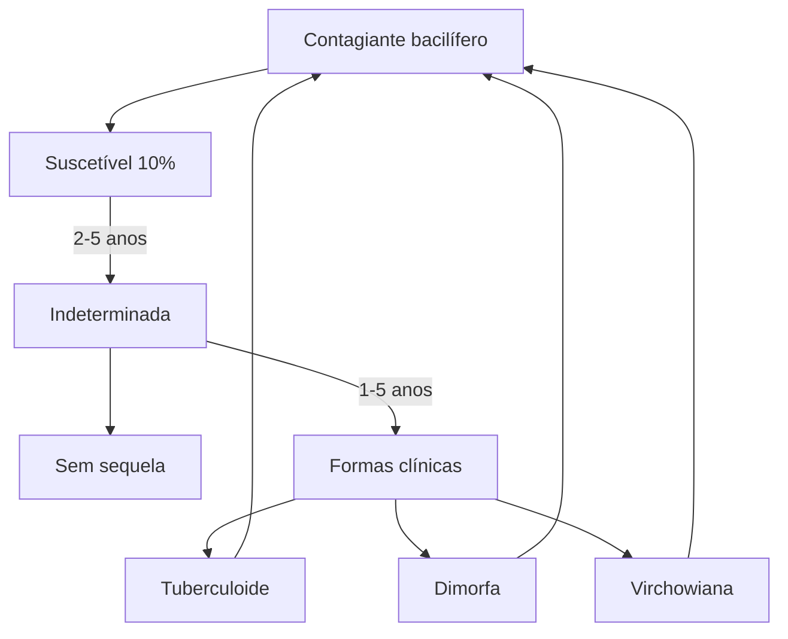

# HANSENÍASE

**Formas Clínicas**
- Indeterminada → Todos apresentam
- Tuberculóide → Polo Th1, Paucibacilar, mácula hipocrômica com perda sensitiva
- Dimorfa → "meio do caminho", Mais comum, Multibacilar, Lesão Faveolar, muito acometimento de nervo
- Virchowiana → Polo Th2, multibacilar, sem lesões aparentes, infiltração de pele, hansenoma

- Perda sensitiva: Térmica → Dolorosa → Tátil; Nervo mais acometido → Ulnar
- Reações Hansênicas → NÃO SÃO falha de tratamento, NÃO indicam troca de medicação / Tratamento Tipo 2: talidomida (lembrar da teratogenicidade!!)
- Tratamento → PQT-U (6 meses para Paucibacilar e 12 meses para Multibacilar)

## 1. CONSIDERAÇÕES INICIAIS

- Agente: Mycobacterium leprae (BAAR, G+)
- O Brasil ocupa a 2ª posição do mundo, entre os países que registram casos novos
- Incubação dura: 2 a 7 anos (eliminação: VAS)
- Normalmente, a fonte da doença é um parente próximo ou convivente que não sabe que está doente → necessidade de susceptibilidade genética (10%)
- Nervos superficiais da pele e troncos nervosos periféricos mas também pode afetar os olhos e órgãos internos

- Tuberculóide → Resposta celular adequada, polo Th1
- Dimorfa → Pacientes multibacilares
- Virchowiana → Resposta celular inadequada, polo Th2

### 1.1. Formas de Apresentação

- Indeterminada (todos passarão por esta fase) → Em geral, 2 a 5 anos após contato com contagiante bacilífero e dura cerca de 1 a 5 anos

### 1.2. Papel da imunidade celular

- Boa resposta → Doença controlada, paucibacilar, poucas lesões (no máximo 5)
- Fraca resposta → Multibacilar, várias lesões
- A imunidade humoral em geral segue o caminho oposto e os anticorpos **não têm efeito protetor contra a doença**.
- responsáveis pela resposta Th2

686                                                                                           CLÍNICA MÉDICA         HANSENÍASE                                                                                             687

• Imunidade celular
  • TH1: IL-2 e IFN-GAMA
  • TH2: IL-4, IL-10, LyB e Ac

**1.3. ATENÇÃO → Mácula hipocrômica + Perda de sensibilidade**

• Térmica → Dolorosa → Tátil
• Examinar sensibilidade de forma orientada pela doença: Tubo de ensaio quente/frio, agulhadas, algodão, microfilamentos, comparar com áreas de pele sã

## 2. CLASSIFICAÇÃO

**2.1 Classificação OMS:**

• Paucibacilar
  • 1 a 5 lesões E Baciloscopia de raspado intradérmico negativo (obrigatoriamente)
• Multibacilar
  • 6 ou mais lesões OU
  • Baciloscopia de raspado intradérmico positiva

• OBS: Se lesão somente em 1 (um) nervo:
  • MS → Paucibacilar
  • OMS → Multibacilar

• Hanseníase primariamente neural → sem lesões de pele, somente lesão de nervo

OBS → Na dúvida, tratar como Multibacilar (!)

## 3. FORMAS CLÍNICAS

**3.1 Indeterminada**

• Fase inicial → TODOS os pacientes
• Mácula hipocrômica
• Perda sensitiva: Térmica → Dolorosa → Tátil
• Prova da histamina: incompleta → perda de filete nervoso

**1.4. ATENÇÃO (OMS) → Deve-se suspeitar de hanseníase**

• Manchas hipocrômicas ou avermelhadas na pele
• Perda ou diminuição da sensibilidade em mancha(s) da pele
• Dormência ou formigamento de mãos/pés,
• Dor ou hipersensibilidade em nervos;
• Edema ou nódulos na face ou nos lóbulos auriculares,
• Ferimentos ou queimaduras indolores nas mãos ou pés.

**1.5. ATENÇÃO (MS) → Ministério da Saúde define um caso com pelo menos um ou mais dos seguintes critérios, conhecidos como sinais cardinais da hanseníase:**

• Lesão (ões) e/ou áreas (s) da pele com alteração de sensibilidade térmica e/ou dolorosa e/ou tátil;
• Espessamento de nervo periférico, associado a alterações sensitivas e/ou motoras e/ou autonômicas;
• Presença do M. leprae, confirmada na baciloscopia de esfregaço intradérmico ou na biópsia de pele.

**2.2 Classificação MADRI 1953**

• Paucibacilares:
  • Indeterminada
  • Tuberculóide
• Multibacilares:
  • Dimorfa (DD ou Borderline)
  • Virchowiana
• Baseia-se especialmente nos aspectos histopatológicos das lesões

**2.3 Classificação de Ridley e Jopling 1966**

• Paucibacilares
  • Indeterminada
  • Tuberculóide
• Multibacilares
  • Dimorfa Tuberculóide
  • Dimorfa
  • Dimorfa Virchowiana
  • Virchowiana

• Baciloscopia negativa
• Biópsia pode não demonstrar
• Se não tratada vai evoluir para algum tipo de hanseníase, o que depende da imunidade do indivíduo!

**3.2 Tuberculóide:**

• Placa hipocrômica de bordas eritematosas formadas por confluência de máculas
• Sistema imune ++++
• Tempo de incubação: 2 a 5 anos
• Crianças de colo (nodular da infância)
• Alteração de sensibilidade, perda de sudorese
• Perda sensitiva: Térmica → Dolorosa → Tátil
• AP: granulomas tuberculóides
• Pode ter nervos espessados de forma localizada e assimétrica

**3.3 Virchowiana:**

• OMS: Não tem "manchas visíveis"
• Pele infiltrada, poupa áreas quentes (dobras, lombar) e couro cabeludo.
• Comum: hansenoma (nodulação), madarose, perda de pelos
• Suor reduzido
• As lesões podem ter sensibilidade normal
• Dor neuropática, parestesia, nervos periféricos geralmente estão espessados difusamente e de forma simétrica
• Artrite, orquite
• Baciloscopia ++

**3.4 Dimorfa**

• OMS: Forma mais comum (70%)
• O mais típico: Lesão Foveolar (lembra um ovo frito)
• Acomete muito nervo(!)
• Variabilidade clínica: como manchas e placas hipocrômicas, acastanhadas ou violáceas, predominando o aspecto infiltrativo.
• Quando a resposta imune predominante é celular, podem parecer a forma tuberculóide, com surgimento de diversas placas com limites nítidos e comprometimento evidente da sensibilidade cutânea.
• Quando o predomínio é da resposta humoral, as lesões surgem em grande número, podendo haver hansenomas e infiltração assimétrica dos pavilhões auriculares, destacando-se as lesões infiltradas de limites imprecisos
• Espessamento de nervos, altera discretamente a sensibilidade
• Incubação > 10 anos (bacilo multiplica a cada 14 dias)
• Baciloscopia (lesão) +

688                                                                      CLÍNICA MÉDICA       HANSENÍASE                                                                                    689

### 3.5 Hanseníase Neural pura

* Exclusivamente neural, sem lesões cutâneas e com baciloscopia negativa, o que representa um desafio diagnóstico.
* Alguns exames complementares como o eletroneuromiograma, a biópsia de nervo, a sorologia e biologia molecular podem auxiliar na definição etiológica
* Nervos ulnares → mais frequentemente acometidos
* Embora qualquer nervo periférico possa ser afetado, especialmente os medianos, radiais, fibulares e os seus ramos superficiais como o nervo ulnar superficial, radial cutâneo, fibular superficial, além do nervo sural

| Paucibacilares                                                      |              | Multibacilares |             |
| ------------------------------------------------------------------- | ------------ | -------------- | ----------- |
| Indeterminada                                                       | Tuberculoide | DD             | Virchowiana |
| \[Images showing different types of Hansen's disease presentations] |              |                |             |

## 4. REAÇÕES HANSÊNICAS

* Até 50% dos MB (V e D) podem ter!
* Processo inflamatório agudo no curso da doença
* Antes, durante ou após o final do tratamento com a PQT
* Não é falha terapêutica (!!) → não troca medicação
* Pacientes com carga bacilar mais alta (virchowianos) geralmente apresentam reações de início mais tardio, ou seja, no final ou logo após o término da PQT

### 4.1 Tipo 1 → Reação Reversa

* Reação de Hipersensibilidade do tipo III e IV de Gell e Coombs
* Resposta imunológica contra antígenos do M. leprae
* Alteração da imunidade celular (DIMORFAS):
  * Novas lesões (não é falha)
  * Eritema ou edema de lesões preexistentes
  * Neurite

### 4.2 Tipo 2

* Causada por imunocomplexos circulantes:
  * Paciente entra em contato com o Ag e forma Ac normalmente IgM → Deposita imunocomplexos, dando as lesões
* EM, neurite, iridociclite, orquite, CN, artrite, hepatoespleno...
* Febre, artralgia, mal-estar, inapetência
* Pode ter reação necrotizante (vasculite)
* PROTÓTIPO: ERITEMA NODOSO HANSÊNICO:
  * Agudo ( < 6 meses)
  * Recorrente OU "subentrante" → teve mais de uma vez >28 dias do tratamento da reação
  * Crônico ( > 6 meses)

### 4.3 Tipo 3 → Fenômeno de Lúcio

* Para alguns: reação tipo 3 ou manifestação específica
* Imunopatogênese desconhecida
* NECROSE ARTERIOLAR (invasão pelo M. Leprae)
  * Trombose dos vasos profundos e superficiais
* Lesões cutâneas eritematosas ou cianosadas / bolhosas → necrose e úlcera → cicatrizes
* Característico da variante HV
* "Lepra de Lúcio-Latapi-Alvarado"

## 5. EXAME FÍSICO

* Exame Físico completo (não esquecer: genital, palmas e plantas)
* Outros sinais e sintomas
  * Conjuntivites
  * Artrites, periostite
  * Linfadenomegalia
  * Edema, úlcera trófica
  * Hepato/Esplenomegalia
  * VDRL, FAN, FR, crioglobulinas, Ac-Anticardiolipinas, Anticoag lúpico

* Palpação de nervos
  * Face - Trigêmeo e Facial
  * Braços - Radial, Ulnar e Mediano
  * Pernas - Fibular e Tibial
  * Avaliação Neurológica Simplificada (ANS)
* Testes de sensibilidade

690                                           CLÍNICA MÉDICA                                  HANSENÍASE                                                                                  691

## 6. EXAMES COMPLEMENTARES

• **Baciloscopia de raspado intradérmico**
  - Índices baciloscópicos (IB) variam 0 a 6+. A média dos IBs obtidos em cada esfregaço serve como estimativa da carga bacilar do paciente
  - Exame histopatológico
    - Polo Tuberculóide → Granuloma Tuberculóide

• **Polo Virchowiano → Infiltrado histiocitário xantomizado ou macrofágico (Cél. de Virchow)**

• **Prova de histamina → Tríplice reação de Lewis**
  - Sinal da pintura → eritema circunscrito 15 a 20 segundos, presente em ambas as áreas
  - Eritema reflexo secundário → Atinge de 2 a 8 cm de diâmetro, limites fenestrados, 30 a 60 segundos, ausente na área com sensibilidade alterada
  - Pápula edematosa lenticular no local da puntura → 2 a 3 minutos, presente em ambas as áreas

• **Avaliação do suor (amido de milho, Iodo ou Pilocarpina)**
  - USG nervos, ENM

• **TESTE RÁPIDO (ferramenta de apoio na avaliação de contatos)**
  - PCR: incorporado no SUS em 2021

## 7. TRATAMENTO (POLIQUIMIOTERAPIA ÚNICA)

### 7.1. PQT-U para > 50kg

• **Paucibacilar**
  - 6 meses (6 cartelas em até 9 meses)
• **Multibacilar**
  - 12 meses (12 cartelas em até 18 meses)

• **Supervisionada Mensal**
  - Dapsona 100 mg
  - Rifampicina 600 mg
  - Clofazimina 300 mg
• **Domiciliar diária**
  - Dapsona 100 mg
  - Clofazimina 50 mg

### 7.2. PQT-U para 30 - 50kg

• **Supervisionada Mensal**
  - Dapsona 50 mg
  - Rifampicina 450 mg

• **Clofazimina 150 mg**
• **Domiciliar diária**
  - Dapsona 50 mg DIAS ALTERNADOS
  - Clofazimina 50 mg

**ATENÇÃO: A PQT-U deverá ser interrompida após o tratamento, quando os pacientes deverão receber alta por cura, saindo do registro ativo do SINAN;**

### 7.3. Critérios de Cura

• **Completou o tratamento?**
  - Paucibacilar → 6 cartelas até 9 meses
  - Multibacilar → 12 cartelas até 18 meses

• **Multibacilar: Não melhora após 12 cartelas**
  - Será que tem contactante sem Dx?
  - Se reações ou deficiências no momento da alta: Monitorar

### 7.4. Complicações PQT

• **Rifampicina 600 mg**
  - Síndrome dengue-like → Síndrome Pseudogripal
  - Urina avermelhada
  - Urticária após 30'
  - Interfere no ACO
• **Dapsona 100mg → Síndrome Sulfona (semelhante a DRESS)**
  - Reações alérgicas, metemoglobinemia, agranulocitose, hemólise

• **Anemia queda 0,2g% do Hb/mês → manter tratamento**
• **Pigmentação, ressecamento, obstipação**
• **Clofazimina 50 mg**

**OBS:**
Gravidez e aleitamento não contraindicam o tratamento
Intolerância a dapsona → rifampicina com clofazimina.

## 8. TRATAMENTO - REAÇÕES HANSÊNICAS

### 8.1. Tipo 1

• **Profilaxia**
  - Predisona 1mg/kg/dia VO
  - Dexametasona 0,15 mg/kg/dia
  - Clorpromazina ou carbamazepina (dor neuropática)

### 8.2. Tipo 2

• **Talidomida 100 a 400 mg/kg**
  - Teratogênica
  - Causa Neuropatia
• **Se CI: Pentoxifilina 400 mg 3xd ou AINES**
• **Associar prednisona 1mg/kg/dia (dor neuropática)**
• **Talidomida + corticoide: AAS 100 mg/dia mg/kg → Eventos CV com esta associação**

**obs: Se surtos recorrentes: focos infecciosos (dentários), diabetes, contactante, necessidade de reiniciar tratamento**

## 9. CONSIDERAÇÕES FINAIS

• **Doença de notificação compulsória (semanalmente) - inclusive recidiva**
  - Se < 15 anos: Protocolo Complementar de Investigação Diagnóstica de Casos de Hanseníase em Menores de 15 Anos (PCID < 15)

• **Investigação de contatos pelo menos uma vez ao ano, por pelo menos 5 anos**
• **Vacinação BCG para os contatos sem presença de sinais e sintomas (abreviar tempo de incubação)**
  - Se 1 cicatriz ou nenhuma → fazer BCG
  - Se 2 cicatrizes → não precisa
