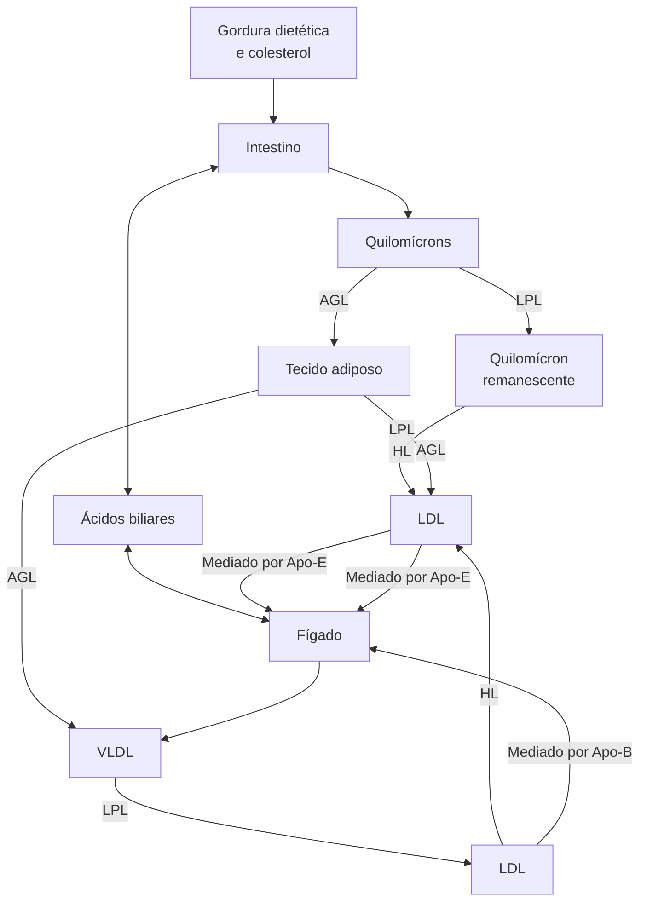
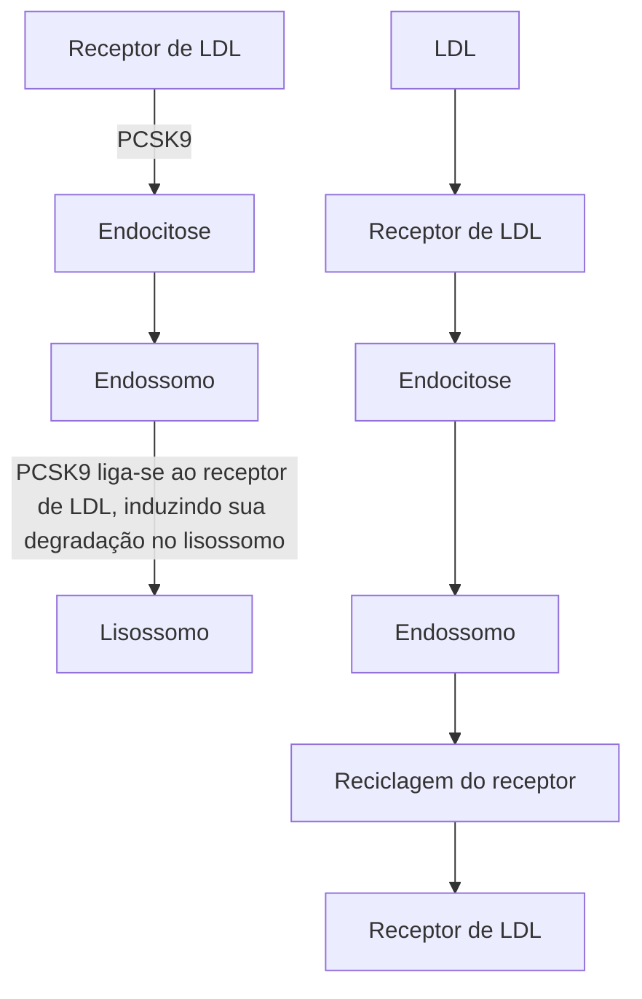
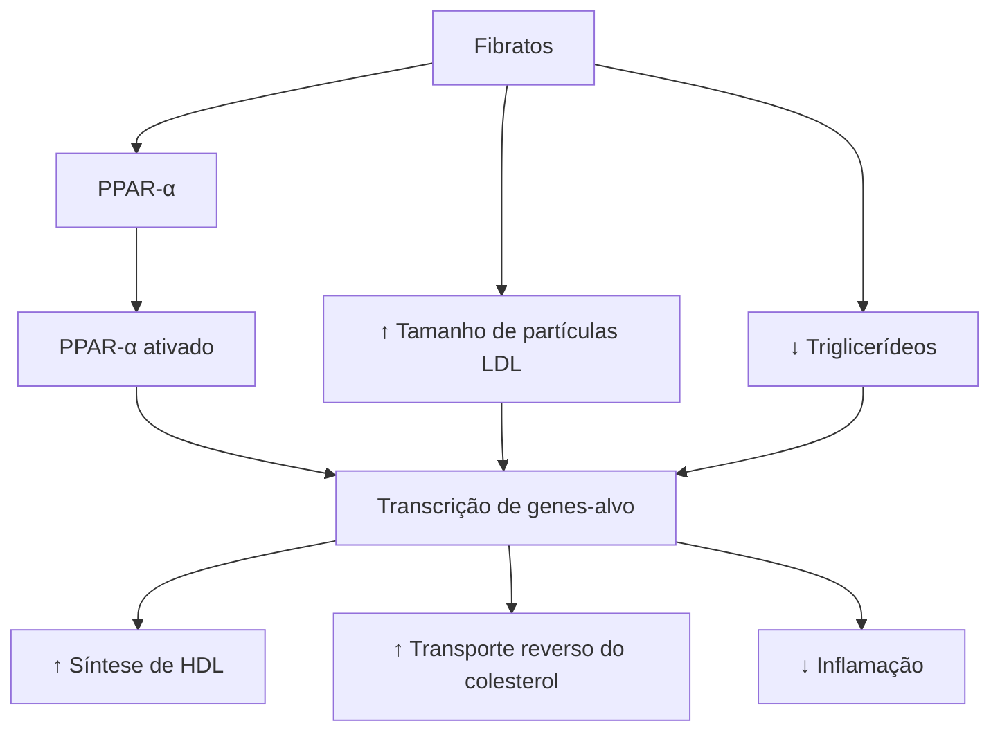

# DISLIPIDEMIA CLASSIFICAÇÃO E DIAGNÓSTICO

| **Favorece armazenamento de gordura no tecido adiposo**
• Insulina e glicocorticoide
**Favorece eliminação de gordura (e DLP) na corrente sanguínea**
• GH, glucagon, testosterona e catecolaminas
**Apoproteína estrutural do LDL**
• ApoB100
**Apoproteína estrutural do HDL**
• Apo A1
**Proteína de Niemann-Pick C1**
• Absorção 50% colesterol proveniente da dieta (ação do Ezetimibe)
**Hipercolesterolemia Familiar**
• Herança autossômica dominante: |   | • Mutações no LDL receptor
• Defeitos ApoB
• Ganho de função PCSK9
• Heterozigótica:
• CT > 300mg/dL + LDL > 250mg/dL
• Adultos LDL ≥ 190mg/dL
• Assintomáticos
• DAC subclínica
• DAC precoce na família
• Homozigótica:
• LDL >500mg/dL
• SCA e morte súbita < 30 anos de idade
• Xantomas tendinosos, xantelasmas, arco corneano e xantomas tuberoso |
| ---------------------------------------------------------------------------------------------------------------------------------------------------------------------------------------------------------------------------------------------------------------------------------------------------------------------------------------------------------------------------------------------------------------------------------------------------------------------------------------------------------- | - | ------------------------------------------------------------------------------------------------------------------------------------------------------------------------------------------------------------------------------------------------------------------------------------------------------------------------------------------------------------------------------------------------------- |

## 1. FISIOLOGIA DAS LIPOPROTEÍNAS

### 1.1 COMPOSIÇÃO DAS LIPOPROTEÍNAS

• São partículas circulantes compostas de lipídios e apoproteínas;
• Lipídeos: triglicerídeos e colesterol;
• Apoproteínas: são proteínas de sustentação da lipoproteína, podendo ser de diversos subtipos;
  • B100 → muito presente em moléculas de LDL;
  • A1 → proteína de ligação com o HDL.

**Figura 1** Composição das Lipoproteínas.

| Componente                                        | Descrição                              |
| ------------------------------------------------- | -------------------------------------- |
| Apoproteína B100                                  | Presente na superfície da lipoproteína |
| Apoproteína C                                     | Camada de foafolipídeos                |
| Colesterol livre                                  | Na camada externa                      |
| Apoproteína E                                     | Presente na superfície                 |
| Núcleo com triglicerídeos e ésteres de colesterol | Núcleo interno da lipoproteína         |

### 1.2 CICLO EXÓGENO DAS LIPOPROTEÍNAS

**É todo o processo que ocorre anteriormente à chegada da lipoproteína no fígado:**

• Inicia na digestão e absorção de triglicérides e colesterol pelo intestino delgado;
• Na porção do duodeno/jejuno proximal, ocorre a absorção dos triglicérides; Tal molécula sofre ação da lipase pancreática, tornando-se ácidos graxos, monoglicérides e diglicérides.
• A secreção biliar, através da vesícula biliar, é repleta de micelas. As micelas envolvem os ácidos graxos, monoglicerídeos e diglicerídeos; A absorção dos ácidos graxos, monoglicerídeos e diglicerídeos, envoltos pela micela dos sais biliares, ocorre na borda em escova dos enterócitos (ao nível das vilosidades coriônicas).
• A molécula do colesterol, também proveniente da dieta, é absorvida diretamente para o sangue através do transportador Niemann Pick C1 like (NPC1L1), também na borda em escova do trato gastrointestinal. Tal proteína é responsável por cerca de 50% da absorção do colesterol advindo da dieta. A atuação da droga Ezetimibe é dada pelo bloqueio da ação da proteína NPC1L1, favorecendo a redução da absorção de colesterol.

**Figura 2** Ciclo exógeno das Lipoproteínas

| Etapa                                         | Processo                                      |
| --------------------------------------------- | --------------------------------------------- |
| Colesterol                                    | ↓                                             |
| Proteína NiemannPick C1 like1 (NPC1L1)        | Absorção no Duodeno/Jejuno proximal           |
| ↓                                             |                                               |
| Triglicérides                                 | Lipase pancreática                            |
| ↓                                             |                                               |
| Ácidos Graxos, Monoglicerídeos, Diglicerídeos |                                               |
| Sais Biliares (micela)                        | Ácidos Graxos, Monoglicerídeos, Diglicerídeos |

• Internamente aos enterócitos, há a conjugação dos ácidos graxos + mono/diglicerídeos em triglicerídeos. Triglicerídeos + colesterol, fosfolipídeos, apoproteínas são empacotados em quilomícrons.

**Enterócito**

| **Ácidos graxos**
**+**
**Mono e diglicerídeos** | → **Triglicerídeos**
**+**
**apoproteínas
fosfolipídeos
Colesterol,**
↓
**Quilomícrons** |
| -------------------------------------------------------- | ---------------------------------------------------------------------------------------------------------------- |
| **vaso linfático**                                       |                                                                                                                  |

**Figura 3** Ciclo exógeno das Lipoproteínas.

• Quilomícrons + ação da LPL = liberação de ácidos graxos livres para os tecidos periféricos (adiposo e muscular): É formado o "quilomícron remanescente". Após esse "consumo" pela periferia, o material restante, chamado de remanescentes de quilomícrons, vai para o fígado, sendo captado por seus receptores específicos.

• O fígado, por sua vez, em uso dos quilomícrons remanescentes, forma a primeira lipoproteína → VLDL (very low-density lipoprotein).

• Com o conteúdo de lipídeos recebido, o fígado pode iniciar o ciclo endógeno.

## 1.3 CICLO ENDÓGENO DAS LIPOPROTEÍNAS

• Fígado sintetiza o VLDL, que é lançado na circulação;
  • Tal molécula também sofre ação da lipase lipoproteica (LPL), liberando triglicérides;
  • Esse triglicérides liberado atinge tecido adiposo e muscular para estoque e geração de energia.

• O VLDL reduz o seu tamanho, torna-se IDL e, por fim, LDL;

• No VLDL, IDL e LDL, age a enzima CETP, que incorpora colesterol nas partículas, em troca de triglicérides;
  • Logo, LDL já é pobre em triglicerídeos e rico em colesterol;
  • O colesterol incorporado é advindo de uma molécula prévia de HDL, que vai captando parte dos ácidos graxos livres liberados para os tecidos periféricos e traz de volta ao fígado.

**Células da Periferia**

[Diagram showing lipid metabolism cycle with VLDL, IDL, LDL, HDL nascente, HDL2, HDL3, with arrows showing LPL, TGL, CETP, and cholesterol interactions between liver and peripheral cells]

**Figura 4** Ciclo endógeno das lipoproteínas.

• Confira na página seguinte a **Figura 5**

## 1.4 MECANISMOS DE ALIMENTAÇÃO, REGULADORES E CONTRARREGULADORES PARA O TRANSPORTE DE LIPÍDEOS DOS QUILOMÍCRONS (VIA EXÓGENA) E VLDL (VIA ENDÓGENA) ATÉ A FORMAÇÃO DE ÁCIDOS GRAXOS LIVRES (COMBUSTÍVEL);

• Diversos hormônios fazem essa homeostase, conforme a imagem.

• Confira na página seguinte a **Figura 6**

# 2. CLASSIFICAÇÃO E DIAGNÓSTICO DAS DISLIPIDEMIAS

## 2.1 CLASSIFICAÇÃO ETIOLÓGICA

**Primárias – origem genética:**

• Relacionadas ao LDL → principal é a hipercolesterolemia familiar;

• Relacionadas ao HDL;

• Relacionadas ao TGL → principal é a hiperquilomicronemia familiar;

• Diversas outras.

**Tabela 1** Classificação etiológica primária

| Relacionadas ao LDL               | Relacionadas ao HDL     | Relacionadas ao TGL            |
| --------------------------------- | ----------------------- | ------------------------------ |
| Hipercolesterolemia familiar      | Deficiência LCAT        | Hipertrigliceridemia familiar  |
| Hiperlipidemia familiar combinada | Doença de Tangier       | Hiperquilomicronemia familiar  |
| Apo B100 defeituosa               | Deficiência ApoA1       | Deficiência da lipase hepática |
| Xantomatose cerebrotendinosa      | Doença do olho de peixe | Disbetalipo-proteinemia        |

**Secundárias – decorrentes de estilo de vida, comorbidades, medicamentos:**

• Síndrome metabólica/obesidade;

• Hipotireoidismo;

• Diversas outras.

## 2.2 HIPERQUILOMICRONEMIA FAMILIAR;

• Condição de caráter monogênico, autossômico/ recessivo;
  • Os genes estão envolvidos no metabolismo e depuração dos quilomícrons. **Figura 7**

• Herança monogênica, autossômica/dominante com diferentes mutações possíveis
  • Mutação dos genes que codificam o LDLr (receptor de LDL hepático) → menor catabolismo de LDL;
  • Mutação dos genes da ApoB100 → prejuízo na ligação com o LDLr hepático;
  • Mutações de ganho de função PCSK9 → ocorre maior degradação do LDLr.

DISLIPIDEMIA CLASSIFICAÇÃO E DIAGNÓSTICO                                                                                                                                    3

**Figura 5** Ciclo exógeno das Lipoproteínas.

Apo CIII
Testosterona
GH
Catecolaminas                                                                                                                                                                    Insulina

                                                                    Adipócito

Quilomícrons  ←--Lipase-->  Ácidos
VLDL              lipoproteica        hormônio-sensível        graxos livres

                                    +                                                                                                                                                    +

Apo CIII                                                                                                                                                                    Catecolaminas
Insulina                                                                                                                                                                         Gh
Glicocorticoides                                                                                                                                                          Glucagon

**Figura 6** Mecanismos reguladores do transporte de lipídeos na via exógena (quilomícrons) e endógena (VLDL).

ENDÓCRINO

**Figura 7** Xantomas eruptivos. Indicativo de hipertrigliceridemia.

**Hipercolesterolemia familiar – forma heterozigótica:**
- Menos grave;
- Clínica: CT > 300 mg/dl + LDL > 250 mg/dL;
- Rastreamento: Adultos com LDLc ≥ 190 mg/dL; Crianças/adolescentes: LDLc ≥ 160 mg/dL; Parentes de 1° grau com histórico de colesterol elevado e/ou diagnóstico de HF;
- Atenção aos seguintes pontos: É assintomático, na maioria das vezes; Demonstra associação com doença aterosclerótica subclínica; Pesquisar história de DAC (doença arterial coronariana – DAC) precoce na família.

**Hipercolesterolemia familiar – forma homozigótica:**
- É mais grave!
- Frequentemente cursa com DAC precoce;
- LDLc > 500 mg/dL;
- SCA (síndrome coronariana aguda) e morte súbita < 30 anos.
- Manifestações clínicas sugestivas de hipercolesterolemia: xantomas tendíneos, xantelasmas, arco corneano e xantomas tuberosos.

**Figura 8** Xantomas tendíneos.

**Figura 9** Xantelasmas.

**Figura 10** Arco corneano.

**Figura 11** Xantomas tuberosos.

• Confira na página seguinte a Tabela 2

## 2.4 DISLIPIDEMIAS SECUNDÁRIAS

Decorrente de estilo de vida inadequado, comorbidades ou medicamentos.

• Observe a tabela:

**Tabela 3** Causas secundárias de dislipidemias e seu perfil lipídico correspondente.

|                               | CT  | LDL | HDL | TG  |
| ----------------------------- | --- | --- | --- | --- |
| Síndrome metabólica/obesidade | ↑   | ↑   | ↓   | ↑↑  |
| Hipotireoidismo               | --- | ↑↑  | --- | ↑   |
| Hepatopatia crônica           | ↑   | ↑↑  | ↑   | ↑   |
| DRC                           | ↑   | ↑   | --- | ↑↑  |
| Etilismo                      | --- | --- | ↑   | ↑↑  |
| Infecção pelo HIV             | --- | ↑   | --- | ↑↑  |
| Esteroides anabolizantes      | ↑   | ↑   | ↓   | --- |
| Estrogenioterapia             | --- | ↓   | ↓   | ↑↑  |
| Progestágenos                 | --- | ↑   | ↓   | --- |
| Glicocorticoides              | ↑   | --- | ↓   | ↑   |
| Diuréticos tiazídicos         | --- | --- | ↓   | ↑   |
| Antipsicóticos                | --- | --- | --- | ↑   |
| Inibidores da protease        | --- | ↑   | ↓   | ↑   |

## 2.5 CLASSIFICAÇÃO LABORATORIAL

- Hipercolesterolemia isolada → apenas aumento de CT e LDLc;
- Hipertrigliceridemia isolada → perfil de CT e LDLc normais, mas com TG elevado;
- Hiperlipidemia mista → TG elevado, CT e LDLc elevados.
- HDLc baixo → HDLc reduzido.

## 2.6 RASTREAMENTO DAS DISLIPIDEMIAS

- Deve ser realizado para todos os indivíduos acima de 20 anos de idade;
  - Avaliação de risco cardiovascular + dosagem de perfil lipídico (LDLc, HDLc, CT e TG).
- Repetir a cada 5 anos, ou em intervalo menor, em caso de novos fatores de risco.

DISLIPIDEMIA CLASSIFICAÇÃO E DIAGNÓSTICO

## 2.7 ESTRATIFICAÇÃO DAS DISLIPIDEMIAS

• Estima o risco de IAM, AVC ou IC fatais ou não fatais ou IVP em 10 anos. Calculadoras:
  • American College of Cardiology, 2018;
  • Sociedade Brasileira de Cardiologia, 2017.

**Risco muito alto:**
• Aterosclerose significativa (obstrução ≥ 50%) com ou sem eventos clínicos em território coronário, cerebrovascular e vascular periférico.

**Risco alto:**
• Homens com escore de risco global > 20%;
• Mulheres com escore de risco global > 10%;
• Aterosclerose subclínica documentada por:
  • USG carótidas com presença de placa;
  • ITB < 0,9;
  • Escore de CAC > 100 U;
  • Placas ateroscleróticas na angiotomografia coronária
• Aneurisma de aorta abdominal;
• DRC TFG 15 a 60 L/min;
• LDL-c ≥ 190 mg/dL;
• DM + LDL-c 70 a 189 mg/dL + presença de estratificadores de risco ou aterosclerose subclínica.

Obs: estratificadores de risco = homens com > 48 anos e mulheres > 54 anos; DM > 10 anos; HF parente 1° grau com DCV prematura (< 55 anos homens e < 65 anos mulheres); Tabagismo; HAS; SM pelo IDF; Albuminúria > 30 mg/g e/ou Retinopatia; TFG < 60 mL/ min.

**Risco intermediário:**
• Homens com escore de risco global de 5 a 20%;
• Mulheres com escore de risco global de 5 a 10%;
• DM sem fatores de risco ou aterosclerose subclínica.

**Baixo risco:**
• Homens e mulheres com escore de risco global < 5%.

**Tabela 4** Diagnóstico das dislipidemias (ver valores na tabela a seguir)

| Lipídeos                                    | Com jejum (mg/dL)                  | Sem jejum (mg/dL)                  | Categoria referencial                           |
| ------------------------------------------- | ---------------------------------- | ---------------------------------- | ----------------------------------------------- |
| Colesterol total
HDLc
Triglicérides | < 190
> 40
< 150           | < 190
> 40
< 175           | Desejável
Desejável
Desejável           |
| **Categoria de risco**                      |                                    |                                    |                                                 |
| LDLc                                        | < 130
< 100
< 70
< 50  | < 130
< 100
< 70
< 50  | Baixo
Intermediário
Alto
Muito alto |
| Não-HDLc                                    | < 160
< 130
< 100
< 80 | < 160
< 130
< 100
< 80 | Baixo
Intermediário
Alto
Muito alto |

**Tabela 2** Diagnóstico – critérios da Dutch Lipid Clinic Network

| Parâmetros                                                              | Parâmetros                                                                                                                        | Pontos          |
| ----------------------------------------------------------------------- | --------------------------------------------------------------------------------------------------------------------------------- | --------------- |
| História familiar                                                       | Parente de 1° grau, portador de doença vascular/coronariana prematura (homens < 55 anos de idade), mulheres < 60 anos de idade OU | 1               |
|                                                                         | Parente adulto com colesterol total > 290 mg/dL                                                                                   | 1               |
|                                                                         | Parente de 1° grau, portador de xantoma tendinoso e/ou arco cornean                                                               | 2               |
| Parente de 1° grau < 16 anos de idade, com colesterol total > 260 mg/dL |                                                                                                                                   | 2               |
| História clínica                                                        | Paciente portador de doença coronariana prematura (homens < 55 anos de idade, mulheres < 60 anos de idade)                        | 2               |
|                                                                         | Paciente portador de doença cerebral ou periférica prematura (homens < 55 anos de idade, mulheres < 60 anos de idade)             | 1               |
| Exame físico                                                            | Xantoma tendinoso                                                                                                                 | 6               |
|                                                                         | Arco corneano, em < 45 anos de idade                                                                                              | 4               |
| Níveis de LDLc (mg/dL)                                                  | ≥ 330                                                                                                                             | 8               |
|                                                                         | 250 – 329                                                                                                                         | 5               |
|                                                                         | 190 – 249                                                                                                                         | 3               |
|                                                                         | 155 - 189                                                                                                                         | 1               |
| Análise de DNA                                                          | Presença de mutação funcional dos genes do LDLr da Apo-B100 ou de PCSK9                                                           | 8               |
| Diagnóstico de HF                                                       | --------------                                                                                                                    | Certeza: > 8    |
|                                                                         |                                                                                                                                   | Provável: 6 – 8 |
|                                                                         |                                                                                                                                   | Possível: 3 - 5 |

ENDÓCRINO

# REFERÊNCIAS

**Figura 1** Composição das Lipoproteínas.

Vilar, Lucio [et al] . Endocrinologia Clínica. 7ª edição. Rio de Janeiro:
Guanabara Koogan, 2021.

**Figura 7** Xantomas eruptivos. Indicativo de hipertrigliceridemia.

Vilar, Lucio [et al] . Endocrinologia Clínica. 7ª edição. Rio de Janeiro:
Guanabara Koogan, 2021.

**Figura 8** Xantomas tendíneos.

Vilar, Lucio [et al] . Endocrinologia Clínica. 7ª edição. Rio de Janeiro:
Guanabara Koogan, 2021.

**Figura 9** Xantelasmas.

Vilar, Lucio [et al] . Endocrinologia Clínica. 7ª edição. Rio de Janeiro:
Guanabara Koogan, 2021.

**Figura 10** Arco corneano.

Vilar, Lucio [et al] . Endocrinologia Clínica. 7ª edição. Rio de Janeiro:
Guanabara Koogan, 202

**Figura 11** Xantomas tuberosos.

Vilar, Lucio [et al] . Endocrinologia Clínica. 7ª edição. Rio de Janeiro:
Guanabara Koogan, 2021.

Dislipidemias (CM)

# TRATAMENTO DAS DISLIPIDEMIAS

| **Como estratificar o risco CV?**
Muito alto risco = evento cardiovascular prévio OU aterosclerose significativa (>ou= 50%)
• Alto risco = homens com escore de risco global > 20% e mulheres com escore de risco global > 10%; aterosclerose subclínica; TFG 15 a 60mL/min ; LDL-c ≥ 190 mg/dL ; DM + LDL-c 70 a 189 mg/dL + presença de fatores de risco ou aterosclerose subclínica
• Intermediário risco = homens com escore de risco global de 5 a 20% e mulheres com escore de risco global de 5 a 10% ; DM sem fatores de risco ou aterosclerose subclínica
• Baixo risco = homens e mulheres com escore de risco global < 5%
**Meta Terapêutica**
• Muito alto risco = redução > 50% e manter LDL <50
• Alto risco = redução 50% e manter LDL <70
• Intermediário risco = redução 30 a 50% e manter LDL <100
• Baixo risco = redução 30% e manter LDL < 130
**Droga inicial de escolha para tratamento da hipercolesterolemia:**
• Estatina
• Redução de mortalidade por todas as causas, eventos coronarianos e AVC | **Quando iniciar iPCSK9:**
• Paciente de alto risco CV, com dose otimizada de estatina e fora do alvo
**Fatores de risco para SAMS:**
• Disfunção hepática ou renal
• Hipotireoidismo
• DM
• Deficiência de vitamina D
• Idade avançada
• Alcoolismo
• Doses elevadas de estatina
• Medicamentos que inibem o CYP3A4 ou CYP2C9
• Uso de ácido nicotínico e genfibrozila
**Quando suspender estatina em caso de SAMS:**
• Rabdomiólise
• Dor muscular significativa independentemente do valor da CPK
• Elevação da CPK > 10 vezes o LSN
**Quando suspender estatina em caso de hepatotoxicidade:**
• Icterícia
• Aumento de BD e TP
• Elevação das transaminases maior que 3x LSN
**Indicação de fibrato:**
• TGL > 500mg/dL → redução do risco pancreatite |
| ---------------------------------------------------------------------------------------------------------------------------------------------------------------------------------------------------------------------------------------------------------------------------------------------------------------------------------------------------------------------------------------------------------------------------------------------------------------------------------------------------------------------------------------------------------------------------------------------------------------------------------------------------------------------------------------------------------------------------------------------------------------------------------------------------------------------------------------------------------------------------------------------------------------------------------------------------------------------------------------------------------------------------------------------------------------------------- | ----------------------------------------------------------------------------------------------------------------------------------------------------------------------------------------------------------------------------------------------------------------------------------------------------------------------------------------------------------------------------------------------------------------------------------------------------------------------------------------------------------------------------------------------------------------------------------------------------------------------------------------------------------------------------------------------------------------------------------------------------------------------------------------------------------------------------------------------- |

## 1. METAS DE TRATAMENTO BASEADAS NA ESTRATIFICAÇÃO DE RISCO

**Tabela 1 Meta de tratamento da hipercolesterolemia**

| Risco         | Meta pré-tratamentoRedução % | Meta LDL pós-tratamento |
| ------------- | ---------------------------- | ----------------------- |
| Muito alto    | > 50%                        | < 50 mg/dL              |
| Alto          | > 50%                        | < 70 mg/dL              |
| Intermediário | 30 – 50%                     | < 100 mg/dL             |
| Baixo         | > 30%                        | < 130 mg/dL             |

## 2. TRATAMENTO DAS HIPERCOLESTEROLEMIAS

### 2.1. TRATAMENTO NÃO-FARMACOLÓGICO

• MEV (mudanças de estilo de vida)
  • Substituir ácidos graxos saturados por monoinsaturados;
  • Excluir ácidos graxos trans;
  • Redução alimentar de consumo de colesterol – tem impacto pequeno.

OBS.: A mudança de estilo de vida demonstra maior impacto em cenários de hipertrigliceridemia, visto que 80% da produção de colesterol é endógena, e somente 20% é dada através da dieta.

• Perda ponderal;
• Exercícios físicos aeróbicos;
• Frequência de 3-6x/semana, com duração de 30-60 minutos.

ATENÇÃO: Tais medidas favorecem o aumento dos níveis de HDL, contudo têm pouco impacto no LDL.

### 2.2 ESTATINAS

• Visão geral
  • São as medicações de escolha para tratar dislipidemia;
  • Demonstram redução de mortalidade por todas as causas, eventos isquêmicos coronarianos e AVC;
  • Atuam pela inibição da enzima HMG-CoA redutase (enzina que participa da síntese do colesterol intracelular), gerando redução da produção do colesterol endógeno, diminuindo seus níveis na corrente sanguínea, o que favorece maior expressão do receptor de LDL pelo hepatócito, contribuindo também para redução do colesterol sérico. Figura 1
• Efeitos adversos: Sintomas musculares associados às estatinas (SAMS)
  • São eles: Mialgias, fraqueza e cãibras (mais comuns); Miosite, hepatite e rabdomiólise (graves e raros);
  • Há menor risco com rosuvastatina, pitavastatina, fluvastatina e pravastatina;
  • Fatores de risco para ter SAMS: Disfunção hepática ou renal; Hipotireoidismo; Diabetes mellitus; Deficiência

de vitamina D; Idade avançada; Alcoolismo; Doses elevadas de estatina; Uso de medicamentos que inibem o CYP3A4 ou CYP2C9*; Uso concomitante de ácido nicotínico e fibratos (genfibrozila).

| Redução de LDL-C (percentual) | Sinvastatina |    |    | Pravastatina |    |    | Fluvastatina |    |    | Pitavastatina |    |   | Atorvastatina |   |    | Rosuvastatina |    |    |   |    |    |    |   |   |
| ----------------------------- | ------------ | -- | -- | ------------ | -- | -- | ------------ | -- | -- | ------------- | -- | - | ------------- | - | -- | ------------- | -- | -- | - | -- | -- | -- | - | - |
|                               | 10           | 20 | 40 | 80           | 10 | 20 | 40           | 80 | 20 | 40            | 80 | 1 | 2             | 4 | 10 | 20            | 40 | 80 | 5 | 10 | 20 | 40 |   |   |
| 0                             |              |    |    |              |    |    |              |    |    |               |    |   |               |   |    |               |    |    |   |    |    |    |   |   |
| -10                           |              |    |    |              |    |    |              |    |    |               |    |   |               |   |    |               |    |    |   |    |    |    |   |   |
| -20                           |              |    |    |              |    |    |              |    |    |               |    |   |               |   |    |               |    |    |   |    |    |    |   |   |
| -30                           |              |    |    |              |    |    |              |    |    |               |    |   |               |   |    |               |    |    |   |    |    |    |   |   |
| -40                           |              |    |    |              |    |    |              |    |    |               |    |   |               |   |    |               |    |    |   |    |    |    |   |   |
| -50                           |              |    |    |              |    |    |              |    |    |               |    |   |               |   |    |               |    |    |   |    |    |    |   |   |
| -60                           |              |    |    |              |    |    |              |    |    |               |    |   |               |   |    |               |    |    |   |    |    |    |   |   |

Redução de LDL-C < 30%
Redução de LDL-C 30%-50%
Redução de LDL-C > 50%

**Figura 1** Potência das Estatinas

**Alta potência = cinza escuro; Média potência = cinza; Baixa potência = cinza claro**

*Medicações que inibem CYP3A4 ou CYP2C9:

Claritromicina, Ciclosporina, IPs, Fluconazol, Fluoxetina, Verapamil, Tacrolimo.

• Suspender se Rabdomiólise; Intolerância por dor muscular significante, independentemente do valor da CPK; Elevação da CPK > 10x LSN.

• A reintrodução deve ser gradual, em doses baixas e associadas a outros fármacos (ezetimibe ou fitosteróis) quando paciente estiver assintomático e CPK normal

• Quando solicitar CPK: Início de tratamento; Ao elevar a dose da estatina; Na presença de sintomas musculares; Na introdução de fármacos que interagem.

**Efeitos adversos: Hepatotoxicidade**

• Suspender estatinas se icterícia; aumento da bilirrubina direta (BD) e tempo de protrombina; Indivíduos assintomáticos com níveis de transaminases > 3x LSN (limite superior da normalidade).

• Quando solicitar transaminases: Início da terapia; Na presença de sintomas ou sinais sugestivos de hepatotoxicidade.

• **Efeitos adversos:** Efeito diabetogênico
  • Estudos inconclusivos;
  • Em geral, relacionado com indivíduos com risco elevado para diabetes ou pré-diabetes, com uso de doses elevadas de estatinas.

• Contraindicações
  • Mulheres grávidas ou em amamentação;
  • Hepatopatias agudas (entretanto, podem ser manejadas na doença hepática crônica ou DHGNA).

## 2.3 EZETIMIBE

• Visão geral
  • Atua inibindo a proteína de *Niemann Pick C1 like 1*: Tal enzima favorece a absorção intestinal de cerca de 50% do colesterol entérico.
  • Há redução da reabsorção intestinal de colesterol: Aumento da expressão do receptor LDLr e Redução do LDLc circulante.

• **Indicações**
  • Lembre-se: são medicações de 2ª linha no tratamento da hipercolesterolemia (Uso nos casos de metas de LDLc não atingidas com tratamento otimizado de estatinas).
  • Isoladamente – para pacientes que não toleram as doses recomendadas de estatinas.

## 2.4 COLESTIRAMINA

• Visão geral
  • Atua através da redução da reabsorção dos ácidos biliares e colesterol, com aumento da expressão do receptor LDLr, e redução do LDLc circulante.

• Indicações
  • Meta de LDLc não obtida com uso de estatinas potentes, em doses efetivas (5-30% LDL).
  • Crianças.

• Efeitos adversos
  • Gastrointestinais: diarreia, náuseas, vômitos.
  • Redução de absorção de vitaminas lipossolúveis.
  • Aumento dos triglicérides.

## 2.5 INIBIDORES DE PCSK9

• Visão geral
  • PCSK9 é uma proteína que se liga ao receptor de LDL e bloqueia sua expressão efetiva na membrana do hepatócito. Assim, ao inibir tal proteína, tem-se mais receptores livres e, consequentemente, é favorecida uma maior captação do LDL circulante.

**Figura 2** Mecanismo de ação dos inibidores da PCSK9.

• Medicações caras, reservadas para casos específicos;

• Indicações
  • Pacientes com risco cardiovascular elevado, em uso de estatinas (em dose otimizada), com/sem associação com ezetimiba – ainda assim, não atingem o alvo terapêutico.

OBS.: A associação do inibidor de PCSK9, em associação com a estatina, pode levar a uma redução de 60%, ou mais, nos níveis de LDL.

TRATAMENTO DAS DISLIPIDEMIAS                                                                                            3

**Tabela 2** Resumo das medicações utilizadas para tratamento da hipercolesterolemia.

| Classe                           | Mecanismo                                                              | Efeitos sobre os lipídios plasmáticos               | Redução de LDLc                     | Efeitos adversos                                               |
| -------------------------------- | ---------------------------------------------------------------------- | --------------------------------------------------- | ----------------------------------- | -------------------------------------------------------------- |
| Estatinas                        | Inibe HMG-CoA redutase
↑ atividade do receptor de LDL              | ↓ LDLc e VLDLc
Demonstra mínimo efeito sob HDLc | 30 – 55%
Efeito dose-dependente | Mialgia
Disfunção cognitiva
Elevação glicêmica         |
| Sequestrantes de ácidos biliares | ↓ reabsorção dos ácidos biliares
↑ da atividade do receptor de LDL | ↓ LDLc e ↑ TG;
Demonstra mínimo efeito sob HDLc | 15 – 25%
Efeito dose-dependente | Constipação intestinal
Distúrbios do TGI
Aumento de TG |
| Ezetimibe                        | ↓ absorção do colesterol
↑ da atividade do receptor de LDL         | ↓ LDLc e VLDLc
Demonstra mínimo efeito sob HDLc | 15 – 25%                            | Raros                                                          |
| Inibidores da PCSK9              | Bloqueio dos efeitos da PCSK9 na destruição dos receptores de LDL      | ↓ LDLc                                              | 45 – 60%                            | Sob investigação                                               |

## 3. TRATAMENTO DAS HIPERTRIGLICERIDEMIAS

### 3.1 TRATAMENTO
• Não-Farmacológico

**Tabela 3** Impacto do tratamento não-farmacológico na hipertrigliceridemia.

| Intervenção                                                         | Magnitude de impacto |
| ------------------------------------------------------------------- | -------------------- |
| Redução do peso                                                     | +++                  |
| Redução do consumo de bebidas alcoólicas                            | +++                  |
| Redução do consumo de açúcar simples                                | +++                  |
| Redução da ingestão de carboidrato                                  | ++                   |
| Substituição dos ácidos graxos saturados por mono e poliinsaturados | ++                   |
| Aumento da atividade física (aeróbios)                              | ++                   |

• Medicamentoso

**Tabela 4** Impacto do tratamento farmacológico na hipertrigliceridemia.

|                  | Redução TGL | Aumento HDL     |
| ---------------- | ----------- | --------------- |
| Ácido nicotínico | 20 – 50%    | 10 – 30%        |
| Fibratos         | 20 – 50%    | 10 – 25%        |
| Estatinas        | 10 – 25%    | 5 – 10%         |
| Ômega-3          | 20 – 30%    | --------------- |

• Considerações
  • Medicações de escolha: fibratos;
  • Ômega-3 + ácido nicotínico: terapia alternativa.
• Indicações para iniciar medicação

• TG > ou = 500 mg/dL;
• Fibrato: Para redução do risco de pancreatite.

OBS = Outros contextos clínicos, o uso de fibrato não reduziu eventos cardiovasculares a despeito da redução dos triglicérides.

### 3.2 FIBRATOS
• Ação:

**Figura 3** Mecanismo de ação dos fibratos

• Efeitos adversos
  • Náuseas, diarreia, redução da libido, dores musculares, astenia, erupção cutânea, prurido, cefaleia e insônia (são transitórios e leves).
  • Outros efeitos: Colestase e elevação discreta das transaminases; Hepatite tóxica; Rabdomiólise.

## 3.3 ÁCIDO NICOTÍNICO

• Ação

**Figura 4** Mecanismo de ação do ácido nicotínico. Vilar, Lucio [et al].

| Tecido adiposo

Diminuição
da síntese
de TG

Diminuição
de AGL | → | Fígado

Niacina

Diminuição
da síntese
de VLDL

Aumento
de HDL | → | Redução
de VLDL

Redução
de LDL |
| ------------------------------------------------------------------------------------------ | - | -------------------------------------------------------------------------------------------------- | - | ----------------------------------------------- |

• Frequentes efeitos colaterais;
  • Rubor facial (flushing facial);
  • Prurido;

• Toxicidade hepática.
• Sem redução de eventos cardiovasculares.

## 3.4 ÔMEGA-3

• Derivado dos ácidos: eicosapentaenoico (EPA) e docosahexaenóico (DHA);
• Atua na redução da síntese hepática de VLDL, reduzindo assim os TG;
• Terapia adjunta para redução do risco cardiovascular;
  • TG ≥ 150 mg/dl + uso de estatina + DCV estabelecida/ DM + mais de 2 fatores de risco para DCV.
• Estudos com dose de 4 g/dia mostram redução de 20-30% nos valores de TG; começar com dose inicial de 1 g/dia.

TRATAMENTO DAS DISLIPIDEMIAS

# REFERÊNCIAS

**Tabela 2** Resumo das medicações utilizadas para tratamento da hipercolesterolemia.

Vilar, Lucio [et al]. Endocrinologia Clínica. 6ª edição. Rio de Janeiro: Guanabara Koogan, 2016. (adaptada).
