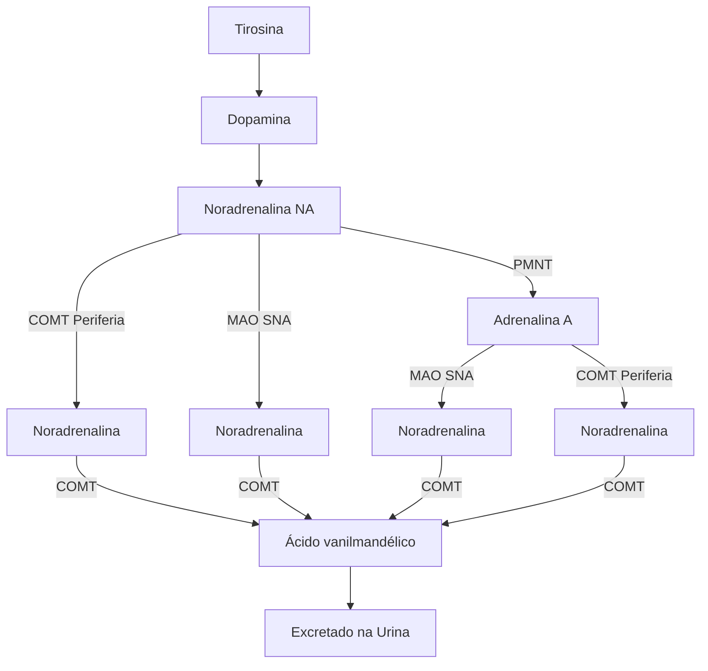
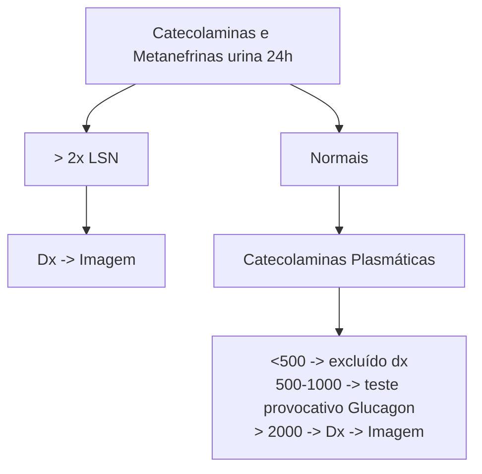

# FEOCROMOCITOMA

| **Etiologia**
• Esporádico 80%
• Síndromes Genéticas (NEM 2A, Von Hippel-Lindau) - 10 a 20%
**Quadro Clínico**
• Crises Paroxísticas: cefaleia, sudorese e palpitações
• HAS
• Hipovolemia
• Hipotensão postural
• Hiperglicemia
**Diagnóstico**
• Padrão-Ouro = metanefrinas séricas
• Alternativo = metanefrinas e catecolaminas na urina 24h |   | • TC e Cintilografia com MIBG = afastar malignidade e metástases
**Tratamento**
• Adrenalectomia do lado acometido
**Controle pré-op**
• (2 a 4 semanas antes da cirurgia)
• Alfa-bloqueador → Beta-bloqueador
• Hidratação EV
• Dieta hiperssódica
**Manejo pós-op**
• Hidratação com solução glicofisiológica
• Droga vasoativa . |
| ------------------------------------------------------------------------------------------------------------------------------------------------------------------------------------------------------------------------------------------------------------------------------------------------------------------------------------------------------------------------------------------- | - | --------------------------------------------------------------------------------------------------------------------------------------------------------------------------------------------------------------------------------------------------------------------------------------------------------------------------------------------------------------------------- |

## 1. INTRODUÇÃO

### 1.1 RELEMBRANDO A FISIOLOGIA

**Figura 1** Síntese e excreção da adrenalina e noradrenalina.

• Toda a adrenalina produzida no organismo vêm da medula da adrenal, pois só a medula adrenal possui a enzima PMNT que converte a noradrenalina em adrenalina.
• Paragangliomas não tem PMNT – só produzem noradrenalina.

## 2. QUADRO CLÍNICO E ETIOLOGIA

### 2.1 QUADRO CLÍNICO

• Assintomáticos 5-8%;
• Crises paroxísticas (56%) – sintomas mais comuns: sudorese, palpitações e cefaleia (tríade clássica) → geralmente em esforços mínimos, com melhora em repouso;

• Fazer diagnóstico diferencial com a síndrome do pânico!
• Hipertensão Arterial (pelo excesso de catecolaminas): sustentada (50%), paroxística (30%), normotenso (10-20%);
• Depleção volêmica e desidratação: HAS → inibição ADH → aumento diurese (paciente cronicamente desidratados);
• Hipotensão ortostática secundária a hipovolemia;
• DM e intolerância à glicose pelo efeito contrarregulador da adrenalina.

### 2.2 ETIOLOGIA

• Esporádico (80%);
• Familiar e/ou Síndromes Genéticas, como por exemplo: Síndrome de Von Hippel-Lindau (VHL); NEM 2A (mutação do RET → carcinoma medular de tireoide e hiperparatireoidismo); Paraganglioma familiar SDHB; Paraganglioma familiar SDHD; Neurofibromatose tipo 1; SDHC; SDHA.

## 3. INVESTIGAÇÃO

### 3.1 EM QUEM?

• Quadro clínico típico;
• História familiar de feocromocitoma ou carcinoma medular de tireoide;
• HAS em jovens;
• HAS de difícil controle;
• HAS desencadeada por trabalho de parto e indução anestésica;
• Incidentaloma adrenal.

### 3.1 EM QUEM?

• Padrão-ouro = metanefrinas séricas (sensibilidade de aproximadamente 99%): caro e geralmente só é disponível nos centros de referência.
• Mais comum = metanefrinas urinárias em urina 24h.
• Fluxograma.

ENDÓCRINO

*LSN = Limite superior da normalidade

**Figura 2** Diagnóstico laboratorial de feocromocitoma.

## 3.3 INVESTIGAÇÃO RADIOLÓGICA (>2X LSN)

• Tomografia – localizar o feocromocitoma e afastar malignidades: boa sensibilidade para tumores grandes; Menor sensibilidade para tumores pequenos e paragangliomas; Características da lesão: unilaterais, > 3 cm; Bem delimitada e oval; Heterogênea (áreas císticas, calcificações); > 10 UH; Washout lento.

**Figura 3** Feocromocitoma na tomografia.

• RNM: Maior acurácia para tumores menores; Preferível para: Gestantes e crianças; Alérgicos a contraste; Suspeita de paraganglioma; Avaliar base de crânio.

**Figura 4** Feocromocitoma na ressonância magnética.

• Cintilografia com MIBG (marcador – lugares que produzem muita catecolamina produzem muito MIBG): Alta especificidade – se houver um local com hipercaptação (pensar em feocromocitoma e paraganglioma); Indicações: Doença sabidamente metastática ou forte suspeita de metástase; Programação de tratamento radioterápico com MIBG; Suspeita de malignidade para avaliar metástase.

**Figura 5** Cintilografia com MIBG.

## 4. TRATAMENTO

### 4.1 INICIAR O PRÉ-OPERATÓRIO 2-4 SEMANAS ANTES:

• Restauração volêmica com NaCl 0,9%;
• Dieta hipersódica (> 3 g/dia de sal);
• Controle pressórico: alfa-bloqueador (principalmente); bloqueador de canal de cálcio; Beta-bloqueador apenas se taquicardia ou arritmias (apenas quando o paciente estiver alfa-bloqueado); IECA/BRA.
• Objetivo: PA < 130x80 mmHg; PAS > 90mmHg; Segmento ST normal há 7 dias; FC 60-70 bpm sentada e 70-80 bpm ortostase; <1 extrassístole/hora.

### 4.2 NO DIA DA CIRURGIA E NO INTRAOPERATÓRIO

• Suspender alfa e beta-bloqueadores 8 horas antes;
• 1-2L SF 0,9% logo antes;
• Drogas anestésicas permitidas = propofol, etomidato e barbitúricos.

### 4.3 CONDUTAS

• Tumor unilateral: Adrenalectomia do lado acometido;
• Tumor bilateral ou risco de acometimento da adrenal contralateral: Adrenalectomia total do lado acometido + exérese tumor com manutenção do córtex da adrenal contralateral;
• Paraganglioma, tumor > 6 cm ou suspeita de malignidade: Cirurgia aberta.

FEOCROMOCITOMA

## 4.4 PÓS-OPERATÓRIO

• Hidratação e drogas vasoativas devido ao risco de hipotensão severa;
• Soro glicosado 5% nas 24–48h seguintes devido ao risco de hiperinsulinemia rebote.

## 4.5 PROGNÓSTICO

• 50% dos pacientes podem persistir hipertensos;
• Doença residual;

# REFERÊNCIAS

**Figura 3** Feocromocitoma na tomografia.

Vilar et al. Endocrinologia Clínica. Guanabara Koogan. 7 ed. 2021

**Figura 4** Feocromocitoma na ressonância magnética.

Vilar et al. Endocrinologia Clínica. Guanabara Koogan. 7 ed. 2021

**Figura 5** Cintilografia com MIBG.

Vilar et al. Endocrinologia Clínica. Guanabara Koogan. 7 ed. 2021
