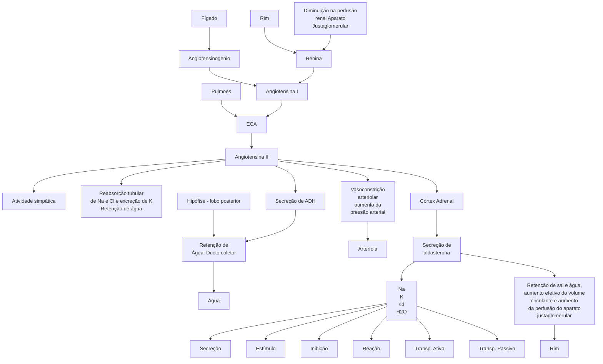

Hiperaldosteronismo Primário (CM)

# HIPERALDOSTERONISMO PRIMÁRIO

## Etiologia
- Principais = Adenoma adrenal produtor de aldosterona (clinicamente mais grave e acomete pessoas mais jovens)
  - Tratamento → adrenalectomia do lado afetado
- Idiopática → hiperplasia da camada glomerulosa das adrenais (clinicamente mais branda e indivíduos > 40 anos)
  - Tratamento → Clínico = espironolactona, reposição K e outros anti-hipertensivos orais
  - Refratariedade = cirurgia

## Quadro Clínico
- Hipertensão Arterial Estágio III de difícil controle em pessoas jovens (<40 anos)
- Hipocalemia importante → câimbras, parestesias, fraqueza muscular e alcalemia
- Hiperglicemia
- Hiperparatireoidismo Secundário

## Rastreamento
- Razão Aldosterona/Atividade Plasmática de Renina → >

ou = 30 + Aldosterona > 15 → rastreamento positivo
- Suspender diuréticos 2 a 4 semanas antes

## Teste Confirmatório
- Para todos os que tiveram rastreamento positivo, exceto se:
  - Hipocalemia espontânea e,
  - Aldosterona > 20 e,
  - APR indetectável

## Exames de Imagem
- TC com contraste
- 20-30% dos casos a TC falha em detectar lado produtor de aldosterona
- Cateterismo de adrenais, se
  - TC normal,
  - TC com lesão bilateral
  - TC com lesão unilateral > 40 anos

## 1. INTRODUÇÃO

**Figura 1** Fisiologia do Sistema Renina-Angiotensina-Aldosterona.

Em casos de hipofluxo renal, as células justaglomerulares produzem renina, que atua no fígado levando à conversão de angiotensinogênio em angiotensina I; no pulmão, a angiotensina I é convertida pela ECA em angiotensina II, que, por sua vez, estimula a atividade simpática, a produção de aldosterona pela adrenal (leva ao aumento da reabsorção de sódio e água e excreção de íons hidrogênio e potássio), vasoconstrição arterial e a um aumento de secreção do ADH (maior absorção de água livre). O intuito é aumentar a pressão do paciente.

- Definição
  - HAP - hiperaldosteronismo primário;
  - Hiperprodução da adrenal de aldosterona;
  - É a principal causa de hipertensão secundária de etiologia endócrina.

## 2. CLÍNICA E DIAGNÓSTICO

### 2.1 QUADRO CLÍNICO
- Aumento da aldosterona → muita reabsorção de sódio e água → hipertensão.
- A maioria dos pacientes são assintomáticos, porém podem apresentar:
  - HAS secundária;
  - Cefaleia e palpitações;
  - Maior risco cardiovascular.
- Aldosterona leva à reabsorção de sódio e água e excreta de potássio e íons hidrogênio;
  - Hipocalemia (presente em até 50% dos pacientes com hiperaldosteronismo primário - HAP), levando a cãibras, parestesias, fraqueza, paralisia muscular e alcalose metabólica.

• Resistência insulínica e DM;
  • Diminuição de potássio reduz secreção de insulina na célula beta, e o hiperaldosteronismo leva a estado pró-inflamatório, provocando resistência insulínica.
• Natriurese pressórica leva a maior calciúria, o que pode determinar aumento de PTH e hipocalcemia;
  • Hiperparatireoidismo secundário.

## 2.2 QUANDO RASTREAR HAP NUM PACIENTE COM HAS?

• Estágios 2 e 3;
• Hipertensão resistente;
• Hipocalemia espontânea ou secundária a diuréticos;
• Incidentaloma adrenal com HAS ou hipocalemia;
• História familiar de doença cardiovascular precoce (< 40 anos);
• Parente de 1º grau com tumor adrenal produtor de aldosterona.

## 2.3 COMO FAZER O RASTREAMENTO

• Dosagem de aldosterona e da atividade plasmática da renina (APR);
• Atividade plasmática da renina pode ser calculada pela dosagem plasmática de renina dividido por 12;
• Fazer relação aldosterona/APR – lembrar-se de estar na mesma dosagem (em ng/dL);
• Se > ou = 30, com aldosterona > 15 e com APR supressa, dizemos que temos um rastreamento positivo → se > 50 é patognomônico.

## 2.4 OBSERVAÇÃO

• Suspender espironolactona e esplerenona 4 a 6 semanas antes das dosagens mencionadas;
• Se a APR não estiver suprimida, substituir hipotensores em uso por hidralazina, verapamil, alfa-bloqueador e clonidina, e repetir os exames em 4 semanas.
• Diuréticos suspenso 2 semanas antes.
• Demais medicações → suspender se RAR não conclusiva.

## 2.5 TESTES CONFIRMATÓRIOS

• Para todos os que tiveram rastreamento positivo, exceto

• Hipocalemia espontânea e;
• Aldosterona > 20 e;
• APR indetectável.
• E para quem precisa? Como faz? (não precisa saber detalhes destes testes, só a indicação)
  • Teste da furosemida EV;
  • Teste da infusão salina;
  • Teste da sobrecarga oral de sódio;
  • Teste do captopril.

## 2.6 EXAMES DE IMAGEM – NÃO TÊM INTUITO DIAGNÓSTICO

• TC com contraste;
  • Objetiva excluir carcinoma adrenal;
  • 20-30% dos casos a TC falha em detectar o lado produtor de aldosterona.
• Cateterismo de adrenais;
  • Objetiva ter certeza de qual é o lado culpado;
  • Indicado nos casos de TC normal, TC com lesão bilateral ou TC com lesão unilateral > 40 anos.
• Adenoma produtor de aldosterona (APA) – 10 a 50% casos
  • Segunda causa mais comum;
  • Clínica e laboratorialmente mais graves;
  • Tratamento é com adrenalectomia unilateral videolaparoscópica;
• Hiperaldosteronismo idiopático – 30 a 60%
  • É a etiologia mais comum;
  • Acomete pessoas mais velhas;
  • Secundário à hiperplasia bilateral da camada glomerulosa da adrenal (TC normal);
  • Sintomas e achados laboratoriais mais brandos;
  • Tratamento é clínico (espironolactona, reposição K e outros anti-hipertensivos orais);
  • Refratariedade indica adrenalectomia unilateral.
• Carcinoma adrenal produtor de aldosterona;
• Hiperplasia adrenal primária;
• Hiperaldosteronismo familiar.

** Síndrome de Conn → Sinônimo de Hiperaldosteronismo primário
