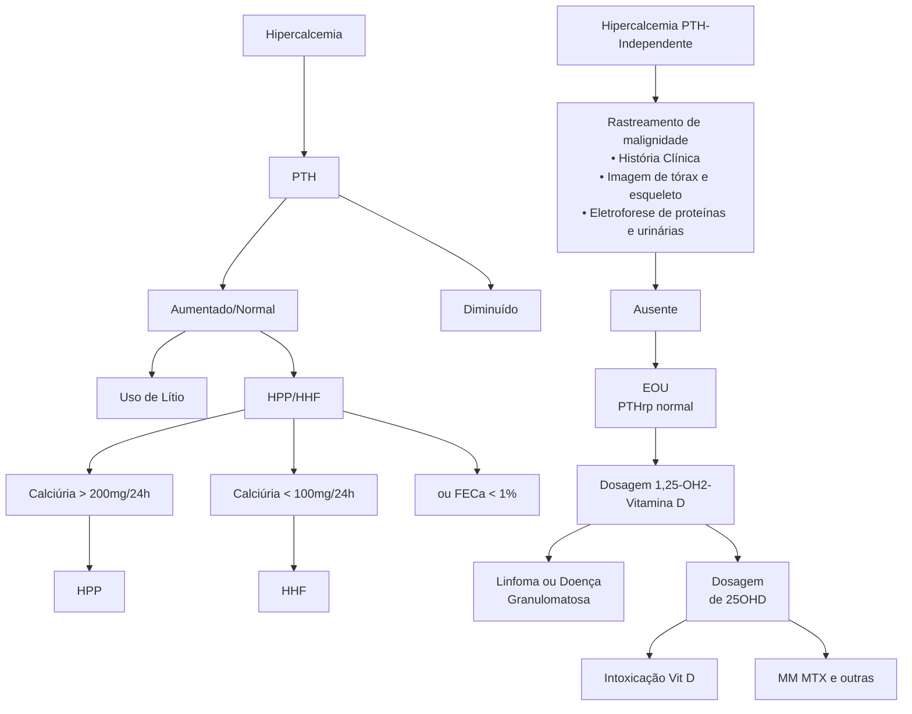
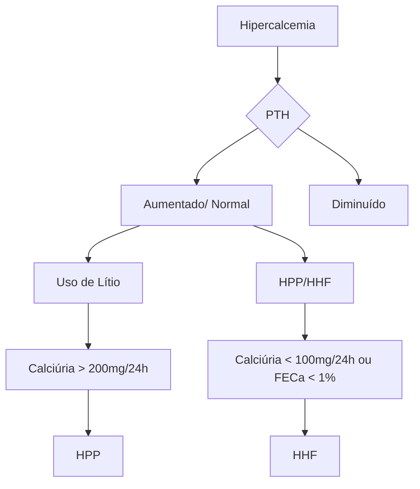
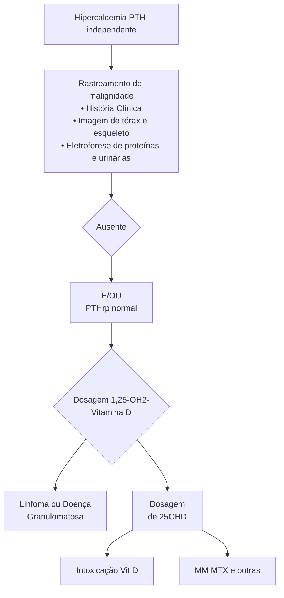

# HIPERCALCEMIAS

## 1. DIAGNÓSTICO DIFERENCIAL DAS HIPERCALCEMIAS

### 1.1 PRINCIPAIS CAUSAS QUE LEVAM À HIPERCALCEMIA

- Doenças endócrinas.
- Malignidades.
- Distúrbios inflamatórios.
- Secundário a medicamentos.
- Imobilização.
- A hipercalcemia da malignidade e o hiperparatireoidismo primário correspondem a 90% dos casos.

### 1.2 ENDOCRINOPATIAS

- **As endocrinopatias na hipercalcemia podem ser classificadas em PTH dependente e PTH independente.**

- **PTH dependente (há aumento do PTH):**
  - **Hipercalcemia Hipocalciúrica Familiar:** Principal diagnóstico diferencial de hiperparatireoidismo primário (a diferença está no Cau ↓). Condição genética geralmente associada à hipercalcemia leve, devido à mutação inativadora do CaSR. Assim, não ocorre o feedback negativo para diminuir o PTH. (↑ Cas ↑ PTH ↓ Cau (<100 mg/24h)). Realizar o cálculo da fração de excreção de cálcio (FECa): < 1% indica hipercalcemia hipocalciúrica familiar. (FECa = (Cau x Crs) / (Cru x Cas)).

  - **Hiperparatireoidismo Primário (HPP):** Principal causa. Ocorre o aparecimento de um adenoma na paratireoide, na maioria das vezes, que secreta grandes quantidades de paratormônio >> leva

ao aumento da reabsorção de cálcio nos ossos e nos rins. Como há grande quantidade de cálcio circulando, mesmo com a reabsorção dos rins, ainda há elevação do cálcio urinário. ↑ Cas (Ca sérico) ↑ PTH ↑ Cau (Ca urinário).

**OBS.: Crs = creatinina sérica; Cas = cálcio sérico; Cau = cálcio urinário.**

**Hiperparatireoidismo Terciário:**

- O hiperparatireoidismo secundário crônico leva a uma autonomia paratireoidiana. Por exemplo, na DRC, o rim não responde adequadamente à ação do PTH (devido à falência da função), prejudicando a reabsorção de cálcio e excreção de fosfato. Assim, ocorre aumento compensatório do PTH, levando a um hiperparatireoidismo terciário (↓ Cas ↑ PTH ↑P).

- **PTH independente (há diminuição do PTH):**
  - **Insuficiência Adrenal:** Aumento da Reabsorção Óssea e da Reabsorção do cálcio no TCP (túbulo contorcido proximal).

  - **Feocromocitoma:** Postula-se que o tumor possa produzir também PTHrp (proteína semelhante ao PTH, com efeitos semelhantes). O PTHrp não tem atividade sobre o aumento da 1-alfa-hidroxilase renal, logo, não leva à ativação da vitamina D.

  - **Tireotoxicose:** O excesso de hormônios tireoidianos leva ao aumento da reabsorção óssea e aumento do Cas. Como consequência há a diminuição do PTH e da ativação da Vit D.

ENDÓCRINO

**Tabela 1** Principais mecanismos relacionados à hipercalcemia

| Mecanismo de Hipercalcemia           | Tumores Associados                                                                                       | Mediador Principal                                 | Frequência |
| ------------------------------------ | -------------------------------------------------------------------------------------------------------- | -------------------------------------------------- | ---------- |
| Hipercalcemia Humoral da Malignidade | Câncer de células. Escamosas → Pulmão, cervical, esofágico, cabeça e pescoço
Mama
Ovário
Rim | Secreção de PTHrp                                  | 80%        |
| Invasão Osteolítica Local            | Mieloma múltiplo
Carcinoma de mama
Linfomas
Metástases ósseas                                | Elevação de RANKL
IL-6
TNF-alfa
PTHrp  | 20%        |
| Vitamina D Ativa                     | Linfomas                                                                                                 | Aumento da formação de 1,25-OH2-vitamina D (ativa) | <1%        |
| Secreção de PTH                      | Carcinoma primário de paratireoide                                                                       | Aumento de PTH                                     | <1%        |

PTHrp: ação similar ao PTH; PTHrp não ativa Vit D, não tem ação no TGI.

## 1.3 HIPERCALCEMIAS RELACIONADAS À MALIGNIDADE

• Principal causa de hipercalcemia em pacientes INTERNADOS. Enquanto que o HPP é a principal causa em pacientes AMBULATORIAIS.

• **Na Tabela 1, veremos os principais mecanismos relacionados à hipercalcemia nessas condições.**

## 1. 4 DISTÚRBIOS INFLAMATÓRIOS

• **Doenças Granulomatosas:**
  • Exemplos: Sarcoidose, Silicose, Beriliose, Granulomatose de Wegener e Granuloma Eosinofílico. TB, Candidíase, Hanseníase, Histoplasmose e Paracoccoccidiomicose.
  • Síndrome da Imunodeficiência Adquirida (Aids) → aumento da reabsorção óssea.
  • Intensa conversão e atividade da 1,25-OH2-vitamina D (ativa).

## 1.5 MEDICAMENTOS → OS PRINCIPAIS SÃO:

• **Uso excessivo de Vitamina D > 4000 UI/dia por > 6 meses.**
  • Pacientes jovens, sem fatores de risco → objetivo Vitamina D > 20.
  • Idosos e pacientes com fatores de risco → entre 30 e 60.
  • Doses elevadas de Vitamina A > 50.000UI/dia → leva ao aumento de reabsorção óssea.

• **Diuréticos Tiazídicos:**
  • Aumento da reabsorção de cálcio no TCD.
  • Hipercalcemia leve.

• **Carbonato de Lítio:**
  • Reduz a sensibilidade do CaSR → níveis elevados de PTH .
  • Reduz a depuração de cálcio pelo rim.

• **Tamoxifeno:**
  • Pode causar Hipercalcemia aguda autolimitada.

• **Síndrome do Leite Alcalino**
  • > 3g de cálcio (leite + bicarbonato → úlceras pépticas).
  • Alcalose, insuficiência renal e precipitação de cálcio no rim.
  • Hoje é um efeito colateral pouco observado pelo advento do uso dos inibidores de bomba de prótons (IBP).

**Figura 1** Fluxograma da hipercalcemia. Inicialmente, avaliar PTH, que, se aumentado ou normal, indica uma causa PTH dependente. Assim, deve-se excluir o uso de Lítio para pensar em HPP ou HHF. Esses últimos serão diferenciados a partir da análise da calciúria (Cau > 200 → HPP; Cau < 100 → HHF) ou da FECa, como mostra o fluxograma.

**Figura 2** Fluxograma na hipercalcemia com PTH diminuído. Proceder com rastreamento de malignidade. Se ausente a possibilidade de malignidade e/ou PTHrp normal, realizar dosagem da 1,25-OH2-vitamina D (forma ativa). Esse estará aumentado (pensar em linfoma ou doença granulomatosa) ou diminuído. Quando diminuído, dosar 25-hidroxi-vitamina D: aumentado (intoxicação por vitamina D) ou diminuído (mieloma múltiplo, metástases e outras).

HIPERCALCEMIAS

**Tabela 2** Quadro clínico das hipercalcemias.

| Sinais e Sintomas  | Leve (10,5 – 11,9mg/dL)         | Moderada (12 – 13,9mg/dL)       | Grave (> 14mg/dL)        |
| ------------------ | ------------------------------- | ------------------------------- | ------------------------ |
| Neuropsiquiátrico  | Depressão e Ansiedade           | Disfunção Cognitiva             | Letargia, estupor e coma |
| Gastrointestinal   | Anorexia, náuseas e constipação | Anorexia, náuseas e constipação | Pancreatite              |
| Renal              | Poliúria                        | Desidratação                    | Insuficiência Renal      |
| Cardíaca           | Encurtamento do iQT             | Encurtamento do iQT             | Arritmias e TV           |
| Musculoesquelético | Geralmente assintomático        | Fraqueza                        | Fraqueza acentuada       |

Hipercalcemia → comprometimento de aquaporinas e dano tubular → DI nefrogênico.

• A poliúria ocorre devido à hipercalcemia, que gera comprometimento das aquaporinas e dano tubular, dificultando a ação do ADH.

## 3. TRATAMENTO DA HIPERCALCEMIA

**3.1 CA < 12MG/DLS**
• Não há a necessidade de medidas imediatas para hipercalcemia → correção de distúrbio subjacente.

**3.2 CA > OU = 12 MG/DL**
• **Primeira medida = Hidratação com SF0,9%:**
  • 200 – 300mL/h → ajuste de vazão para manter débito urinário 100 – 150mL/h.
  • Aumenta excreção urinária de cálcio.
  • Parcimônia em nefropatas e cardiopatas.
• **Furosemida 10 – 20mg EV**
  • Somente se paciente hipervolêmico.
  • Não é primeira linha.
• **Bifosfonatos intravenosos**
  • Pamidronato 60 – 90mg, EV, 2 – 6 horas OU Zolendronato 5 mg, EV, 15 – 30 minutos.
  • Agentes mais eficazes para hipercalcemia da malignidade.
  • Pode repetir dose após 8 dias.
  • Contraindicado se ClCr < 35.
• **Denosumabe**
  • Hipercalcemia da malignidade refratários a bifosfonatos.
  • Seguro na insuficiência renal e ClCr < 35.
• **Calcitonina**
  • Ca > 14mg/dL → rápido início de ação (4 horas).
  • Via SC ou IM a cada 6 a 12 horas.
• **Glicocorticóides**
  • Úteis principalmente na Hipercalcemia mediada por 1,25-OH2-vitamina D.
  • Adjuvante na hipercalcemia da malignidade, malignidade hematológicas, intoxicação por vitamina D ou doença granulomatosa.
  • Prednisona 40 a 60mg VO OU Hidrocortisona EV.
  • Suspender após 10 dias se ausência de benefício.

• **Dieta rica em fosfato:**
  • 250-500 mg 4x/dia.
  • Essa medida reduz a absorção intestinal de cálcio.
• **Cinecalcete:**
  • Modula CaSR.
  • HPP grave sem condições de cirurgia, carcinoma de paratireoide e dialíticos com hiperpara secundário.
• **Diálise:**
  • Refratariedade a demais terapias, principalmente com hipervolemia e insuficiência renal.
• **Mobilização:**
  • Tratamento da etiologia do distúrbio hipercalcêmico.

## 4. HIPERPARATIREOIDISMO PRIMÁRIO

**4.1 CONCEITOS GERAIS**
• Hipersecreção do paratormônio (PTH)
• Causa mais comum de hipercalcemia ambulatorial
• Geralmente acomete pessoas entre 40 e 65 anos de idade e do sexo feminino 3:1.

**4.2 ETIOLOGIA**
• **Adenomas únicos de paratireoides → 85-90% casos (principal causa).**
• **Hiperplasia/adenomas múltiplos → 9-10 % casos.**
• **Carcinoma de paratireoides → < 1% casos**

**4.3 QUADRO CLÍNICO**
• **80-90% casos estarão na forma assintomática, com diagnóstico por meio do cálcio sérico na avaliação de rotina.**
  • Nesses casos, podem ter sintomas inespecíficos, como astenia, cansaço fácil, depressão e distúrbios de memória. Ausência de acometimento renal e ósseo.
• **15-20% dos pacientes terão acometimento renal. Manifestações renais:**
  • Nefrolitíase recorrente → 15 a 20% casos.
  • Perda gradativa da função renal.
  • Nefrocalcinose (depósito de cálcio no rim).

ENDÓCRINO

**Figura 3** Cálculos renais.

• 5% dos casos apresentam doença óssea que se expressam na forma de:
  • Osteíte fibrose cística: PTH apresenta ação catabólica no esqueleto apendicular e anabólica no axial. Assim, ocorre maior perda do osso cortical em relação ao trabecular. Pode se manifestar através de: dores ósseas, fraturas patológicas, fraqueza muscular (proximal) e deformidades. O diagnóstico pode ser dado em assintomáticos, por meio de achados radiológicos, densitométricos ou cintilográficos.

**Figura 4** Fratura em osso longo.

**Figura 5** Deformidade importante.

**Figura 6** Lesão em sal e pimenta no crânio.

**Figura 7** Reabsorção da interfalangeana distal, principalmente em área mais central.

**Figura 8** Osteoclastomas se manifestando através de lesão lítica simulando neoplasia

HIPERCALCEMIAS

**Figura 9** Osteoclastoma em mão.

**Figura 10** Osteoclastoma (sinal da seta).

Coluna AP Densidade Óssea

**Figura 11** Densitometria de coluna.

**Referência de densitometria: L1-L4**

BMD (g/cm²) | YA T-Score
---|---
1,443 | 2
1,319 | 1
1,195 | 0
1,071 | -1
0,947 Osteopenia | -2
0,823 | -3
0,699 | -4
0,575 | -5

Idade (anos): 20 30 40 50 60 70 80 90 100

| Região | BMD(g/cm²) | Jovem Adulto(%)T-Score | Corr. Etária(%)Z-Score |
| ------ | ---------- | ---------------------- | ---------------------- |
| L1     | 0,885      | 78
-2,1            | 91
-0,7            |
| L2     | 1,047      | 87
-1,3            | 101
0,1            |
| L3     | 1,100      | 91
-0,9            | 105
0,5            |
| L4     | 1,049      | 87
-1,3            | 101
0,1            |
| L1-L2  | 0,971      | 83
-1,7            | 97
-0,3            |
| L1-L3  | 1,019      | 86
-1,3            | 101
0,1            |
| L1-L4  | 1,027      | 86
-1,4            | 101
0,1            |
| L2-L3  | 1,075      | 89
-1,1            | 103
0,3            |
| L2-L4  | 1,066      | 88
-1,2            | 102
0,2            |
| L3-L4  | 1,074      | 89
-1,1            | 103
0,3            |

**Figura 12** Osteoclastoma (sinal da seta).

Left Forearm Bone Density

Ulna UD | Radius UD

Ulna 33% | Radius 33%

ENDÓCRINO

**Densitometry Ref: Radius 33% (BMD)**

| BMD (g/cm²)                              |              | YA T-score |
| ---------------------------------------- | ------------ | ---------- |
| 1.065                                    | Normal       | 2          |
| 0.976                                    |              | 1          |
| 0.888                                    |              | 0          |
| 0.799                                    |              | -1         |
| 0.710                                    | Osteopenia   | -2         |
| 0.621                                    |              | -3         |
| 0.532                                    |              | -4         |
| 0.444                                    | Osteoporosis | -5         |
| 0.355                                    |              | -6         |
| Age (years): 20 30 40 50 60 70 80 90 100 |              |            |

| Region     | BMD1
(g/cm²) | Young-Adult2
T-score | Age-Matched3
Z-score |
| ---------- | ---------------- | ------------------------ | ------------------------ |
| Radius 33% | 0.560            | -3.7                     | -2.0                     |

**Figura 13** Avaliação de densitometria de terço distal de rádio.

Fêmur direito Densidade Óssea

**Referência de densitometria: Colo**

| BMD (g/cm²)                               |             | YA T-Score |
| ----------------------------------------- | ----------- | ---------- |
| 1,316                                     | Normal      | 2          |
| 1,177                                     |             | 1          |
| 1,038                                     |             | 0          |
| 0,899                                     |             | -1         |
| 0,760                                     | Osteopenia  | -2         |
| 0,621                                     |             | -3         |
| 0,482                                     | Osteoporose | -4         |
| 0,343                                     |             | -5         |
| Idade (anos): 20 30 40 50 60 70 80 90 100 |             |            |

| Região | BMD1
(g/cm²) | Jovem Adulto2
(%) T-Score |      | Corr. Etária3
(%) Z-Score |     |
| ------ | ---------------- | ----------------------------- | ---- | ----------------------------- | --- |
| Colo   | 0,861            | 83                            | -1,3 | 102                           | 0,1 |
| Total  | 0,949            | 94                            | -0,5 | 109                           | 0,6 |

**Figura 14** Avaliação de densitometria de fêmur.

• Achados na Cintilografia óssea: evidencia grande atividade óssea em todo o esqueleto, principalmente na porção apendicular.

Anterior        Posterior

**Figura 15** Cintilografia óssea.

• **Manifestações cardiovasculares**
  • Hipertensão.
  • Calcificações valvulares e miocárdica.
  • Dislipidemia → redução HDL e aumento de TGL.
  • Aumento de mortalidade por todas as causas e cardiovascular.
• **Manifestações psiquiátricas**
  • Depressão e ansiedade (principal).
  • Fadiga.
  • Perda de memória.
  • Dificuldade de concentração.
  • Irritabilidade.
  • Somatização.
  • Distúrbios do sono.
• **Outros sinais e sintomas possíveis**
  • Hipercalcemia → poliúria, polidipsia, prurido, anorexia, constipação intestinal, náuseas e vômitos.
  • Pancreatite aguda/crônica.
  • Calcificações ectópicas (em pulmões, rins, artérias e pele).
  • Ceratopatia.
  • Neuropatia periférica.

HIPERCALCEMIAS                                                                                                                 7

## 4.4 ACHADOS LABORATORIAIS

• Hipercalcemia + PTH elevado.
• Hipofosfatemia (devido à fosfatúria).
• Hipomagnesemia → hipercalcemia aumenta a excreção renal.
• Hipercalciúria.
• Aumento de 1,25-OH2-vitamina D e redução da 25-OH-vitamina D → aumento da ação da 1-alfa-hidroxilase.
• Acidose metabólica hiperclorêmica → devido ao efeito fosfatúrico do PTH.

## 4.5. TRATAMENTO

**Cirúrgico de escolha.**

• **Solicitar para avaliação de complicações e indicações cirúrgicas:**
  • **Densitometria Óssea de Coluna, Fêmur e Rádio Distal.**
  • **Radiografia de ossos longos e crânios.**
  • **USG de rins e vias urinárias.**

**Indicações:**
• **Nefrolitíase.**
• **Osteíte fibrose cística.**
• **HPTP assintomático (sem doença óssea ou renal), associado a uma ou mais das seguintes situações:**
• **Cálcio sérico > 1 mg/dL acima do limite superior da normalidade;**
• **ClCr < 60 ml/min/1,73 m2;**
• **T-Score < -2,5 em coluna lombar, quadril e /ou antebraço;**
• **Idade < ou = 50 anos;**
• **Hipercalciúria (calciúria > 400mg/24h);**
• **Pacientes cujo acompanhamento médico não seja possível ou desejado.**
• **Havendo indicação cirúrgica, prosseguir com exames localizatórios: Cintilografia com Sestamibi e USG de região.**

## 4.6 EXAMES DE IMAGEM

• **Cintilografia com Sestamibi.**
  • Padrão-ouro.
  • Falso-positivo: nódulos tireoidianos.
  • Falso-negativo: depende do tamanho e localização das paratireoides acometidas.

**Figura 16** Cintilografia com Sestamibi de região cervical evidenciando hipercaptação em paratireoide superior direita (em cima) e inferior esquerda (embaixo).

• **USG de região cervical**
  • Útil para detectar adenomas paratireoideos não visualizados pela cintilografia.
  • Desvantagens: Operador dependente; Dificuldade na distinção entre adenomas paratireoidianos, intratireoidianos e nódulos tireoidianos.

**Figura 17** USG de região cervical.

• Sensibilidade:

**Tabela 3** Comparação de sensibilidade de exames de imagem.

|                         | Adenomas Únicos | Hiperplasia | Adenomas Duplos |
| ----------------------- | --------------- | ----------- | --------------- |
| Cintilografia Sestamibi | 88,4%           | 44%         | 30%             |
| UCG                     | 78,5%           | 35%         | 16,2%           |

• **Tomografia computadorizada por emissão de fóton único (TC-MIBI SPECT)**
  • Sensibilidade
  • USG + SPECT/CT = 97%;
  • Cintilografia + SPECT/CT = 84%.

**Figura 18** Tomografia computadorizada por emissão de fóton único (TC-MIBI SPECT)

## 4.7 TRATAMENTO CIRÚRGICO

• **A cura cirúrgica ocorre em 95 a 98% dos casos.**
• Recidiva maior quando há hiperplasia/doença multiglandular.
• Aumento da DMO 6 meses após cirurgia.
• Redução do risco de fraturas e nefrolitíase.
• Melhora a qualidade de vida.
• **Dois tipos:**

• **Tradicional:** Exploração cervical bilateral com identificação de todas paratireoides e retirada das aparentemente anormais. Múltiplas glândulas aumentadas: retiram três paratireoides e metade da com aspecto mais normal = paratireoidectomia subtotal.
• **Minimamente invasiva:** paratireoidectomia minimamente invasiva (PMI). Cintilografia com sestamibi pré-operatória para localização do adenoma. Dosagem intra-operatória do PTH. Queda ≥ 50% do PTH → cura + normalização da calcemia (acurácia 95%). Redução < 50% do PTH → doença em múltiplas glândulas ou lento metabolismo do PTH exploração adicional das outras paratireoides.
• 4.8 Complicações são infrequentes (1 a 3%):
• **Sangramento.**
• **Lesão do nervo recorrente laríngeo.**
• **Hipocalcemia pós-operatória:**
  • Hipoparatireoidismo transitório;
  • Hipomagnesemia → inibe secreção e ação do PTH;
  • Síndrome da fome óssea.
• **Hipocalcemia sintomática 3 a 7 dias após cura cirúrgica devido à ávida captação de cálcio e fósforo pelos ossos.**
• **Fatores de risco:** elevação pré-operatória da FA + envolvimento ósseo acentuado.

## 4.8 TRATAMENTO NÃO CIRÚRGICO:

• **Indicado para:**
  • Pacientes que não preenchem critério cirúrgico ou apresentam contra-indicação ou falha à terapia cirúrgica.
• **Suporte:**
  • Boa hidratação.
  • Evitar tiazídicos e lítio.
  • Dieta com 1.000 a 1.200mg cálcio por dia.
• **Cinecalcete:**
  • Agente calcimimético que:
  • Reduz calcemia e PTH; Reduz número e tamanho dos cálculos renais; Não aumenta DMO.
  • Reduz número e tamanho dos cálculos renais;
  • Não aumenta DMO.
  • Pode causar artralgias, mialgias, cefaléia, diarreia e náuseas.

HIPERCALCEMIAS

# REFERÊNCIAS

**Figura 3** Cálculos renais.

(Vilar, Lucio [et al] . Endocrinologia Clínica. 7ª edição. Rio de Janeiro: Guanabara Koogan, 2021.)

**Figura 4** Fratura em osso longo.

(Vilar, Lucio [et al] . Endocrinologia Clínica. 7a edição. Rio de Janeiro: Guanabara Koogan, 2021.)

**Figura 5** Deformidade importante.

(Vilar, Lucio [et al] . Endocrinologia Clínica. 7ª edição. Rio de Janeiro: Guanabara Koogan, 2021.)

**Figura 6** Lesão em sal e pimenta no crânio.

(Vilar, Lucio [et al] . Endocrinologia Clínica. 7ª edição. Rio de Janeiro: Guanabara Koogan, 202)

**Figura 7** Osteoclastomas se manifestando através de lesão lítica simulando neoplasia.

(Vilar, Lucio [et al] . Endocrinologia Clínica. 7ª edição. Rio de Janeiro: Guanabara Koogan, 202)

**Figura 8** Osteoclastomas se manifestando através de lesão lítica simulando neoplasia

(Vilar, Lucio [et al] . Endocrinologia Clínica. 7ª edição. Rio de Janeiro: Guanabara Koogan, 2021.)

**Figura 9** Osteoclastoma em mão.

(Vilar, Lucio [et al] . Endocrinologia Clínica. 7ª edição. Rio de Janeiro: Guanabara Koogan, 2021.)

**Figura 10** Osteoclastoma (sinal da seta).

(Vilar, Lucio [et al] . Endocrinologia Clínica. 7ª edição. Rio de Janeiro: Guanabara Koogan, 2021.)

**Figura 11** Densitometria de coluna.

(Vilar, Lucio [et al] . Endocrinologia Clínica. 7ª edição. Rio de Janeiro: Guanabara Koogan, 2021.)

**Figura 12** Osteoclastoma (sinal da seta).

(Vilar, Lucio [et al] . Endocrinologia Clínica. 7ª edição. Rio de Janeiro: Guanabara Koogan, 2021.)

**Figura 13** Avaliação de densitometria de terço distal de rádio.

(Vilar, Lucio [et al] . Endocrinologia Clínica. 7ª edição. Rio de Janeiro: Guanabara Koogan, 2021)

**Figura 14** Avaliação de densitometria de fêmur.

(Vilar, Lucio [et al] . Endocrinologia Clínica. 7ª edição. Rio de Janeiro: Guanabara Koogan, 2021)

**Figura 15** Cintilografia óssea.

(Vilar, Lucio [et al] . Endocrinologia Clínica. 7ª edição. Rio de Janeiro: Guanabara Koogan, 2021)

**Figura 16** Cintilografia com Sestamibi de região cervical evidenciando hipercaptação em paratireoide superior direita (em cima) e inferior esquerda (embaixo).

Vilar, Lucio [et al]. Endocrinologia Clínica. 7ª edição. Rio de Janeiro: Guanabara Koogan, 2021.)

**Figura 17** USG de região cervical. (Vilar, Lucio [et al] . Endocrinologia Clínica. 7ª edição. Rio de Janeiro: Guanabara Koogan, 2021.)

Vilar, Lucio [et al]. Endocrinologia clínica. 7ª edição. Rio de Janeiro: Guanabara Koogan, 2021.

**Figura 18** Tomografia computadorizada por emissão de fóton único (TC-MIBI SPECT)

Vilar, Lucio [et al]. Endocrinologia clínica. 7ª edição. Rio de Janeiro: Guanabara Koogan, 2021.
