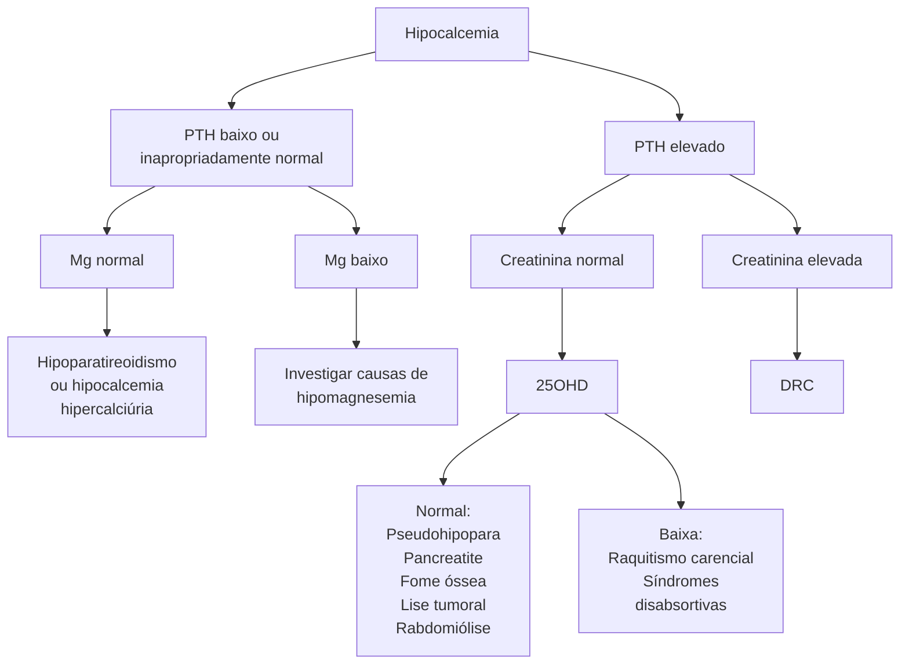
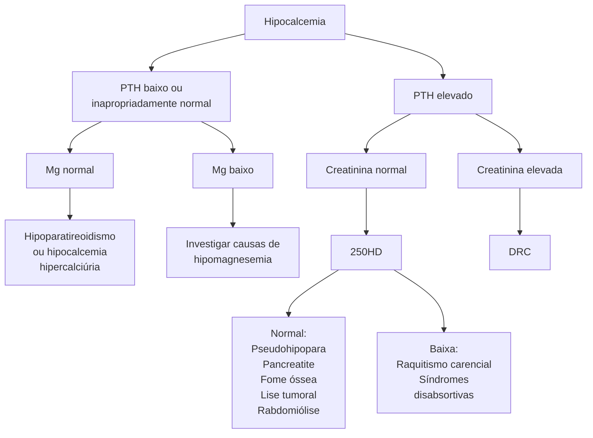

# HIPOCALCEMIAS

## Etiologia

## 1. DIAGNÓSTICO DIFERENCIAL DAS HIPOCALCEMIAS

### 1.1 CAUSAS

**Relacionadas ao PTH**
- Hipoparatiroidismo;
- Hipocalcemia hipercalciúrica familiar → mutação de hiperativação do CaSR;
- Alterações no magnésio sérico.

**Não relacionadas ao PTH:**
- Raquitismo e Osteomalácia;
- DRC;
- Drogas;
- Fome Óssea;
- Pancreatite Aguda;
- Rabdomiólise;
- Síndrome de Lise Tumoral;
- Câncer de Próstata (com metástases osteoblásticas);
- Doente crítico;
- Hipoalbuminemia.

### 1.2 CAUSAS RELACIONADAS AO PTH

**Hipoparatireoidismo primário:**
- **Achados:** ↓ PTH; Hipercalciúria; Hipofosfatúria; ↓ 1,25-OH2-vitamina D (forma ativa) → logo, há menor absorção intestinal de cálcio;
- **Causas:** Pós-cirúrgico (retirada inadvertida das paratireoides); Pseudo-hipoparatireoidismo (resistência à ação do PTH); Autoimune; Genéticas; Infiltração neoplásica; Irradiação.

**Hipocalcemia hipercalciúrica OU autossômica dominante:**

- Mutação ativadora do CaSR → CaSR estimulado mesmo com Ca baixo;
- Hipocalcemia discreta;
- PTH inapropriadamente normal ou baixo;
- Hipercalciúria importante.

**Alterações nas concentrações de magnésio:**
- **Hipermagnesemia – Causas:** Insuficiência Renal; Uso exógeno.
- **Hipermagnesemia – Fisiopatologia:** O magnésio é um agonista do CaSR, assim, haverá uma hiperativação que interpreta como excesso de cálcio, levando a supressão do PTH e hipocalcemia;
- **Hipomagnesemia – Causas:** Diarreia crônica; Etilismo; DM descompensado; Medicamentos.
- **Hipomagnesemia – Fisiopatologia:** Causam redução da produção e resistência ao PTH.

### 1.3 CAUSAS NÃO RELACIONADAS AO PTH

**Raquitismo e Osteomalácia:**
- Ocorre quando a 25-OH-vitamina D < 10mg/mL (deficiência grave) → causa um hiperparatireoidismo secundário, pois haverá uma menor absorção intestinal de cálcio. Consequências: aumento da fosfatúria e hipofosfatemia.
- A associação Hipocalcemia + Hipofosfatemia gera um comprometimento importante na formação do osso, causando: Raquitismo (crianças) → deformidades ósseas em MMII, retardo de crescimento e alterações dentária; Osteomalácia (adultos) → dor e fraqueza muscular.

**Insuficiência Renal Crônica:**

ENDÓCRINO

• A redução da TFG causa hiperfosfatemia, devido ao prejuízo da função renal. Essa situação leva à ativação de outro hormônio, o FGF23, que apresenta efeito fosfatúrico;
• O FGF23 inibe a 1-alfa-hidroxilase, logo, haverá menos conversão para 1,25-OH2-vitamina D (forma ativa) → resulta em hiperparatireoidismo secundário (compensatório);
• Quando a TFG está muito baixa (< 20 – 25mL/ min/1,73m2), ocorre a perda do efeito compensatório do PTH → assim, haverá hipocalcemia.
• Drogas:
  • **Álcool;**
  • Aminoglicosídeo;
  • Anfotericina;
  • **Anticonvulsivantes** (fenobarbital, carbamazepina e fenitoína);
  • Antivirais;
  • **Bifosfonatos;**
  • **Calcimiméticos;**
  • Cisplatina;
  • **Denosumabe;**
  • **Diuréticos de alça;**
  • Glicocorticoide;
  • **IBPs;**
  • Isoniazida;
  • Laxativos;
  • Quelantes de cálcio (citrato e foscamete);
  • Rifampicina;
  • Teofilina.
  •

## 2. QUADRO CLÍNICO

• A intensidade dos sintomas depende da velocidade de instalação da hipocalcemia. Quanto mais aguda, mais sintomas.

### 2.1 SINAIS E SINTOMAS:
• Parestesias em face ou extremidades;
• Fraqueza e dor muscular;
• Espasmos carpopediais;
• Hiperreflexia;
• Contrações musculares dolorosas;
• Tetania;
• Dores abdominais;
• Vômitos;
• Papiledema + ou – HIC;
• Broncoespasmos e laringoespasmos;
• Redução da contratilidade cardíaca;
• Bradicardia;
• Distúrbios de condução prolongamento QT;
• Hipotensão refratária;
• IC;
• Petéquias e púrpuras.

### 2.2 HIPOCALCEMIA CRÔNICA:
• Alterações de humor;
• Alucinações;
• Crises convulsivas;
• Episódio psicótico;
• Pele seca;
• Unhas quebradiças.

**Figura 1** Fluxograma na hipocalcemia.

HIPOCALCEMIAS

**Figura 2** Espasmo carpal.

• Achados semiológicos utilizados para rastreamento clínico de hipocalcemia:
  • **Sinal de Chvostek** → percussão no trajeto do nervo facial e ocorre contração ipsilateral ao local de percussão. Baixa acurácia → presente em 25% dos casos em indivíduos saudáveis.
  • **Sinal de Trousseau** → inflar o manguito de aferição da pressão arterial no membro e mantém a pressão 20-30 mmhg acima do valor da PA sistólica do paciente, por 3 minutos. Na hipocalcemia, o paciente fará a mão do parteiro (flexão do indicador com manutenção da posição dos demais dedos): Boa acurácia → 1% dos indivíduos normais o terão e 94% dos hipocalcêmicos.

**Figura 3** Sinal de Trousseau.

## 2.3 NO HIPOPARATIREOIDISMO (HIPOCALCEMIA + HIPERFOSFATEMIA CRÔNICOS) OCORRE A CALCIFICAÇÃO DE PARTES MOLES:

• SNC (gânglios da base) e rins;
• Olhos, vasos sanguíneos e articulações.

**Figura 4** Calcificações.

## 3. TRATAMENTO

### 3.1 TRATAMENTO AGUDO

• Realizar em pacientes com Ca < 7-7,5 mg/dL com ou sem sintomas neurológicos;
• Gluconato de cálcio EV - 01 a 02 ampolas diluídas em 50-100 mL SF 0,9% ou SG 5% em 10 a 20 minutos;
• Após, deixar em infusão contínua de cálcio elementar 0,5-2mg/kg/hora em SG5%;
• Início de cálcio VO quando o paciente tiver condições de ingerir.

## 3.2 TRATAMENTO CRÔNICO

• Nos casos de hipocalcemia crônica leve a moderada, o tratamento depende da etiologia;
  • Deficiência de vitamina D → reposição até atingir > 30 ng/mL;
  • Hipomagnesemia: Grave → Sulfato de Magnésio EV; Leve a Moderada → Pidolato de Magnésio VO.
• Reposição de cálcio oral:
  • Carbonato de cálcio: Escolha na reposição de cálcio oral, por apresentar maior benefício e promover espoliação de fosfato; 40% de Ca elementar (maior concentração); Depende do meio ácido para absorção; Causa mais obstipação.
  • Citrato de cálcio: 21% cálcio elementar e não depende de meio ácido para absorção (gastrectomizados e usuários de IBPs).

## 3.3 TRATAMENTO ESPECÍFICO NO HIPOPARATIROIDISMO

• Meta Terapêutica:
  • Cálcio no limite inferior da normalidade;
  • Fósforo no limite superior da normalidade;
  • Calciúria 24h < 300mg (homens) e 250mg (mulheres) OU 4 mg/kg. (A fim de evitar hipercalciúria e precipitação no rim).
• Dose dividida ao longo das refeições (para evitar a saturação do receptor de cálcio intestinal):
  • Lembrando que o Carbonato quela fósforo e é melhor absorvido em meio ácido. Outra opção é o Citrato de cálcio;
  • Calcitriol (vitamina D ativa).
• **Em 2015, o FDA aprovou a molécula semelhante ao PTH (PTH 1-84), que é eficaz, mas apresenta a limitação do alto custo. Distante da realidade.**

# REFERÊNCIAS

**Figura 2** Espasmo carpal.

Vilar et al. Endocrinologia Clínica. Guanabara Koogan. Rio de Janeiro, 2021.

**Figura 3** Sinal de Trousseau.

Vilar et al. Endocrinologia Clínica. Guanabara Koogan. Rio de Janeiro, 2021.

**Figura 4** Calcificações.

Vilar et al. Endocrinologia Clínica. Guanabara Koogan. Rio de Janeiro, 2021.
