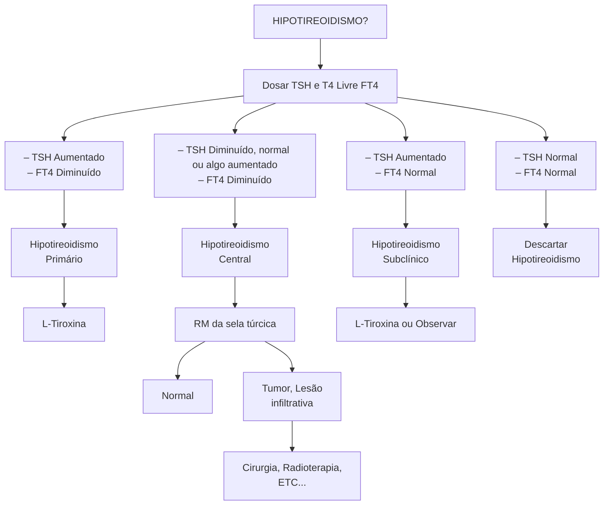
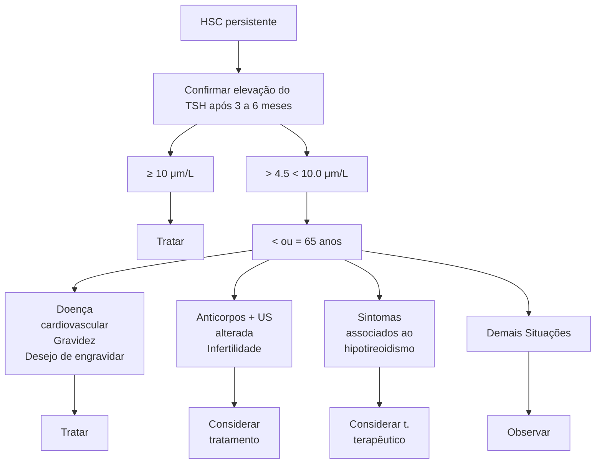

# HIPOTIREOIDISMO

## Etiologia:
• Principal = Primária → Tireoidite de Hashimoto
• Outras = Primária → Pós-cirúrgica e pós-iodoterapia
• Secundária → Tumores da Hipófise e Hipotálamo

## Quadro Clínico:
• Bradicardia, hipotermia, PA convergente, depressão, intolerância ao frio, ganho de peso, sonolência, pele ressecada, queda de cabelo e unhas quebradiças

## Diagnóstico:
• Primário = TSH alto e T4L baixo

• Secundário = TSH baixo e T4L normal
• Hipotireoidismo subclínico = TSH alto e T4L normal

## Tratamento:
• Hipotireoidismo Clínico = Levotiroxina 1,6 a 1,8mcg/kg/dia → jejum, com água, se alimentar ou tomar medicações após 30 minutos
• Hipotireoidismo Subclínico = se TSH > ou = 10; TSH entre 7 e 10 em < 65 anos com cardiopatia/infertilidade/desejo de gestar/ anti-TPO positivo

## 1. INTRODUÇÃO

### 1.1 CAUSAS
• Primária (>90%): Autoimune (Tireoidite de Hashimoto); Anticorpos contra a tireoperoxidase e contra a tireoglobulina; Pós-radioiodoterapia; Pós-cirúrgico; Deficiência de iodo; Medicamentos, como lítio, amiodarona e INF-alfa;
• Secundária e Terciária (Central) (10%): Tumores de hipófise/hipotálamo; Radioterapia; Doenças infiltrativas, como sarcoidose; Doenças granulomatosas.

### 1.2 FATORES DE RISCO
• Idade > 60 anos;
• Sexo feminino;
• Auto-anticorpos (anti-TPO anti-tireoglobulina);
• História familiar de doenças autoimunes da tireoide;
• Bócio e nódulos;
• Baixa ingesta de iodo;
• Doenças autoimunes (DM1, Doença de Addison, LES);
• Síndrome de Down;
• Radioterapia de cabeça e pescoço;
• Uso de amiodarona, lítio, tionamidas e INF-alfa.

## 2. QUADRO CLÍNICO E DIAGNÓSTICO

### 2.1 SINTOMAS
• Entender como se fosse um "downregulation" de todo o corpo;
• Sonolência, hipoatividade, depressão, diminuição dos reflexos, ganho de peso discreto (2 a 3kg, por edema), infiltrado periorbitário, lentificação do ritmo intestinal, intolerância ao frio, irregularidade menstrual, PA convergente, arritmias cardíacas.

### 2.2 DIAGNÓSTICO
• Confira na página seguinte a Figura 1
• Perante suspeita clínica de hipotireoidismo, dosar TSH e T4 livre: TSH alto e T4L baixo = hipotireoidismo primário, tratamos com levotiroxina; TSH baixo, e T4L baixo = hipotireoidismo central, pedir RNM da

sela túrcica; TSH alto e T4L normal = hipotireoidismo subclínico, tratar com levotiroxina ou observar; TSH normal e T4L normal = descartado hipotireoidismo;
• Outras alterações: Dislipidemia (elevação de LDL e triglicerídeos - hipercolesterolemia mais importante); Aumento de CPK, TGO; TGP e LDH; Hiperprolactinemia (redução do T4 leva a elevação de TRH. TRH estimula a secreção hipofisária de TSH e prolactina) - tratamento é compensar o hipotireoidismo; Hiponatremia (devido ao aumento de ADH).

## 3. TRATAMENTO

### 3.1 LEVOTIROXINA (REPOSIÇÃO DE T4)
• Orientações: Tomar de 30 a 60 minutos em jejum pela manhã ou 4h após última refeição; Uso regular; Sempre a mesma marca (se trocar a marca, muda a farmacocinética); Não associar com outras medicações;
• Dose 1,6 a 1,8 micrograma/kg/dia (adultos jovens): Idosos e crianças com doses mais baixas (alvo de TSH entre 2-6 mIU/L); Reavaliar a dose em 6 semanas com base no TSH (se for hipotireoidismo primário) ou no T4L (se for hipo central);
• Hipotireoidismo refratário: Dose > 2,5 mcg/kg/dia OU > 250 a 300 mcg/dia; Deve-se avaliar a adesão e correta administração do medicamento; Dose adequada para o peso corporal?; Uso de drogas que afetam a necessidade de levotiroxina; Exclusão de condições médicas que interfiram na absorção pelo TGI; Teste de absorção oral de LT4; Má absorção gastrointestinal x pseudo má-absorção.
• Confira na página seguinte a Tabela 1

### 3.2 TRATAMENTO DE HIPOTIREOIDISMO SUBCLÍNICO (HSC)
• HSC persistente = confirmar elevação do TSH após 3-6 meses;
• Após confirmação, avaliar tratamento medicamentoso ou apenas observação com base nos níveis de TSH, idade e situações clínicas;
• Se paciente > 80-85 anos a tendência a não tratar. Figura 2

ENDÓCRINO

## HIPOTIREOIDISMO?

Dosar TSH e T4 Livre (FT4)

**Figura 1** Procedimento diagnóstico de hipotireoidismo

**Tabela 1** Causas de hipotireoidismo

| Absorção ↓                                                                                                            | Metabolismohepático ↑                                                                       | ConversãoFigura 3T4 em T3 ↓                  | Inibe sínteseHT                                 | TBG ↑                                               | ?                                                                          |
| --------------------------------------------------------------------------------------------------------------------- | ------------------------------------------------------------------------------------------- | -------------------------------------------- | ----------------------------------------------- | --------------------------------------------------- | -------------------------------------------------------------------------- |
| DII
Giardíase
Y Roux
Enteropatia DM
H. Pylori
Fármacos: IBP, Sulfato
Ferrose, Carbonato de Ca | Sertralina
Carbamazepina
Estrogênios
Fenitoína
Rifampicina
Fenobarbital | Amiodarona
Beta-bloq
Glicocorticoide | Amiodarona
Lítio
Contraste
com iodo | Gravidez
Estrógenos
Tamoxifeno
Metadona | MTF
Insulina
Sulfoniureiais
ADT
Cumarínicos
Tiazídicos |

**Figura 2** Procedimento de tratamento de hipotireoidismo subclínico.

HIPOTIREOIDISMO                                                                                            3

# 4. COMA MIXEDEMATOSO

## 4.1 FISIOPATOLOGIA

Hipotireoidismo Longa Data não controlado

↓

Redução do Metabolismo

↓

Mecanismos Compensatórios

↓

Homeostase

**Fator Precipitante**
- Infecção
- Exposição ao frio
- SCA
- Medicamentos
- Cirurgias
- Traumas

↓

Estado Mixedematoso

**Figura 3** Fisiopatologia do coma mixedematoso.

## 4.2 QUADRO CLÍNICO

- É uma emergência médica grave;
- História de tireoidopatia;
- Achados de hipotireoidismo descompensado;
- Hipotermia;
- Bradicardia + hipoxemia + hipercapnia;
- Derrame pericárdico e pleural;
- CPK > 500U/L;
- Rebaixamento de nível de consciência e sonolência; desorientação e letargia; convulsões; coma;
- Hipoglicemia.

## 4.3 DIAGNÓSTICO

- Suspeitar em todo paciente que tem histórico de tireoidopatia e cursa com hipotermia e/ou bradicardia + alteração do nível de consciência;
- Deve-se coletar exames laboratoriais (rastreio infeccioso e metabólico, TSH e T4 livre) e iniciar TRATAMENTO IMEDIATAMENTE.

## 4.4 TRATAMENTO

**Tabela 2** Tratamento de coma mixedematoso.

| **Suporte de vida**               | Monitorização e suporte ventilatório                |
| --------------------------------- | --------------------------------------------------- |
| **Tratar fator precipitante**     | Antibioticoterapia até ser descartada infecção      |
| **Correção DHE**                  | Hiponatremia e hipoglicemia                         |
| **Aquecimento**                   | Gradual e passivo                                   |
| **Reposição HT**                  | T4 ou T3 -> LT4 IV ou VO: 500 μg + 100 a 175 μg/dia |
| **Reposição de glicocorticoides** | Hidrocortisona 50 a 100mg IV a cada 6 a 8h          |
