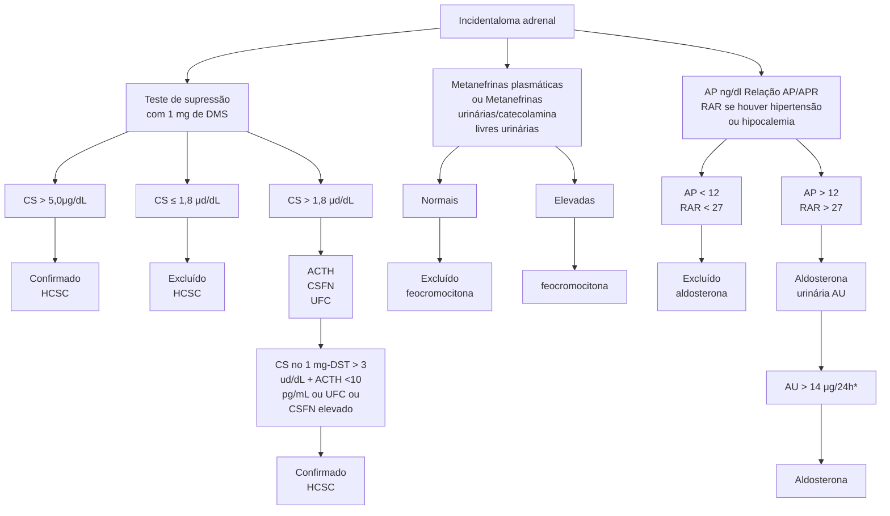
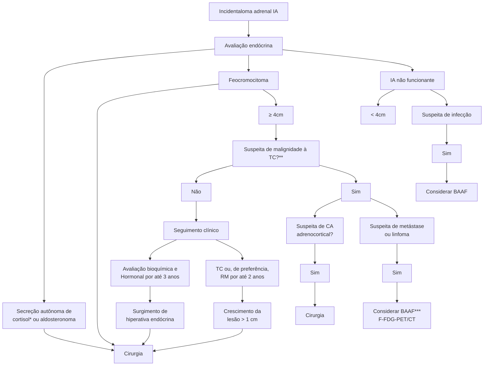

Incidentaloma Adrenal (CM)

# INCIDENTALOMA ADRENAL

## INCIDENTALOMA ADRENAL

**INCIDENTALOMA ADRENAL**
- Achado ao acaso de tumor na adrenal > ou = 1cm

**PASSO 1 = Avaliação Hormonal**
- Cortisol pós 1mg de Dexametasona
- Catecolaminas e Metanefrinas na urina 24h
- Relação Aldosterona/Atividade plasmática de Renina (se HAS ou Hipocalemia)

**PASSO 2 = Avaliar Características de Malignidade na TC**
- Hiperdensidade (> 10UH)

- Heterogeneidade
- Calcificações
- Tamanho > 4cm
- Clareamento lento do contraste (washout lento)
- Limites imprecisos

**Indicação Cirúrgica**
- Produção de hormônios
- Tamanho > 4cm
- Crescimento > 1 cm em 1 ano

## 1. DEFINIÇÃO

- Incidentaloma (lembrar de incidente/"sem querer"), por exemplo, pode ser um paciente que chega com falta de ar, realiza uma TC de tórax e como é possível visualizar o abdome superior, incidentalmente (não era o objetivo), observa-se uma lesão > 1 cm na adrenal.
- Lesão na adrenal > ou = 1 cm, descoberta **acidental**
  - Adenomas corticais não funcionantes (70 a 80%);
  - Feocromocitoma (1,1 a 11%);
  - Hipercortisolismo subclínico (5 a 20%);
  - Hiperaldosteronismo primário (1 a 2%);
  - Carcinomas adrenocorticais (< 5%)
  - Metástases (0-18%).
- Deve-se avaliar o risco de malignidade e se há produção hormonal.
- Mais comum: unilateral, adenomas.
  - No caso de lesões bilaterais, podem estar relacionadas com doenças infiltrativas, metástases, hiperplasia adrenal.

### 1.1 AVALIAÇÃO DO RISCO DE MALIGNIDADE

- Podem ser: Adenoma; Carcinoma; Feocromocitoma; Metástase;
- Para diferenciar entre ditos acima, deve ser solicitada a TC com cortes finos de suprarrenal com contraste (lembrar de especificar que é de suprarrenal) e avaliar: tamanho; formato; atenuação; washout (velocidade da redução da densidade de contraste de uma lesão); outras caraterísticas;

OBS.: mesmo no paciente em que o nódulo foi flagrado em uma TC de tórax, por exemplo, deve ser solicitada a TC com cortes finos de suprarrenal, para melhor avaliação.

- Adrenal normal: Formato de "Y invertido".

**Figura 1** Adrenal em radiologia

### 1.2 ADENOMAS

- Tamanho menor ou igual a 3 cm;
- Formato: ovalado e bem delimitado;
- Atenuação menor ou igual a 10UH;
- Washout: rápido (> 50%) – lesões benignas têm washout rápido;
- Outros: homogêneo, sem degeneração cística ou calcificação.

**Figura 2** Adenoma de adrenal

### 1.3 FEOCROMOCITOMA

- Tamanho maior ou igual a 3 cm;
- Formato: ovalado e bem delimitado;
- Atenuação maior ou igual a 10 UH;
- Washout: lento (<50%);
- Outros: crescimento > 1 cm/ano, heterogêneo, unilateral, degeneração cística e pontos de calcificações;
- Pode ser câncer em 10 a 20% dos casos.

**Figura 3** Feocromocitoma

ENDÓCRINO

## 1.4 CARCINOMA (CÂNCER DE ADRENAL)

• Tamanho maior ou igual a 4 cm;
• Formato: irregular e mal delimitado;
• Atenuação maior ou igual a 10UH, muitas vezes maior que 25UH;
• Washout: lento (<50%);
• Outros: crescimento > 0,8 cm, 3-12 meses, heterogêneo, unilateral, necrose hemorrágica e calcificações.

## 1.5 METÁSTASES

• Tamanho: variável;
• Principais tumores primários que causam metástase são pulmão e mama;
• Formato: irregular e mal delimitado;
• Atenuação maior ou igual a 10UH;
• Washout: lento (<50%);
• Outros: heterogêneo, bilateral, degeneração cística e calcificações.

CT scan image showing carcinoma with arrow pointing to irregular mass in adrenal region.

**Figura 4** Carcinoma

CT scan image showing adrenal metastases with arrows pointing to bilateral lesions.

**Figura 5** Metástase adrenal

**Tabela 1** Resumão

|                                | ADENOMA                                      | CARCINOMA                           | FEOCROMOCITOMA                              | METÁSTASES                                |
| ------------------------------ | -------------------------------------------- | ----------------------------------- | ------------------------------------------- | ----------------------------------------- |
| **TAMANHO**                    | < 3cm                                        | > 4cm                               | > 3cm                                       | Variável                                  |
| **FORMA**                      | Redondo/Oval/
Margens bem
daefinidas | Irregular/Margens mal
definidas | Redondo/Oval/
Margens bem
definidas | Oval/Irregular/
Margens mal definidas |
| **TEXTURA**                    | Homogênea                                    | Heterogênea/
Densidades mistas  | Heterogênea/áreas
císticas              | Heterogênea/
Densidades mistas        |
| **LATERALIDADE**               | Unilateral                                   | Unilateral                          | Unilateral                                  | Bilateral                                 |
| **ATENUAÇÃO**                  | < ou = 10UH                                  | > 10UH                              | > 10UH                                      | > 10UH                                    |
| **VASCULARIZAÇÃO**             | Pouca                                        | Vascularizado                       | Vascularizado                               | Vascularizado                             |
| **WASHOUT**                    | Rápido (> 50 – 60%)                          | Lento (< 50 – 60%)                  | Lento (< 50 – 60%)                          | Lento (< 50 – 60%)                        |
| **NECROSE/
CALCIFICAÇÕES** | Rara                                         | Comuns                              | Comuns                                      | Variável                                  |

INCIDENTALOMA ADRENAL                             3

## 1.6 AVALIAÇÃO HORMONAL:

• Devemos avaliar se existe produção de hormônios:

**Figura 6** Fuxograma de incidentaloma de adrenal

*AP = Aldosterona Plasmática; APR = Atividade Plasmática de Renina; RAR = Relação entre os dois acima; HCSC = Hipercortisolismo Subclínico; CSFN = cortisol salivar à meia-noite; UFC = cortisol na urina de 24 horas; CS no 1 mg-DST = cortisol após 1 mg de Dexametasona.

## 2. INDICAÇÃO CIRÚRGICA

### 2.1 FUNCIONANTES (PRODUTORES)

• Feocromocitoma;
• Aldesteronomas;
• Produtores de cortisol → se paciente < 50 anos + comorbidades.

### 2.2 NÃO FUNCIONANTES

• > 4 cm;
• < ou = a 4 cm → TC > 10 UH e washout lento (malignidade);
• Crescimento > 1 cm em 3 a 12 meses.

### 2.3 RESUMO **Figura 7**

**Figura 7** Fluxograma Incidentaloma adrenal (IA)

ENDÓCRINO

# REFERÊNCIAS

**Figura 1** Adrenal em radiologia

Vilar et al. Endocrinologia Clínica. Guanabara Koogan. 7 ed. 2021

**Figura 2** Adenoma de adrenal

Vilar et al. Endocrinologia Clínica. Guanabara Koogan. 7 ed. 2021

**Figura 3** Feocromocitoma

Vilar et al. Endocrinologia Clínica. Guanabara Koogan. 7 ed. 2021

**Figura 4** Carcinoma

Vilar et al. Endocrinologia Clínica. Guanabara Koogan. 7ª ed. 2021

**Figura 5** Metástase adrenal

Vilar et al. Endocrinologia Clínica. Guanabara Koogan. 7 ed. 2021
