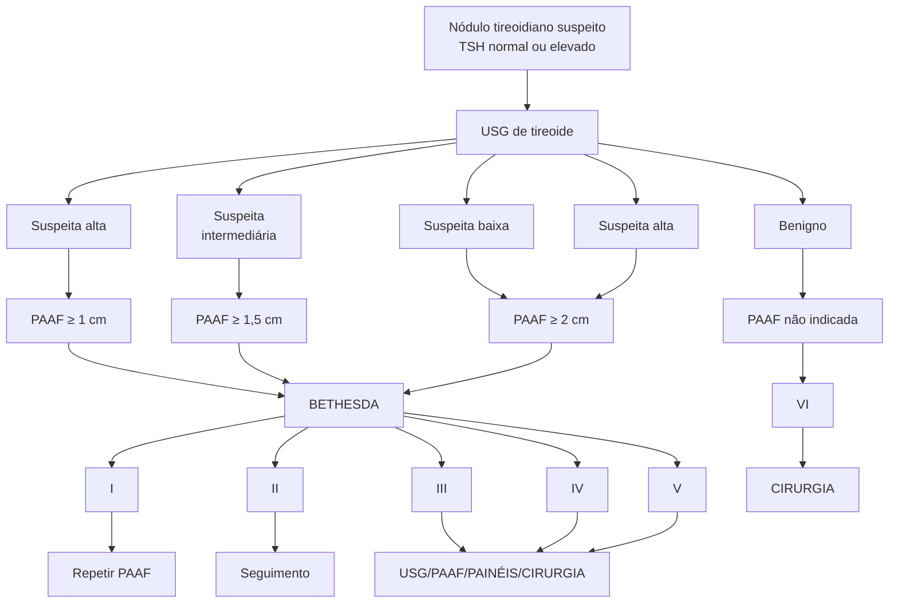
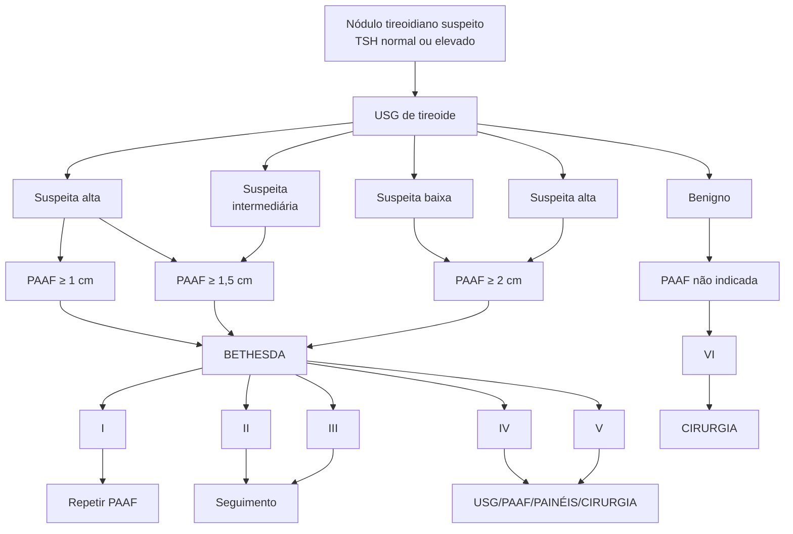

# NÓDULOS E CÂNCER DE TIREOIDE

## Fluxograma Nódulo Tireoidiano

**Nódulo Tireoidiano**
- TSH suprimido → cintilografia
- TSH normal ou alto → nódulo frio

## Câncer de Tireóide

| TUMOR      | IDADE  | CRESCIMENTO | CARACTERÍSTICASHORMONAIS      | METÁSTASE                                 | PROGNÓSTICO                         |
| ---------- | ------ | ----------- | ----------------------------- | ----------------------------------------- | ----------------------------------- |
| PAPILÍFERO | Todas  | Lento       | Eutireoidismo                 | Linfonodal > Distância                    | Bom                                 |
| FOLICULAR  | > 40a  | Lento       | Eutireoidismo                 | Distância > Linfonodal                    | Bom                                 |
| MEDULAR    | Todas  | Moderado    | Eutireoidismo
Calcitonina | Ao diagnóstico
Linfonodal + Distância | Sobrevida em 10
anos = 20 – 90% |
| ANAPLÁSICO | Idosos | Rápido      | Eutireoidismo                 | Frequentes
Linfonodal + Distância     | Letalidade > 90%                    |

# 1. CONCEITOS

## 1.1 EPIDEMIOLOGIA
• Prevalência 3-7% na população;
• Mais comum em mulheres, idosos, pessoas expostas à radiação e pessoas com deficiência de iodo;
• A maioria dos indivíduos tendem a ser assintomáticos sendo, em boa parte dos casos, achados incidentais;
• Metade da população terá nódulo uma vez na vida, mas raramente são malignos.

## 1.2 ETIOLOGIAS
• Cistos coloides e tireoidites – 80%;
• Neoplasias foliculares benignas – 15%;
• Carcinomas – 5-10%.

## 1.3 FATORES DE RISCO – MALIGNIDADE
• Sexo masculino;
• Extremos de idade;
• Crescimento rápido;
• Sintomas compressivos;
• Portadores de DAT (doença autoimune da tireoide);
• História familiar de malignidade;
• Síndromes genéticas.

# 2. INVESTIGAÇÃO DO NÓDULO TIREOIDIANO

## 2.1 PASSOS NA INVESTIGAÇÃO DO NÓDULO TIREOIDIANO
• USG de tireoide - nódulo;
• Pedir TSH e T4L para investigar alguma alteração funcional; TSH suprimido e T4 livre aumentado = pensar em nódulo funcionante; Cintilografia da tireoide – para confirmação;

• TSH e T4 livre sem alterações – nódulo "frio" ou não funcionante; Avaliar necessidade de punção aspirativa por agulha fina (PAAF);
• PAAF – Irá resultar numa classificação de Bethesda; A solicitação se baseia a depender das características visualizadas na ultrassonografia.

## 2.2 INDICAÇÕES DE PAAF PELO USG
• Nódulos de alta suspeita (puncionar se ≥ 1 cm → se várias dessas características a seguir, puncionar independentemente do tamanho); risco > 70 – 90%: hipoecogênico; Microcalcificações; Mais alto que largo; Contornos irregulares; Extensão extratireoidiana ou invasão de cápsula; Linfonodo suspeito.
• Nódulos de suspeita intermediária (puncionar se ≥ 1 cm); risco entre 10-20%; Nódulo sólido hipoecoico sem microcalcificações, sem ser mais alto que largo e sem extensão extratireoidiana.
• Nódulos de baixa suspeita (puncionar se ≥ 1,5 cm); risco entre 5-10%; Hiper ou isoecogênico; Margens regulares; Misto (cístico-sólido).
• Nódulos de suspeita muito baixa (puncionar se ≥ 2 cm); risco < 3%; Espongiforme, parcialmente cístico.
• Cisto coloide: benigno ; risco < 1% Não puncionar.

## 2.3 TI-RADS – AVALIA O NÓDULO DE ACORDO COM A COMPOSIÇÃO, ECOGENICIDADE, FORMA, MARGEM, FOCOS ECOGÊNICOS
• Confira na página seguinte a Tabela 2

## 2.4 SISTEMA BETHESDA
• Útil para classificação do nódulo e direcionamento para conduta.
• Confira na página seguinte a Tabela 3

NÓDULOS E CÂNCER DE TIREOIDE

## Tabela 2 Classificação TI-RADS

| Classificação TI-RADS                          | Classificação TI-RADS
0 ponto                         | Classificação TI-RADS
1 ponto                       | Classificação TI-RADS
2 pontos                      | Classificação TI-RADS
3 pontos                      |
| ---------------------------------------------- | --------------------------------------------------------- | ------------------------------------------------------- | ------------------------------------------------------- | ------------------------------------------------------- |
| **Composição**                                 | Cístico ou quase totalmente cístico

Espongiforme | Misto – sólido e cístico                                | Sólido ou quase totalmente sólido                       | -----------                                             |
| **Ecogenicidade**                              | Anecogênico                                               | Hiperecogênico ou isoecogênico                          | Hipoecogênico                                           | Muito hipoecogênico                                     |
| **Forma**                                      | Mais largo que alto                                       | -----------                                             | -----------                                             | Mais alto que largo                                     |
| **Margem**                                     | Regular                                                   | Mal definida                                            | Lobulada ou irregular                                   | Extensão extratireoidiana                               |
| **Focos ecogênicos**                           | Nenhum ou grandes artefatos em cauda de cometa            | Calcificações macroscópicas                             | Calcificações periféricas                               | Focos ecogênico puntiformes                             |
| **Somar todos os pontos**                      |                                                           |                                                         |                                                         |                                                         |
| **INTERPRETAÇÃO E CONDUTA**                    |                                                           |                                                         |                                                         |                                                         |
| **0 ponto**                                    | **2 pontos**                                              | **3 pontos**                                            | **4 – 6 pontos**                                        | **7 ou mais pontos**                                    |
| **TI RADS 1**                                  | **TI RADS 2**                                             | **TI RADS 3**                                           | **TI RADS 4**                                           | **TI RADS 5**                                           |
| **Benigno**                                    | Não suspeito                                              | Levemente suspeito                                      | Moderadamente suspeito                                  | Altamente suspeito                                      |
| **Aspiração por agulha fina não é necessária** | Aspiração por agulha fina não é necessária                | ≥ 2,5 cm – aspiração

≥ 1,5 cm – acompanhamento | ≥ 1,5 cm – aspiração

≥ 1,0 cm – acompanhamento | ≥ 1,0 cm – aspiração

≥ 0,5 cm – acompanhamento |

## Tabela 3 Classificação de Bethesda

| Bethesda | Achados                                                | Risco de malignidade | Conduta                                   |
| -------- | ------------------------------------------------------ | -------------------- | ----------------------------------------- |
| **I**    | Amostra insatisfatória; não diagnóstica                | 1 – 4%               | Repetir PAAF                              |
|          | Repetir punção                                         |                      |                                           |
| **II**   | Benigno                                                | 0 – 3%               | Seguimento clínico                        |
| **III**  | Atipia ou lesão folicular de significado indeterminado | 5 – 15%              | Repete PAAF, painel molecular ou cirurgia |
| **IV**   | Suspeita ou neoplasia folicular                        | 15 – 30%             | Painel molecular ou cirurgia              |
| **V**    | Suspeito de malignidade                                | 60 – 75%             | Cirurgia                                  |
| **VI**   | Maligno                                                | 97 – 99%             | Cirurgia                                  |

ENDÓCRINO

**Figura 1** Conduta em avaliação de nódulo tireoideano

## 3. CÂNCER DE TIREOIDE

### 3.1 CLASSIFICAÇÃO

• Derivados de células foliculares (90%); Bem diferenciado = papilífero, folicular e de células de Hurthle; Indiferenciados = anaplásico;

• Derivados de células parafoliculares (3 – 4%); Carcinoma Medular;

• Outras células (~ 5%); Linfomas, sarcomas, metástases, teratomas e hemangioendoteliomas.

### 3.2 BEM DIFERENCIADOS

• Papilífero: Representa 80% dos casos; Em geral, acomete indivíduos entre 3-5ª década de vida; Apresenta crescimento lento e baixo grau de progressão; Prognóstico bom; Metástases: 25% cervicais; 20% invasão extratireoidiana; 5% metástases a distância

• Folicular: Representa 10% dos casos; Acomete indivíduos na 5ª década de vida; Bom prognóstico; História natural: Achado casual de nódulo único na tireoide; Crescimento recente de um nódulo de longa duração.

### 3.3 CARCINOMA MEDULAR (CMT)

• Esporádico em 75-80% dos casos; 5-6ª década de vida; Mais indolente e solitário;

• Familiar em 20-25% dos casos; NEM2A (55-80%); Demonstra associação com feocromocitoma e hiperparatireoidismo primário. NEM2B (5 %); Tem associação com feocromocitoma, ganglioneuromatose, hábito marfanóide e anormalidades oculares (< 10 anos). CMT familiar 15-35% → medular isolado em duas ou mais gerações da família (3ª década); Cursa com metástases linfonodais, fígado, pulmão e ossos; Tumor agressivo.

### 3.4 INDIFERENCIADO/ANAPLÁSICO

• Tipo mais grave (muito agressivo) e menos comum;

• Em geral, acomete idosos;

• Crescimento rápido e invasão local precoce → frequentemente requer traqueostomia;

• Cursa com metástases para linfonodos cervicais e à distância (pulmões); Demonstra péssimo prognóstico.

NÓDULOS E CÂNCER DE TIREOIDE

Tabela 4 Resumo comparativo

| TUMOR      | IDADE  | CRESCIMENTO | CARACTERÍSTICASHORMONAIS      | METÁSTASE                                     | PROGNÓSTICO                         |
| ---------- | ------ | ----------- | ----------------------------- | --------------------------------------------- | ----------------------------------- |
| PAPILÍFERO | Todas  | Lento       | Eutireoidismo                 | Linfonodal >
Distância                    | Bom                                 |
| FOLICULAR  | > 40a  | Lento       | Eutireoidismo                 | Distância >
Linfonodal                    | Bom                                 |
| MEDULAR    | Todas  | Moderado    | Eutireoidismo
Calcitonina | Ao diagnóstico
Linfonodal +
Distância | Sobrevida em 10
anos = 20 – 90% |
| ANAPLÁSICO | Idosos | Rápido      | Eutireoidismo                 | Frequentes
Linfonodal +
Distância     | Letalidade > 90%                    |
