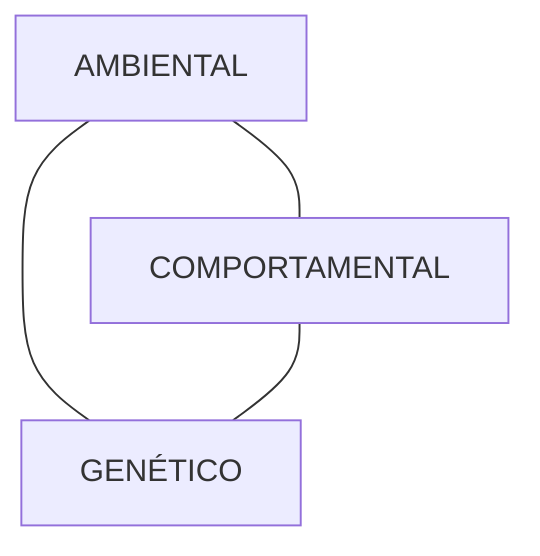

# OBESIDADE CONCEITOS GERAIS + TTO NÃO FARMACOLÓGICO

| **Classificação da Obesidade pelo IMC (kg/m2)**                                                                                                                                                    |                                                                                                                                           | **Reeducação Alimentar "Dieta":** |   |
| -------------------------------------------------------------------------------------------------------------------------------------------------------------------------------------------------- | ----------------------------------------------------------------------------------------------------------------------------------------- | --------------------------------- | - |
| • < 18,5 → Baixo peso/magreza
• 18,5 – 24,9 → Eutrófico/normal
• 25 – 29,9 → Sobrepeso
• 30 – 34,9 → Obesidade grau 1
• 35 – 39,9 → Obesidade grau 2
• ≥ 40 → Obesidade grau 3 | • Maior preditor de perda de peso
• Balanceada
**Atividade Física:**
• Saúde cardiovascular
• Manutenção do peso perdido. |                                   |   |

## 1. FISIOPATOLOGIA

### 1.1 MULTIFATORIAL
• Ambiente;
• Genética;
• Comportamento (inclusive questões psicossociais).

**Multifatorial**
• Importante para prova: saber as substâncias que estimulam cada via, em específico (anorexígena e orexígena).
• Única que estimula a via orexígena é a Grelina, todos os outros estimulam a via anorexígena.

## 2. CLASSIFICAÇÃO E DIAGNÓSTICO

### 2.1 CONSIDERAÇÕES GERAIS

• **Índice de massa corpórea – IMC**
  • Não é bom, pois não analisa a composição corporal do paciente;
  • É um marcador com maior aplicabilidade populacional, mas não é uma medida ideal para análise individualizada.
  • Ainda é utilizado e essa é a medida que vai cair na prova!

|             |                    |
| ----------- | ------------------ |
| < 18,5      | Baixo peso/magreza |
| 18,5 – 24,9 | Eutrófico/normal   |
| 25 – 29,9   | Sobrepeso          |
| 30 – 34,9   | Obesidade grau 1   |
| 35 – 39,9   | Obesidade grau 2   |
| ≥ 40        | Obesidade grau 3   |

• **Relação cintura-quadril – RCQ;**
  • Marcador cardiovascular;
  • Avaliação da distribuição da gordura corporal.
• **Circunferência abdominal;**
  • Tratamento e seguimento (avaliar a medida em toda consulta);
  • Marcador cardiovascular associado ao IMC.
• **Medidas de pregas cutâneas:**
  • Densidade corporal e percentual de gordura corporal (Correlação entre gordura localizada no tecido adiposo subcutâneo e gordura corporal total);
  • Pregas subescapular, triciptal, biciptal, suprailíaca e coxa;
  • Vantagem = reprodutibilidade;
  • Desvantagem = examinador dependente e baixa reprodutibilidade.
• **Bioimpedância ou impedanciometria elétrica;**
  • Tecido adiposo → resistência a passagem da corrente elétrica;
  • Tecido muscular esquelético → bom condutor (rico em água);
  • Corrente elétrica alternante de baixa intensidade;
  • Vantagens = prático e independe da habilidade do examinador;
  • Desvantagens: Sofre influência pela temperatura ambiente, atividade física, consumo de alimentos e bebidas, menopausa e ciclo menstrual.

ENDÓCRINO

![Figura 2 - Regulação Hipotalâmica e Periférica do Apetite - Diagram showing the hypothalamic and peripheral regulation of appetite, including:
- Top level: Córtex Sistema Límbico (Limbic System Cortex) with connections to behavioral responses, autonomic responses, and endocrine responses, plus memories, emotions, social rules, and habits
- Middle level: CRH/TRH/NPV and MCH/Orexinas/HL pathways connecting to brainstem and vagus nerve
- Central level: POMC/CART and AgRP/NPY boxes with ARC (Arcuate nucleus)
- Lower level: Balance scale showing food intake vs energy expenditure
- Bottom level: Organs (Liver, Adipose tissue, Pancreas, GI tract, Gustatory system) with their respective hormones:
  - Liver: Nutrients
  - Adipose tissue: Leptin, Adiponectin, Resistin, IL-6, LCFA
  - Pancreas: Insulin, Amylin, Glucagon, PP
  - GI tract: Ghrelin, CKK, PYY, GLP-1, OXM
  - Gustatory system: Connected to brainstem and vagus nerve]

**Figura 2** Regulação Hipotalâmica e Periférica do Apetite.

## 3. TRATAMENTO

![Figura 3 - Treatment pyramid showing three levels from bottom to top:
1. MODIFICAÇÃO DO ESTILO DE VIDA (base)
2. MEDICAÇÕES (middle)
3. CIRURGIA (top)]

**Figura 3** Tipos de tratamento

### 3.1 NÃO MEDICAMENTOSO:
• **MEV – base do tratamento (reeducação alimentar e atividade física);**

• **Comportamental**
  • Automonitoramento (se pesar sempre);
  • Planejamento das compras de supermercado;
  • Adquirir pequenos aumentos de gasto calórico;
  • Auxiliar o indivíduo obeso a reconhecer e evitar distorções cognitivas.
• **Reeducação alimentar – "dieta"**
  • Maior preditor de perda de peso;
  • Independente do tipo de dieta;
  • Evitar as restrições severas;
  • Optar sempre pela reeducação alimentar;
  • Balanceadas: 20-30% de gorduras; 55-60% de carboidratos; 15-20% de proteínas;
  • Redução de 500-1000 kcal da TMB por dia → redução de 0,5 a 1 kg/semana.
• **Atividade física**
  • Auxilia no déficit calórico;
  • Reduz perda de massa muscular;
  • Evita platô de perda de peso no processo de emagrecimento;
  • Manutenção do peso perdido e saúde cardiovascular;
  • ≥ 30 minutos, > 5 a 7 dias/semana;
  • Exercícios aeróbicos + resistidos.

# OBESIDADE TRATAMENTO FARMACOLÓGICO E CIRÚRGICO

| **Indicação de tratamento farmacológico da obesidade**
• IMC > ou = 27kg/m2 + comorbidades
• IMC > ou = 30kg/m2
**Indicação de tratamento cirúrgico da obesidade**
• IMC 30 - 34,9kg/m2 + DM < 10 anos + refratário ao tratamento + idade 30 - 70 anos
• IMC 35 39,9kg/m2 + comorbidades |   | • IMC > ou = 40kg/m2
**Medicações on-label no Brasil**
• Sibutramina, Orlistate, Liraglutida, Semaglutida, Tirzepatida e Bupropiona+Naltrexone
**Tipos de cirurgia**
• Sleeve (restritiva) e Gastrectomia vertical em Y Roux (mista) |
| ------------------------------------------------------------------------------------------------------------------------------------------------------------------------------------------------------------------------------------------------------------------------------------------------------------ | - | ---------------------------------------------------------------------------------------------------------------------------------------------------------------------------------------------------------------------------------------------------- |

## 1. INDICAÇÕES E CRITÉRIOS DE EFICÁCIA DO TRATAMENTO MEDICAMENTOSO

• São medicações que demonstram capacidade para facilitar e aumentar a adesão à terapia não-farmacológica, através da mudança de estilo de vida;

### 1.1 INDICAÇÕES DO TRATAMENTO FARMACOLÓGICO

• IMC ≥ 30 kg/m2;
• IMC ≥ 27 kg/m2 + comorbidades.

### 1.2 CRITÉRIOS DE EFICÁCIA

• Perda de 5% do peso inicial após 12 semanas de tratamento – de acordo com FDA;
• Perda de 10% do peso inicial após 12 semanas de tratamento – segundo CPMP;
• Perda de 7% do peso inicial – segundo ADA.

## 2. TRATAMENTO MEDICAMENTOSO ON-LABEL

### 2.1 MECANISMO DE AÇÃO

• Termogênico;
• Trato gastrointestinal;
  • Retardo do esvaziamento gástrico;
  • Inibição da absorção de gorduras.
• Sistema Nervoso Central;
  • Atuam modulando a via anorexígena (estimulando) e/ou orexígena (inibindo);
  • Combate à compulsão alimentar e à ansiedade.

### 2.2 MEDICAÇÕES

**Tipos:**

• On label: Sibutramina; Orlistate; Liraglutida; Semaglutida (aprovada pela ANVISA em 2023, em dose de 2,4 mg/semana); Tirzepatida (aprovada pela ANVISA em 2023); Bupropiona associado ao Naltrexone – (aprovado em 2022);
• Off label: Sertralina/fluoxetina; Topiramato.

**Sibutramina (On Label):**

• Ação: Inibidor da recaptação de serotonina (efeito sacietógeno pela ativação da POMC/CART) e norepinefrina (pequena ativação de lipólise + aumento do gasto energético basal + aditivo na inibição do apetite);
• Efeitos colaterais: Insônia; Boca seca – xerostomia; Constipação; Palpitações; Irritabilidade; Cefaleia; Náuseas.

OBS: Apresenta bom efeito ao reduzir a fissura por doces e hiperfagia.

• Contraindicações (estudo SCOUT evidenciou contraindicações em pacientes com história prévia de doenças cardiovasculares): HAS não controlada (PA > 140 x 95 mmHg); DCV estabelecida – AVC/AIT, DAC, ICC e doença arterial periférica; Gestação; < 18 anos e > 65 anos de idade; DM + fator de risco cardiovascular.

**Orlistate (On Label):**

• Ação: É um inibidor irreversível das lipases intestinais e pancreáticas. Assim, diminui a digestão de 30% das gorduras ingeridas.
• Efeitos colaterais: Disabsorção de vitaminas lipossolúveis (A, D, E e K); Flatulência e diarreia; Dor abdominal.
• Contraindicações: DII – Doença inflamatória intestinal; Colestase; Síndrome de má-absorção; Gestação e lactação.

**Liraglutida e Semaglutida (On Label):**

• Ambos pertencem à família dos análogos do GLP1;
• Em estudo, observou-se que a Semaglutida é mais potente do que a Liraglutida, em relação à perda de peso;
• Ainda, ambas demonstram benefício importante em face de síndrome metabólica. Atuam na melhora da esteatose hepática, na redução do risco cardiovascular, melhora do perfil lipídico e glicemia.
• Ação: Inibe a via orexígena e estimula via anorexígena – logo, apresentam bom efeito em pacientes com síndrome hiperfágica; Agem favorecendo o retardo no esvaziamento gástrico; Assim, promovem efeito sacietógeno.
• Efeitos colaterais: Náuseas e vômitos; Diarreia; Dor abdominal.
• Contraindicações: História pessoal ou familiar de Carcinoma Medular de tireoide e/ou NEM2 – Neoplasia endócrina tipo 2; Gestação.

**Tirzepatida (On Label):**

• Análogo do GLP1 e GIP;
• Demonstrou mais potência na perda de peso do que a Semaglutida;

ENDÓCRINO

• Ação: 1º Inibe a via orexígena e estimula via anorexígena – logo, apresentam bom efeito em pacientes com síndrome hiperfágica; 2º Agem favorecendo o retardo no esvaziamento gástrico; Assim, promovem efeito sacietógeno;
• Efeitos colaterais: Náuseas e vômitos; Diarreia; Dor abdominal.

**Bupropiona + Naltrexone (aprovados em 2022) (On Label):**
• Demonstra boa ação em cenários de fissura por doces, recompensa e compulsão alimentar;
• Ação: Inibidor de recaptação de dopamina e norepinefrina (bupropiona); Antagonista de receptor opioide (naltrexone); Efeito sinérgico na via anorexígena.

OBS.: O Naltrexone potencializa a ação anorexígena da Bupropiona.

• Efeitos colaterais: Náusea; Cefaleia; Constipação; Tontura; Vômitos; Insônia; Xerostomia.
• Contraindicações: Psicoses; Epilepsia; Pensamentos suicidas; Alcoolismo; HAS descompensada; Glaucoma de ângulo fechado; DCV prévia; Gravidez; DRC > estágio III.

## 3. INDICAÇÕES E TIPOS DE TRATAMENTO CIRÚRGICO

**3.1 CIRURGIA (BARIÁTRICA – INDICAÇÃO DIRETA EM OBESOS GRAU III, INDEPENDENTEMENTE DA PRESENÇA DE OUTRAS COMORBIDADES)**

• Indicações:
  • IMC ≥ 40 kg/m2: O tratamento clínico é eficaz em somente cerca de 1% desses pacientes.
  • IMC entre 35 - 39,9 kg/m2 + comorbidades: Refratário ao tratamento clínico por, pelo menos, 2 anos.
  • IMC entre 30 – 34,9 kg/m2: Idade 30-70 anos + DM < 10 anos + refratário ao tratamento clínico.

**Tabela 1** Comorbidades que associado a obesidade grau 2 indicam cirurgia bariátrica

| Comorbidades                | Comorbidades                                    | Comorbidades                           |
| --------------------------- | ----------------------------------------------- | -------------------------------------- |
| DM tipo 2                   | Hérnias discais                                 | Disfunção erétil                       |
| Apneia do sono              | Refluxo gastroesofágico com indicação cirúrgica | Síndrome dos ovários policísticos      |
| HAS                         | Colecistopatia calculosa                        | Veias varicosas e doença hemorroidária |
| Dislipidemia                | Pancreatites agudas de repetição                | Pseudotumor cerebri                    |
| Síndrome de hiperventilação | Esteatose hepática                              | Estigmatização social                  |
| Asma grave não controlada   | Incontinência urinária de esforço na mulher     | Depressão                              |
| Osteoartrites               | Infertilidade masculina e feminina              | -------------
-----                |

• Tipos de cirurgia:

[Two surgical diagrams showing digestive system modifications]

**Derivação gástrica em de Roux (bypass)** | **Gastrectomia vertical (sleeve)**

**Figura 1** Tipos de Cirurgia Bariátrica

• Derivação gástrica em Y de Roux: É a mais utilizada; Também conhecida como bypass gástrico; Pela própria técnica cirúrgica, em geral, os pacientes podem apresentar comprometimento da absorção de cálcio, ferro, vitamina D, B12.
• Gastrectomia vertical (sleeve): Apresenta um componente basicamente restritivo.
• Quanto menos restritiva e mais disabsortiva a cirurgia for, há maior:
  • Resolução da DM2;
  • Porcentagem de excesso de peso perdido;
  • Morbimortalidade;
  • Deficiências nutricionais.
• Índices de resolução após Y de Roux (mais feita):
  • DM2 – 86%;
  • DLP - 70%;
  • HAS – 78,5%;
  • SAOS - 83,6%.

## 4. COMPLICAÇÕES DO TRATAMENTO CIRÚRGICO

**4.1 COMPLICAÇÕES**

• Pós-operatórias;
  • Estenose e ulceração gástrica - 10%;
  • Infecção de ferida operatória;
  • Peritonite e deiscência da anastomose;
  • Trombose venosa profunda;
  • Embolia pulmonar;
  • Abscesso subfrênico;
  • Perda de peso insatisfatória – 20-25%.
• Tardias:
  • Colelitíase - 36%;
  • Obstrução Intestinal;
  • Má absorção de vitaminas e sais minerais - 25%;
  • Neuropatia diabética;
  • Reganho de peso - 20-50%;
  • Síndrome dumping;
  • Hipoglicemia pós-prandial.

OBESIDADE TRATAMENTO FARMACOLÓGICO E CIRÚRGICO                                                                    3

## 4.2 MANEJO DAS COMPLICAÇÕES CLÍNICAS

• Deficiências nutricionais;
  • Desnutrição proteica;
  • Cálcio e vitamina D;
  • Vitamina B12;
  • Ácido fólico;
  • Ferro;
  • Vitamina A.
• Síndrome de dumping ou *dumping* precoce
  • Há ingestão de uma refeição rica em gorduras e/ou carboidratos simples, associado ao comprometimento do piloro – pelo rápido esvaziamento do conteúdo alimentar no intestino;
  • Conteúdo hiperosmolar no jejuno;
  • É dada uma liberação de agentes vasoativos e incretinas (GLP 1 e GIP); Taquicardia; Rubor facial; Hipotensão; Sudorese; Síncope e sintomas gastrointestinais (raros).
  • Tratamento:
  • Em geral, ocorre nos primeiros meses ou 1 ano, após a cirurgia bariátrica;
  • Modificações dietéticas: Fracionamento alimentar; Não ingerir líquidos nas refeições; Retirar carboidratos simples e gorduras da dieta; Aumentar fibras e adicionar espessantes; Deitar-se por 30 minutos após as refeições – lentifica o esvaziamento gástrico;
  • Acarbose de 50 a 100 mg no café, almoço e jantar;
  • Análogos da somatostatina (útil em casos graves).
• Hipoglicemia pós-prandial/reativa/dumping tardio;
  • Em geral, tem início após 1 ano da cirurgia bariátrica;
  • Consumo de açúcares ou carboidratos simples: Esvaziamento gástrico acelerado – pico hiperglicêmico; Elevação da atividade do eixo entero-insulínico; Hiperinsulinemia pós-prandial; (Hipoglicemia sintomática 1 a 3 horas após refeição.)

• Correção da hipoglicemia:
• Consumo de carboidratos simples seguido de refeição com fibras, proteínas e carboidratos complexos.
• Medidas dietéticas preventivas:
1. Dieta pobre em carboidratos simples e usar complexos em porções controladas;
2. Fazer refeições mistas com proteínas e gorduras;
3. Esperar 30 min para ingerir líquidos após as refeições;
4. Evitar álcool e cafeína;
5. Uso de espessantes.
• Tratamento medicamentoso:
• Acarbose – retarda e reduz a absorção de carboidratos;
• Diazoxide – inibe a secreção de insulina;
• Verapamil – reduz a liberação de insulina;
• Análogos da somatostatina – reduzem a secreção de insulina e GLP 1;
• Liraglutida – retarda o esvaziamento gástrico.
• Tratamento cirúrgico:
• Útil em casos extremos, sem resposta ao tratamento dietético e medicamentoso, com sintomas graves e frequentes;
• Gastrostomia no estômago remanescente;
• Aumentar restrição do pouch;
• Reversão do RYGB;
• Pancreatectomia (proscrito).
