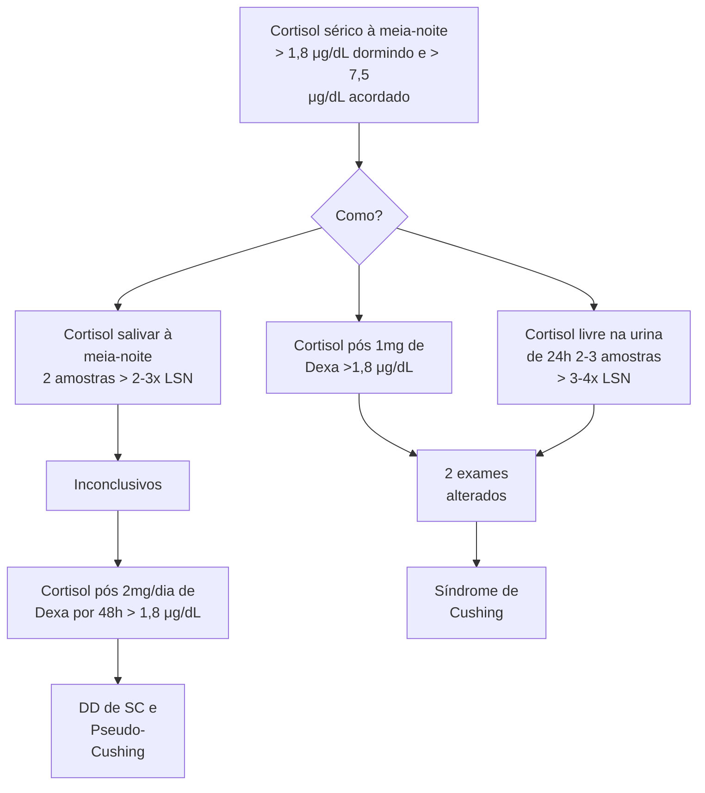
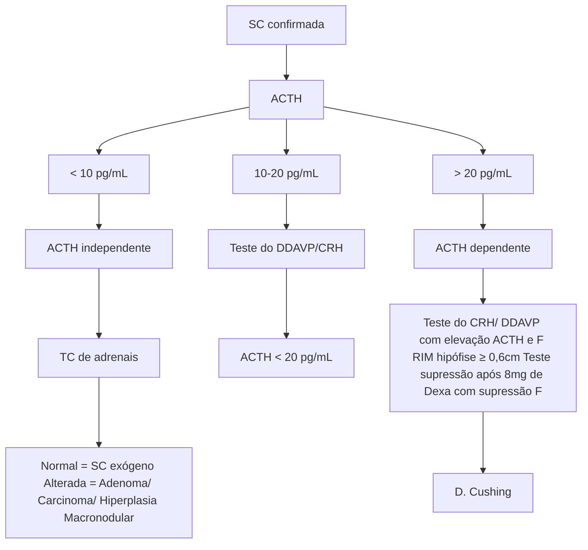

# SÍNDROME DE CUSHING

| **Síndrome de Cushing**
• Hipercortisolismo clínico e laboratorial
**Principal causa**
• Exógena (uso de GC)
**Principal causa endógena**
• Doença de Cushing (tumor hipofisário secretor ACTH)
**Hipercortisolismo Clínico**
• Estrias violáceas > 1cm
• Pletora facial
• Gibosidade (giba)
• Fascies em lua cheia
• HAS
• DM
• DLP |   | • Osteoporose
• Obesidade
**Hipercortisolismo Laboratorial**
• 2 dos 3
• Cortisol pós 1mg de Dexametasona > 1,8
• Cortisol livre na urina 24h 2-3 amostras aumentados
• Cortisol salivar à meia-noite 2-3 amostras aumentados
**Investigação etiológica**
• ACTH
• Diminuído = ACTH-independente → Adrenal
• Normal ou aumentado = ACTH-dependente → Hipófise
**Tratamento de escolha**
• Cirurgia hipofisária ou adrenal
• Controle dos sinais e sintomas → Cetoconazol). |
| ---------------------------------------------------------------------------------------------------------------------------------------------------------------------------------------------------------------------------------------------------------------------------------------------------------------------------------------------------------------------------------------- | - | ------------------------------------------------------------------------------------------------------------------------------------------------------------------------------------------------------------------------------------------------------------------------------------------------------------------------------------------------------------------------------------------------------------------------------------------------------------------------------------------------------------------------------ |

## 1. INTRODUÇÃO

### 1.1 DEFINIÇÃO

• Síndrome de Cushing (SC) é um conjunto de achados clínicos e laboratoriais de hipercortisolismo.

• **Não confundir** – Doença de Cushing (DC) é um diagnóstico etiológico da Síndrome de Cushing (SC), no caso, quando a SC é causada por um tumor hipofisário produtor de ACTH.

### 1.2 ETIOLOGIAS

• Exógena (mais comum): uso de glicocorticoide.

• Endógena: hiperprodução crônica de cortisol, dependente de ACTH ou não dependente de ACTH, conforme causas expostas nas tabelas a seguir:

### 1.3 PSEUDO-CUSHING

**Tabela 1** Causas de Síndrome de Cushing ACTH-dependente.

| ACTH – DEPENDENTE (70-80%)             |
| -------------------------------------- |
| Doença de Cushing (65-70%)             |
| Síndrome do ACTH ectópico (5-10%)      |
| Síndrome do CRH ectópico (<1%)         |
| Síndrome do ACTH e CRH ectópicos (<1%) |

**Tabela 2** Causas de Síndrome de Cushing ACTH-independente.

| ACTH – INDEPENDENTE (10-20%)                     |
| ------------------------------------------------ |
| Adenoma adrenal produtor de cortisol (15-20%)    |
| Carcinoma adrenal (5-6%)                         |
| Hiperplasia adrenal macronodular (<2%)           |
| Doença Adrenal Nodular Pigmentada Primária (<2%) |

• Paciente com quadro clínico (fenótipo) e/ou laboratorial de SC, porém com hipercortisolismo apenas leve ou moderado;

• Causas mais comuns são depressão e etilismo crônico. Outras: obesidade, SOP, abstinência alcoólica, doença renal crônica e outras doenças psiquiátricas;

• Fisiopatologia: hiperativação do eixo hipotálamo-hipofisário e aumento de secreção de CRH → elevação do cortisol;

• Diferenciação entre SC e Pseudo-Cushing requer eliminar o fator indutor do hipercortisolismo (por exemplo, na obesidade, alcançar a perda de peso, se é um paciente com depressão, deve ser tratada).

### 1.4 HIPERCORTISOLISMO SUBCLÍNICO

• Pacientes com ausência de sinais ou sintomas de hipercortisolismo, porém com evidência laboratorial de produção aumentada do cortisol: Alta prevalência de HAS e DM2 e redução da densidade mineral óssea; Risco aumentado de fraturas vertebrais e IAM; Percentual de evolução para SC clássica é incerto.

## 2. CLÍNICA E INVESTIGAÇÃO

### 2.1 QUADRO CLÍNICO

• **Sinais mais específicos:**
  • Fragilidade capilar (equimoses/petéquias);
  • Miopatia proximal;
  • Estrias violáceas > 1 cm;
  • Pletora facial;
  • Fácies em lua cheia;
  • Gibosidade.

• **Sinais inespecíficos:**
  • HAS – aumenta a reabsorção de sódio e água;
  • Osteopenia e osteoporose – cortisol inibe a ação dos osteoblastos;
  • Devido excesso de cortisol, há um feedback negativo com FSH e LH, gerando um hipogonadismo hipogonadotrófico, o que leva a: irregularidade menstrual, amenorreia, redução da libido, disfunção erétil.
  • Hirsutismo, acne e alopecia androgênica – excesso de SDHEA (andrógenos adrenais)
  • Diabetes e resistência à insulina – cortisol como hormônio contrarregulador da insulina;

• Dislipidemia – menor armazenamento de ácidos graxos livres e triglicérides nos adipócitos devido comprometimento da ação da insulina resultante do efeito contrarregulador do cortisol;
• Eventos tromboembólicos;
• Infecções de repetição – por redução da imunidade;
• Depressão, agitação, insônia e psicose;
• Hiperpigmentação cutaneomucosa nos casos de SC ACTH dependentes pelo aumento da produção de MSH.

**Figura 1** Hipercortisolismo clínico. Pletora facial e fáscies em lua-cheia

**Figura 2** Hipercortisolismo clínico. Gibosidade/Giba

**Figura 3** Hipercortisolismo clínico. Estrias violáceas

**Figura 4** Hipercortisolismo clínico. Equimoses.

## 2.2 EM QUEM INVESTIGAR?
• Hipercortisolismo clínico;
• Morbidades anormais para a idade como osteopenia/ osteoporose, HAS secundária e DM;
• Crianças com ganho de peso e retardo do crescimento;
• Todos os incidentalomas adrenais;
• Incidentaloma hipofisário + hipercortisolismo clínico.

## 2.3. COMO INVESTIGAR?

**Figura 5** Investigação de Síndrome de Cushing.

• Cortisol salivar à meia-noite pois é o horário do ciclo circadiano que o cortisol está normalmente mais baixo. Se estiver aumentado nessa hora, indica um excesso de produção.
• Após 1 mg de dexametasona: a dexametasona inibe eixo corticotrópico em um indivíduo normal, levando à supressão do cortisol. Caso não ocorra a supressão, é sugestivo de hipercortisolismo.
• Cortisol livre na urina de 24h indica a produção total de cortisol ao longo do dia, se estiver aumentado também é sugestivo.
• Dois desses exames alterados, associado ao hipercortisolismo clínico, confirmam a Síndrome de Cushing! Se apenas 1 alterado ou inconclusivo, fazer testes mais específicos como o cortisol sérico à meia-noite e cortisol após 2 mg/dia de dexametasona por 48h.

SÍNDROME DE CUSHING

• Após confirmação da Síndrome de Cushing – próximo passo é determinar se é ACTH dependente ou independente, através da dosagem do ACTH. Isso guiará a investigação etiológica.

**Figura 6** Investigação etiológica da Síndrome de Cushing.

# 3. TRATAMENTO

## 3.1 TRATAMENTO CIRÚRGICO

• Adenoma adrenal produtor de cortisol: Adrenalectomia unilateral videolaparoscópica;

• Carcinoma adrenal: Adrenalectomia unilateral + QT (mitotane) / radioterapia;

• Hiperplasia adrenal macronodular: Adrenalectomia unilateral da maior glândula com ou sem retirada de parte da glândula contralateral;

• Doença de Cushing (adenoma hipofisário): Ressecção neurocirúrgica do tumor via transesfenoidal.

## 3.2 TRATAMENTO MEDICAMENTOSO

• Controle laboratorial e clínico do hipercortisolismo não resolve a causa base;

• Terapia isolada em casos leves;

• Cetoconazol: Inibe esteroidogênese adrenal e gonadal, pequena ação nos receptores corticotrofos, início rápido de ação;

• Outras opções: Etomidato, mitotane, cabergolina e pasireotide.

# REFERÊNCIAS

**Figura 1** Hipercortisolismo clínico. Pletora facial e fáscies em lua-cheia

Vilar et.al. Endocrinologia Clínica. 7 ed. Guanabara Koogan, 2021

**Figura 2** Hipercortisolismo clínico. Gibosidade/Giba

Vilar et.al. Endocrinologia Clínica. 7 ed. Guanabara Koogan, 2021

**Figura 3** Hipercortisolismo clínico. Estrias violáceas

Vilar et.al. Endocrinologia Clínica. 7 ed. Guanabara Koogan, 2021

**Figura 4** Hipercortisolismo clínico. Equimoses.

Vilar et.al. Endocrinologia Clínica. 7 ed. Guanabara Koogan, 2021
