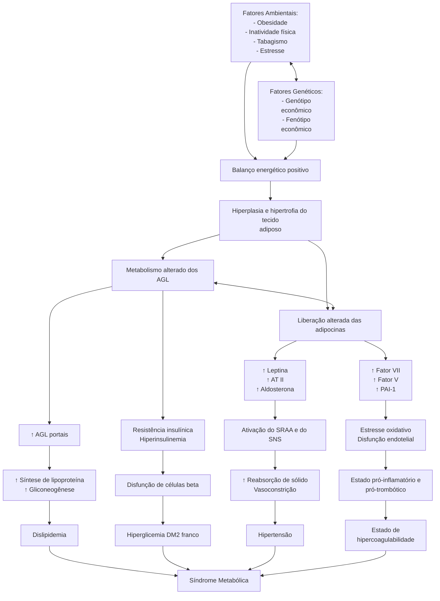

Síndrome Metabólica (CM)

# SÍNDROME METABÓLICA

## Critérios de Síndrome Metabólica (IDF ou NCEP) NCEP

| **IDF*** Hipertrigliceridemia
* HDL baixo
* Hiperglicemia
* Aumento da pressão arterial
* Circunferência abdominal aumentada- CA > 94cm em homens e 80cm em mulheres (obrigatório)+- 2 dos outros 4 critérios (PA > ou = 130x85mmHg; GJ > ou = 100mg/dL; TGL > ou = 150mg/dL; HDL < 40mg/dL em homens e < 50mg/dL em mulheres) | **NCEP**- 3 de qualquer um dos 5 critérios (CA > 102cm em homens e > 88cm em mulheres; PA > ou = 130x85mmHg; GJ > ou = 110mg/dL; TGL > ou = 150mg/ dL; HDL < 40mg/dL em homens e < 50mg/dL em mulheres. |
| ------------------------------------------------------------------------------------------------------------------------------------------------------------------------------------------------------------------------------------------------------------------------------------------------------------------------------ | ------------------------------------------------------------------------------------------------------------------------------------------------------------------------------------------------------- |

## 1. SÍNDROME METABÓLICA

### 1.1 CONCEITO

• Pode ser dita como:
  • Um conjunto interligado de fatores fisiológicos, bioquímicos, clínicos e metabólicos que aumentam diretamente o risco de doença cardiovascular e diabetes mellitus tipo 2.

### 1.2 PRINCIPAIS MANIFESTAÇÕES E SUAS FISIOPATOLOGIAS

• Dislipidemia aterogênica;
• Hiperglicemia;
• Hipertensão;
• Estado de hipercoagulabilidade;
• Disfunção endotelial;
• Estresse oxidativo;
• Liberação de citocinas inflamatórias pelos adipócitos viscerais;
• Liberação excessiva de ácidos graxos livres;
• Resistência insulínica;
• Adiposidade visceral.

### 1.3 FISIOLOGIA

• **A base da síndrome metabólica parte do princípio do acúmulo de tecido adiposo visceral;**
• Tecido adiposo visceral: demonstra células maiores, com grande atividade lipolítica. Isto é, cliva e elimina elevada quantidade de ácidos graxos livres na circulação. É muito metabolicamente ativo, liberando uma quantidade mais expressiva de citocinas inflamatórias (TNF-alfa, PAI-I, IL-6 e PCR). Tal inflamação leva à resistência insulínica.
• Tecido adiposo subcutâneo: demonstra células menores. É mais responsivo ao efeito antilipolítico da insulina → isto é, a insulina é capaz de estocar maior quantidade de gordura dentro do tecido adiposo subcutâneo. Nesse sentido, é capaz de armazenar elevada quantidade de ácidos graxos livres sob a forma de triacilglicerol. Sofre pouca influência das citocinas inflamatórias.

| **Fatores Genéticos**                                                                                                          |   |                                                         |
| ------------------------------------------------------------------------------------------------------------------------------ | - | ------------------------------------------------------- |
| **Tecido Adiposo
Subcutâneo**                                                                                              | ↔ | **Tecido Adiposo
Visceral**                         |
| Mais responsivos ao efeito antilipolítico da insulina

Armazenam grande quantidade de AGL sob forma de triacilglicerol |   | Grande atividade lipolítica

Acumulam menos AGL |
| **Poucas citocinas inflamatórias**                                                                                             |   | **TNT-alfa
PAI-I IL-6
PCR**                     |

**Figura 1** Tecido Adiposo Visceral X Subcutâneo.

### 1.5 CRITÉRIOS/CLASSIFICAÇÃO

• **NCEP-ATP III, 2001;**
  • **Três ou mais dos seguintes critérios:** obesidade abdominal (circunferência abdominal > 102 cm em homens e > 88 cm em mulheres); TGL ≥ 150 mg/dL; HDL < 40 mg/dL (homens) e < 50 mg/dL (mulheres); PA ≥ 130 x 85 mmHg ou diagnóstico de hipertensão arterial sistêmica; GJ ≥ 110 mg/dL ou diagnóstico de diabetes mellitus.

• **International Diabetes Federation, 2005:**
  • Obesidade visceral (critério obrigatório);

Em homens: >94cm

Em mulheres: >80cm

  • **Associados a mais 2, dos seguintes critérios:** TGL ≥ 150 mg/dL; HDL < 40 mg/dL (homens) e < 50 mg/ dL (mulheres); PA ≥ 130 x 85 mmHg ou diagnóstico de hipertensão arterial sistêmica; GJ ≥ 100 mg/dL ou diagnóstico de diabetes mellitus.

ENDÓCRINO

**Figura 2** Fisiopatologia da Síndrome Metabólica.

## 1.6 COMPLICAÇÕES

• **Maior risco cardiovascular**
  • **Epidemiologicamente, demonstra:** 3x mais eventos cardiovasculares; 4x mais mortes por DAC; 2,4x mais mortes por qualquer causa.
  • **Tal fato é devido ao:** HDL-c baixo; LDL pequeno e denso elevado (demonstra maior potencial aterosclerótico pelo depósito na camada médio-intimal dos vasos sanguíneo e apresenta elevada capacidade oxidativa); Hipertrigliceridemia; HAS; PAI-I elevado.

• **Associação com neoplasias**
  • Mama, colorretal e endometrial; Mediado pela hiperinsulinemia, aumento do IGF-1, inflamação crônica.

• **Doença de Alzheimer**
  • A resistência insulínica favorece algumas alterações, tais quais: Aumento na produção de secreção de beta-amiloide; Redução na captação de glicose pelos neurônios; Formação de placas senis; Aumento da fosforilação de proteína tau.

• **Doença Hepática Gordurosa Metabólica.**
