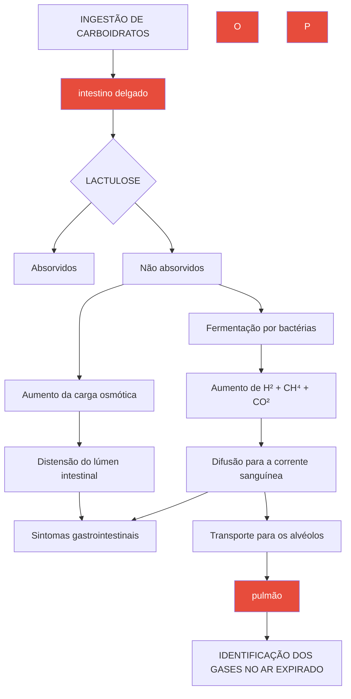
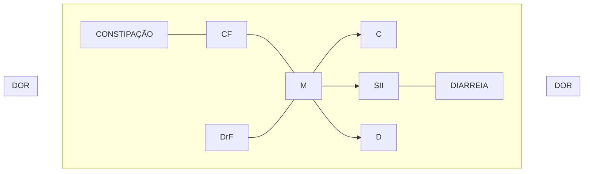

Diarréias Crônicas (CM)

# DIARREIA CRÔNICA

## Intolerância a lactose
- Deficiência de lactase + sintomas de má digestão
- Diagnóstico: teste de tolerância oral, respiratório com hidrogênio, genético
- Tratamento: retirada de lactose, lactase s/n, beta-galactosidase

## Síndrome carcinoide
- Diarreia + rubor facial + lesão valvar → TNE geralmente com metástase hepática
- 5-HIAA na urina 24h / PET-DOTA / Octreoscan

## Colite microscópica (linfocítica ou colagenosa)
- Mulher > 60 anos / relacionada a medicações / associação com celíaca
- Diagnóstico: biópsias em colono aparentemente normal
- Tratamento: loperamida, budesonida, imunossupressor

## Doença celíaca: enteropatia imunomediada pelo glúten
- Clássico: diarreia + anemia ferropriva // Tratamento: exclusão de glúten na dieta

- Associação: D. herpetiforme, DM1, Def IgA, HF, C. microscópica, Down, Turner, autoimunes
- Exame inicial: anti-transglutaminase IgA + imunoglobulina A
- Confirmação: Bx duodenal (atrofia de vilosidade + linfocitose)

## SIBO (Supercrescimento bacteriano do intestino delgado)
- Fatores de risco: cirurgias prévias, IBP, dismotilidade
- Diagnóstico: teste respiratório, aspirado jejunal (padrão-ouro)

## Síndrome do intestino irritável
- ROMA IV: dor abdominal recorrente 1x/sem há 6 meses + 2 de 3 (associação com evacuação, mudança de frequência das fezes, mudança na consistência fezes)
- Calprotectina baixa = SUGERE SII
- Tratamento: Low FODMAPs, MEVs, antiespasmódicos, antidiarreicos, laxantes, modulares da dor (antidepressivos)

# 1.CLASSIFICAÇÃO

## 1.1 TEMPORALIDADE
- Aguda: 0-2 semanas;
- Persistente: 2-4 semanas;
- Crônica: > 4 semanas.

## 1.2 TOPOGRAFIA

### Alta – intestino delgado
- Volume grande;
- Frequência baixa;
- Sem tenesmo associado;
- Composta por restos alimentares.

### Baixa – intestino grosso
- Volume pequeno;
- Frequência alta;
- Com tenesmo associado;
- Podem ser observados sangue e muco.

## 1.3 FISIOPATOLOGIA

### Principais exemplos – quadro agudo e crônico;

- **Osmótica;**
  - Intolerância a lactose;
  - Adoçantes;
  - Medicações (magnésio).
- **Secretória;**
  - Síndrome carcinoide;
  - Colite microscópica;
  - Medicações – AINEs, colchicina.
- **Disabsortiva;**
  - Doença celíaca;
  - Insuficiência pancreática;
  - Parasitose;
  - Supercrescimento bacteriano;
  - Síndrome do intestino curto.

- **Inflamatória;**
  - Doença inflamatória intestinal;
  - Colite isquêmica;
  - Colite actínica – lesão por radioterapia prévia;
  - Infecções;
  - Neoplasia.
- **Dismotilidade;**
  - Síndrome do intestino irritável.

Obs: em países em desenvolvimento, a causa mais comum de diarreia crônica é por parasitoses. De outro modo, em países desenvolvidos a principal causa é a Síndrome do intestino irritável.

# 2. DIAGNÓSTICO

## 2.1 ANAMNESE
- Pesquisar medicamentos em uso;
  - AINEs;
  - Estatinas;
  - Antibióticos;
  - Levotiroxina;
  - IBPs;
  - Magnésio;
  - Betabloqueador;
  - Metformina;
  - Antiarrítmicos;
  - Lítio;
  - Levodopa;
  - ISRS – fluoxetina;
  - Anticolinérgicos;
  - Hidralazina;
  - Olmesartana - pode cursar com atrofia da 2ª porção duodenal.
- Comorbidades;

• Caracterizar os episódios.

## 2.2 EXAME FÍSICO
• Buscar sinais de desnutrição.

## 2.3 EXAMES COMPLEMENTARES
• Laboratoriais:
  • Hemograma;
  • Provas inflamatórias – PCR, VHS;
  • Albumina;
  • Dosagem de vitamina B12; buscar relação com desnutrição e má absorção;
  • TSH; hipertireoidismo pode cursar com diarreia;
  • Sorologias virais;
  • Dosagem de gastrina, VIP; para avaliação de tumores neuroendócrinos;
  • Triptase sérica – em casos de mastocitose sistêmica;
  • Dosagem de imunoglobulinas; imunodeficiência comum variável também pode estar associada;
  • Anti-TGT;
  • 5-HIAA urinário – em urina de 24h; útil para investigação de síndrome carcinoide.
• Análise fecal:
  • pH;
  • GAP osmolar fecal – para diferenciação entre diarreia osmótica e secretória;
  • Exame parasitológico;
  • Coprocultura;
  • Calprotectina;
  • Elastase fecal;
  • SUDAM – pesquisa de gordura fecal.
• Testes respiratórios;
• Imagem:
  • Colonoscopia;
  • Endoscopia digestiva alta/enteroscopia;
  • Exames de imagem – entero-TC/entero-RM.

# 3. INTOLERÂNCIA A LACTOSE

## 3.1 É A PRINCIPAL INTOLERÂNCIA ALIMENTAR. É NECESSÁRIO DIFERIR 3 CONCEITOS:

**Deficiência de lactase:**
• Caracteriza-se pela presença de níveis reduzidos da enzima no organismo;
• A presença de até 50% dos níveis usuais é capaz de manter estável o processo digestivo.

**Má Digestão**
• Causada a partir do momento em que a digestão da lactose não é adequada, por níveis reduzidos de lactase.

**Intolerância**
• Ocorre pela acúmulo de dissacarídeos fermentados pela microbiota, gerando sintomas:
  • Diarreia (em alguns casos pode ocorrer constipação);
  • Estufamento;
  • Cefaleia;
  • Dor articular e fadiga.

## 3.2 PRIMÁRIA OU SECUNDÁRIA;
• Primária: principal. Redução enzimática progressiva a partir de 2-5 anos;
• Secundária: há redução temporária da lactase, em virtude de inflamação no intestino delgado → enterite viral, doença celíaca ou de Crohn, por exemplo

## 3.3 DIAGNÓSTICO
• Quadro clínico + teste terapêutico;
• Teste de tolerância oral à lactose;
  • Na administração de lactose, é esperado, em condições normais, que os níveis glicêmicos se elevem após a quebra da molécula;
  • Considera-se normal o aumento de, pelo menos,
  • 20 mg/dl em 2 horas de investigação;
• Teste respiratório H₂;
  • Espera-se que exista um aumento do H₂ expirado após a quebra da lactose.
• Teste genético
  • Não avalia má digestão, mas sim a deficiência de lactase;
  • Avalia o polimorfismo 13910 C/T (GENE MCM6);
  • Genótipo C/C = hipolactasia.
• Atividade da lactase em biópsia
  • Exame padrão-ouro;
  • Contudo, é pouco disponível.

## 3.4 INTOLERÂNCIA À LACTOSE - TRATAMENTO
• Redução ou eliminação de lactose da dieta;
• Suplementos de lactase;
• Probióticos com cepas beta-galactosidase (Bifidobacterium, Lactobacillus acidophilus).

# 4. SÍNDROME CARCINOIDE

## 4.1 MANIFESTA-SE PELA TRÍADE
• Diarreia + rubor facial + lesão valvar.

## 4.2 É CAUSADA POR UM TUMOR NEUROENDÓCRINO
• Localização:
  • Apêndice;
  • Delgado (jejuno e íleo);
  • Reto.
• Geralmente ocorre no paciente com tumores neuroendócrinos metastáticos, principalmente com metástase hepática;
• O quadro é gerado pela produção de aminas bioativas, que são liberadas na circulação, causando diarreia (classicamente secretória) e rubor facial;
• Ainda, pode haver deposição de tecido fibrose nas valvas cardíacas, principalmente no lado direito, evoluindo com o quadro de lesão valvar.

## 4.3 DIAGNÓSTICO
• Dosagem do 5 hidroxiindolacético (5-HIAA) na urina de 24 horas;
  • É um produto da degradação da serotonina → amina bioativa produzida pelo tumor neuroendócrino.

DIARREIA CRÔNICA                                                                                           3

**Outras opções:**
- TC de abdome;
- PET com análogo de somatostatina;
  - Tem capacidade de "marcar" as células do tumor neuroendócrino.
- Octreoscan.

## 4.4 TRATAMENTO
- Cirurgia/ressecção endoscópica;
- Octreotide:
  - Para controle dos sintomas.

## 5. COLITE MICROSCÓPICA

### 5.1 EPIDEMIOLOGIA:
- > 60 anos;
- Feminino.

### 5.2 CLÍNICA:
- Diarreia crônica aquosa

### 5.3 FATORES DE RISCO:
- Desencadeada por medicações;
- Alta evidência:
  - Sertralina/ISRS;
  - AINEs;
  - IBPs;
  - AAS;
  - Ticlopidina;
  - Acarbose.
- Ainda, pode estar associada à doença celíaca – presente em 2–13% das colites microscópicas.

### 5.4 INVESTIGAÇÃO
- Colonoscopia – sem alterações visíveis de mucosa;
  - Atenção! A colite é microscópica.
- Necessita de biópsias seriadas na colonoscopia:
  - Linfocítica: linfonodos intraepiteliais
  - Colagenosa: bandas colagênicas subepiteliais amplas (7 – 100 mcm).

### 5.5 TRATAMENTO
- Geral:
  - Suspender medicação associada e tabagismo (fator de risco).
- Leve:
  - Loperamida com/sem colestiramina; bismuto.
- Moderada/grave:
  - Budesonida (de liberação entérica), 6-9 mg/dia, VO, por 6-8 semanas.
- Recidiva/refratária:
  - Novo trial realizado com budesonida;
  - Ainda, pode ser associado algum imunossupressor: AZA/MTX → anti-TNF → colectomia.

## 6. DOENÇA CELÍACA

### 6.1. CONCEITOS
- Intestino normal:

**Figura 1** Representação de vilosidades entéricas normais

**Figura 2** Representação esquemática de deformidade de vilosidades

**Figura 3** Segunda porção duodenal com pregueado normal

- Intestino com enteropatia imunomediada:
  - Ocorre em 0.5-1% da população, por conta do glúten;
  - Assim, há deformação das vilosidades, com atrofia de extensão variável.

**Figura 4** Atrofia vilositária em segunda porção duodenal

## 6.2 CARACTERÍSTICAS DA ENDOSCOPIA DA DOENÇA CELÍACA

• Redução do pregueado;
• Pregas denteadas;
• Fissuras entre as vilosidades;
• Aspecto em mosaico, calcetado;
• Vasos submucosos visíveis;
• Micronodularidades.

## 6.3 SUSPEITA

• Sintomas clássicos:
  • Diarreia;
  • Anemia ferropriva – pela diarreia disabsortiva, com redução da absorção de ferro.
• Outros sintomas:
  • Alteração de enzimas hepáticas;
  • Perda ponderal;
  • Estomatite aftosa;
  • Osteoporose;
  • Déficit de crescimento;
  • Ataxia;
  • Dispepsia;
  • Deficiência de vitaminas;
  • Infertilidade;
  • Dor abdominal recorrente.
• Condições associadas:
  • Dermatite herpetiforme;
  • Lesões cutâneas papulovesiculares, de prurido intenso, geralmente acometendo superfícies extensoras.

**Figura 5** Dermatite herpetiforme

• DM tipo I;
• Deficiência seletiva de IgA;
• História familiar;
• Colite microscópica;
• Síndrome de Down;
• Síndrome de Turner;
• Tireoidopatia autoimune, LES, psoríase;
• Hepatite autoimune.

## 6.4 DIAGNÓSTICO

• Biópsia:
  • Identificada linfocitose intraepitelial (> 25/100 enterócitos);
  • Atrofia vilosa total ou parcial;
  • Hiperplasia de criptas;
  • Inflamação crônica da lâmina própria.

• Fluxograma → Há suspeita clínica?
  • Atenção! Não deve ser realizada a restrição de glúten antes dos exames;
  • Antitransglutaminase IgA + imunoglobulina A;
  • Anti-TTG IgA positivo; EDA + biópsia da 2ª porção duodenal.

**ATENÇÃO! Há possibilidade de falso positivo em: cirrose, ICC, doenças autoimunes.**

• Anti-TTG IgA negativo. A princípio, não há doença celíaca; realizar EDA apenas em caso de elevada suspeição.

**ATENÇÃO! A identificação dos falsos negativos é observada em: doença celíaca soronegativa e restrição de glúten na dieta.**

• Deficiência de IgA - deve-se dosar; anti-TTG IgG; anti-gliadina deaminada.
• Outros anticorpos que podem ser dosados: anti-endomísio IgA; anti-gliadina deaminada;
• Caso anticorpos sejam negativos em pacientes com dietas isentas de glúten, considerar: desafio com glúten por 2-8 semanas + dosagem após o período;
• Pesquisa de HLA DQ2/DQ8. Não altera com a dieta. Presente em 99% dos pacientes com doença celíaca. Contudo, é positivo em 30% da população geral, não portadora de doença celíaca. Não confirma o diagnóstico, contudo possui capacidade para afastá-lo;

## 6.5 TRATAMENTO

• Conduta inicial:
  • Retirar trigo, centeio e cevada da dieta;
  • Mantém sintomas? Pesquisar adesão à dieta; revisitar o diagnóstico. Outras causas de atrofia duodenal: imunodeficiência comum variável; uso de AINEs; espru tropical; SIBO; doença de Crohn; enteropatia autoimune; giardíase; doença de Whipple.
  • Repetir biópsia;
  • Realizar colonoscopia/enterografia;
  • Avaliação pancreática;
  • Considerar outros diagnósticos associados.

**Obs.: em casos refratários, é importante descartar linfoma intestinal!! Lembre-se: a doença celíaca é um fator de risco.**

• Descartados os demais diagnósticos diferenciais, com adequação da dieta isenta de glúten e com manutenção dos sintomas por 12 meses:
  • Considerar quadro como doença celíaca refratária. Não há consenso sobre o tratamento. Neste sentido, discute-se a possibilidade de uso de corticoide ou imunossupressor.

## 6.6 DISTINÇÕES IMPORTANTES

• Alergia ao glúten;
  • Reação imunológica tipo 2 à proteína do trigo;

DIARREIA CRÔNICA                                                                                                   5

- Evolui com sintomas de anafilaxia;
- É uma reação mediada por IgE.
- Sensibilidade ao glúten não celíaca;
  - Cursa com sintomas intestinais;
  - Melhoram com remoção do glúten da dieta;
  - Não há biomarcadores associados;
  - Tratamento: restrições por períodos menores.

## 7. SUPERCRESCIMENTO BACTERIANO DO INTESTINO DELGADO

### 7.1 MECANISMO FISIOPATOLÓGICO
- Alterações mecânicas, imunológicas e de motilidade;
- Assim, há a construção de um ambiente favorável para estase local, com hiperproliferação bacteriana.

### 7.2 MANIFESTAÇÕES CLÍNICAS
- Dor abdominal;

- Flatulência;
- Diarreia.

DICA!! Em muitos casos, é observado un aumento nos níveis de ácido fólico e redução dos níveis de vitamina B12.

### 7.3 DIAGNÓSTICO
- Padrão-ouro:
  - Aspirado jejunal;
  - Pouco factível, sendo mais utilizado em ambiente de pesquisa clínica.
  - Outros métodos:
    - Teste respiratório, com lactulose ou glicose.
- Confira abaixo a Figura 6
  - No teste positivo, a curva se eleva em > 20 ppm de H₂, em até 90 minutos;
  - Após tal período, não há significado pois o aumento provavelmente foi decorrente do crescimento de bactérias no cólon
- Confira na página seguinte a Figura 7

**Figura 6** Racional para realização de teste respiratório para pesquisa de supercrescimento bacteriano do intestino delgado.

GASTROENTEROLOGIA

![Graph showing positive test for small intestine bacterial overgrowth with increase of more than 20 ppm before 90 minutes. The graph shows values from 0 to 120 on x-axis and 0 to 55 on y-axis, with a red ascending line and a blue horizontal line at approximately 10.]

**Figura 7** Teste positivo para supercrescimento bacteriano do intestino delgado. Observe o aumento em mais de 20 ppm antes de 90 minutos.

## 7.4 FATORES DE RISCO
• Cirurgias;
• Uso de IBPs;
• Diabetes mellitus;
• Dismotilidade.

## 7.5 TRATAMENTO
• Antibioticoterapia, via oral;
  • Ciprofloxacino;
  • Metronidazol;
  • Sulfametoxazol-trimetoprima;
  • Rifaximina.

# 8. DOENÇA DE WHIPPLE

**Agente etiológico:**
• *Tropheryma whipplei* - bacilo gram positivo.

**Clássico:**
• Diarreia crônica, artralgia migratória (até 80%), perda ponderal, dor abdominal.
• Linfadenopatia / Demência / Oftalmoplegia / Nistagmo / Mioclonia / Miorritmia oculomastigatória / Hiperpigmentação cutânea (40%) / Derrame pleural / Tosse.

**Diagnóstico:**
• EDA com biópsia duodenal → coloração PAS (macrófago PAS +) e PCR.

**Tratamento → ATB**
• Fase EV: ceftriaxona ou penicilina por 2 a 4 semanas (ou mero se alergia)
• Fase VO – Sulfametoxazol/trimetropim 12 meses (ou doxi + HCQ se alergia).

# 9. SÍNDROME DO INTESTINO IRRITÁVEL

## 9.1 DIAGNÓSTICO – CRITÉRIOS DE ROMA IV (2016)
• Confira na p[agina seguinte a **Figura 8**
• Critérios:
  • Obrigatório: dor abdominal recorrente, 1x/semana, nos últimos 3 meses, há, pelo menos, 6 meses;

• Requer 2 dos seguintes sintomas: associado à evacuação; mudança na frequência das fezes; mudança na consistência das fezes;
• Escala de Bristol:

[Bristol Stool Scale images showing Types I through VII with corresponding stool appearance illustrations]

Tipo I

Tipo II

Tipo III

Tipo IV

Tipo V

Tipo VI

Tipo VII

**Figura 9** Escala de Bristol

[Graph showing Bristol stool types distribution with x-axis showing "% das evacuações amolecidas ou líquidas" (0-100) and y-axis showing "% das evacuações duras ou granulosas" (0-100). The graph is divided into sections labeled SII (Inderteminada), SII-C, SII-M, and SII-D, with Bristol tipos 1 e 2, Bristol tipos 1 e 6, and Bristol tipos 6 e 7 marked in different regions.]

**Figura 10** Síndrome do intestino irritável conforme hábito intestinal

DIARREIA CRÔNICA                                                                                               7

• Em quadro sugestivo, pode ser realizado apenas pela clínica do paciente;
• Os exames complementares são solicitados somente se necessário;
• Calprotectina fecal: níveis < 50 (basicamente exclui inflamação intestinal) /< 150; se alto = denota inflamação no intestino.

## 9.2 TRATAMENTO

• Dieta pobre em FODMAPs: conjunto de alimentos fermentáveis, mal absorvidos pelo organismo;
• Estilo de vida;
• Antiespasmódicos;
• Antidiarreicos – forma com diarreia predominante;
• Laxantes – forma com constipação predominante;
• Antidepressivos: tricíclico, ISRS.

CF: Constipação Funcional
DrF: Diarreia Funcional
SII-C: Síndrome do Intestino Irritado com constipação predominante
SII-D: Síndrome do Intestino Irritado com diarreia predominante
SII-M: Síndrome do Intestino Irritado com predominância irregular de hábitos intestinais (combinação D/C)

**Figura 8** Distúrbios funcionais intestinais

# REFERÊNCIAS

**Figura 3** Segunda porção duodenal com pregueado normal
Acervo Pessoal

**Figura 4** Atrofia vilositária em segunda porção duodenal
Acervo Pessoal

**Figura 5** Dermatite herpetiforme
https://www.mayoclinicproceedings.org/article/S0025-6196(19)30266-6/fulltext
