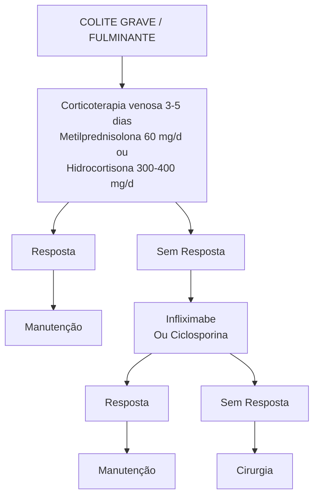

Crohn (CM)    Retocolite Ulcerativa (CM)

# DOENÇA INFLAMATÓRIA INTESTINAL

| • RCUI: cólon e reto, contínuo e ascendente, criptite, p-ANCA, só mucosa;
• x Crohn: da boca ao ânus, descontínuo, granuloma não caseoso, ASCA, transmural → estenose, perfuração, abscesso, fístula;
• Manifestações clínicas conforme local de acometimento;
• MEI: artrite, artralgia, pioderma gangrenoso, eritema nodoso, úlceras aftosas, uveíte, CEP;
• Doença crônica com crises e remissões;
• Tratamento;
• Leve → RCUI: 5-ASA / Crohn: budesonida entérica, corticoide sistêmico; | • Moderada s/ fatores mau progn → RCUI: corticoide + 5-ASA ± IS / Crohn: corticoide + IS;
• Grave ou fatores de mau prognóstico: biológico ± IS.
• Colite fulminante;
• Corticoterapia venosa 3-5 dias → Se não responder, IFX (ou ciclosporina) → Se não responder, cirurgia;
• Além disso: hidratar, ATB s/n, descartar clostridium, CMV, Rx abdome, tromboprofilaxia.
• Estenoses: biológico (se mais inflamação) ou cirurgia / dilatar (se mais fibrose);
Fístula / perfuração / abscesso: ATB + drenagem + cirurgia. |
| -------------------------------------------------------------------------------------------------------------------------------------------------------------------------------------------------------------------------------------------------------------------------------------------------------------------------------------------------------------------------------------------------------------------------------------------------------------------------------------------------------------------- | ------------------------------------------------------------------------------------------------------------------------------------------------------------------------------------------------------------------------------------------------------------------------------------------------------------------------------------------------------------------------------------------------------------------------------------------------------------------------------------------------------------------------------------------------- |

## 1. O QUE É?

### 1.1 DOENÇA MULTIFATORIAL

• Predisposição genética – gene NOD2;
• Exposição ambiental;
• Obesidade;
• Dieta ocidental;
• Industrialização;
• Uso de anti-inflamatórios, antibióticos.
• Resposta imune desregulada – desbalanço entre citocinas inflamatórias e anti-inflamatórias.

### 1.2 AS DUAS PRINCIPAIS REPRESENTANTES SÃO

• Retocolite ulcerativa:
• Acomete cólon e reto – ou seja, o intestino grosso;
• Tem caráter contínuo e ascendente;
• As manifestações clínicas gerais são: diarreia (caráter inflamatório), com presença de sangue e muco nas fezes;
• Biópsia típica: criptite;
• Marcador sorológico: p-ANCA – presente em 60-80% dos casos; ASCA (anticorpos anti-Saccharomyces cerevisiae) positivo em 10-15% dos casos;
• Restrito à mucosa;
• Tabagismo é fator de proteção.

**Doença de Crohn:**

• Pode acometer todo o trajeto gastrointestinal – da boca ao ânus;
• Demonstra padrão descontínuo;
• As manifestações clínicas gerais são mais variáveis: desde dor abdominal e sintomas suboclusivos até diarreias inflamatórias, com sangue e muco;
• Biópsia típica: granulomas não caseosos (diferenciar de granuloma caseoso = tuberculose);
• Marcador sorológico: ASCA – presente em 60-70% dos casos; p-ANCA positivo em 5-15% dos casos.
• É transmural → complicações associadas: estenose, perfuração, abscessos, fístula;
• Piora com uso de tabaco!

### 1.3. MANIFESTAÇÕES CLÍNICAS:

• São conforme o local de acometimento! Além das manifestações intestinais, pode apresentar também manifestações extraintestinais.

## 2. MANIFESTAÇÕES EXTRAINTESTINAIS

• Tais manifestações podem estar associadas, ou não, à atividade da doença inflamatória intestinal;

### 2.1 MUSCULOESQUELÉTICAS (MAIS COMUNS): ARTRITE:

• Axial: não associada à atividade intestinal;
• Periférica: pode estar associada (tipo I – menor número de articulações acometidas + articulações maiores) ou não (tipo II – poliarticular + articulações menores). **Figura 1**

**Figura 1** As manifestações musculoesqueléticas são as mais comuns.

Artrite periférica em cotovelos = artrite tipo I

### 2.2 CUTÂNEAS

**Pioderma gangrenoso:**

• Lesões ulceradas acometendo, principalmente, os membros;

• Mais presente na retocolite;
• Não depende da atividade intestinal.
• Confira Figura 2

**Eritema nodoso:**
• Placas hiperemiadas, dolorosas;
• Mais presente na Doença de Crohn;
• Relacionado à atividade intestinal. Figura 3

Figura 2 Pioderma gangrenoso em membro inferior.

Figura 3 Pioderma gangrenoso.

**Úlceras aftosas:**
• Relacionadas à atividade intestinal.

Figura 4 Aftas orais.

## 2.3 OCULARES
• Uveíte → Independe da atividade intestinal. Figura 5

• Episclerite e conjuntivite: Em geral, associadas à atividade intestinal. Figura 6

Figura 5 Uveite.

Figura 6 Episclerite e conjuntivite.

## 2.4 HEPATOBILIARES
• Colangite esclerosante primária (CEP) → Mais associada à retocolite;
• Litíase biliar.

## 2.5 RENAIS
• Nefrolitíase por hiperoxalúria entérica;
• No trato gastrointestinal inflamado ocorre uma menor absorção de gorduras;
• Por tal fato, o cálcio tende a interagir com os ácidos livres da gordura;
• Nesse sentido, há maiores níveis de oxalato livre, passíveis de absorção → hiperoxalúria entérica.

## 2.6 TROMBOSE

# 3. EXAMES LABORATORIAIS

## 3.1 HEMOGRAMA
• Avaliar anemia e leucocitose.

## 3.2 AVALIAR PERFIL NUTRICIONAL
• Albumina;
• Perfil férrico;
• Vitamina B12.

## 3.3 PROVAS DE ATIVIDADE INFLAMATÓRIA
• VHS e PCR.

## 3.4 FEZES
• Calprotectina – elevação dos níveis;
• Lactoferrina – elevação dos níveis.

DOENÇA INFLAMATÓRIA INTESTINAL                                                                                       3

## 4. EXAMES ENDOSCÓPICOS

### 4.1 COLONOSCOPIA – PRINCIPAL EXAME!
• Permite a avaliação de intestino grosso e íleo terminal. As imagens A, B, C e D representam doença inflamatória intestinal: Figura 7

**A.** Mucosa edemaciada com perda da visualização dos vasos submucosos;

**B.** Áreas de enantema;

**C.** Erosões;

**D.** Úlceras.

Figura 7 Colonoscopia em paciente com retocolite ulcerativa. A: normal; B: leve; C: moderada; D: intensa.

• A imagem a seguir é mais característica de Doença de Crohn:
  • Visualiza-se úlceras profundas com áreas edemaciadas/eritemas. Figura 8

Figura 8 Colonoscoia em paciente com Doença de Crohn.

• Indicação para biópsia – sempre! Também é útil para avaliação de diagnósticos diferenciais: tuberculose (granuloma caseoso); CMV, herpes, fungos; linfoma; uso crônico de AINEs; colite isquêmica.

### 4.2 ENDOSCOPIA
• Reservada aos casos com presença de sintomas do trato gastrointestinal alto;

### 4.3 AVALIAR O INTESTINO DELGADO?
• Depende do paciente;
• Enteroscopia → Via anterógrada ou retrógrada.
• Cápsula endoscópica – CE;
• Não deve ser utilizada em pacientes com suboclusão/estenose.

## 5. EXAMES RADIOLÓGICOS

### 5.1 TRÂNSITO INTESTINAL – MÉTODO ANTIGO

### 5.2 ENTEROGRAFIA → ENTERO-TC E ENTERO-RM

**Pontos positivos:**
• Não invasivo;
• Mais acessível que enteroscopia e que a cápsula endoscópica;
• Permite a avaliação de complicações;
• Permite a avaliação da extensão da doença.

**Pontos negativos:**
• Radiação;
• Contraste;
• Não permite a realização de biópsias;
• Não permite a terapêutica de estenoses.

**Sinais de doença inflamatória intestinal em atividade:**
• Espessamento parietal estratificado – em laranja;
• Hiperrealce mucoso – em azul; Figura 9
• Densificação da gordura mesentérica – em verde;

Figura 9 Achados sugestivos de doença inflamatória intestinal em atividade em EnteroTC.

Ingurgitamento vascular – em amarelo → "sinal do pente" consultar a Figura 10 na próxima página.

**Figura 10** Ingurgitamento vascular em paciente com doença inflamatória intestinal em EnteroTC.

• Ulceração mucosa; **Figura 11**
• Linfonodomegalias mesentéricas.

**Figura 11** Úlceras mucosas em EnteroTC.

## 6. RETOCOLITE

### 6.1 CLASSIFICAÇÃO

**Montreal (considera a topografia de acometimento):**
• Acomete apenas o reto → Proctite/retite;
• Acomete até o ângulo esplênico → Colite esquerda;
• Pancolite → Quando o acometimento alcança áreas após o ângulo esplênico ou seja, quando acometer qualquer segmento do cólon transverso.

**Truelove e Witts (avaliar a atividade da doença):**

**Tabela 1** Classificação de Truelove & Witts para atividade da doença em RCUI

|                         | TRUELOVE E WITTS
Leve | TRUELOVE E WITTS
Moderada | TRUELOVE E WITTS
Grave           |
| ----------------------- | ------------------------- | ----------------------------- | ------------------------------------ |
| Evacuações com sangue   | < 4                       | ≥ 4                           | ≥ 6
+ 1 dos
critérios abaixo |
| FC (bpm)                | < 60                      | ≤ 90                          | > 90                                 |
| Temperatura axilar (°C) | < 37.5                    | ≤ 37.8                        | > 37.8                               |
| Hemoglobina (g/dL)      | > 11.5                    | ≥ 10.5                        | < 10.5                               |
| VHS ou PCR              | Normal                    | Normal                        | Aumentado                            |

**Colite fulminante:**
• N° de evacuações > 10, com sangue;
• Sepse;
• Necessidade de hemotransfusão.

## 7. DOENÇA DE CROHN

### 7.1 CLASSIFICAÇÃO

**Montreal:**

**Tabela 2** Classificação de Montreal para Doença de Crohn

| **Idade do diagnóstico**                                                                           |
| -------------------------------------------------------------------------------------------------- |
| A1: < 16 anos
A2: 17 - 40 anos
A3: > 40 anos                                               |
| **Localização**                                                                                    |
| L1: ileal
L2: colônica
L3: ileocolônica
L4: isolada em trato gastrointestinal superior |
| **Comportamento**                                                                                  |
| B1: inflamatória
B2: estenosante
B3: penetrante
P: doença perianal                     |

**Índice de atividade da Doença de Crohn:**
• CDAI; dá-se por uma fórmula matemática;
• Confira **Tabela 3** na próxima página.

## 8. TRATAMENTO DAS DOENÇAS INFLAMATÓRIAS INTESTINAIS

### 8.1 ARSENAL TERAPÊUTICO: LEMBRAR DO CURSO DA DOENÇA: CRISES E REMISSÕES
• Retocolite; **Figura 12**
• Doença de Crohn;

### 8.2 CORTICOIDES (CE)
• Sistêmicos – EV ou VO – apenas para crises. Não são usados para o tratamento de manutenção!
• Budesonida – liberação entérica – para tratamento de Doença de Crohn de íleo terminal leve a moderada.

DOENÇA INFLAMATÓRIA INTESTINAL                                                                                                      5

**Tabela 3** Atividade de Doença de Crohn conforme índice de atividade CDAI

| Critérios                                                                                                                                                                                     |
| --------------------------------------------------------------------------------------------------------------------------------------------------------------------------------------------- |
| Número de evacuações
Intensidade da dor abdominal
Sensação de bem-estar
Presença de complicações
Uso de antidiarreicos
Massa abdominal
Hematócrito
Perda ponderal |
| Interpretação                                                                                                                                                                                 |
| < 150 pontos: remissão
150 - 220: leve à moderada
2200 - 450 pontos: moderada à intensa
> 450 pontos: fulminante                                                                  |

**Figura 12** História natural de retocolite ulcerativa (gráfico superior) e doença de Crohn (gráfico inferior)

|                                 | Início da doença                                                                                                                                      | Diagnóstico | Doença prévia | Doença tardia |
| ------------------------------- | ----------------------------------------------------------------------------------------------------------------------------------------------------- | ----------- | ------------- | ------------- |
| Dados Deficiência Digestiva     | Extensão da doença
Lesões
Alteração da motilidade
Estreitamento da resolução
Displasia/câncer
Cirurgia
Atividade Inflamatória |             |               |               |
|                                 | Início da doença                                                                                                                                      | Diagnóstico | Doença prévia |               |
| Lesão Associada à Discapacidade | Janela de oportunidade
Extensão
Fístula/abscesso
Cirurgia
Extensão
Atividade Inflamatória                                         |             |               |               |

## 8.3 AMINOSSALICILATOS (5-ASA)
• Mesalazina – retocolite;
• Sulfassalazina – retocolite, pode melhorar o quadro de sintomas articulares.

## 8.4 IMUNOSSUPRESSORES (IS)
• Azatioprina;
• Ciclosporina;
• Metotrexato.

OBS.: a azatioprina demonstra capacidade de reduzir imunogenicidade ao medicamento anti-TNF.

## 8.5 BIOLÓGICOS
• Antes da administração → avaliação pré-biológica;
  • Sorologia HBV/HCV/HIV;
  • PPD (ou IGRA) – pesquisa de tuberculose latente;
  • Radiografia de tórax;
  • Vacinação para: HAV/HBV; influenza; pneumococo; difteria e tétano – dT.

Anti-TNF – preconizado para pacientes com doença fistulizante e doença perianal;
• infliximabe;
• adalimumab;
• certolizumab – gestante; golimumab – recomendado para retocolite.
  • Lembrar do risco de infecções e reativação de tuberculose!
  • Anti-integrina – α4β7 → segura (quanto ao risco de câncer e infecção); evitar nos casos de manifestações extraintestinais não associadas à atividade de doença intestinal; Vedolizumab;
  • Anti-IL-12/IL-23 – seguro (câncer e infecção); tem uso liberado também em psoríase; ustekinumab;
  • Inibidor da JAK – recomendado para retocolite; Tofacitinib – oral; aumenta o risco de herpes zoster e trombose. Recomenda-se inclusive a vacinação para herpes zoster nesses pacientes.
  • Upadacitinibe – oral

## 9. TRATAMENTO

• Deve-se basear se a doença é leve, moderada ou intensa.

### 9.1 LEVE
• Retocolite → 5-ASA;
• Crohn:
  • Íleo terminal ou cólon direito → Budesonida;
  • Alternativa: CE sistêmico.

### 9.2 MODERADA, SEM FATORES D E MAU PROGNÓSTICO
• Retocolite → CE + 5-ASA e/ou IS;
• Crohn → CE + IS.

### 9.3 INTENSA OU FATORES PREDITIVOS DE DOENÇA DE CROHN COMPLICADA
• Terapia biológica associada ou não a imunossupressor.

| Fatores preditivos de DC complicada
Pacientes jovens ao diagnóstico
Doença perianal
Doença extensa ao diagnóstico
Úlceras extensas e profundas
Doença estenosante, penetrante

Acometimento do TGI superior |
| --------------------------------------------------------------------------------------------------------------------------------------------------------------------------------------------------------------------------------------- |

## 9.4 TRATAMENTO DE COLITE GRAVE / FULMINANTE

**Figura 13** Fluxograma 1: Tratamento de colite grave ou fulminante

### 9.5 Outras medidas
- Tromboprofilaxia;
- Descartar infecções (Clostridium, CMV);
- Hidratação e correção de distúrbios hidroeletrolíticos;
- Antibioticoterapia em pacientes selecionados;
- Radiografia de abdome;
- Dilatação de cólon > 6 cm → Risco aumentado para megacólon tóxico.

## 10. COMPLICAÇÕES

Estão presentes em doença transmural → Doença de Crohn;

### 10.1 ESTENOSE – TRATAMENTO
- Predomínio do componente inflamatório;
  - Biológicos.

- Predomínio do componente fibrótico;
  - Dilatação endoscópica;
  - Cirurgia.

### 10.2 FÍSTULA/PERFURAÇÃO/ABSCESSO – TRATAMENTO
- Antibióticos;
- Drenagem;
- Cirurgia.

### 10.3 ATENTAR PARA O RISCO DE CÂNCER COLORRETAL;
- Maior risco se:
  - Pancolite;
  - Colangite esclerosante primária;
  - Histórico familiar.

**Figura 14** Estenose em intestino delgado, com dilatação a montante.
