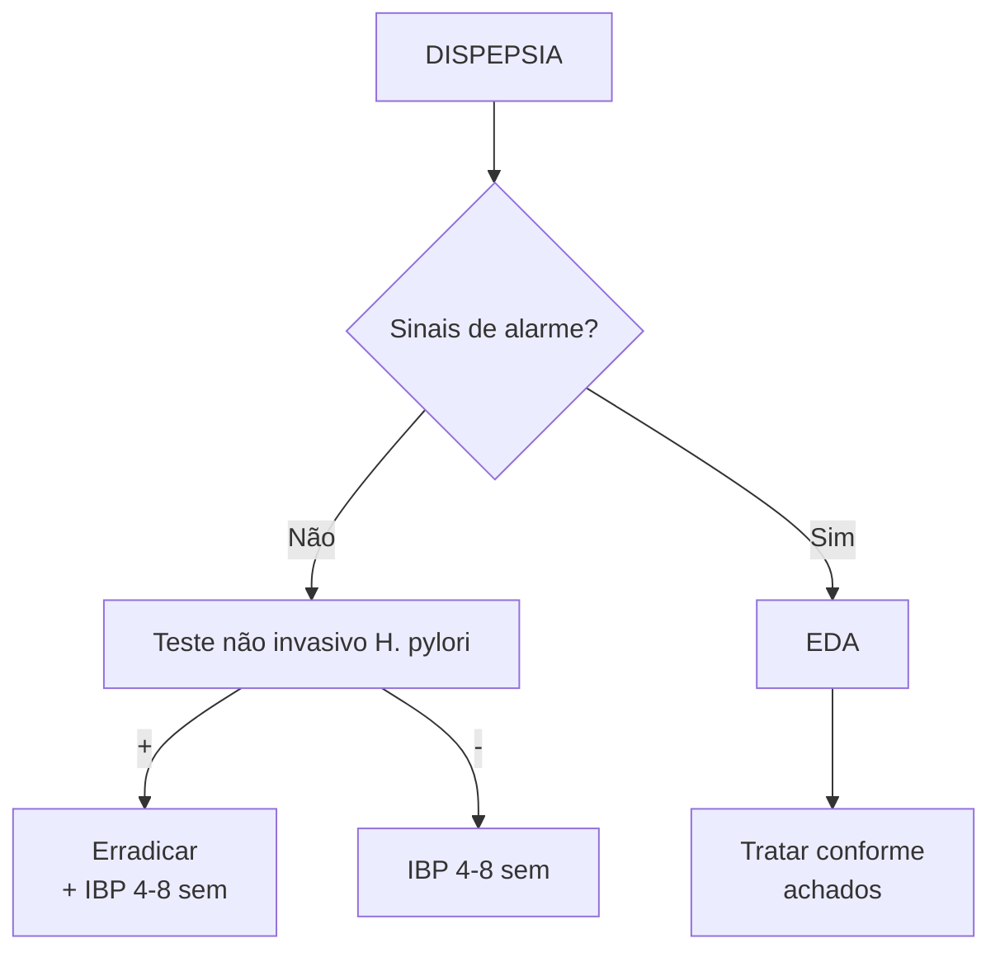
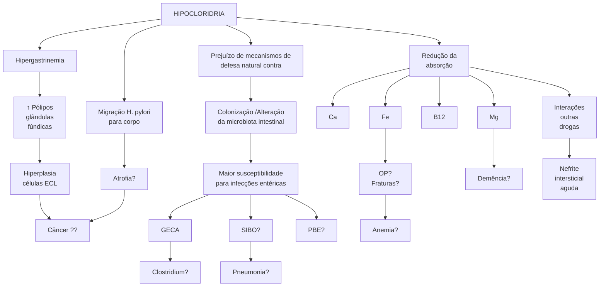

# ESTÔMAGO 1 DISPEPSIA, FISIOLOGIA GÁSTRICA E IBPS

**Dispepsia:**
- Sinais de alarme (Idade > 40-50 a, HF ca gástrico, disfagia, vômitos recorrentes, massa abdominal, anemia, sangramento, perda ponderal, linfonodomegalia palpável) = EDA;
- **Sem sinais de alarme = teste não invasivo H. pylori + IBP 4-8 sem.**

**Fisiologia gástrica:**
- Antro: células G (produzem gastrina) / Céls D (produzem somatostatina);
- Corpo: células parietais (secretoras de ácido) / ECL (produzem histamina) / células D;
- Produção ácido por parietais: gastrina, histamina e ach estimulam/somatostatina inibe.

**Bloqueio ácido:**
- Anti-H2: receptores de histamina;
- IBP: bloqueiam bomba de próton (troca H+ por K+);
- PCAB (vonoprazan): competição com K+ luminal (não vai trocar K por H+).

**Uso prolongado de IBP (> 1 a):**
- Aumenta pólipos gls fúndicas/possível redução da absorção de Ca (osteoporose?), Fe (anemia?), b12 (demência?) e Mg/aumento risco de GECA, SIBO, clostridium, PBE, pneumonia/NIA/interações medicamentosas /associação controversa com ca gástrico.

## 1. DISPEPSIA – INFORMAÇÕES GERAIS

- Vários sintomas associados à má digestão;
- Dor epigástrica, plenitude pós-prandial, pirose, náuseas e vômitos.

## 2. DISPEPSIA – CAUSAS

- Úlcera, H. pylori, biliar, parasitoses, intolerâncias, câncer, parasitose, gastroparesia, medicamentos, pancreatite, funcional, DRGE;
- A principal causa é a dispepsia funcional!

## 3. DISPEPSIA – CONDUTA

### 3.1 SINAIS DE ALARME
- Idade > 40-50 anos;
- História familiar de câncer gástrico em parente de 1º grau;
- Disfagia;
- Vômitos recorrentes;
- Massa abdominal;
- Anemia;
- Sangramento;
- Perda ponderal;
- Linfonodomegalia palpável.

OBS.: IBP – inibidor de bomba de prótons.

**Figura 1 Fluxograma Dispepsia**

## 4. FISIOLOGIA GÁSTRICA

### 4.1 CORPO E FUNDO GÁSTRICO – PRESENÇA DAS GLÂNDULAS OXÍNTICAS

- Tais glândulas correspondem a 70% das glândulas do estômago e são responsáveis pela produção de suco gástrico (cerca de 2,5 – 3,0 L/dia) – desses, 70 a 80% são de ácido clorídrico;
  - Células parietais – secretoras de ácido;
  - Células D – produtoras de somatostatina (realizam feedback negativo para a secreção gástrica);
  - Células enterocromafins like (ECL) – produzem, principalmente, histamina.

### 4.2 ANTRO

- Células D – produtoras de somatostatina;
- Células G – produtoras de gastrina.

![Figura 2 - Topografia das principais células envolvidas na secreção ácida gástrica - Diagrama do estômago mostrando Fundo, Glândulas oxínticas - 80%, Corpo, Antro, e Glândulas pilóricas - 20%, com células ECL, H⁺, D, e G marcadas]

**Figura 2** Topografia das principais células envolvidas na secreção ácida gástrica

## 5. A FISIOLOGIA GÁSTRICA TEM ALGUMAS ETAPAS NA NOSSA DIGESTÃO

### 5.1 FASE CEFÁLICA: OCORRE DESDE O DESEJO POR AQUELE DETERMINADO ALIMENTO - 80% POR VIA VAGAL

• O estímulo à atividade da célula G ocorre pelo neuroestímulo da acetilcolina;
• Nesse sentido, também há inibição das células D.

![Figura 3 - Etapas da fisiologia gástrica na nossa digestão - Diagrama mostrando ACh estimulando células G e D no Antro, e células ECL, H⁺ e D no Corpo]

**Figura 3** Etapas da fisiologia gástrica na nossa digestão

### 5.2 FASE GÁSTRICA: OCORRE DISTENSÃO DO ANTRO E ELEVAÇÃO DO PH

• Também ocorrem o estímulo das células G para a produção de gastrina e a inibição das células D;
• A produção de gastrina tem efeito direto na célula parietal, favorecendo a hipertrofia e produção ácida;
• Além disso, a gastrina estimula as ECL a produzirem histamina → principal via de estimulação das células parietais;
• Por fim, também há uma via vagal com ação direta da acetilcolina sob as células parietais.

![Figura 4 - Fase gástrica da digestão - Diagrama mostrando ACh, Antro, Corpo com células G, ECL, H⁺ e D]

**Figura 4** Fase gástrica da digestão

**A partir do momento que o alimento sai do estômago**
• Menor distensão do antro;
• Queda do pH;
• Menor estímulo das células G;
• Cessação do feedback negativo para as células D → leva à maior produção de somatostatina no antro e no corpo gástrico.
• A somatostatina inibe as células G, as células parietais e as ECL;
• Observa-se uma redução da produção gástrica.

### 5.3 FASE INTESTINAL → O ÁCIDO ESTOMACAL FAVORECE O ESTÍMULO ÀS ENTEROGASTRONAS (SECRETINAS, CCK, GIP, VIP, PYY)

• Tais neuropeptídeos afetam a secreção gástrica e a motilidade;
• É uma fase de feedback negativo.

![Figura 5 - Fase Intestinal da digestão, com feedback negativo - Diagrama mostrando ACh, Antro, Corpo com células G, ECL, H⁺ e D com feedback negativo]

**Figura 5** Fase Intestinal da digestão, com feedback negativo

### 5.4 NA CÉLULA PARIETAL, ENCONTRAM-SE:

• Bombas de prótons (H+ entra para lúmen e K+ entra para o intracelular) – dependente de ATP;
• Canais de íon cloreto → trocam Cl- para formar o HCl no lúmen;
• Canais que trocam cloreto e HCO3 → favorecem a manutenção da homeostase do pH;
• Canais de K+.

![Figura 6 - Esquema da célula parietal e principais vias de estímulo - Diagrama detalhado mostrando Célula Parietal com Luz Gástrica, HCL, Ca²⁺, Membrana apical, Canalículo intracelular pH 1-2, SST, M₂, H₂, pH 7.4, PGE₂, CCK₂, e vias de Neurocrina Ach, Parácrina Histamina, e Hormonal Gastrina]

**Figura 6** Esquema da célula parietal e principais vias de estímulo

ESTÔMAGO 1 DISPEPSIA, FISIOLOGIA GÁSTRICA E IBPS                                                           3

## 5.5 PODEMOS BLOQUEAR A SECREÇÃO ÁCIDA FARMACOLOGICAMENTE

• A bomba de prótons → uso de IBP;
• Os receptores de histamina → uso de anti-histamínicos – não tão potentes quanto os IBP's e sofrem o efeito de taquifilaxia;
• O transporte de K+ → PCABs (bloqueadores ácidos competitivos de potássio);
  • Vonoprazan 10 e 20 mg;
  • Em teoria, apresenta maior duração do bloqueio ácido;
  • Não sofre metabolização pelo citocromo p450;
  • Não depende da manutenção do jejum para melhor ação terapêutica.

## 6.2 OS IBPS FAZEM MAL?

• Uso contínuo de IBP = uso diário de IBP por tempo superior a 1 ano (efeitos de longo prazo!);
• O IBP é metabolizado pelo citocromo P450, o que pode alterar a ação de outras medicações que são metabolizadas pela mesma via;
• Apesar de haver risco teórico para alguns potenciais efeitos adversos associados, muitas condições clínicas relatadas são controversas e não apresentam correlação prática significativa. Figura 7

## 6.IBPS

### 6.1 QUAIS AS OPÇÕES DISPONÍVEIS?

**Tabela 1** Dose padrão (= plena) de IBPs

| Dose padrão    |              |
| -------------- | ------------ |
| Omeprazol      | 20-40 mg/dia |
| Pantoprazol    | 40 mg/d      |
| Rabeprazol     | 20 mg/d      |
| Esomeprazol    | 20-40 mg/d   |
| Lansoprazol    | 30 mg/d      |
| Dexlansoprazol | 30-60 mg/d   |

**Figura 7** Possíveis efeitos adversos com uso prolongado de IBP.
