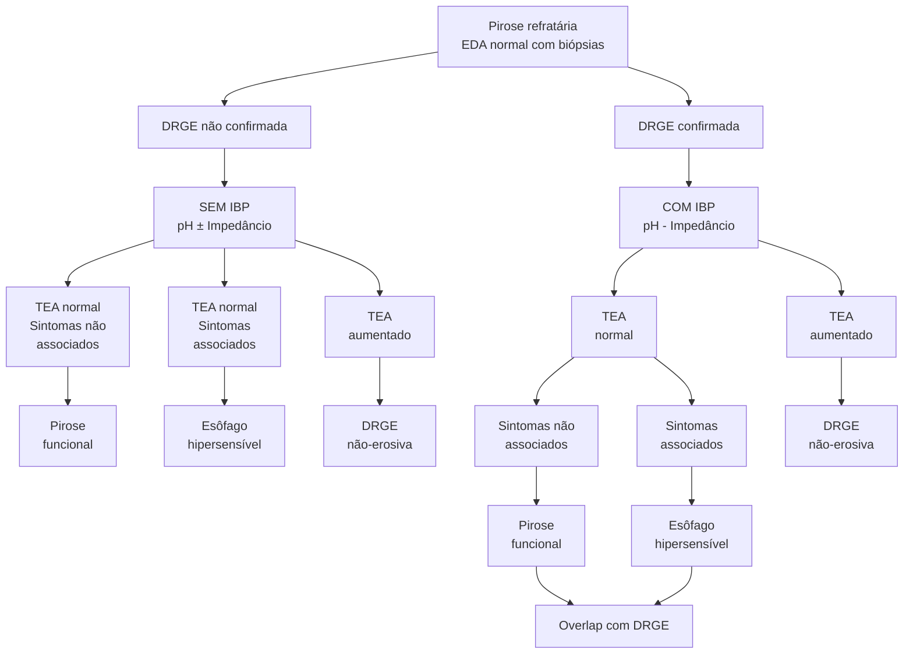

# ESÔFAGO 1: DOENÇA DO REFLUXO GASTROESOFÁGICO (DRGE)

| **DRGE**
• Típico: pirose e regurgitação;
• Atípico: dor torácica, tosse, rouquidão...
**Diagnóstico:**
• Quadro clínico e teste terapêutico com IBP (baixo custo, pouco acurado);
• EDA (invasivo. Avaliar complicações e diag diferenciais, esofagite em apenas 30-40%);
• pHmetria (± Impedâncio): padrão-ouro, porém desconfortável. Realizar apenas se refratariedade ou programação de procedimento invasivo.
**Conduta:**
• Sem sinais de alarme: IBP 4-8 semanas;
• Sinais de alarme, sintomas refratários ou recorrentes: EDA;
• Sintomas extraesofágicos isolados: tendência atual de investigar antes de teste terapêutico. |   | **Tratamento:**
• Medidas gerais: perda de peso, alimentação, cessar tabagismo, medicamentos;
• Fármacos: IBP, PCABs, anti-H2, antiácidos, alginato, baclofeno;
• Invasivos: fundoplicatura cirúrgica, tratamentos endoscópicos.
**Barrett:**
• Mucosa rosa salmão - AP: metaplasia intestinal;
• Risco de câncer (maior se longo >3 cm ou displasia);
• Sem displasia: vigilância 3-5 anos;
• Displasia baixo grau: repetir EDA em 6 meses ou tratamento endoscópico;
• Alto grau: Ressecção ou ablação endoscópica.
**Outras esofagites:**
• Química, medicamentosa, infecciosa (candidíase → fluconazol, herpes → aciclovir, CMV → ganciclovir), esofagite eosinofílica. |
| ------------------------------------------------------------------------------------------------------------------------------------------------------------------------------------------------------------------------------------------------------------------------------------------------------------------------------------------------------------------------------------------------------------------------------------------------------------------------------------------------------------------------------------------------------------------------------------------------------------------------------------------------------------------------------ | - | ----------------------------------------------------------------------------------------------------------------------------------------------------------------------------------------------------------------------------------------------------------------------------------------------------------------------------------------------------------------------------------------------------------------------------------------------------------------------------------------------------------------------------------------------------------------------------------------------------------------------------------------------------------------------------------------------------------------------- |

## 1. INTRODUÇÃO

Ocorre pelo retorno do conteúdo gástrico até a mucosa esofágica.

### 1.1 MECANISMOS PATOLÓGICOS

• Relaxamento transitório do esfíncter inferior do esôfago (EIE) quando não deveria relaxar;
• Hipotonia do esfíncter esofagiano inferior;
• Outros mecanismos: elevação da pressão abdominal; diminuição do esvaziamento gástrico, por exemplo, em pacientes com gastroparesia; redução da salivação (saliva é importante para o clearance esofágico); acid pocket;

## 2. EPIDEMIOLOGIA

• Acomete cerca de 10-20% da população ocidental.

## 3. SINTOMAS

### 3.1 TÍPICOS

• Pirose (também conhecida como azia);
• Regurgitação.

### 3.2 SINTOMAS ATÍPICOS;

• Dor torácica não cardíaca;
• Globus faríngeo;
• Tosse crônica;
• Rouquidão;
• Pigarro;
• Desgaste do esmalte dentário;

• Halitose → 90% dos quadros de halitose se dá por patologias na cavidade oral;
• Aftas orais.

## 4. DIAGNÓSTICO

### 4.1 QUADRO CLÍNICO + TESTE TERAPÊUTICO COM INIBIDOR DA BOMBA DE PRÓTONS;

• Simples e com baixo custo;
• Sensibilidade 60-80%; especificidade 30-70%;
• É positivo em outras patologias.

### 4.2 ENDOSCOPIA:

• Tem custo inerente, além de ser um método invasivo;
• É bastante utilizado, contudo demonstra baixa sensibilidade;
• É útil para a avaliação de complicações e para diagnósticos diferenciais;
• Para o estabelecimento do diagnóstico, é necessária a presença de esofagite.
• Cerca de 60-70% dos pacientes apresentam endoscopia sem alterações;
  • Somente em 30-40% dos casos existem achados característicos de refluxo → esofagite.
  • A esofagite é a inflamação da mucosa esofágica, geralmente associada à DRGE.
• Classificação de Los Angeles:
  - **A.** Erosões lineares não confluentes < 5 mm;
  - **B.** Erosões lineares não confluentes > 5 mm;
  - **C.** Erosões confluentes que ocupam < 75% da luz do órgão;
  - **D.** Erosões confluentes que ocupam > 75% da luz do órgão;
• Confira Figura 1, Figura 2, Figura 3 e Figura 4

GASTROENTEROLOGIA

## A
< 5 mm

![Diagram showing esophageal erosion classification A with cross-sectional and longitudinal views, plus endoscopic image]

**Figura 1** Esofagite erosiva Los Angeles A.

## B
> 5 mm

![Diagram showing esophageal erosion classification B with cross-sectional and longitudinal views, plus endoscopic image]

**Figura 2** Esofagite erosiva Los Angeles B.

## C
< 75%

![Diagram showing esophageal erosion classification C with cross-sectional and longitudinal views, plus endoscopic image]

**Figura 3** Esofagite erosiva Los Angeles C.

## D
> 75%

![Diagram showing esophageal erosion classification D with cross-sectional and longitudinal views, plus endoscopic image]

**Figura 4** Esofagite erosiva Los Angeles D

## ESÔFAGO 1: DRGE (DOENÇA DO REFLUXO GASTROESOFÁGICO)

ATENÇÃO: Nas definições atuais, as lesões grau A não confirmam o diagnóstico. O diagnóstico de DRGE pode ser confirmado pela presença de esofagite erosiva graus B, C ou D, Barrett ou estenose péptica.

**Complicações:**
- Úlcera;
- Estenose;
- Barrett – caracteriza-se pela mucosa do esôfago distal, em coloração "salmão".

**Figura 5** Úlcera em transição esôfago-gástrica.

**Figura 6** Estenose péptica.

**Figura 7** Esôfago de Barrett.

**Figura 8** Gráfico de pHmetria em paciente com DRGE. O gráfico acima (azul) representa o canal proximal (aferição de refluxo proximal) e o gráfico abaixo (verde) representa o canal distal (aferição de refluxo distal, com canal posicionado 5 cm acima da borda superior do esfíncter inferior). A linha vermelha em ambos os canais representa pH 4, sendo que quando o pH cai abaixo desta linha vermelha significa que houve refluxo.

### pHmetria
- Atua pela medição do pH esofágico em 24 horas;
- É o exame padrão-ouro, porém desconfortável;
- Requer manometria antes e pode depender da variação do dia.

OBS.: o exame deve ser realizado se houver programação cirúrgica ou doença refratária.

**Recomendações:**

É realizada geralmente após a suspensão de IBP por, pelo menos, 7 dias – a não ser que haja certeza do diagnóstico de DRGE e queira avaliar refratariedade ao tratamento.

- **Avaliação:** TEA = tempo de exposição ácida (com pH < 4);
  - TEA < 4% → descarta presença de refluxo patológico;
  - TEA 4 e 6% → há possibilidade de refluxo;
  - TEA > 6% → estabelece diagnóstico. **Figura 9**
- DeMeester (escore com 6 variáveis) > 14,7→ sugere DRGE.

### Impedanciometria
- Cateter similar à pHmetria, mas dispõe de anéis no cateter que identificam o movimento do bolo alimentar e se o refluxo é ácido ou não;
- Mais cara e menos disponível;
- Também é útil para avaliar se a refratariedade dos sintomas da DRGE é decorrente de refluxo não ácido associado.

### Manejo

**Como abordar?**
- Ausência de sinais de alarme → IBP 4 a 8 semanas;
- Sinais de alarme, sintomas refratários ou sintomas recorrentes? → Endoscopia digestiva alta;
  - Suspender o uso de IBP por 2-4 semanas antes do exame (se possível).
- Sintomas extraesofágicos isolados? Tendência atual é investigar antes de terapia empíric

GASTROENTEROLOGIA

## 5. FLUXOGRAMA

**Figura 9** Fluxograma de investigação de pirose refratária.

## 6. COMO TRATAR?

### 6.1 MEDIDAS ANTIRREFLUXO
- Perda de peso;
- Elevação da cabeceira (15 cm);
- Alimentação – Considerar individualidade de cada paciente, pois podem existir variações;
- Evitar alimentos gordurosos, condimentos, frituras;
- Evitar bebidas gaseificadas e bebidas alcoólicas;
- Evitar alguns medicamentos – bloqueadores do canal de cálcio;
- Não deitar após a refeição;
- Fracionamento da dieta;
- Cessação do tabagismo.

### 6.2 FÁRMACOS
- IBP;
- Anti-H2;
- PCABs;
- Procinéticos → se houver suspeita de retardo do esvaziamento gástrico associado;
- Antiácidos;
- Alginato – atua no bolsão ácido (acid pocket);
- Baclofeno.

### 6.3 CIRURGIA
- Fundoplicatura; Nissen → total; Dor / Toupet → parcial.
- Indicações: Desejo de cessar o uso de IBPs; Má adesão medicamentosa; Efeitos colaterais às medicações; Hérnia volumosa; Esofagite refratária;
- Aspiração refratária.

### 6.4 TRATAMENTOS ENDOSCÓPICOS:

**Radiofrequência – Stretta;**
- Estimula a proliferação de fibras de colágeno para tentar aumentar o tônus do EIE;
- Estudos evidenciaram a redução dos sintomas, contudo não foi evidenciado tempo de exposição ácido → houve redução de sensibilidade? Figura 10

**TIF – Fundoplicatura transoral sem incisão ;**

Indicações e recomendações:
- Desejo de cessar o uso de IBPs;
- Deve-se realizar manometria e pHmetria anteriormente ao procedimento. Figura 11

**Contraindicações a ambos procedimentos:**
- Hérnia de hiato > 2-3 cm;
- Disfagia;
- Esofagite grau C ou D;
- Presença de estenoses;
- Hipotonia importante no EIE.

[Image showing endoscopic treatment procedure for GERD with anatomical cross-section]

**Figura 10** Tratamento endoscópico por radiofrequência para DRGE.

ESÔFAGO 1: DRGE (DOENÇA DO REFLUXO GASTROESOFÁGICO)                                                                                  5

![Figura 11] Fundoplicatura endoscópica.

## 7. ESÔFAGO DE BARRETT

### 7.1 CONSIDERAÇÕES INICIAIS
• Suspeita-se quando presença de epitélio de coloração rosa-salmão em esôfago distal na endoscopia.
  • Anatomopatológico: evidência de epitélio colunar com metaplasia intestinal em esôfago distal.
  • Evolução: inflamação + cicatrização crônica → metaplasia → displasia → adenocarcinoma.

![Figura 12] Esôfago de Barrett.

### 7.2 TRATAMENTO
• IBP para todos os pacientes;
• Fundoplicatura – pode ser considerada para o controle dos sintomas.

### 7.3 CLASSIFICAÇÃO E SEGUIMENTO

ATENÇÃO: na presença de displasia, sugere-se a revisão por patologista experiente. Um esôfago inflamado pode parecer que tem displasia quando, na verdade, é só inflamação.

**Tabela 1** Conduta em Esôfago de Barrett

| **Sem displasia**           | Vigilância epidemiológica a cada 3-5 anos                                                                                                             |
| --------------------------- | ----------------------------------------------------------------------------------------------------------------------------------------------------- |
| **Displasia de baixo grau** | • Nova EDA a cada 6 meses / 1 ano - durante o primeiro ano. Após tal período, manter seguimento anual
• Discutir ressecção ou Ablação endoscópica |
| **Displasia de alto grau**  | Terapia endoscópica
• Ressecção - mucosectomia/ESD
• Ablação                                                                                  |
| **Adenocarcinoma**          | Proceder com estadiamento
Manejo conforme o estadiamento                                                                                          |

### 7.4 CLASSIFICAÇÃO – EXTENSÃO DE ACOMETIMENTO

**Curto:**
• < 3 cm;
• Sem displasia;
• Risco de adenocarcinoma: 0,07% ao ano;
• Risco de displasia de alto grau ou adenocarcinoma: 0,29% ao ano;
• Seguimento: a cada 5 anos (?).

**Longo:**
• > 3 cm;
• Sem displasia; risco de adenocarcinoma: 0,25% ao ano;
• Risco de displasia de alto grau ou adenocarcinoma: 0,91% ao ano;
• Seguimento: a cada 3 anos (?).

### 7.5 QUANDO PROCEDER COM O RASTREAMENTO?
• Sintomas crônicos (> 5 anos) ou frequentes (> 1x/semana).
• Deve ser associado a 2 dos critérios a seguir:
  • Homem;
  • Obesidade;
  • > 50 anos;
  • Histórico de tabagismo;
  • Branco;
  • Histórico familiar positivo para parentes de 1° grau.

## 8. HÉRNIA DE HIATO

**Observe a imagem a seguir:**
Radiografia de tórax em AP e perfil, evidenciando área arredondada, retrocardíaca, com formação de nível hidroaéreo. Figura 13

**Considerações iniciais:**
• Quando o estômago ultrapassa o hiato diafragmático e hérnia para a cavidade torácica.

**Classificação:**
Normal:
• Tipo 1; Figura 14 e 15
  • Deslizamento → transição esôfago-gástrica acima do pinçamento diafragmático
• Tipo 2: Figura 16
  • Rolamento → deslocamento cranial do fundo gástrico;
  • Se grande → procedimento cirúrgico.

GASTROENTEROLOGIA

• Tipo 3; **Figura 17**
  • Mista – combinação do tipo I e II;
  • Se grande → procedimento cirúrgico.
• Tipo 4; **Figura 18**
  • Herniação gástrica e de outros órgãos.

**Figura 13** Radiografia de tórax PA e perfil evidenciando hérnia de hiato.

**Figura 14** Hérnia de hiato tipo I - imagem endoscópica em visão frontal, demonstrando junção esôfago-gástrica acima do pinçamento diafragmático.

**Figura 15** Hérnia de hiato tipo I - imagem endoscópica em retrovisão.

**Figura 16** Hérnia de hiato tipo II - imagem endoscópica em retrovisão.

**Figura 17** Representação esquemática das hérnias de hiato conforme tipo.

| Normal                                                | Deslizamento
Tipo I | Rolamento
Tipo II | Mista
Tipo III |
| ----------------------------------------------------- | ----------------------- | --------------------- | ------------------ |
| Tipo IV
Herniação gástrica e
de outros órgãos |                         |                       |                    |

## 9. PECULIARIDADES

### 9.1 OBSERVE A IMAGEM A SEGUIR
• Imunohistoquímica → Esofagite por herpes simples.

**Figura 18** Esofagite infecciosa por herpes simples.

ESÔFAGO 1: DRGE (DOENÇA DO REFLUXO GASTROESOFÁGICO)                                                    7

## 9.2 NEM TODA ESOFAGITE É POR DOENÇA DO REFLUXO;

**Outras causas:**
- Química, medicamentosa;
- Esofagite infecciosa;
- Esofagite eosinofílica.

## 9.3 ESOFAGITE INFECCIOSA

**Suspeitar:**
- Odinogafia, disfagia;
- Associação: imunodeprimidos (neoplasia, SIDA), DM, uso de antibióticos, uso de corticoides.

**Candidíase:**
- Mais comum;
- Caracteriza-se pela presença de placas esbranquiçadas;
- Tratamento → fluconazol.

**Herpética (HSV-1):**
- Maior parte dos quadros não demonstra herpes labial concomitante;
- Caracterizada pela presença de vesículas e algumas ulcerações;
- Tratamento → aciclovir.

**CMV:**
- Úlcera extensa geralmente única;
- Tratamento → ganciclovir.

GASTROENTEROLOGIA

# REFERÊNCIAS

**Figura 1** Esofagite erosiva Los Angeles A.

Arquivo pessoal.

**Figura 2** Esofagite erosiva Los Angeles B.

Arquivo pessoal.

**Figura 3** Esofagite erosiva Los Angeles C.

Arquivo pessoal.

**Figura 4** Esofagite erosiva Los Angeles D.

Arquivo pessoal.

**Figura 9** Tratamento endoscópico por radiofrequência para DRGE.

Arquivo pessoal.

**Figura 10** Fundoplicatura endoscópica.

Arquivo pessoal.

**Figura 11** Esôfago de Barrett.

Arquivo pessoal.

**Figura 12** Radiografia de tórax PA e perfil evidenciando hérnia de hiato.

Arquivo pessoal.

**Figura 13** Hérnia de hiato tipo I - imagem endoscópica em visão frontal, demonstrando junção esôfago-gástrica acima do pinçamento diafragmático.

Arquivo pessoal.

**Figura 14** Hérnia de hiato tipo I - imagem endoscópica em retrovisão.

Arquivo pessoal.

**Figura 15** Hérnia de hiato tipo II - imagem endoscópica em retrovisão.

Arquivo pessoal.

**Figura 16** Representação esquemática das hérnias de hiato conforme tipo.

Arquivo pessoal.

**Figura 17** Esofagite infecciosa por herpes simples.

Arquivo pessoal.
