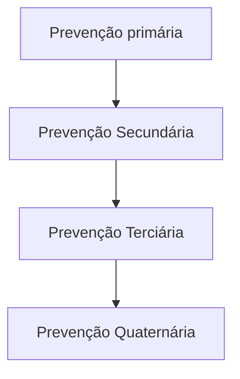

# RASTREAMENTOS: PROMOÇÃO À SAÚDE

• **Screening:** pessoa já doente, mas assintomática. Lembrar dos vieses relacionados e dos principais exemplos (próstata e tireóide): sobrediagnóstico, tempo de duração e ganho de tempo
• **Atividade física** (150 min/semana, intensidade moderada)
• **Tabagismo:** avaliar fase do modelo transteórico (pré-contemplação, contemplação, preparação, ação e manutenção) e grau de dependência (Fagerstrom). Tratamento farmacológico (mais indicado se alto grau de dependência): patch (21 mg se > 10 cigarros, 14mg se < 10 cigarros por dia), goma, vareniclina, bupropiona

• **Rastreamentos neoplasias:** útero (iniciar aos 25 anos após coitarca, anual, se 2 consecutivos negativos, a cada 3 anos até 64 anos desde que os últimos 2 negativos), colorretal (iniciar após os 50 anos, a cada 10 anos; se familiar com histórico, começar 10 anos antes da idade ao diagnóstico), mama (50 a 74 anos c/ MMG a cada 2 anos, começar aos 40 anos se história familiar de 1o grau) e pulmão (TC anual para 50 a 80 anos com 20 maços/anos o e tabagismo atual ou prévio nos últimos 15 anos).

## 1. PREVENÇÃO

### 1.1 TIPOS

**Figura 1** Tipos de prevenção



| Paciente                                                                                                                                                                                                                     | Sem doença → Com doença
Sente-se bem                                                                                                                                                                                                                                          | Sem doença → Com doença
Sente-se mal |
| ---------------------------------------------------------------------------------------------------------------------------------------------------------------------------------------------------------------------------- | --------------------------------------------------------------------------------------------------------------------------------------------------------------------------------------------------------------------------------------------------------------------------------- | ---------------------------------------- |
| **Prevenção Primária**
Ação para evitar ou remover a causa de um problema de saúde em um indivíduo ou população antes do seu surgimento. Ex.: imunização                                                                 | **Prevenção Secundária**
Ação para detectar em estágio inicial um problema de saúde em um indivíduo ou população e, assim, facilitar sua cura ou reduzir ou prevenir sua disseminação ou efeito em longo prazo. Ex.: rastreamento                                             |                                          |
| **Prevenção Quaternária (P4)**
Ação para identificar um paciente ou população que está sob risco de sobremedicalização, protegendo-os de intervenções médicas invasivas e oferecendo procedimentos eticamente aceitáveis | **Prevenção Terciária**
Ação para reduzir os efeitos crônicos de um problema de saúde em um indivíduo ou população ao minimizar os prejuízos funcionais consequentes de um problema de saúde agudo ou crônico, incluindo reabilitação. Ex.: prevenir complicações do diabetes |                                          |

**Figura 2** Tipos

## 2. PROMOÇÃO

### 2.1 EXERCÍCIO:

• **Aeróbico:** 150 min / semanais em intensidade moderada; Intensidade moderada consiste em atingir 65-80% da FCmax para a idade do paciente (220 – idade).
• Avaliação subjetiva de cansaço para falar; OU 75 min semanais de atividade intensa (quando acima de 80% da FC máxima para idade).
• **Resistido:** 2x por semana: 1 série com 8-12 repetições; 8 a 10 exercícios diferentes, durante 15 a 20 minutos após 1 atividade aeróbica.
• **Alongamento:** Principalmente para >65 anos visando diminuir quedas, osteoporose e sarcopenia.
• **Quais pacientes precisam de atestado para academia:** Varia de lugar para lugar. No estado de SP é obrigatório atestado para indivíduos <15 anos e >65 anos;
• Nos outros pacientes, aplica-se um auto questionário (PAR-Q) → se não pontuar nenhum critério no questionário, está liberado sem a necessidade de avaliação médica.

CLÍNICA MÉDICA

## 2.2 Tabagismo

• Anamnese tabágica: Avaliar a fase motivacional e incentivar cessar o tabagismo; Grau de dependência química (ex. pelo score de Fagerstrom);
• História Tabágica: carga (maços/ano = multiplicação de maços por dia por anos de uso), triggers (gatilhos), motivações para cessar, barreiras para parar, tentativas prévias e uso de medicações;
• Antecedentes Pessoais: comorbidades clínicas, comorbidades psiquiátricas e medicações em uso.

### Modelo Transteórico Mudança Comportamental

**Figura 3** Fases do Modelo Transteórico

• Estágios
  • Pré Contemplação → Resistência
  • Contemplação → Ambivalência
  • Preparação → Determinação
  • Ação → Concretização
  • Manutenção → Permanência
• Score de Fagerstrom
  • > 6 → Alto risco de Fissura, necessidade de intervenção medicamentosa

**Tabela 2** Questionamentos sobre Escore de Fagerstrom

| Escore de Fagerstrom                                                                                                                                                                                              |   |
| ----------------------------------------------------------------------------------------------------------------------------------------------------------------------------------------------------------------- | - |
| **1. Quanto tempo depois de acordar, você fuma o seu primeiro cigarro?**
Após 60 minutos: 0 ponto
Entre 31 e 60 minutos: 1 ponto
Entre 6 e 30 minutos: 2 pontos
Nos primeiros 5 minutos: 3 pontos |   |
| **2. Você encontra dificuldades em evitar fumar em lugares onde é proibido, como por exemplo: igrejas, local de trabalho, cinemas, shoppings, etc.?**
Não: 0 ponto
Sim: 1 ponto                           |   |
| **3. Qual o cigarro mais difícil de largar ou de não fumar?**
Qualquer um: 0 ponto
O primeiro da manhã: 1 ponto                                                                                           |   |
| **4. Quantos cigarro você fuma por dia?**
Menos que 10: 0 ponto
Entre 11 e 20: 1 ponto
Entre 21 e 30: 2 pontos
Mais que 31: 3 pontos                                                              |   |
| **5. Você fuma mais frequentemente nas primeiras horas do dia do que durante o resto do dia?**
Não: 0 ponto
Sim: 1 ponto                                                                                  |   |
| **6. Você fuma mesmo estando doente ao ponto de ficar acamado a maior parte do dia?**
Não: 0 ponto
Sim: 1 ponto                                                                                           |   |
| **Pontuação**
0 a 4: Dependência leve
5 a 7: Dependência moderada
8a 10: Dependência grave                                                                                                            |   |

• Tratamento farmacológico:

**Tabela 1** Fases do Modelo Transteórico (Estágios de Mudança)

| Estágio          | Palavra-chave | Descrição                                                                                | Conduta do profissional                                                                 |
| ---------------- | ------------- | ---------------------------------------------------------------------------------------- | --------------------------------------------------------------------------------------- |
| Pré-contemplação | Resistência   | O indivíduo não tem qualquer intenção de parar/ diminuir o hábito pelos próximos 6 meses | Esclarecer os riscos dos hábitos não saudáveis e ressaltar as vantagens dos saudáveis   |
| Contemplação     | Ambivalência  | O indivíduo expressa a intenção de (hábito desejado) dentro dos próximos 6 meses         | Reforçar a decisão no sentido de mudar e afirmar que a mudança é possível a curto prazo |
| Preparação       | Determinação  | O indivíduo encontra-se pronto para (hábito desejado) nos próximos 30 dias               | Fornecer dicas, sugestões, estratégias que sejam facilitadoras da mudança               |
| Ação             | Concretização | O indivíduo começou recentemente a (hábito desejado)                                     | Garantir o suporte na fase inicial da mudança para que as metas sejam atingidas         |
| Manutenção       | Permanência   | O indivíduo adota medidas visando continuar a (hábito desejado)                          | Orientar a lidar com situações, pensamentos e sentimentos que causem recaídas           |

RASTREAMENTOS: PROMOÇÃO À SAÚDE                                                                                      3

* **Nicotina patch** (como uma nicotina "basal"): Adesivo 1x ao dia → útil para paciente internado
* **Nicotina goma** (como uma nicotina "bolus"); modo de uso → mastigar até sentir a língua dormente e parar até esperar a dormência passar. Simula picos de nicotina no organismo, útil em momentos de fissura; efeitos colaterais gastrointestinais → liberação rápida
* **Vareniclina e Bupropiona:** iniciar 7 dias antes do paciente parar de fumar (reduzem fissura). **Cuidados:** evitar vareniclina em paciente com ideação suicida e Bupropiona em pacientes epilépticos ou com risco de crise convulsiva.

## 3. RASTREAMENTOS

* Aplicação de um teste em indivíduos assintomáticos com o fim de identificar aqueles com alteração sugestiva da doença em questão, que serão investigados para confirmação diagnóstica e tratamento na fase sintomática → Objetiva reduzir morbimortalidade da doença nos rastreados.

### 3.1 VIESES DOS SCREENINGS (NORMALMENTE SUPERESTIMAM O SEU VALOR):

* **Viés do paciente saudável:** Os pacientes que optam por entrar em estudo tendem a ser mais saudáveis e aderir melhor.
* **Viés de sobrediagnóstico:** Diagnóstico de neoplasia que nunca seria sintomática. Ex. câncer de tireóide.
* **Viés do tempo de duração** (length time bias): Tendência a diagnosticar doenças mais indolentes, pois indivíduos com doença de curso mais lento têm maior probabilidade de serem detectados.
* **Viés do ganho de tempo/antecipação** (lead time bias): Devido ao diagnóstico precoce, dá a impressão de ganho de tempo de sobrevida, porém, o paciente apenas "sabe" o diagnóstico mais cedo, logo, "vive mais tempo com a doença". Ilusão de aumento da sobrevida devido ao diagnóstico precoce/ antecipação do diagnóstico. Exemplo: câncer de próstata em homens assintomáticos.
* Para diminuir os vieses, o ideal é realizar um estudo duplo cego randomizado.
* Se oferece os rastreios grau A (G.A.) e B (G.B.). Ponderar risco-benefício dos grau C (G.C.): Grau D (G.D.): está contraindicado. Grau I (G.I.): ainda não há recomendação. Tabela 3

### 3.2 G.A. - CA DE COLO ÚTERO:

* Dois primeiros realizados com intervalo anual e, se ambos negativos, a cada 3 anos (A); 25 anos de idade que já tiveram ou têm atividade sexual (A); Até os 64 anos de idade - interrompidos quando essas mulheres tiverem pelo menos dois exames negativos consecutivos nos últimos cinco anos (B).

### 3.3 G.A. - CA DE COLON-RETO

* A USPSTF recomenda o screening para todos os adultos entre 50 e 75 anos (a partir de 45 anos é G.B.);

* Realizar colonoscopia a cada 10 anos OU 10 anos antes do familiar de primeiro grau acometido (colono a cada 5 anos).
* Colonoscopia de alta qualidade → Até ceco, com bom preparo intestinal, ressecção completa dos pólipos e Colonoscopista com taxa de detecção de adenomas adequada
* **Periodicidade para repetir de acordo com os achados:**
  * 10 anos – Colonoscopia normal ou até 20 pólipos hiperplásicos < 10mm
  * 7 a 10 anos – 1 a 2 adenomas < 10 mm
  * 5 a 10 anos – 1 a 2 Pólipos Sésseis Serrilhados < 10 mm
  * 3 a 5 anos – 3 a 4 adenomas < 10 mm; 3 a 4 Pólipos Sésseis Serrilhados < 10 mm; Pólipo Hiperplásico > 10 mm
  * 3 anos – 5 a 10 adenomas; 5 a 10 Pólipos Sésseis Serrilhados; Adenoma ou Pólipo Séssil Serrilhado > 10mm; Adenoma viloso ou tubuloviloso ou com displasia de alto grau; Pólipos Sésseis Serrilhados com displasia; Adenomas serrilhado tradicional
  * 1 ano – mais que 10 adenomas

**Tabela 3 Grau de recomendação**

| Grau | Definição do grau                                                                                                                                                                                                                                          | Sugestão para a prática                                                                                                         |
| ---- | ---------------------------------------------------------------------------------------------------------------------------------------------------------------------------------------------------------------------------------------------------------- | ------------------------------------------------------------------------------------------------------------------------------- |
| A    | O USPSTF recomenda que se ofereça o serviço, pois existe extrema certeza de que o benefício é substancial.                                                                                                                                                 | Oferecer/ prover esse serviço                                                                                                   |
| B    | O USPSTF recomenda que se ofereça o serviço, pois existe moderada certeza de que os benefícios variam de substanciais a moderados.                                                                                                                         | Oferecer/ prover esse serviço                                                                                                   |
| C    | O USPSTF recomenda contra a oferta rotineira do serviço. Pode-se considerar a oferta do serviço para pacientes individuais. Existe de substancial a moderada evidência de que o benefício é pequeno.                                                       | Oferecer/ prover esse serviço somente se tiver outras considerações que suportam a sua oferta para pacientes individuais.       |
| D    | O USPSTF recomenda contra a oferta do serviço. Existe de moderada a muita certeza de que o serviço não trás benefício ou que os danos superam os benefícios.                                                                                               | Desencorajar a prática desse serviço.                                                                                           |
| I    | O USPSTF concluiu que a atual evidência é insuficiente para avaliar os benefícios e danos de se adotar o serviço. A evidência está faltando, é de má qualidade ou conflituosa e, desse modo, impossível de determinar os benefícios e danos da sua adoção. | Caso seja oferecida, o paciente deveria ser informado e estar ciente das incertezas sobre os danos e benefícios da intervenção. |

CLÍNICA MÉDICA

## 3.4 G.A. - HAS

• 18-39 anos: a cada 3 a 5 anos, se valor normal ou ausência de fatores de risco (FR). FR: obesidade, PA limítrofe entre 130-139x85- 89mmHg; negros.
• > 40 anos ou apresenta FR: anual;

## 3.5 G.A. - PREP (PROFILAXIA PRÉ-EXPOSIÇÃO AO HIV)

## 3.6 G.B:

**Tabela 4** Segmentos populacionais prioritários e critérios de indicação de PrEP

| SEGMENTOS POPULACIONAIS PRIORITÁRIOS                 | DEFINIÇÃO                                                                                                                                                                                                 | CRITÉRIO DE INDICAÇÃO DE PREP                                                                                                                   |
| ---------------------------------------------------- | --------------------------------------------------------------------------------------------------------------------------------------------------------------------------------------------------------- | ----------------------------------------------------------------------------------------------------------------------------------------------- |
| Gays e outros homens que fazem sexo com homens (HSH) | Homens que se relacionam sexualmente e/ou afetivamente com outros homens                                                                                                                                  | Relação sexual anal (receptiva ou ou insertiva) ou vaginal, sem uso Relação sexual anal (receptiva de preservativo, nos últimos seis meses E/OU |
| Pessoas trans                                        | Pessoas que expressam um gênero diferente do sexo definido ao nascimento. Nessa definição são incluídos: homens e mulheres transexuais, transgêneros, travestis e outras pessoas com gêneros não binários | Episódios recorrentes de Infecções Sexualmente Transmissíveis (IST) E/OU Uso repetido de Profilaxia Pós-Exposição (PEP)                         |
| Profissionais do sexo                                | Homens, mulheres e pessoas trans que recebem dinheiro ou benefícios em troca de serviços sexuais, regular ou ocasionalmente                                                                               |                                                                                                                                                 |
| Parcerias sorodiscordantes para o HIV                | Parceria heterossexual ou homossexual na qual uma das pessoas é infectada pelo HIV e a outra não                                                                                                          | Relação sexual anal ou vaginal com uma pessoa infectada pelo HIV sem preservativo                                                               |

• AAA (aneurisma de aorta abdominal) → 65-75 anos que fumaram em algum momento da vida → USG Abdome
• Mama → 50 a 74 c/ MMG (mamografia) a cada 2 anos (a partir dos 40 anos se história familiar de 1º grau );
• CA de pulmão → 50 a 80 anos, > 20 maços/ano e < 15 anos de cessação → TC anual de baixa dosagem.
• Diabetes Mellitus tipo 2 → 40 a 70 anos + Sobrepeso ou obesidade
• Osteoporose → rastreio para todas as mulheres ≥ 65 anos ou homens ≥ 70 anos, ou menos com qualquer

fator de risco (utiliza-se a calculadora FRAX-BR). → Densitometria Óssea
• Também indica-se rastreio para depressão, quedas em idosos, uso de álcool, DSTs, dieta, atividade física, hepatites e violência doméstica.
• RCV - risco cardiovascular: Dados utilizados: Idade; Sexo; Etnia; Pressão arterial; Tratamento para HAS; Colesterol total, LDL-c e HDL-c; Uso de estatina; AP (antecedente pessoal) de Diabetes Mellitus; Tabagismo; Uso de AAS.

• Risco cardiovascular em 10 anos: Baixo: <5%; Limítrofe: 5% a 7,4%; Intermediário: 7,5% a 19,9%; Alto: ≥ 20%. Muito alto: DAC estabelecida.
• As metas de LDL-c e não-HDL variam de acordo com o RCV do paciente: Se realizado o exame para o colesterol sem estar em jejum, utilizar o não-HDL como referência de meta.
• Risco muito alto: Reduzir níveis de LDL-c em 50% (sem hipolipemiantes) ou abaixo de 50 mg/dL (com hipolipemiantes). Risco alto: Reduzir níveis de LDL-c em 50% (sem hipo) ou abaixo de 70 mg/dL (com hipo).

**Tabela 5** Sociedade Brasileira de Cardiologia (SBC) 2017

| SBC 2017            | SBC 2017                                                                                                                                                                                                         |
| ------------------- | ---------------------------------------------------------------------------------------------------------------------------------------------------------------------------------------------------------------- |
| Muito alto risco    | Doença aterosclerótica significativa (coronária, cerebrovascular ou vascular periférica) com ou sem eventos clínicos
Obstrução > 50% em qualquer território arterial                                         |
| Alto risco          | Aterosclerose subclínica (placa USG carótidas ou angioTC, ITB< 0,9; CAC > 100)
Aneurisma de aorta abdominal
DRC (< 60 mL/min)
LDL-c > 190 mg/dL
Homens com risco > 20%; Mulheres com risco > 10% |
| Intermediário risco | Homens com risco > 5% e < 20%; Mulheres com risco > 5% e < 10%                                                                                                                                                   |
| Baixo risco         | Escore de risco global < 5%                                                                                                                                                                                      |

RASTREAMENTOS: PROMOÇÃO À SAÚDE

| **Current Age ⓘ \***
Age must be between 20-79                      |    | **Sex \***                                                               |          |                                                                  | **Race \***      |       |   |
| ----------------------------------------------------------------------- | -- | ------------------------------------------------------------------------ | -------- | ---------------------------------------------------------------- | ---------------- | ----- | - |
|                                                                         |    | Male                                                                     | Female   | White                                                            | African American | Other |   |
| **Systolic Blood Pressure (mm Hg) \***
Value must be between 90-200 |    | **Diastolic Blood Pressure (mm Hg) \***
Value must be between 60-130 |          |                                                                  |                  |       |   |
| **Total Cholesterol (mg/dL) \***
Value must be between 130 - 320    |    | **HDL Cholesterol (mg/dL) \***
Value must be between 20 - 100        |          | **LDL Cholesterol (mg/dL) ⓘ ⓒ**
Value must be between 30-300 |                  |       |   |
| **History of Diabetes? \***                                             |    | **Smoker? ⓘ**                                                            |          |                                                                  |                  |       |   |
| Yes                                                                     | No | Current ⓘ                                                                | Former ⓘ | Never ⓘ                                                          |                  |       |   |
| **On Hypertension Treatment? \***                                       |    | **On a Statin? ⓘ ⓒ**                                                     |          | **On Aspirin Therapy? ⓘ ⓒ**                                      |                  |       |   |
| Yes                                                                     | No | Yes                                                                      | No       | Yes                                                              | No               |       |   |

| **Do you want to refine current risk estimation using data from a previous visit? ⓘ ⓒ** |    |   |
| --------------------------------------------------------------------------------------- | -- | - |
| Yes                                                                                     | No |   |

**Figura 4** Calculadora de Risco Cardiovascular da Sociedade Americana de Cardiologia

• **Uso de estatina:**
• Se > 40 anos + DM2 → estatina de moderada potência
• Se LDL > 190 mg/dl → estatina de alta potência
• Demais pacientes: estratificar!
• Baixo: mudança de estilo de vida
• Intermediário: pesquisar modificadores de risco (se dúvida, escore de cálcio)
• Alto/muito alto: estatina de alta potência
• **Modificadores de risco:**
  • História familiar de DAC precoce
  • LDL > 160mg/dL
  • Doença renal crônica
  • Síndrome metabólica
  • Doenças inflamatórias/autoimunes
  • ITB < 0,9

• Triglicérides > 175mg/dl
• PCR-US > 2mg/dL
• Lp(a) > 50mg/dL
• ApoB > 130mg/dL
• **Risco intermediário → Estatina de intensidade moderada**
  • Nos quais tenha sido realizado escore coronário de cálcio:
  • Escore de cálcio = 0 → Não se deve prescrever estatina e reavaliar necessidade dessa em 5 a 10 anos
  • Escore de cálcio entre 1 e 99 → Deve-se iniciar estatina de moderada intensidade para pacientes ≥ 55 anos
  • Escore de cálcio ≥ 100 ou ≥ percentil 75 → Deve-se iniciar estatina de moderada intensidade

**Tabela 6** Redução percentual e metas terapêuticas absolutas do LDL-c e do colesterol não-HDL para pacientes sem ou com uso de hipolipemiantes.

| Risco         | Sem hipolipemiantes | Com hipolipemiantes  |                          |
| ------------- | ------------------- | -------------------- | ------------------------ |
|               | Redução (%)         | Meta de LDL- (mg/dL) | Meta de não-HDL- (mg/dL) |
| Muito alto    | >50                 | <50                  | <80                      |
| Alto          | >50                 | <70                  | <100                     |
| Intermediário | 30-50               | <100                 | <130                     |
| Baixo         | >30                 | < 130                | < 160                    |

CLÍNICA MÉDICA

## 4. VACINAÇÃO ADULTO (20-59 ANOS)

**Tabela 7** PNI

| IDADE          | VACINA                                                       | DOSE (ESQUEMA)                                                                                                         | DOENÇAS EVITADAS                              |
| -------------- | ------------------------------------------------------------ | ---------------------------------------------------------------------------------------------------------------------- | --------------------------------------------- |
| 60 anos e mais | Vacina Hepatite B (HB-recombinante)                          | 3 doses, de acordo com histórico vacinal                                                                               | Proteção contra Hepatite B                    |
|                | Vacina Difteria e Tétano (dT)                                | 3 doses, de acordo com histórico vacinal

Reforço a cada 10 anos ou a cada 5 anos em caso de ferimentos graves | Proteção contra Difteria e Tétano             |
|                | Vacina Febre Amarela (VFA-atenuada)                          | Uma dose\*                                                                                                             | Proteção contra Febre Amarela                 |
|                | Vacina Difteria, Tétano, Pertussis (dTpa - acelular)\*\*\*\* | Uma dose

Reforço a cada 10 anos ou 5 anos em caso de ferimentos graves                                        | Proteção contra Difteria, Tétano e Coqueluche |

**Tabela 8** SBIM (Sociedade Brasileira de Imunizações)

| Vacinas                                                                                                                              | Esquemas e recomendações                                                                                                                                                                                                                                                                                                                                                                                                                                                                                                                                                                                                                                                                   | Comentários                                                                                                                                                                                                                                                                                                                                                                                                                                                                                                                               | DISPONIBILIZAÇÃO                                                  | DISPONIBILIZAÇÃO               |
| ------------------------------------------------------------------------------------------------------------------------------------ | ------------------------------------------------------------------------------------------------------------------------------------------------------------------------------------------------------------------------------------------------------------------------------------------------------------------------------------------------------------------------------------------------------------------------------------------------------------------------------------------------------------------------------------------------------------------------------------------------------------------------------------------------------------------------------------------ | ----------------------------------------------------------------------------------------------------------------------------------------------------------------------------------------------------------------------------------------------------------------------------------------------------------------------------------------------------------------------------------------------------------------------------------------------------------------------------------------------------------------------------------------- | ----------------------------------------------------------------- | ------------------------------ |
|                                                                                                                                      |                                                                                                                                                                                                                                                                                                                                                                                                                                                                                                                                                                                                                                                                                            |                                                                                                                                                                                                                                                                                                                                                                                                                                                                                                                                           | Gratuitas nas UBS\*                                               | Clínicas privadas de vacinação |
| Tríplice bacteriana acelular do tipo adulto (difteria, tétano e coqueluche) – dTpa ou dTpa-VIP Dupla adulto (difteria e tétano) – dT | Atualizar dTpa independente de intervalo prévio com dT ou TT. Com esquema de vacinação básico completo: reforço com dTpa a cada dez anos. Com esquema de vacinação básico incompleto: uma dose de dTpa a qualquer momento e completar a vacinação básica com dT (dupla bacteriana do tipo adulto) de forma a totalizar três doses de vacina contendo o componente tetânico. Não vacinados e/ou histórico vacinal desconhecido: uma dose de dTpa e duas doses de dT no esquema 0-2-4 a 8 meses. Para indivíduos que pretendem viajar para países nos quais a poliomielite é endêmica: recomenda-se a vacina dTpa combinada à pólio inativada (dTpa-VIP). A dTpa-VIP pode substituir a dTpa. | • A dTpa está recomendada mesmo para aqueles que tiveram a coqueluche, já que a proteção conferida pela infecção não é permanente.

• O uso da vacina dTpa, em substituição à dT, objetiva, além da proteção individual, a redução da transmissão da Bordetella pertussis, principalmente para suscetíveis com alto risco de complicações, como os lactentes.

• Considerar antecipar reforço com dTpa para cinco anos após a última dose de vacina contendo o componente pertussis em adultos contactantes de lactentes. | SIM, dT e dTpa para gestantes, puérperas e profissionais da saúde | SIM, dTpa e dTpa-VIP           |

RASTREAMENTOS: PROMOÇÃO À SAÚDE                                              7

| Influenza
(gripe)                                   | • Dose única anual.
• Em imunodeprimidos e em situação epidemiológica de risco, pode ser considerada uma segunda dose, a partir de 3 meses após a dose anual.                                                                                                                             | • Se a composição da vacina disponível for concordante com os vírus circulantes, poderá ser recomendada aos viajantes internacionais para o hemisfério norte e/ou brasileiros residentes nos estados do norte do país no período pré-temporada de influenza.                                                                                                                                                                                                               | SIM, 3V para adultos pertencentes a grupos de risco      | SIM, 3V e 4V             |
| ------------------------------------------------------- | --------------------------------------------------------------------------------------------------------------------------------------------------------------------------------------------------------------------------------------------------------------------------------------------- | -------------------------------------------------------------------------------------------------------------------------------------------------------------------------------------------------------------------------------------------------------------------------------------------------------------------------------------------------------------------------------------------------------------------------------------------------------------------------- | -------------------------------------------------------- | ------------------------ |
| Pneumocócicas                                           | A vacinação entre 50-59 anos com VPC13 ou VPC15 fica a critério médico.                                                                                                                                                                                                                       | • Esquema sequencial de VPC13 ou VPC15 e VPP23 é recomendado para adultos portadores de algumas comorbidades (consulte os Calendários de vacinação SBIm pacientes especiais)                                                                                                                                                                                                                                                                                               | NÃO                                                      | SIM VPC13, VPC15 e VPP23 |
| Herpes zóster                                           | • Rotina a partir de 50 anos.
• Esquema: Vacina inativada (VZR) – duas doses com intervalo de dois meses (0-2).                                                                                                                                                                           | • A vacinação está recomendada mesmo para aqueles que já desenvolveram a doença. Intervalo entre quadro de HZ e vacinação: seis meses ou após resolução do quadro, considerando a perda de oportunidade vacinal.
• A VZR está recomendada para vacinados previamente com a vacina atenuada (VZA), respeitando intervalo mínimo de dois meses entre elas.
• Uso em imunodeprimidos: VZR recomendada (consulte os Calendários de vacinação SBIm pacientes especiais) | NÃO                                                      | SIM, VZR                 |
| Tríplice viral
(sarampo,
caxumba e
rubéola) | • Duas doses acima de 1 ano de idade, com intervalo mínimo de um mês entre elas.
• Para adultos com esquema completo, não há evidências que justifiquem uma terceira dose como rotina, podendo ser considerada em situações de risco epidemiológico, como surtos de caxumba e/ou sarampo. | • O uso em imunodeprimidos deve ser avaliado pelo médico (consulte os Calendários de vacinação SBIm pacientes especiais).                                                                                                                                                                                                                                                                                                                                                  | SIM, duas doses até 29 anos; uma dose entre 30 e 59 anos | SIM                      |

CLÍNICA MÉDICA

| Hepatites                           | Hepatite A: duas doses, no esquema 0-6 meses.                                                                                                                                                                                                                                                                                                                                                                                                                                                                                                                                                                                     | • Adultos não vacinados anteriormente e suscetíveis devem ser vacinados para as hepatites A e B.                                                                                                                                                          | NÃO | SIM       |
| ----------------------------------- | --------------------------------------------------------------------------------------------------------------------------------------------------------------------------------------------------------------------------------------------------------------------------------------------------------------------------------------------------------------------------------------------------------------------------------------------------------------------------------------------------------------------------------------------------------------------------------------------------------------------------------- | --------------------------------------------------------------------------------------------------------------------------------------------------------------------------------------------------------------------------------------------------------- | --- | --------- |
| A, B ou                             | Hepatite B: três doses, no esquema 0-1-6 meses                                                                                                                                                                                                                                                                                                                                                                                                                                                                                                                                                                                    |                                                                                                                                                                                                                                                           | SIM | NÃO       |
| A e B                               | Hepatite A e B: três doses, no esquema 0-1-6 meses.                                                                                                                                                                                                                                                                                                                                                                                                                                                                                                                                                                               | • A vacina combinada para as hepatites A e B é uma opção e pode substituir a vacinação isolada para as hepatites A e B.                                                                                                                                   | NÃO | SIM       |
| HPV                                 | • Duas vacinas estão disponíveis no Brasil, HPV4 e HPV9. A SBIm, com o intuito de ampliar a proteção para os tipos adicionais, recomenda, sempre que possível, o uso preferencial da vacina HPV9 em três doses, assim como a revacinação daqueles anteriormente vacinados com HPV2 ou HPV4.
• Adultos com 20 anos ou mais, não vacinados anteriormente: três doses da HPV9 (0-1 a 2-6 meses).
• Para revacinação ou para dar sequência a esquemas iniciados com vacinas HPV2 ou HPV4 consulte posicionamento SBIm: https\://sbim.org.br/images/files/notas-tecnicas/informe-sbim-esclarecimentosvacinas-hpv-240415-v2.pdf | • Adultos, mesmo que previamente expostos, podem ser vacinados.
• A vacinação em maiores de 45 anos (fora da faixa de licenciamento) pode ser recomendada pelo médico em decisão compartilhada com seu paciente.
• Contraindicada para gestantes. | NÃO | SIM, HPV9 |
| Varicela (catapora)                 | Para suscetíveis: duas doses com intervalo de um a dois meses.                                                                                                                                                                                                                                                                                                                                                                                                                                                                                                                                                                    | O uso em imunodeprimidos deve ser avaliado pelo médico (consulte os Calendários de vacinação SBIm pacientes especiais).                                                                                                                                   | NÃO | SIM       |
| Meningocócicas conjugadas ACWY ou C | Uma dose. A indicação da vacina, assim como a necessidade de reforços, dependerão da situação epidemiológica.                                                                                                                                                                                                                                                                                                                                                                                                                                                                                                                     | Na indisponibilidade da vacina meningocócica conjugada ACWY, substituir pela vacina meningocócica C conjugada.                                                                                                                                            | NÃO | SIM       |

RASTREAMENTOS: PROMOÇÃO À SAÚDE                                              9

| Meningocócica
B | • A indicação dependerá da situação epidemiológica.
• Duas doses com intervalo mínimo de 1 mês (Bexsero®) ou 6 meses (Trumenba®).
• Não se conhece a duração da proteção conferida e, consequentemente, a necessidade de dose(s) de reforço.                                                                                                                                                                                                                                                                       | • Para grupos de alto risco para doença meningocócica invasiva (DMI), os esquemas primários, assim como a necessidade de reforços, são diferentes. Consulte os Calendários SBIm Pacientes Especiais.
• Bexsero® licenciada até os 50 anos de idade. O uso acima dessa idade é off label. Trumenba® licenciada até os 25 anos. As duas vacinas não são intercambiáveis. | NÃO | SIM |
| ------------------- | -------------------------------------------------------------------------------------------------------------------------------------------------------------------------------------------------------------------------------------------------------------------------------------------------------------------------------------------------------------------------------------------------------------------------------------------------------------------------------------------------------------------------- | -------------------------------------------------------------------------------------------------------------------------------------------------------------------------------------------------------------------------------------------------------------------------------------------------------------------------------------------------------------------------- | --- | --- |
| Febre amarela       | • Recomendação do PNI: se recebeu a primeira dose antes dos 5 anos, indicada uma segunda dose, independentemente da idade atual. Se aplicada a partir dos 5 anos de idade: dose única.
• Recomendação da SBIm: Duas doses. Como há possibilidade de falha vacinal, está recomendada uma segunda dose com intervalo de 10 anos.
• Essa vacina pode ser exigida para emissão do CIVP, atendendo exigências sanitárias de alguns destinos internacionais. Nesse caso, deve ser aplicada até dez dias antes de viajar. | • É contraindicada em nutrizes até que o bebê complete 6 meses; se a vacinação não puder ser evitada, suspender o aleitamento materno por dez dias.
• O uso em imunodeprimidos e gestantes deve ser avaliado pelo médico (consulte os Calendários de vacinação SBIm pacientes especiais e/ou Calendário de vacinação SBIm gestante)                                    | SIM | SIM |
| Dengue              | • Qdenga® é preferencial, podendo ser utilizada em adultos até 60 anos independente de contato prévio com o vírus da dengue. Esquema de duas doses com intervalo de três meses entre elas (0-3 meses).
• Dengvaxia® recomendada somente para adultos soropositivos para dengue até 45 anos. Esquema de três doses com intervalo de seis meses entre elas (0-6-12 meses).                                                                                                                                               | Ambas são contraindicadas para adultos imunodeprimidos, gestantes e lactantes.                                                                                                                                                                                                                                                                                             | NÃO | SIM |
| Covid-19            | Acesse os dados atualizados sobre a disponibilidade de vacinas e os grupos contemplados pelo PNI em gov.br/saude/pt-br/assuntos/coronavirus                                                                                                                                                                                                                                                                                                                                                                                |                                                                                                                                                                                                                                                                                                                                                                            |     |     |

• Lembrar que Influenza e Pneumocócica do adulto pelo SUS depende de situações especiais

CLÍNICA MÉDICA

## 5. VACINAÇÃO IDOSO

### Tabela 9 PNI

| IDADE          | VACINA                                                       | DOSE (ESQUEMA)                                                                                                         | DOENÇAS EVITADAS                              |
| -------------- | ------------------------------------------------------------ | ---------------------------------------------------------------------------------------------------------------------- | --------------------------------------------- |
| 60 anos e mais | Vacina Hepatite B (HB-recombinante)                          | 3 doses, de acordo com histórico vacinal                                                                               | Proteção contra Hepatite B                    |
|                | Vacina Difteria e Tétano (dT)                                | 3 doses, de acordo com histórico vacinal

Reforço a cada 10 anos ou a cada 5 anos em caso de ferimentos graves | Proteção contra Difteria e Tétano             |
|                | Vacina Febre Amarela (VFA-atenuada)                          | Uma dose\*                                                                                                             | Proteção contra Febre Amarela                 |
|                | Vacina Difteria, Tétano, Pertussis (dTpa - acelular)\*\*\*\* | Uma dose

Reforço a cada 10 anos ou 5 anos em caso de ferimentos graves                                        | Proteção contra Difteria, Tétano e Coqueluche |

### Tabela 10 SBIM

| Vacinas           | Quando indicar | Esquemas e recomendações                                                                                                                                                                                                                                                        | Comentários                                                                                                                                                                                                        | DISPONIBILIZAÇÃO
Gratuitas nas UBS\* | DISPONIBILIZAÇÃO
Clínicas privadas de vacinação |
| ----------------- | -------------- | ------------------------------------------------------------------------------------------------------------------------------------------------------------------------------------------------------------------------------------------------------------------------------- | ------------------------------------------------------------------------------------------------------------------------------------------------------------------------------------------------------------------ | ---------------------------------------- | --------------------------------------------------- |
| **ROTINA**        |                |                                                                                                                                                                                                                                                                                 |                                                                                                                                                                                                                    |                                          |                                                     |
| Influenza (gripe) | Rotina.        | Dose única anual, preferencialmente com a vacina quadrivalente de alta concentração (high dose, HD4V). Na impossibilidade, usar a vacina disponível e, nesses casos, em situação epidemiológica de risco, considerar uma segunda dose a partir de três meses após a dose anual. | • Viajantes para o Hemisfério Norte ou brasileiros que vivem na região Norte do país, a depender da vacina disponível e da compatibilidade com cepas circulantes, podem se beneficiar de uma dose extra da vacina. | SIM, 3V                                  | SIM – 3V, 4V e HD4V                                 |

RASTREAMENTOS: PROMOÇÃO À SAÚDE                                                                              11

| Pneumocócicas conjugadas VPC13 ou VPC15 e polissacarídica VPP23                                                                                          | Rotina.                                                           | Iniciar com uma dose da VPC13 ou VPC15 seguida de uma dose de VPP23 seis a 12 meses depois, e uma segunda dose de VPP23 cinco anos após a primeira. | • Para aqueles que já receberam uma dose de VPP23, recomenda-se o intervalo de um ano para a aplicação de VPC13 ou VPC15. A segunda dose de VPP23 deve ser feita cinco anos após a primeira, mantendo intervalo de seis a 12 meses com a VPC13 ou VPC15.
• Para os que já receberam duas doses de VPP23, recomenda-se uma dose de VPC13 ou VPC15, com intervalo mínimo de um ano após a última dose de VPP23.
• Se a segunda dose de VPP23 foi aplicada antes dos 60 anos, está recomendada uma terceira dose depois dessa idade, com intervalo mínimo de cinco anos da última dose. | NÃO, VPC13 SIM, VPP23 somente para asilados e grupos de risco aumentado | SIM VPC13, VPC15 e VPP23 |
| -------------------------------------------------------------------------------------------------------------------------------------------------------- | ----------------------------------------------------------------- | --------------------------------------------------------------------------------------------------------------------------------------------------- | -------------------------------------------------------------------------------------------------------------------------------------------------------------------------------------------------------------------------------------------------------------------------------------------------------------------------------------------------------------------------------------------------------------------------------------------------------------------------------------------------------------------------------------------------------------------------------------------- | ----------------------------------------------------------------------- | ------------------------ |
| Herpes zóster                                                                                                                                            | Se não vacinado aos 50, a qualquer momento.                       |                                                                                                                                                     |                                                                                                                                                                                                                                                                                                                                                                                                                                                                                                                                                                                              | NÃO                                                                     | SIM, VZR                 |
| Tríplice bacteriana acelular do tipo adulto (difteria, tétano e coqueluche) – dTpa ou dTpa-VIP Dupla adulto (difteria e tétano) – dT                     | Rotina.                                                           |                                                                                                                                                     |                                                                                                                                                                                                                                                                                                                                                                                                                                                                                                                                                                                              | SIM, dT e dTpa para profissionais da saúde                              | SIM dTpa e dTpa-VIP      |
| Hepatite B                                                                                                                                               | Rotina.                                                           |                                                                                                                                                     |                                                                                                                                                                                                                                                                                                                                                                                                                                                                                                                                                                                              | SIM                                                                     | NÃO                      |
| Febre amarela                                                                                                                                            | Para idosos não vacinados previamente.                            |                                                                                                                                                     |                                                                                                                                                                                                                                                                                                                                                                                                                                                                                                                                                                                              | SIM                                                                     | SIM                      |
| Vírus Sincicial Respiratório (Arexvy®)                                                                                                                   | Rotina.                                                           |                                                                                                                                                     |                                                                                                                                                                                                                                                                                                                                                                                                                                                                                                                                                                                              | NÃO                                                                     | SIM                      |
| Covid-19
Acesse os dados atualizados sobre a disponibilidade de vacinas e os grupos contemplados pelo PNI em gov.br/saude/pt-br/assuntos/coronavirus |                                                                   |                                                                                                                                                     |                                                                                                                                                                                                                                                                                                                                                                                                                                                                                                                                                                                              |                                                                         |                          |
| **EM SITUAÇÕES ESPECIAIS**                                                                                                                               |                                                                   |                                                                                                                                                     |                                                                                                                                                                                                                                                                                                                                                                                                                                                                                                                                                                                              |                                                                         |                          |
| Hepatite A                                                                                                                                               | Após avaliação sorológica ou em situações de exposição ou surtos. | Duas doses, no esquema 0-6 meses.                                                                                                                   | Na população com mais de 60 anos, é incomum encontrar indivíduos suscetíveis. Para esse grupo, portanto, a vacinação não é prioritária. A sorologia pode ser solicitada para definição da necessidade ou não de vacinar. Em contactantes de doentes com hepatite A, ou durante surto da doença, a vacinação deve ser recomendada.                                                                                                                                                                                                                                                            | NÃO                                                                     | SIM                      |

CLÍNICA MÉDICA

| Hepatites A e B                             | Quando recomendadas as duas vacinas.  | Três doses, no esquema 0-1-6 meses.                                                                            | A vacina combinada para as hepatites A e B é uma opção e pode substituir a vacinação isolada para as hepatites A e B.                                                                                                                                                                                    | NÃO | SIM |
| ------------------------------------------- | ------------------------------------- | -------------------------------------------------------------------------------------------------------------- | -------------------------------------------------------------------------------------------------------------------------------------------------------------------------------------------------------------------------------------------------------------------------------------------------------- | --- | --- |
| Meningocócicas conjugadas ACWY ou C         | Surtos e viagens para áreas de risco. | Uma dose. A indicação da vacina, assim como a necessidade de reforços, dependerão da situação epidemiológica.  | Na indisponibilidade da vacina meningocócica conjugada ACWY, substituir pela vacina meningocócica C conjugada.                                                                                                                                                                                           | NÃO | SIM |
| Tríplice viral (sarampo, caxumba e rubéola) | Situações de risco aumentado.         | Uma dose. A indicação da vacina dependerá de risco epidemiológico e da situação individual de suscetibilidade. | Na população com mais de 60 anos, é incomum encontrar indivíduos suscetíveis ao sarampo, caxumba e rubéola. Para esse grupo, portanto, a vacinação não é rotineira. Porém, a critério médico (em situações de surtos, viagens, entre outros), pode ser recomendada. Contraindicada para imunodeprimidos. | NÃO | SIM |

• Influenza anual
• Pneumocócica 23V e 13V (institucionalizados ou com comorbidades)
• VSR em dose única, em especial para pneumopatas
• COVID
  • Esquema primário (1ª e 2ª dose com vacinas monovalentes)
  • Posterior reforço vacinal.

```
VPC13 --2m--> VPP23 --5a--> VPP23

VPP23 --1a--> VPC13 ------> VPP23
       |                      |
       |------5 anos----------|
```

**Figura 5** Esquemas de vacinação com pneumocócica. VPC13: vacina pneumocócica 13-valente; VPP23: vacina pneumocócica 23-valente; 2m: 2 meses; 5a: 5 anos; 1a: 1 ano

# REFERÊNCIAS

**Figura 2** Tipos

Adaptado de Jamoulle M. Prevenção quaternária: primeiro não causar dano. Rev Bras Med Fam Comunidade. 2015;10(35):1-3

**Figura 4** Calculadora de Risco Cardiovascular da Sociedade Americana de Cardiologia

Adaptado de 2019 ACC/AHA Guideline on the Primary Prevention of Cardiovascular Disease: A Report of the American College of Cardiology/ American Heart Association Task Force on Clinical Practice Guidelines. J Am Coll Cardiol 2019;74:e177-232.

**Tabela 3** Grau de recomendação

DIAHV/SVS/MS.

**Tabela 4** Segmentos populacionais prioritários e critérios de indicação de PrEP

DIAHV/SVS/MS.

**Tabela 6** Redução percentual e metas terapêuticas absolutas do LDL-c e do colesterol não-HDL para pacientes sem ou com uso de hipolipemiantes.

Adaptado da Atualização da Diretriz de Dislipidemias e Prevenção de Aterosclerose

**Tabela 7** PNI

Ministério da Saúde

**Tabela 8** SBIM (Sociedade Brasileira de Imunizações)

Recomendações da Sociedade Brasileira de Imunizações (SBIm) - 2024/2025

**Tabela 9** PNI

Ministério da Saúde

**Tabela 10** SBIM

Recomendações da Sociedade Brasileira de Imunizações (SBIm) - 2024/2025

RASTREAMENTOS: PROMOÇÃO À SAÚDE<page_header>
RASTREAMENTOS: PROMOÇÃO À SAÚDE
