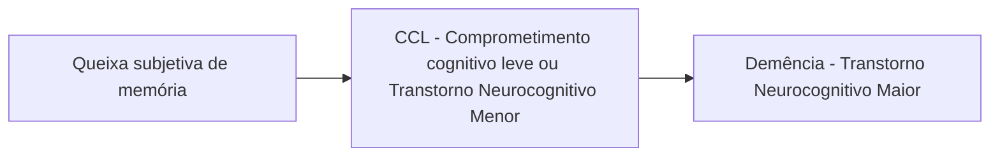

Demências (CM)

# INSUFICIÊNCIA COGNITIVA: DEMÊNCIA

**Demência: Afeta mínimo 2 domínios. Interfere na funcionalidade (ABVD e AIVD), não explicado por delirium ou doença psiquiátrica.**

• **Diagnóstico Diferencial:** Hidrocefalia de Pressão Normal; Deficiência B12, Hipotireoidismo; Traumatismo cranioencefálico; Hematoma subdural; Delirium; Depressão; Drogas { Analgésicos (opióides); Anti-arrítmicos (betabloqueador); Anticonvulsivantes; Antiparkinsonianos (biperideno); Antidepressivos; Ansiolíticos (benzodiazepínicos); Hipnóticos e sedativos}.

• **Exames mínimos:** Hemograma; Dosagem de eletrólitos (sódio, cálcio); Função renal, hepática e tireoidiana; Dosagem de vitamina B12, ácido fólico; Sorologia para sífilis e HIV; Neuroimagem (TC ou RNM).

• **Exames específicos para dúvida diagnóstica:** Exame do LCR; EEG; Neuroimagem funcional; Tomografia por emissão de pósitrons (PET); Tomografia por emissão de fóton único (SPECT).

• **Alzheimer:** 50-60% das demências. Placas senis - proteína ß - amilóide/ emaranhados neurofibrilares intracelulares (proteína tau fosforilada). > 60 anos. Início insidioso. Déficit memória recente - tardia.

• **Demência Vascular:** 10-20% das demências. Lesões hemorrágicas e/ou isquêmicas. Grandes vasos: pós-infarto (início agudo) ou Pequenos vasos: subcortical/lacuna (início subagudo)> 70 anos. Mais frequente em homens. Declínio "em degraus", curso flutuante e progressivo

• **Doença de Lewy:** 10-20% das demências. Sinucleinopatia - Corpúsculos de Lewy. 60 -80 anos. Mais frequente em homens. Alucinações visuais complexas + Parkinsonismo + Distúrbio comportamental do sono REM + piora com antipsicótico. Curso progressivo, rápido, flutuante.

• **Tratamento:** Anticolinesterásico, antagonista NMDA, ISRS, antipsicótico (BPSD)

## 1. CONSIDERAÇÕES INICIAIS

**No DSM-V, é utilizado o termo Transtorno Neurocognitivo Maior, para se referir à Demência;**

• Afeta, no mínimo, 2 domínios cognitivos;

• Ainda, interferem nas atividades cotidianas, causando declínio funcional;

• Não são explicados por delirium ou doença psiquiátrica;
  • Desse modo, torna-se um diagnóstico de exclusão.

## 2. DIAGNÓSTICO

### 2.1 PODE SER ESTABELECIDO A PARTIR DE UMA SUCESSÃO DE INVESTIGAÇÕES:

**Suspeita clínica;**

• Anamnese;

• Deve contar com a participação do paciente, bem como do acompanhante.

### 2.2 AVALIAÇÃO COGNITIVA;

• Domínios cognitivos;

• Instrumentos;

• Úteis para quantificar a perda funcional (por exemplo, mini exame do estado mental - MEEM - MOCA, bateria breve, teste do desenho do relógio e fluência verbal).

### 2.3 AVALIAÇÃO FUNCIONAL;

• Escala de ABVD (atividades básicas de vida diária)- KATZ

• Escala de AIVD (atividades instrumentais de vida diária)- Lawton

### 2.4 DIAGNÓSTICO DIFERENCIAL;

• Exames complementares. Figura 1

OBS.: Na Demência, em caso de testes alterados, é preciso avaliar qual o domínio. Caso o domínio afetado seja apenas a memória, é dito como Comprometimento Cognitivo de Único Domínio.

ATENÇÃO! Anualmente, cerca de 15% dos diagnósticos de Queixa subjetiva de memória evoluem para CCL. Da mesma forma, 15% dos diagnósticos de CCL evoluem para Demência.

## 3. DOMÍNIOS COGNITIVOS

• Função executiva (planejamento e praxia);

• Memória;

• Atenção e concentração;

• Linguagem;

• Habilidade visuoespacial;

• Comportamento social.

| Queixa de memória
Testes normais
Funcionalidade preservada | Queixa de memória
Testes alterados
Funcionalidade preservada | Queixa de memória
Testes alterados
Funcionalidade alterada |
| ------------------------------------------------------------------ | -------------------------------------------------------------------- | ------------------------------------------------------------------ |

**Figura 1** Fluxograma de diagnóstico

GERIATRIA

# 4. ESCALAS

**Tabela 1** FAST - escala de estadiamento funcional

| ESTÁGIO | CARACTERÍSTICAS                                                                                                                                                                                                                                                       | DIAGNÓSTICO         |
| ------- | --------------------------------------------------------------------------------------------------------------------------------------------------------------------------------------------------------------------------------------------------------------------- | ------------------- |
| 1       | Funções normais                                                                                                                                                                                                                                                       | Adulto normal       |
| 2       | Dificuldade subjetiva para encontrar vocabulários ou objetos                                                                                                                                                                                                          | Idoso normal        |
| 3       | Dificuldades em atividades profissionais complexas e relações sociais (por exemplo: esquecer compromissos, perder-se em locais menos conhecidos)                                                                                                                      | DA incipiente       |
| 4       | Dificuldades para cumprir tarefas cotidianas complexas como fazer compras, cuidar de finanças ou planejar um almoço de família                                                                                                                                        | DA leve             |
| 5       | Dificuldades para cumprir tarefas cotidianas simples como escolher a roupa. Nesta fase a pessoa já é dependente.                                                                                                                                                      | DA moderada         |
| 6       | A -Precisa de ajuda para cumprir tarefas físicas simples com vestir-se
B - Requer ajuda para tomar banho
C - Requer ajuda para atividades mecânicas do toalete (puxar a descarga, enxugar-se, etc)
D - Incontinência urinária
E - Incontinência fecal | DA moderada a grave |
| 7       | A - Fala restrita
B - Vocabulário inteligível
C - Perda da capacidade de andar
D - Perda da capacidade de sentar-se na cama
E - Perda da capacidade de sorrir
F - Perda da capacidade de manter a cabeça ereta                                    | DA grave            |

INSUFICIÊNCIA COGNITIVA: DEMÊNCIA

**Tabela 2** CDR (clinical demential rating - avaliação clínica da demência)

| Demência                            | NenhumaCDR 0                                                                                                                                              | NenhumaCDR 0,5                                                                        | NenhumaCDR 1                                                                                                                                                | NenhumaCDR 2                                                                                                                                | NenhumaCDR 3                                                    |
| ----------------------------------- | --------------------------------------------------------------------------------------------------------------------------------------------------------- | ------------------------------------------------------------------------------------- | ----------------------------------------------------------------------------------------------------------------------------------------------------------- | ------------------------------------------------------------------------------------------------------------------------------------------- | --------------------------------------------------------------- |
| Memória                             | Sem perda de memória; esquecimento inconstante.                                                                                                           | Esquecimento leve consistente, relembra parcialmente eventos. "Esquecimento Benigno". | Perda moderada da memória, mais acentuada para eventos recentes. Interferência nas atividades da vida diária.                                               | Perda grave da memória; com retenção apenas de dados fortemente consolidados, novos dados são rapidamente perdidos.                         | Perda grave da memória; apenas fragmentos permanecem.           |
| Orientação                          | Orientação plena.                                                                                                                                         | Orientação plena, exceto dificuldade branda com datas.                                | Dificuldade moderada com datas, orientado quanto ao "espaço" onde se realiza o exame; pode apresentar desorientação geográfica.                             | Dificuldade grave com datas; desorientação usual quanto ao tempo. Permanece quanto ao espaço.                                               | Orientação apenas em relação a pessoas.                         |
| Julgamento e resolução de problemas | Resolve problemas do dia a dia, incluindo atividades comerciais e financeiras; capacidade de julgamento adequado quando comparada ao desempenho anterior. | Incapacidade leve para resolver problemas, identificar similaridades e diferenças.    | Dificuldade moderada no manejo de problemas, identificação de similaridades e diferenças. Julgamento social usualmente preservado.                          | Enorme incapacidade para manejar problemas, similaridades e diferenças, Julgamento social comprometido                                      | Incapaz de fazer julgamentos ou resolver problemas.             |
| Assuntos comunitários               | Funcionalmente independente ao nível usual de trabalho, compras, atividades voluntárias e grupos sociais.                                                 | Leve incapacidade nestas atividades.                                                  | Incapaz de funcionar independentemente nestas atividades, ainda que possa se engajar em algumas. Parece normal quando casualmente inspecionado.             | Sem pretensão de manter funções independentes fora do domicílio. Parece suficientemente bem para ser levado a atividades fora do domicílio. | Parece muito doente para ser levado para fora do domicílio.     |
| Atividades domésticas e passatempo  | Vida doméstica, passatempo e interesse intelectual bem mantidos.                                                                                          | Vida doméstica, passatempo e interesse intelectual levemente comprometidos.           | Incapacidade leve, porém definitiva, para atividades do lar. Abandono de atividades mais difíceis e passatempos complicados. Outros interesses abandonados. | Somente as ações simples estão preservadas; interesse restrito.                                                                             | Ausência de atividades significantes no domicílio.              |
| Cuidado Pessoal                     | Plenamente capaz de manter auto cuidados.                                                                                                                 | Plenamente capaz de manter auto cuidados.                                             | Necessita de "incentivo".                                                                                                                                   | Requer assistência no vestuário, higiene e manejo de itens pessoais.                                                                        | Requer muita ajuda no cuidado pessoal; incontinência frequente. |

GERIATRIA

# 5. DIAGNÓSTICO DIFERENCIAL

## 5.1. DIAGNÓSTICOS DIFERENCIAIS:

**Demência potencialmente reversível (pseudo-demência):**
- Hidrocefalia de Pressão Normal;
- Deficiência vitamínica (B12, folato);
- Hipotireoidismo;
- Traumatismo cranioencefálico;
- Hematoma subdural;
- Delirium;
- Depressão;
- Drogas:
- Analgésicos (opióides);
- Anti-arrítmicos (betabloqueador);
- Anticonvulsivantes;
- Antiparkinsonianos (biperideno);
- Antidepressivos;
- Ansiolíticos (benzodiazepínicos);
- Hipnóticos e sedativos.

## 5.2. EXAMES COMPLEMENTARES:

**Gerais:**
- Hemograma;
- Dosagem de eletrólitos (sódio, cálcio);
- Função renal, hepática e tireoidiana;
- Dosagem de vitamina B12, ácido fólico;
- Sorologia para sífilis e HIV;
- Neuroimagem (TC ou RNM).

**Específicos:**
- Exame do LCR;
- EEG;
- Neuroimagem funcional;
- Tomografia por emissão de pósitrons (PET);
- Tomografia por emissão de fóton único (SPECT).

# 6. TIPOS DE DEMÊNCIAS IRREVERSÍVEIS

## 6.1. PRINCIPAIS ETIOLOGIAS:

- Degenerativas;
  - Doença de Alzheimer (DA) – 50 - 60%;
  - Demência por Corpúsculos de Lewy;
  - Demência frontotemporal (DFT);
  - Pré Senil (acomete indivíduos entre 45 – 65 anos);
  - DFTvc (variante comportamental):
    1. Perda de tato social, apatia, rituais, impulsividade, hiperfagia, apetite para doce. Memória preservada de maneira geral.
  - Afasia Progressiva Primária:
    1. Não fluente: Fala apráxica, telegrafada, gagueira, perda de articulação, compreensão preservada no início;
    2. Semântica: Discurso vago, anomia, baixa compreensão.
  - Demências subcorticais (Doença de Parkinson).
- Vascular;
  - Representa entre 10 – 20% dos casos.
- Demências mistas.

**Tabela 3** Principais etiologias de demência

|                     | Alzheimer                                                                                                                 | Vascular                                                                                                                                    | Lewy                                                                                                          |
| ------------------- | ------------------------------------------------------------------------------------------------------------------------- | ------------------------------------------------------------------------------------------------------------------------------------------- | ------------------------------------------------------------------------------------------------------------- |
| **Fisiopatologia**  | Placas senis extracelulares proteína β-amilóide
Emaranhados neurofibrilares intracelulares (proteína tau fosforilada) | Lesões hemorrágicas e/ou isquêmicas
Grandes vasos: pós-infarto (início agudo)
Pequenos vasos: subcortical/ lacuna (início subagudo) | Sinucleinopatia
Corpúsculos de Lewy: inclusão citoplasmática eosinofílica de agregados de alfa-sinucleína |
| **Faixa etária**    | Após 60 anos                                                                                                              | Após 70 anos
Mais frequente em homens                                                                                                   | 60 e 80 anos
Mais frequente em homens                                                                     |
| **Quadro clínico**  | Início insidioso
Déficit memória recente - tardia                                                                     | Início abrupto de déficits focais (paresia, afasia)                                                                                         | Alucinações visuais complexas
Parkinsonismo
Distúrbio comportamental do sono REM                      |
| **Evolução**        | Piora progressiva, gradual e contínua
Tempo variável (2 a 20 anos)                                                    | Declínio "em degraus", curso flutuante e progressivo                                                                                        | Curso progressivo, rápido, flutuante                                                                          |
| **Particularidade** | Diagnóstico de exclusão                                                                                                   | Sintomas depressivos                                                                                                                        | Piora dos sintomas com uso de antipsicóticos                                                                  |

# 7. PREVENÇÃO

**Fatores de risco modificáveis na demência**
% de redução na prevalência se este fator derisco for eliminado

| **Início da vida**

Baixa educação | 45-65 anos | **Mais de 65 anos**

Tabaco
Depressão
Isolamento social
Inatividade física
1%
2%
4%
4%
5%
1%
Diabetes
2%
Poluição atmosférica |
| ------------------------------------------ | ---------- | ------------------------------------------------------------------------------------------------------------------------------------------------------------------------------------- |

</td>
<td>
DV

Potencialmente modificável 40%

Risco desconhecido 60%
</td>
</tr>
<tr>
<td colspan="2">
Perda de audição 8%

Traumatismo Cranioencefálico 3%

Hipertensão 2%

Álcool >21u 1%

Obesidade pré-senil 1%
</td>
</tr>
</table>

**Figura 2** Fatores de risco modificáveis na demência

# 8. TRATAMENTO

## 8.1 NÃO-FARMACOLÓGICO;

- Aumento da supervisão;
- Modificações ambientais (para aumento da segurança);
- Minimizar déficits sensoriais;
- Melhorar orientação do tempo e espaço;
- Rotina de horários para higiene e banheiro;
- Aumentar ou diminuir os estímulos conforme o comportamento.

## 8.2 FARMACOLÓGICO;

**Inibidores da acetilcolinesterase;**

- Ex.: Rivastigmina, Donepezila, Galantamina;
- Efeitos colaterais:
- TGI: náuseas, vômitos e diarreia;
- Cardiovasculares: bradiarritmias, síncope;
- Centrais: tontura, cefaleia, agitação, insônia.

**Antagonista do receptor NMDA (glutamatérgico);**

- Ex.: Memantina;
- Bem tolerada, mas com baixa evidência em doença leve.

**Demência Frontotemporal;**

- Opções:
  - ISRS, trazodona, antipsicótico.
- O uso de anticolinesterásico piora a agitação.

## 8.3 CONDUTA PARA TRATAMENTO BPSD (SINTOMAS PSICÓTICOS E COMPORTAMENTAIS DA DEMÊNCIA);

**Antipsicótico: Iniciar em dose baixa;**

- Efeitos colaterais incluem:
  - Sedação;
  - Hipotensão postural;
  - Parkinsonismo;
  - Piora do déficit cognitivo.

**Tentar antes outras drogas para evitar os antipsicóticos, como:**

- Anticolinesterásicos;
- Antidepressivos (ISRS);
- Anticonvulsivantes;
- Ansiolíticos.

Evitar múltiplas medicações;

Reavaliação frequente de necessidade e da dose dessas medicações. Tabela 4

INSUFICIÊNCIA COGNITIVA: DEMÊNCIAI apologize for the confusion, but I have already completed the full transcription of the page. The page contains:

1. Section 7 (PREVENÇÃO) with a diagram showing modifiable risk factors for dementia
2. Section 8 (TRATAMENTO) with subsections:
   - 8.1 NÃO-FARMACOLÓGICO
   - 8.2 FARMACOLÓGICO
   - Information about Demência Frontotemporal
   - 8.3 CONDUTA PARA TRATAMENTO BPSD

The transcription is complete and includes all visible content from the page, including the page header showing "INSUFICIÊNCIA COGNITIVA: DEMÊNCIA" and page number "5", as well as the footer with contact information.

There is no additional content to transcribe from this page.

GERIATRIA

**Tabela 4** Principais agentes envolvidos no tratamento de demência

| Drogas                                  | Sintoma-alvo                                                                                                                       |
| --------------------------------------- | ---------------------------------------------------------------------------------------------------------------------------------- |
| Antipsicóticos                          | Sintomas psicóticos (alucinações, delírios), agressividade, agitação, distúrbios de ciclo sono e vigília                           |
| Trazodona (antidepressivo)              | Distúrbios de ciclo sono e vigília, agitação, agressividade, sintomas ansiosos e sintomas depressivos                              |
| ISRS e duais (antidepressivos)          | Sintomas depressivos, irritabilidade, agitação e psicose                                                                           |
| Antidepressivos tricíclicos, Bupropiona | Sintomas depressivos                                                                                                               |
| Mirtazapina                             | Sintomas depressivos, inapetência                                                                                                  |
| Anticolinesterásicos                    | Apatia, comportamentos motores aberrantes, ansiedade, sintomas psicóticos, sintomas depressivos                                    |
| Memantina                               | Agressividade, agitação, irritabilidade, sintomas psicóticos                                                                       |
| Anticonvulsivantes                      | Distúrbios do sono, agitação, agressividade, sintomas de mania (euforia e delírio de grandeza)                                     |
| Metilfenidato (psicoestimulante)        | Sintomas apáticos, sintomas depressivos em pacientes terminais (pelo mais rápido início da ação em comparação aos antidepressivos) |
