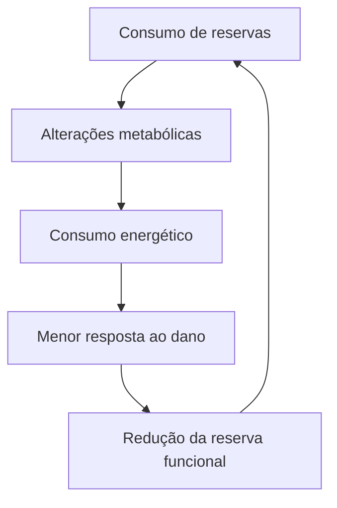
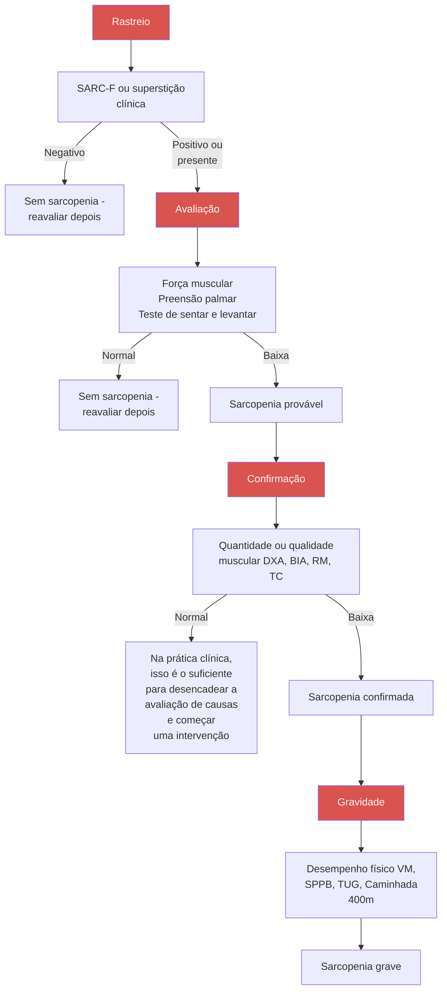

Fragilidade (CM)

# FRAGILIDADE

| **FRAGILIDADE**
• Perda da capacidade de adaptação aos fatores agressores.
**FISIOPATOLOGIA**
• Sarcopenia (perda de força e massa muscular)
+ Desregulação neuroendócrina + Alterações imunológicas.
• Critérios de Fried:
• ≥ 3 critérios = frágil; | • 1 ou 2 = pré-frágil;
• 0 = robusto.
**PREVENÇÃO E TRATAMENTO:**
• Exercício físico: Aeróbico + Resistido
• Vitamina D > 30
• Suporte calórico e proteico; 30 g de proteína em 3 refeições ao dia; De outro modo, 1,2 – 1,5 g de proteína/ kg/dia.). |
| ----------------------------------------------------------------------------------------------------------------------------------------------------------------------------------------------------------------------------------------------------------------------------- | ------------------------------------------------------------------------------------------------------------------------------------------------------------------------------------------------------------------------------------------------------------------------- |

## 1. CONSIDERAÇÕES INICIAIS

### 1.1. DEFINIÇÃO:

• Fragilidade pode ser dita como:
  • "Síndrome geriátrica resultante do declínio da reserva fisiológica, com consequente redução da resistência a fatores estressores e da capacidade de homeostase, com aumento da vulnerabilidade."
  • De outro modo, é a perda da capacidade de adaptação aos fatores agressores.

**Figura 1** Ciclo envolvido na síndrome de fragilidade

## 2. FISIOPATOLOGIA

• É marcada por três pontos fundamentais:
• **Sarcopenia (perda de força e massa muscular);**
  • Observa-se estresse oxidativo, disfunção mitocondrial, dano ao DNA e envelhecimento celular;
  • Sofre influência da variação genética e ambiental;
• Doenças inflamatórias;
• Inflammaging → condição própria do envelhecimento, que cursa com inflamação crônica, persistente, de pequena intensidade, contribuindo para a redução, ao longo do tempo, das reservas fisiológicas do idoso.

**Desregulação neuroendócrina;**
• Ocorre redução de
  • IGF-1;
  • S-DHEA e testosterona;
  • Albumina;
  • Colesterol;
  • Vitamina D – relacionada com a qualidade óssea e muscular;
  • Óxido nítrico. • Ainda, há aumento de:
• Ainda, há aumento de:
  • Cortisol e insulina em jejum.

**Alterações imunológicas;**
• Observa-se elevação de:
  • PCR;
  • IL-1;
  • IL-6;
  • TNF-alfa.

**Sarcopenia**

| Sarcopenia                     |                 |                            |   |   |
| ------------------------------ | --------------- | -------------------------- | - | - |
| Baixa velocidade
de marcha | **Fragilidade** | Baixa atividade
física |   |   |
| Perda de
peso              |                 | Fraqueza                   |   |   |
|                                | Fadiga          |                            |   |   |

| Desregulação
neuroendócrina                                                                | Alterações
Imunológicas |
| ---------------------------------------------------------------------------------------------- | --------------------------- |
| Anorexia
Sarcopenia
Osteopenia
Alteração cognitiva
**Alteração da coagulação** |                             |

**Figura 2** Fisiopatologia envolvida na síndrome de fragilidade

FRAGILIDADE

![Diagram showing a walking test setup with a person walking along a path. The path has an acceleration zone (2m), a timed walking section (4 or 10m), and a deceleration zone (2m). Markers and a stopwatch are indicated along the path.]

**Figura 4** Imagem representativa do teste de velocidade habitual

**Tabela 1** Testes diagnósticos realizados na síndrome de fragilidade

| Redução da força de preensão palmar | Abaixo do percentil da população, corrigido por gênero e índice de massa corporal                                |
| ----------------------------------- | ---------------------------------------------------------------------------------------------------------------- |
| Redução na velocidade de marcha     | Abaixo do percentil 20 da população, em teste de caminhada de 4,6 m, corrigido por gênero e estatura             |
| Perda de peso não intencional       | Acima de 4,5 kg ou 5% do peso corporal, se medido no último ano                                                  |
| Sensação de exaustão                | Autorreferida – questionário CES-D                                                                               |
| Atividade física baixa              | Abaixo do percentil 20 da população em Kcal/semana – Minnesota Leisure Time Activity Questionnaire, versão curta |

• Teste de velocidade habitual de marcha;
  • Solicita-se que o indivíduo ande uma distância de 4,6 metros (15 pés) com passos e velocidade habituais;
  • Pode-se usar dispositivo de auxílio de marcha (bengala, andador);
  • O procedimento deve ser realizado 3 vezes;
  • Velocidade de marcha < 0,8 m/s ou < p20 corrigido para gênero e estatura → "baixa velocidade de marcha".
• Timed Up and Go (TUG);
  • O teste de velocidade habitual de marcha e o Timed Up and Go são testes distintos.
  • Avalia risco de queda.
• Sensação de exaustão;
  • Nas últimas 2 semanas o(a) sr(a) sentiu que teve de fazer esforço para dar conta de suas atividades habituais? O(a) sr(a) conseguiu levar adiante suas atividades?
  • Interpretação:
  • > 3-4 dias com elevado esforço ou atividades incompletas, em 2 semanas = positivo.

## 3.2. CRITÉRIOS DE MINNESOTA:

• 42 questões, que abrangem atividades como caminhada, exercícios de condicionamento, esportes, atividades no jardim e horta, atividades de reparos domésticos;
• O idoso é questionado quanto à realização da atividade, a média de vezes que realizou a atividade nas duas semanas anteriores e o tempo em minutos por ocasião;
• Alto gasto energético, se:
  • > percentil 20 OU
  • > 383 kcal (para homens) ou > 270 kcal (para mulheres).

## 3.3. OUTRA ESCALA CLÍNICA DE FRAGILIDADE:

• Observe o mnemônico: "ROCKWOOD": **Figura 6**

## 3.4. DIAGNÓSTICO DIFERENCIAL:

• Fragilidade ≠ Incapacidade ≠ Comorbidades; **Figura 7**
• Fragilidade ≠ Sarcopenia;

![Two diagrams labeled A and B showing the "timed up and go" test. Diagram A shows a person standing, walking 3m, and returning to sit. Diagram B shows a similar setup with numbered positions (1-5) indicating the sequence of movements: standing, walking, turning, returning, and sitting.]

**Figura 5** Imagem representativa do teste de "timed up and go" ou "TUG" (teste de tempo)

GERIATRIA

## Escala Clínica de Fragilidade

**1. Muito Ativo** - Pessoas que estão robustas, ativas, com energia e são motivadas. Essas pessoas normalmente se exercitam regularmente. Elas estão entre as mais ativas para a sua idade.

**2. Ativo** - Pessoas que não apresentam nenhum sintoma ativo de doença, mas estão menos ativos que as da categoria 1. Ocasionalmente, são ativos ou muito ativos, por exemplo, ocasionalmente, exemplo: em determinada época do ano.

**3. Regular** - Pessoas com problemas de saúde bem controlados, mas não se exercitam regularmente além da caminhada de rotina.

**4. Vulnerável** - Apesar de não depender dos outros para ajuda diária, os sintomas frequentemente limitam as atividades. Uma queixa comum é sentir-se mais lento e/ou mais cansado ao longo do dia.

**5. Levemente Frágil** - Estas pessoas frequentemente apresentam lentidão evidente e precisam de ajuda para atividades instrumentais de vida diária (AIVD) mais complexas (finanças, transporte, trabalho doméstico pesado, medicações). Tipicamente, a fragilidade leve progressivamente prejudica as compras, preparo de refeições e acompanhados, preparo de refeições e tarefas domésticas.

**6. Moderadamente Frágil** - Pessoas que precisam de ajuda em todas as atividades externas e na manutenção da casa. Em casa, frequentemente têm dificuldades com escadas e necessitam de ajuda no banho e podem necessitar de ajuda mínima (apoio próximo) para se vestirem.

**7. Muito Frágil** - Completamente dependente para cuidados pessoais, por qualquer causa (física ou cognitiva). No entanto, parecem estáveis e com baixo risco de morte (dentro de 5 meses).

**8. Severamente Frágil** - Completamente dependentes, aproximando-se do fim da vida. Tipicamente incapazes de se recuperarem de uma doença leve.

**9. Doença Terminal** - Aproximando-se do fim da vida. Esta categoria se aplica a pessoas com expectativa de vida < 6 meses, sem outra evidência de fragilidade.

### Pontuando fragilidade em pessoas com demência

O grau de fragilidade corresponde ao grau de demência. Sintomas comuns na demência leve incluem esquecimento dos detalhes de um evento recente, apesar da recordação do evento em si, repetindo a mesma pergunta/história e afastamento de eventos sociais.

Na demência moderada, a memória recente está muito comprometida apesar de aparentemente lembrarem-se de fatos do passado. Quando solicitadas, elas são capazes de fazer o cuidado pessoal.

Na demência severa, elas não conseguem realizar cuidados pessoais sem ajuda.

**Figura 6** Escala clínica de fragilidade

| **Incapacidade
≥ 1 ABVD
n = 67** | **N = 196**

21,5%
N + 79

5,7%
N = 21 | **Comorbidades
N + = 2.131**

46,2%
N = 170 |
| ---------------------------------------- | -------------------------------------------------------------- | ----------------------------------------------------------- |
| **Fragilidade
N = 98
26,6%**     |                                                                |                                                             |

**Figura 7** Diagnósticos diferenciais da síndrome de fragilidade

ATENÇÃO! Atualmente, está validado o teste da circunferência da panturrilha, para confirmação da sarcopenia (desde que sem sinais de edema de membros inferiores).

• Fragilidade ≠ Fenótipo da fragilidade:
• No fenótipo da fragilidade, existem pacientes que não apresentam todas as características da síndrome da fragilidade, contudo ainda assim, pontuam em 3 critérios;
• Dessa forma, entende-se que o paciente preenche os critérios por conta de outra síndrome, que não a fragilidade;
• É o caso de algumas comorbidades, como por exemplo:
  • Demência;
  • Neoplasia;
  • Parkinson;
  • Insuficiência cardíaca;
  • DPOC.

FRAGILIDADE                                                                                                           5

## 4. PREVENÇÃO E TRATAMENTO

• O principal objetivo é o de evitar polifarmácia e promover o tratamento das comorbidades;

### 4.1 EXERCÍCIO FÍSICO;
• Aeróbico;
• Redução da fadiga;
• Melhora da capacidade cardiovascular.
• Resistido;
• Aumento da massa muscular e do equilíbrio.

### 4.2 VITAMINA D;
• Meta: > 30 ng/mL;
• Os níveis adequados estão relacionados com redução de quedas, e menor processo inflamatório.

### 4.3 SUPORTE CALÓRICO E PROTEICO;
• Objetivo: Manter 30 g de proteína em 3 refeições ao dia;
• De outro modo, 1,2 – 1,5 g de proteína/kg/dia.
• Se for necessário, suplementar HMB/Leucina (aminoácidos específicos);
• Em estudos mais recentes, observou-se uma melhora significativa do processo de recuperação muscular, inclusive em pacientes internados.

### 4.4 PONTOS CONTROVERSOS:
• Testosterona: aumenta risco cardiovascular; relacionado com neoplasia de próstata; estudos mostram aumento de massa, sem ganho de força.
• GH: diversos efeitos adversos;
• DHEA, estrógeno e progestágeno: risco > benefício;
• AINE: sem benefício;
• Creatina: pode ser positivo, se associado a exercício resistido.

**Figura 8** Rastreio de sarcopenia
