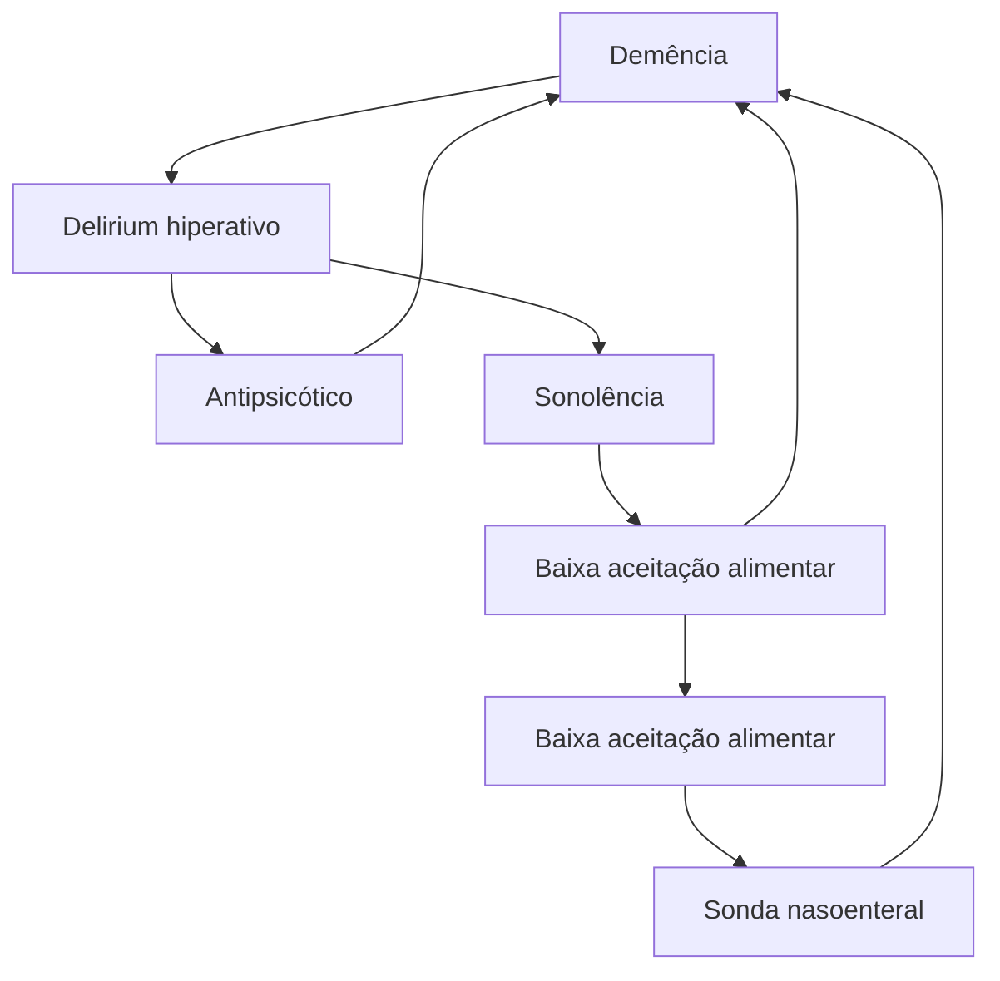
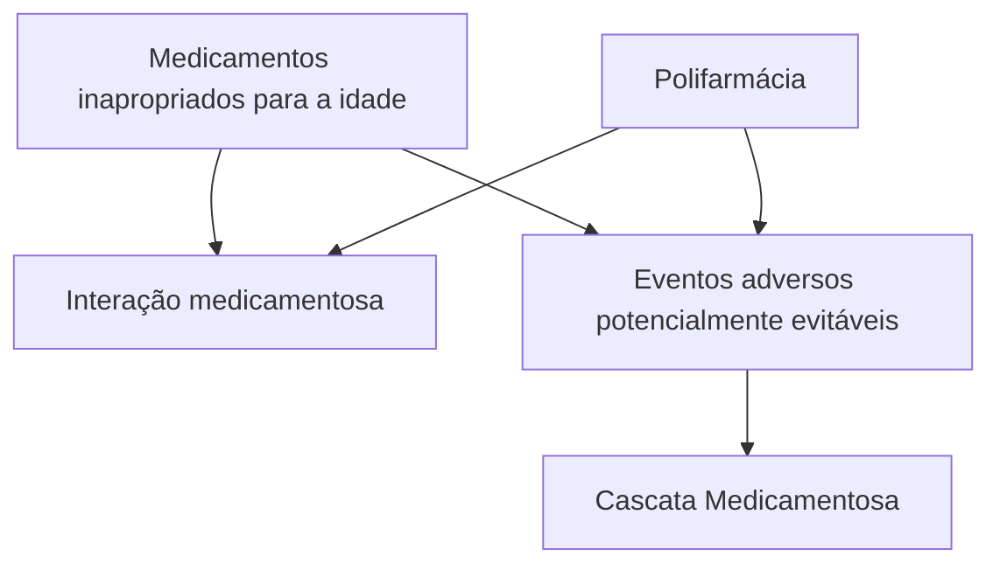

Escalas Geriátricas, Avaliação Global, fragilidade e Iatrogenias (CM)

# IATROGENIA NO IDOSO

## IATROGENIA:
* Procedimento, medicação e internação estão bem indicados. Contudo, ainda assim, o paciente evolui com complicações. {Diferente de "erro médico" ou infração (imperícia, imprudência, negligência)}.

## IATROGENIA TERAPÊUTICA:
* Reação adversa aos medicamentos (RAM): "qualquer efeito prejudicial ou indesejado que se manifeste após a administração do medicamento, em doses normalmente utilizadas no homem para profilaxia, diagnóstico ou tratamento de uma enfermidade";
* Polifarmácia: "uso de 5 ou mais medicamentos";
* Cascata Iatrogênica: "situação em que o efeito adverso de um fármaco é interpretado incorretamente como nova condição médica que exige outra prescrição, sendo o paciente exposto ao risco de desenvolver efeitos prejudiciais adicionais relacionados com o tratamento potencialmente desnecessário" (Secoli, 2010);

* Medicamentos inapropriados para o idoso: "medicamentos cujo uso deve ser evitado em idosos, uma vez que possuem um risco elevado de reações adversas para esta população e evidência insuficiente de benefícios, sendo que há uma alternativa terapêutica mais segura e tão ou mais eficaz disponível".

## PREVENÇÃO:
* Meios para avaliar interações medicamentosas: Micromedex, ePocrates, Medscape;
* Medidas fundamentais: diagnóstico correto; reavaliar diagnósticos antigos; atenção à inércia terapêutica; indicação (risco X benefício); avaliação do estado nutricional; avaliação da função hepática e renal;
* Medidas não farmacológicas;
* Start low, go slow, but go! Ao iniciar alguma medicação, prezar por doses baixas com avaliações subsequentes.

## 1. CONSIDERAÇÕES INICIAIS

* Kikuchi, 2009 → "Toda doença ou estado mórbido decorrente da intervenção do médico ou da equipe multidisciplinar, da qual resultem consequências prejudiciais à saúde do paciente";
* Etimologicamente: Iatros (médico) + genia (criação);
* Diferente de "erro médico" ou infração (imperícia, imprudência, negligência);
  * No caso da iatrogenia, procedimento, medicação e internação estão bem indicados. Contudo, ainda assim, o paciente evolui com complicações.

**Classificação:**
* Ocorrência;
  * Lesões por pressão;
  * Quedas;
  * Infecções hospitalares.
* Diagnósticos:
  * Colonoscopia;
  * Desidratação;
  * Hipotensão;
  * Insuficiência renal.
* Contraste endovenoso – paciente evoluiu com quadro de insuficiência renal, anafilaxia;
  * Tomografia;
  * Cateterismo.
* Terapêutica.

## 2. IATROGENIA TERAPÊUTICA

* Exemplos:
  * Cateter venoso → pneumotórax;
  * Medicação irritante → flebite;
  * Complicações perioperatórias → delirium, IAM, deiscência de ferida operatória.

## Reação adversa aos medicamentos – RAM:
* Segundo Kawano et al., 2006: "Qualquer efeito prejudicial ou indesejado que se manifeste após a administração do medicamento, em doses normalmente utilizadas no homem para profilaxia, diagnóstico ou tratamento de uma enfermidade."
* Atenção: RAM podem se apresentar como síndromes geriátricas/sintomas;
* Exemplos:
  * Confusão mental – por exemplo, uso de ciprofloxacino para incontinência urinária;
  * Incontinência urinária – uso de diuréticos para o tratamento de HAS;
  * Fraqueza excessiva – por exemplo, em quadros de dor miofascial, com inserção de relaxante muscular;
  * Alterações do sono – por exemplo, com introdução de medicamentos para demência, como a Donepezila;
  * Quedas – pelo uso de medicações anticolinérgicas;
  * Déficit cognitivo – escopolamina ou anti-alérgico.

**Tabela 1 Iatrogenia terapêutica: Medicamentos e Eventos adversos comuns.**

| Medicamento       | Eventos adversos comuns                                          |
| ----------------- | ---------------------------------------------------------------- |
| Insulina          | Hipoglicemia                                                     |
| Opioides          | Boca seca
Constipação
Retenção urinária
*Delirium*   |
| Diuréticos        | Desidratação Hiponatremia
Hipocalemia Incontinência urinária |
| Antipsicóticos    | *Delirium*
Sedação Hipotensão Movimentos
extrapiramidais |
| Benzodiazepínicos | Sedação excessiva *Delirium*
Quedas                          |
| Varfarina         | Sangramento gastrointestinal e
em sistema nervoso central    |

## Polifarmácia:
• Conceito clássico: **"uso de 5 ou mais medicamentos"**;
• Ainda pode ser descrito como "uso de pelo menos um medicamento potencialmente inapropriado" (MPI);
• ..."mais medicamentos usados do que clinicamente indicados".
• Prevalência:
  • 27 a 59% em pacientes ambulatoriais;
  • 46 a 84% em pacientes internados (Elmsthl; Linder, 2013).

## Cascata iatrogênica:
• "Situação em que o efeito adverso de um fármaco é interpretado incorretamente como nova condição médica que exige outra prescrição, sendo o paciente exposto ao risco de desenvolver efeitos prejudiciais adicionais relacionados ao tratamento potencialmente desnecessário." (Secoli, 2010).
• Exemplo:

**Figura 1** Fluxograma de Cascatas iatrogênica

Atenção! Outro exemplo com possível evolução clínica:

Hipertensão → Bloqueador de canal de cálcio → Edema da membros inferiores → Diurético de alça → Incontinência urinária secundária → Antiespasmódico urinário → *Delirium* ou alteração cognitiva.

## Medicamentos inapropriados para o idoso:
• "Medicamentos cujo uso deve ser evitado em idosos, uma vez que possuem um risco elevado de reações adversas para esta população e evidência insuficiente de benefícios, sendo que há uma alternativa terapêutica mais segura e tão ou mais eficaz disponível".

• Critérios de Beers:
  • Confira na página seguinte a **Tabela 2**
  • Consequência da prescrição medicamentosa inapropriada para idosos:

**Figura 2** Fluxograma de Iatrogenia no Idoso - tratamento medicamentoso.

## Prevenção:
I. Interação medicamentosa:
   • Meios para avaliar interações: Micromedex, ePocrates, Medscape.

II. Medidas fundamentais:
   • Diagnóstico correto:
     • Reavaliar diagnósticos antigos;
     • Atenção com inércia terapêutica.
   • Indicação (risco X benefício);
   • Avaliação do estado nutricional;
   • Avaliação da função hepática e renal;
   • Medidas não farmacológicas.

III. *Start low, go slow, but go!*
   • Ao iniciar alguma medicação, prezar por doses baixas com avaliações subsequentes.

IATROGENIA NO IDOSO<page_header>
IATROGENIA NO IDOSO

| SNC                                                                                                                        | SNC                                                                                                                                         | SNC                                                                                                                                    |
| -------------------------------------------------------------------------------------------------------------------------- | ------------------------------------------------------------------------------------------------------------------------------------------- | -------------------------------------------------------------------------------------------------------------------------------------- |
| Hipnóticos não benzodiazepínicos (Z)): eszopiclona, zolpidem                                                               | Eventos adversos similares a benzodiazepínicos, delirium, quedas, fraturas, maior hospitalização, sem melhora na latência e duração do sono | Evitar                                                                                                                                 |
| Sistema endocrinológico                                                                                                    |                                                                                                                                             |                                                                                                                                        |
| Andrógenos (testosterona)                                                                                                  | Problemas cardíacos, contraindicados em câncer de próstata                                                                                  | Evitar, exceto para hipogonadismo com sintomas clínicos                                                                                |
| Estrógenos com ou sem progesterona (oral)                                                                                  | Potencial carcinogênico (mama e endométrio) sem benefício cardio ou neuroprotetor                                                           | Evitar uso oral ou tópico. Creme é aceitável                                                                                           |
| GH                                                                                                                         | Edema, artralgia, túnel do carpo, ginecomastia, intolerância à glicose                                                                      | Evitar, exceto para pacientes com diagnóstico de deficiência de GH de etiologia conhecida                                              |
| Insulina (escala móvel)                                                                                                    | Grande risco de hipoglicemia sem melhora no controle                                                                                        | Evitar                                                                                                                                 |
| Megestrol                                                                                                                  | Mínimo efeito no peso e aumenta o risco de eventos trombóticos e morte em idosos                                                            | Evitar                                                                                                                                 |
| Sulfonilureias de longa duração: clorpropamida, glimepirida, glibenclamida                                                 | Risco de hipoglicemia prolongada em idosos                                                                                                  | Evitar                                                                                                                                 |
| Gastrointestinal                                                                                                           |                                                                                                                                             |                                                                                                                                        |
| Metoclopramida                                                                                                             | Efeitos extrapiramidais, discinesia tardia                                                                                                  | Evitar, exceto para gastroparesia por menos de 12 semanas                                                                              |
| Óleo mineral                                                                                                               | Broncoaspiração e efeitos adversos                                                                                                          | Evitar                                                                                                                                 |
| IBP                                                                                                                        | Risco de infecção por Clostridium difficile, osteopenia e fraturas                                                                          | Evitar uso >8 semanas exceto em casos de alto risco (uso crônico de corticosteroides e anti-inflamatórios), esofagite erosiva, Barrett |
| Dor                                                                                                                        |                                                                                                                                             |                                                                                                                                        |
| Meperidina                                                                                                                 | Neurotoxicidade, delirium                                                                                                                   | Evitar                                                                                                                                 |
| AINE: AAS, diclofenaco, etodolaco, ibuprofeno, cetoprofeno, ácido mefenâmico, meloxicam, naproxeno, piroxicam, fenoprofeno | Risco de sangramento gastrointestinal, úlcera péptica, aumento de pressão arterial e lesão renal                                            | Evitar uso crônico                                                                                                                     |
| Relaxantes musculares: carisoprodol, clorzoxazona, ciclobenzaprina, orfenadrina                                            | São mal tolerados em idosos: muito anticolinérgicos, sedação, risco de fraturas                                                             | Evitar                                                                                                                                 |
| Indometacina, cetorolaco                                                                                                   | Aumenta o risco de úlcera péptica e de sangramento gastrointestinal, lesão renal aguda, efeitos do SNC                                      | Evitar                                                                                                                                 |
| Geniturinário                                                                                                              |                                                                                                                                             |                                                                                                                                        |
| Desmopressina                                                                                                              | Alto risco de hiponatremia                                                                                                                  | Evitar uso para noctúria e poliúria noturna                                                                                            |

OBS.: em relação à desmopressina, alguns pacientes cujos casos são refratários requerem seu uso. Apesar disso, deve-se manter a dosagem o menor possível, com tempo limitado.
