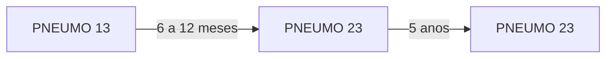
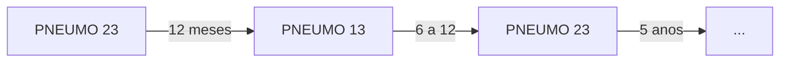

# VACINAÇÃO DO IDOSO

## VACINAS NO IDOSO:

* **Influenza**: anual. SUS (v3). Clínica privada (v4);
* **Covid**: 5 doses SUS;
* **Pneumo 13**: dose única. Clínica privada;
* **Pneumo 23**: 2 doses com intervalo de 5 anos:
  * SUS: asilados e grupo de risco apenas.

### 2.1. ESQUEMAS

**Ideal:**

**Figura 1** Ilustração: Esquema ideal - Pneumocócica 13 e 23

* **Herpes zoster**: shingrix (inativada) 2 doses com intervalo de 2 a 6 meses. Clínica privada. Ou zostavax (atenuada) dose única. Clínica privada.
* **Tríplice bacteriana**: (difteria, tétano e coqueluxe). Sus 3 doses (dtpa + 2 doses de dt no esquema 0 - 2 - 4 à 8 meses.) + Reforço a cada 10 anos (dtpa).
* **Hepatite b**: 3 doses no esquema de 0 – 1 – 6 meses. SUS.

## 1. INFLUENZA

* Deve ser aplicada de rotina;
  * Dose: única, anual.
* Indicada a pessoas maiores de 60 anos;
  * Motivo: risco aumentado de formas graves e óbito por influenza após os 60 anos.
* Esquemas:
  * 4V fornece maior cobertura que 3V;
  * 4V – clínica privada;
  * 3V – SUS.
* Em situações epidemiológicas de risco, é possível considerar uma segunda aplicação 3 meses após a aplicação da dose anual de rotina.

* Pelo Tratado de Geriatria e Gerontologia, Freitas: o rodízio vacinal da Pneumo 13 para Pneumo 23 pode ser realizado após 2 meses.
* Alternativo:

## 2. PNEUMOCÓCICA 13 E 23

* Deve ser aplicada de rotina;
* Dose:
  * Pneumo 13: dose única;
  * Pneumo 23: dose e reforço após 5 anos;
* Indicada a pessoas maiores de 60 anos.
* Esquemas:
  * Pneumo 13: clínica privada;
  * Pneumo 23: SUS, para indivíduos asilados e grupo de risco aumentado.

**Figura 2** Ilustração: Esquema Alternativo - Pneumocócica 13 e 23

* O intervalo entre as vacinas Pneumo 23 deve ter duração de 5 anos.
* Alternativo:

**Figura 3** Ilustração: Esquema Alternativo 2 - Pneumocócica 13 e 23

OBS.: de acordo com SBIM 2022, se a 2° dose de VPP23 foi aplicada antes dos 60 anos, está recomendada uma 3° dose após essa idade, com intervalo mínimo de 5 anos da última dose.

GERIATRIA

## 3. HERPES ZOSTER

• Deve ser aplicada de rotina:
  • Vacina atenuada (Zostavax): dose única;
  • Vacina inativada (Shingrix): 2 doses com intervalo de 2 a 6 meses.
• Indicada a pessoas maiores de 50 anos:
  • Motivo: reduz herpes zoster e neuralgia pós-herpética.
• A vacina inativada confere mais proteção e duração;
• Contraindicação:
  • A vacina atenuada está contraindicada para indivíduos imunossuprimidos. A inativada, mais moderna, pode ser administrada.
• Ambas as vacinas estão disponíveis apenas em clínicas privadas;
• Esquema vacinal:
  • Paciente com Herpes zoster → intervalo de 12 meses → vacina atenuada;
  • Paciente com Herpes zoster → 6 meses ou após resolução do quadro, considerando perda de oportunidade vacinal → vacina inativada;
  • Vacina atenuada → mínimo de 2 meses → vacina inativada.

## 4. TRÍPLICE BACTERIANA

• Atua contra difteria, tétano e coqueluche;
• Deve ser aplicada de rotina;
  • Vacina inativada.
• Indicada desde o primeiro ano de vida;
• Disponível no SUS;
• O reforço deve ser feito a cada 10 anos.

**Esquema vacinal:**
• Com o esquema de vacinação básico completo, o reforço deve ser realizado com dTPa a cada 10 anos;
• Com o esquema de vacinação básico incompleto:
  • dTPa a qualquer momento;
  • 1 ou 2 doses de dT (dupla bacteriana do tipo adulto), de modo a completar 3 doses de vacina que contêm o componente tetânico.
• Não vacinados e/ou histórico vacinal desconhecido:
  • dTPa + 2 doses de dT no esquema 0 – 2– 4 a 8 meses.

## 5. HEPATITE B

• Deve ser aplicada de rotina;
  • Vacina inativada.
• Indicada desde o primeiro ano de vida;

• Disponível no SUS;
• Se o paciente nunca tiver tomado, adquirir 3 doses no esquema de 0 – 1 – 6 meses.
  • Caso o paciente apresente anti-HBS compatível com imunização, não há necessidade de vacinação.

## 6. FEBRE AMARELA

• Indicada para idosos não vacinados previamente, após avaliação de risco/benefício;
• É uma vacina atenuada;
• Disponível no SUS;
• Dose única.

OBS.: de acordo com SBIM (2022), embora raro, está descrito o risco aumentado de eventos adversos graves na primo-vacinação de indivíduos maiores de 60 anos. Portanto, deve-se avaliar o risco/benefício da vacinação, considerando também o risco individual de infecção.

## 7. COVID

• Deve ser aplicada de rotina;
• Vacinas disponíveis:
  • CoronaVac (inativada);
  • AstraZeneca (recombinante);
  • Pfizer (RNA mensageiro);
  • Janssen (vetor viral).
• Disponível no SUS;

OBS.: Vide aula específica sobre COVID.

## 8. PNI (PROGRAMA NACIONAL DE IMUNIZAÇÃO)

• Hepatite B em 3 doses;
• Dupla adulto dT sendo um reforço a cada 10 anos;
• Influenza com doses anuais;
• COVID-19, número de doses ainda variável;
• Febre amarela em dose única (a depender da avaliação de risco);
• Pneumo 23 com reforço dependendo da situação vacinal anterior ou se faz parte de grupos de risco, como acamados ou moradores de instituições de longa permanência.
