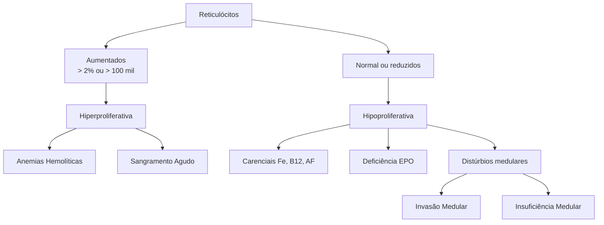

# ANEMIAS HEMOLÍTICAS: ADQUIRIDA

| **Anemia Hiperproliferativa = Pensar em hemólise e sangramento agudo!**
• Provas de Hemólise
• Reticulocitose, aumento de BI, aumento de DHL, consumo haptoglobina.
**Anemia Hemolítica Autoimune (AHAI)**
• Provas de hemólise positivas + coombs direto positivo (pode ter esferócitos na hematoscopia)
• Quente x Fria
• Quente: IgG - EXTRAvascular. Mais comum.
• Fria: IgM - INTRAvascular. Sistema complemento. Mais relacionada com infecções e neoplasias |   | • Tratamento de primeira linha: Corticoide
**Hemoglobinúria Paroxística Noturna (HPN)**
• Anemia hemolítica crônica adquirida (não imune)
• Deficiência na produção de marcadores fundamentais para que o sistema complemento não reconheça as nossas próprias células como estranhas
• Hemólise intravascular induzida pelo sistema complemento
• Tratamento:
• Inibidor do sistema complemento (Eculizumab)
• Transplante de Medula Óssea |
| ---------------------------------------------------------------------------------------------------------------------------------------------------------------------------------------------------------------------------------------------------------------------------------------------------------------------------------------------------------------------------------------------------------------------------------------------------------------------------------------------- | - | ----------------------------------------------------------------------------------------------------------------------------------------------------------------------------------------------------------------------------------------------------------------------------------------------------------------------------------------------------------------------------------------------------------------------------------------------------------------------- |

## 1.ERITROPOESE

• A eritropoiese se inicia na medula óssea, presente nos ossos longos em indivíduos adultos;

Quando a maturação da hemácia foi alcançada (ou ainda, com um pequeno percentual de reticulócitos), esta é destinada para a circulação periférica;

• Em condições normais de homeostase, a hemácia apresenta tempo médio de vida de cerca de 120 dias;

• Próximo ao fim de sua vida normal, tais células são reconhecidas pelos macrófagos do baço, sendo fagocitadas;

• O conteúdo do interior das hemácias é reciclado;

• O ferro é transportado através da transferrina e armazenado sob a forma de ferritina, no fígado e também é destinado para a medula óssea, no intuito de auxiliar na formação de novas hemácias;

• A bilirrubina indireta, produto da destruição das hemácias, é direcionada ao fígado, para conversão em bilirrubina direta, sendo excretada na forma de bile.

• A bile é excretada pelo intestino delgado, nas fezes; bem como também é excretada pelos rins, na urina.

Outro passo fundamental na eritropoiese é o estímulo advindo da eritropoetina (EPO), que é produzida pelos rins;

## 2.ANEMIA HEMOLÍTICA

### 2.1 QUANDO SUSPEITAR?

• Quando os níveis de reticulócitos estão aumentados, deduz-se que o quadro é constituído por um tipo de anemia hiperproliferativa;

• Assim, os principais representantes são as anemias hemolíticas e os sangramentos agudos Figura 1

### 2.2 CLASSIFICAÇÃO E ETIOLOGIAS:

• Hereditárias;
  - Defeitos de membrana: Esferocitose; Eliptocitose; Estomatocitose.
  - Defeitos enzimáticos: Deficiência de G6PD; Deficiência de PK – piruvato-quinase.
  - Defeitos da hemoglobina: Doença falciforme; Talassemia.

• Adquiridas;
  - Imune: Autoimune; Leucemia/linfoma; Drogas.
  - Aloimune: Transfusional; DHPN – doença hemolítica perinatal.
  - Não imune: Mecânicas (prótese valvar); Púrpura trombocitopênica trombótica (PTT) /Síndrome Hemolítico- Urêmica (SHU); Pré-eclâmpsia/ Síndrome HELLP; HPN.

• Infecções: malária

**Figura 1** Fluxograma demonstrando a importância dos reticulócitos na investigação do quadro de anemia. Quando eles estão aumentados (> 100 mil ou >2%) - Anemia hiperproliferativa. Ou quando estão normais ou diminuidos (<100 mil) - Anemia hipoproliferativa.

CLÍNICA MÉDICA

## 3.PROVAS DE HEMÓLISE

• A redução da massa eritróide, na medula saudável, provoca a compensação por parte da medula óssea. Ou seja, há um estímulo medular para que se aumente a produção de células vermelhas;
  • Tais células são liberadas na circulação periférica, mesmo que ainda estejam imaturas, na forma de reticulócitos → reticulocitose (> 2% ou > 100 mil);
  • Mas não se esqueçam que se houver anemia e for fornecido o valor de reticulócitos de forma relativa (ou seja, em porcentagem), devemos corrigir o valor de reticulócitos! Isso não é necessário quando é fornecido o número absoluto.
• Além disso, existe a hemoglobina livre no plasma! A hemoglobinemia pode levar a oxidação e provocar lesões endoteliais, para evitar que isso ocorra, a haptoglobina se liga à hemoglobina livre, ou seja, há o consumo da haptoglobina.
• A lesão da membrana provoca o aumento de DHL;
• E por fim, associado ao processo, também há o aumento de bilirrubina indireta, por este ser um dos componentes intracelulares da hemácia.
• Nos quadros de AHAI, ainda é possível complementar às provas de hemólise um novo critério → Coombs direto positivo!

| Reticulocitose
(2% ou 100 mil) | Consumo de
Haptoglobina             |
| ---------------------------------- | --------------------------------------- |
| Aumento de
DHL                 | Aumento de
Bilirrubina
Indireta |

**Figura 2** Provas de hemólise: reticulocitose, aumento de DHL, aumento de bilirrubina indireta e consumo de heptoglobina.

## 4.ANEMIA HEMOLÍTICA AUTOIMUNE - AHA

• Definição: Anemia hemolítica que ocorre devido à formação de autoanticorpos;
• Podem ser relacionadas aos anticorpos das classes IgG, IgM ou IgA;
  • 75 – 90% dos casos relacionadas com IgG;
  • A etiologia por IgA é bastante rara.
• Quente x Fria;
• Em cerca de 50% dos casos, a decorrência da anemia é secundária a...
  • Neoplasias;
  • Doenças auto-imunes – especialmente o LES;
  • Infecções – EBV, mycoplasma;
  • Drogas;
  • Imunodeficiências.

OBS.: As doenças linfoproliferativas estão intimamente associadas aos quadros de anemias hemolíticas autoimunes, especialmente a Leucemia Linfocítica Crônica (LLC).

OBS.: Na hematoscopia, pode haver a presença de esferócitos. Note que ocorre a perda da "palidez central" da hemácia.

**Figura 3** Hematoscopia demonstrando a presença de esferócitos, que são hemácias que perderam a sua palidez central e são menores do que as hemácias habituais. Eles são classicamente encontrados nas anemias hemolíticas e na esferocitose hereditária.

### AHAI quente ou AHAI fria;

• Quente:
  • Os auto-anticorpos da classe IgG se ligam aos eritrócitos;
  • As hemácias serão "marcadas" com este anticorpo para sua posterior destruição pelos macrófagos esplênicos (hemólise EXTRAvascular);
  • O processo é intensificado quando a temperatura corporal está entre 37-40 °C.
• Fria:
  • Os auto-anticorpos da classe IgM se ligam aos eritrócitos;
  • O auto-anticorpo da classe IgM desencadeia a resposta imune através da via alternativa do sistema complemento. É formado o complexo de ataque à membrana, cursando com diversos poros na superfície da hemácia. Assim, inicia-se o processo de lise da célula vermelha e, por consequência, de sua destruição.
  • Como boa parte do processo ocorre diretamente na corrente sanguínea, esse processo é reconhecido como "hemólise INTRAvascular";
  • Está intimamente relacionado a neoplasias e infecções.
  • É mais intenso quando a temperatura corporal está entre 0- 4°C.

## 5. O QUE FAZER DIANTE DE UM QUADRO DE ANEMIA HEMOLÍTICA?

### Diante de um paciente com anemia e provas de hemólise positivas, o primeiro passo é solicitar o "TAD" – teste da antiglobulina direta.

• O TAD também é conhecido como o Coombs Direto.
  • TAD positivo: AHAI por anticorpos quentes (IgG); AHAI por anticorpos frios (IgM – C3d).
  • TAD negativo: Considerar outras causas de hemólise (Mecânica; Hemoglobinopatias; Enzimopatias; Doenças de membrana). AHAI TAD negativo (5 – 10%); (Considerar quadro de AHAI por IgA; realizar teste do ELUATO.)

ANEMIAS HEMOLÍTICAS: ADQUIRIDA

Esquema demonstrando a realização do teste de Coombs direto

sangue do paciente

RBC do paciente revestido com anticorpo + AHG Aglutinação

Esquema demonstrando a realização do teste de Coombs direto

plasma do paciente revestido com anticorpo + RBG e AHG teste Aglutinação

**Figura 4** Esquema demonstrando a realização do teste de Coombs direto e do teste de coobs indireto.

• Relembrando o teste de Coombs direto – TAD;
  • É adicionado à amostra de sangue do paciente o "Soro de Coombs". Este soro apresenta anticorpos que reconhecem o auto anticorpo ligado à hemácia. Ao efetuar o reconhecimento, ocorre o processo de aglutinação.
• Relembrando o teste de Coombs indireto, espera-se encontrar anticorpos livres no soro (e não ligados à superfície da hemácia)
• Confira acima a **Figura 4**
• Como os resultados são interpretados?
  • Existem 3 métodos principais: o teste convencional por tubo, o método da microcoluna de gel e o método da fase sólida

Conventional Test Tube A

Gel Microcolumn method B

**Figura 5** Figura A: Teste convencional em tubo de ensaio demonstrando a aglutinação. Figura B: Teste em gel demonstrando aglutinação.

Revisando os conceitos mencionados até o momento!!
• IgG:
  • Anticorpo quente;
  • Opsonização;
  • Hemólise extravascular.
• IgM:
  • Anticorpo frio;
  • Ativação do sistema complemento;
  • Hemólise intravascular.
• Em relação às provas de hemólise usuais, para os quadros intravasculares, ainda é possível observar algumas outras alterações;
  • Intravascular: DHL aumentado; Haptoglobina reduzida; Reticulocitose; Hiperbilirrubinemia indireta; Hemoglobinemia; Hemoglobinúria; Hemossiderinúria.
  • Extravascular: DHL aumentado; Haptoglobina reduzida; Reticulocitose; Hiperbilirrubinemia indireta;

## 6. AHAI INDUZIDA POR DROGAS

• Apresenta o mecanismo mediado por fenômenos imunológicos;
• Mais de 150 medicações já foram descritas;
• Historicamente, as medicações mais comumente associadas são:
  • Metildopa;
  • Penicilinas.
• Atualmente, há prevalência está aumentando na associação com:
  • Ceftriaxona;
  • Piperacilina;
  • AINE.

## 7. TRATAMENTO

O manejo pode ser dividido em 3 linhas principais:
- 1° linha: Corticoide 1 – 2 mg/kg/dia;
- 2° linha: Rituximabe, imunoglobulina humana, micofenolato de mofetil, ciclofosfamida ou azatioprina;
- 3° linha: Esplenectomia.

## 8. HEMOGLOBINÚRIA PAROXÍSTICA NOTURNA

- É uma anemia hemolítica crônica adquirida;
- Decorre de um defeito na linhagem mielóide por mutação no gene PIG A;
  - O gene PIG A é responsável por codificar enzimas de membrana que regulam o sistema complemento, especialmente a GPI, que é responsável pela ancoragem dos marcadores CD55 e do CD59;
  - O CD55 e CD59 se localizam na superfície das hemácias e participam do reconhecimento das células como próprias do indivíduo. A função do CD55 é de prevenir a formação da molécula de C3 convertase. A função do CD59 é de bloquear a ligação da molécula de complemento C9, impedindo a formação do complexo de ataque à membrana.

**Relembrando alguns pontos-chave do sistema complemento;**

- É dividido, basicamente, em 3 vias:
  - Via clássica – diretamente relacionada com a presença de anticorpos;
  - Via alternativa – relacionada com endotoxinas bacterianas;
  - Via das lectinas.
- Esquematizando a via alternativa do sistema complemento;
  - O C3 circulante livre, no sangue, é hidrolizado → forma C3b + fator B;
  - O C3b forma o C3 convertase; C3 convertase é capaz de clivar o C5 → C5a e C5b. A molécula C5b livre no plasma é capaz de ancorar as demais moléculas C6, C7, C8 e C9, formando o complexo de ataque à membrana (MAC). Assim, é formado um poro na membrana da hemácia, promovendo a lise. Ainda, o C3 convertase é capaz de clivar o C3 → C3a e C3b. **Figura 6**
- Na HPN, o sistema complemento não é capaz de reconhecer as hemácias como "self ", desencadeando uma resposta maciça de hemólise intravascular;
- A maior parte da hemólise ocorre durante o dia → hemoglobinemia;
  - Desse modo, há o aumento da concentração urinária durante a noite (por isso tem noturna no nome!).

Quando suspeitar do diagnóstico?
- Deve ser considerado o diagnóstico diante de um quadro de:
  - Anemia hemolítica intravascular;
  - Tromboses;
  - Citopenias;

**Figura 6** Formação do complexo de ataque à membrana formado pelo sistema complemento.

Exames laboratoriais:
- Principais alterações:
  - Anemia com reticulocitose (hiperproliferativa);
  - Aumento do DHL;
  - Redução da haptoglobina;
  - Coombs direto negativo.
- Teste de HAM – teste de Hemolisina Ácida;
- Citometria de fluxo ou imunofenotipagem de sangue periférico – padrão-ouro.

Complicações associadas:
- Tromboses;
- Anemia ferropriva;
- Leucemia mieloide aguda.

Principais causas de óbito:
- Tromboses;
- Infecções.

Tratamento:
- Existem 2 terapias validadas para HPN no Brasil:
  - Inibidor do sistema complemento (Eculizumab). É um anticorpo monoclonal que impede a clivagem de C5 em C5b. Sendo assim, é capaz de impedir a formação da MAC – complexo de ataque à membrana.
  - Transplante de medula óssea – reservado aos casos refratários.
- Terapia de suporte: sulfato ferroso + ácido fólico;
- Não há benefício no uso de corticoide!

## 9. REVISANDO A HEMATOSCOPIA

- Observe as imagens abaixo, e tente identificar as células demonstradas e correlacionar cada uma com os respectivos quadros mais frequentes:

ANEMIAS HEMOLÍTICAS: ADQUIRIDA<page_header>
ANEMIAS HEMOLÍTICAS: ADQUIRIDA                                                                                                                                                                                                     5

**Figura 7** Esferócitos → relacionados com AHAI e esferocitose

**Figura 10** Dacriócitos (hemácias em lágrima) → relacionadas com mielofibrose.

**Figura 8** Codócitos (hemácias em alvo) → relacionadas com talassemias.

**Figura 11** Bite cells → relacionadas com a deficiência de G6PD.

**Figura 9** Drepanócitos (hemácias em foice) → relacionados com anemia falciforme

**Figura 12** Esquizócitos → relacionados com microangiopatia

# REFERÊNCIAS

**Figura 3** Hematoscopia demonstrando a presença de esferócitos, que são hemácias que perderam a sua palidez central e são menores do que as hemácias habituais. Eles são classicamente encontrados nas anemias hemolíticas e na esferocitose hereditária.

https://atlas.gechem.org/index.php?lang=es

**Figura 5** Figura A: Teste convencional em tubo de ensaio demonstrando a aglutinação. Figura B: Teste em gel demonstrando aglutinação.

Zantek, N.D., Koepsell, S.A., Tharp, D.R., Jr. and Cohn, C.S. (2012), The direct antiglobulin test: A critical step in the evaluation of hemolysis. Am. J. Hematol., 87: 707-709. https://doi.org/10.1002/ajh.23218

**Figura 7** Esferócitos → relacionados com AHAI e esferocitose

https://atlas.gechem.org/index.php?lang=es

**Figura 8** Codócitos (hemácias em alvo) → relacionadas com talassemias.

http://bmd-biomedicina3l.blogspot.com/2010/09/pecilocitose-eritrocitica.html

**Figura 9** Drepanócitos (hemácias em foice) → relacionados com anemia falciforme

https://hematologia.farmacia.ufg.br/p/7041-drepanocitos

**Figura 10** Dacriócitos (hemácias em lágrima) → relacionadas com mielofibrose.

https://www.oocities.org/br/betocosac/hematologia.htm

**Figura 11** Bite cells → relacionadas com a deficiência de G6PD.

https://openeducationalberta.ca/mlsci/chapter/abnormal-rbc-morphology-bite-keratocyte-blister-helmet-cell/

**Figura 12** Esquizócitos → relacionados com microangiopatia

https://vetclinpathimages.com/2018/02/16/schizocytes/
