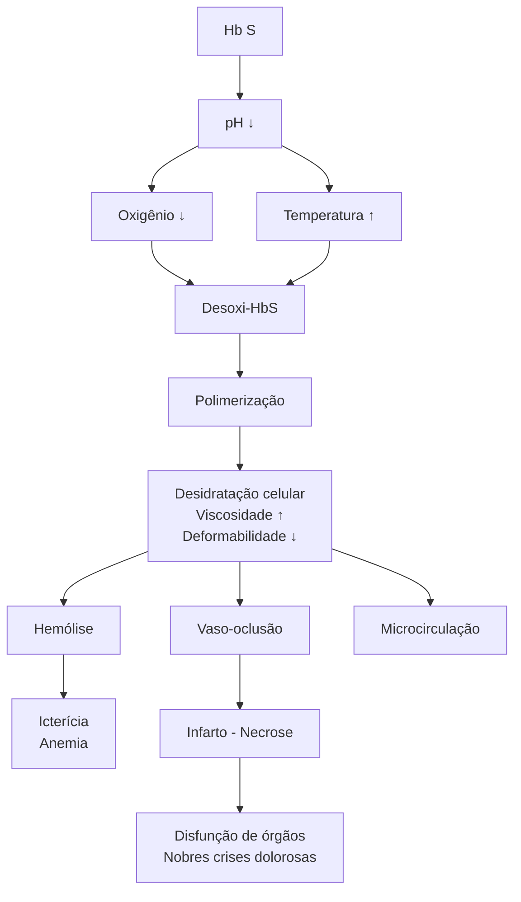
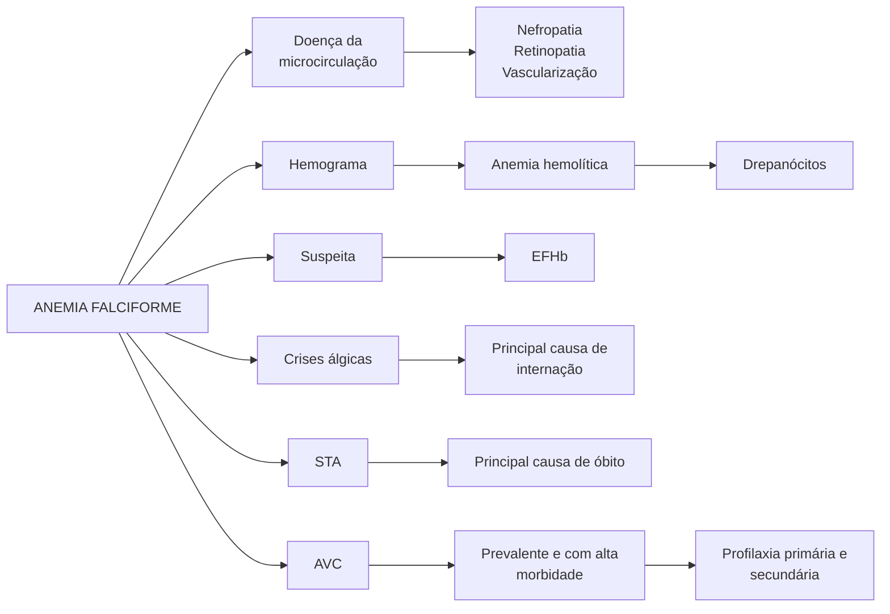
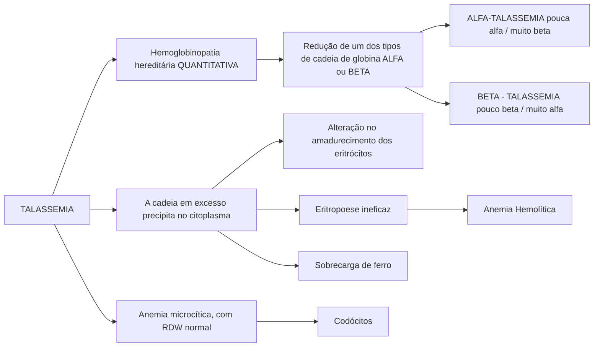

# ANEMIAS HEMOLÍTICAS: HEREDITÁRIAS

## Doença Falciforme
• Anemia hemolítica crônica hereditária. É a doença hereditária monogênica mais comum do Brasil
• Defeito qualitativo da hemácia
• Doença da microcirculação
• Principais complicações agudas:
  • Crise álgica → principal causa de internação
  • Síndrome torácica aguda → principal causa de óbito
  • Meta HbS < 30% (o mesmo para AVE)
  • Todos os pacientes merecem antibioticoterapia empírica (Cefalosporina de 3a geração + Macrolídeo – Ceftriaxona + Azitromicina)
  • S. Pneumoniae
  • Mycoplasma

## Talassemia
• Hemoglobinopatia hereditária quantitativa
  • Alfa-Talassemia → Pouca alfa e muita beta
  • Beta-Talassemia → Muita alfa e pouca beta

• Leva a uma eritropoese ineficaz → Hemólise intramedular
• Possui vários espectros

## Esferocitose
• Doença de membrana → Alteração no citoesqueleto da hemácia
• Formação de hemácias de formato esferocítico, pouco flexíveis e osmoticamente frágeis

## Deficiência de G6PD
• É a eritroenzimopatia mais comum do mundo
  • Ligada ao X
  • Mais comum em negros
• Deixa hemácia suscetível ao dano oxidativo/ radicais livres
  • Lembra de medicação, corpúsculos de Heinz e Bite-cells
  • Sulfonamidas
  • SMX+TMP
  • Dapsona
  • Nitrofurantoína).

## 1. HEMÓLISE

### 1.1 DEFEITOS INTRÍNSECOS DA HEMÁCIA
• Hemoglobinopatias
  • Doença Falciforme
  • Talassemias
• Doença de membrana
  • Esferocitose
• Eritroenzimopatias
  • Def. G6PD
  • Def. Piruvato-Kinase
  • Hemoglobinúria paroxística noturna
• Agressão à hemácia
• Imune
  • Anemia Hemolítica Autoimune (AHAI)
• Trauma
  • Microangiopatia trombótica (MAT)
• Venenos e toxinas
• Parasitas
  • Malária

## 2. HEMOGLOBINA

• HbA → 2 Cadeias Alfa + 2 Cadeias Beta + Grupo heme
• Normal (AA):
  • HbA 95-98%
  • HbS 0% → Não deve ser visto em exame de paciente saudável
  • HbA2 2-3%
  • HbF < 2%

## 3. ANEMIA FALCIFORME

### 3.1 HEMOGLOBINA S
• **Doença monogênica**
  • Troca de uma Valina por Ácido glutâmico na posição 6 da subunidade B da globina (Cromossomo 11)
  • Origem a Hemoglobina S
• **Doença Falciforme**
  • Heterozigotos compostos
  • HbSC
  • HbSb → Associação de Doença Falciforme + Talassemia
• **Homozigoto – Anemia Falciforme!**
  • HbSS
  • Herança autossômica recessiva
  • Drepanócitos

**Figura 1** Hematoscopia demonstrando a presença de drepanócitos (hemácias em foice), característico de anemia falciforme.

## 3.2 ELETROFORESE DE HEMOGLOBINA

### Traço Falciforme (AS)
- HbA 50-60% → Necessário para manter a homeostase
- HbS 35-45%
- HbA2 < 3,5%
- HbF < 2%
- Geralmente não vão apresentar clínica de anemia falciforme

### Anemia Falciforme (SS)
- HbA 0%
- HbS 85-95%
- HbA2 < 3,5%
- HbF 5-15%

### Doença Falciforme
- Anemia hemolítica crônica e hereditária
- Defeito QUALITATIVO da hemoglobina → Levam a Hemólise e vaso-oclusão
- Doença de MICROcirculação

**Figura 2** Fisiopatologia da falcização da hemoglobina S.

Hemólise → leva à redução do consumo de óxido nítrico, levando a vasoconstricção e processo de remodelamento vascular. Além disso, as citocinas pró-inflamatórias levam ao recrutamento de neutrófilos que também auxilia no processo de remodelamento vascular. As principais apresentações clínicas relacionadas à redução do consumo de óxido nítrico são a hipertensão arterial pulmonar (HAP), úlceras de pele (em especial maleolares), priapismo e AVC.

Os fenômenos de vaso-oclusão levam principalmente a crises dolorosas, Síndrome torácica aguda e osteonecrose da cabeça do fêmur e punho

## 3.3 QUANDO SUSPEITAR?
- Anemia + Drepanócitos na hematoscopia
- História familiar positiva → geralmente tem algum familiar que possui doença falciforme, mesmo que os pais não saibam (possuam somente traço falciforme)
- Marcadores de hemólise
  - Bilirrubina indireta
  - DHL
  - Consumo de haptoglobina
  - Reticulocitose
- Suspeita → Eletroforese de hemoglobina
- Desde os anos 2000, é feita triagem para doença falciforme no teste do pezinho

## 3.4 POSSUI MANIFESTAÇÕES AGUDAS E CRÔNICAS
- Entre as agudas, as principais são as crises álgicas, síndrome torácica aguda (STA), priapismo, AVC
- Entre as crônicas, a doença renal e a retinopatia são importantes.

## 3.5 CRISE ÁLGICA
- Causa mais comum de procura ao hospital
- Isquemia tecidual
- Hipóxia
- Acidose
- Ocorre devido a vaso-oclusão dos pequenos vasos

## 3.6 MANIFESTA-SE ATRAVÉS DE DOR
- Óssea → Principal
- Abdominal
- Hepática

## 3.7 DESENCADEANTES
- Infecção
- Acidose
- Desidratação
- Frio → As crises são mais frequentes no inverno
- Hipóxia → Pacientes que viajam para locais de grande altitude podem ter crise álgica desencadeada pela hipoxemia

## 3.8 MANEJO
- Hidratação (SF0,9%) → Principal medida (visar até hiperhidratação)
- Descartar outras complicações associadas, em especial STA

ANEMIAS HEMOLÍTICAS: HEREDITÁRIAS

**Figura 3** Fisiopatologia envolvida na doença falciforme.

• Visa diminuir a viscosidade sanguínea e a vaso-oclusão
• Analgesia escalonada (incluindo opióides) → quebrar o ciclo vicioso da perpetuação da dor
• Oxigenoterapia → Se SatO2 =< 92%
• Investigar e tratar o fator desencadeante
• Nem todos os casos precisarão de transfusão → Trial mostrou que não houve diferença entre transfundidos e não transfundidos quanto dias de hospitalização, tempo para controle de dor e quantidade de opióides usada

**Figura 4** Complicações agudas e crônicas mais comuns na Doença Falciforme

## 4. SÍNDROME TORÁCICA AGUDA (STA)

• Pelo menos 50% dos pacientes terão pelo menos 1 episódio durante a vida
• Mais frequente em crianças → pico entre 2 a 4 anos

### 4.1 FATORES DE RISCO
• HbF menor → HbF protege a hemácia do fenômeno de polimerização
• Presença de outras comorbidades
• Inverno

### 4.2 GATILHOS/TRIGGERS
• Identificados em 50% dos casos
Infecção > Infarto pulmonar > embolia gordurosa
• Principais agentes relacionados
• S. Pneumoniae
• Mycoplasma
• Vírus respiratórios

### 4.3 DIAGNÓSTICO
• Imagem pulmonar nova + um dos abaixo:
• Febre → Tax >= 38,5°C
• Queda da SatO2 > 3%
• Taquipneia
• Esforço respiratório
• Dor torácica
• Tosse
• Sibilos
• Estridor respiratório

## 4.4 MANEJO
• Controle álgico e monitorização
• Suporte ventilatório:
  • O2 suplementar
  • VNI
  • IOT
• Antibioticoterapia → Para todos os pacientes
  • Macrolídeo + Cefalosporina de 3a geração
  • Monoterapia: Fluoroquinolona de 4a geração (moxifloxacino)
• Considerar transfusão:
  • PaO2 < 70 mmHg
  • Queda de 25% do nível basal de PaO2
  • ICC ou IC direita aguda
  • Pneumonia rapidamente progressiva
  • Acentuada dispneia com taquipneia
  • Em geral, Hb alvo de 10

## 4.5 TRANSFUSÃO SIMPLES OU DE TROCA?
• **Simples:**
  • Mais Volume
  • Aumenta viscosidade do sangue
  • Lento
• **Troca**
  • Pouco volume
  • Não aumenta viscosidade
  • Rápido
  • Método de escolha devido a esses benefícios
  • Alvo HbS < 30%
• Manejo hídrico: hidratar, mas com cautela
• Profilaxia antitrombótica

## 4.6 AVC
• 11% dos pacientes terão AVE até os 20 anos e 25% até os 45 anos
• A idade do 1º evento e incidência cumulativa varia de acordo com o genótipo
• Crianças → Mais isquêmico
• Adultos → Mais hemorrágico

## 4.7 MANEJO
• Avaliação imediata por médicos com experiência em AVC e gerenciamento de doença falciforme
• O2 suplementar para SatO2 > 95%
• Proteção das vias aéreas, testes laboratoriais basais e neuroimagem
• Precauções para minimizar o choro e a hiper-ventilação

## 4.8 EVITAR:
• Hipotensão
• Hipovolemia
• Hipertermia
• Hiperglicemia
• Hipocarbia

## 4.9 CONTROLE DA PA
• Identificação e tratamento de infecção concomitante, com antipiréticos se houver febre

• Transfusão simples urgente para reduzir HbS e elevar Hb para 10g/dL, mas não mais que isso
• Transfusão de troca para HbS < 30% → Independente de Hb

## 4.10 PROFILAXIA
• 70-90% tem recorrência se não houver diminuição da HbS
• **Primária**
  • STOP Trial: Transfusão crônica em crianças com fator de risco
  • Doppler transcraniano (Vel Fluxo > 200cm/s)
• **Secundária**
  • SWITCH Trial
  • HbS < 30%

## 4.11 CRISES ANÊMICAS
• **Sequestro Esplênico**
  • Hemácias ficam represadas no baço → URGÊNCIA
  • Esplenomegalia
  • Reticulocitose
  • Hidratação e transfusão de hemácias → Geralmente causa hipovolemia
  • Risco em crianças → Maior risco aos 2 anos
  • Após os 5 anos, esses pacientes em geral cursam com autoesplenectomia
• **Crise Aplástica**
  • Infecção pelo Parvovírus B19 é a principal causa
  • Sem esplenomegalia
  • Reticulocitopenia
  • Suporte Clínico → Recuperação dentro de 2 a 14 dias (transitório)
• Diferencial entre elas se dará a partir dos reticulócitos e da esplenomegalia

# 5. TALASSEMIAS

• Thalassa (mar) + Emas (sangue) → Inicialmente descrita em pacientes de países banhados pelo mar mediterrâneo (Itália, Grécia)

## 5.1 HEMOGLOBINOPATIA HEREDITÁRIA QUANTITATIVA
• Redução de algum dos tipos de cadeia de globina → Alfa ou Beta
• Alfa-talassemia → Pouco alfa/ Muita beta
• Beta-talassemia → Muito alfa/ Pouca beta

## 5.2 A CADEIA EM EXCESSO PRECIPITA NO CITOPLASMA
• Alteração no amadurecimento dos eritrócitos
• Eritropoiese ineficaz → Hemólise intramedular
• Anemia Hemolítica
• Sobrecarga de ferro
• Anemia microcítica, hipocrômica com RDW normal → Em geral VCM < 70 fL
• Eletroforese de Hb -> HbA2 > 3,5% (!!!) → Marco da talassemia

ANEMIAS HEMOLÍTICAS: HEREDITÁRIAS

## Talassemia

**Figura 5** Fluxograma dos principais pontos relacionados às Talassemias.

- Hemólise no baço (extravascular)
- Permanências das inclusões tóxicas
- Destruição do precursor ainda na MO (Hematopoiese Ineficaz)
- Formação de inclusões tóxicas
- Diminuição da síntese de hemoglobina A
- Acúmulo da cadeia produzida em excesso
- Formação de tetrâmeros insolúveis no plasma

**Figura 6** Hematoscopia evidenciando células em alvo (codócitos), frequentemente encontrados em pacientes com talassemia.

## 5.3 ESPECTROS CLÍNICOS

### Beta-talassemia
- Beta/Beta → Pessoa normal
- Beta0/Beta0 e Beta+/Beta0 → Beta-talassemia Major
- Beta+/Beta+ → Beta-talassemia intermedia
- Beta0/Beta e Beta+/Beta → Beta-talassemia minor
- Beta → Cadeia beta normal
- Beta+ → Redução na produção
- Beta0 → Não produz

### Alfa-talassemia
- αα/αα → 4 genes funcionantes, pessoa normal
- - - / - - → Perda dos 4 genes, incompatível com a vida. Hemoglobinopatia de Bart, produção de 4 cadeias Gama
- α - / - - → Perda de 3 dos 4 genes. Doença da hemoglobina H, produção de 4 cadeias beta
- α - /α - ou αα/- - → Perda de 2 dos 4 genes. Alfa-talassemia Minor
- α - / αα → Perda de 1 dos 4 genes. Alfa-talassemia mínima

## 5.4 MANIFESTAÇÕES CLÍNICAS

### Beta-talassemia Major
- Anemia grave com dependência transfusional
- A partir dos 6 meses de vida
- Icterícia
- Hemólise crônica
- Baixa estatura, disfunções endocrinológicas
- Hepatoesplenomegalia
- Alterações ósseas → Hematopoiese extramedular Fácies em esquilo

### Beta-talassemia Intermédia
- Maioria com esplenomegalia e expansão óssea
- Hb entre 8 e 10 g/dL → Piora em caso de infecções, trauma etc
- Sobrecarga férrica
- Crescimento e desenvolvimento preservados
- Maior risco trombótico em alguns estudos
- Transfusão em situações de risco ou alta demanda (Gestação)

## 5.5 MODELO ATUAL: TALASSEMIA
- COM dependência transfusional
- SEM dependência transfusional

## 5.6 DIAGNÓSTICO: ELETROFORESE DE HEMOGLOBINA

### Na Beta-talassemia:
- AUMENTO de HbA2
- AUMENTO de HbF
- REDUÇÃO de HbA

### Pistas de prova:
- História familiar
- Descendência mediterrânea
- Anemia microcítica assintomática

## 5.7 ALFA-TALASSEMIA
- Depende do espectro da doença

### Hemoglobina Bart (- - / - - )
- Não produz cadeia alfa → Não forma HbF
- Hidropsia fetal → Incompatível com a vida extrauterina
- Transfusões intrauterinas → Muito raro. Em geral evoluem com óbito fetal.

### Doença da Hemoglobina H (α - / - - )
- Clínica variável:
- Anemia moderada
- Icterícia
- Esplenomegalia
- 70% tem complicações relacionadas à hematopoiese extramedular e eritropoiese ineficaz → Expansão de ossos longos, dores, malformações ósseas

### Alfa-talassemia minor (α - /α - ou αα/- -)
- Anemia leve, hipocrômica, microcitose → maior parte dos casos

### Alfa-talassemia mínima (α - / αα)
- Carregador silencioso
- Assintomáticos, discreta hipocromia

### Diagnóstico
- Eletroforese de Hb na minor é NORMAL
- Teste genético é o exame padrão ouro

### Tratamento
- Transfusão crônica
- Quelação de ferro → sobrecarga de ferro cursa com diversas repercussões orgânicas (cardiopatia, hepatopatia, diabetes, etc)

• Ácido fólico (pela hemólise crônica)
• Esplenectomia (se aumento de necessidade transfusional)
• Transplante de medula óssea
• Terapia Gênica → Medicação que altera o gene para produção de Hb normal

## 6. ESFEROCITOSE

• Alteração no citoesqueleto da hemácia
• Perde sua forma e flexibilidade
• Redução da sobrevida das hemácias: Hemólise extravascular
• Hemácias esferocíticas, pouco flexíveis e osmoticamente frágeis
• Maioria é autossômica dominante (75% dos casos)

### 6.1 CLÍNICA HETEROGÊNEA

• 20-30% leves → Compensação medular adequada para impedir anemia importante
• 60-70% Moderados
  • Esplenomegalia
  • Icterícia
  • Anemia ainda na infância
• 5% Graves
  • Anemia ameaçadora, com necessidade transfusional

### 6.2 DIAGNÓSTICO

• **Clínica**
  • Hemólise crônica
  • Esplenomegalia
  • Microesferócitos na hematoscopia
• Anemia com VCM normal ou pouco baixo e CHCM ALTO
• TAD (coombs direto) negativo
• **Teste de fragilidade osmótica**
  • Sensibilidade 68%
  • Curva desvia para a direita → hemolisou mais cedo que o esperado no teste
• **Eosina-5-maleimida (EMA)**
  • Sensibilidade 93%

**Figura 7** Teste de fragilidade osmótica evidenciado a curva desviada para a direita, característica em pacientes com Esferocitose.

The graph shows osmotic fragility test results with two curves (Controle - solid line, Paciente 16 - dotted line) plotting % de Hemólise (y-axis, ranging from -20 to 120) against Tubos de Reação (x-axis, ranging from 0 to 11). The patient curve is shifted to the right compared to the control curve, with an arrow indicating this deviation.

### 6.3 TRATAMENTO

• **Nas formas mais graves**
  • Suporte transfusional + Quelação do ferro
  • Reposição de ácido fólico → Hemólise crônica
  • Esplenectomia nos pacientes sintomáticos
  • Após os 5 a 10 anos de idade
  • Vacinação para encapsulados (pneumococo, meningococo, H. influenzae tipo B) - pelo menos 2 semanas antes da cirurgia
  • Profilaxia com Pen V oral após

## 7. DEFICIÊNCIA DE G6PD

• Eritroenzimopatia mais comum
• Mais comum em negros
• Transmissão hereditária ligada ao X (mais em homens)
• Hemácia não possui mitocôndria → metabolismo anaeróbico → dependem da enzima G6PD
• **Precipitação de Hb no interior das hemácias**
  • Corpúsculos de Heinz
  • Hemólise (principalmente intravascular)
  • Hemólise extravascular → Byte cells

**Figura 8** Hematoscopia evidenciado a presença de hemácias com inclusões citoplasmáticas tipo Corpúsculos de Heinz.

The microscopy image shows red blood cells with intracellular inclusions (Heinz bodies) appearing as small dark spots within some of the cells.

**Figura 9** Hematoscopia evidenciando hemácias fragmentadas tipo "Bite Cells".

The microscopy image shows red blood cells with characteristic "bite" defects, appearing as cells with portions removed, indicated by arrows in the image.

ANEMIAS HEMOLÍTICAS: HEREDITÁRIAS

## 7.1 DEFICIÊNCIA DE G6PD

• Enzima eritrocitária → prevenção de dano celular pelos radicais oxidativos
• Falha na geração de NADPH → Níveis insuficientes de glutamina → Hemácia suscetível a oxidação da Hb por radicais livres
• **Situações que aumentam estresse oxidativo**
  • Infecção
  • Drogas
  • Antimaláricos → Primaquina
  • Sulfonamidas → Sulfametoxazol
  • Sulfonas → Dapsona
  • Nitrofurantoína
  • Antipiréticos/analgésicos
  • Outros → Naftaleno

## 7.2 DIAGNÓSTICO

• Dosagem da atividade enzimática

## 7.3 TRATAMENTO

• Não há tratamento específico
• Medida terapêutica mais importante é a prevenção
• **Condutas diante da hemólise**
  • Suporte clínico
  • Suspender medicação suspeita
  • Hemotransfusão em casos graves
  • Hidratação
• Auto-limitada (5 a 6 dias)

**Tabela 1** Medicamentos que desencadeiam crise hemolítica em DG6PD

|                                | Associação Definida                                                         | Associação Possível                                                          | Associação Duvidosa                              |
| ------------------------------ | --------------------------------------------------------------------------- | ---------------------------------------------------------------------------- | ------------------------------------------------ |
| **Antimaláricos**              | Primaquina, Pamaquine                                                       | Cloroquina                                                                   | Quinina. Mepacrina                               |
| **Sulfonamidas**               | Sulfametoxazol, sulfanilamida, sulfacetamida, sulfapiridina                 | Sulfadimidina, sulfassalazina, glibenclamida                                 | Aldesulfone, sulfadiazina, sulfafurazole         |
| **Sulfonas**                   | Dapsona                                                                     |                                                                              |                                                  |
| **Nitrofurantoína**            | Nitrofurantóina                                                             |                                                                              |                                                  |
| **Antipiréticos/ analgésicos** | Acetanilida                                                                 | Aspirina                                                                     | Paracetamol, fenacetin                           |
| **Outros**                     | Cotrimoxazol, ácido nalidíxico, fenazopiridina, azul de metileno, naftaleno | Ciprofloxacino, cloranfenicol, mesalazina, ácido ascórbico, análogos de vitK | Doxorubicina, probenecida, ácido aminosalicílico |

## 8. TAKE HOME MESSAGES

**Figura 10** Fluxograma de anemia falciforme.

HEMATOLOGIA

• AVC e STA → Alvo HbS < 30%

**Figura 11** Fluxograma de talassemia.

**Esferocitose Hereditária**

É a **principal causa de anemia hemolítica** não imune por defeito de membrana do eritrócito

**Deficiência de G6PD**

Distúrbio hereditário causado por um defeito enzimático **mais comum nas hemácias**, seguido pela deficiência de PK

# REFERÊNCIAS

**Figura 1** Hematoscopia demonstrando a presença de drepanócitos (hemácias em foice), característico de anemia falciforme.

https://hematologia.farmacia.ufg.br/p/7041-drepanocitos

**Figura 6** Hematoscopia evidenciando células em alvo (codócitos), frequentemente encontrados em pacientes com talassemia.

http://bmd-biomedicina3l.blogspot.com/2010/09/pecilocitose-eritrocitica.html

**Figura 8** Hematoscopia evidenciado a presença de hemácias com inclusões citoplasmáticas tipo Corpúsculos de Heinz.

https://biolider.com.br/wp-content/uploads/2021/01/H_HEINZ-CORPUSCULOS-DE.pdf

**Figura 9** Hematoscopia evidenciando hemácias fragmentadas tipo "Bite Cells".

https://wchcmr.org/2022/05/22/image-challenge-may-22-2022
