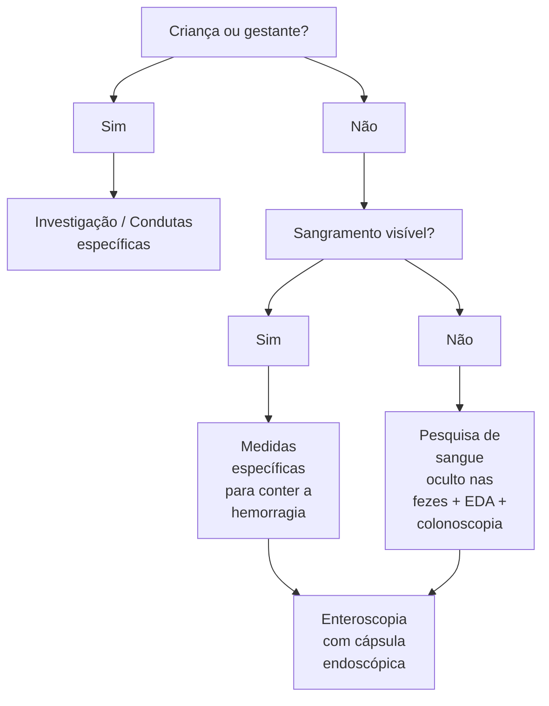
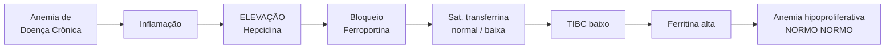
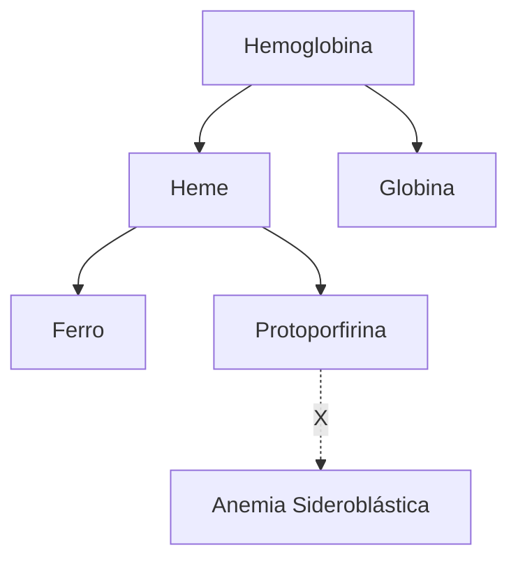
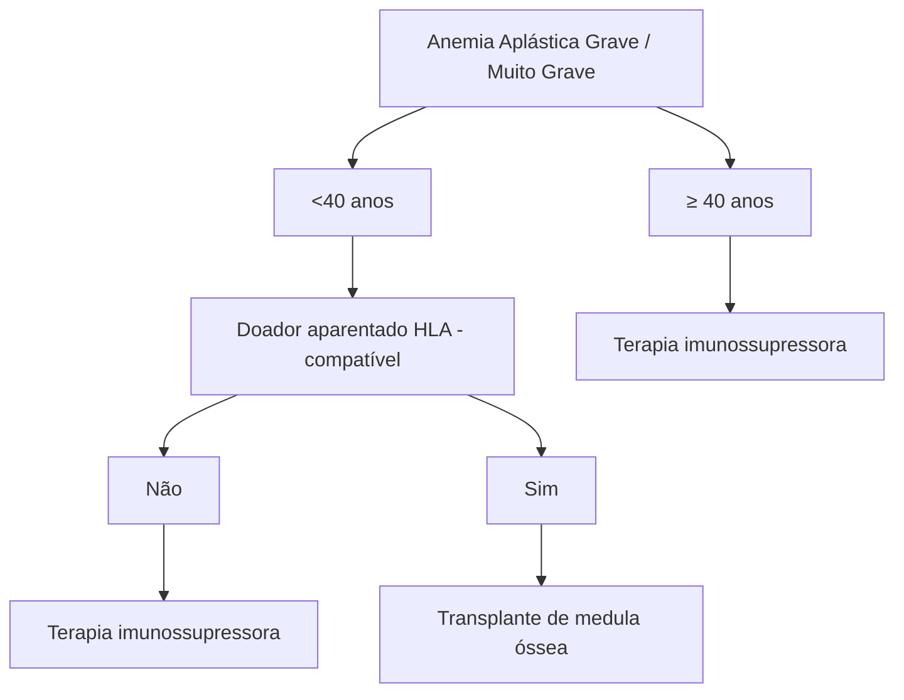
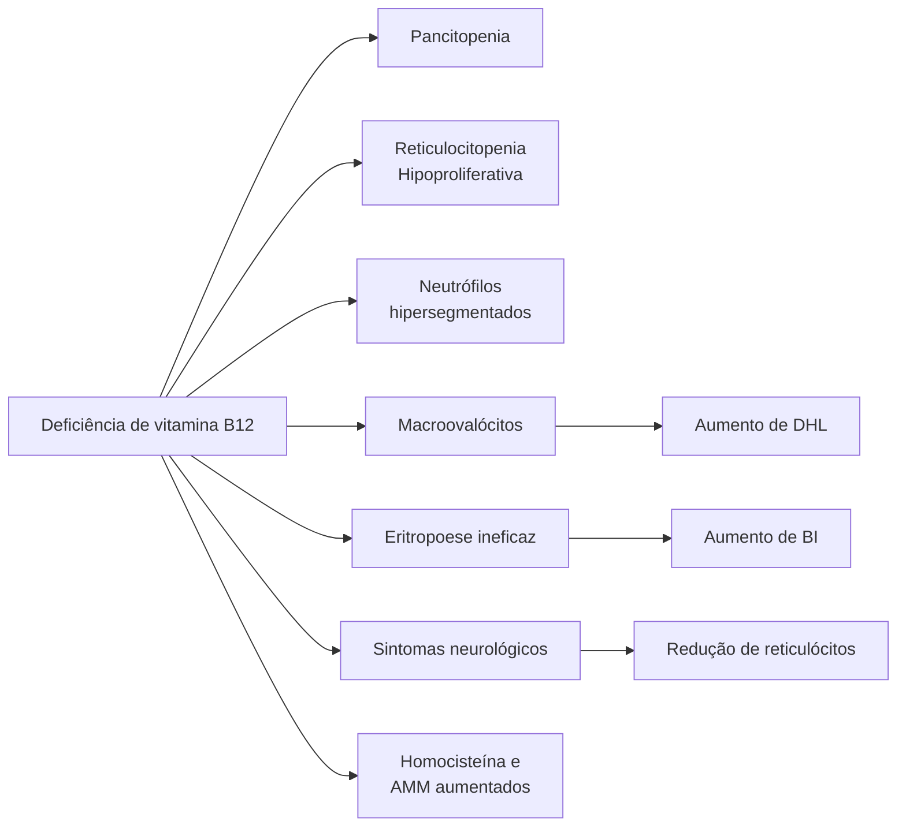
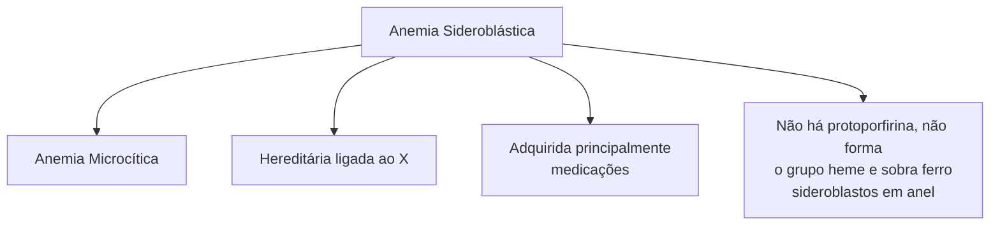
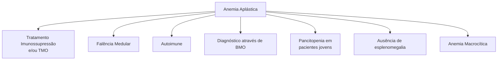

# ANEMIAS HIPOPROLIFERATIVAS I

## Anemias hipoproliferativas

• Reticulócitos normais ou reduzidos
• Microcítica (VCM < 80 fL) | Normocítica (VCM 80 - 100 fL) | Macrocítica (VCM > 100 fL)

### Ferropriva

• Geralmente microcítica e hipocrômica
• Principal causa é sangramento → investigação TGI
• Mulher com fluxo menstrual aumentado
• Crianças/gestantes → consumo
  • Redução da saturação de transferrina
  • Redução do Fe sérico

• TIBC alto
• Ferritina reduzida
• Anemia de Doença crônica
  • Inflamação → Aumento de IL-6 → Aumento de hepcidina → Redução de ferroportina → Redução na absorção de ferro
  • Geralmente normocítica e normocrômica → Inicialmente pode ser microcítica
• DRC (ClCr < 30)
  • Podem necessitar de reposição de EPO exógena

## 1. QUANDO É ANEMIA?

### 1.1 DEFINIÇÃO (OMS)

• Gestantes: Hb < 11 g/dL
• Mulheres: Hb < 12 g/dL
• Homens: Hb < 13 g/dL

## 2. CLASSIFICAÇÃO

• Hipoproliferativa x Hiperproliferativa → Diferenciar pela resposta da medula óssea através dos reticulócitos
• Microcíticas x Macrocíticas → Diferenciar pelo tamanho (VCM)

### 2.1 RETICULÓCITOS

• Eritrócitos que acabaram de perder o núcleo
• Duram cerca de 40h
• Fundamentais na investigação de qualquer anemia
• Não esquecer de fazer a correção do valor de reticulócitos!!
  • Reticulócitos corrigidos = % Reticulócitos x Ht/40
  • Reticulócitos corrigidos = % Reticulócitos x Hb/15

### 2.2 VCM

• Talassemias possuem menores VCM, em geral abaixo de 60 fL

**Figura 1** Fluxograma demonstrando a importância da avaliação dos reticulócitos diante de um paciente com anemia.

| Reticulócitos | Aumentados (>2% ou >100mil) | Hiperproliferativa | Anemias Hemolíticas                          |
| ------------- | --------------------------- | ------------------ | -------------------------------------------- |
|               |                             |                    | Sangramentos Agudos                          |
| Reticulócitos | Normal ou reduzidos         | Hipoproliferativas | Carenciais (Fe, B12, AF)                     |
|               |                             |                    | Deficiência EPO                              |
|               |                             |                    | Distúrbios medulares → Invasão Medular       |
|               |                             |                    | Distúrbios medulares → Insuficiência Medular |

**Figura 2** Fluxograma de VCM

| VCM | < 80 fL   | Microcítica | Ferropriva       |
| --- | --------- | ----------- | ---------------- |
|     |           |             | Talassemia       |
|     |           |             | Sideroblástica   |
|     | 80-100 fL | Normocítica | Doença Crônica   |
|     |           |             | Megaloblástica   |
|     | >100 fL   | Macrocítica | SMD              |
|     |           |             | Anemia Aplástica |

## 3. SINAIS E SINTOMAS

• Dependem da velocidade de instalação → Geralmente casos mais agudos possuem mais sintomas
  • Fadiga/astenia
  • Dispneia
  • Taquicardia e Hipotensão postural
  • Palidez e Icterícia

**Figura 3** Sintomas mais frequentes em pacientes com anemia. Os sintomas podem ser variáveis tanto de acordo com o nível de anemia quanto com a velocidade de instalação.

| Fadiga Astenia                      | Palidez Icterícia |
| ----------------------------------- | ----------------- |
| Taquicardia
Hipotensão postural | Dispneia          |

**Figura 4** Ação do hormônio hepcidina em diferentes cenários clínicos.

| Hepcidina | Anemia / Hipóxia | MENOS Hep |
| --------- | ---------------- | --------- |
| Hepcidina | Excesso de ferro | MAIS Hep  |
| Hepcidina | Inflamação       | MAIS Hep  |

**Figura 5** Fisiologia da absorção de ferro pelo enterócito através da ferroportina que é regulada pelos níveis séricos de hepcidina.

| FERRO
PROVENIENTE
DA DIETA |                             |
| ---------------------------------- | --------------------------- |
| FÍGADO
HEPCIDINA               | ENTERÓCITO
FERROPORTINA |

## 4. ANEMIA FERROPRIVA (MICROCÍTICA E HIPOCRÔMICA)

• Principal causa de anemia no mundo
• Problema de saúde pública → principalmente em países de 3º mundo

### 4.1 METABOLISMO DO FERRO

• Fundamental na formação dos glóbulos vermelhos por fazer parte da produção de hemoglobina
• A média de estoques é de 3 a 4g e ⅔ desses estão contidos nas hemácias
• Outros estoques de ferro:
  • Macrófagos no baço
  • Medula óssea
  • Fígado
• No estado basal (fora de estados inflamatórios/ síndrome metabólica), a ferritina reflete de forma adequada os valores de estoque corporal de ferro
• Hepcidina:
  • Diminui na hipóxia/anemia
  • Aumenta no excesso de ferro e na inflamação
  • Quando aumentada, a Hepcidina bloqueia a ferroportina e inibe a absorção do ferro, que será eliminado inalterado

### 4.2 REDUÇÃO ABSOLUTA OU FUNCIONAL

• Absoluta:
  • Aumento da demanda por Fe → Infância e Gestação
  • Diminuição da ingesta → Desnutrição, Vegetarianos (ferro presente na carne vermelha)
  • Diminuição na absorção → Cirurgia bariátrica, gastrite atrófica, doença celíaca, uso de IBP, DII
  • Perda crônica → Sangramentos (TGI, fluxo menstrual aumentado)
• Funcional:
  • Sequestro do ferro nos estoques corporais
  • Aumento da hepcidina → Estados inflamatórios
  • Falta de EPO → DRC

### 4.3 CIRURGIA BARIÁTRICA E ANEMIA FERROPRIVA

• Ambas as técnicas (by-pass e sleeve) causam diminuição na absorção por 3 mecanismos:
  • Diminuição da ingesta de alimentos
  • Diminuição da produção de HCl e o Fe necessita de meio ácido para ser melhor absorvido (por isso se orienta tomar suplementação de ferro com sucos ácidos)
  • Área de absorção (em especial duodeno) diminuída

ANEMIAS HIPOPROLIFERATIVAS I                                                                                           3

## 4.4 QUADRO CLÍNICO

• Queilite angular
  • Inflamação no ângulo da boca
• Coiloníquia
  • Unha em formato de colher
• Síndrome de Plummer-Vinson
  • Presença de membranas no esôfago

**Figura 6** Queilite angular em paciente com anemia ferropriva.

**Figura 7** Coiloníquia em paciente com anemia ferropriva.

**Figura 8** Membranas esofágicas (Síndrome de Plummer-Vinson) em paciente com anemia ferropriva.

## 4.5 INVESTIGAÇÃO

• Ferro sérico
• Ferritina
• Saturação de transferrina
• TIBC
• RDW

• O padrão ouro é o mielograma, porém não há necessidade da realização do mesmo

| Ferritina        | Fe SÉRICO             |
| ---------------- | --------------------- |
| Estoque de ferro | Quantidade disponível |

| TIBC                                 | Sat. Transferrina   |
| ------------------------------------ | ------------------- |
| Capacidade total de ligação de ferro | Proteína carreadora |

| RDW         | Hepcidina                 |
| ----------- | ------------------------- |
| Anisocitose | Regulação da ferroportina |

**Figura 9** Exames necessários para avaliarmos um paciente com anemia e o que eles representam.

• Ferritina BAIXA
• Fe sérico BAIXO
• Sat. Transferrina BAIXA
• TIBC ALTO
• RDW ALTO
• Hepcidina BAIXA → não é tão disponível

## 4.6 MANEJO

• Sangramentos
• ADULTOS = SANGRAMENTO, SANGRAMENTO E SANGRAMENTO (!!!)
  • Avaliação obrigatória do TGI
  • Colonoscopia alterada → 50% dos casos são neoplasias (especialmente cólon)
  • Mulheres com fluxo menstrual muito aumentado pode ser ponderado como causa
• Má absorção
• Baixa ingesta (3º mundo)

## 4.7 TRATAMENTO

• Via de administração
  • Oral é a preferencial na maioria dos casos
• Dose diária
  • 60-200mg de Fe elementar
  • Tomada única diária
  • Se > 100mg → dias alternados
  • Metabolismo da hepcidina: aumento da ingesta de ferro causa aumento da hepcidina e bloqueio da ferroportina. Se tomado em dias alternados, evita esse bloqueio pois já terá passado o pico de hepcidina

## 4.8 EFEITOS COLATERAIS

• TGI
• Náuseas
• Constipação

## 4.9 TRATAMENTO EM DUAS FASES:

• 1a: Correção da anemia (1 a 2 meses)
• 2a: Reposição dos estoques (2 a 3 meses)

## 4.10 AVALIAÇÃO DE RESPOSTA

• Melhora dos sintomas
  • Aumento de 2g/dL após 3-4 semanas do tratamento
  • Aumento de reticulócitos (mais precoce, > 100000)
  • Com cerca de 4 dias já inicia aumento dos reticulócitos, com pico em 10 dias
• Resultado não esperado?
  • Má adesão → Principal causa
  • Dose baixa
  • Tempo curto de tratamento
  • Sangramento persistente
  • Diagnóstico errado

## 5. ANEMIA DE DOENÇA CRÔNICA

• Inflamação aumenta IL-6
  • Aumenta produção de Hepcidina e diminui ferroportina→ Bloqueio da ferroportina que leva a deficiência funcional do ferro por bloqueio dos estoques
  • Saturação de transferrina e Fe sérico baixos
• Ativação do sistema retículo endotelial → Diminuição da sobrevida das hemácias

**Tabela 1** Demonstrando as principais semelhanças e diferenças entre anemia de doença crônica e anemia ferropriva.

|                           | Anemia DoençaCrônica    | AnemiaFerropriva |
| ------------------------- | ----------------------- | ---------------- |
| **Ferro sérico**          | Diminuído               | Diminuído        |
| **SAT.
Transferrina** | Diminuída ou
normal | Diminuído        |
| **TIBC**                  | Diminuído ou
normal | Aumentado        |
| **Ferritina**             | Normal ou
Aumentada | Diminuída        |

• Anamnese, TIBC e Ferritina ajudarão a diferenciar a anemia da doença crônica da anemia ferropriva
• Anemia da DRC
  • Baixa produção de EPO → Medula óssea não é estimulada a produzir
  • Paciente DRC com cinética do Ferro normal

## 6. TAKE HOME MESSAGES

**ANEMIA FERROPRIVA**
Ferro, Sat Transferrina, Ferritina reticulócitos diminuídos TIBC alto

**Figura 10** Fluxograma de investigação em paciente com anemia ferropriva.

• Anemia Ferropriva em adulto sem sangramento ativo, sempre pesquisar TGI
  • Caso pesquisa inicial negativa, realizar cápsula endoscópica para buscar sangramento em delgado

**Figura 11** Características importantes da Anemia de Doença Crônica

• Lembrar que o TIBC e a Transferrina ajudam a diferenciar a anemia de Doença crônica da anemia ferropriva
  • TIBC diminuído/normal na Anemia de doença crônica e aumentado na ferropriva
  • Ferritina normal/aumentada na anemia de doença crônica e diminuída na ferropriva

ANEMIAS HIPOPROLIFERATIVAS I

# REFERÊNCIAS

**Figura 6** Queilite angular em paciente com anemia ferropriva.

https://dermatologiaesaude.com.brperleche-queilite-angular-comissurite//

**Figura 7** Coiloníquia em paciente com anemia ferropriva.

https://www.msdmanuals.com/pt-br/profissional/multimedia/image/coilon%C3%ADquia

**Figura 8** Membranas esofágicas (Síndrome de Plummer-Vinson) em paciente com anemia ferropriva.

https://www.gastrointestinalatlas.com/english/Plummer_Vinson_Syndrome.html

Anemias Hipoproliferativas (CM)

# ANEMIAS HIPOPROLIFERATIVAS II

## Anemias hipoproliferativas

- Reticulócitos normais ou reduzidos
- Microcítica (VCM < 80 fL) | Normocítica (VCM 80 - 100 fL) | Macrocítica (VCM > 100 fL)
- Ferropriva
  - Geralmente microcítica e hipocrômica
  - Principal causa é sangramento → investigação TGI
  - Crianças/gestantes → consumo
- Anemia de Doença crônica
  - Inflamação → Aumento de IL-6 → Aumento de hepcidina → Redução de ferroportina → Redução na absorção de ferro
  - Geralmente normocítica e normocrômica
- Anemia Megaloblástica
  - Macrocítica. Def. de Vitamina B12 ou Folato (B9)

- Def. de Vitamina B12 pode cursar com pancitopenia + sintomas neurológicos → Folato não cursa com sintomas neurológicos
- Sintomas neurológicos sem relação direta com grau de anemia
- Principal causa é a anemia perniciosa
- Def. Vitamina B12 aumenta homocisteína e ácido metilmalônico
- Def. de Folato aumenta somente homocisteína
- Anemia Sideroblástica
  - Microcítica
  - Não há protoporfirina, não forma grupo heme e sobra ferro → sideroblastos em anel
  - Pensar em: medicamentoso (isoniazida, rifampicina e linezolida), def. de cobre e álcool

## 1. ANEMIA MEGALOBLÁSTICA (VCM > 100 FL)

### 1.1 MACROCITOSE (VCM > 100 FL)

- **Alterações no metabolismo do DNA**
  - Deficiência de B12
  - Deficiência de Ácido Fólico
- **Medicamentos**
  - Metotrexato
  - Azatioprina
  - Hidroxiuréia
  - AZT
- **Produção aumentada de células imaturas**
  - Reticulocitose
  - Aumento de EPO
  - Leucemias agudas → Blastos
- **Doenças primárias da medula óssea**
  - Síndrome Mielodisplásica (SMD)
  - Anemia Aplástica
- **Outras causas**
  - Doença Hepática
  - Hipotireoidismo
  - Alcoolismo
- Os principais representantes são: Deficiência de B12, SMD e Alcoolismo

### 1.2 HIPOPROLIFERATIVA (RETICULÓCITOS < 100.000)

### 1.3 DEFICIÊNCIA DE B12 (CIANOCOBALAMINA) OU B9 (FOLATO)

- Ácido metilmalônico → Aumentado apenas na def. de B12
- Homocisteína → Elevado em ambas
- **Causas**
  - Disabsorção
  - Nutricional → Veganismo
  - Medicamentosa
- **Hematoscopia**
  - Neutrófilos Hipersegmentados

- **Ovalócitos**

**Figura 1** Neutrófilo com mais de 5 segmentos, sendo classificado como hipersegmentado. Essa alteração é característica de Anemia Megaloblástica.

### 1.4 VITAMINA B12

- Fonte: origem animal
- Absorção no íleo terminal
- Estoque dura ~5 anos
- Homocisteína e ácido metilmalônico elevados
- Presença de sintomas neurológicos
- Queilite e atrofia de papila
- **Causas**
  - Anemia perniciosa
  - Baixa ingesta
- **Medicações**
  - MTX
  - Metformina
  - AZT
  - IBP
- Doença de Crohn
- *Diphylobotrium latum* (Tênia do peixe)
- Supercrescimento bacteriano

## 1.5 ÁCIDO FÓLICO

• Fonte: Vegetais, carne, frutas
• Estoque dura ~4 meses → repor em casos de hemólise crônica
• Homocisteína elevada
• Ausência de sintomas neurológicos
• Queilite e atrofia de papilas
• **Causas**
  • Ingesta inadequada
    • Alcoólatras
    • Criança
    • Anorexia
    • Leite de Cabra
    • Demanda excessiva
  • **Gravidez**
    • Anemias hemolíticas
    • Dermatites esfoliativas
    • Hemodiálise
  • **Má absorção**
    • Sind. do intestino curto
    • Uso de anticonvulsivantes (Fenitoína)
    • Uso de sulfassalazina
  • **Prejuízo no metabolismo**
    • MTX
    • Sulfametoxazol + Trimetoprim
    • Álcool

## 2. ANEMIA PERNICIOSA

• Anticorpo anti-célula parietal ou anti-fator intrínseco → inibe a absorção de vitamina B12
• Principal causa de deficiência de Vitamina B12

### 2.1 EPIDEMIOLOGIA

• Fem > Masc
• 45 a 65 anos
• Associação com outras doenças autoimunes → Especialmente tireoidite de Hashimoto

### 2.2 AUTO-ANTICORPOS

• Anti-célula parietal 84%
• Anti-fator intrínseco 56%

### 2.3 DIAGNÓSTICO

• Biópsia gástrica (gastrite atrófica) + Gastrina sérica elevada
  • Aumenta o risco de CA gástrico (2x)
  • Reposição de B12 intramuscular → Não vai ser absorvida no íleo terminal por via oral

## 3. ANEMIA SIDEROBLÁSTICA

• Anemia microcítica (VCM < 80 fL)
• Falha na incorporação do ferro a protoporfirina
• Acúmulo de ferro nas mitocôndrias (perinucleares!) → Sideroblastos em anel
• Eritropoiese ineficaz → Estimula maior absorção de ferro
• Confira ao lado a Figura 2 e a Figura 3

### 3.1 CAUSAS

• Herdada → Ligada ao X

• **Adquiridas**
  • SMD
  • Medicações
    • Isoniazida
    • Rifampicina
    • Linezolida
  • Álcool
  • Deficiência de Cobre
  • Toxicidade por Zinco

### 3.2 MANEJO

• Correção de causas reversíveis
• Piridoxina
  • Não se entende o mecanismo
  • 40 a 60% dos casos hereditários respondem
• Suporte transfusional
• Quelante de ferro

**Figura 2** Fisiopatologia da anemia siderobástica.

**Sideroblastos em anel**

[Image shows microscopic view of ring sideroblasts in bone marrow with purple-stained cells containing iron deposits around the nucleus]

**Figura 3** Mielograma demonstrando a presença de eritroblastos com sideroblastos em anel.

## 4. ANEMIA APLÁSTICA

• Falência medular
• Autoimune
• Pancitopenia em jovens
• Anemia Macrocítica
• Ausência de esplenomegalia
• Diagnóstico através de biópsia de medula óssea
• Tratamento → Imunossupressão
• Classificação

ANEMIAS HIPOPROLIFERATIVAS II

## 4.1 GRAVE
- Reticulócitos < 60.000 ou
- Neutrófilos < 500 cél/mm3 ou
- Plaquetas < 20.000

## 4.2 MUITO GRAVE
- Neutrófilos < 200 cél/mm3

## 4.3 TRATAMENTO (GRAVE/MUITO GRAVE)
- < 40 anos
- Doador aparentado HLA-compatível?
  - Sim → Transplante de medula óssea
  - Não → Terapia imunossupressora
- >= 40 anos
- Terapia imunossupressora

**Figura 4** Tratamento de anemia aplástica.

## 5. TAKE HOME MESSAGES

### 5.1 DEF. DE VITAMINA B12
- Pode cursar com Pancitopenia
- Reticulocitopenia (hipoproliferativa)
- Neutrófilos Hipersegmentados/Macroovalócitos
- Eritropoiese ineficaz
  - Aumento de DHL
  - Aumento de BI
  - Redução de reticulócitos
- Sintomas neurológicos
- Homocisteína e Ácido metilmalônico aumentados
- Tratamento com imunossupressão ou TMO

**Figura 4** Fluxograma que destaca os pontos mais importantes relacionados à deficiência de vitamina B12

### 5.2 ANEMIA SIDEROBLÁSTICA
- Microcítica
- Hereditária ligada ao X
- Adquirida → Em especial medicações
- Sideroblastos em anel

**Figura 5** Fluxograma que demonstra os pontos mais importantes relacionados a anemia sideroblástica.

### 5.3 ANEMIA APLÁSTICA
- Falência medular → Pancitopenia
- Autoimune
- Anemia macrocítica
- Ausência de esplenomegalia
- Diagnóstico por Biópsia de Medula óssea **Figura 6**

**Figura 6** Fluxograma demonstrando os pontos mais relevantes relacionados à Anemia Aplástica.

HEMATOLOGIA

# REFERÊNCIAS

**Figura 1** Neutrófilo com mais de 5 segmentos, sendo classificado como hipersegmentado. Essa alteração é característica de Anemia Megaloblástica.

https://atualizarevista.com.br/wp-content/uploads/2022/05/a-anemia-megaloblastica-e-seus-efeitos-fisiopatologicos-v-5-n-5-1.pdf

**Figura 3** Mielograma demonstrando a presença de eritroblastos com sideroblastos em anel.

De Tefferi A, Li C. Em Atlas of Clinical Hematology. Current Medicine, 2004
