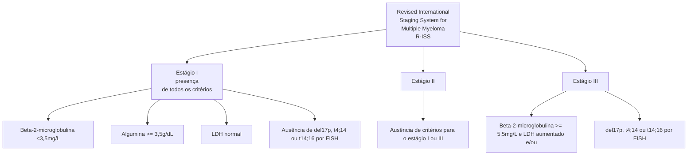
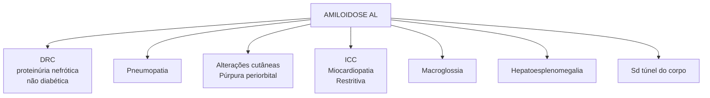

# DISCRASIAS PLASMOCITÁRIAS

| **Proteína M**
• proteína monoclonal

**MGUS: Assintomático!**
• Pico monoclonal <3g/dL \| <10% plasmócitos na MO \| Ausência de LOA

**Mieloma Múltiplo:**
• Proliferação clonal de plasmócitos anômalos. Mais comum subtipo IgG.
• Mais comum em idosos. Diagnóstico com eletroforese de proteínas
• Anemia, hipercalcemia, lesões ósseas, injúria renal
• Principal causa de óbitos: INFECÇÃO! | **Amiloidose:**
• Depósito de cadeias amiloides. Mais comum com a cadeia LAMBDA.
• IRC, pneumopatia, alterações cutâneas, IC, macroglossia, hepatoespleno, alterações neurológicas.
• Diagnóstico pode ser feito com biópsia de gordura abdominal

**Síndrome POEMS:**
• Polineuropatia \| Organomegalia \| Endocrinopatia \| Monoclonal protein \| Skin changes

**Macroglobulinemia de Waldenstrom:**
• Doença linfoproliferativa produtora de IgM monoclonal.
• Alto risco de Síndrome de Hiperviscosidade |
| ----------------------------------------------------------------------------------------------------------------------------------------------------------------------------------------------------------------------------------------------------------------------------------------------------------------------------------------------------------------------------------------------------------------------------------------- | ----------------------------------------------------------------------------------------------------------------------------------------------------------------------------------------------------------------------------------------------------------------------------------------------------------------------------------------------------------------------------------------------------------------------------------------------------------------------------------------------------------------------------------------------------- |

## 1. CONSIDERAÇÕES INICIAIS

### 1.1 Gamopatias monoclonais (paraproteinemias ou disproteinemias)

• Grupo de distúrbios caracterizados pela proliferação clonal de plasmócitos → Cél B ultra especializadas

• Produção de proteína imunologicamente homogênea → disfuncional

**Proteína M:**

| A

\[Electrophoresis graph showing narrow peak at γ region marked with \*]

Alb γ

B
\[Gel electrophoresis band image with \* marking]

A proteína M se mostra como um pico de base estreita em gamaglobulinas | A

\[Electrophoresis graph showing broad polyclonal increase in γ region marked with \*]

Alb γ

B
\[Gel electrophoresis band image with \* marking]

Aumento policlonal pico ou banda de base ampla |
| -------------------------------------------------------------------------------------------------------------------------------------------------------------------------------------------------------------------------------------------------- | ---------------------------------------------------------------------------------------------------------------------------------------------------------------------------------------------------------------------------------------- |

• Ig secretada por um clone anormalmente expandido de células plasmáticas

• A análise do soro é realizada por meio de técnicas eletroforéticas

• Eletroforese de proteínas sérias → Método de triagem

• **A prevalência de MGUS aumenta com a idade:**
  - > 50 anos - 3%, > 70 anos - 5%, > 85 anos - 7%.

• O aumento policlonal das imunoglobulinas é observado com um pico/banda de base larga;

• A prevalência de MGUS aumenta com a idade!
  - 3% para ≥ 50 anos;
  - 5% para ≥ 70 anos;
  - 7% para ≥ 85 anos.

## 2 GAMAPATIAS POLICLONAIS

• **São frequentemente vistas em:**
  • Infecções
  • Processos inflamatórios
  • Reacionais

• Doenças autoimunes
• Hepatopatas

## 3. GAMOPATIA MONOCLONAL DE SIGNIFICADO INCERTO (MGUS)

• Discrasia plasmocitária pré-maligna → NÃO é câncer;
• **Composta por:** pico monoclonal < 3g/dL, < 10% de plasmócitos clonais da MO, ausência de sinais de lesões de órgão alvo;
• É assintomática (por definição!)
• O subtipo de cadeia envolvida mais comum é a IgG

• Geralmente ocorre como "achado de exame"
• **É considerada condição precursora de:** mieloma múltiplo, amiloidose AL, doença linfoproliferativa (Macroglobulinemia de Waldenstrom)
• **BAIXO risco de evolução:** podendo ser detectada muitos anos antes destas condições, deve ser seguida pelo hematologista.

## 4. MIELOMA MÚLTIPLO

• Neoplasia hematológica
• Proliferação clonal de plasmócitos anômalos
• Imunoglobulinas monoclonais disfuncionais
• 1% de todos os cânceres e 10% dos hematológicos
• Mais comum em homens e idosos, média de idade ao diagnóstico de 65 - 70 anos
• 50% dos casos são da classe IgG
• Aumenta risco de infecções → pelos clones disfuncionantes

**Lesão de órgão-alvo (CRAB)**

### Mieloma Múltiplo

**C** - Clácio (hipercalcemia)

**R** - Renal (DRC)

**A** - Anemia

**B** - "Bone" (lesões síticas ósseas)

**CRAB**

• Hipercalcemia → 28% (C)
• Injúria Renal → 48% (R)
• Dor Óssea → 58% (B - Bone), lesões líticas ósseas
• Anemia → 74% (A)
• Perda ponderal → 25%
• Hemácias em Roleaux

**Porque as hemácias não se aglutinam em situações não patológicas?**

• Elas possuem uma carga negativa na membrana plasmática, chamada de potencial ZETA que, com a deposição de imunoglobulinas perde sua carga negativa, fazendo com que as hemácias se aglutinem umas nas outras.

**Potencial ZETA**

HEM

DISCRASIAS PLASMOCITÁRIAS                                                                                     3

### 4.1 Diagnóstico - critérios clínicos, laboratoriais e de imagem

> 10% de plasmócitos na biópsia de medula óssea ou plasmocitoma + um dos seguintes eventos:

**Lesão de órgão-alvo**
- Hipercalcemia (CaT > 11mg/dL)
- Injúria Renal (Cr > 2mg/dL ou ClCr < 40 ml/min)
- Anemia (Hb < 10 ou < 2g/dL do LIN)
- Lesões ósseas (uma ou mais lesões osteolíticas em exame de imagem)

**Um ou mais dos seguintes marcadores**
- Infiltração plasmocitária > 60% de plasmócitos clonais na MO

- Relação cadeia leve acometida/não acometida > 100
- > 1 lesão focal > 5mm na RMN

### 4.2 Estadiamento (R-ISS)

**Estágio I**
- B2-microglobulina < 3,5mg/L
- Albumina > 3,5 g/dL
- LDH normal
- Ausência de del(17p), t(4;14) ou t(14;16) por FISH

**Estágio II → Ausência de critérios para I ou III**

**Estágio III**
- B2-microglobulina >= 5,5 mg/L e LDH aumentado OU
- del(17p), t(4;14) ou t(14;16) por FISH

## 5. AMILOIDOSE PRIMÁRIA SISTÊMICA (AL)

- Discrasia de células plasmocitárias
- Envolvimento sistêmico, rápido e agressivo
- Geralmente homens (65%) e > 40 anos

**Se apresenta com:**
- DRC (proteinúria nefrótica não diabética)
- Pneumopatia
- Alterações cutâneas (púrpura periorbital – olhos de guaxinim)
- ICC (Miocardiopatia restritiva)
- Macroglossia

- Hepatoesplenomegalia
- Sd. túnel do carpo

HEM

As fibrilas amiloides são compostas de cadeia leve monoclonal, sendo a cadeia lambda muito mais comum.

• **A gravidade depende da deposição das cadeias amiloides em órgãos-alvo.**
  • **Rins:** Proteinúria nefrótica (1/3 dos pacientes), DRC;
  • **Coração:** ¼ dos pacientes apresentam miocardiopatia restritiva, baixa voltagem no ECG, responsável por 50% dos óbitos dos pacientes com amiloidose;
  • **Pulmão:** depósito de fibrilas amiloides ocorre em 90%, dispneia progressiva
  • **Neurológico:** polineuropatia sensitiva e motora, disautonomia

• **Diante da suspeita de amiloidose, devemos partir para a biópsia tecidual**
  • Gordura abdominal
  • Medula óssea
  • Outro órgão acometido

## 5.1 Diagnóstico (Critérios IMWG)

• Sinais e sintomas de depósito amiloide
• Coloração amiloide positiva por VERMELHO DO CONGO em qualquer tecido
• Evidência de que o amiloide está relacionado a cadeia leve
• Evidência de um distúrbio de células plasmocitárias monoclonais

## 6. SÍNDROME POEMS

• **POEMS:** polineuropatia, organomegalia, endocrinopatia, monoclonal protein, skin changes
• Doença rara
• Mais frequente após os 50 anos
• Desordem plasmocitária
• **Deve ser especialmente suspeitada em pacientes que apresentam:** neuropatia periférica, ascite refratária ou edema periférico, ginecomastias, organomegalia
• Superprodução de citocinas pró inflamatórias, em especial do VEGF!!

| Desordem plasmocitária com neuropatia periférica e... | Lesões osteoescleróticas

Doença de Castleman

Aumento de VEGF

Organomegalia

Endocrinopatia

Edema

Alterações cutâneas

Papiledema |
| ----------------------------------------------------- | --------------------------------------------------------------------------------------------------------------------------------------------------------------------------------------------- |

## 7. MACROGLOBULINEMIA DE WALDENSTROM (MW)

• Desordem linfoproliferativa
• Acúmulo de imunoglobulina IgM (!) monoclonal
• Doença rara
• Idosos (média de 70 anos)
• Mais comum em homens
• IgM monoclonal → pentâmero
• Síndrome de hiperviscosidade → principal e mais temida complicação

### 7.1 Altos níveis de IgM

• Ocorre em 30% dos pacientes
• Emergência médica

### 7.2 Manifestações clínicas

• Alterações visuais, cefaléia
• Vertigem, nistagmo, zumbido, tontura, diplopia, ataxia
• Descompensação de IC
• 7.3 Tratamento
• Plasmaférese
• Evitar transfusões
• Iniciar tratamento para MW
