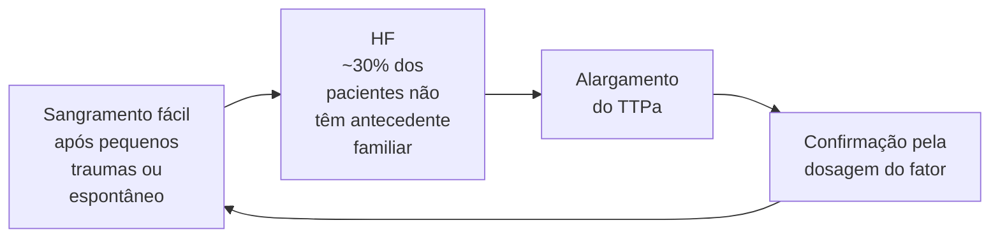

# HEMATOLOGIA: DISTÚRBIOS DA HEMOSTASIA

**Plaquetopenia:** Alteração hemostasia primária. Pode ser desencadeada por inúmeros fatores!
- Pseudoplaquetopenia (colher hemograma no tubo de citrato!)

**Púrpura Trombocitopênica Idiopática (PTI):** Doença autoimune.
- Plaquetopenia e mais nada!
- Tratamento depende da sua manifestação. Primeira linha é corticoide.

**Doença de von Willebrand (DvW):** doença hemorrágica hereditária mais comum!
- Frequentemente tem história familiar positiva.
- Geralmente sangramentos mucocutâneos. rTTPa discretamente alargado

**Trombocitopenia induzida por heparina (HIT):** 5 a 14 dias após a exposição.
- Quadro grave. Alto risco trombótico e hemorrágico.
- Anticoagulação dose plena: DOAC's, fondaparinux, argatroban e bivalirudina.

**Hemofilias:** Sangramentos graves! Hemostasia secundária.
- A: deficiência fator VIII. É a mais comum | B: deficiência fator IX.

**Coagulação Intravascular Disseminada (CIVD):**
- Aumento de: TP, TTPa, TT, dímero-D
- Redução de: Plaquetas, fibrinogênio, fator V e fator VIII

## 1. PLAQUETOPENIA

### 1.1 Plaquetopenia

- Cerca de 33% das consultas com o hematologista são por tal quadro;
- Entre 5–10% de todos os pacientes hospitalizados desenvolverão plaquetopenia.
  - Em cenário de terapia intensiva, a taxa pode alcançar 35%.
- Mediante tal quadro, é preciso:
  - Excluir emergências;
  - Avaliar o grau da plaquetopenia;
  - Considerar exposições e contexto clínico do paciente;
  - Determinar o tempo de evolução;
  - Avaliar sintomas associados;
  - Hematoscopia → avaliar grumos plaquetário.
- Mecanismos etiológicos:
  - Deficiência na produção: insuficiência medular; neoplasias; medicamentos; infecções virais; doença hepática;
  - Aumento na destruição; PTI; HIT; CIVD; PTT; Síndrome HELLP;
  - Sequestro esplênico: esplenomegalia;
  - Pseudoplaquetopenia: pela formação de anticorpos anti-EDTA;
- Dilucional: edema; gestação.
- Diante de um paciente com plaquetopenia, é importante pesquisar passado de sangramento ou história familiar positiva;
  - Sim? Provável plaquetopenia verdadeira;
  - Não? Suspeitar de pseudoplaquetopenia: hematoscopia; solicitar novo com anticoagulante não-EDTA → citrato.
- Pseudoplaquetopenia:
  - Responsável por 15% das plaquetopenias → ocorre em decorrência da formação dos agregados plaquetários;

- Assim, há formação do anticorpo anti-EDTA → induzem a agregação plaquetária. De tal modo, deve haver recoleta no citrato.
- Etiologias:
  - Induzida por drogas: heparina; quininas; paracetamol; cimetidina, ranitidina; AINE → ibuprofeno, naproxenol; ampicilina, piperacilina; ceftriaxona; vancomicina; inibidores de calcineurina – Tacrolimo; anticonvulsivantes – carbamazepina, fenitoína, ácido valpróico.
  - Infecções: hepatites; H. pylori; síndrome mono-like; HIV;
  - Doenças autoimunes.

### 1.2 Púrpura trombocitopênica imunológica

- É uma doença que se caracteriza pela presença de sangramentos mucocutâneos;
  - Gengivorragia;
  - Epistaxe;
  - Equimoses;
  - Petéquias.

• É um diagnóstico de exclusão;
• Não há alteração de hemácias e leucócitos;
• Epidemiologia:
  • Incidência: 1,6–3,9/100.000 pessoas/ano;
  • Acomete indivíduos de todas as idades. Em adultos jovens, é 2 vezes mais comum entre as mulheres. Na população idosa e em crianças, o acometimento é similar. Nas crianças, 80% dos casos são autolimitados. Nos adultos, 80% dos casos se tornam uma doença crônica.
• Fisiopatologia:

**A - Produção de anti-corpo**

Auto antígeno plaquetário → APC → Célula T autoreativa → Célula B autoreativa

**B - Aumento da remoção de plaquetas**

Receptor FC ← GPIIb-IIIa
Plaqueta → Anticorpo plaquetário
Fagocitose
Macrófago do baço

**C - Redução na produção de plaquetas**

GPIb-V-IX → GPIb-V-IX → Anticorpo megacariócito

Maturação do megacariócito reduzida - fagocitose ou apoptose

• É uma doença de exclusão;
  • Avaliação medular não é necessária → apenas se houver outras suspeitas melhores.
• Investigação para HCV e HIV são recomendados para todos os pacientes;
  • *H. pylori* se sintomas do TGI ou área endêmica.
• Classificação do PTI;
  • Primária ou secundária;
  • Por temporalidade: duração ≤ 3 meses; recém-diagnosticada, é mais comum em crianças; autolimitada; anticorpo com ação cruzada.
  • Duração: entre 3–12 meses; forma persistente;
  • Duração > 12 meses; forma crônica; é a forma mais comum no adulto;
  • Remissão/recaída; é a segunda forma mais comum no adulto.

## Tratamento:

• 1ª linha:
  • Indicado em cenários com plaquetas < 30 mil ou na presença de sangramentos;
  • Corticoide: prednisona 0,5 – 2 mg/kg/dia OU dexametasona 40 mg/dia, por 4 dias. A resposta ocorre em 3-4 dias;
  • Imunoglobulina humana: IVIG 0,8 – 1 mg/kg/dia, EV, em dose única; demonstra resposta dm 24-48 horas;
  • IVIG → reservado, de modo geral, para pacientes com sangramentos extensos e ameaçadores à vida.
• 2ª linha;
  • Composto por: Eltrombopag, rituximab ou esplenectomia. São terapias equivalentes entre si.

**PTI com sangramento**

1. Avaliar local de sangramento e gravidade
2. Plaquetometria
3. Outros FR para sangramentos envolvidos

| **Sangramento Crítico
(geralmente plaquetas
< 20 mil/mm3)**   | **Sangramento Severo
(geralmente plaquetas
< 20 mil/mm3)** | **Sangramento Menor
(geralmente plaquetas
< 20 mil/mm3)** |
| --------------------------------------------------------------------- | ------------------------------------------------------------------ | ----------------------------------------------------------------- |
| **Tratamento
imediato**                                           | **Tratamento
urgente**                                         | **Tratamento**                                                    |
| **Transfusão de
plaquetas +
imunoglobulina +
Corticoide** | **Imunoglobulina +
Corticoide**                                | **Corticoide ou
imunoglobulina**                              |

HEMATOLOGIA: DISTÚRBIOS DA HEMOSTASIA                                                                     3

## 1.3 Doença de Von Willebrand

• É a desordem hemorrágica hereditária mais comum;
• Decorre da redução da quantidade ou da qualidade do Fator de Von Willebrand.
  • O FvW apresenta funções de: proteção do FVIII – mantém os níveis adequados; ativação plaquetária; adesão plaquetária;
  • Assim, é evidenciado pela manifestação de sangramentos mucocutâneos.
• Observa-se o rTTPa discretamente prolongado (pela alteração do FVIII);
• Classificação:
  • Tipo 1: deficiência parcial mais comum – cerca de 60-80%;
  • Tipo 2: deficiência qualitativa;
  • Tipo 3: deficiência total.

OBS.: os tipos 1 e 3 são defeitos quantitativos, enquanto o tipo 2 é qualitativo.

• Manifestações clínicas:
  • Sangramentos mucocutâneos;
  • Hipermenorreia em mulheres;
  • Exacerbação de sangramentos em procedimentos;
  • Apresenta relação com história familiar.
• Exames laboratoriais:
  • Plaquetas normais, ou pouco diminuídas;
  • TP normal;
  • TTPA discretamente prolongado;
  • Redução do FvW.
• Tratamento:
  • Desmopressina;
  • Reposição do FvW.

## 1.4 Trombocitopenia induzida por Heparina - HIT

• Costuma ocorrer mais frequentemente entre 5-14 dias após o início da exposição a heparina;
  • Ocorre no 1° dia se o paciente já tiver sido exposto nos últimos 30 dias. A exposição pode ser, inclusive, por heparina profilática, ainda que de cateteres.
• A plaquetopenia associada ao uso da heparina é desencadeada pela formação de anticorpo contra o complexo PF4-heparina;
  • Tem um efeito adverso pró-trombótico relacionado ao uso de heparina → eventos tromboembólicos;
  • Trombose; ativação plaquetária, endotelial, partículas pró-coagulantes, estado inflamatório;
  • Plaquetopenia; consumo e remoção SRE.
• 50% dos pacientes têm apresentação com eventos trombóticos;
  • Os eventos venosos são mais frequentes;
  • É indicado o screening com doppler dos membros e de catéteres;
  • Deve-se manter a anticoagulação plena sem derivados de heparinas: DOACs; Fondaparinux; argatroban; bivalirudina.
• Tem alta incidência em pacientes com exposição frequente a heparina;
  • Especialmente, em doses baixas e do tipo HNF.
• Apesar da plaquetopenia, os episódios de trombose são mais frequentes do que os de sangramentos;
• Escore 4T:
  • Interpretação: 0-3 pontos →probabilidade baixa; 4-5 pontos → probabilidade intermediária; 6-8 pontos → probabilidade alta.

| 4 T's                            | 2 pontos                                                                                                                    | 1 ponto                                                                                                                                                                                                    | 0 ponto                                                      |
| -------------------------------- | --------------------------------------------------------------------------------------------------------------------------- | ---------------------------------------------------------------------------------------------------------------------------------------------------------------------------------------------------------- | ------------------------------------------------------------ |
| Trombocitopenia                  | Queda de plaquetas > 50% e nadir ≥ 22.000                                                                                   | Queda de plaquetas entre 30 – 50% ou Nadir entre 10.000-19.000                                                                                                                                             | Queda de plaquetas de < 30.000 ou Nadir < 10.000             |
| Tempo para queda das plaquetas   | Claro início entre 5-14 dias após início da heparina ou queda ≤ 1 dia naqueles pacientes com exposição nos últimos 30 dias  | Consistente com queda entre 5-14 dias do início da heparina, mas não claro (ex.: faltam dosagens de plaquetas), ou início após 14 dias ou ≤ 1 dia naqueles pacientes com exposição nos últimos 30-100 dias | Queda de plaquetas ≤ 4 dias, em exposição recente a heparina |
| Trombose ou outra sequela        | Nova trombose (confirmada); necrose cutânea em sítio de injeção de heparina; reação anafilactoide após bolus IV de heparina | Trombose progressiva ou recorrente; lesões cutâneas não necrotizantes (eritematosas) em sítios de injeção de heparina; trombose suspeita (não confirmada)                                                  | Nenhuma alteração                                            |
| Outras causas de trombocitopenia | Nenhuma outra causa                                                                                                         | Possivelmente há outra causa                                                                                                                                                                               | Definitivamente há outra causa                               |

## 2. DISTÚRBIOS DA HEMOSTASIA SECUNDÁRIA

### 2.1 Hemofilias;

• Considerações importantes:
  • Deficiência ou anormalidade da atividade coagulante do fator VIII (tipo A), fator IX (tipo B) e fator XI (tipo C);
  • Doença hemorrágica hereditária ligada ao cromossomo X; hemofilias A e B; hemofilia C: herança autossômica recessiva;
  • Deficiências adquiridas dos fatores → mais comumente FVIII;
  • Presença de inibidores → auto-anticorpos.
• Epidemiologia:
  • Mais de 1,2 milhão de pessoas no mundo (H > M);
  • Hemofilia A representa cerca de 80% dos casos. Mais comum e mais severa!
  • Prevalência: Hemofilia A: 1 a cada 40.000-50.000/nascimentos. Cerca de metade dos pacientes terão a forma severa da doença; Hemofilia B: 1 a cada 15.000-30.000/ nascimentos. Cerca de 1/3 terão a forma severa.
  • Mutação nova: hemofilia A → 55% dos casos; hemofilia B → 43% dos casos.
• Gravidade:
  • Leve: > 5-40% da atividade do fator;
  • Moderada: ≥ 1-5% da atividade do fator;
  • Severa: < 1% de atividade do fator; ocorrem sangramentos espontâneos e mais precoces.
• Diagnóstico:

• Hemofilia adquirida:
  • É uma condição rara, mais comum em idosos;
  • Decorre da formação de autoanticorpos – FVIII é o mais comum;
  • A suspeita ocorre mediante TTPa prolongado, que não se corrige no teste de mistura. Além disso, observam-se hematomas espontâneos.
  • Os sangramentos podem ser graves e com alta mortalidade;
  • Epidemiologia: 40-50% dos casos são idiopáticos; 20% - neoplasias; 15% doenças autoimunes.
  • Tratamento: imunossupressão.

### 2.2 CIVD – Coagulação Intravascular Disseminada

• Considerações:
  • É uma coagulopatia extremamente grave; Pode cursar com: sepse; tromboses; hemorragias;
  • O manejo se dá através da correção do fator causal; se necessário, é possível a transfusão de PFC;
  • Observam-se: aumento de: TP; TTPa; TT; Dímero-d. Redução de: plaquetas; fibrinogênio; fator V e fator VIII.
