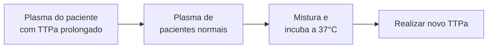

# FISIOLOGIA DA COAGULAÇÃO

**HEMOSTASIA PRIMÁRIA:**
- Plaquetas
- Alterada: sangramentos mucocutâneos, hipermenorreia.
- Exemplo: PTI

**HEMOSTASIA SECUNDÁRIA:**
- Fatores de coagulação
  - Via intrínseca → fatores VIII, IX, XI e XII → TTPa
  - Via extrínseca → fatores FT e VII → TAP/RNI
- Alterada: sangramentos graves! Intramusculares, hemartroses...
- Exemplo: hemofilia A (Def. fator VIII), hemofilia B (def. fator IX)A (Def. fator VIII), hemofilia B (def. fator IX)

## 1. CONSIDERAÇÕES INICIAIS

- Etmologicamente, a palavra "hemostasia" deriva do grego:
  - Haima: sangue;
  - Statis: parar.
- De tal modo, é o processo pelo qual o organismo mantém o sangue fluído, evitando sua perda mediante algum processo lesivo vascular;
- Pode ser entendido como um mecanismo que é mantido através de um balanço fino entre seus componentes:
  - Em um contexto de discrasias hemorrágicas, haverá favorecimento para um quadro de sangramento;
  - Enquanto que, na presença de trombofilias, há favorecimento para o surgimento de tromboses.

| Discrasias hemorrágicas | Trombofilias          |
| ----------------------- | --------------------- |
| Sangramento             | Trombose              |
| Fibrinólise             | Hemostasia secundária |
| Anticoagulação          | Hemorragia primária   |

## 2. HEMOSTASIA PRIMÁRIA

- O endotélio normal apresenta função anticoagulante;
  - Tal processo ocorre a partir da interação entre algumas moléculas;

- Glicosaminaglicanas;
- Prostaciclina (PGI2);
- Prostaglandina;
- Óxido nítrico (NO).

**Plaquetas**

Lúmen do vaso

Espaço intersticial

- Mediante lesão vascular com ruptura na continuidade do endotélio, ativa-se a função pró-coagulante, a fim de evitar a continuação do sangramento;

- Forma-se um tampão plaquetário, mediado por:
  - Endotelina 1;
  - Fator tecidual;
  - Fator de Von Willebrand.

HEM

HEM

FISIOLOGIA DA COAGULAÇÃO

**Diagrams showing platelet aggregation and secretion process:**

[First diagram shows a cell with COLÁGENO (collagen) receptors, FvW, GP Ib-V-IX, and Plaqueta (platelet)]

• Agregação plaquetária:
  • Marcada pela coesão plaquetária;
  • GP Iib-IIIa é o receptor mais abundante na superfície das plaquetas;
  • De tal modo, é realizada uma ligação com o fibrinogênio – capaz de unir as plaquetas.

[Second diagram shows platelet aggregation with COLÁGENO, FvW, FIB, GP Ib-V-IX, and Plaqueta]

• Secreção plaquetária:
  • Liberação de proteínas dos grânulos;
  • Os grânulos densos liberam ADP, serotonina e cálcio;
  • Em tal fase, é realizado recrutamento das plaquetas adicionais – ligação do ADP ao GP Iib/IIIa.

[Third diagram shows platelet secretion with COLÁGENO, Ca++, Serot, ADP, FvW, FIB, GP Ib-V-IX, and Plaqueta]

• Atividade pró-coagulante:
  • Por fim, há ativação da cascata de coagulação;
  • Intensificação da geração de trombina.

[Fourth diagram shows pro-coagulant activity with COLÁGENO, FvW, FIB, GP Ib-V-IX, and Plaqueta]

## 3. HEMOSTASIA SECUNDÁRIA

• Considerações importantes!
  • A via intrínseca é avaliada a partir do TTPa, enquanto a via extrínseca é avaliada pelo TAP (ou INR, LNI, TP);
  • Via intrínseca → fatores VIII, IX, XI e XII;
  • Via extrínseca → fatores FT e VII.

• A varfarina inibe os fatores II, VII, IX e X;
• Inibidores:
  • Fator IIa → dabigatrana (inibidor direto da trombina);

• Fator Xa:
  • Rivaroxabana;
  • Apixabana;
  • Edoxabana;
  • Fondaparinux.

• A antitrombina III é um anticoagulante natural do organismo, que atua inibindo a trombina. Seu déficit é caracterizado por um quadro de trombofilia.

HEM

• Observe o fluxograma abaixo:

```mermaid
flowchart TD
    TTPa[TTPa]
    Fatores[Fatores estão presentes
na circulação]

    XII[XII] -->|Activating surface| XIIa[XIIa]
    XI[XI] --> XIa[XIa]
    IX[IX] --> IXa[IXa]

    XIIa --> XIa
    XIa -->|Ca²⁺| IXa

    IXa -->|FVIIIa
Ca²⁺
PL| X[X]
    X --> Xa[Xa]

    TAP[TAP]
    FatorTecidual[Fator tecidual está fora
da circulação]

    Trauma --> TF[TF]
    TF -->|VIIa
Ca²⁺
PL| VIIa[VIIa]
    VIIa --> VII[VII]

    VIIa -->|Ca²⁺
PL| Xa

    Xa -->|FVa
Ca²⁺
PL| II[II]
    II --> IIa[IIa]

    Fibrinogenio[Fibrinogênio]
    I[I] --> Ia[Ia]
    IIa --> I

    Ia --> FibrinClot[Fibrin clot
formation]

    Precisam[Precisam da via
intrínseca e extrínseca]

    FXaFVa[FXa | FVa]

    style TTPa fill:#e74c3c,color:#fff
    style Fatores fill:#17a2b8,color:#fff
    style TAP fill:#e74c3c,color:#fff
    style FatorTecidual fill:#17a2b8,color:#fff
    style XII fill:#17a2b8,color:#fff
    style XIIa fill:#17a2b8,color:#fff
    style XI fill:#17a2b8,color:#fff
    style XIa fill:#17a2b8,color:#fff
    style IX fill:#17a2b8,color:#fff
    style IXa fill:#17a2b8,color:#fff
    style TF fill:#e74c3c,color:#fff
    style VIIa fill:#e74c3c,color:#fff
    style VII fill:#e74c3c,color:#fff
    style X fill:#d63384,color:#fff
    style Xa fill:#d63384,color:#fff
    style II fill:#d63384,color:#fff
    style IIa fill:#d63384,color:#fff
    style I fill:#d63384,color:#fff
    style Ia fill:#d63384,color:#fff
    style Precisam fill:#17a2b8,color:#fff
    style Fibrinogenio fill:#e74c3c,color:#fff
    style FXaFVa fill:#e74c3c,color:#fff
```

**Via Intrínseca** | **Via Extrínseca** | **Via comum**

• Considerações importantes!
  • A via extrínseca é avaliada a partir do TTPa, enquanto a via intrínseca é avaliada pelo TAP (ou INR, LNI, TP);
  • A varfarina inibe os fatores II, VII, IX e X;
  • Inibidores:
    • Fator IIa → dabigatrana (inibidor direto da trombina);
    • Fator Xa:
      • Rivaroxabana;
      • Apixabana;
      • Edoxabana;
      • Fondaparinux.
  • A antitrombina III é um anticoagulante natural do organismo, que atua inibindo a trombina;
    • Seu déficit é caracterizado por um quadro de trombofilia;

• As heparinas atuam inibindo a antitrombina, isto é, inibem o inibidor!

• Proteínas C e S:
  • Proteína C é cofator da proteína S;
    • Esta atua diretamente na conversão do fator IX com o fator VIIIa e Xa.

• Mutação do fator V de Leiden;
  • Atua no fator Va, importante para a ativação do fator Xa em protrombina e trombina.

• Mutação do gene da pró-trombina .

• Relembrando alguns conceitos:
  • TTPa → via intrínseca → fatores XII, XI, IX, VIII;
  • TAP → via extrínseca → fator tecidual e VII.

HEM

FISIOLOGIA DA COAGULAÇÃO                                                                          5

• Diante do pacientes com TTPa prolongado:
  • Observa-se na vigência de alguma deficiências dos fatores relacionados, ou por atuação de algum inibidor;
  • Conduta inicial: colher novo exame; TPPa prolongado e confirmado?

• Deve-se realizar teste da mistura – plasma de pacientes com plasma normal;
  • A avaliação deve ser realizada em:
    • 0 minuto;
    • 60 minutos;
    • 120 minutos.



• Fluxograma → teste da mistura:
  • Corrigiu? Considerar deficiência de fator;
  • Não corrigiu? Considerar inibidor circulante;
    • Anticoagulante lúpico;
      • Dosagem de anticoagulante lúpico → é pró-trombótico !
    • Avaliar história de trombose prévia.

  • Inibidor adquirido → mais comum é o FVIII.

• Fatores de coagulação vitamina K dependentes:
  • II, VII, IX, X, proteína S e proteína C.

• A meia-vida dos fatores é diferente:
  • Deste modo, ocorre a diminuição sequencial da concentração plasmática, na respectiva ordem: VII – IX – X – II;
  • Como o fator VII é o primeiro a ser reduzido, interfere diretamente nos níveis de TP da via extrínseca.
    • Fator VII → 3-6 horas;
    • Fator IX → 16-30 horas;
    • Fator X → 30-60 horas;
    • Fator II → 40-60 horas.

HEM
