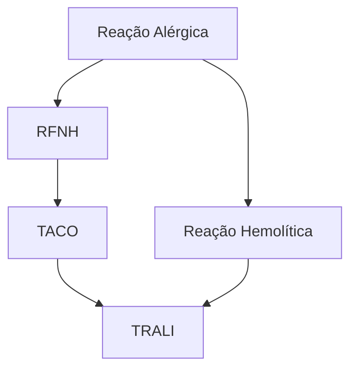

# HEMOTERAPIA

## PROCEDIMENTOS ESPECIAIS:

• Desleucocitação:
  • Objetivo: redução dos leucócitos
  • Prevenção de RFNH e de aloimunização
  • Indicação: pacientes imunossuprimidos e em programa de transfusão crônica
• Irradiação:
  • Objetivo: inativação dos linfócitos T
  • Prevenção de DECH-AT
  • Indicação: imunossuprimidos
• Lavagem:
  • Objetivo: redução de proteínas plasmáticas (plasma)

• Prevenção: prevenção de reações alérgicas
• Indicação: reações alérgicas prévias e deficiência de IgA

## REAÇÕES TRANSFUSIONAIS:

• RFNH: é a mais comum! | TACO: sobrecarga volêmica | TRALI: lesão pulmonar relacionada à transfusão | reação alérgica | reação hemolítica

## 1. CONSIDERAÇÕES INICIAIS

### 1.1 Concentrado de hemácias - CH

• O uso é recomendado no intuito de tratar ou prevenir iminente e inadequada liberação de oxigênio aos tecidos;
• Anemias com Hb > 10 g/dl, em geral, são bem toleradas;
• Hb < 7 g/dL → há risco de comprometimento das funções vitais;
• Hb entre 7-10 g/dL → a indicação é dependente das condições clínicas do paciente.
• Tempo de infusão: 1-4 horas;
• Atenção!!
  • 1 CH → aumenta Hb em 1 g/dL e Ht em 3%.

### 1.2 Plasma fresco congelado - PFC

• É a porção acelular do sangue, obtida a partir da centrifugação do sangue total. Constituído de água, carboidratos, lipídios e proteínas. Dentre as proteínas, estão: albumina; fatores de coagulação; globulinas;
• A fim de manter a preservação dos fatores de coagulação, o PFC deve ser completamente congelado após 8 horas da coleta;
• Não possui anticorpos eritrocitários irregulares de relevante importância clínica;
• Indicações:
  • TP ou TTPA > 1,5x o normal na presença de sangramento ativo ou necessidade de procedimentos invasivos;
  • Reversão em caráter de emergência do uso de cumarínicos (se não disponível complexo protrombínico);
  • Deficiência de antitrombina III, proteína C ou S na vigência de fenômenos trombóticos significativos;
  • Plasmaférese terapêutica de PTT;
  • Transfusão maciça.

• Dose: 10-20 ml/kg.

ATENÇÃO! O PFC deve ser usado para o tratamento dos pacientes com distúrbio da coagulação devido à deficiência de múltiplos fatores.

HEMOTERAPIA<page_header>
HEMOTERAPIA

• Tratamento quimioterápico ou uso de imunossupressores recente ou nos últimos 6 meses;
• Quando o receptor tiver qualquer grau de parentesco com o doado.

## 2.3 Lavagem

• Objetivo: redução do plasma;

• Promove a redução de reações alérgicas→ útil para quadros de reação alérgica grave ou deficiência de IgA;
• Indicações clínicas:
  • Antecedente de reações alérgicas graves associadas à transfusões não evitadas com uso de medicamentos;
  • Pacientes com deficiência de IgA, haptoglobina ou transferrina com história prévia de reação anafilática durante transfusões anteriores.

# 3. REAÇÕES TRANSFUSIONAIS

## 3.1 Considerações iniciais

• A transfusão dos hemocomponentes é um eventos que acarreta riscos e benefícios ao receptor;
  • A despeito da correta indicação e da administração do procedimento, a ocorrência das reações ainda é possível.
• Deste modo, é essencial o reconhecimento precoce do quadro!
• A reação transfusional pode ser dita como qualquer intercorrência relacionada à transfusão de um hemocomponente, podendo ser durante ou após a administração;
  • Pode ocorrer independentemente da correta indicação da hemocomponente;
  • Classificação: temporalidade; imediatas → em até 24 horas da transfusão; tardias → após 24 horas da transfusão. Reação: imunológica; não imunológica.

|          | IMUNE                                                 | NÃO IMUNE                                             |
| -------- | ----------------------------------------------------- | ----------------------------------------------------- |
| IMEDIATA | Reação febril não hemolítica (RFNH)                   | Sobrecarga circulatória associada à transfusão (TACO) |
|          | Reação Hemolítica Aguda imune (RHAI)                  | Contaminação bacteriana                               |
|          | Reação alérgica (leve, moderada, grave)               | Hipotensão relacionada à transfusão                   |
|          | Lesão pulmonar aguda relacionada à transfusão (TRALI) | Hemólise não imune aguda (RHANI)                      |
|          |                                                       | Distúrbios metabólicos                                |
|          |                                                       | Embolia aérea                                         |
|          |                                                       | Hipotermia                                            |

|        | IMUNE                                                        | NÃO IMUNE                          |
| ------ | ------------------------------------------------------------ | ---------------------------------- |
| TARDIA | Aloimunização eritrocitária                                  | Hemossiderose                      |
|        | Aloimunização HLA                                            | Transmissão de doenças infecciosas |
|        | Doença do enxerto-contra-hospedeiro-pós-transfusional (DECH) |                                    |
|        | Púrpura pós-transfusional                                    |                                    |
|        | Imunomodulação                                               |                                    |

## 3.2 Tipos de reações

## 3.3 Reação febril não hemolítica

• É a reação transfusional mais comum;
  • Reação de hipersensibilidade do tipo II;
  • Presença de anticorpos contra antígenos HLA do doador.
• Geralmente, tende a ocorrer ao final da transfusão;
• Manifestações clínicas:
  • Febre;
  • Calafrios;
  • Dor lombar leve.
• Conduta:
  • Avaliar a afastar potenciais causas graves de febre, como: hemólise; contaminação bacteriana.

## 3.4 Reação alérgica

• É uma reação de hipersensibilidade do tipo I;
• Pode ser dividida em 3 estágios:
  • Leve → acometimento cutâneo; Prurido; Urticária; Placas eritematosas;

HEMOTERAPIA                                                                                                                         4

## 3.6 TACO – *Transfusion-associated circulatory overload*

• Observa-se um edema pulmonar decorrente de sobrecarga volêmica;
  • Manifesta-se pela administração de grande volume de hemocomponentes;
  • O tratamento é semelhante ao edema pulmonar cardiogênico;
  • Apresenta boa resposta ao uso de diuréticos de alça.
• Critérios diagnósticos:
  • Falência respiratória – aguda ou com piora;
  • Evidência de edema pulmonar – observado no exame físico ou em exame de imagem;
  • Aumento de BNP ou pró-BNP;
  • Sem outras causas que melhor justifiquem o quadro clínico.

|                        | TRALI                          | TACO                            |
| ---------------------- | ------------------------------ | ------------------------------- |
| Tempo de início        | Durante ou até 6 horas após    | Até 12 horas após               |
| Febre                  | Pode estar presente            | Não                             |
| Pressão Arterial       | Hipotensão pode estar presente | Hipertensão pode estar presente |
| Sintomas Respiratórios | Dispneia aguda                 | Dispneia aguda                  |
| Fração de Ejeção       | Geralmente normal              | Geralmente baixa                |
| Resposta ao diurético  | Geralmente não responsivo      | Responsivo                      |
| BNP ou NT-pró-BNP      | Normal                         | Elevado                         |
| Rx de tórax            | Infiltrado bilateral           | Infiltrado bilateral            |

| SEM sinais de sobrecarga volêmica                   | COM sinais de sobrecarga volêmica |
| --------------------------------------------------- | --------------------------------- |
| ↓
Tratamento de suporte
(geralmente em UTI) | ↓
Manejo como EAP             |

## 3.5 TRALI – *Transfusion-related acute lung injury*

• Lesão pulmonar relacionada à transfusão;
• Qualquer hemocomponente que contenha plasma pode desencadear TRALI;
  • O risco em componente plasmático é maior → plasma e plaquetas.
• Pode ser moderada a grave;
• Geralmente desenvolve-se 2-6 horas após a transfusão;
  • Ocorre devido a transfusão de anticorpos anti-HLA presentes no plasma do doador.
• Os anticorpos se ligam aos antígenos dos leucócitos do receptor, desencadeando eventos imunológicos que aumentam a permeabilidade vascular pulmonar;
• Redução do risco → utilizar plasma, crioprecipitado e plaquetas, preferencialmente de:
  • Doador do sexo masculino;
  • Doadora do sexo feminino nuligesta.
• Sinais e sintomas:
  • Dispneia;
  • Hipoxemia;
  • Infiltrado pulmonar bilateral;

Fonte: https://www.paiskincare.us/blogs/guides/urticaria-hives-skincare

• Moderado: edema de Quincke – angioedema; broncoespasmo; diarreia;
• Grave: choque anafilático.

OBS.: há risco aumentado em pacientes com deficiência de IgA.

Fonte: https://imagebank.hematology.org/image/3672/transfusion-related-acute-lung-injury-trali--1

• Hipotensão;
• Febre.

## 3.7 Conduta imediata frente a uma reação transfusional

• O que fazer imediatamente?
  • Parar a transfusão!!!
  • Manter a linha venosa com soro fisiológico 0,9%;
  • Notificar o médico do paciente e o Banco de Sangue;
  • Devolver ao Banco de Sangue a bolsa e o equipamento de transfusão;
  • Em caso de febre ou suspeita de reação hemolítica aguda, encaminhar uma amostra de sangue do paciente com heparina ao Banco de Sangue; e coletar outra amostra em frasco de hemocultura para o Laboratório de Bacteriologia do Serviço de Análises Clínicas.
