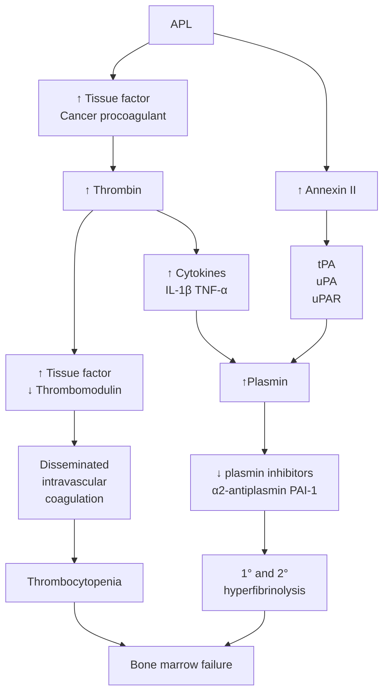
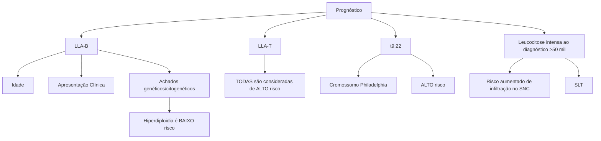

# LEUCEMIAS: BÁSICO

**LEUCEMIAS AGUDAS:** parada de maturação celular
- Diagnóstico com > 20% de blastos na medula óssea ou no sangue periférico
- LMA: bastonete de Auer (patognomônico de LMA)
  - Marcadores mieloides: MPO, CD13, CD33
- LLA: neoplasia mais comum da infância
  - Marcadores linfoides: B CD19, CD20 e CD79a | T CD3 e CD7
- Alterações importantes:
  - LPA: t(15;17) – PML/RARA || Ph+: t(9;22) – Philadelphia

**LEUCEMIAS CRÔNICAS:**
- LMC: neoplasia mieloproliferativa crônica
- LLC: linfocitose > 5.000/mm³ monoclonal
- Não precisa de medula óssea para o diagnóstico. Muito associado com AHAI/PTI

## 1. MATURAÇÃO CELULAR

- Inicia na medula óssea a partir de células tronco hematopoiéticas que podem dar origem a qualquer célula
- Inicialmente ela se compromete com alguma linhagem: Mielóide ou Linfóide

### 1.1 Progenitor mielóide:
- Megacariócito → Plaquetas
- Eosinófilo
- Basófilo
- Eritrócito
- Monócitos → Cél. Dendríticas / Macrófagos
- Neutrófilos

### 1.2 Progenitor linfóide
- Linfócito T
- Linfócito B → Plasmócito
- Linfócito NK

**Sangue normal:** Contém células vermelhas, neutrófilos, monócitos e plaquetas em proporções normais.

**Leucemia:** Apresenta células cancerígenas (blastos) em grande quantidade, substituindo as células normais.

- **Leucemias Agudas:** Parada de maturação, ficam incapazes de seguir a maturação e param de produzir as demais células
- Mutação
- Produção clonal de células jovens
- Redução da hematopoiese normal

## 2. LEUCEMIA MIELÓIDE AGUDA (LMA)

- Mutação que desencadeia bloqueio de maturação
- Produção clonal de precursor mielóide → Mieloblasto
- 90% das leucemias agudas em adultos
- Incidência aumenta com a idade pelo acúmulo de mutações → > 60 anos
- **Maioria dos casos LMA de novo:** sem causa ou FR identificado

**Secundária**
- Quimioterapia
- Radioterapia

**Sinais e Sintomas**
- Febre
- Palidez
- Astenia
- Sangramentos
- Hepatoesplenomegalia

LEUCEMIAS: BÁSICO                                                                                                    469

## 2.1 Diagnóstico

• 20% de blastos em sangue periférico ou Medula óssea (MO)
• Bastonetes de Auer → Patognomônico

**Imunofenotipagem: Ajudam a identificar que célula é aquela a partir dos CD**
• Cél. T → CD3 / TCR
• Cél B → CD19 / CD20
• Mielóide → MPO / CD13 / CD33
• Citogenética e biologia molecular definem o subtipo da LMA
• **Marcadores Mielóides**: Mieloperoxidase (MPO), CD13, CD33

**Subtipos específicos de LMA → Classificação FAB (Morfológica)**
• M0 → LMA com mínima diferenciação mielóide
• M1 → LMA sem maturação
• M2 → LMA com maturação
• M3 → LMA promielocítica aguda
• M4 → LMA mielomonocítica aguda
• M5 → LMA monoblástica
• M6 → Eritroleucemia
• M7 → Megacarioblástica

## 3. LEUCEMIA LINFOBLÁSTICA AGUDA (LLA)

Câncer mais comum da infância → ¾ ocorrem antes dos 6 anos

**Sinais e Sintomas**
• Fadiga
• Infecções
• Sangramentos/hematomas
• Dor óssea
• Artralgia
• Hepatoesplenomegalia pode estar presente
• Sintomas constitucionais

**Diagnóstico**
• Sangue periférico OU MO com > 20% de linfoblastos
• Imunofenotipagem
• Citogenética e biologia molecular

**Marcadores linfóides**
• Linhagem B → CD19 e CD20
• Linhagem T → CD3

### 3.1 Prognóstico

• Possui alto índice de cura em crianças → 90%
• > 20 anos somente 40% serão curados

**LLA de Baixo Risco**
• Leucócitos < 50.000 ao diagnóstico e idade entre 1 - 10 anos
• Alterações citogenéticas de baixo risco: trissomia dos cromossomos 4 e 10, cariótipo hiperdiplóide
• Resposta rápida ao tratamento iniciado

**Classificação de risco – ELN**

**Table 6. 2022 European LeukemiaNet (ELN) risk classification by genetics at initial diagnosis**

| Risk Category | Genetic Abnormality                                                                                                                                                                                                                                                                                                                                                                                                                               |
| ------------- | ------------------------------------------------------------------------------------------------------------------------------------------------------------------------------------------------------------------------------------------------------------------------------------------------------------------------------------------------------------------------------------------------------------------------------------------------- |
| Favorable     | • t(8;21)(q22;q22.1)/RUNX1::RUNX1T1b,c
• inv(16)(p13.1q22) or t(16;16)(p13.1;q22)/CBFB::MYH11b,c
• Mutated NPM1b,c without FLT3-ITD
• bZIP in-frame mutated CEBPAc                                                                                                                                                                                                                                                                    |
| Intermediate  | • Mutated NPM1b,c with FLT3-ITD
• Wild-type NPM1 with FLT3-ITD
• t(9;11)(p21.3;q23.3)/MLLT3::KMT2Ab,f
• Cytogenetic and/or molecular abnormalities not classified as favorable or adverse                                                                                                                                                                                                                                             |
| Adverse       | • t(6;9)(p23;q34.1)/DEK::NUP214
• t(v;11q23.3)/KMT2A-rearrangedf
• t(9;22)(q34.1;q11.2)/BCR::ABL1
• t(8;16)(p11;p13)/KAT6A::CREBBP
• inv(3)(q21.3q26.2) or t(3;3)(q21.3;q26.2)/GATA2, MECOM(EVI1)
• t(3q26.2;v)/MECOM(EVI1)-rearranged
• -5 or del(5q); -7; -17/abn(17p)
• Complex karyotype,h monosomal karyotypei
• Mutated ASXL1, BCOR, EZH2, RUNX1, SF3B1, SRSF2, STAG2, U2AF1, or ZRSR2j
• Mutated TP53k |

Lembrar que alteração relacionada ao cromossomo 7 não é boa(!!)

## 4. LEUCEMIA PROMIELOCÍTICA AGUDA (LPA)

**É um subtipo da LMA (M3)**
- Translocação balanceada entre o cromossomo 15 (PML) e o 17 (RARA)
- Gene de fusão PML-RARA → relacionado principalmente com coagulação

**Epidemiologia**
- Representa entre 5 – 20% dos casos de LMA
- Mais comum em adultos jovens
- LMA com melhor prognóstico

**É considerada uma emergência médica**
- Plaquetopenia
- Hiperfibrinólise
- CIVD

**Diagnóstico**
- Citogenética → t(15;17)
- FISH PML-RARA

**Tratamento**
- Subtipo de LMA com maior taxa de cura(!)
- A combinação de ATRA com QT promove cura em 80% dos pacientes

## 5. LEUCEMIA LINFOCÍTICA CRÔNICA (LLC)

- A maioria dos pacientes se encontra assintomático ao diagnóstico
- Não terão indicação de realizar tratamento para a doença

### 5.1 Doença crônica

**Segundo o iwCLL, são critérios que indicam o tratamento:**
- Sintomas B
- Esplenomegalia maciça/progressiva
- Duplicação linfocitária em 6 meses ou de 50% em 2 meses
- Citopenias autoimunes sem resposta ao tratamento com corticoide
- Massa Bulky ou rápido crescimento linfonodal ou sintomático
- Piora progressiva de citopenias por infiltração medular

### 5.2 Sinais e Sintomas

**Linfocitose**
- > 5.000/mm3
- Monoclonais
- Linfonodomegalias discretas

**Infecções Recorrentes**
- Principalmente de vias aéreas → Sinusite de repetição(!!)

**Fenômenos Autoimunes**
- AHAI
- PTI: Tratar com corticoide. Caso não haja resposta, avaliar tratamento da LLC

**Diagnóstico**
- Não precisa de avaliação medular (!!)
- Imunofenotipagem de sangue periférico

| \~30%
> homens
idosos | Leucemia mais comum
nos adultos/idosos |   | Linfocitose               | >5.000/mm³
Monoclonais
LNM |
| ----------------------------- | ------------------------------------------ | - | ------------------------- | ---------------------------------- |
|                               |                                            |   |                           |                                    |
| AHAI
PTI                  | Fenômenos AI                               |   | Infecções
recorrentes | Vias áreas                         |
|                               |                                            |   |                           |                                    |

**Leucemia mais comum nos adultos/idosos**
- Cerca de 30%
- Mais prevalente em homens
- Idosos

# LEUCEMIAS: AVANÇADO

**LEUCEMIAS AGUDAS: parada de maturação celular**
- Diagnóstico com > 20% de blastos na medula óssea ou no sangue periférico
- LMA: bastonete de Auer (patognomônico de LMA)
  - Marcadores mieloides: MPO, CD13, CD33
- LLA: neoplasia mais comum da infância
  - Marcadores linfoides: B CD19, CD20 e CD79a | T CD3 e CD7
- Alterações importantes:
  - LPA: t(15;17) – PML/RARA || Ph+: t(9;22) – Philadelphia

**LEUCEMIAS CRÔNICAS:**
- LMC: neoplasia mieloproliferativa crônica
- LLC: Linfocitose > 5.000/mm³ monoclonal.
- Não precisa de medula óssea para o diagnóstico. Muito associado com AHAI/PTI
- Leucemia de Células Pilosas: pancitopenia, esplenomegalia, aspirado medular seco

## 1. MATURAÇÃO CELULAR

**Medula Óssea**

↓

**Célula tronco hematopoiética**

| **Célula progenitora mieloide**                                                                                                           | **Célula progenitora linfóide**                        |
| ----------------------------------------------------------------------------------------------------------------------------------------- | ------------------------------------------------------ |
| Megacariócitos \| Eosinófilos \| Basófilos \| Eritrócitos \| Monócito \| Neutrófilo
↓
Plaquetas \| Célula Dendrítica \| Macrófago | Célula T \| Célula B \| Célula NK
↓
Plasmócito |

- Inicia na medula óssea a partir de células tronco hematopoiéticas que podem dar origem a qualquer célula
- Inicialmente ela se compromete com alguma linhagem: Mielóide ou Linfóide

### 1.1 Progenitor mielóide:

- Megacariócito → Plaquetas
- Eosinófilo
- Basófilo
- Eritrócito
- Monócitos → Cél. Dendríticas / Macrófagos
- Neutrófilos

### 1.2 Progenitor linfóide

- Linfócito T
- Linfócito B → Plasmócito
- Linfócito NK

2                                                                                                  CLÍNICA MÉDICA     LEUCEMIAS: AVANÇADO                                                                                                    3

• **Leucemias Agudas:** Parada de maturação, ficam incapazes de seguir a maturação e param de produzir as demais células
• Mutação

## 2. LEUCEMIA MIELÓIDE AGUDA (LMA)

• Mutação que desencadeia bloqueio de maturação
• Produção clonal de precursor mielóide → Mieloblasto
• 90% das leucemias agudas em adultos
• Incidência aumenta com a idade pelo acúmulo de mutações → > 60 anos
• **Maioria dos casos LMA de novo:** sem causa ou FR identificado

• **Secundária**
  • Quimioterapia
  • Radioterapia
    • Os expostos já tem um risco maior a ter doenças medulares, inclusive LMA.

• **Sinais e Sintomas**
• Febre
• Palidez
• Astenia
• Sangramentos/equimoses
• Hepatoesplenomegalia

### 2.1 Diagnóstico

• 20% de blastos em sangue periférico ou Medula óssea (MO)
• Bastonetes de Auer → Patognomônico, porém não estão presentes em 100% dos casos
• Para definir de fato se a leucemia é mielóide ou linfóide, precisamos realizar a imunofenotipagem → Expressam Mieloperoxidase (MPO), CD13 e CD33

## 3. LEUCEMIA LINFOBLÁSTICA AGUDA (LLA)

• Câncer mais comum da infância → ¾ ocorrem antes dos 6 anos

• **Sinais e Sintomas**
• Fadiga
• Infecções
• Sangramentos/hematomas
• Dor óssea → muito frequente, principalmente nos membros inferiores
• Artralgia
• Hepatoesplenomegalia pode estar presente
• Sintomas constitucionais

• Produção clonal de células jovens
• Redução da hematopoiese normal
• Leucemia aguda = blastos! → O blasto atrapalha a produção das demais séries sanguíneas

• **Imunofenotipagem: Ajudam a identificar que célula é aquela a partir dos CD (cluster designation)**
  • Cél. T → CD3 / TCR
  • Cél B → CD19 / CD20
  • Mielóide → MPO / CD13 / CD33
  • Citogenética e biologia molecular definem o subtipo da LMA
• **Marcadores Mielóides:** Mieloperoxidase (MPO), CD13, CD33

• **Subtipos específicos de LMA → Classificação FAB (Morfológica)**
  • M0 → LMA com mínima diferenciação mielóide
  • M1 → LMA sem maturação
  • M2 → LMA com maturação
  • M3 → LMA promielocítica aguda
  • M4 → LMA mielomonocítica aguda
  • M5 → LMA monoblástica
  • M6 → Eritroleucemia
  • M7 → Megacarioblástica

• **Diagnóstico**
  • Sangue periférico OU MO com > 20% de linfoblastos
  • Imunofenotipagem
  • Citogenética e biologia molecular

• **Marcadores linfóides**
  • Linhagem B → CD19 e CD20
  • Linhagem T → CD3

### 3.1 Prognóstico

• Possui alto índice de cura em crianças → 90%
• > 20 anos somente 40% serão curados

• **LLA de Baixo Risco**
  • Leucócitos < 50.000 ao diagnóstico e idade entre 1 – 10 anos
  • Alterações citogenéticas de baixo risco: trissomia dos cromossomos 4 e 10, cariótipo hiperdiplóide
  • Resposta rápida ao tratamento iniciado

• **Classificação de risco – ELN**

**Table 6. 2022 European LeukemiaNet (ELN) risk classification by genetics at initial diagnosis
a
**

| Risk Category | Genetic Abnormality                                                                                                                                                                                                                                                                                                                                                                                                                              |
| ------------- | ------------------------------------------------------------------------------------------------------------------------------------------------------------------------------------------------------------------------------------------------------------------------------------------------------------------------------------------------------------------------------------------------------------------------------------------------ |
| Favorable     | • t(8;21)(q22;q22.1)/RUNX1::RUNX1T1b,c
• inv(16)(p13.1q22) or t(16;16)(p13.1;q22)/CBFB::MYH11b,c
• Mutated NPM1a, without FLT3-ITD
• bZIP in-frame mutated CEBPA                                                                                                                                                                                                                                                                     |
| Intermediate  | • Mutated NPM1a with FLT3-ITD
• Wild-type NPM1 with FLT3-ITD
• t(9;11)(p21.3;q23.3)/MLLT3::KMT2Ab
• Cytogenetic and/or molecular abnormalities not classified as favorable or adverse                                                                                                                                                                                                                                                |
| Adverse       | • t(6;9)(p23;q34.1)/DEK::NUP214
• t(v;11q23.3)/KMT2A-rearrangedc
• t(9;22)(q34.1;q11.2)/BCR::ABL1
• t(8;16)(p11;p13)/KAT6A::CREBBP
• inv(3)(q21.3q26.2) or t(3;3)(q21.3;q26.2)/GATA2, MECOM(EVI1)
• t(3q26.2;v)/MECOM(EVI1)-rearranged
• -5 or del(5q); -7; -17/abn(17p)
• Complex karyotype,d monosomal karyotypee
• Mutated ASXL1, BCOR, EZH2, RUNX1, SF3B1, SRSF2, STAG2, U2AF1, or ZRSR2
• Mutated TP53f |

Lembrar que alteração relacionada ao cromossomo 7 não é boa(!!)

## 4. LEUCEMIA PROMIELOCÍTICA AGUDA (LPA)

• **É um subtipo da LMA (M3)**
• Translocação balanceada entre o cromossomo 15 (PML) e o 17 (RARA)
• Gene de fusão PML-RARA → relacionado principalmente com coagulação
• **Epidemiologia**
  • Representa entre 5 – 20% dos casos de LMA
  • Mais comum em adultos jovens
  • É LMA com melhor prognóstico
• **É considerada uma emergência médica**
  • Plaquetopenia
  • Hiperfibrinólise
  • CIVD → Difícil controle
  • Cerca de 20% dos pacientes não vão conseguir iniciar o tratamento
• **Diagnóstico**
  • Citogenética → t(15;17)
  • FISH PML-RARA

• Coagulopatia

• PLM-RARA ativa o promotor do Fator Tecidual (FT)
• Aumenta sua expressão nas células leucêmicas
• Gera um estado pró-coagulante
• O FT se liga ao fator VII que ativa fator X e IX
• A Hiperfibrinólise é resultado da hiperexpressão de anexina II a plasminogênio
• Há um aumento da expressão de anexina II nas células leucêmicas que se ligam ao plasminogênio que funciona como um ativador
• Aumenta a formação de plasmina em 60x

## Tratamento
• Subtipo de LMA com maior taxa de cura(!)
• A combinação de ATRA com QT promove cura em 80% dos pacientes
• O uso de ATRA (ácido transretinoico) e ATO (trióxido de arsênico) sem QT nos pacientes de baixo risco ou QT mínima nos pacientes de alto risco
• Lembras: LPA = ATRA(!)

## 5. LEUCEMIA LINFOBLÁSTICA AGUDA - PROGNÓSTICO

• **LLA-B**
  • Idade
  • Apresentação Clínica
  • Achados Genéticos/citogenéticos → Hiperdiploidia é BAIXO RISCO
• **LLA-T**
  • TODAS são consideradas alto risco → muito mais rara que a B
• **t(9;22)**
  • Cromossomo Philadelphia → ALTO risco

• **Leucocitose intensa ao diagnóstico**
  • Risco aumentado de infiltração no SNC
  • Síndrome de lise tumoral

OBS: Alterações de baixo risco

• Trissomia dos cromossomos 4 e 10
• Cariótipo hiperdiplóide

## 6. LEUCEMIA LINFOCÍTICA CRÔNICA (LLC)

• A maioria dos pacientes se encontra assintomático ao diagnóstico
• Em geral é doença de idoso
• Não terão indicação de realizar tratamento para a doença no momento do diagnóstico

### 6.1 Doença crônica

**Segundo o iwCLL, são critérios que indicam o tratamento:**
• Sintomas B
• Esplenomegalia maciça/progressiva
• Duplicação linfocitária em 6 meses ou de 50% em 2 meses

• Citopenias autoimunes sem resposta ao tratamento com corticoide
• Massa Bulky ou rápido crescimento linfonodal ou sintomático
• Piora progressiva de citopenias por infiltração medular

| **Leucemia mais comum nos adultos/idosos**
\~30% homens idosos | **Linfocitose**
>5.000/mm³ Monoclonais LNM | **Fenômenos AI**
AHAI PTI | **Infecções recorrentes**
Vias áreas |
| ------------------------------------------------------------------ | ---------------------------------------------- | ----------------------------- | ---------------------------------------- |

• **Leucemia mais comum nos adultos/idosos**
  • Cerca de 30%
  • Mais prevalente em homens
  • Idosos

### 6.2 Sinais e Sintomas

• **Linfocitose**
  • > 5.000/mm3
  • Monoclonais → imunofenotipagem
  • Linfonodomegalias discretas
• **Infecções Recorrentes**
  • Principalmente de vias aéreas → Sinusite de repetição(!!)
• **Fenômenos Autoimunes**
  • AHAI
  • PTI: Tratar com corticoide. Caso não haja resposta, avaliar tratamento da LLC
• **Diagnóstico**
  • Não precisa de avaliação medular (!!)
  • Imunofenotipagem de sangue periférico

## 7. LEUCEMIA DE CÉLULAS PILOSAS (TRICOLEUCEMIA / HAIRY CELL)

**Hairy cell leukemia in peripheral blood**

• **Composta por:**
  • Pancitopenia
  • Esplenomegalia → geralmente volumosa
  • Aspirado medular seco
• Neoplasia hematológica
• Incomum
• Indolente
• Homens +- 50 anos
• **Diagnóstico:**
  • BMO + imunofenotipagem
  • Aumenta o risco de infecção por Micobactérias(!)

**OBS: Suspeita de Leucemia**

• 20% de blastos (MO ou sangue periférico)
  • MPO / CD13 / CD33 → LMA
  • CD19 / CD 20 / CD79a → LLA-B
  • CD3 / TdT → LLA-T
  • CD19 / CD5 / CD23 → LLC
