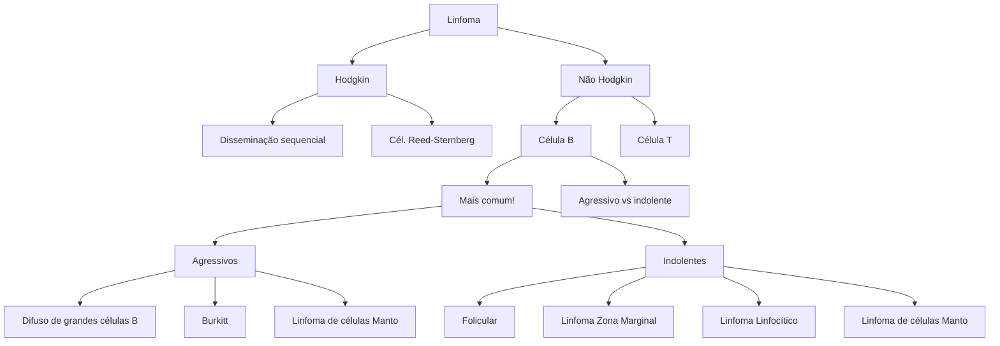
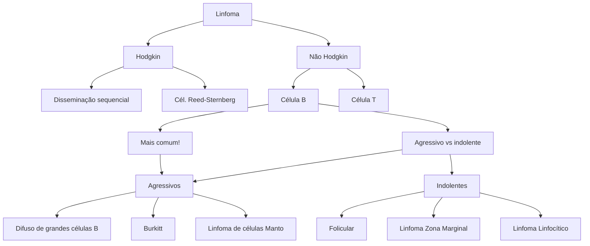

# LINFOMAS: BÁSICO

## Quando investigar linfonodomegalia?

• > 1 cm | Investigar se > 4 semanas. Avaliar: tamanho; localização; número; mobilidade; consistência; sintomas B; quadros infecciosos associados; viagens recentes

## Linfomas: Hodgkin e não Hodgkin

• Diagnóstico é com a biópsia EXCISIONAL do gânglio suspeito
• Estadiamento Ann-Arbor

## LH: Célula de Reed-Sternberg (olhos de coruja)

• Clássico e não clássico. Acomete mais cadeias cervicais. Pico bimodal (20 e 70 anos) FR: infecções virais (HIV, EBV...), imunossupressão crônica e doenças autoimunes

## LNH:

• é o subtipo mais comum dos linfomas. É dividido em células B (mais comum) e células T | agressivos e indolentes

## Linfomas B:

• Agressivos: linfoma difuso de grandes células B e Linfoma de Burkitt
• Indolentes: linfoma folicular

# 1. SISTEMA LINFÁTICO

• Responsável pela nossa defesa
• Timo

**Composto pelos**
• Linfonodos
• Órgãos linfóides

• Baço
• Tonsilas palatinas
• Apêndice

# 2. INVESTIGAÇÃO DE LINFONODOMEGALIA

## Quando

• Palpáveis (> 1cm)
• Sem causa óbvia aparente
• Devem SEMPRE serem investigados! → Principalmente de excederem 3 semanas

## Anamnese

• Tamanho
• Volume
• Localização
• Número
• Associação com sintomas B
• Quadros infecciosos
• Viagens recentes

## Benignos X Malignos

**Infecções**

• Bacterianas
  • Estreptococcose
  • Doença da arranhadura do gato
  • Difteria
  • Doença de Lyme

• Viral
  • HIV
  • EBV
  • HSV
  • CMV
  • HBV
  • Dengue
• Outras
  • Micobacterioses
  • Fungos (Histoplasmose, coccidioidomicose, criptococose)
  • Protozoários (toxoplasma e leishmania)

**Neoplasias**

• Tanto hematológicas, como linfomas, como metástases de neoplasias de órgãos sólidos

**Outras**

• Doença IgG4, Sarcoidose, Amiloidose, Histiocitose, doença de Castleman, LES, AR, doença de Still, etc.

# 3. EPSTEIN-BARR VÍRUS (EBV)

• Vírus da família Herpesvírus
• Maioria das infecções primárias são subclínicas
• Cerca de 90 - 95% dos adultos no Brasil são soropositivos para EBV

• Mononucleose infecciosa
  • Mal estar
  • Cefaleia
  • Febre
  • Esplenomegalia
  • Amigdalite

• LNM cervicais dolorosas
• Linfocitose atípica (!!)
• Pode ocorrer ruptura esplênica
• Pode persistir assintomático durante toda a vida
• Oncovírus que aumenta risco de neoplasias devido inflamação crônica
  • Linfoma de Burkitt

• Linfoma não Hodgkin em pacientes HIV+
• Linfoma de Hodgkin
• Linfoma em pacientes pós transplante
• Carcinoma Nasofaríngeo
• Carcinoma gástrico
• Linfoma de células T

## 4. LINFOMAS



## 5. LINFOMA DE HODGKIN

• Representa cerca de 10% de todos os linfomas
• Geralmente se apresentam como LNM dolorosas cervicais
• Sintomas B e prurido são frequentes
  • Pode ocorrer também dor em região de linfonodo com ingestão de álcool (não tão frequente na prática clínica)
• Maioria dos pacientes são curados com QT
• Distribuição bimodal
  • 1º pico → ~20 anos
  • 2º pico → ~70 anos
• Neoplasia derivada de linfócitos B
• Célula maligna → Reed-Sternberg (olhos de coruja)
  • Expressam CD30, CD15 e PAX-5

**Dividido em:**
• Clássico → > 90% dos casos
• Não clássico

**Fatores de risco conhecidos**
• Infecções virais
  • HIV
  • EBV
• Imunossupressão crônica
• Doenças autoimunes

Fonte: Case courtesy of Henry Knipe, Radiopaedia.org, rID: 40775

**Diagnóstico**
• Biópsia EXCISIONAL do gânglio

LINFOMAS: BÁSICO                                                                                                                                    3

## Estadiamento → Ann-Arbor

**Estágio I** | **Estágio II** | **Estágio III** | **Estágio IV**

• Estágio I: 1 cadeia linfonodal acometida
• Estágio II: > 1 cadeias linfonodais acometidas mas ambas do mesmo lado do diafragma

• Estágio III: > 1 cadeias linfonodais acometidas em lados diferentes do diafragma
• Estágio IV: Linfonodos e acometimento extra-nodal
  • Fígado, Rim, pele, MO...

## 6. LINFOMA NÃO-HODGKIN (LNH)

### 6.1 Difuso de Grandes Células B (LNHDGCB)

• Representa 30% dos LNH
• Subtipo mais comum de linfomas
• Linfoma agressivo
• Idade média ao diagnóstico de 60 anos
• Estadiamento por Ann-Arbor

**Escore prognóstico IPI**
• Estadio
• ECOG
• DHL
• Idade
• Extranodal

**Tratamento**
• QT de alta intensidade → R-CHOP em 6 ciclos
  • Rituximab
  • Ciclofosfamida
  • Doxorrubicina
  • Vincristina
  • Prednisona

### 6.2 Linfoma de Burkitt

• Subtipo de LNH
• Altamente agressivo
• Altíssimo turnover celular
• Muito associada com Síndrome de Lise tumoral espontânea
• Anatomopatológico descreve padrão de "céu estrelado"

Fonte: https://www.scielo.br/j/rbhh/a/rjg3xjn4Q9b4hcbgGnVpWhG/

## DIVIDIDO EM 3 SUBTIPOS

```mermaid
graph LR
    A[Linfoma de Burkitt] --> B[Dividido em 3 subtipos]
    B --> C[Associado ao HIV]
    C --> D[25% relacionado ao EBV]
    B --> E[Africana endêmica]
    E --> F[100% associado ao EBV]
    E --> G[Mais comum em crianças]
    E --> H[Massas na região da face]
    B --> I[Esporádico]
    I --> J[15 - 20% relacionados ao EBV]
    I --> K[Linfoma mais comum em crianças]
    I --> L[t(8;14)]
    I --> M[Massas abdominais]
```

## 6.3 Linfoma Não-Hodgkin Folicular

• Linfoma indolente
• 2º subtipo de LNH mais comum → 35% dos casos
• Idade média ao diagnóstico de 65 anos
• Geralmente LNM indolores e massas abdominais → Diagnóstico somente quando há alguma compressão
• 15% dos casos podem transformar para linfomas agressivos
• Trata-se de uma doença crônica
• Escore prognóstico é o FLIPI
  • Idade > 60 anos
  • Envolvimento MO
  • Hb < 12
  • LNM > 6 cm
  • B2 micro > LSN
• Tratamento apenas se sintomático → Mais realizado é o Watch and Wait

## 6.4 Resumo dos LNH

• LNH Difuso de Grandes Células B
  • Forma mais comum
  • Agressivo
  • Tratamento com QT
• Linfoma de Burkitt
  • Altamente agressivo
  • AP: Céu estrelado
  • Tratamento com QT
• Linfoma Folicular
  • Indolente
  • 2º linfoma mais comum
  • Tratar apenas se sintomas
  • Watch and Wait

# LINFOMAS: AVANÇADO

## Quando investigar linfonodomegalia?
• > 1cm | Investigar se >4 semanas. Avaliar tamanho; localização; número; mobilidade; consistência; sintomas B; quadros infecciosos associados; viagens recentes.

## Linfomas: Hodgkin e Não-Hodgkin
• Diagnóstico é com a biópsia EXCISIONAL do gânglio suspeito.
• Estadiamento Ann-Arbor

## LH: Célula de Reed-Sternberg
• Clássico e não clássico. Acomete mais cadeias cervicais. Pico bimodal (20 e 70 anos). FR: infecções virais (HIV, EBV...), imunossupressão crônica e doenças autoimunes.

## LNH: é o subtipo mais comum dos linfomas. É dividido em células B (mais comum) e células T | Agressivos e indolentes.
• **Linfomas B:** Agressivos: Linfoma difuso de grandes células B e Linfoma de Burkitt | Indolentes: Linfoma Folicular.
• **Linfoma da zona do manto:** pode ser indolente ou agressivo. Sua marca é a presença da t(11;14).

# 1. SISTEMA LINFÁTICO

• Responsável pela nossa defesa

**Composto pelos**
• Linfonodos

• Órgãos linfóides
  • Timo
  • Baço
  • Tonsilas palatinas
  • Apêndice

# 2. INVESTIGAÇÃO DE LINFONODOMEGALIA

## Quando
• Palpáveis (> 1cm)
• Sem causa óbvia aparente
• Devem SEMPRE serem investigados! → Principalmente de excederem 3 semanas

## Anamnese
• Tamanho
• Volume
• Localização
• Número
• Associação com sintomas B
• Quadros infecciosos
• Viagens recentes

## Benignos X Malignos

## Infecções
• Bacterianas
  • Estreptococcose
  • Doença da arranhadura do gato
  • Difteria
  • Doença de Lyme

## Viral
• HIV
• EBV
• HSV
• CMV
• HBV
• Dengue

## Outras
• Micobacterioses
• Fungos (Histoplasmose, coccidioidomicose, criptococose)
• Protozoários (toxoplasma e leishmania)

## Neoplasias
• Tanto hematológicas, como linfomas, como metástases de neoplasias de órgãos sólidos

## Outras
• Doença IgG4, Sarcoidose, Amiloidose, Histiocitose, doença de Castleman, LES, AR, doença de Still, etc.

# 3. EPSTEIN-BARR VÍRUS (EBV)

• Vírus da família Herpesvírus
• Maioria das infecções primárias são subclínicas

• Cerca de 90 - 95% dos adultos no Brasil são soropositivos para EBV

• Mononucleose infecciosa
  • Mal estar
  • Cefaleia
  • Febre
  • Esplenomegalia
  • Amigdalite
  • LNM cervicais dolorosas
  • Linfocitose atípica (!!)
  • Pode ocorrer ruptura esplênica
• Pode persistir assintomático durante toda a vida

• Oncovírus que aumenta risco de neoplasias devido inflamação crônica
  • Linfoma de Burkitt
  • Linfoma não Hodgkin em pacientes HIV+
  • Linfoma de Hodgkin
  • Linfoma em pacientes pós transplante
  • Carcinoma Nasofaríngeo
  • Carcinoma gástrico
  • Linfoma de células T

## 4. LINFOMAS



## 5. LINFOMA DE HODGKIN

• Representa cerca de 10% de todos os linfomas
• Geralmente se apresentam como LNM dolorosas cervicais
• Sintomas B e prurido são frequentes
  • Pode ocorrer também dor em região de linfonodo com ingestão de álcool (não tão frequente na prática clínica)
• Maioria dos pacientes são curados com QT
• Distribuição bimodal
  • 1º pico → ~20 anos
  • 2º pico → ~70 anos
• Neoplasia derivada de linfócitos B
• Célula maligna → Reed-Sternberg (olhos de coruja)
  • Expressam CD30, CD15 e PAX-5

[Microscopic image showing Reed-Sternberg cells among lymphocytes]

Fonte: Case courtesy of Henry Knipe, Radiopaedia.org, rID: 40775

**Dividido em:**
• Clássico → > 90% dos casos
• Não clássico

**Fatores de risco conhecidos**
• Infecções virais

LINFOMAS: AVANÇADO                                                                                                                                    3

• HIV
• EBV
• Imunossupressão crônica
• Doenças autoimunes

**Diagnóstico**
• Biópsia EXCISIONAL do gânglio

**Estadiamento → Ann-Arbor**

[Four anatomical diagrams showing lymph node involvement patterns across the body, labeled as Estágio I through Estágio IV, with progressive involvement of lymph nodes and organs]

**Estágio I**                    **Estágio II**                    **Estágio III**                    **Estágio IV**

• Estágio I: 1 cadeia linfonodal acometida
• Estágio II: > 1 cadeias linfonodais acometidas mas ambas do mesmo lado do diafragma

• Estágio III: > 1 cadeias linfonodais acometidas em lados diferentes do diafragma
• Estágio IV: Linfonodos e acometimento extra-nodal
  • Fígado, Rim, pele, MO...

## 6. LINFOMA NÃO-HODGKIN (LNH)

### 6.1 Difuso de Grandes Células B (LNHDGCB)

• Representa 30% dos LNH
• Subtipo mais comum de linfomas
• Linfoma agressivo
• Idade média ao diagnóstico de 60 anos
• Estadiamento por Ann-Arbor

**Escore prognóstico IPI**
• Estadio
• ECOG
• DHL
• Idade
• Extranodal

**Tratamento**
• QT de alta intensidade → R-CHOP em 6 ciclos
• Rituximab
• Ciclofosfamida
• Doxorrubicina
• Vincristina
• Prednisona

**Cardiotoxicidade induzida por Quimioterapia**
• Múltiplos potenciais causadores, em especial Antracíclicos
  • Doxorrubicina / Daunorrubicina / Idarrubicina
  • Dose cumulativa → sempre fazer cálculo de dose prévia
  • Estresse oxidativo dos cadiomiócitos
  • Manejo de IC

**OBS:**
• Doxorrubicina
  • Antraciclina
  • Cardiotoxicidade
  • Dose-dependente
• Transtuzumab
  • Ac. monoclonal anti-HER2
  • Potencial cardiotoxicidade
  • Menos comum
• Ciclofosfamida
  • Agente Alquilante
  • Toxicidade hematológica é mais comum
  • < 1% e cardiotoxicidade
• Rituximab
  • Ac. Monoclonal
  • Anti-CD20
  • Efeitos adversos mais relacionados a reações infusionais e imunossupressão

## 6.2 Linfoma de Células do Manto

**Subtipo de LNH (indolente ou agressivo)**
- Corresponde a cerca de 7% dos LNH
- Mais frequente em idosos e no sexo masculino
- Os pacientes geralmente apresentam doença em estágio avançado (70-80% dos casos)

**Forma leucêmica → Linfocitose em sangue periférico**
- Linfócitos pequenos com expressão de CD5+
- Semelhante a LLC

**Marca da doença → t(11;14)**
- Envolve o rearranjo de uma cadeia pesada de imunoglobulina e CCND1 (gene que codifica a ciclina D1)

- Superexpressão da ciclina D1 que gera a doença

## 6.3 Linfoma de Burkitt

- Subtipo de LNH
- Altamente agressivo
- Altíssimo turnover celular
- Muito associada com Síndrome de Lise tumoral espontânea
- Anatomopatológico descreve padrão de "céu estrelado"

Fonte: https://www.scielo.br/j/rbhh/a/rjg3xjn4Q9b4hcbgGnVpWhG/

### DIVIDIDO EM 3 SUBTIPOS

```mermaid
graph TD
    A[Linfoma de Burkitt] --> B[Dividido em 3 subtipos]
    B --> C[Associado ao HIV]
    C --> C1[25% relacionado ao EBV]
    B --> D[Africana endêmica]
    D --> D1[25% relacionado ao EBV]
    D --> D2[25% relacionado ao EBV]
    D --> D3[25% relacionado ao EBV]
    B --> E[Esporádico]
    E --> E1[15 - 20% relacionados ao EBV]
    E --> E2[Linfoma mais comum em crianças]
    E --> E3[t(8;14)]
    E --> E4[Massas abdominais]
```

LINFOMAS: AVANÇADO                                                                5

## 6.4 Linfoma Não-Hodgkin Folicular

• Linfoma indolente
• 2º subtipo de LNH mais comum → 35% dos casos
• Idade média ao diagnóstico de 65 anos
• Geralmente LNM indolores e massas abdominais → Diagnóstico somente quando há alguma compressão
• 15% dos casos podem transformar para linfomas agressivos
• Trata-se de uma doença crônica
• Escore prognóstico é o FLIPI
  • Idade > 60 anos
  • Envolvimento MO
  • Hb < 12
  • LNM > 6 cm
  • B2 micro > LSN
• Tratamento apenas se sintomático → Mais realizado é o Watch and Wait

## 6.5 Linfoma Não-Hodgkin de Zona Marginal

• Linfoma raro → < 1% dos linfomas indolentes
• Esplenomegalia + Linfocitose
• MALT gástrico é o mais comum
• Geralmente relacionado com:
  • H. pylori
  • Hepatite C
  • Tireoidite de Hashimoto
  • Pneumopatia Intersticial
• Não tem marcadores específicos → CD20 é expresso em todos os linfomas de células B(!!)

## 6.6 Resumo dos LNH

**LNH Difuso de Grandes Células B**
• Forma mais comum
• Agressivo
• Tratamento com QT

**Linfoma de Burkitt**
• Altamente agressivo
• AP: Céu estrelado
• Tratamento com QT

**Linfoma Folicular**
• Indolente
• 2º linfoma mais comum
• Tratar apenas se sintomas
• Watch and Wait
