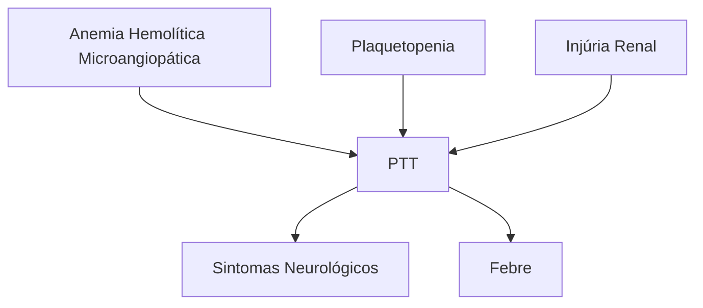

# PÚRPURA TROMBOCITOPÊNICA TROMBÓTICA (PTT)

| **Microangiopatia Trombótica (MAT)**                                                                                                                                                                                    |                                                                                                                                                                                                                                                                            |
| ----------------------------------------------------------------------------------------------------------------------------------------------------------------------------------------------------------------------- | -------------------------------------------------------------------------------------------------------------------------------------------------------------------------------------------------------------------------------------------------------------------------- |
| • Anemia hemolítica (com esquizócitos)
• Disfunção orgânica
• Plaquetopenia
**Púrpura Trombocitopênica Trombótica (PTT)**
• Deficiência de ADAMTS13
• MAT (ESQUIZÓCITOS!!!)
• Pêntade clássica: | • MAT + IRA + plaquetopenia + febre + sintomas neurológicos
• **Diagnóstico:**
• Dosagem atividade ADAMTS13 (<10%)
• PLASMIC score (se dosagem da enzima indisponível)
• **Tratamento:**
• Plasmaférese (FUNDAMENTAL!!)
• Corticoide +/- rituximab |

## 1. MICROANGIOPATIAS TROMBÓTICAS

**Existem diversas situações clínicas que cursam com microangiopatia trombótica**

É representada pela presença de:
- Disfunção orgânica;
- Plaquetopenia.
- Anemia hemolítica (microangiopática).
  - A microangiopatia é definida pela presença dos esquizócitos na hematoscopia;

**As causas mais comuns de MAT (microangiopatias trombóticas) apresentam algumas características, a depender de sua origem**
- Hereditárias ou adquiridas;
- Podem acometer crianças ou adultos;
- Demonstram evolução insidiosa ou agressiva.

**Principais microangiopatias**
- PTT – Púrpura Trombocitopênica Trombótica;
- Síndrome hemolítico-urêmica atípica (SHUa) ou SHU;
- Microangiopatia induzida por drogas;
- Associada ao transplante;
- Associada ao câncer;
- CIVD - coagulação intravascular disseminada;
- Hipertensão severa (maligna);
- Associada aos quadros de pré-eclâmpsia grave, eclâmpsia e síndrome HELLP.

**Origem das malhas, na formação dos esquizólitos**
- Há a formação das malhas/rede de fibrinas, que obstrui a passagem das hemácias;
- Sendo assim, a membrana da hemácia é fragmentada (observe a imagem à direita, na seta), dando origem aos esquizócitos.

**Figura 1** Imagem de microcopia eletrônica demonstrando a rede de fibrina e a fragmentação das hemácias, gerando os esquizócitos que são característicos das microangiopatias trombóticas.

**Figura 2** Hematoscopia de paciente com MAT, observe nas setas a presença dos esquizócitos.

## 2. PROVAS DE HEMÓLISE

- A redução da massa eritroide, na medula saudável, provoca a compensação por parte da medula óssea. Ou seja, há um estímulo medular para que se aumente a produção de células vermelhas;
  - Tais células são liberadas na circulação periférica, mesmo que ainda estejam imaturas, na forma de reticulócitos → **reticulocitose (> 2% ou > 100 mil)**.
- Além disso, existe a hemoglobina livre no plasma, que promove o **consumo da haptoglobina**;
- A lesão da membrana provoca o **aumento de DHL**;
- E por fim, associado ao processo, também há o **aumento de bilirrubina indireta**, por esse ser um dos componentes intracelulares da hemácia.

| **Reticulocitose
(2% ou 100 mil)** | **Consumo de
Haptoglobina**             |
| -------------------------------------- | ------------------------------------------- |
| **Aumento de
DHL**                 | **Aumento de
Bilirrubina
Indireta** |

**Figura 3** Tétrade clássica da anemia hemolítica, composta por reticulocitose, consumo de haptoglobina, aumento de DHL e aumento de bilirrubina indireta.

HEMATOLOGIA

# 3. PÚRPURA TROMBOCITOPÊNICA TROMBÓTICA

## 3.1 INTRODUÇÃO E CONCEITOS:

• É uma anemia hemolítica microangiopática. Ou seja, demonstra a presença de **esquizócitos** em sangue periférico;
• Além disso, apresenta o teste de COOMBS direto negativo;
• É uma doença rara e grave;
  • A mortalidade pode alcançar níveis próximos a 90%, se não for instituído o tratamento adequado, de forma rápida.
• De modo geral, cursa com trombose nos capilares e nas arteríolas terminais;
  • Sendo assim, há uma alta ocorrência de lesão renal e de microvasos.
• O cerne da doença se concentra na deficiência da metaloprotease ADAMTS13, que tem o papel de clivar o Fator de Von Willebrand de alto peso molecular em diversos multímeros;
  • Neste sentido, a permanência dos multímeros de alto peso, agora não clivados, causa o quadro típico da doença, já que são altamente pró-trombóticos.
• É uma doença adquirida em até 95% dos casos.

## 3.2 MECANISMO FISIOLÓGICO

• O processo normal:
  • A enzima ADAMTS13 se conecta ao FvW de alto peso molecular, e o cliva em vários multímeros, que ficam livres no citoplasma.
• O processo patológico:
  • Na PTT, existem auto-anticorpos que impedem a clivagem do FvW através da enzima ADAMTS13;
  • Sendo assim, há a formação de agregados plaquetários e microtromboses na circulação.

**Perceba que a enzima ADAMTS13 apresenta um papel fundamental em todo o processo patológico. Logo, o diagnóstico é direcionado para 2 pontos**

• Dosagem dos anticorpos anti-ADAMTS13;
• Atividade da enzima ADAMTS13 < 10% - Importante no diagnóstico e no prognóstico.

**Presente em < 5% dos casos!**

**Figura 4** Pêntade clássica da PTT (anemia hemolítica microangiopática, plaquetopenia, injúria renal, sintomas neurológicos e febre).

## 3.3 MANIFESTAÇÕES CLÍNICAS

• Pêntade clássica:
• Presente em < 5% dos casos. **Figura 4**

## 3.4 DIAGNÓSTICO

• Dosagem dos anticorpos anti-ADAMTS13;
• Confirma o diagnóstico quando a atividade da enzima ADAMTS13 < 10%;
• Exame não é universalmente disponível;
• Em vista de que o resultado pode demorar até 7-10 dias.
• A PTT é uma doença que exige início do **tratamento imediato**, a partir da suspeita. Pensando neste contexto, foi criado o PLASMIC SCORE, que estima o risco da ocorrência da doença;
• O escore somente pode ser utilizado se:
  • plaquetas < 150 mil; esquizócitos presentes no sangue periférico;
  • Critérios: confira na **Tabela 1**
• Resultados: 0-4 pontos: baixo risco; 5 pontos: risco intermediário; 6-7 pontos: alto risco;
• Apresenta um **alto valor preditivo negativo.**

## 3.5 TRATAMENTO

**É baseado em 2 pilares principais:**

• Plasmaférese:
  • É capaz de remover o anticorpo anti-ADAMTS13;
  • Além disso, fornece ADAMTS13 de reposição;
  • É fundamental no tratamento dos pacientes, devendo ser iniciada do modo mais precoce possível;
• Imunossupressão:
  • Reduz a produção de novos anticorpos;
  • Pode ser realizada com a utilização de corticoide, de modo isolado, ou, a depender do serviço, pode ser acrescido do uso de Rituximab.

**Tabela 1** PLASMIC score foi desenvolvido para estimar o risco de estarmos diante de um paciente com PTT, especialmente em casos que não temos acesso fácil a dosagem da atividade de ADAMTS13.

| P | platelet count                                  | contagem plaquetária → **plaquetas < 30mil**                                               |
| - | ----------------------------------------------- | ------------------------------------------------------------------------------------------ |
| L | hemolysis                                       | hemólise → **reticulócitos 2,5% haptoglobina indetectável; bilirrubina indireta > 2mg/dL** |
| A | absence of active cancer                        | ausência de câncer ativo                                                                   |
| S | ascence of stem-cell or solid-organ transplasnt | ausência de transplante de medula óssea e de orgão sólido                                  |
| M | MCV                                             | valor do VCM → **vcm < 90**                                                                |
| I | INR                                             | INR < 1,5                                                                                  |
| C | Creatinine                                      | dosagem de creatinina → **Cr < 2mg/ dL**                                                   |

PÚRPURA TROMBOCITOPÊNICA TROMBÓTICA (PTT)# REFERÊNCIA

**Figura 1** Imagem de microcopia eletrônica demonstrando a rede de fibrina e a fragmentação das hemácias, gerando os esquizócitos que são característicos das microangiopatias trombóticas.

Fonte: https://www.semanticscholar.org/paper/The-production-of-schistocytes-by-fibrin-strands-(a-Bull-Kuhn/ff00e76ba1b4790eb5756c96cff03424adf57f22

**Figura 2** Hematoscopia de paciente com MAT, observe nas setas a presença dos esquizócitos.

Fonte: https://fr.wikipedia.org/wiki/Schizocyte

**Figura 3** Tétrade clássica da anemia hemolítica, composta por reticulocitose, consumo de haptoglobina, aumento de DHL e aumento de bilirrubina indireta.

**Figura 4** Pêntade clássica da PTT (anemia hemolítica microangiopática, plaquetopenia, injúria renal, sintomas neurológicos e febre).
