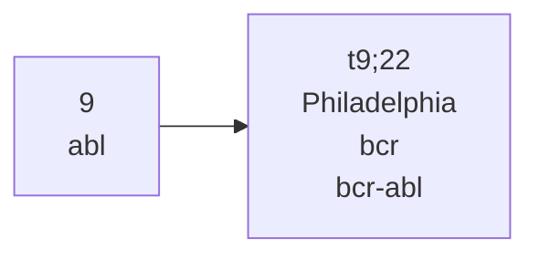
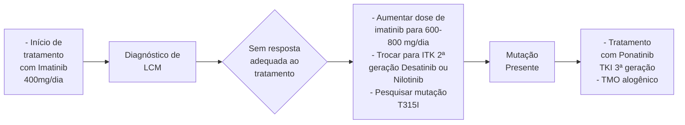

# SÍNDROMES MEDULARES

| **Neoplasias Mieloproliferativas Crônicas (NMPC):**
mutações JAK2 \| CALR \| MPL
**Policitemia Vera (PV):** homens: Hb >16,5 g/dL ou Ht >49% \| mulheres: Hb >16,0 g/dL \| Ht >48%
• Não esquecer de afastar as causas secundárias de poliglobulia (DPOC, SAHOS, uso de testosterona...)
• Diagnóstico: 3 critérios maiores OU 2 primeiros critérios maiores + critério menor
**Trombocitemia Essencial (TE):** plaquetose \| alto risco trombótico
• Diagnóstico: presença dos 4 critérios maiores OU 3 critérios maiores + critério menor
**Mielofibrose (MF):** presença de dacriócitos \| esplenomegalia \| anemia
• Diagnóstico: presença dos 3 critérios maiores + 1 critério menor | • Tratamento é guiado pela estratificação de risco (de transformação para LMA)
**Leucemia Mielóide Crônica (LMC):** Cromossomo Philadelphia (Ph) - t(9;22) - BCR-ABL
• Leucocitose com desvio escalonado para esquerda e basofilia (> 2%) >> Diferenciar de reação leucemoide!
• Esplenomegalia, fadiga e perda de peso são frequentes
• Fases: crônica \| acelerada \| crise blástica
• Tratamento: Imatinib
**Síndrome Mielodisplásica (SMD):**
• Neoplasia hematológica com citopenias (neutrófilos < 1.800/mm3 \| Hb <10 g/dL \| plaquetas <100.000/mm3) e dispoese. Geralmente anemia macrocítica
• Tratamento: TMO ou controle de sintomas |
| ------------------------------------------------------------------------------------------------------------------------------------------------------------------------------------------------------------------------------------------------------------------------------------------------------------------------------------------------------------------------------------------------------------------------------------------------------------------------------------------------------------------------------------------------------------------------------------------------------------------------------------------------------------------------------------------------------------------------- | -------------------------------------------------------------------------------------------------------------------------------------------------------------------------------------------------------------------------------------------------------------------------------------------------------------------------------------------------------------------------------------------------------------------------------------------------------------------------------------------------------------------------------------------------------------------------------------------------------------------------------------------------------------------------------- |

## 1. CONSIDERAÇÕES INICIAIS

**Neoplasias Mieloproliferativas Crônicas (NMPC);**

• 4 síndromes principais:
  • Policitemia Vera;
  • Trombocitemia essencial;
  • Mielofibrose;
  • Leucemia mieloide crônica.
• São relacionadas com mutações drivers nos genes: JAK2, CALR e MPL.

## 2. POLICITEMIA VERA

### 2.1 É uma neoplasia mieloproliferativa crônica

• Observa-se uma proliferação clonal de células mieloides, afetando a hematopoiese;
• Assim, ocorre aumento da massa eritroide (com elevação da hemoglobina e hematócrito);
• Tende a ser mais comum em indivíduos idosos (> 60 anos de idade) e na população masculina

OBS.: cefaleia, alterações visuais, prurido aquagênico e eritromelalgia são bem controlados com uso de AAS.

### 2.2 A maioria dos diagnósticos se dá de modo incidental, pela identificação da poliglobulia

### 2.3 Quadro clínico

• Cefaleia;
• Alterações visuais;
• Prurido "aquagênico";
  • Por exemplo, pode ser observado prurido após banho quente.
• Eritromelalgia;
  • Queimação e rubor, principalmente em extremidades (mãos e pés).
• Tromboses – incluindo AVC e IAM;
• Leucocitose;
• Plaquetose;
• Esplenomegalia.

### 2.4 Diagnóstico

• A suspeição deve ocorrer na presença dos seguintes fatores:
  • Homens; Hb > 16,5 g/dL; Ht > 49%.
  • Mulheres; Hb > 16,0 g/dL; Ht > 48%.
  • Tromboses de sítios atípicos;
  • Prurido aquagênico;
  • Pletora facial;
  • Esplenomegalia;
  • Leucocitose e trombocitose;
  • Sintomas microvasculares.
• Causas para policitemia secundária:
  • DPOC;
  • SAHOS;
  • Uso de testosterona;
  • Síndrome de PickWick;
  • Moradores de altas altitudes;
  • Tumores produtores de EPO – CHC, carcinoma renal, hemangioblastoma, feocromocitoma;
  • Toxicidade por cobalto;
  • Síndrome de POEMS.

HEMATOLOGIA

• Exames complementares:
  • Dosagem sérica de EPO;
  • Pesquisa da mutação de JAK2-V617F em sangue periférico.
• Critérios diagnósticos:
  • O estabelecimento do diagnóstico é dado pela presença dos 3 critérios maiores OU 2 primeiros critérios maiores + critério menor;
  • Critérios maiores; Hb > 16,5 g/dL (homem) ou > 16 g/dL (mulher) OU Ht > 49% (homem) ou > 48% (mulher); medula óssea com proliferação das 3 linhagens e megacariócitos pleomórficos; denomina-se como panmielose. Presença da mutação JAK2;

• Critérios menores; EPO reduzida; 85% dos pacientes com Policitemia Vera possuem EPO baixa.

## 2.5 Tratamento

• Objetivo: alcançar níveis de hematócrito ~ 45%, tanto para homens ou mulheres.
  • Sangria;
  • Hidroxiureia;
  • Associação com AAS – para redução de viscosidade sanguínea e melhora dos sintomas microvasculares.

# 3. TROMBOCITEMIA ESSENCIAL

## 3.1 Considerações importantes

• Ocorre pela ativação constante dos receptores de TPO – trombopoetina;
• Assim, observa-se uma plaquetogênese intensa.
  • Contudo, não é comum quadro de anemia/ poliglobulia e leucocitose.

## 3.2 Epidemiologia

• É mais prevalente em comparação à Policitemia Vera;
• A idade média, para o diagnóstico, é de cerca de 60 anos, com maior acometimento da população feminina;
• Está relacionada a eventos trombóticos e hemorrágicos;
• Aproximadamente 90% dos pacientes apresentam a mutação no gene JAK2-V617F.
  • Contudo, ainda há mutação do gene CARL em 20 - 25% e do gene MPL em 5%.

## 3.3 Manifestações clínicas

• 50% dos pacientes são assintomáticos, com diagnóstico acidental;
• Aos sintomáticos:
  • Plaquetose; universal; a mutação no gene CARL favorece maiores níveis de plaquetas, com menor risco associado de trombose; em casos de plaquetose secundária, tem-se como possíveis causas: ferropenia; infecções; inflamação; esplenomegalia; trauma;
  • Esplenomegalia; 50% dos pacientes já cursam com o quadro no momento do diagnóstico. Ainda, note que linfonodomegalia e hepatomegalia são incomuns;
  • Sintomas vasomotores; pode cursar com cefaleia, lipotimia, parestesia acral...

## 3.4 Diagnóstico

• O estabelecimento do diagnóstico é dado pela presença dos 4 critérios maiores OU 3 critérios maiores + critério menor;

• Critérios maiores;
  • Plaquetas > 450.000/mm3;
  • Medula óssea com aumento de megacariócitos atípicos;
  • Não estabelecimento de critérios para leucemia mieloide crônica, Policitemia Vera, Síndrome Mielodisplásica e mielofibrose;
  • Presença de JAK2, CARL ou MPL.
• Critério menor:
  • Ausência de causa secundária de trombocitose.

## 3.5 Estratificação de risco

• *International Prognostic Score of Thrombosis in World Health Organization Essential Thrombocythemia (IPSET-thrombosis).*

| Muito baixo              | Baixo risco              | Risco intermediário      | Alto risco                             |
| ------------------------ | ------------------------ | ------------------------ | -------------------------------------- |
| Idade ≤ 60 anos          | Idade ≤ 60 anos          | Idade > 60 anos          | Idade > 60 anos                        |
| Sem mutação JAK2 +       | Com mutação JAK2+        | Sem mutação JAK2 +       | Com mutação JAK2+                      |
| Sem história de trombose | Sem história de trombose | Sem história de trombose | História de trombose em qualquer idade |

## 3.6 Tratamento

• Objetivo: aliviar os sintomas e minimizar complicações;
• Meta: alcançar níveis de plaquetas entre 100-400 mil.
  • Interferon;
  • Hidroxiureia;
  • AAS.

SÍNDROMES MEDULARES                                                                                                       3

## 4. MIELOFIBROSE

### 4.1 Epidemiologia

• Dentre as síndromes mielodisplásicas, é a mais rara;
• Pode ser primária ou secundária a Policitemia Vera e Trombocitemia Essencial;
• A idade média, ao diagnóstico, é de 67 anos.

### 4.2 Outras considerações

• Decorre de mutações nos genes JAK2, CARL ou MPL;
• Neste sentido, observa-se a presença de dacriócitos (hemácias em lágrima) no sangue periférico;
• Demonstra possível evolução para leucemia mieloide aguda;
• É uma doença de caráter extremamente inflamatório → o paciente é bastante sintomático!

### 4.3 Quadro clínico

• Fadiga extrema: 60 – 70%;
• Desconforto abdominal: 25 – 50%;
• Tromboses;
• Esplenomegalia maciça;
• Anemia, leucocitose e plaquetopenia.

### 4.4 Diagnóstico

• O estabelecimento do diagnóstico é dado pela presença dos 3 critérios maiores + 1 critério menor;
• Critérios maiores:
  • Megacariócitos anômalos acompanhados de fibrose medular grau ≥ 2;
  • Presença das mutações JAK2 ou CARL ou MPL;
  • Ausência de BCR-ABL.

• Critérios menores:
  • Anemia sem outra causa aparente;
  • Leucocitose > 11.000/mm3;
  • Esplenomegalia palpável;
  • Aumento de DHL;
  • Reação leucoeritroblástica.

### 4.5 Estratificação de risco

• *International Prognostic Scoring System (IPSS)*:
  • Avalia 5 variáveis independentes; idade > 65 anos; Hb < 10 g/dL; leucocitose > 25.000/mm3; blastos circulantes ≥ 1%; presença de sintomas constitucionais.
  • Interpretação: baixo risco → nenhum fator de risco; risco intermediário 1 → 1 fator de risco; risco intermediário 2 → 2 fatores de risco; alto risco → 3 ou mais fatores de risco.

### 4.6 Tratamento

• Alto risco:
  • Se elegível → TCTH – transplante de medula óssea alogênico;
  • Se inelegível → Jakavi – é um inibidor da mutação do JAK2.
• Risco intermediário:
  • Tratar de acordo com a sintomatologia → anemia, esplenomegalia, sintomas constitucionais.
• Baixo risco:
  • Assintomático → watch and wait;
  • Sintomático → tratar conforme os sintomas.

## 5. LEUCEMIA MIELOIDE CRÔNICA

### 5.1 Considerações importantes

• É uma síndrome mieloproliferativa devido à translocação que envolve os braços longos dos cromossomos 9 e 22;

Fonte: http://www.biomedicinabrasil.com/2017/10/leucemia-mieloide-cronica-e-cromossomo

• A t(9;22) leva à fusão dos 2 genes → formação do BCR-ABL;
  • Tal processo promove a ativação constante de uma enzima tirosino-quinase (TK);
  • Isso estimula a desregulação da proliferação e maturação dos granulócitos.

### 5.2 Epidemiologia

• Representa em torno de 15-20% das leucemias nos indivíduos adultos;
• A idade média, ao diagnóstico, é de 60 anos, com discreta prevalência para homens.

### 5.3 Manifestações clínicas

• Tome nota do seguinte!
  • O principal marco é a leucocitose com desvio escalonado para esquerda e basofilia (> 2%);
  • Ainda, esplenomegalia, fadiga e perda de peso são frequentes;
  • Podem estar associadas com anemia e plaquetose;

HEM

• Aproximadamente 50% dos pacientes são assintomáticos no momento do diagnóstico;
• Manifestações infrequentes: tromboses e hemorragias.
• Fases clínicas:
  • Crônica: mais de 90% dos pacientes se apresentam nesta fase;
  • Acelerada: medula óssea com 10-19% de blastos; ≥ 20% de basófilos; plaquetas < 100.000 ou > 1.000.000/mm3; esplenomegalia progressiva; evolução citogenética;
  • Crise blástica: ≥ 20% de blastos no sangue periférico ou na medula óssea; sarcoma mieloide: dá-se por um infiltrado de células blásticas extramedular.

## 5.4 Diagnóstico

• É muito importante diferenciar de reação leucemoide!!!

| Reação Leucemoide                                                                                                                                                                                                                                                                                                                                                                 | Leucemia Mieloide Crônica                                                                                                                                                                                                                                                        |
| --------------------------------------------------------------------------------------------------------------------------------------------------------------------------------------------------------------------------------------------------------------------------------------------------------------------------------------------------------------------------------- | -------------------------------------------------------------------------------------------------------------------------------------------------------------------------------------------------------------------------------------------------------------------------------- |
| • Geralmente < 50.000/mm³ leucócitos;
• Resolução após a condição desencadeante;
• Ausência de basofilia;
• Plaquetas normais ou baixas;
• Fosfatase alcalina elevada;
• Granulações tóxicas e vacúolos citoplasmáticos;
• Ausência do cromossomo Philadelphia;
• Causas: infecções bacterianas graves, necrose tecidual, TB, insuficiência hepática. | • Presença de sinais constitucionais;
• Geralmente > 50.000/mm³ leucócitos;
• Basofilia presente;
• Plaquetas normais ou aumentadas;
• Fosfatase alcalina normal ou diminuída;
• Ausência de granulações tóxicas;
• Presença do cromossomo Philadelphia. |

• O diagnóstico de LMC é dado na presença de;
  • Leucocitose com desvio escalonado para a esquerda;
  • Basofilia;
  • Esplenomegalia;
  • Presença de cromossomo Philadelphia.

## 5.5 Estratificação de risco

• SOKAL:
  • Esplenomegalia;
  • Percentual de blastos no sangue periférico;
  • Idade > 60 anos;
  • Contagem de plaquetas alterada.

## 5.6 Tratamento

• A descoberta dos inibidores de TK mudaram a história natural da doença.

# 6. SÍNDROME MIELODISPLÁSICA

## 6.1 Considerações iniciais

• É uma neoplasia hematológica, caracterizada pela hematopoiese clonal associada a citopenias;
• O risco de evolução para LMA depende das mutações envolvidas;
• A exposição prévia à quimioterapia, radioterapia, benzeno e tabagismo são fatores de risco amplamente conhecidos!
• A prevalência está relacionada com o aumento da idade, sendo mais frequente em indivíduos homens.

HEM

## 6.2 Quadro clínico

• As manifestações são muito variáveis!
  • Os sintomas estão diretamente relacionados com a citopenia envolvida!
  • Macrocitose (VCM > 100 fL) é bastante comum!
• Em geral, observa-se:
  • Fadiga;
  • Infecções;
  • Sangramentos;
  • Anemia → citopenia mais comum.

**OBS.: sintomas B são infrequentes!!**

## 6.3 Diagnóstico

• Proliferação monoclonal de células tronco-hematopoiética;

• Eritropoiese ineficaz;
  • isplasia em ≥ 10% das células por, pelo menos, 2 meses.
• Citopenias (no mínimo, 6 meses);
  • Neutrófilo < 1.800/mm3;
  • Hb < 10 g/dL;
  • Plaquetas < 100.000/mm3.
• Anormalidades genéticas importantes.

## 6.4 Estratificação de risco

• *International Prognostic Scoring:System-Revised (IPSS-R);*
  • 5 variáveis independentes: anormalidade citogênicas; Percentual de blastos na medula óssea; hemoglobina; plaquetas; neutrófilos.

**Table S10. Revised International Prognostic Scoring System (IPSS-R).\***

| Prognosticvariable                   | Scores to be assigned to variable values
0 | Scores to be assigned to variable values
0.5 | Scores to be assigned to variable values
1 | Scores to be assigned to variable values
1.5 | Scores to be assigned to variable values
2 | Scores to be assigned to variable values
3 | Scores to be assigned to variable values
4 |
| ------------------------------------ | ---------------------------------------------- | ------------------------------------------------ | ---------------------------------------------- | ------------------------------------------------ | ---------------------------------------------- | ---------------------------------------------- | ---------------------------------------------- |
| Cytogenetics
(Table S2)          | Very good                                      | -                                                | Good                                           | -                                                | Intermediate                                   | Poor                                           | Very
poor                                  |
| Bone marrow
blasts, %            | ≤2                                             | -                                                | >2% - <5%                                      | -                                                | 5% - 10%                                       | >10%                                           | -                                              |
| Hb, g/dL                             | ≥10                                            | -                                                | 8-<10                                          | <8                                               | -                                              | -                                              | -                                              |
| Platelet count,
10⁹/L            | ≥100                                           | 50-<100                                          | <50                                            | -                                                | -                                              | -                                              | -                                              |
| Absolute neutrophil
count, 10⁹/L | ≥0.8                                           | <0.8                                             | -                                              | -                                                | -                                              | -                                              | -                                              |

| IPSS-R prognostic risk category ¹⁶ | Total score | Median survival(years) | Median time for 25% of patients toundergo evolution to AML (years) † |
| ---------------------------------- | ----------- | ---------------------- | -------------------------------------------------------------------- |
| Very low (19% of all patients)     | ≤1.5        | 8.8                    | Not reached                                                          |
| Low (38% of all patients)          | >1.5 - 3    | 5.3                    | 10.8                                                                 |
| Intermediate (20% of all pts)      | >3 - 4.5    | 3.0                    | 3.2                                                                  |
| High (13% of all patients)         | >4.5 - 6    | 1.6                    | 1.4                                                                  |
| Very high (10% of all patients)    | >6          | 0.8                    | 0.7                                                                  |

| Dichotomization into lower-riskvs higher-risk MDS | Total score | Median survival(years) | Median time for 25% of patients toundergo evolution to AML (years) † |
| ------------------------------------------------- | ----------- | ---------------------- | -------------------------------------------------------------------- |
| Lower-risk MDS (63% of all pts)                   | ≤3.5        | 5.9                    | Not reached                                                          |
| Higher-risk MDS (37% of all pts)                  | >3.5        | 1.5                    | 1.4                                                                  |

\* Information is from Greenberg et al,¹⁶ Pfeilstöcker et al,³³ and Heinz Tuechler (personal communication).

† Time to leukemic transformation was calculated with "deaths without transformation" censored, not as a competing risk. Thus, the risk of transformation refers to a hypothetical population of patients not dying before leukemic transformation.

HEM

## 6.5 Tratamento

• O manejo é dado a partir da pontuação na estratificação de risco:
• Alto risco:
  • Se elegível → TCTH;
  • Se inelegível → Hipometilantes – melhoram a hematopoiese.

• Risco intermediário:
  • Tratar de acordo com a sintomatologia → anemia, plaquetopenia, neutropenia;
  • Avaliar realização de TCTH.
• Baixo risco:
  • Assintomático → watch and wait;
  • Sintomático → tratar conforme os sintomas.

## 7. ANEMIA APLÁSTICA

• É uma doença que representa uma falência medular;
• É de caráter autoimune;
• Causa pancitopenia em pacientes jovens;
• Apresenta-se como uma anemia macrocítica, com ausência de esplenomegalia;
• Diagnóstico:
  • Biópsia de medula óssea – hipocelularidade global.
• Tratamento:
  • Imunossupressão – conduta inicial;
  • Curativo → através de transplante de medula óssea.

<page_footer>
</page_footer>
