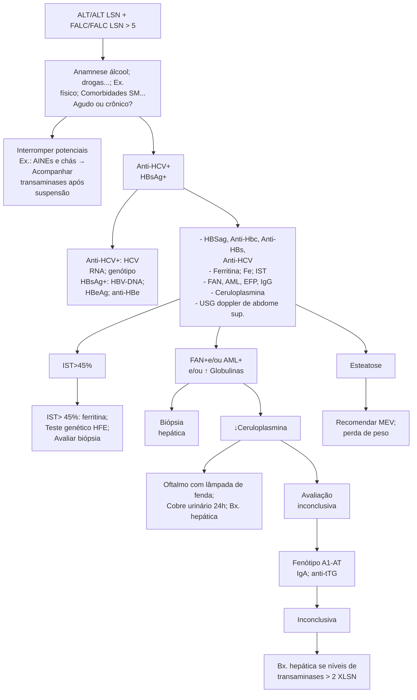
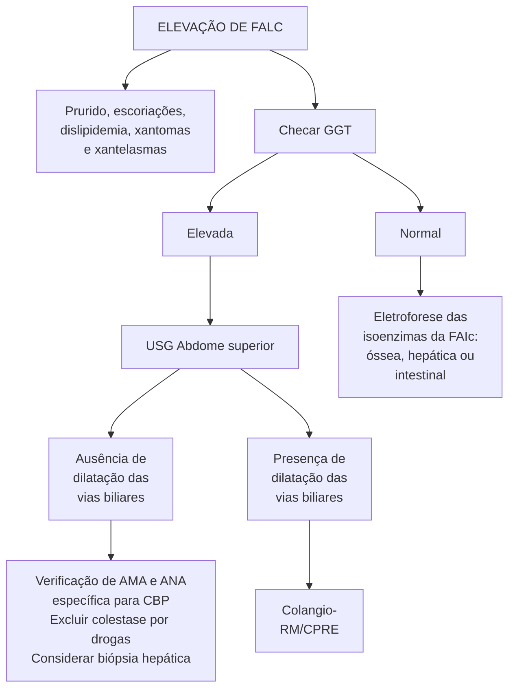
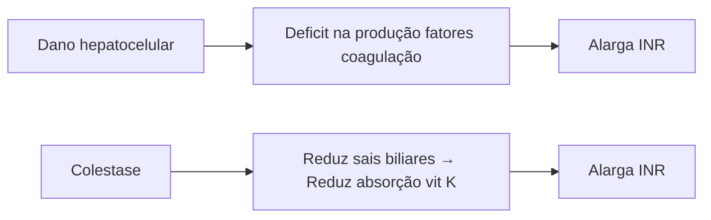

# ALTERAÇÃO DE ENZIMAS HEPÁTICAS, CBP, CEP, HAI E DOENÇA DE WILSON

| **↑ AST e ALT: hepatocelular**
• Álcool, MASLD, medicamentos, hepatites virais, HAI, hemocromatose, doença de Wilson.
**↑ FALC e GGT: colestase**
• Intra-hepática (sem dilatação de vias biliares: CBP, CEP, infiltração, medicamentos, sepse, NPT) ou Extra-hepática (com dilatação de vias biliares: coledocolitíase, CEP, neoplasias).
**CBP:**
• Mulher meia-idade, AMA → ácido ursodesoxicólico. | **CEP:**
• Homem jovem, associação com DII, Colangio-RM.
**HAI:**
• Mulheres, AntiML, AntiLKM1 → PDN + AZA.
**Wilson:**
• Também manifestações neurológicas e psiquiátricas
• ceruloplasmina baixa, cobre urinário alto, anéis Kayser-Fleisher
• Tratamento: D-penicilamina, trientina, sais de zinco. |
| -------------------------------------------------------------------------------------------------------------------------------------------------------------------------------------------------------------------------------------------------------------------------------------------------------------------------------------------------------------------------------------------------------------------------- | ---------------------------------------------------------------------------------------------------------------------------------------------------------------------------------------------------------------------------------------------------------------------------------------------------------------------------------- |

## 1. ALTERAÇÃO DE ENZIMAS HEPÁTICAS

• Lesão hepática: marcadores necroinflamatórios hepáticos;
  • TGO/AST: podem alterar também em caso de exercícios intensos, miopatias, distúrbios da tireoide;
  • TGP/ALT;
  • Fosfatase alcalina: pode estar alterada em patologias ósseas;
  • GamaGT: pode estar aumentada por ação do álcool ou drogas.
• Função hepática:
  • Albumina;
  • Tempo de protrombina/INR.
• Função hepática/ biliar:
  • Bilirrubinas: avaliar distúrbios do metabolismo das bilirrubinas também.

### 1.1 PADRÃO DE ACOMETIMENTO (HEPATOCELULAR, COLESTÁTICO OU MISTO). PARA ISSO, USA-SE:

• (ALT (caso))/(ALT (LSN)) = ALT atividade
• (FALC (caso))/(FALC (LSN)) = FALC atividade
• (ALT (atividade))/(FALC (atividade)) = R

OBS.: LSN = limite superior da normalidade.

• R>5: hepatocelular;
• R<2: colestático;
• R entre 2-5: misto.

## 2. PADRÃO HEPATOCELULAR

### 2.1 < 150 OU 5 X LSN: AUMENTO PEQUENO DE TRANSAMINASES SUGERE AS ETIOLOGIAS A SEGUIR.

• Hepatites virais crônicas;
• Drogas;
• MASLD;
• Deficiência de alfa-1 antitripsina
• Hepatite autoimune;
• Hemocromatose;
• Doença de Wilson;

• CAUSAS NÃO HEPÁTICAS: doença celíaca e hipertireoidismo.

### 2.2 >1.000 OU 5 – 10X LSN:

• Hepatites virais agudas;
• Drogas;
• Hepatite isquêmica;
• Budd Chiari;
• Hepatite autoimune;
• Obstrução biliar aguda.

### 2.3 RELAÇÃO AST/ALT > 2:

• Causas hepáticas: hepatopatia alcoólica (AST < 300 e AST/ALT >2:1); NASH; hepatites virais com cirrose;
• Causas não hepáticas: distúrbios da tireoide; miopatias, rabdomiólise (CPK e aldolase elevados); exercícios físicos vigorosos; arboviroses.

### 2.4 COMO CONDUZIR?

• Anamnese: investigar sobre uso de álcool, drogas, chás, tintas, exercício físico, comorbidades; Identificadas substâncias tóxicas, suspender potenciais agressores, como AINES ou chás, e acompanhar transaminases após;
• Sorologias para hepatites (HBSAg, Anti-HBC, Anti-HBs, Anti-HCV); 1) Anti-HCV + : HCV RNA, genótipo; 2) HBsAg + : HBV-DNA, HBeAg, Anti-HBe;
• Ferritina, ferro e IST; saturação de ferritina > 45%: ferritina, teste genético HFE e avaliar biópsia hepática;
• FAN, antimúsculoliso (AML), eletroforese de proteínas (EFP), IgG; FAN + e/ou AML + e/ou aumento de globulinas → biópsia hepática;
• Ceruloplasmina: se valores reduzidos, considerar Doença de Wilson e encaminhar ao oftalmologista para exame com lâmpada de fenda, solicitar cobre urinário em 24h e considerar biópsia hepática;
• USG doppler de abdome superior: se esteatose, recomendar perda de peso e mudança de estilo de vida;
• Em caso de avaliação inconclusiva, solicitar fenótipo para alfa-1 antitripsina, IgA e antitransglutaminase IgA. Caso inconclusivo: realizar biópsia hepática se níveis de transaminases > 2x LSN.

**Figura 1** Fluxograma: Investigação de alteração de enzimas hepáticas com padrão hepatocelular

## 3. PADRÃO COLESTÁTICO

### 3.1 (R < 2) COLESTASE INTRA-HEPÁTICA:

• Colangite biliar primária: fadiga, prurido com colestase laboratorial. Usa-se anticorpo antimitocôndria (AMA) como teste diagnóstico;

• Colangite esclerosante: associação com doença inflamatória intestinal/retocolite ulcerativa. O teste diagnóstico é a colângio-RNM ou CPRE;

• Infiltração: história de tuberculose, sarcoidose, amiloidose ou processo neoplásico. Necessita de imagem ou por vezes de biópsia hepática;

• Drogas: início com uso de medicação e melhora com sua suspensão;

• Sepse: se histórico de infecção ativa;

• Nutrição parenteral total.

### 3.2 (R < 2) COLESTASE EXTRA-HEPÁTICA:

• Coledocolitíase: principal causa. Histórico de cálculo biliar, dor em hipocôndrio direito em cólica e icterícia. Necessita de USG, colângio-RNM ou CPRE para diagnóstico conclusivo.

• CEP: presença de DII. Também necessita de colângio-RNM ou CPRE. Pode causar colestase intra-hepática também.

• Neoplasias: se icterícia associada à perda ponderal. O teste diagnóstico é feito com exames de imagem.

### 3.3 (NA ELEVAÇÃO DE FALC): SE PRURIDO, ESCORIAÇÕES, DISLIPIDEMIA, XANTOMAS E XANTELASMAS: USG DE ABDOME SUPERIOR;

**Tabela 1** Alteração de enzimas hepáticas com padrão colestático

| Intra-hepática | Colestase
Intra-hepática            | Testesdiagnósticos
Intra-hepática       | Sinais clínicos
Intra-hepática                                                                 |
| -------------- | --------------------------------------- | ------------------------------------------- | -------------------------------------------------------------------------------------------------- |
| 1.             | Colangite biliar
primária           | Anticorpo
antimitocôndria
(AMA)     | Fadiga, prurido
com colestase
laboratorial                                                 |
| 2.             | Colangite
esclerosante
primária | Colangio-RNM
ou CPRE                    | Associação com
DII (mais RCU)                                                                  |
| 3.             | Infiltração                             | Imagem                                      | História de
tuberculose,
sarcoidose,
amiloidose ou,
ainda, processo
neoplásico |
| 4.             | Drogas                                  | Melhora após
suspensão da
medicação | Início com a
medicação                                                                         |
| 5.             | Sepse                                   |                                             | História recente
de infecção
ativa                                                         |
| 6.             | Nutrição
Parenteral total           |                                             | Uso de nutrição
parenteral                                                                     |
| Extra-hepática |                                         |                                             |                                                                                                    |
| 1.             | Coledocolitíase                         | Ultrassom ou
colangio-RNM ou
CPRE   | História de
cálculo biliar,
dor em HD em
cólica, icterícia                             |
| 2.             | CEP                                     | Colangio-RNM
ou CPRE                    | Presença de DII                                                                                    |
| 3.             | Neoplasias                              | Exames de
imagem
contrastados       | Icterícia
associada à
perda ponderal                                                       |

## 3.4 (NA ELEVAÇÃO DE FALC:)

**Checar GGT:**
- Se normal: realizar eletroforese das isoenzimas da FALC (óssea, hepática ou intestinal).
- Se elevada: realizar USG de abdome superior;

**USG abdome**
- Ausência de dilatação das vias biliares: verificar AMA e FAN específica para CBP. Excluir colestase por drogas. Considerar biópsia hepática.
- Presença de dilatação das vias biliares: colângio-RNM ou CPRE.

### ELEVAÇÃO DE FALC

**Figura 2** Fluxograma: Investigação de alteração de enzimas hepáticas com padrão colestático

## 4. INR: PADRÃO HEPATOCELULAR X COLESTÁTICO

**Figura 3** Padrão hepatocelular x colestático

- Dano hepático causa déficit de produção dos fatores de coagulação, o que alarga o INR.
- Colestase reduz sais biliares e por consequência reduz absorção de vitamina K, também alargando INR, mas nesse caso melhora com reposição de Vitamina K.

## 5. COLANGITE BILIAR PRIMÁRIA

- Doença autoimune colestática crônica com acometimento de vias biliares **intra-hepáticas**;
- O quadro é assintomático em mais da metade dos pacientes, mas pode haver fadiga, prurido, dor abdominal, hiperpigmentação e xantelasmas. Atinge mais tipicamente mulheres de meia-idade. **Figura 4**
- Laboratorialmente, pode-se encontrar:
  - FA ≥ 1,5 x LSN;
  - Transaminases < 5x LSN;

- Imunoglobulinas (IgM) aumentadas;
- Aumento de bilirrubinas;
- Aumento de colesterol;
- Anticorpo antimitocôndria (AMA).

- O diagnóstico é dado quando há o aumento de FA, AMA positivo, com USG ou colangio-RNM sem alterações, e biópsia hepática com achado de lesão ductal florida. **Figura 5** **Figura 6**
- O tratamento é feito com ácido ursodesoxicólico de 13 a 15 mg/kg/dia, melhorando a colestase laboratorial e prognóstico.

**Symptoms illustrated:**
- Fadiga
- Prurido
- Dor
- Hiperpigmentação

**Figura 4** Colangite Biliar Primária

**Figura 5** Colangite Biliar Primária

**Figura 6** biópsia hepática

## 6. COLANGITE ESCLEROSANTE PRIMÁRIA (CEP)

- Doença colestática crônica caracterizada por inflamação e fibrose dos ductos biliares intra e extra-hepáticos;
- É duas vezes mais prevalente em homens e tem clássica associação com DII. 80% dos paciente com CEP têm RCUI (e 5% dos pacientes com RCUI vão apresentar CEP em algum momento).
- Os sintomas são icterícia, fadiga e prurido, mas pode ser assintomático
- O diagnóstico de CEP depende de:
  - Existência de colestase;
  - Exclusão de outras causas;
  - Colangio-RNM com achado de "contas de rosário" → estenoses multifocais alternadas com dilatações segmentares;
- Biópsia com achado de fibrose periportal, em "casca de cebola", presente em menos de 25% dos casos.
- O tratamento consiste em tratar estenoses dominantes e o uso do ácido ursodesoxicólico é controverso.

**Figura 7** colangio RM em paciente com CEP evidenciando "contas de rosário". As setas apontam para estenoses e as "cabeças de setas" apontam para áreas de dilatação.

## 7. CBP X CEP

**Tabela 6** Diferenças entre CBP x CEP

|                          | CBP                                   | CEP          |
| ------------------------ | ------------------------------------- | ------------ |
| **Idade**                | 40 a 60 anos                          | 10 a 40 anos |
| **Gênero**               | Feminino                              | Masculino    |
| **Condições associadas** | Raynaud, Esclerose sistêmica, Sjögren | DII          |
| **Diagnóstico**          | AMA                                   | Colangio-RNM |

## 8. HEPATITE AUTOIMUNE

- Acomete predominantemente mulheres.

### 8.1 PODE SER DIVIDIDA EM:
- TIPO 1: antimúsculoliso, FAN;
- TIPO 2: antiLKM1
- anti-SLA (pior prognóstico).

### 8.2 APRESENTAÇÃO:
- Mais comumente insidiosa, com sintomas inespecíficos, fadiga, alteração menor de enzimas hepáticas;
- Aguda;
- Fulminante → necessidade de transplante;
- Cirrose → evolução bem lenta identificada já em quadro cirrótico.

### 8.3 DIAGNÓSTICO:
- Anticorpos;
- IgG/EFP;
- Biópsia: hepatite de interface e presença de rosetas.

### 8.4 TRATAMENTO:
- Prednisona e azatioprina: inicia com dose maior de prednisona, depois vai reduzindo e aumentando AZA.

## 9. DOENÇA DE WILSON

### 9.1 METABOLISMO DO COBRE:
- Excreção do cobre: com ingestão de 1 a 2 mg de cobre da alimentação, o excesso é excretado através da bile (90%) e da urina (10%).
- Na Doença de Wilson, há uma mutação no gene ATP7B, que promove incorporação insuficiente do cobre à ceruloplasmina, resultando em excreção biliar do cobre diminuído. Decorrente disso, há deposição de cobre nos tecidos.

### 9.2 MANIFESTAÇÕES CLÍNICAS:
- Hepáticas: hepato ou esplenomegalia isolada, alteração de enzimas hepáticas, hepatite aguda ou fulminante, ou cirrose;
- Neurológicas: antes, junto ou depois da doença hepática, de maneira insidiosa ou de rápida progressão. Os sintomas mais comuns são disartria e distonia. Também pode haver:
  - Espasticidade;
  - Tremor;
  - Contraturas.
- Psiquiátricas: em até 1/3 dos pacientes, esses sintomas podem estar presentes inicialmente;

ALTERAÇÃO DE ENZIMAS HEPÁTICAS, CBP, CEP, HAI E DOENÇA DE WILSON

• Oculares: anel de Kayser-Fleischer; pode ser visto a olho nu em pacientes com íris clara, mas melhor visualizado em exame com lâmpada de fenda. Presente em cerca de 95% com manifestações neurológicas e em 40 a 60% com manifestações hepáticas. Apesar de em prova normalmente ser associado à Doença de Wilson, os anéis não são específicos da doença, podendo estar presentes em outros quadros de colestase.

[Image showing patient with labeled features: Espasticidade, Tremor, Contraturas, and a red box noting "RM: hipersinal em gânglios da base em T2"]

**Figura 8** Paciente com manifestações neurológicas da Doença de Wilson.

## 9.3 EXAMES DE IMAGEM:
• RNM com hipersinal em gânglios da base em T2.

## 9.4 DIAGNÓSTICO:
• Ceruloplasmina baixa < 20, <15;
• Cobre sérico livre alto > 25;
• Cobre em urina de 24h alto > 100;
• Cobre hepático alto > 250;
• Estudo genético;
• Anel de KF.

## 9.5 TRATAMENTO:
• D-Penicilamina;
• Trientina → quelante de cobre;
• Sais de zinco → atrapalha a absorção do cobre, mais interessante para manutenção do tratamento do que para início.

GASTROENTEROLOGIA

# REFERÊNCIAS

**Figura 4** Colangite Biliar Primária

Autoria pessoal

**Figura 5** Colangite Biliar Primária

Autoria pessoal

**Figura 6** biópsia hepática

Autoria pessoal

**Figura 7** colangio RM em paciente com CEP evidenciando "contas de rosário". As setas apontam para estenoses e as "cabeças de setas" apontam para áreas de dilatação.

Singh S, Talwalkar JA. Clin Gastroenterol Hepatol, 2013.

**Figura 8** paciente com manifestações neurológicas da Doença de Wilson.

Wilson SAK. Brain. 34: 295-509;1912
