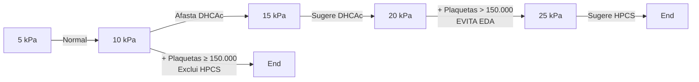

# CIRROSE: CONCEITOS GERAIS

| **Cirrose**
• Insuficiência hepática e Hipertensão portal
**Consequências clínicas:**
• Hipertensão portal: Ascite / PBE, hidrotórax, varizes esofágicas e gástricas, circulação colateral, esplenomegalia, hiperesplenismo;
• Insuficiência hepática: hiperestrogenismo, hipoandrogenismo, coagulopatia, hipoalbuminemia, icterícia, imunodepressão;
• Miscelânea: encefalopatia hepática, síndrome hepatopulmonar, síndrome hepatorrenal, CHC | **Etiologias:**
• Álcool, HCV, MASLD, HBV, HAI, CBP, CEP, Hemocromatose, Wilson, Def A1AT, Criptogênica
**Estadiar função hepática:**
• Child-Pugh (BEATA) e MELD (BIC)
**Hipertensão portal:**
• Pré-hepática (trombose veias porta e esplênica), pré-sinusoidal (esquistossomose, HNR), sinusoidal (cirrose), pós-sinusoidal (doença hepática veno-oclusiva), pós-hepáticas (Budd-chiari, cardíaca) |
| ------------------------------------------------------------------------------------------------------------------------------------------------------------------------------------------------------------------------------------------------------------------------------------------------------------------------------------------------------------------------------------------------------------------------------------------------------------------- | ------------------------------------------------------------------------------------------------------------------------------------------------------------------------------------------------------------------------------------------------------------------------------------------------------------------------------------------------------------------------------------------------------------------------- |

## 1. CONCEITOS INICIAIS E FISIOPATOLOGIA - HISTOLOGIA DO FÍGADO

### 1.1 UNIDADE ESTRUTURAL = LÓBULO HEPÁTICO

• Veia centrolobular (no centro do lóbulo)
• Tríade portal (nas fronteiras entre os lóbulos)
  • Ramos do ducto biliar – vão se unindo para formar as vias biliares
  • Vênula – ramo da v. porta hepática
  • Arteríola – ramo da a. Hepática
• Entre a veia centrolobular e a tríade portal há fileiras de hepatócitos, e entre elas os sinusóides hepáticos (com endotélio fenestrado) - por onde passa a circulação hepática.
• Células de Kupffer – macrófagos adjacentes às células do endotélio
• Entre o endotélio capilar e os hepatócitos há um espaço virtual "espaço de Disse" – onde é possível encontrar as células estreladas (ou células de Ito).
• Confira ao lado Figura 2 e Figura 3

## 2. O QUE OCORRE NA CIRROSE?

Agressão hepática
↓
Células estreladas (Ito)
↓
Diferenciam-se em miofibroblastos
↓
Produção colágeno
↓
Perda de fenestrações dos sinusóides

**Figura 1** Fluxograma cirrose

• Agressão hepática (seja qual for: vírus, álcool, medicamento...)
  • As células de Kupffer produzem citocinas inflamatórias.
• Citocinas atuam nas células estreladas que sofrem uma diferenciação em miofibroblastos, que começam a produzir colágeno (fibrose)
• Há perda das fenestrações dos sinusoides, passando a ser capilarizados (dificultando as trocas gasosas com os hepatócitos e aumenta a resistência ao fluxo da veia porta).
• A consequência desse processo é a desorganização da arquitetura lobular hepática → doença hepática crônica avançada → irreversível

| Junção Celular                                  |
| ----------------------------------------------- |
| Canalículo Biliar                               |
| Hepatócito                                      |
| Membrana sinusoidal do hepatócito (basolateral) |
| Espaço de Disse                                 |
| Célula de Kupffer                               |
| Sinusoide                                       |
| Célula endotelial sinusoidal (com fenestrações) |
| Canalículo biliar                               |
| Célula estrelada                                |

**Figura 2** Representação esquemática de hepatócitos e sinusóide.

| Hepatócitos                 |
| --------------------------- |
| Sinusóide hepático          |
| Veia central                |
| Canalículo biliar           |
| A. Lóbulo hepático          |
| Veia central                |
| Canalículo biliar           |
| Célula reticuloendotelial   |
| Sinusóide hepático          |
| Hepatócito                  |
| Tríade portal               |
| Ramo do ducto biliar        |
| Ramo da veia porta hepática |
| Ramo da artéria hepática    |
| B. Hepáticos e sinusóides   |

**Figura 3** Representação esquemática de: A) lóbulo hepático; B) Hepatócitos e sinusóides

GASTROENTEROLOGIA

## 3. CONSEQUÊNCIAS CLÍNICAS DA DOENÇA HEPÁTICA CRÔNICA

### 3.1 HIPERTENSÃO PORTAL (OCORRE POIS O FÍGADO FICA MAIS RÍGIDO E CONSEQUENTE AUMENTO DA RESISTÊNCIA VASCULAR)

• Ascite/ Peritonite bacteriana espontânea
• Hidrotórax
• Varizes esofágicas/gástricas – decorrentes da circulação colateral
• Circulação colateral
• Esplenomegalia
• Plaquetopenia / pancitopenia (sequestro esplênico)

### 3.2 INSUFICIÊNCIA HEPÁTICA (DESTRUIÇÃO E PERDA DE FUNÇÃO DE HEPATÓCITOS)

• Hiperestrogenismo – pode ser observado por telangiectasias, presença de ginecomastia, eritema palmar.
• Hipoandrogenismo – perda de massa muscular, atrofia testicular e redução de pilificação.
• Coagulopatia – o fígado produz fatores da coagulação
• Hipoalbuminemia
• Icterícia (hiperbilirrubinemia direta)
• Imunodepressão

### 3.3 OUTRAS COMPLICAÇÕES DA CIRROSE (TANTA PELA HIPERTENSÃO PORTAL QUANTO PELA INSUFICIÊNCIA HEPÁTICA)

• Encefalopatia hepática
• Síndrome hepatopulmonar
• Síndrome hepatorrenal
• Carcinoma hepatocelular

## 4. DIAGNÓSTICO DE CIRROSE

• Anamnese e exame físico – alguns achados citados anteriormente ao falar de insuficiência hepática e hipertensão portal.
• Exames laboratoriais sugestivos, exemplo:
  • Bilirrubina aumentada
  • Albumina baixa
  • Plaquetopenia
• USG abdome (doppler) – sinais de fibrose, hipertensão portal
• EDA – varizes esofagogástricas
• Biópsia hepática – pode ser útil na investigação etiológica
• Elastografia hepática (não invasivo) – verificar a rigidez hepática → quanto mais "rígido" for o fígado, maior indício de cirrose

## 5. DIAGNÓSTICOS ETIOLÓGICOS DA CIRROSE

### 5.1 PRINCIPAIS:

• Álcool
  • História de etilismo
  • Mulher: 20-40g/dia
  • Homem: 40-80g/dia
• Hepatite C
  • Exames (sorologia, uma vez positiva, confirmar com a carga viral)
• MASLD - Doença hepática esteatótica associada a disfunção metabólica
  • Síndrome metabólica
  • Descarte das outras etiologias

### 5.2 OUTRAS:

• Hepatite B
  • Exames (sorologia) e, após, confirmar com carga viral.
• Hepatite autoimune
  • Anticorpos: AML, AntiLKM1, FAN
  • Eletroforese de proteínas com aumento de gamaglobulinas,
  • Aumento de IgG
  • Biópsia: infiltrado inflamatório periportal, hepatite de interface e rosetas
• Hemocromatose
  • Quadros clássicos: Pacientes com hepatopatia, IC, artropatia, DM, hipogonadismo.
  • Dosar ferro, ferritina, saturação de transferrina (Saturação e ferritina aumentadas = pesquisar mutações C282Y (principal), H63D, S65C)
• Colangite biliar primária
  • Colestase intrahepática, sem dilatação de vias biliares (USG e colangioRM normais)
  • Anticorpo antimitocôndria (principal marcador)
• Colangite esclerosante primária
  • Acometimento de vias biliares intra e/ou extrahepáticas
  • USG e colangioRM para avaliar áreas de estenose em vias biliares
  • Muito relacionadas com DII → em especial RCU.
• Doença de Wilson – relacionada ao metabolismo do cobre
  • Triagem com ceruloplasmina sérica baixa
  • Cobre urinário 24h elevado
  • Exame oftalmológico (lâmpada de fenda) com anéis de Kayser Fleisher e sintomas neurológicos. Decorrentes da deposição de cobre principalmente na região periférica da córnea. **Cai em prova!**
• Deficiência A1-antitripsina
  • Dosagem de A1T sérica baixa → teste genético
• Criptogênica
  • Quando não encontramos a etiologia da cirrose

CIRROSE CONCEITOS GERAIS                                                                                                                3

**Figura 4** Anel de Kayser-Fleisher em paciente com Doença de Wilson

## 6. INSUFICIÊNCIA HEPÁTICA

**6.1 ESTADIAMENTO DA FUNÇÃO HEPÁTICA**

• Com enzimas hepáticas? NÃO!
  • TGO, TGP, FALC, GGT são marcadores de inflamação e não de função hepática

• Exames que medem a função
  • Albumina, bilirrubina, tempo de protrombina e Fator V

**6.2 APLICAR O SCORE DE CHILD-PUGH:**

**Tabela 1** Classificação de Child-Pugh para avaliar gravidade da doença hepática

|                         | Pontos
1 | Pontos
2 | Pontos
3   |
| ----------------------- | ------------ | ------------ | -------------- |
| **Bilirrubina (mg/dL)** | < 2          | 2 - 3        | > 3            |
| **Encefalopatia**       | Ausente      | Graus I e II | Graus III e IV |
| **Ascite**              | Ausente      | Leve         | Moderada/Grave |
| **TAP / INR**           | < 1.7        | 1.7 – 2.3    | > 2.3          |
| **Albumina**            | > 3.5        | 2.8 - 3.5    | < 2.8          |

• Lembrar de BEATA! Inicial de cada critério do Score.

• Cada critério pontua de 1-3, sendo a pontuação mínima 5 e a máxima 15.

• Score conforme a pontuação:

Child-Pugh (Sobrevida em 1 ano: 100%, 2 anos: 85%)
A: 5-6 pontos (Sobrevida em 1 ano: 100%, 2 anos: 85%)
B: 7-9 pontos (Sobrevida em 1 ano: 80%, 2 anos: 60%)
C: 10-15 pontos (Sobrevida em 1 ano: 45%, 2 anos: 35%)

**6.3 OUTRO SCORE PARA AVALIAR A FUNÇÃO É O MELD – DESENVOLVIDO PARA PREVER SOBREVIDA DA PACIENTE**

• Usado no Brasil para determinar a prioridade da fila de transplante, quanto maior, mais prioridade.

• Considera:
  • Bilirrubina, INR/TAP, Creatinina (NÃO TEM ALBUMINA)
  • Crianças = PELD

• Calcula com uma fórmula predeterminada

**6.4 QUESTÕES PODEM COBRAR AS DIFERENÇAS ENTRE OS DOIS SCORES.**

## 7. HIPERTENSÃO PORTAL

**7.1 É POSSÍVEL MEDIR O GRADIENTE DE PRESSÃO VENOSA HEPÁTICA (GPVH)**

• Realizado por meio do cateterismo, transfemural ou transjugular, da veia hepática

• Se >5 mmHg = hipertensão portal - porém, para ser, para ser clinicamente significativa, o gradiente de pressão deve ser no mínimo 10 mmHg

• Pode acontecer por diversos motivos – Nem toda hipertensão portal é cirrose!

**Figura 5** A veia porta é formada pela veia mesentérica superior e a veia esplênica

**7.2 PRÉ HEPÁTICAS (NÚMERO 1)**

• Trombose de veia porta

• Trombose de veia esplênica (hipertensão portal segmentar, podendo levar a varizes gástricas sem varizes esofágicas)

**7.3 HEPÁTICA:**

**Pré-sinusoidal (número 2)**

• Esquistossomose

• Hiperplasia nodular regenerativa (HNR) – ocorre em condições em que há uma diminuição não homogênea do fluxo sanguíneo para o parênquima hepático. Acontece em colagenoses, vasculites, ateroscleroses, IC.

• Sarcoidose

• Colangite biliar primária (fase pré-cirrótica) - a inflamação dos ductos biliares pode comprometer as vênulas adjacentes.

• São causas de hipertensão portal não cirróticas

**Sinusoidal (número 3)**

• Cirrose – como foi visto, há a capilarização dos sinusóides

**Pós-sinusoidal (número 4)**

• Doença hepática veno-oclusiva (complicação do transplante halogênico de medula-óssea)

**7.4 PÓS-HEPÁTICAS (NÚMERO 5)**

• Síndrome de Budd-Chiari (trombose vasos supra-hepáticos)

• Congestão direita (ICC, pericardite constrictiva)

GASTROENTEROLOGIA

## 7.5 BAVENO VII – PRINCIPAL CONSENSO SOBRE HIPERTENSÃO PORTAL

• Última versão publicada no início de 2022
• Um dos destaques é o exame de **Elastografia hepática**
  • Verifica a "rigidez" do fígado
  • Quanto mais rígido, mais chance de ser cirrótico
• Definições pelo consenso
  • Doença hepática crônica avançada compensada (DHCAc) = Cirrose compensada
  • Hipertensão portal clinicamente significativa (HPCS) = GPVH > 10mmHg.
• Regra dos 5 (interpretação de valores da rigidez hepática a cada aumento de 5 kPa)
• < 20 kPa + Plaquetas > 150.000 = Evita EDA. É um dos mais cobrados em prova
• HPCS já indica profilaxia com Betabloqueador

## 7.6 ACLF (INSUFICIÊNCIA HEPÁTICA CRÔNICA AGUDIZADA)

Cirrose descompensada com resposta inflamatória sistêmica exacerbada, (letra "r" depois do "e" + vírgula) levando à falência orgânica

**Fatores precipitantes**
• Infecção bacteriana
• Hepatite alcoólica
• HDA
• Reativação de hepatite
• Medicamentos

• Causas mais raras
  • EBV/CMV/HSV/Varicela/HIV/ParvoB19
  • Cirurgia recente
  • Isquêmico

**Avaliar 6 sistemas para ver se há falência:**
• Circulação → Necessidade de vasopressor
• Fígado → Bilirrubina ≥ 12,0
• Coagulação → INR ≥ 2,5
• Rins
  • Cr 1,5 - 1,9 (Amarelo)
  • Cr ≥ 2,0 (vermelho)
  • Necessidade de terapia de substituição renal (vermelho)
• Cérebro
  • Encefalopatia Hepática graus I e II (amarelo)
  • Encefalopatia Hepática graus III e IV (vermelho)
• Respiratório
  • PaO2/FiO2 ≤ 200
  • SpO2/FiO2 ≤ 214
• Classificação:
  • Ia → Disfunção renal (vermelha)
  • Ib → 1 disfunção (exceto renal vermelho) + 1 disfunção amarela (renal ou encefalopatia)
  • 2 → 2 disfunções
  • 3a → 3 disfunções
  • 3b → 4 ou mais disfunções

| 5 kPa    | 10 kPa                                | 15 kPa       | 20 kPa | 25 kPa             |
| -------- | ------------------------------------- | ------------ | ------ | ------------------ |
|          |                                       |              |        |                    |
| Normal ← | ← + Plaquetas > 150.000
EVITA EDA |              |        | →                  |
|          | Afasta DHCAc                          | Sugere DHCAc |        | →                  |
|          |                                       |              |        | Sugere
DHCAc → |
|          |                                       |              |        |                    |
|          | ← Plaquetas ≥ 150.000
Exclui HPCS |              |        |                    |

**Figura 6** Regra dos 5: interpretação de valores da rigidez hepática a cada aumento de 5 kPa

CIRROSE CONCEITOS GERAIS<page_header>
CIRROSE CONCEITOS GERAIS

# REFERÊNCIAS

**Figura 4** Anel de Kayser-Fleisher em paciente com Doença de Wilson

Song W et al. Heliyon, 2023

Ascite, PBE e PBS (CM)

# GASTRO: ASCITE + PBE

| **Ascite nova = Paracentese diagnóstica**
**GASA (Gradiente Albumina Sérica - Albumina Ascite)**
• ALTO (≥ 1.1) = Transudato = Hipertensão portal (Ptn <2,5 = cirrose / Ptn >2,5 = cardíaco)
• BAIXO (< 1.1) = Exsudato = Carcinomatose / TB / pancreática / Quilosa / Nefrogênica
**Tratamento ascite em cirrótico**
• Dieta hipossódica / Diuréticos (Espironolactona + Furosemida) / Cessar etilismo
• Refratário: Paracenteses de alívio / TIPS / Derivação portossistêmica / Transplante |   | **PBE**
• Quando pensar? Febre, dor abdominal ou qualquer descompensação da cirrose
• Paracentese diagnóstica: > 250 neutrófilos polimorfonucleares & cultura
• Tratamento: Cefalosporina 3a geração + Avaliar albumina p/ profilaxia sd hepatorrenal
• Profilaxia: 1ª HDA ou se Proteína ascite < 1,5 + disfunção hepática ou renal) e 2ª (sempre que já teve antes)
• Pensar em PBS: polibacteriana, leucocitose muito alta, Ptn ascite > 1, DHL alto, Glic < 50 |
| --------------------------------------------------------------------------------------------------------------------------------------------------------------------------------------------------------------------------------------------------------------------------------------------------------------------------------------------------------------------------------------------------------------------------------------------------------------------------------------------------------------------- | - | -------------------------------------------------------------------------------------------------------------------------------------------------------------------------------------------------------------------------------------------------------------------------------------------------------------------------------------------------------------------------------------------------------------------------------------------------------------------------------------- |

## 1. ASCITE - DEFINIÇÃO

• Caracteriza-se pelo acúmulo de líquido peritoneal. Em alguns casos, a identificação é fácil, em virtude da grande quantidade de acúmulo de líquido. Ainda, de outro modo, existem manobras que auxiliam na identificação da ascite:

### 1.1 SEMICÍRCULO DE SKODA;

• À percussão do abdome no paciente em decúbito dorsal, forma-se um semicírculo imaginário, mediante localização do líquido.

**Figura 1** Semicírculo de Skoda em paciente com ascite.

### 1.2 MACICEZ MÓVEL;

• Observada ao posicionar o paciente em decúbito lateral, pela movimentação do líquido na cavidade peritoneal.

**Figura 2** Macicez móvel em paciente com ascite

### 1.3 OUTROS MÉTODOS:

• Piparote;
• Toque retal.

**ATENÇÃO!** Nem todo quadro de ascite é hipertensão portal. Desse modo, em todo quadro novo de ascite, deve-se proceder com paracentese diagnóstica.

## 2. ASCITE - DIAGNÓSTICO

### 2.1 PARACENTESE DIAGNÓSTICA;

• É um procedimento para punção do líquido ascítico;
• É possível guiar o procedimento por ultrassom.

**Método sem guiar por US:**
• Traçar linha da cicatriz umbilical até a crista ilíaca ântero-superior esquerda;
• Dividir a linha entre 3 porções;
• Ponto de punção ideal: entre terço médio e distal. Há menor vascularização. Logo, há menor risco de acidente de punção.

**Figura 3** Avaliação de ascite - Local ideal para paracentese diagnóstica.

### 2.2 ANÁLISE DO LÍQUIDO ASCÍTICO: GASA – GRADIENTE ALBUMINA (SORO-ASCITE);

• GASA ≥ 1.1 g/dL → transudato = hipertensão portal;
• Proteína do líquido ascítico < 2,5 → cirrose (85% dos casos);

• Proteína do líquido ascítico > 2,5 → cardiogênica (IC direita, pericardite constritiva).
• GASA < 1,1 g/dL → exsudato → "doença peritoneal";
  • Carcinomatose peritoneal (2° principal causa) → citologia oncótica;
  • Tuberculose → ADA, pesquisa direta de BK, biópsia;
  • Pancreática → amilase elevada (> 1000 UI);
  • Quilosa → TG > 1000;
• Nefrogênica (T) → proteína < 2,5, proteinúria.

OBS.: A ascite pancreática ocorre, principalmente, em quadros de pancreatite crônica de etiologia alcoólica, com lesão de ducto pancreático e consequente liberação de secreções pancreáticas para peritônio.

OBS.2: A ascite quilosa ocorre por obstrução de ductos linfáticos. Pode ocorrer em quadros de linfoma, trauma, tuberculose.

OBS.3: Hipertensão portal pré-sinusoidal não cursa com ascite!

## 3. ASCITE – TRATAMENTO

### 3.1 NO PACIENTE CIRRÓTICO – CONDUTA GERAL

**Dieta:**
• Restrição de sódio (2g/dia);
• Sódio urinário, sem uso de diuréticos > 78 mmol/24h → má adesão;
• Restrição hídrica – apenas se Na < 120 – 125 mEq/L.

**Diuréticos:**
• Espironolactona + furosemida (Proporção geral: 100 mg + 40 mg)
• Titular a dose a cada 3-5 dias (a depleção acelerada de líquido apresenta risco potencial para disfunção renal; Média ideal: perda de 500 g – 1 kg/dia)

**Outros:**
• Cessar etilismo;
• Interromper uso de AINEs.

### 3.2 PACIENTE REFRATÁRIO

• Caracterizada pelo quadro que **não responde** ao uso de espironolactona 400 mg + furosemida 160 mg, ou **não tolera** o aumento da dose (por efeitos adversos);

Atenção!
Para que seja dado como refratário, deve haver adesão à dieta hipossódica;
Sódio urinário < 78 mmol/24h → representa adesão ao tratamento.

Como interpretar a dosagem do sódio urinário?
a)Na urinário > 78 + está perdendo peso = paciente responde ao diurético e é aderente à dieta
b) Na urinário > 78 + não está perdendo peso = responde ao diurético, mas não adere à dieta
c) Na urinário < 78 e NÃO está perdendo peso = paciente é resistente à dose atual de diuréticos

**Manejo:**
• Paracenteses de alívio; Se a retirada > 5L → proceder com reposição de albumina – 8 g/litro retirado.
• Em pacientes com instabilidade hemodinâmica (PAS < 90), hipoNA (< 130) e/ou LRA, albumina deve ser considerada mesmo em paracenteses de menor volume

OBS.: O frasco ampola padrão de albumina 20% possui 50 mL. Logo, há 10 g de albumina em cada FA.

• **TIPS** – *Transjugular Intrahepatic Portosystemic Shunt*;
  1. É posicionado por radio-intervenção;
  2. Conectado, não cirurgicamente, um ramo de veia porta sinusoidal (pré-hepático) com ramo supra-hepático;
  3. Assim, reduz a hipertensão portal.

**Figura 4** Representação de TIPS

**Tabela 1** TIPS

| Complicações     | Encefalopatia
Trombose do TIPS                                                                                           |
| ---------------- | ---------------------------------------------------------------------------------------------------------------------------- |
| Contraindicações | Hipertensão pulmonar
ICC
Insuficiência tricúspide grave
Doença policística hepática
Infecção sistêmica ativa |

• Cirurgia – derivação portossistêmica;
• Transplante hepático.

## 4. PERITONITE BACTERIANA ESPONTÂNEA

**Definição**
• A cirrose é fator de risco para translocação bacteriana, que pode ocasionar infecção do líquido ascítico.
• Em geral, os principais microrganismos associados são Gram negativos: *E. coli* e *Klebsiella*;

### 4.1 QUANDO SUSPEITAR?

• Manifestações clínicas:
  • Febre;
  • Dor abdominal.
• Ou qualquer outro sinal da descompensação da cirrose.

## 4.2 DIAGNÓSTICO
• Paracentese diagnóstica;
  • Dosagem de celularidade (> 250 polimorfonucleares);
  • Cultura.

## 4.3 TRATAMENTO
• Antibiótico:
  • Cefalosporina 3° geração – Ceftriaxona, Cefotaxima, por 5 dias;
  • Se paciente internado, com uso de antibiótico recente → cefepime, tazocin.
• Profilaxia – síndrome Hepatorrenal:
• AASLD – indicação:
  • Cr > 1 mg/dL;
  • Ur > 60 mg/dL;
  • OU Bilirrubina total > 4 mg/dL.
• Esquema: D1 – Albumina 1,5 g/kg + D3 – Albumina 1 g/kg.

## 4.4 PROFILAXIA PRIMÁRIA PBE:
• Paciente cirrótico com ascite, sem evolução prévia para PBE, porém com alto risco;

**Principais grupos:**
• Cirrose + HDA varicosa → Ceftriaxona 1g/dia (preferência) ou norfloxacino (se via oral disponível), por 7 dias;
• Cirrose + ascite associadas com proteína do líquido ascítico < 1,5 g/dL → Norfloxacino (Ou Sulfametozaxol/ TMP; Ciprofloxacino; Rifaximina) – uso crônico;
  • São requisitos: disfunção hepática (Child ≥ 9 e bilirrubina ≥ 3) OU disfunção renal (Cr ≥ 1,2 mg/dL ou Na ≤ 130 mEq/L).

## 4.5 PROFILAXIA SECUNDÁRIA:
• Paciente ja evoluiu com quadro de PBE, com objetivo de evitar nova evolução;
• Esquema: Norfloxacino (Ou Sulfametozaxol/TMP; Ciprofloxacino; Rifaximina)

# 5. PERITONITE BACTERIANA SECUNDÁRIA

## 5.1 INFORMAÇÕES IMPORTANTES
• Apresenta leucocitose mais elevada;

**Principais microrganismos:**
• Polibacteriana;
• Fungos;
• Enterococcus.

**Características no líquido ascítico:**
• Proteína total > 1 g/dL;
• DHL > limite da normalidade sérico;

• Glicose < 50 mg/dL;
• Outros:
  • CEA > 5 ng/mL;
  • FALC > 240 U/L.

## 5.2 CONDUTA
• Antibioticoterapia empírica também deve cobrir anaeróbico;
• Solicitar exame de imagem;
  • Tomografia computadorizada, de preferência.
• Descompensação? Laparotomia, laparoscopia.

# 6. HIDROTÓRAX

## 6.1 INFORMAÇÕES
• Ocorre por defeito diafragmático, sendo mais prevalente à direita;
• Alguns pacientes não têm ascite aparente.

**Figura 5** Radiografia de tórax evidenciando hidrotórax à direita

## 6.2 TRATAMENTO
• Restrição de sódio;
• Uso de diuréticos;
• Toracocentese de alívio;
  • O uso de dreno torácico deve ser evitado, em virtude da depleção proteica e de eletrólitos, bem como pela possibilidade de infecção e disfunção renal.
• Pleurodese;
• TIPS;
• Transplante hepático;
  • Tratamento definitivo.

GASTRO: ASCITE + PBE                                                                                            3

GASTROENTEROLOGIA

# REFERÊNCIAS

**Figura 5** Radiografia de tórax evidenciando hidrotórax à direita

Arquivo Pessoal

# CIRROSE: ENCEFALOPATIA HEPÁTICA SÍNDROME HEPATORRENAL

## Encefalopatia hepática
• Potencialmente reversível
• Sempre buscar fator precipitante!
  • Infecções / constipação / sangramento gastrointestinal / excesso de diuréticos / benzodiazepínicos / etanol / desidratação / DHE / hipoglicemia / insuficiência renal / aumento da ingesta proteica / cirurgia / TIPS / trombose de veia porta / HCC
• Exames conforme suspeita clínica
• Paracentese sempre que tiver ascite para excluir PBE
• TC/RM de crânio APENAS se déficits focais, trauma ou refratariedade
• Tratamento:

• Estabilização / IOT s/n / SNE s/n / suporte nutricional adequado / suspender diuréticos / identificar e tratar fatores precipitantes
• Lactulona / enemas / rifaximina (opções: neomicina e metronidazol)

## Síndrome hepatorrenal
• LRA em cirrótico → retirar diuréticos / retirar drogas nefrotóxicas / albumina 1 g/kg 2 dias → se melhorar devia ser pré-renal → se não melhorar, considerar SHR (não pode ter sinais macroscópicos de lesão renal – usg ok, sem proteinúria ou hematúria)
• Tratamento SHR aguda:
  • Terlipressina (ou noradrenalina) + albumina
  • Não respondedores: diálise, transplante

## 1. CONTEXTUALIZANDO

• O quadro de cirrose é resultado de uma desorganização da arquitetura lobular, culminando em hipertensão portal e insuficiência hepática;

### 1.1 HIPERTENSÃO PORTAL – POSSÍVEIS EVOLUÇÕES CLÍNICAS:
• Ascite/PBE;
• Hidrotórax;
• Varizes esofágicas/gástricas;
• Circulação colateral;
• Esplenomegalia;
• Plaquetopenia/pancitopenia.

### 1.2 INSUFICIÊNCIA HEPÁTICA – POSSÍVEIS EVOLUÇÕES CLÍNICAS
• Hiperestrogenismo: manifesta-se por telangiectasias, ginecomastia, eritema palmar;
• Hipoandrogenismo: manifesta-se por atrofia testicular, perda de massa muscular, redução da pilificação;
• Coagulopatia;
• Hipoalbuminemia;
• Icterícia;
• Imunodepressão.

## 2. ENCEFALOPATIA HEPÁTICA: FISIOPATOLOGIA

• O quadro de insuficiência hepática traduz-se em níveis de depuração hepática reduzida → favorece o aumento da produção de amônia;
  • Ainda, ocorre aumento da atividade bacteriana intestinal → favorece o aumento da produção de amônia;
  • Há formação de shunts portossistêmicos → falha na metabolização hepática.
• Em decorrência de tais fatores, há um desbalanço no metabolismo de "toxinas";
  • Dispõem de efeito deletério na função cerebral.

## 3. ENCEFALOPATIA HEPÁTICA: CRITÉRIOS DE WEST HAVEN

### 3.1 GRAU I
• Orientado;
• **Alteração do sono**;
• Declínio cognitivo;
• Déficit de atenção.

### 3.2 GRAU II
• Desorientado;
• Dispraxia – dificuldade de realização de movimento planejado; dificuldade motora;
• Presença de **flapping**.

### 3.3 GRAU III
• Sonolência;
• Maior desorientação.

### 3.4 GRAU IV
• Coma.

**OBS.: a encefalopatia hepática é potencialmente reversível!**

## 4. ENCEFALOPATIA HEPÁTICA: FATORES PRECIPITANTES

• **Infecções**;
• **Constipação**;
• **Sangramento gastrointestinal**;
• **Excesso de diuréticos**;
• **Uso de benzodiazepínicos**;
• Etanol/narcóticos;
• Desidratação;
• Distúrbio hidroeletrolítico;
• Hipoglicemia;
• Insuficiência renal;
• Aumento da ingesta proteica;
• Cirurgia/TIPS;

GASTROENTEREOLOGIA

• Trombose de veia porta;
• Hepatocarcinoma.

## 5. ENCEFALOPATIA HEPÁTICA: EXAMES COMPLEMENTARES

• Paracentese diagnóstica:
  • Essencial para todo paciente com cirrose, ascite e encefalopatia hepática;
  • Útil para descartar PBE.
• Rastreio infeccioso;
• Hemograma;
• Glicemia;
• Função renal;
• Dosagem de eletrólitos;
• Função hepática;
• USG com doppler:
  • Descartar trombose de veia porta e nódulo suspeito para CHC.
• Endoscopia digestiva alta – EDA:
  • Se suspeita de sangramento digestivo.
• TC/RM de crânio:
  • Na presença de déficits focais, história de trauma e refratariedade ao tratamento padrão.

## 6. ENCEFALOPATIA HEPÁTICA: CONDUTA

### 6.1 MEDIDAS GERAIS

• Estabilização clínica: proteção de vias aéreas; hidratação; monitorização contínua;
• Suspensão do uso de diuréticos;
• Identificar fatores precipitantes;
• Fornecimento de suporte nutricional adequado: manter aporte proteico (normoproteica) entre 1.2-1.5 g/kg/dia.
• Para pacientes graus III e IV → proceder com instalação de sonda nasoenteral (SNE) pelo déficit de proteção de vias aéreas;
• Haloperidol – apenas se agitação grave;
• Evitar o uso de benzodiazepínicos:
  • Apresenta metabolização hepática → maior tempo de meia-vida;
  • Tem potencial para precipitar o quadro de encefalopatia.

### 6.2 MEDICAMENTOS

• Lactulona:
  • É um dissacarídeo não absorvível: 1- É catabolizado pela microbiota intestinal, sendo formados ácidos graxos de cadeia curta; 2- A redução do pH intestinal favorece a transformação de amônia (NH3) para amoníaco (NH4+); 3- O amoníaco não é tão facilmente absorvido quanto a amônia;
  • Favorece: 1- Redução do pH; 2- Alteração da flora intestinal; 3- Tem caráter laxativo → acelera o trânsito gastrointestinal → gera menor tempo para absorção de amônia.
• Enemas;
• Antibióticos não absorvíveis:
  • Rifaximina: apresenta melhor perfil de segurança em relação aos efeitos adversos;
  • Neomicina: uso prolongado pode gerar ototoxicidade e nefrotoxicidade.
  • Metronidazol: uso prolongado pode gerar neuropatia periférica.

## 7. SÍNDROME HEPATORRENAL: FISIOPATOLOGIA

Vasodilatação esplâncnica | Translocação bacteriana
Débito cardíaco inadequado |

Hipoperfusão renal | Citocinas inflamatórias

**Figura 1** Mecanismos de lesão renal envolvidos na síndrome hepatorrenal

ATENÇÃO! Até 50% dos cirróticos que evoluem com internação têm disfunção renal. Deste número, metade ocorre por IRA pré-renal, 30% por IRA renal, e 10-20% por síndrome hepatorrenal. Ainda, mais raramente, < 1% ocorre por fator obstrutivo.

## 8. SÍNDROME HEPATORRENAL: CRITÉRIOS PARA INSUFICIÊNCIA RENAL

**Tabela 1** Critérios para lesão renal aguda conforme International Club of Ascites (ICA)

| Conceitos sobre Lesão Renal Aguda e Cirrose                                                                                                      | Conceitos sobre Lesão Renal Aguda e Cirrose                                              |
| ------------------------------------------------------------------------------------------------------------------------------------------------ | ---------------------------------------------------------------------------------------- |
| Aumento da Cr ≥ 0.3 mg/dl em 48 horas
Aumento da Cr de 50% em relação valor basal em 7 dias
Débito urinário < 0.5 ml/kg/hora por 6 horas |                                                                                          |
| Estágio 1                                                                                                                                        | Aumento da Cr ≥ 0.3 mg/dl ou 1.5 – 2x o valor basal                                      |
| Estágio 2                                                                                                                                        | Aumento da Cr > 2 – 3x                                                                   |
| Estágio 3                                                                                                                                        | Aumento de Cr > 3x ou Cr ≥ 4.0 mg/dL (com aumento de 0.3 recente)
Necessidade de TRS |

CIRROSE: ENCEFALOPATIA HEPÁTICA E SÍNDROME HEPATORRENAL                                                           3

## 9. ABORDAGEM DA LESÃO RENAL AGUDA NO PACIENTE CIRRÓTICO

### 9.1 MEDIDAS INICIAIS
- Retirar diuréticos;
- Retirar drogas nefrotóxicas - incluindo beta-bloqueador;
- Descartar infecções.

### 9.2 ALBUMINA 1 G/KG, DURANTE 2 DIAS:
- É uma tentativa de favorecer a expansão volêmica, já que a principal causa é por IRA pré-renal.

### 9.3 NA AUSÊNCIA DE RESPOSTA → CONSIDERAR SÍNDROME HEPATORRENAL.

## 10. SÍNDROME HEPATORRENAL: TIPOS

### 10.1 SÍNDROME HEPATORRENAL AGUDA (HRS-AKI)
- Cirrose + ascite;
- Lesão renal aguda, conforme ICA-AKI;
- Ausência de resposta após 2 dias de retirada de diuréticos + albumina EV;
- Ausência de choque;
- Ausência de drogas nefrotóxicas;
- Sem sinais macroscópicos de lesão renal crônica;
  - USG renal normal;
  - Proteinúria < 0.5 g/dia;
  - Ausência de hematúria microscópica.

**OBS.: Marcador NGAL – é um marcador de lesão tubular. Níveis elevados sugerem necrose tubular aguda (NTA), e falam contra síndrome hepatorrenal.**

### 10.2 SÍNDROME HEPATORRENAL NÃO AGUDA; CRÔNICA (NON-AKI HRS)
- Subaguda – HRS-AKD;
  - Aumento de Cr < 50%, em < 3 meses OU
  - Clearance de creatinina < 60 ml/min, por < 3 meses.
- Crônica – HRS-CKD;
  - Clearance de creatinina < 60 ml/min, por ≥ 3 meses.

## 11. SÍNDROME HEPATORRENAL: CONDUTA (HRS-AKI)

### 11.1 USO DE VASOCONSTRITORES ESPLÂNCNICOS;
- Terlipressina 0.5 – 1 mg, de 4-6 horas + albumina 20 - 40 g/dia;
- Alternativa: noradrenalina, midodrina + octreotide.

### 11.2 AVALIAÇÃO DA RESPOSTA:
- Reavaliação em 2 dias:
  - Queda de Creatinina < 25% → resposta inadequada; Aumentar dose de terlipressina, progressivamente, até 12 mg/dia.
- Manutenção de quadro não respondedor:
  - Diálise;
  - TIPS? HRS non-AKI;
  - Transplante hepático.

### 11.3 CONTRAINDICAÇÕES AO USO DE TERLIPRESSINA;
- Coronariopatia;
- AVC.

### 11.4 EFEITOS ADVERSOS – TERLIPRESSINA;
- Congestão;
- Isquemia de extremidades;
- Dor abdominal;
- Diarreia.

HDA (CM)

# GASTRO: HDA E SÍNDROME HEPATOPULMONAR

## HDA varicosa: Varizes esofágicas e gástricas

| * 1° Estabilização clínica
* 2° Se suspeita de hepatopatia→ Vasoconstrictor esplâncnico (terlipressina ou octreotide)
* + ATB profilático PBE (ceftriaxone ou norfloxacino)
* 3° EDA → Ligadura ou esclerose (esofágicas) / Cianoacrilato (gástricas)**Se refratariedade:*** Balão (ex: Sengstaken-Blakemore) / TIPS / Cirurgia derivação portossistêmica**Profilaxia:*** 1ª Betabloqueador para todos com hipertensão portal | clinicamente significativa (carvedilol, propranolol, nadolol)* 2ª Betabloqueador + ligadura (para todos que já tiveram HDA)**Síndrome hepatopulmonar*** Distúrbio ventilação-perfusão por dilatação de capilares pulmonares (+ base)
* Platipneia = piora da dispneia quando fica de pé
* Ortodeoxia = dessatura quando fica de pé
* Tratamento: O2 suplementar s/n, Transplante hepático). |
| ----------------------------------------------------------------------------------------------------------------------------------------------------------------------------------------------------------------------------------------------------------------------------------------------------------------------------------------------------------------------------------------------------------------------------- | ------------------------------------------------------------------------------------------------------------------------------------------------------------------------------------------------------------------------------------------------------------------------------------------------------------------------------------------------------------------------------------------- |

## 1. HDA VARICOSA – DEFINIÇÃO

### 1.1 DEFINIÇÃO

É a hemorragia digestiva alta secundária à ruptura de varizes, sejam esofágicas ou gástricas;

- Tais varizes são decorrentes da hipertensão portal;
- Imagem a seguir:
  - À esquerda: varizes esofágicas de médio e grosso calibre, com presença de red spots e sinal de ponto de sangramento recente;
  - À direita: visão de fundo de estômago (retrovisão), com visualização de "tofos" varicosos.

**Figura 1** Varizes esofágicas

**Figura 2** Varizes gástricas

### 1.2 EPIDEMIOLOGIA

- As varizes esofágicas são muito mais comuns, sendo que as gástricas representam menos de 10 a 15% dos casos
- Em cenários de varizes gástricas isoladas – considerar hipertensão portal segmentar;
- Mortalidade:
  - 15 – 25%, em 6 semanas.
- Recorrência:
  - 60 – 70% em 1 – 2 anos (sem profilaxia).

### 1.3 CONDUTA

**Manejo inicial:**

- Estabilização clínica: Proteção de vias aéreas; Expansão volêmica com cristaloides; Hemotransfusão se: Hb < 7 g/dL.

**Manejo específico:**

- Suspeita de hepatopatia?
  - Vasoconstrictor esplâncnico; Terlipressina, 2 mg, EV, de 4/4h, por 48 horas → manutenção: 1 mg, de 4/4h por até 5 dias OU Octreotide 50 mcg, EV, em bolus + 25 – 50 mcg/h, por 5 dias.
- Antibiótico profilático para PBE;
  - Pelo maior risco de translocação bacteriana;
  - Ceftriaxona 1g/dia (prioridade) ou Norfloxacino 400 mg, VO, de 12/12h, por 7 dias (caso via oral disponível).
- Solicitar EDA; Realizar em até 12-24h; Terapia endoscópica:
  1. Esofágicas – ligadura (preferível);
  2. Esofágicas – esclerose (foto a seguir);
  3. Gástricas – cianoacrilato.

**Para quadros refratários:**

- Proceder nova EDA;
- Balão de Sengstaken-Blakemore – é uma terapia ponte;
  1. Lúmen para aspiração de conteúdo gástrico;
  2. Lúmen para insuflar a porção gástrica do balão;
  3. Lúmen para porção esofágica.
- TIPS; 1) Útil para reduzir pressão portal; 2) É um shunt portossistêmico intra-hepático.

• Cirurgia para derivação portossistêmica.

**Figura 3** Varizes gástricas

[Image showing gastric varices with endoscopic view and diagrams labeled A, B, C, D showing different stages]

**Figura 4** Escleroterapia de varizes esofágicas

[Image showing sclerotherapy equipment and procedure]

**Figura 5** Balão de Sengstaken-Blakemore

[Image showing Sengstaken-Blakemore balloon tube and diagram]

OBS.: Deve ser utilizado por, no máximo, 24 horas, em virtude do elevado risco de ulceração e perfuração esofágica.

## 1.4 PROFILAXIA

**Primária:**
• Todos os pacientes com hipertensão portal clinicamente significativa → betabloqueador;
  • Classicamente: Betabloqueadores não seletivos → propranolol, nadolol;
  • Preferível atualmente: 1) **Carvedilol** (3,125 - 6,25 mg 2x/dia): apresenta melhor tolerância, efeito vasodilatador, anti-alfa-adrenérgico.

• Precaução em ascites volumosas, refratárias.
• Suspender em PAS < 90 mmHg; Sangramento; PBE (Se hipotensão); Insuficiência renal.
• A ligadura elástica apenas se:
  • Intolerância ao betabloqueador + Varizes de alto risco (médio ou grosso calibre, presença de redspots).

**Secundária:**
• Sempre: Betabloqueador + ligadura elástica.

**Baveno VII**

Em elastografia hepática... pela medida da rigidez hepática;
• DHCAc → doença hepática crônica avançada compensada (cirrose compensada);

OBS.: Betabloqueadores devem ser considerados para prevenção de descompensação em todos os pacientes com HPCS.

OBS.: Se o paciente já está em uso de betabloqueador, não é necessário realizar EDA para avaliar varizes.

## 2. OUTRAS CAUSAS POSSÍVEIS DE SANGRAMENTO NO PACIENTE CIRRÓTICO

### 2.1 GAVE:
• Ectasia vascular antral gástrica;
  • Não estão associadas à hipertensão portal;
  • Outras associações: Esclerose sistêmica; DRC; Cardiopatia.
• Na imagem abaixo:
  • Ectasia vasculares, em aspecto de favo de mel;
  • Ectasias vasculares – "Watermelon stomach" – estômago em melancia;
• Tratamento:
  • EDA com plasma de argônio – principal;
  • Antrectomia – se refratário;

### 2.3 GASTROPATIA HIPERTENSIVA PORTAL:
• Padrão em "mosaico" no corpo gástrico – sob EDA;
• Pode apresentar hemorragias subepiteliais hemorragias subepiteliais – Principalmente em pacientes com gastropatia mais grave.
• Tratamento:
  • Manejar em caso de sangramento crônico;
  • Terapias: betabloqueador não seletivo; reposição de ferro; TIPS – se refratário às medidas iniciais.
  • Em caso de sangramento agudo → vasoconstritores esplâncnicos;
  • Ainda, é possível surgir duodenopatia, enteropatia, colopatia hipertensiva portal.

GASTRO: HDA E SÍNDROME HEPATOPULMONAR    3

## Regra dos 5 na interpretação de resultados de rigidez hepática (elastografia hepática) conforme Baveno VII

**Figura 6** Regra dos 5 na interpretação de resultados de rigidez hepática (elastografia hepática) conforme Baveno VII

**Figura 7** GAVE com aspecto em favo de mel

[Image shows endoscopic view of gastric antral vascular ectasia (GAVE) with honeycomb appearance - reddish mucosa with characteristic vascular pattern]

**Figura 8** GAVE com aspecto de estômago em melancia

[Image shows endoscopic view of GAVE with watermelon stomach appearance - linear vascular pattern radiating from pylorus]

**Figura 9** Gastropatia hipertensiva portal

[Image shows endoscopic view of portal hypertensive gastropathy with mosaic-like pattern of mucosa]

**Figura 10** Gastropatia hipertensiva portal

[Image shows endoscopic view of portal hypertensive gastropathy with red spots and mosaic pattern on gastric mucosa]

# 3. SÍNDROME HEPATOPULMONAR

## 3.1 CONCEITOS BÁSICO:

• O paciente cirrótico é mais predisposto à ocorrência de vasodilatação;
  • Um dos sítios acometidos são os capilares pulmonares, principalmente em base pulmonar;
  • Assim, é gerado um distúrbio de ventilação-perfusão.

|  |  |
| ----- | ----- |

**Figura 11** Distúrbio ventilação-perfusão devido à dilatação de capilares pulmonares

## 3.2 DIAGNÓSTICO

**Critérios:**
• PaO2 < 80 mmHg OU ; Gradiente de oxigênio alveolar-arterial ≥ 15 mmHg (≥ 20 mmHg se > 65 anos);
• Identificação de defeito vascular pulmonar; Ecocardiograma com "microbolhas";
  • Microbolhas no átrio esquerdo em 1 ciclo = Shunt intracardíaco;
  • Após 3 a 8 ciclos = Dilatação vasos intrapulmonares.

**Classificação:**
• Leve: PaO2 ≥ 80 mmHg;
• Moderada: 60-80 mmHg;
• Grave: 50-60 mmHg;
  • Considerar transplante hepático.
• Muito grave: < 50 mmHg.

## 3.3 TRATAMENTO:

• O2 suplementar, se necessário;
• Transplante hepático.

GASTRO: HDA E SÍNDROME HEPATOPULMONAR

# REFERÊNCIAS

**Figura 1** Varizes esofágicas

Arquivo Pessoal

**Figura 2** Varizes gástricas

Arquivo Pessoal

**Figura 3** Varizes gástricas

Arquivo Pessoal

**Figura 4** Escleroterapia de varizes esofágicas

Arquivo Pessoal

**Figura 5** Balão de Sengstaken-Blakemore

kingsunmedical.com

**Figura 7** GAVE com aspecto em favo de mel

Arquivo Pessoal

**Figura 8** GAVE com aspecto de estômago em melancia

Arquivo Pessoal

**Figura 9** Gastropatia hipertensiva portal

Arquivo Pessoal

**Figura 10** Gastropatia hipertensiva portal

Arquivo Pessoal
