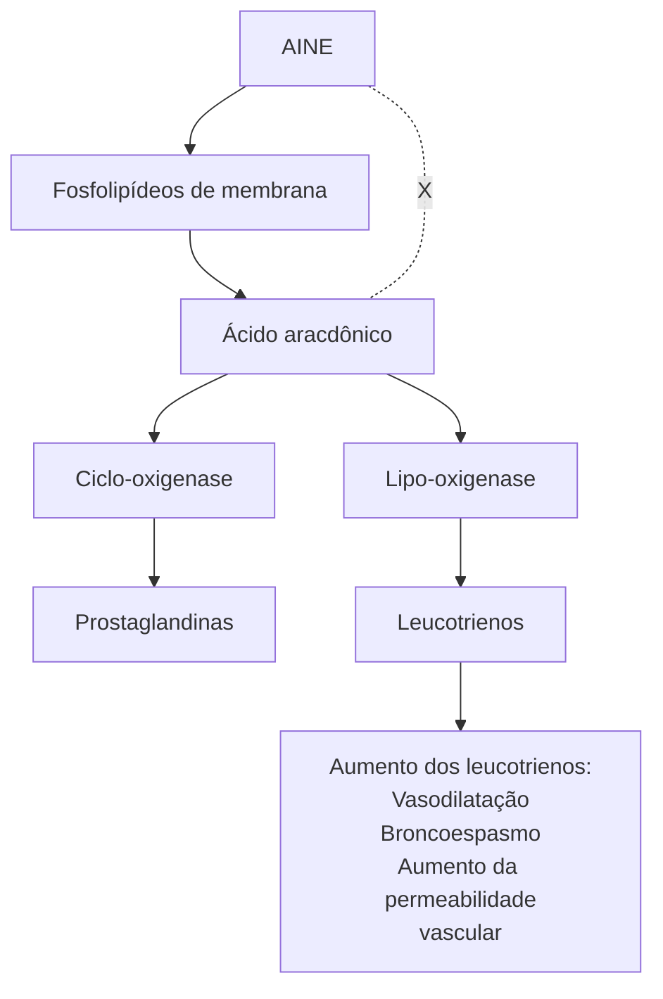
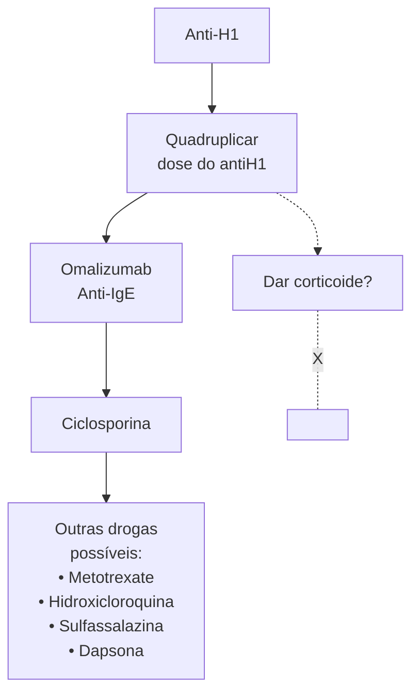
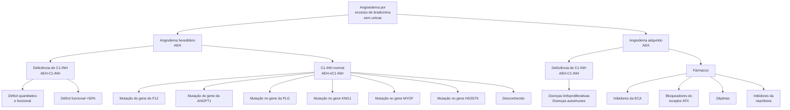
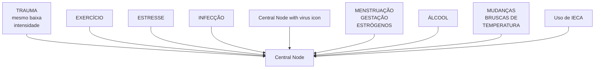
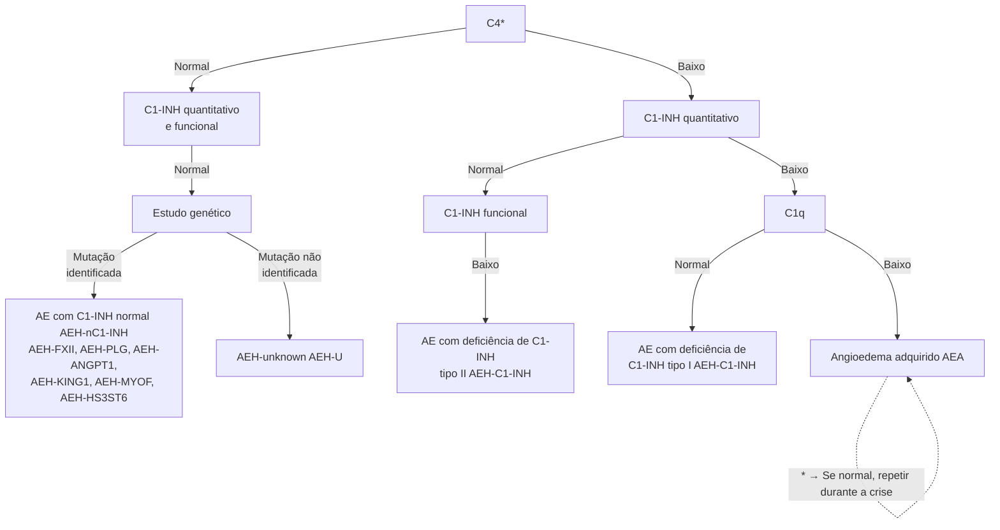
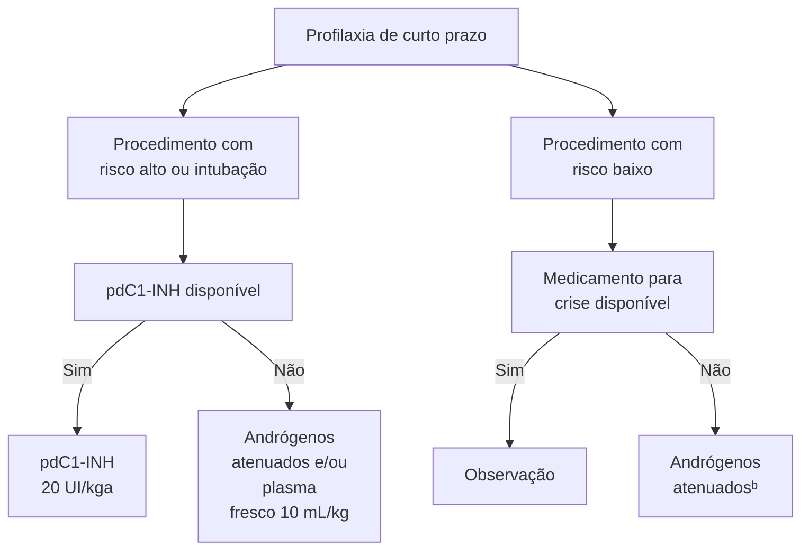
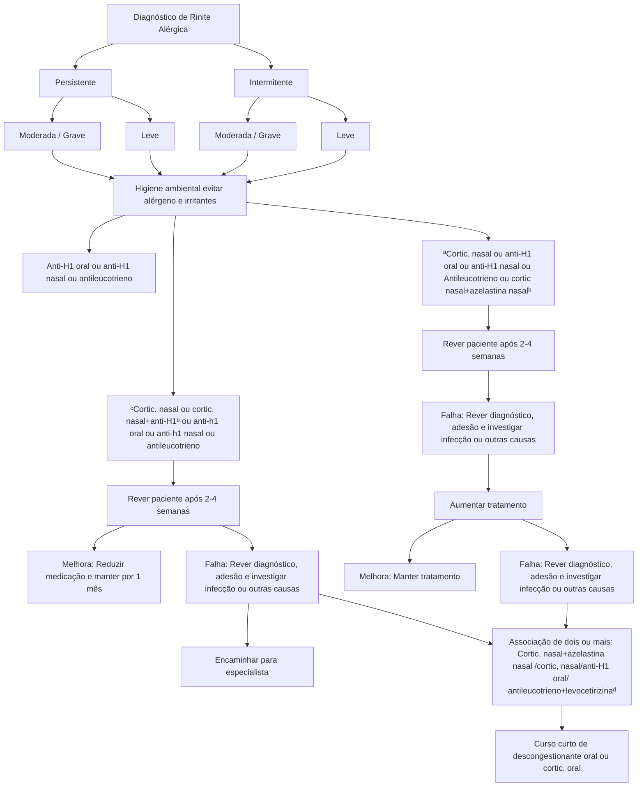
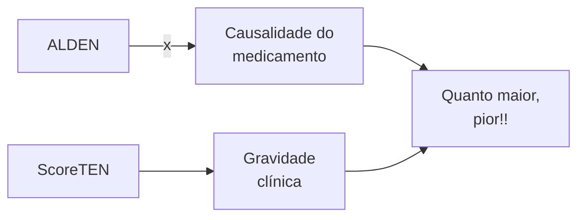

Imunologia (CM)

# ALERGIA 2: RINITE ANGIOEDEMA E DPV

**Angioedemas - histamina X bradicinina:**
- Histamina: pode ter urticária, prurido, evolução rápida, pode piorar com AINES e melhora com anti-H1;
- Bradicinina: não tem urticária, evolução lenta, não melhora com anti-H1, corticoide ou adrenalina. Lembrar do angioedema hereditário e do iECA.

**Urticária:**
- Se crônica (>6 semanas), investigar, principalmente autoimunidade/tireoide. Tratamento com anti-H1 (quadruplicar) → Omalizumab → Ciclosporina.

**Pacientes com urticária ou angioedema induzido por AINES:**
- Excluir todos inibidores da Cox1, liberar iCox2 ou paracetamol com doses menores que 750mg.

**Angioedema hereditário:**

- Tratamento de crise: plasma fresco congelado, icatibanto, inibidor de C1pd. Profilaxia: inibidor de C1pd, andrógenos, tranexâmico ou lanadelumabe.

**Rinite alérgica:**
- Corticoide nasal, associação com corticoide nasal + anti-H1, imunoterapia alérgeno-específica.

**DPV:**
- Parece asma, mas não é; discinesia de prega vocal. Tratamento com fono!

**ABPA:**
- Asma ou FC sempre. IgE e IgG para Aspergillus, bronquiectasias. Corticoide trata!

**Eritema multiforme**
- Causa infecciosa na maioria das vezes → Herpes Simplex

## 1. ANGIOEDEMA

| **Histamina**
- Hiperemia e prurido local
- Presença de urticária
(pode estar ausente)
- Pode ter tosse,
broncoespasmo, diarreia
- Boa resposta aos antiH1 | **X** | **Bradicinina**
- Duração prolongada (36-72h)
- Não há prurido
- Sem associação com urticária
- Sem resposta aos antiH1, corticoide ou adrenalina |
| ---------------------------------------------------------------------------------------------------------------------------------------------------------------------------------- | ----- | ----------------------------------------------------------------------------------------------------------------------------------------------------------------- |
| **Aumento da permeabilidade vascular**

Imagem mostrando pessoa com língua protuberante (angioedema de língua)                                                             |       |                                                                                                                                                                   |

**Figura 1** Diferenças entre angioedema por histamina e bradicinina.

- Qual é o mediador associado? **Figura 1**
- Outros sintomas associados: rubor, urticas, rinorreia, obstrução nasal e broncoespasmo.

### 1.1 ANGIOEDEMA POR HISTAMINA

- É o mais comum;
- Início em minutos até horas do estímulo;
- Resolução entre 24 e 48h.
- Pode ser agudo ou crônico (> 6 semanas);
- Boa resposta ao anti-H1, corticoide e adrenalina;
  - AINES: imunológico ou não (Cox1)

A principal célula efetora → **Mastócito!**

- O mastócito degranula facilmente com qualquer estímulo, liberando uma série de substâncias como proteoglicanos, triptase e histamina;
- Às custas da liberação de histamina é que são evidenciados os principais sintomas de uma crise de anafilaxia;
- Meios estimuladores da degranulação mastocitária:
  - Alergias;
  - Infecções;
  - Autoanticorpos;
  - Infecções;
  - Neoplasias;

IMUNOLOGIA (CM)

• Medicações opioides;
• Quinolonas;
• AINEs;
• Contraste iodado.
• Geralmente com urticárias;
• Mediado por IgE:
  • Alimentos;
  • Medicamentos;
  • Insetos;
  • Inalantes.
• Não mediado por IgE;
  • AINEs;
  • Contrastes iodados;
  • Opioides;
  • Vancomicina;
  • Fatores físicos;
  • Idiopático.

## 1.2 ANGIOEDEMA INDUZIDO POR AINES

**Figura 2** Fluxograma: Angioedema induzido por AINES

## 2. URTICÁRIA

• Degranulação de mastócitos e basófilos com liberação de histamina e vasodilatação local;
• Cursa com edema central com eritema reflexo:
  • Efêmera e restrita à epiderme;
  • Dura menos de 24h. Figura 3
• Não deixa lesão residual;
• Não costuma provocar ardência ou dor;
• Em geral, não há sintomas associados;
• Algumas causas:
  • Aguda (< 6 semanas): infecções agudas, medicações;
  • Crônica (> 6 semanas): doenças autoimunes (tireoide).

**Figura 3** Fotos de urticária - note as lesões eritematosas, confluentes com elevação.

## 2.1 ESPECTRO CLÍNICO DA URTICÁRIA CRÔNICA ESPONTÂNEA (UCE)

• Tem caráter crônico, porém remitente. Espectros:
  • Urticária isolada (50%);
  • Urticária com angioedema (40%);
  • Apenas angioedema (5 – 10%).
• 40% exacerbam com uso de AINEs;
• Doenças autoimunes, LES, AIJ, Sjögren, tireoide;
• Neoplasias (controverso): doenças linfoproliferativas;
• Infecções (controverso): HepB, HepC, herpes, H. pylori, helmintos;
• Duração média de 1–5 anos;
• Não há cura! Mas existe remissão espontânea;
• Fisiopatologias possíveis:
  • IgE contra o neoautoantígeno (Ex.: anti-TPO);
  • IgG contra IgE já ligado ou contra o FCeR1.
• Aguda <6 sem: infecções agudas, medicamento;
• Crônica ≥ 6 sem: associada à doenças autoimunes (tireoide).

## 2.2 TRATAMENTO DA UCE

• Observe **Figura 4** na página seguinte.

## 3. ANGIOEDEMA POR BRADICININA

• Considerações iniciais e características:
  • Gradativo;
  • Não pruriginoso;
  • Resolução mínima entre 48 e 72h;
  • Não há urticária associada;
  • Dor abdominal pode ocorrer – por edema de alças intestinais;
  • Sem resposta ao corticoide, adrenalina ou anti-H1.

**Figura 5** Angioedema bradicininérgico de lábio em paciente no Pronto Socorro.

ALERCIA 2: RINITE ANGIOEDEMA E DPV

**Figura 4** Fluxograma: Angioedema por Bradicinina

## 3.1 CAUSAS DE ANGIOEDEMA POR BRADICININA

**Figura 6** Fluxograma: Causas da angioedema por bradicinina

IMUNOLOGIA (CM)

# 4. ANGIOEDEMA HEREDITÁRIO – AEH

• Doença rara;
• Pontos importantes:
  • Mutação autossômica dominante: SERPING1, tipo mais comum dos AEH;
  • Defeito quantitativo no inibidor de C1 (85%);
  • Defeito qualitativo no inibidor de C1 (15%);
  • Incidência 1:50.000;
  • Mortalidade de 25% até 40%, se não tratados adequadamente.
• Angioedema de laringe – pode evoluir com insuficiência respiratória!

**Figura 7** Pacientes com angioedema hereditário, note o edema desfigurante de pálpebras e o de lábio superior.

## 4.1 QUADRO CLÍNICO

• Angioedema de face;
• Edema de extremidades e de genitais;
• Abdome – crises álgicas com náuseas e vômitos;
  • Causa frequente de laparotomias brancas.
• Eritema marginatum (25%);
• Não pruriginoso, pode preceder crise.

**Figura 8** Eritema serpiginoso ou marginatum – pródromo em paciente com AEH.

• Diretrizes brasileiras para o diagnóstico e tratamento do angioedema hereditário – 2017, ASBAI;
• Acrônimo HAAAAE:
  • **H:** hereditário;
  • **A:** angioedema recorrente;
  • **A:** dor abdominal recorrente;
  • **A:** ausência de urticária;
  • **A:** ausência de resposta ao uso de anti-histamínicos;
  • **E:** associação com estrogênio.

**Importância do C1-INH:**
• É um regulador negativo do sistema complemento;
• Influencia:
  • Sistema complemento → C1r, C1s, MASPs;

**HAAAAE**
- Hereditary
- recurrent Angioedema
- recurrent Abdominal pain
- Absence of urticaria
- Absence of response to anti-histamines
- Estrogen association

• Sistema de coagulação → Fator XI, trombina;
• Sistema fibrinolítico → tPA, plasmina;
• Sistema de contato → Fator XII, calicreína.
• A atuação do inibidor de C1 cursa com:
  • Elevação dos níveis de bradicinina;
  • Vasodilatação.

## 4.2 DESENCADEANTES DO AEH

• Trauma (mesmo com baixa intensidade);
• Exercício;
• Estresse;
• Mensuração da gestação;
• Uso de IECA;
• Mudanças bruscas de temperatura;
• Álcool;
• Infecção.**Figura 9**

## 4.3 CRITÉRIOS DIAGNÓSTICOS DO AEH

• Trauma (mesmo com baixa intensidade);
• Exercício;
• Estresse;
• Mensuração da gestação;
• Uso de IECA;
• Mudanças bruscas de temperatura;
• Álcool;
• Infecção.

**AEH-C1-INH:**
• Requerido: história de angioedema recorrente na ausência de urticárias, sem uso de medicamentos que possam desencadear angioedema; C1-INH antigênico ou funcional reduzidos (< 50% do normal); níveis de C4 reduzidos (valores basais ou dosados na crise);
• Suporte: detecção de uma variante patogênica no gene SERPING1 (não é necessário para o diagnóstico); história familiar de angioedema recorrente; idade de aparecimento < 40 anos.

**AEH-nC1-INH:**
• Requeridos: história de angioedema recorrente, na ausência de urticárias, sem uso de medicamentos que possam desencadear angioedema; níveis de C4, C1-INH antigênico e funcional sem alterações ou próximos dos valores normais; demonstração de uma mutação associada com a doença OU; história familiar de angioedema recorrente e ausência de eficácia na terapia com altas doses de anti-histamínicos de segunda geração durante um mês ou um intervalo esperado de três ou mais crises de angioedema, o que for mais longo;
• Suporte: história de resposta rápida e duradoura a um medicamento que inibe bradicinina; angioedema visível documentado ou em pacientes com sintomas abdominais, evidência de edema da parede intestinal documentado por TC ou RNM.

ALERCIA 2: RINITE ANGIOEDEMA E DPV

**Figura 9** Desencadeantes das crises de angioedema bradicininérgico.

**Figura 10** Fluxograma: Diagnóstico AEH

**Tabela 1** Características Laboratoriais:

|                  | AEH-C1-INH
AEH Tipo | AEH-C1-INH
AEH Tipo | AEH-nC1-INH                               | AEA-C1-INH                | AEA-IECA |
| ---------------- | ----------------------- | ----------------------- | ----------------------------------------- | ------------------------- | -------- |
| C1-INH           | < 50%                   | Normal ou
aumentado | Normal                                    | < 50%                     | Normal   |
| C1-INH funcional | < 50%                   | < 50%                   | Normal                                    | < 50%                     | Normal   |
| C4               | Baixo                   | Baixo                   | Normal                                    | Baixo                     | Normal   |
| C1q              | Normal                  | Normal                  | Normal                                    | Baixo (70% dos
casos) | Normal   |
| Mutação          | SERPING1                | SERPING1                | FXII, PLG, ANGPT1,
KNG1, MYOF, HS3ST6 | Não                       | Não      |
| Ac-anti-C1 INH   | Não                     | Não                     | Não                                       | 50% dos casos             | Não      |

AEH = angioedema hereditário, AEH-C1-INH = angioedema hereditário com deficiência do inibidor de C1, AEH-nIC1-INH = angioedema hereditário com inibidor de C1 normal, AEA-C1-INH = angioedema adquirido com deficiência do inibidor de C1, AEA-IECA = angioedema adquirido por inibidor da enzima conversora de angiotensina, C1-INH = inibidor de C1, Ac anti C1-INH = anticorpo anti C1-INH.

**Orientações:**
- Estão contraindicados:
  - Esportes de alto impacto;
  - IECA, BRA, gliptinas e inibidores da neprilisina;
  - Contracepção com estrógenos.

- A vacinação contra hepatites A e B → Recebimento de plasma em crises.

**Tratamento para crises (súbito):**
- Profilaxia de curto prazo: cirurgias de risco;
- Profilaxia de longo prazo: reduzir frequência e gravidade das crises;

IMUNOLOGIA (CM)

## Profilaxia de curto prazo

**Figura 11** Fluxograma: Profilaxia AEH

## 4.4 TRATAMENTO
Consultar **Tabela 12**

## 4.5 TAKE-HOME MESSAGES
• Angioedemas: avaliar sempre o mediador de acordo com a história (duração, resposta ao antiH1, concomitância com urticária);
• **AINES:** liberar apenas seletivos de Cox2 (avaliar antes alergo). Urticária > 6 semanas: avaliar autoimunidades, se não responder ao antiH1 → Omalizumabe e NÃO USAR CORTICOIDE;
• Angioedema hereditário: nem sempre o C4 e o C1-INH vão alterar. Se o C1q alterar → Avaliar causas secundárias - Autoimunidades;
• **AEH:** tratamento em crises, profilaxia de curto ou de longo prazo. Cuidado com desencadeantes de crise - trauma, por exemplo, e lembrar-se do eritema marginatum como pródromo.

# 5. DISFUNÇÃO DE PREGAS VOCAIS

• Apresenta outras denominações: asma laríngea ou discinesia de pregas vocais (DPV);
• A patologia é decorrente do fato de que as pregas vocais aduzem ao invés de abduzir e fecham durante respiração, cursando com dispneia extratorácica;
  • Confusão diagnóstica: asma grave, IOT e corticoides.
• Auxiliam no diagnóstico:
  • Laringoscopia: fenda posterior no fechamento das pregas vocais (durante sintomas);
  • Espirometria: achatamento da alça inspiratória.
• Tratamento:
  • Encaminhamento à equipe de fonoaudiologia para fonoterapia;

• Psicoterapia: o quadro demonstra associação com eventos ansiosos;
• No caso de asma associada → Manejar com corticoide inalatório.

# 6. ASPERGILOSE BRONCOPULMONAR ALÉRGICA (ABPA)

• Reação de hipersensibilidade complexa causada pelo Aspergillus fumigatus;
• Formação de anticorpos IgE e IgG e de células Th2 CD4+ e Th17 responsivas;
• Participação de ILC2 e eosinófilos.
• Quase exclusiva em pacientes com asma ou fibrose cística;
• Teste cutâneo em asmáticos para Af 25%;
• Teste cutâneo em fibrose cística para Af 50%;
• 13% dos pacientes com asma;
• 9% dos pacientes com fibrose cística.

## 6.1 CLÍNICA
• Episódios recorrentes de sibilância;
• Apresentação de tosse, dispneia, dor torácica; pleurítica, expectoração com sangue ou com tampões de muco marrons;
• Anorexia, fadiga, dores generalizadas, febre baixa e perda de peso;
• Pode ocorrer com sinusite fúngica alérgica, apresentando sintomas de sinusite crônica com secreção purulenta do seio nasal.

## 6.2 RADIOLOGIA/PFP
• Infiltrados pulmonares fugazes, irregulares;
• Bronquiectasias centrais;
• Opacidade em "dedo na luva": sugestiva de impactação mucoide em brônquios dilatados;

ALERCIA 2: RINITE ANGIOEDEMA E DPV                                                                                           7

**Tabela 2** Estratégias de tratamento disponíveis no Brasil para tratamento de AEH.

| População               | Linha de tratamento | Estratégias de tratamentoProfilaxia
Longo prazo             | Estratégias de tratamentoProfilaxia
Curto prazo | Estratégias de tratamentoProfilaxia
Crise |
| ----------------------- | ------------------- | --------------------------------------------------------------- | --------------------------------------------------- | --------------------------------------------- |
| Adultos e idosos        | Primeira            | pdC1-INH (SC, EV)
Lanadelumabe
Berotralstat             | pdC1-INH EV                                         | pdC1-INH EV
Icatibanto                    |
|                         | Segunda             | Andrógenos atenuados
Ácido tranexamico                      | Andrógenos atenuados
Plasma                     | Plasma                                        |
| Crianças e adolescentes | Primeira            | pdC1-INH EV
pdC1-INH SC > 8 anos
Lanadelumabe > 12 anos | pdC1-INH EV                                         | pdC1-INH EV
Icat banto 2 anos             |
|                         | Segunda             | Ácido tranexamico
Andrógenos atenuados
após a puberdade | Andrógenos atenuados
Plasma                     | Plasma                                        |
| Gestantes               | Primeira            | pdC1-INH (SC, EV)                                               | pdC1-INH EV                                         | pdC1-INH EV                                   |
|                         | Segunda             | Ácido tranexamico                                               | Plasma                                              | Plasma                                        |

PFP: DVO nas fases iniciais e DVR com DLCO reduzido nas fases tardias. **Figura 11**

**Figura 12** Radiografia simples de tórax com sinal em "dedo de luva" (seta) e opacidades modulares em terço médio direito

## 6.3 CRITÉRIOS ISHAM

1. Condições predisponentes (1 deve estar presente):
   - Asma;
   - Fibrose cística.
2. Critérios obrigatório (ambos devem estar presentes):
   - Teste cutâneo positivo para Aspergillus fumigatus OU
   - IgE específico in vitro.
   - **IgE total > 417 UI/mL ou 1000 ng/mL \***
3. Outros critérios (pelo menos 2 devem estar presentes):
   - Anticorpos precipitantes séricos para A. fumigatus (ou outro método);
   - Opacidades pulmonares radiográficas compatíveis com ABPA;
   - Eosinofilia > 500 células/mcL.

## 6.4 TRATAMENTO

- Prednisona – primeira linha – 0,5mg a 2mg/kg/dia;
  - Manter por 14 dias e desmamar em 6 a 8 semanas;

- Observar queda de IgE total neste período - >35%;
- Se recidiva, retornar com corticoide.
- E o antifúngico, quando usar?
  - **Doença refratária ao corticoide;**
  - **Recidiva na redução do corticoide;**
  - **Complicações pelo corticoide.**
- Escolha principal de antifúngico: itraconazol 200 mg 2x ao dia 4 a 6 semanas com redução em 4 a 6 meses.
- Voriconazol: melhor biodisponibilidade e tolerância, mas pode causar fotossensibilidade;
- Posaconazol: melhor para redução de IgE específico em pacientes com FC;
  - **Omalizumabe - Anti-IgE;**
  - **Benralizumabe ou Mepolizumabe- Anti-IL5 ou IL5R;**
  - **Dupilumabe - Anti-IL4Ra (IL4 e IL13).**

# 7. RINITE ALÉRGICA

- Ocorre pela inflamação da mucosa nasal:
  - Aguda: infecções virais (maioria);
  - Crônica: rinite alérgica.
- Apresenta concomitância com a asma em muitos casos;
- Atenção ao conceito das vias aéreas unidas.
- Classificação ARIA:
  - Prevalência;
  - Impacto na qualidade de vida;
  - Impacto no desempenho no trabalho e escola;
  - Carga econômica;
  - Concomitância com outras comorbidades. Consultar **Figura 13** na próxima página.

## 7.1 CAUSAS DE RINITE NÃO-ALÉRGICA

- Rinite infecciosa;
- Rinite eosinofílica não alérgica (RENA);
- Rinite hormonal/rinite gestacional;
- Rinite induzida por fármaco → AINEs, contraceptivos, sedativos, betabloqueadores;

IMUNOLOGIA (CM)

| **Intermitente**
< 4 dias por semana
ou < 4 semanas                                                                                                       | **Persistente**
≥ 4 dias por semana
e ≥ 4 semanas                                                                                                                    |
| ----------------------------------------------------------------------------------------------------------------------------------------------------------------- | ---------------------------------------------------------------------------------------------------------------------------------------------------------------------------- |
| **Leve**
Sono normal
Atividades diárias, esportivas e
recreação normais
Atividades normais na escola e
no trabalho
Sem sintomas incômodos | **Moderada-Grave**
um ou mais itens
Sono anormal
Interferência com
atividades habituais
Dificuldades na escola ou
no trabalho
Sintomas incômodos |

**Figura 13** Fluxograma: Classificação ARIA

• Rinite medicamentosa → Abuso por descongestionantes nasais;
• Rinite gustativa → Rinorreia por alimentos quentes e condimentados;
• Rinite emocional;
• Rinite atrófica → Ozenosa/secundária;
• Secundária à variações anatômicas;
• Idiopática (50%).

## 7.2 TRATAMENTO

• Observe Figura 14;
• Para quadros moderados/graves → O padrão ouro é corticoide nasal ou anti-H1 oral o nasal;
• Atualmente, o melhor tratamento é a imunoterapia alérgeno-específica;
• 1° passo: avaliar a sensibilização e história pessoal;
• 2° passo: avaliar se existem estratos e definir qual a via de aplicação.

**Figura 15** Prick test positivo para Dermatophagoides pteronyssimus (ácaro) e controle positivo.

A resposta depende de alguma etapas:
• Sensibilização e reexposição;
  • Contato do alérgeno com o agente;
  • Os linfócitos naïve tem contato com o alérgeno às custas de uma célula dendrítica e de algumas citocinas (IL-4, IL-25);
  • O linfócito naïve se transforma em linfócito Th2;
  • O linfócito Th2 ativa o linfócito B naïve;

• Assim, linfócito B naïve → Plasmócito (apresenta função de secretar anticorpos);
• Tais anticorpos secretados são IgE específicos (às custas do alérgeno processado inicialmente) e que se conectam ao mastócitos em aguardo de nova resposta imunológica;
• Agora, durante a reexposição, quando o alérgeno entra em contato com o mastócito, ocorrerá a degranulação.

Indução de tolerância:
1. A imunoterapia funciona pois induz a tolerância, ou seja, há um estímulo persistente, padronizado, em concentrações e doses crescentes;
2. As células T ou reguladores têm papel fundamental nesse processo em virtude de que, quando estimuladas, conseguem inibir todo o sistema imunológico e a resposta alérgica;
3. Ou seja, o paciente desenvolve a tolerância imune;
4. Ação da imunoterapia alérgeno-específica;
5. Há uma imunoterapia sublingual ou subcutânea;
6. Estímulo de outras populações celulares para gerar tolerância e reduzir os níveis de degranulação.

## 8. ERITEMA MULTIFORME

• Definição: é uma reação de hipersensibilidade pós infecção;
• Características:
  • Início súbito com máculas ou pápulas/bolhas, eventualmente;
  • Raramente apresenta acometimento ocular;
  • **Lesões típicas em alvo;**

**Figura 16** Lesão em alvo - eritema multiforme

• Pode apresentar-se com sintomas sistêmicos;
  • Febre, artralgia e mal-estar.
• Duração média de 2 a 4 semanas.

Consultar **Figura 14** na próxima página.

ALERCIA 2: RINITE ANGIOEDEMA E DPV

## 8.1 CAUSAS DE ERITEMA MULTIFORME

| Herper simplex
Mycoplasma
pneumoniae
Hepatite B
EBV
CMV
Histoplasma
Paracoco
Varicela zoster | Kawasaki
Gardnerella
Medicamentos aminopenicilinas
Malignidade e autoimunidade
Irradiação e vacinas |
| ---------------------------------------------------------------------------------------------------------------------------- | ------------------------------------------------------------------------------------------------------------------- |

• Eritema multiforme major;
  • Cursa com sintomas "flu-like" e lesões de mucosa oral e genital;

### Diagnóstico de Rinite Alérgica

**Imunoterapia específica**

**Medicação de resgate: anti-H1 oral/anti-H1 com descongestionante/cortic.oral**

**Figura 14** Anti-H1 (anti H1); Cortic.- corticosteroide; a-sem ordem de preferência; b- acima de 6 anos; c-em ordem de preferência; d-acima de 18 anos.

• Nesse sentido, a depender do acometimento, pode ser necessária a internação;
• O manejo dependerá do comprometimento do paciente.
• Principais fatores: Mucosa ocular; sintomas sistêmicos;
• O uso de corticoide é controverso! Podem ser usados antivirais.

**Figura 17** Eritema multiforme – lesões em alvo, note a diferença de coloração entre bordos e centro.

IMUNOLOGIA (CM)

# REFERÊNCIAS

**Figura 1** Diferenças entre angioedema por histamina e bradicinina.

Arquivo pessoal: Dr Alex Prado

**Figura 3** Fotos de urticária – note as lesões eritematosas, confluentes com elevação.

Arquivo pessoal: Dr Alex Prado

**Figura 5** Angioedema bradicininérgico de lábio em paciente no Pronto Socorro. Arquivo pessoal dr Alex Prado

Arquivo pessoal: Dr Alex Prado

**Figura 7** Pacientes com angioedema hereditário, note o edema desfigurante de pálpebras e o de lábio superior. Arquivo pessoal de Dr Alex Prado

Arquivo pessoal: Dr Alex Prado

**Figura 8** Eritema serpiginoso ou marginatum – pródromo em paciente com AEH.

https://dermnetnz.org/

**Figura 12** Radiografia simples de tórax com sinal em "dedo de luva" (seta) e opacidades modulares em terço médio direito

https://doi.org/10.1590/S1806-37132006000500015

**Figura 15** Prick test positivo para Dermatophagoides pteronyssinus (ácaro) e controle positivo.

Arquivo pessoal: Dr Alex Prado

**Figura 16** Lesão em alvo – eritema multiforme

https://dermnetnz.org/

**Figura 17** Eritema multiforme – lesões em alvo, note a diferença de coloração entre bordos e centro.

https://dermnetnz.org/

Anafilaxia (PED)

# ALERGIA: REAÇÕES DE HIPERSENSIBILIDADE

## Alergia

• Formação de IgE: necessidade de sensibilização prévia.

## Cuidado

• Mastócitos podem degranular sem IgE: infecções, autoanticorpos, neoplasias, opioides, quinolonas, AINES e contraste iodado.

## Anafilaxia

• Reação de hipersensibilidade tipo 1: diagnóstico clínico, mas pode-se dosar triptase em situações de dúvida (30 min a 2 horas). Tratamento de primeira linha - adrenalina IM.

## Doença do soro ou soro-like

• (RH tipo 3): formação de imunocomplexos. Febre, artralgia, artrite e lesões cutâneas. Pode ser local (vacina) ou sistêmico (medicamentos ou infecção).

## Farmacodermias graves

• (RH tipo 4): acometimento de mucosa, eosinofilia, % corporal, % acometido, bolhas e Nikolski. Uso de anticonvulsivantes. Suspender droga e:
• 1)DRESS (2-8 sem início da droga) - corticoide 2 mg/ kg/dia, pode ocorrer reativação viral;
• 2)NET/SSJ (1-3 sem início da droga) - imunoglobulina 1g/kg/dia, ciclosporina e anti-TNF, corticoide aumenta risco de infecção.

## PEGA

• Não é grave, pústulas subcórneas, uso de beta lactâmicos. Prednisona 1 mg/kg.

## 1. PROTÓTIPOS DE GEL & COOMBS/PICHLER

### Definição

• Consultar a Tabela 1

## 2. ANAFILAXIA

### 2.1 DEFINIÇÃO

• Reação sistêmica aguda grave, potencialmente fatal;
• Com mecanismos, apresentações clínicas e gravidade variada;
• Resulta da liberação repentina de mediadores de mastócitos e basófilos ativados após o contato com uma substância causadora específica:
• Demonstra subdiagnóstico e subtratamento;
• É uma emergência médica!
• A principal célula efetora → mastócito!
• O mastócito degranula facilmente com qualquer estímulo, liberando uma série de substâncias como proteoglicanos, triptase e histamina;
• Às custas da liberação de histamina é que são evidenciados os principais sintomas de uma crise de anafilaxia;

**Tabela 1** Mecanismos de hipersensibilidade de Gel e Coombs

| MECANISMOS DE HIPERSENSIBILIDADE                    | MECANISMO EFETOR                                              | PROTÓTIPO CLÍNICO                                                                 |
| --------------------------------------------------- | ------------------------------------------------------------- | --------------------------------------------------------------------------------- |
| I - Anafiláticos/imediata                           | IgE, mastócitos e basófilos                                   | Anafilaxia, urticária, angioedema, broncoespasmo                                  |
| II - Citotoxicidade celular dependente de anticorpo | IgM, IgG, complemento, fagocitose, NK                         | Nefrites, citopenias, pneumonites                                                 |
| III - Imunocomplexos                                | IgM, IgG, complemento, fagocitose                             | Doença do soro, febre, urticária, vasculites, glomerulonefrite                    |
| IV - Celular                                        | Linfócitos T, citocinas, mononucleares, células de Langerhans | Dermatite de contato, fotoalergias, eritema fixo, exantemas, DRESS, SSJ/NET, PEGA |

• Meios estimuladores da degranulação mastocitária: alergias; infecções; autoanticorpos; Infecções; neoplasias; medicações opioides; quinolonas; AINEs; contraste iodado.
• Mecanismo da anafilaxia;
• Histamina como o principal mediador;
• Fases:
  • Sensibilização → formação do IgE;
  • Efetora: reação → degranulação de mastócitos e basófilos.

### 2.2 SINTOMAS

**Respiratórios superiores:**
• Rinorreia;
• Coriza;
• Angioedema;
• Estridor.

**Respiratórios:**
• Tosse;
• Dispneia;
• Broncoconstrição;
• Hipóxia.

**Digestivos:**
• Náusea;
• Vômitos;

• Dor abdominal;
• Diarreia.

**Cardiovascular:**
• Hipotensão;
• Taquicardia;
• Vasodilatação;
• Aumento da permeabilidade vascular;
• Síncope.

**Pele:**
• Eritema;
• Urticária;
• Angioedema.
• **Síndrome de Kounis** → síndrome coronariana aguda na anafilaxia, liberação de mediadores, vasodilatação, espasmo e vasoplegia!

## 2.3 REAÇÕES BIFÁSICAS

**20%**
• Mais comuns com alimentos;
• Doses inadequadas do tratamento inicial;
• Retardo na aplicação da adrenalina;
• Até 8h após o quadro inicial - pode recorrer 72h após a crise inicial;
• Não existem sinais ou sintomas preditivos da recorrência do quadro;
• **Não liberar o paciente após o primeiro tratamento!**

• Confira na página seguinte a **Figura 1**

## 2.4 DIAGNÓSTICO

• É essencialmente clínico!
• Dosagem da triptase sérica entre 30 minutos até 2 horas da reação:
  • É um mediador específico da degranulação do mastócito;
  • É mais fácil de dosar do que a histamina;
  • Auxilia nos quadros de clínica incompleta e em anafilaxia perioperatória.
• Investigação: 4 semanas após a reação → ideal!
  • Testes in vivo → testes cutâneos;
  • Testes in vitro → IgE sérica específica;
  • Provocação oral ou endovenosa.

**Critérios WAO, 2020:**
• Ainda são polêmicos
• aumentam muito a sensibilidade mas se parecem com os anteriores. Consultar **Tabela 2**

| AINES | Exercício | Infecção |
|-------|-----------|----------|
| Jejum |           | Álcool   |
| Estresse | Menstruação | Temperatura extrema |

**Figura 2** Cofatores da anafilaxia

**Tabela 2** Critérios diagnósticos:

**Deve-se considerar anafilaxia como diagnóstico muito provável quando existe uma reação sistêmica grave na presença de pelo menos um de três critérios clínicos:**

Início súbito (minutos a algumas horas) com envolvimento da pele e/ou mucosas (urticária, eritema ou prurido generalizado; edema dos lábios, da língua ou da úvula) e pelo menos um dos seguintes:
• Comprometimento respiratório: dispneia, sibilância/ broncoespasmo, estridor, diminuição do DEMI/PEF, hipoxemia;
• Hipotensão ou sintomas associados à disfunção de órgão terminal: hipotonia, síncope ou incontinência esfincteriana.

Ocorrência de dois ou mais dos seguintes critérios de forma súbita após exposição a um alergênio provável para aquele doente (minutos a algumas horas):
• Envolvimento da pele e/ou mucosas: urticária, eritema ou prurido generalizado; edema dos lábios, da língua ou da úvula;
• Compromisso respiratório: dispneia, sibilância/ broncoespasmo, estridor, diminuição do DEMI/PEF, hipoxemia;
• Hipotensão ou sintomas associados: hipotonia, síncope ou incontinência esfincteriana;
• Sintomas gastrointestinais súbitos: cólica abdominal, vômitos.

Hipotensão após exposição a um alergênio conhecido para aquele doente (minutos a algumas horas):
• Lactentes e crianças: ↓ PAS ou ↓ do valor basal superior a 30%;
• Adultos: PAS < 90 mmHg ou ↓ do valor basal do doente superior a 30%.

• **DEMI**: débito expiratório máximo instantâneo; PA (pressão arterial), PAS (pressão arterial sistólica), PEF (peak expiratory flow);
• **\* PAS:** < 1 ano de idade: inferior a 70 mmHg/1-10 anos: inferior a [70 mmHg + (2x idade)]/11-17 anos: inferior a 90 mmHg.

## 2.5 COFATORES DA ANAFILAXIA
• Consultar **Figura 2** e **Figura 3**

## 2.6 FATORES DE RISCO PARA GRAVIDADE

| Uso de medicações | Asmáticos | Cardiopatas |
|-------------------|-----------|-------------|
| Idosos |           | Dose/via do alergênio |
| Homens | Adolescentes | Doença dos mastócitos |

**Figura 3** Fatores de risco para gravidade de quadros anafiláticos

REAÇÕES DE HIPERSENSIBILIDADE (R+ PED)

Resposta primária | Resposta tardia

Sintomas

0    20    40    60    2    4    6    8    10    24
Minutos                    Horas

**Figura 1** Reação bifásica na anafilaxia

## 2.7 TRATAMENTO

• Afastar o agente causador, se possível (por exemplo, infusão do medicamento causador – cuidado com látex);
• Avaliar circulação, via aérea, respiração e status mental;
• Adrenalina: deve ser realizado o mais precoce possível:
  • Paciente deitado: cuidado com vômitos! Manter extremidades elevadas;
  • Manter o paciente deitado por pelo menos 30 minutos após a administração da adrenalina;
  • Concentração padrão da ampola: 1000;
  • Via: intramuscular em vasto lateral, repetir até 2 vezes a cada 5 a 15 minutos (não fazer subcutânea);
  • Adultos: 0,3 a 0,5 mg (0,3 a 0,5 ml);
  • Crianças: 0,01 mg/kg (0,01 ml/kg), dose máxima de 0,3 mg; < 6 anos: 0,15 ml; 6 a 12 anos: 0,3 ml; > 12 anos: 0,5 ml.
  • Não existem contraindicações absolutas na anafilaxia.
• Confira **Tabela 3**
• Administrar O² e volume na dependência do quadro;
• Medicações de segunda linha: anti-H1, B2 agonista e corticosteroides;
  • Corticosteroides - prevenção do segundo pico dependente de eosinófilos.

**Tabela 3** Receptores adrenérgicos e suas funções

| RECEPTOR ADRENÉRGICO | FUNÇÃO                                                                                                                                            |
| -------------------- | ------------------------------------------------------------------------------------------------------------------------------------------------- |
| A1                   | Aumento da vasoconstrição
Aumento da resistência vascular periférica
Aumento da PA
Redução do edema tecidual
Vasoconstrição nasal |
| A2                   | Redução da pressão intraocular                                                                                                                    |
| B1                   | Aumento da FC (cronotropismo)
Aumento da contratilidade (inotropismo)
Vasoconstrição de pele e mucosa                                     |
| B2                   | Broncodilatação
Vasodilatação
Reduz liberação de mediadores inflamatórios                                                                 |

• Conferir **Tabela 4** na página seguinte

• Causas de anafilaxia refratária:
  • Asma;
  • Uso de betabloqueadores;
  • Doença cardíaca;
  • Alérgeno em alta concentração;
  • Administração endovenosa do alérgeno;
  • Atraso na administração de adrenalina.

**Adulto:**
Em BIC na dose de 0,05 a 0,5 mcg/kg/min

**Crianças:**
Em BIC na dose de 0,1 a 2 mcg/kg/min

## 3. CASOS ESPECIAIS NA ANAFILAXIA

### 3.1 MASTOCITOSE

• Dá-se por uma doença clonal dos mastócitos por mutação no c-kit (CD117);
• Anafilaxias são comuns;
• Outras manifestações:
  • Dispepsia;
  • Lesões cutâneas com Sinal de Darier positivo.

**Figura 4** Criança com mastocitose e sinal de Darier positivo

• Osteoporose;
• Alergia aos himenópteros (abelha, vespa e formiga).

| Mastocitose
cutânea - mais
comum na
criança | Mastocitose
sistêmica - mais
comum no adulto |
| ------------------------------------------------------- | ---------------------------------------------------- |
| ↓

Mais comumente
autolimitada              | ↓

Acometimento
medular, ósseo           |

IMUNOLOGIA

**Tabela 4** Possibilidades de tratamento na anafilaxia além da adrenalina

| Expansão de volume:
solução salina Ringer
Lactato         | • Adultos/Adolescentes: 1-2 litros
rapidamente IV;
• Crianças: 5-10 ml/kg IV nos primeiros 5
minutos e 30 ml/kg na primeira hora.                                                                                                                                                                                                                                                                                                                                                                              | • Taxa de infusão é regulada pelo pulso e
pressão arterial;
• Estabelecer acesso IV com o maior calibre
possível. Monitorar sobrecarga de volume.                                                                |
| ----------------------------------------------------------------- | -------------------------------------------------------------------------------------------------------------------------------------------------------------------------------------------------------------------------------------------------------------------------------------------------------------------------------------------------------------------------------------------------------------------------------------------------------------------------------------------------------------------------- | ---------------------------------------------------------------------------------------------------------------------------------------------------------------------------------------------------------------------------- |
| Oxigênio (O²)                                                     | • Sob cânula nasal ou máscara.                                                                                                                                                                                                                                                                                                                                                                                                                                                                                             | • Manter saturação de O;
• Se sat O2 95%, há necessidade de mais
de uma dose de adrenalina.                                                                                                                          |
| Beta2-Agonistas Sulfato de
salbutamol                         | **Via inalatória:**
• Aerosol dosimetrado com espaçador
(100 mcg/jato);
• Adultos/Adolescentes: 4-8 jatos a cada
20 minutos. Dose máxima: 20 jatos;
• Crianças: 50 mcg/Kg/dose = 1 jato/2kg;
• Dose máxima: 10 jatos;
• Nebulizador: a solução para
nebulização é em gotas (5 mg/ml) ou
flaconetes (1,25 mg/ml). Adultos/
• Adolescentes 2,5-5,0 mg a cada 20
minutos por 3 doses;
• Crianças: 0,07-0,15 mg/kg a cada 20
minutos até 3 doses;
• Dose máxima: 5 mg. | • Para reversão do broncoespasmo;
• Existem diferentes concentrações
e doses;
• Outros broncodilatadores B2-agonistas
(ex: fenoterol).                                                                       |
| Anti-histamínicos:
prometazina, difenidramina,
ranitidina | • Adultos/Adolescentes: 25-50 mg IV;
• Crianças: 1 mg/kg IV até máximo 50 mg;
• Adultos/Adolescentes: 12,5-50 mg IV
até 10 minutos;
• Crianças: 1 mg/kg.                                                                                                                                                                                                                                                                                                                                                   | • Anti-H1 associados a anti-H2 podem ser
mais eficazes do que os anti-H1 isolados;
• Dose oral pode ser suficiente para
episódios mais brandos;
• Papel na anafilaxia aguda ainda não é
bem determinado. |
| Glicocorticoides:
metilprednisolona,
prednisona           | • Dose: 1-2 mg/kg/dia IV;
• Dose: 0,5-1mg mg/kg/dia VO.                                                                                                                                                                                                                                                                                                                                                                                                                                                                | • Padronização de doses não
estabelecidas: prevenção de
reações bifásicas?                                                                                                                                           |

## 3.2 SÍNDROME LÁTEX-FRUTA

- Como e quando investigar?
- Take-home messages:
- Acontece por reatividade cruzada → às proteínas do látex (Hev b) em algumas frutas:
  - Látex → frutas (35%);
  - Frutas → látex (11%).
- Proteínas do látex:
  - Elevado: abacate; banana; kiwi.
  - Moderado: maçã; cenoura; melão; mamão papaia; batata; tomate.
- Grupos de risco: profissionais de saúde; indivíduos com espinha bífida; pacientes com múltiplas cirurgias.

### 3.3 Anafilaxia induzida por trigo + exercício

- Anafilaxia ocorre apenas com consumo do trigo algumas horas antes do exercício (4 a 6h);
- Pode ocorrer também com camarão, castanhas, amendoim, leite, banana e milho;
- Confira na página seguinte a Figura 5;

**Figura 5** Urticária aguda, observe as placas eritematosas, podem ser a primeira manifestação de uma anafilaxia

REAÇÕES DE HIPERSENSIBILIDADE (R+ PED)                                                                                                  5

## Como e quando investigar?

Liberar paciente com plano de ação e orientar afastamento do suposto responsável

Encaminhar para investigação apenas após 4 semanas do evento: testes cutâneos e IgE específico

Não usar mais o termo "anafilactoide"; correto é "pseudoalérgica". Desgranulação de mastócitos independente do IgE; testes cutâneos negativos.

### Take-home messages:

Anafilaxia: adrenalina é a primeira escolha sempre; não deixar o paciente levantar e nunca liberar imediatamente após o tratamento

Triptase pode ser útil em casos de dúvida diagnóstica - ex. durante ato operatório

Cuidado com novos critérios
Avaliar sempre a história; exposição a qualquer alérgeno provável + sintomas → aventar quadro alérgico/anafilático (ex. choque)

Condições especiais: asmáticos, mastocitose sistêmica ou cofatores podem aparecer em questões (exercícios, AINEs e alimentos)

## 4. DOENÇAS DO SORO E SORO-LIKE

A doença do soro ocorre por uma reação por imunocomplexos.

**Figura 6:** Processo de formação do imunocomplexo - reação de hipersensibilidade do tipo 3

**Tabela 5** Diferença entre doença do soro e doença do soro-like

| Doença do soro                           | Doença do Soro-Like                   |
| ---------------------------------------- | ------------------------------------- |
| Entrada de proteínas estranhas           | Mecanismo não completamente elucidado |
| Soro heterólogo                          | Mais comum com antibiótico            |
| Antitoxinas                              | Aumento de permeabilidade intestinal  |
| Algumas vacinas                          | Efeito tóxico medicamentoso           |
| Proteínas fibrinolíticas terapêuticas    | Idiossincrasia                        |
| Proteínas de insetos                     | Infecções virais - Ex. hep B          |
| Anticorpos monoclonais não humanos (X;Z) |                                       |
| Adultos com hipocomplementenemia         | Crianças com Normocomplementenemia    |

### Evolução da Doença do Soro;

**Figura 7** Evolução da doença do soro em dias

| Dias  | Níveis séricos                                                              |
| ----- | --------------------------------------------------------------------------- |
| 0-2   | Antígeno (aumentando)                                                       |
| 4-8   | Complemento (pico), Antígeno (diminuindo), Imuno-complexos (pico)           |
| 8-14  | Anticorpo livre (aumentando), Lesões vasculares, renais, articulares (pico) |
| 14-20 | Anticorpo livre (mantendo)                                                  |

### 4.1 CARACTERÍSTICAS

**Sintomas:**
- Erupção cutânea;
- Febre;
- Poliartralgias;
- Artrites.

- O quadro surge cerca de 1 a 2 semanas após exposição ao agente com resolução dias/semanas na descontinuação;
- Autolimitada: bom prognóstico.

### 4.2 CAUSAS DE DS (DOENÇA DO SORO)

- Confira **Tabela 6** na proxima página.

IMUNOLOGIA

**Tabela 6** Antitoxinas microbianas

| Antitoxinas microbianas                                                                                                 |   |
| ----------------------------------------------------------------------------------------------------------------------- | - |
| Antidifteria equina                                                                                                     |   |
| Antirraiva para equinos ou ovinos                                                                                       |   |
| Toxina antibotulínica equina                                                                                            |   |
| Imunizações                                                                                                             |   |
| Antígenos da raiva                                                                                                      |   |
| Vacina pneumocócica                                                                                                     |   |
| Vacina contra o *Hemophilus B*                                                                                          |   |
| Antitoxinas do veneno                                                                                                   |   |
| Equino, coelho, veneno anticobra (*Crotalidae* \[víboras, cascavéis], antivenina, *Micrurus* \[cobra-coral] antivenina) |   |
| Veneno equino antiaranha (*Lactrodectus*)                                                                               |   |
| Medicamentos                                                                                                            |   |
| Rituximab                                                                                                               |   |
| Infliximabe                                                                                                             |   |
| Globulina anti-timócitos de equinos ou coelhos                                                                          |   |
| Anti-CD3 murino                                                                                                         |   |
| Natalizumab                                                                                                             |   |
| Comumente implicadas                                                                                                    |   |
| Penicilina / Amoxicilina                                                                                                |   |
| Cefaclor                                                                                                                |   |
| Sulfametoxazol - trimetoprim                                                                                            |   |
| Raramente implicadas                                                                                                    |   |
| Aspirina                                                                                                                |   |
| Carbamazepina                                                                                                           |   |
| Ciprofloxacino                                                                                                          |   |
| Metronidazol                                                                                                            |   |
| Heparina                                                                                                                |   |

## 4.3 DIAGNÓSTICO
- Exantemas virais;
- Urticária vasculite;

- DRESS/DHIS;
- SSJ/NET;
- Eritema multiforme;
- Doença de Kawasaki;
- LES/PHS.

Não são necessário biópsia ou exames complementares para tomada de conduta!

## 4.4 TRATAMENTO
- Interromper o uso do agente causador imediatamente;
- Sintomáticos;
- Para os casos mais graves → corticoterapia oral/EV (raro).

**Take-home messages:**

Enunciados mostram relação temporal com entrada de medicamentos e sintomas

Febre, artralgia e lesões de pele

Diagnóstico clínico, sem necessidade de biópsia de pele

Antibióticos: penicilina, amoxicilina e sulfas (DSL)

# 5. FARMACODERMIAS

Ocorrem mediante um mecanismo de reação celular (tipo IV);
- Dano celular direto via granzimas/perforinas ou citocinas:
  - IVa - Dermatite de contato/PPD.
  - IVb - DRESS/DHIS.
  - IVc - NET/SSJ.
  - IVd - PEGA (pustulose exantemática generalizada aguda).

## 5.1 DRESS
- Drug rash with eosinophilia and systemic symptoms ou seja, é uma síndrome de hipersensibilidade induzida por droga;
  - No entanto, pode ocorrer sem a presença de eosinofilia.
- Reação grave e multissistêmica.
- Confira **Figura 8** na página seguinte.

**Quadro clínico:**
- Febre (38 a 40°C) e mal-estar;
- Linfadenopatia;
- Erupção cutânea (exantema difuso com ou sem edema facial).

**Ainda, é importante saber que:**
- Início até 8 semanas após início da medicação;
- Pode ter acometimento visceral: fígado, rins, pulmões;
- Grave: óbito em até 40%.

**Parâmetros laboratoriais:**
- Eosinofilia não é obrigatória → DHIS ou DHS;
- Linfocitose (com atipias);
- Elevação de AST, ALT e DHL;
- Reativação viral com PCR positivo e IgM → HHV 6, CMV e EBV.

REAÇÕES DE HIPERSENSIBILIDADE (R+ PED)                  7

**Tabela 7** Medicamentos mais comumente causadores de DRESS

| Anticonvulsionantes | Alopurinol   |
| ------------------- | ------------ |
| Carbamazepina       | Sulfonamidas |
| Fenitoína           |              |
| Lamotrigina         |              |
| Oxcarbazepina       |              |
| Fenobarbital        |              |

**Resolvida a doença aguda, está tudo bem?**

- Envolvimento visceral orgânico em estágios agudos; enterocolite, sangramento intestinal; síndrome hemofagocítica; hepatite; miocardite; parotidite; pneumonite/pleurite; SIADH.
- Envolvimento visceral orgânico em estágios tardios:
  - Pênfigo bolhoso;
  - Enteropatia;
  - Lesões esclerodermoides;
  - LES;
  - DM tipo 1;
  - Tireoidite.

**Diagnóstico:**

- Critérios:

**Tabela 8** Critérios diagnósticos de DRESS - RegiSCAR

| Critérios diagnósticos (RegiSCAR) - 3 ou mais          |
| ------------------------------------------------------ |
| "Rash" cutâneo agudo                                   |
| Febre > 38°C                                           |
| Linfadenopatia em 2 sítios diferentes                  |
| Envolvimento de algum órgão interno                    |
| Anormalidades na contagem de eosinófilos ou linfócitos |

## 5.2 NET/SSJ → NECRÓLISE EPIDÉRMICA TÓXICA E SÍNDROME DE STEVENS-JOHNSON

**Considerações iniciais:**

- É uma reação tardia grave com acometimento mucocutâneo (90% dos casos);
- Evolui para óbito em até 50% dos casos, se houver NET (comporta-se com grande queimado);
- As medicações são a principal causa; em 2° lugar encontra-se a infecção por micoplasma.

**Figura 8** Paciente com edema facial e labial, eritema em seguimento superior corporal - face, cervical e tronco, bastante visto em pacientes com DRESS.

**Incidência:**

- 2 casos/milhão a cada ano.

**Medicamentos mais comumente associados:**

- Alopurinol;
- Anticonvulsivantes;
- Sulfonamidas;
- Nevirapina;
- AINEs (oxicans).

**Componente genético:**

- HLA-B 15.02 → Carbamazepina;
- HLA-B 58.01 → Alopurinol.

**Acometimento:**

- < 10% da superfície corporal: SSJ;
- > 30% da superfície corporal: NET;
- Entre 10 – 30% da superfície corporal → overlap.
- Pródromos → 1 a 3 dias antes;
- Febre (39 °C);
- Mialgia, artralgia e mal-estar;
- Fotofobia e conjuntivite.

**Lesões cutâneas:**

- Característica: máculas eritematosas, coalescentes com centros purpúricos; algumas vezes, o quadro se inicia como eritema difuso; há presença de bolhas; acomete as mucosas oral, ocular e urogenital.
- Iniciam-se em face, tórax e progridem, geralmente, de forma simétrica;
- O couro cabeludo é poupado;
- Raramente acomete a região palmar.

OBS.: sinal de Nikolsky → É o descolamento epidérmico em área perilesional.

IMUNOLOGIA

**Figura 9** Acometimento grave de mucosa ocular em paciente com NET

**Figura 10** Acometimento de lábio com necrose em paciente com NET, veja também as crostas nasais

**Figura 11** Acometimento de dorso em paciente de terapia intensiva com NET

**Figura 12** Acometimento facial grave com pouca área de pele sã em paciente de unidade de terapia intensiva com NET
• Confira a **Figura 13**

**Figura 13** Acometimento grave em paciente com NET, note a pele do paciente em uma pequena área com o desnudamento em vermelho, comportamento de grande queimado.

## Exames laboratoriais
• Anormalidades hematológicas, principalmente anemia e linfopenia

## Escore em NET/SSJ:

**Figura 14** Representação de qual escore pode ser usado

## 5.3 PEGA
• Pustulose exantemática generalizada aguda.

**Figura 15** Lesão por PEGA – note a base eritematosa com inúmeras pústulas e descamação em região superior.

REAÇÕES DE HIPERSENSIBILIDADE (R+ PED)                                                                                            9

## Considerações iniciais:

- Rara – 5: 1.000.000 habitantes/ano;
- Intervalo curto entre entrada da medicação e clínica; resolve em 1 e 2 semanas após retirada;
- Mais de 90% causadas por medicamento (enterovírus e mercúrio);
- Antibióticos (aminopenicilinas, vancomicina, quinolona, sulfas e macrolídios).
- Antifúngicos;
- Bloqueadores de canal de cálcio diltiazem):
- Antimaláricos (cloroquina);
- Eritema em base com pústulas estéreis, não foliculares com edema adjacente;
- Febre com neutrofilia e eosinofilia (eventual).
- No anatomopatológico:
- Espongiose e pústulas subcórneas/intradérmicas. Há edema da papila dérmica infiltrado perivascular de neutrófilos e eosinófilos e, algumas vezes, vasculite leucocitoclástica e necrose local de queratinócitos;

- Quadro autolimitado – geralmente benigno.

## 5.4 MANEJO DAS REAÇÕES TARDIAS

| **DRESS**                                                                                                                                                                        | **PEGA**                                                                                                                              |
| -------------------------------------------------------------------------------------------------------------------------------------------------------------------------------- | ------------------------------------------------------------------------------------------------------------------------------------- |
| • Monitorar função cardíaca, hepática, renal, cuidado com reativação viral;
• Corticoterapia precoce: 1 a 2mg/kg/dia prolongado;
• Cuidado com desmame precoce (rebote); | • Retirada da medicação
• Casos leves: corticoterapia tópica
• Moderado a grave: prednisona 0,5mg/kg até 1 mg/kg/dia EV ou VO |
| **NET/SSJ**                                                                                                                                                                      | **DRESS & NET/SSJ: preferencial UTI**                                                                                                 |
| • Similar ao grande queimado
• Corticoide controverso: se não for precoce aumenta risco de infecções
• Imunoglobulina EV 1g/kg/dia
• Ciclosporina e anti-TNF         |                                                                                                                                       |

**Figura 16** Manejo das reações tardias, atentar para as diferenças de condutas entre as doenças

## 5.5 RESUMO DAS REAÇÕES TARDIAS

**Tabela 9** Tabela com resumo das reações tardias e principais pontos a serem lembrados

|                     |                                                                                                                                                              |                                                                                                                                                                                                                                                                                                                         |                                                                                                                      |
| ------------------- | ------------------------------------------------------------------------------------------------------------------------------------------------------------ | ----------------------------------------------------------------------------------------------------------------------------------------------------------------------------------------------------------------------------------------------------------------------------------------------------------------------- | -------------------------------------------------------------------------------------------------------------------- |
| Tempo de instalação | 2 a 8 semanas                                                                                                                                                | 1 a 3 semanas                                                                                                                                                                                                                                                                                                           | 48 horas                                                                                                             |
| Quadro clínico      | **Exantema difuso**
**Febre**
**Linfadenomegalia**
**Hepatoesplenomegalia**
- Eosinofilia
- Linfocitose
(atípico)
-TGO, TCP, DHL | **Pródromos:** Febre, mialgia, mal-estar ("gripe-símile")
**Pele:** "rash", exantema máculopapular, "alvos atípicos", bolhas, máculas purpúricas, necrose, descolamento de polo (Nikolsky+)
**Mucosas:** erosões hemorrágicas (estomatites, balanites, colpites, conjuntivites, úlceras de córnea e blefarites) | **Febre**
**Erupção pustulosa aguda (estéril)**
- Neutrofilia
- DX: pústulas subcórneas ou intradérmicas |
| Imagens             | Image showing a patient with facial swelling and diffuse erythema                                                                                            | Images showing skin with erythematous lesions, target-like lesions, and mucosal involvement with erosions                                                                                                                                                                                                               | Image showing skin with pustular eruption                                                                            |

IMUNOLOGIA

![Speaker icon] Reações tardias (Tipo IV) têm mecanismo específico: se droga suspeita, retirar e utilizar outra com ação similar

![Exclamation mark icon] Exemplo: Anticonvulsivos: se reação com fenitoína, suspender todos os AROMÁTICOS. Paciente poderá receber outros como ácido valproico

![Star icon] Para reações tardias utilizamos testes cutâneos intradérmicos ou *patch test*, mas nunca testamos a droga suspeita se a reação foi grave! Risco teórico de reativação da doença

**Figura 17.** Adentos na investigação!

REAÇÕES DE HIPERSENSIBILIDADE (R+ PED)

# REFERÊNCIAS

**Figura 4** Criança com mastocitose e sinal de Darier positivo

Ferreira, S., Fernandes, I., Cabral, R., Machado, S., Lima, M., & Selores, M. (2020). Manifestações Cutâneas nas Mastocitoses: Atualização. Acta Médica Portuguesa, 33(4), 275. doi:10.20344/amp.12189

**Figura 5** Urticária aguda, observe as placas eritematosas, podem ser a primeira manifestação de uma anafilaxia

Arquivo pessoal: Dr Alex Prado

**Figura 8** Paciente com edema facial e labial, eritema em seguimento superior corporal - face, cervical e tronco, bastante visto em pacientes com DRESS.

Arquivo pessoal: Dr Alex Prado

**Figura 9** Acometimento grave de mucosa ocular em paciente com NET

Rev Bras Ter Intensiva. 2017;29(4):499-508

**Figura 10** Acometimento de lábio com necrose em paciente com NET, veja também as crostas nasais

Rev Bras Ter Intensiva. 2017;29(4):499-508

**Figura 11** Acometimento de dorso em paciente de terapia intensiva com NET

Rev Bras Ter Intensiva. 2017;29(4):499-508

**Figura 12** Acometimento facial grave com pouca área de pele sã em paciente de unidade de terapia intensiva com NET

Rev Bras Ter Intensiva. 2017;29(4):499-508

**Figura 13** Acometimento grave em paciente com NET, note a pele do paciente em uma pequena área com o desnudamento em vermelho, comportamento de grande queimado.

Rev Bras Ter Intensiva. 2017;29(4):499-508

**Figura 15** Lesão por PEGA - note a base eritematosa com inúmeras pústulas e descamação em região superior.

Rev Bras Ter Intensiva. 2017;29(4):499-508

**Figura 17** Adentos na investigação!

Arquivo pessoal de Dr Alex Prado
