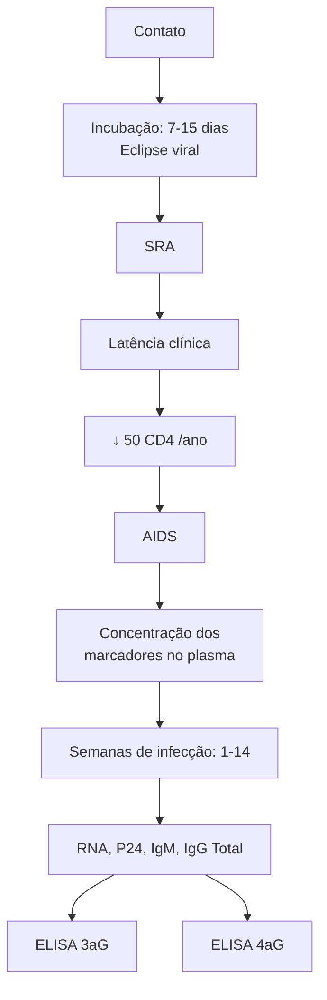
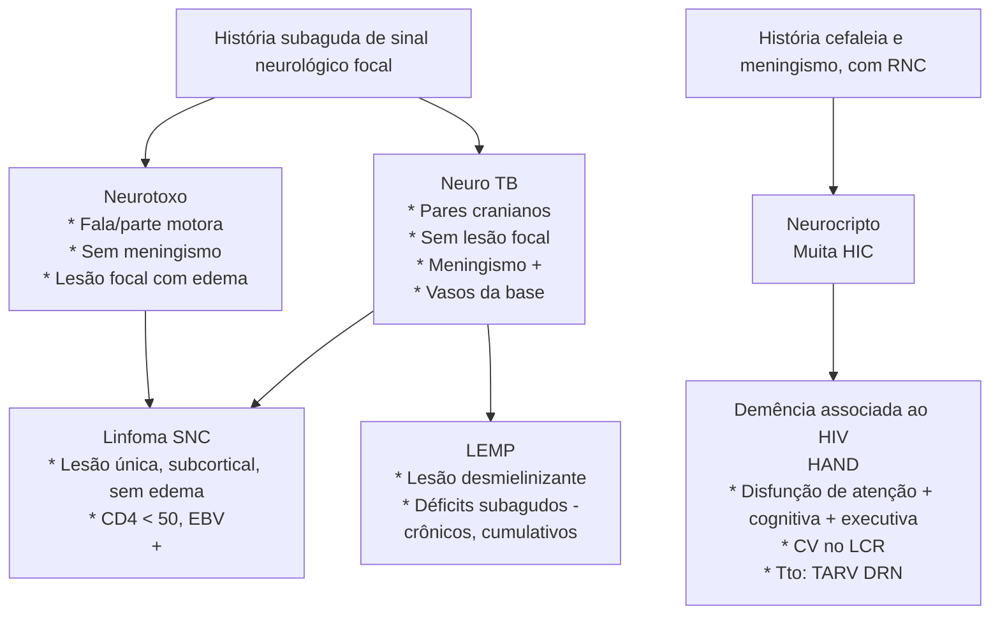

# HIV: DIAGNÓSTICO E TRATAMENTO

**Contágio:**
- Sexual, acidentes com perfuros, vertical, incluindo amamentação

**Curso clínico**
- Contágio → eclipse viral (nenhum teste é positivo) → síndrome retroviral aguda (2 semanas de infecção): monolike - somente PCR positivo → latência clínica (sorologias positivam) → AIDS

**Diagnóstico**
- 2 testes positivos, fabricantes diferentes, exceção de 2 testes orais
- 2 testes rápidos sanguíneos
- Teste rápido oral + teste rápido sanguíneo
- ELISA 3ªG (positiva em 30 dias) ou 4ªG (positiva em

20 dias) + PCR > 5.000 cópias / Western ou Imunoblot

**TARV: Dolutegravir + lamivudina + Tenofovir**
- Terapia dupla (DTG + 3TC): sem HepB, sem TB, não gestante. Idade atual: > 40 anos (atualização constante.)
- **Efeito colateral TDF: fosfatúria + alteração renal, osteopenia**

**ILTB**
- IGRA ou PPD maior ou igual a 5mm se CD4 > 350cels
- CD4 < 350cels: introdução empírica
- Tratamento: rifapentina + isoniazida semanal / 3 meses ou isoniazida diária 9 meses (270 doses)
- Seguimento: CV e labs gerais - CD4 não é rotina sempre
- PreP: TDF + entrecitabina (atualização: vacina HPV4)

**PEP: TARV – iniciar em até 72hs**.

## 1. CONCEITOS INICIAIS

### 1.1 ESTRUTURA DO HIV:

The HIV structure diagram shows:
- **Gp120 – CD4** (surface proteins)
- **Matriz p17** (matrix layer)
- **Gp41 – fusão** (fusion protein)
- **Membrana lipídica** (lipid membrane)
- **Capsídeo p24** (capsid)
- **RNA** (genetic material)
- **Transcriptase reversa** (reverse transcriptase)

### 1.2 CONTÁGIO

- Contato sexual: todas as modalidades, inclusive sexo oral.
- Transfusão de Hemocomponentes: hemácias, plaquetas e leucócitos.
- Transmissão Vertical:

- Gestação: 23-30%/ Parto: 65%/ Amamentação: 12-27%;
- **A amamentação é contraindicada**, mesmo se carga viral negativa.
- Transmissão Percutânea: Acidente com materiais biológicos.

## 2. CLÍNICA E DIAGNÓSTICO

### 2.1 HISTÓRIA NATURAL DA DOENÇA:

| Contato                                |
| -------------------------------------- |
| Incubação: 7-15 dias
Eclipse viral |
| ↓                                      |
| SRA                                    |
| ↓                                      |
| Latência clínica                       |
| ↓ 50 CD4 /ano                          |
| ↓                                      |
| AIDS                                   |

**Figura 2** Estrutura do HIV

### 2.2 SÍNDROME RETROVIRAL AGUDA (SRA)

• É a manifestação aguda - média de 2 semanas. Apenas 50% das pessoas infectadas pelo HIV. Até aqui ainda não houve reconhecimento do vírus pelo sistema imune.

**Sorologia negativa = diagnóstico é por PCR.**

• **Clínica de síndrome mono-like:**
  • Febre.
  • Fadiga.
  • **Adenomegalia generalizada.**
  • Rash cutâneo maculopapular (exantema).
  • Anorexia/ **perda ponderal >10%** inexplicável.
  • Faringite.
  • Cefaleia.
  • Depressão maior.
  • **Úlceras orais e genitais.**
  • **Plaquetopenia isolada.**
  • As manifestações mais específicas para HIV dentre as etiologias da síndrome mono-like são: adenomegalia, perda ponderal, faringite, úlceras e plaquetopenia. O quadro de febre pode ser um pouco mais arrastado do que o de uma mononucleose.

• **Latência clínica:**
  • Queda anual de cerca de 50 CD4 ao ano.

### 2.3 AIDS: SÍNDROME DA IMUNODEFICIÊNCIA ADQUIRIDA.

• **Sorologias:**

• Após 3-4 semanas do contágio (latência clínica):
• Teste sorológicos detectam: **Teste rápido** (sangue ou fluido oral) - (demora 1-3 meses pra positivar). **Imunoensaios (ELISA) de 4ª geração: anticorpos** + p24 (demoram **20 dias** pra positivar). **A terceira geração** (demora 24-28 dias para positivas) **não identifica o p24.**
• **Testes confirmatórios:**
  • **Western-blot/imunoblot (demoram 30 dias para positivar)**: demonstra as bandas de positivação de acordo com o antígeno. Se houver dúvida sobre o diagnóstico de HIV, indica-se realizar um teste confirmatório 4 semanas após.
• **Confirmação do diagnóstico**
  • Quaisquer dois testes positivos (de fabricantes diferentes) fecham o diagnóstico (exceto se for 2 testes orais). Exemplo: **2 testes rápidos sanguíneos; Teste rápido fluido oral + teste rápido sanguíneo; Imunoenzimáticos 3/4ª geração + PCR.**
  • O PCR confirma quando > 5000 cópias. Caso CV < 5.000 cópias, repetir com 2-4 semanas ou fazer teste confirmatório.

## 3. TRATAMENTO E SEGUIMENTO

### 3.1 ALVO MOLECULAR: TERAPIA COMBINADA

| RNAV                                                                                                                                      |                                                                               |
| ----------------------------------------------------------------------------------------------------------------------------------------- | ----------------------------------------------------------------------------- |
| ↓                                                                                                                                         |                                                                               |
| Transcriptase reversa                                                                                                                     |                                                                               |
| ↓                                                                                                                                         |                                                                               |
| DNAV                                                                                                                                      |                                                                               |
| ↓                                                                                                                                         |                                                                               |
| Integrase:
Reltegravir
Dolutegravir
Cabotegravir                                                                              | Protease cliva
Darunavir
Atazanavir
Lopinavir                     |
| Era da integrase                                                                                                                          | Icterícia \| Booster
Ritonavir                                            |
| ↓                                                                                                                                         |                                                                               |
| Linfócito                                                                                                                                 |                                                                               |
| ↓                                                                                                                                         |                                                                               |
| Nucleosídeos (análogos)                                                                                                                   | Não Nucleosídeos (não análogos)                                               |
| Tenofovir (TDF)
Rim e osso (DMO)
Lamivudina (3TC)
Abacavir (ABC)
Zidovudina (AZT)
Anemia megalob.
e lipodistrofia | Nevirapina (NVP)
Efavirenz (EFZ)
↓
Neuropsia
Etravirina (ETR) |

**Figura 3** Fluxograma de alvo molecular

HIV: DIAGNÓSTICO E TRATAMENTO

**Tabela 1** Inibidores da transcriptase reversa:

| Nucleosídeos(análogos) | Não nucleosídeos(não análogos) |
| ---------------------- | ------------------------------ |
| Tenofovir (TDF)        | Nevirapina (NVP)               |
| Lamivudina (3TC)       | Efavirenz (EFZ)                |
| Abacavir (ABC)         | Etravirina (ETR)               |
| Zidovudina (AZT)       | -                              |

• **Inibidores da protease (sempre vem associado com o booster de ritonavir).**
  • Darunavir.
  • Atazanavir.
  • Lopinavir.
• **Inibidores da integrase.**
  • Raltegravir.
  • Dolutegravir.
  • Cabotegravir.

## 3.2 EFEITOS COLATERAIS:

**Análogos de nucleosídeos:**

• **Tenofovir:** Altera clearance de creatinina sem perda de função renal. Alteração renal é avaliada com **fosfatúria, pois faz uma Síndrome Fanconi-like (hipofosfatemia com fosfatúria). Desmineralização óssea** (por isso fazer densitometria óssea a cada 5 anos, em geral). TAF: melhor perfil de efeitos colaterais. Transição para terapia dupla (DTG + 3TC) após 12 meses se efeito colateral TDF e excluída HepB;
  • **Lamivudina:** Mantida mesmo na presença da mutação M184V por fitness. Excreção renal (cuidado com paciente doente renal crônico);
  • **Abacavir: Risco de hipersensibilidade.** Indica-se realizar o teste HLA para verificar se o paciente irá desenvolver hipersensibilidade;
  • **Zidovudina: Anemia megaloblástica. Lipodistrofia.** Esteatose hepática

**Não análogos de nucleosídeos:**

• **Efavirenz: Efeitos neuropsiquiátricos.** Meia vida longa de 13 dias (relacionado com alta taxa de resistência primária ao efavirenz).

**Inibidores de protease:**

• **Atazanavir:** Icterícia e aumento de bilirrubina. Nefrolitíase.
  • **Darunavir:** penetra melhor no SNC. Alta barreira genética (muito utilizado no paciente que já teve falha prévia, pois mesmo que o vírus adquira resistência, ele não fica resistente ao Darunavir).

**Inibidores de integrase:**

• **Dolutegravir:** em geral poucos efeitos colaterais, sendo estes' relacionados a efeitos no TGI e insônia.

• **Genotipagem pré-tratamento**
  • Crianças/adolescentes e gestantes; Co-infecção com TB no momento do diagnóstico; Paciente que se infectou de parceiro em uso de TARV (casais sorodiscordantes); Pessoas em uso de PreP; Se vai usar Efavirenz (resistência primária de até 13%).

## 3.3 TERAPIA DUPLA: CONCEITO NOVO NO TRATAMENTO DO HIV

• **Lamivudina (3TC).**
• **Dolutegravir (DTG).**
  • Condições → Não pode ter hepatite B, tuberculose, gestante, falha prévia e precisa apresentar 2 cargas virais indetectáveis por mais de 6 meses de intervalo (1 ano de tratamento).

## 3.4 QUANDO INICIAR:

• No momento do diagnóstico para todos. Exceções: tuberculose e infecções oportunistas.

**Tuberculose.**

• Pulmonar: aguardar 7 dias; NeuroTB: aguardar de 4-6 semanas; CD4 < 50 cels: 2 semanas.

**Outras infecções oportunistas:**

• Pneumocistose: 15 dias; Toxoplasmose ou neurocriptococose: 4-8 semanas.

## 3.5 EXAMES INICIAIS:

**CD4 Em seguimento, solicitar somente se:**

• lab geral: HMG, FR, perfil lipídico, T3/T4L, vit.D, glicemia jejum e screening DSTs - Screening ILTB
  • IGRA / PPD se CD4 > 350-CD4
  • 1 solicitação sempre. Se CD4 inicial < 350, solicitar / 6 meses até 2 medidas > 350.
  • Se CD4 < 200: LF-LAM e LF-Crag:

## 3.6 VACINAÇÃO:

• Todos : **HPV (9-45 anos)**, influenza, PN 23 e **PN 13**, COVID, **hepatite B 4x**, meningo C (ACWY), dT (3 doses) e hepatite A.
• CD4 > 350 → liberadas vacinas vivas : SCR, varicela e dengue (conforme faixa etária), febre amarela.
• CD4 200-350 → vacina vivas conforme risco epidemiológico (no geral, não administrar).
• CD4 < 200 → vacinas vivas estão contra-indicadas.

## 3.7 SCREENING E TRATAMENTO DE ILTB

• Co-infecção HIV + tuberculose é a principal causa de morte no mundo de pacientes soropositivos. Incidência atual de 12% dos casos de tuberculose.
• Fazer screening anual com **IGRA** / PPD + RX de tórax **se CD4 > 350.**

**Indicações:**

• **Se CD4 < 350, o PPD e IGRA podem vir falso negativos: tratamento empírico está indicado;**
  • **PPD ≥ 5 mm;**
  • **Contactante domiciliar de paciente bacilífero** independentemente de PPD (inclusive, essa é a única situação de retratamento de tuberculose latente).

## 3.8 TRATAR COMO?

• **Rifapentina + isoniazida semanal por 3 meses**.
• Esquemas alternativos: Isoniazida 300mg/dia por 9 meses (270 doses.); Rifampicina + isoniazida diária por 3 meses; Rifampicina diária por 4-6 meses (120 doses).

INFECTOLOGIA

| \| Tempo (meses) \| 0 \| 3 \| 9 \| 0 \| 12 \| 15 \| 18 \| 21 \| 24 \| 27 \| 30 \| 33 \| \|---------------\|---\|---\|---\|---\|----\|----\|----\|----\|----\|----\|----\|----\| \| 1,000,000 \| \| \| \| \| \| \| \| \| \| \| \| \| \| 100,000 \| Queda viral prevista após início da TARV \| \| \| \| \| \| \| \| \| \| \| \| \| 10000 \| \| \| \| \| \| \| \| \| \| \| \| \| \| 1000 \| \| \| \| \| \| \| \| \| \| \| \| \| \| 50 \| \| \| \| \| Blip viral \| \| \| \| Baixa viremia persistente \| \| \| \| \| 40 \| \| \| \| \| \| \| \| \| \| Viremia muito baixa \| \| \| \| 20 \| \| \| \| \| \| \| \| \| \| \| Viremia residual \| \| |
| ---------------------------------------------------------------------------------------------------------------------------------------------------------------------------------------------------------------------------------------------------------------------------------------------------------------------------------------------------------------------------------------------------------------------------------------------------------------------------------------------------------------------------------------------------------------------------------------------------------------------------------------------- |

**Figura 4** Blip viral

• **Esquemas de TARV preferenciais:**
  • Atual (incluindo grávidas): Tenofovir (TDF) + Lamivudina (3TC) + Dolutegravir (DTG);
  • Para coinfectado com TB: Tenofovir (TDF) + Lamivudina (3TC) + Dolutegravir (DTG) **dobrado (2 doses)**.

• **PreP – Profilaxia Pré-Exposição:**
  • Tenofovir + Entricitabina: Duração indeterminada (enquanto o paciente estiver em comportamento de risco). Testagem mensal. Monitorar (90-120 dias: Função renal anualmente (exceto: > 50 anos; Clcr < 90), devido ao tenofovir)) Sífilis a cada 3-4m. Clamídia e gono a cada 6 meses. Teste rápido de HIV no máximo até 7 dias antes da dispensação da TARV. **Atenção: vacina de HPV liberada no SUS para usuários de PreP**
  • Em avaliação: cabotegravir injetável bimensal.

• **PEP – Profilaxia Pós-Exposição = TARV**
  • Tenofovir + Lamivudina + Dolutegravir (iniciar **em até 72hs** da exposição; Duração de 28 dias; Testagem inicial e repete em 1-2 meses após o término).

**3.9 SEGUIMENTO:**

• Carga viral a cada 6 meses; Densitometria a cada 5 anos se uso de TDF; Laboratório periódico (função renal, fosfatúria, perfil lipídico); **I = I (indetectável = intransmissível); Paciente soropositivo bem aderente ao tratamento com carga viral indetectável pelo menos há 6 meses não transmite HIV. Pode ocorrer o que se chama "Blip viral".** Não se correlaciona com transmissibilidade. Geralmente passageiro e sem significado clínico, não requer genotipagem ou troca de tratamento, só reavaliação com nova CV após.

HIV: DIAGNÓSTICO E TRATAMENTO

# REFERÊNCIAS

**Figura 4 Blip viral**

Adaptado de Dahl, 2021 e Palmer, 2008.

# DOENÇAS OPORTUNISTAS HIV

## Pulmão

• Pneumocistose = febre baixa subaguda + dispneia+ dessaturação com Rx de tx normal + DHL:
  • Dx: clínico-radiológico = TC com asa de borboleta; LBA possível;
  • Tratamento: bactrim + corticoide (pO2 < 70) 5 dias / alternativo: clinda + primaquina:
  • Possível piora no 3º-5º dia, melhora após.
  • Histoplasmose: quadro clínico semelhante, com pacintopenia / pápulas / esplenomegalia:
  • Parasita do SRE - esplenomegalia - aumento de ferritina, DHL;
  • TC com micronódulos difusos, pode formar cavitações;
  • Dx: aspirado de MO com leveduras;
  • Tratamento: anfotericina B / itraconazol.
• Lembrar ainda:
  • CMV (CD4 < 50, infiltrado em micronódulos / vidro fosco) - ganciclovir, avaliar fundo de olho;
  • TB: LF-LAM para CD4 < 200 ou paciente grave; RIPE-TARV: 7 dias pulmão.

### NeuroAIDS:

• Neurotoxo: sinal neurológico focal / crise convulsiva - lesão em núcleos da base com realce anelar, edema que desvia linha média - associa corticoide:
  • Dx clínico radiológico, PCR em LCR + < 60% - prova terapêutica por 2-3 sem - bx se refratariedade: linfoma SNC;

• Tratamento: sulfatiazina + pirimetamina + ac. folínico / bactrim / clindamicina + pirimetamina.
• Neurocritpo: principal causa de meningismo (cefaléia, HIC) = pesquisar fase pré-clínica com LF-Crag se CD4 < 200:
  • Se LF +, indicar punção: cultura e tinta da china (leveduras encapsuladas) - tto com anfoB + fluconazol se + / fluconazol preemptivo se tanto cultura quanto tinta da China negativas
  • Aguardar de 4-6 semanas para iniciar TARV.
• NeuroTB: aguardar de 4-6 sem para introduzir TARV, se CD4 < 50cels: 2 semanas.

### TGI:

• Principal causa de disfagia: candidíase (fluconazol empírico 14 dias - EDA se refratariedade);
• Principal causa de úlceras: CMV - pode ser herpes simples ou o próprio HIV - bx - ganciclo / aciclovir / TARV:
  • CMV: viremia não é - doença!

### Profilaxias oportunistas:

• Pulmão: PCP: bactrim 3x/ semana / Histoplasmose se CD4 < 150 cels + áreas de alto risco (centro-oeste+ sudeste): itraconazol;
• NeuroAIDS: neurotoxo: bactrim 1-2x/dia / Neurocritpto: fluconazol "ad. eternum";
• CMV: sempre pesquisa ativa de retinite se CD4 < 50 cels, profilaxia só secundária...

## 1. PULMÃO

### 1.1 PNEUMOCISTOSE

• Agente etiológico: fungo, *pneumocystis jirovecii*;
• História clínica:
  • Dispnéia + emagrecimento + tosse seca + febre;
  • Subagudo (1-3 semanas).
• No exame físico:
  • Nada em ausculta (é padrão intersticial);
  • Atentar para taquidispneia e dessaturação;
  • Comumente vemos candidíase oral.
• Na radiologia:
  • **Dissociação clínico-radiológica**: o paciente em si está mal, está fraco/consumido, dispneico, dessaturando com Rx de Tx normal;
  • TC com infiltrado bilateral central em vidro fosco (asa de borboleta).
• Laboratório inespecífico:
  • Aumento de DHL;
  • CD4 < 200;
  • PaO2 baixa.
• Diagnóstico: clínico-radiológico:
  • Confirmatório (pouco realizado): PCR em LBA.
• Tratamento:

[CT scan image showing bilateral lung infiltrates characteristic of Pneumocystis pneumonia]

**Figura 1** Pneumocistose

• **Bactrim (alternativa: clindamicina + primaquina) por 21 dias.** Bactrim é sulfa, e, como efeito colateral, causa muita alergia cutânea, nefrite intersticial aguda, IRA, síndrome de steven-johnson, hipercalemia, intolerância gástrica e flebite;
• Associar prednisona 40mg de 12/12h por 5 dias se PaO2 ≤ 70mmHg. - pela diretriz americana, vai para todos.

**Atenção. O paciente pode piorar no 3°- 5° dia de tratamento! Espera-se melhora a partir do 7º dia.**

## 1.2 HISTOPLASMOSE

• História clínica: semelhante à PCP:
  • Emagrecido + tosse seca subaguda + febre diária + dispnéia.
• Exame físico:
  • **MV + com roncos / estertores difusamente;**
  • Pele: Pápulas / placas eritematosas;
  • Úlceras orais;
  • Esplenomegalia.
• Radiologia:
  • Infiltrado micronodular difuso;
  • Em alguns casos há nódulos confluentes;
  • Diagnóstico diferencial: TB, criptococose, CMV, paracocco.

**Figura 2** infiltrado micronodular difuso

• Laboratório geral:
  • CD4 < 100 - 150;
  • Pancitopenia pronunciada;
  • DHL aumentado;
  • Ferritina aumentada.
• Diagnóstico:
  • Aspirado de medula com pesquisa e cultura de fungos;
  • LBA – pesquisa e cultura de fungos;
  • Sorologia – imuno e contraimuno (positivo em 60% dos casos).
• Tratamento:
  • Geral: Itraconazol;
  • Casos mais graves: Anfotericina B lipossomal.

## 2. INFECÇÕES OPORTUNISTAS NO SNC

### 2.1 NEUROTOXOPLASMOSE

• Agente etiológico: protozoário, *Toxoplasma gondii;*
• História clínica:
  • Alteração motora / fala / convulsão;
  • Duração >1 semana;
  • Confusão mental;
  • Febre.
• Exame físico:
  • **Sinal neurológico focal;**
  • **Ausência de meningismo;**
  • Altíssima soroprevalência (IgG +).
• Laboratório geral:
  • **IgG positivo para toxoplasmose;**
  • CD4 < 100.

• Radiologia:
  • Lesão focal, única / múltipla, **centro hipodenso e realce anelar**, com muito **edema perilesional;**
  • Atinge preferencialmente **gânglios da base;**
  • Antes de analisar LCR de qualquer paciente soropositivo, deve-se solicitar uma TC de crânio.

**Figura 3** neurotoxoplasmose

• Laboratório confirmatório é raramente feito na prática, PCR positiva em LCR só em 60%. Logo, **o diagnóstico é clínico-radiológico;**
• Tratamento empírico:
  • **Prova terapêutica por 2-3 semanas** com Sulfa + pirimetamina + ácido folínico OU bactrim OU clindamicina + pirimetamina;
  • Diagnóstico por melhora clínica;
  • Se não houver melhora, é necessário fazer biópsia estereotáxica para pesquisar diagnóstico diferencial;
  • Associar corticoide devido ao edema perilesional.

### 2.2 LINFOMA PRIMÁRIO DE SNC E LEMP (CD4 < 50 CELS)

• Linfoma de SNC:
  • Sem febre;
  • Sempre associado ao **EBV** (avaliar o antiVCA+
  • **Lesão idêntica à da neurotoxo**, mas aqui costuma ser única, subcortical, sem muito edema perilesional;
  • Diagnóstico é por biópsia.
• LEMP (leucoencefalopatia multifocal progressiva):
  • **Déficits neurológicos focais, progressivos e cumulativos;**
  • Causada pelo vírus JC (poliomavírus);
  • Sem febre;
  • **Doença desmielinizante (história de semanas-meses);**

DOENÇAS OPORTUNISTAS HIV

• RM com lesão em dedo-de-luva em substância branca;
• Diagnóstico é por clínica + PCR de vírus JC no LCR.;
• Tratamento é otimizar a TARV.

**Figura 4** Linfoma primário de SNC.

**Figura 5** LEMP.

## 2.3 NEUROCRIPTOCOCOSE

• Agente etiológico: fungo, cryptococcus; (principalmente neoformans)
• Pensar quando há neuro-AIDS sem lesão focal e com meningismo;
• História Clínica:
  • Marcada hipertensão intracraniana (cefaleia intensa e refratária, progressiva, com RNC);
  • Sem febre;
  • Sem alteração focal.
• Exame físico:
  • Sem sinal neurológico focal;
  • Presença de meningismo.
• Laboratório geral:
  • CD4 < 200.

• Radiologia:
  • Sem lesão focal (apagamento de sulcos);
  • Herniação;
  • Sem desvio de linha média.
• Diagnóstico:
  • Fase pré-clínica: Por ser a principal causa de meningismo, é preconizado o LF-Crag em CD4 < 200 cels, em quem nunca teve cripto prévia.
  • Se LF-Crag positivo: LCR:
  • Se cultura ou tinta da china +: tratamento;
  • Se ambos negativas: fluconazol preemptivo.
  • Fase clínica:
  • TC + LCR com pressão de abertura muito elevada + antigenemia positiva (>1:128) + cultura (5-7 dias) + microbiológico direto com tinta da china;
  • Pior prognóstico se leucócitos < 20 em LCR ou título > 1:1024.
• Tratamento muito prolongado:
  • Fase intensiva: Indução com anfotericina B lipossomal + 5-flucitosina (ou fluconazol) = pelo menos 2 até 4 semanas (até negativação de cultura em LCR);
  • Fase de consolidação e fase de manutenção: ambas realizadas com fluconazol, variando a dose. Somam um período > 1 ano;
  • Não associar corticoide: menor taxa de cura microbiológica;
  • TARV: 4-6 semanas depois. Melhora clínica, resolução da HIC. Cultura de LCR negativa.
• A criptococose também pode se manifestar de forma generalizada:
  • Acometimento cutâneo: pápulas umbilicadas;
  • Acometimento pulmonar: nódulos/ micronódulos subpleurais.

**Figura 6** Criptococose pulmonar.

INFECTOLOGIA

## 2.4 SISTEMATIZANDO A NEURO-AIDS

## 2.5 SIRI - SÍNDROME DA RECONSTITUIÇÃO IMUNE

- Piora inflamatória, de início 2-4 semanas após TARV, em vigência de outra infecção grave, com piora dos sintomas e lesões, adenopatia generalizada e febre, podendo levar ao óbito;
- Tratamento com corticoide;
- Quanto tempo eu espero, de tratamento da doença oportunista, para iniciar a TARV?
  - **Neuro TB;**
  - **4-6 semanas;**
  - **2 semanas se CD4 < 50 cels.**
  - **TB pulmonar: 7 dias;**
  - Pneumocistose: 2 semanas;
  - **Neurocriptococose: 4-6 semanas;**
  - **LCR com cultura negativa;**
  - **HIC controlada;**
  - Neurotoxoplasmose: 2-4 semanas.

# 3. DISFAGIA E ACOMETIMENTO CUTÂNEO NA AIDS

## 3.1 CANDIDÍASE

- **Principal causa de disfagia em AIDS;**
- Agente etiológico: *Candida albicans*;
- Característica: Exsudato branco de base eritematosa;
- Ocorre principalmente quando CD4 < 200;
- Diagnóstico é feito por EDA, mas no geral não precisa, e se faz o **tratamento empírico**. Se não houver melhora clínica, aí fazemos EDA;
- Tratamento: **fluconazol 200 mg/dia.**

## 3.2 CMV

- **Principal causa de úlcera em trato gastrintestinal;**
- São poucas úlceras, pequenas, não confluentes mas profundas, que podem até perfurar;
- Ocorre, principalmente, quando **CD4 < 50;**
- Quadro mais comum:
  - Neurorretinite;
  - Encefalite;
  - Polirradiculopatia;
  - Pneumonite;
  - Diarreia / AAP;
  - Nefrite.
- Diagnóstico é por clínica (disfagia e dor retroesternal) + biópsia:
  - **Viremia não se correlaciona com doença!**
  - **Avaliar retinite** por CMV com fundo de olho (risco de cegueira aguda e permanente) **se CD4 < 50 cels:**
    - Fundo de Olho: exsudatos algodonosos e hemorragias perivasculares.
  - Tratamento com ganciclovir. Se falha, Foscarnet ou Cidofovir.

## 3.3 HERPES

- Múltiplas lesões, rasas, confluentes e base eritematosa;
- Tratamento com aciclovir.

## 3.4 SARCOMA DE KAPOSI

- Agente: Herpesvirus tipo 8 (em geral em latência clínica, o sarcoma é uma doença de reativação);
- Clínica: angioproliferação cutânea (lesões violáceas) e visceral (TGI e pulmão);
- Ocorre principalmente quando CD4 < 100;
- Tratamento:

DOENÇAS OPORTUNISTAS HIV                                                                                    5

• Quimioterapia + Radioterapia para lesões locais + TARV.

## 4. HIV E DOENÇAS NEGLIGENCIADAS

### 4.1 LEISHMANIOSE
• Investigar em hepatoesplenomegalia a/e
• Primeira escolha: anfoB lipossomal ou deoxicolato
• Cutânea com falha terapêutica prévia: miltefosina
• Profilaxia secundária se CD4 < 350: anfoBlip./ 2-4 semanas

### 4.2 PARACOCO
• Infiltrado reticulo-nodular + linfonodomegalias + hepatoesplenomegalia + úlceras periorais dolorosas
• Diferencial com TB, Histoplasmose e linfoma
• HIV+: não necessariamente espera associação com atividade agrícola
• CD4 < 200
• Micológico direto: pele, escarro, aspirado de linfonodo
• Profilaxia secundária: CD4 - 200 - itraconazol/ bactrim/12hs até CD4 > 200 por 3 meses

## 5. PROFILAXIA PARA DOENÇAS OPORTUNISTAS

**Tabela 1** Profilaxia para denças oportunistas

| Doença        | Faixa de CD4      | Primária                                      | Secundária                                                    |
| ------------- | ----------------- | --------------------------------------------- | ------------------------------------------------------------- |
| Pneumocistose | CD4 < 200         | Bactrim 800/160mg / 3x/semana                 |                                                               |
| Cripto        | CD4 < 200 e LFA + | Preempitivo Fluconazol 10 semanas             |                                                               |
| Histoplasmose | CD4< 150/3m       |                                               | Itraconazol 200mg/dia CD4> 150 e CV indetectável / 6 m        |
| Neurotoxo     | CD4 < 100         | Bactrim 800/160mg / dia CD4> 200/3m           | Sulfa + pirimeta + ac.folínico Bactrim /12hs - CD4 > 200 / 6m |
| MAC           | CD4 < 50          | Azitromicina 1500mg/semana Até início da TARV |                                                               |
| CMV           |                   | Não se faz - Pesquisa ativa de retinite       | Ganciclovir CD4 > 100 3-6m                                    |

INFECTOLOGIA

# REFERÊNCIAS

**Figura 1** Pneumocistose

Arquivo pessoal

**Figura 2** infiltrado micronodular difuso

Arquivo pessoal

**Figura 3** neurotoxoplasmose

Arquivo pessoal

**Figura 4** Linfoma primário de SNC.

Arquivo pessoal

**Figura 5** LEMP

Arquivo pessoal

**Figura 6** Criptococose pulmonar.

radiopedia
