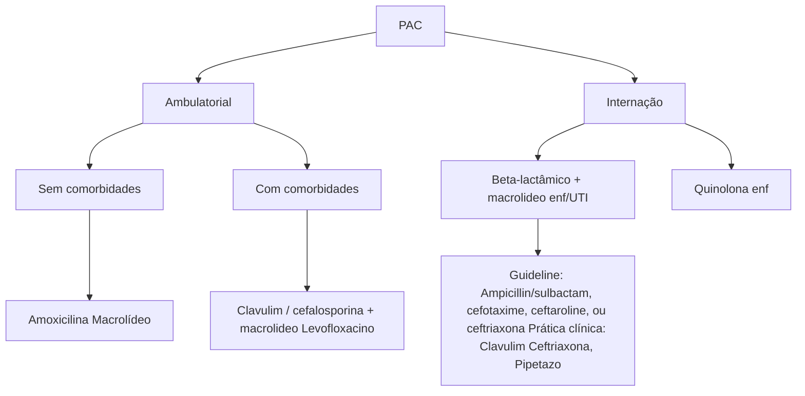

# ANTIBIÓTICOS I

## Farmacologia básica

• **Pico-dependente:** aminoglicosídeos - dose única
• Nefrotoxicidade (reverssível) e ototoxicidade (irreverssível)
• **Tempo-dependentes:** betalactâmicos - múltiplas doses (penicilinas, cefalosporinas e carbapenêmicos)
  • **Alergia betalactâmicos:** se for IgE mediada (anafilaxia, angioedema, broncoespasmo, urticária) não usar nenhum.
• ef. colaterais: NIA, diminuição limiar convulsivo e alergia
• **Área acima da curva:** vancomicina - monitorar vancocinemia
  • Nefrotoxicidade, síndrome do homem vermelho
• **Aureus**
  • **OxaS** = oxacilina ou outros betalactâmicos (penicilinas desde que com inibidores de betalactamases)
  • **OxaR** = vanco (se MIC < 2 não usar), teico (preferível em osso), dapto (não usar em pulmão e SNC) ou line (não usar em ICS).
• Enterococco

• **Faecium:** ampiR / Fecalis : ampiS / VRE = linezolida (ainda que no sangue)
• **Pseudomonas**
  • **Penicilinas:** piperacilina-tazobactam (pipteazo , tazocin)
  • **Cefalosporinas:** ceftazidima, cefepime e ceftazolone
  • **Carbapenêmicos:** imi e meropenem
  • **Quinolonas:** levofloxacino, ciprofloxacino
  • Polimixinas
• **AMPC e ESBL:** hidrolisam cefalosporinas de terceira geração (ceftriaxone) - MYSPACE : cefoxetina R. Tratamento padrão é carbapenêmico
• **KPC:** Hodge + = ceftazidima-avibactam ; metalobetalactamases : EDTA + = aztreonam
• **Cândidas**
  • **Albicans , tropicalis e parapsilosis:** fluconazol sensível / **Glabrata** : dobrar a dose / **Krusei** : resistente
  • **Terapia empírica:** equinocandina - dessescalonar somente após HMC de controle negativa
• **Aspergilose:** galacto sérica > 0,5 / galacto no LBA > 1,0 ; voriconazol ou isavuconazol

## 1. MICROBIOLOGIA BÁSICA

• Podemos dividir didaticamente as bactérias em coloração e formato:

### 1.1 COLORAÇÃO:

**Gram Positivos** → destaque para cocos. Compostos por: Membrana celular + Parede celular (mais espessa).

**Gram Negativos** → destaque para bacilos. Compostos por: Membrana celular + Espaço periplasmático (onde acumulam-se as enzimas inativadoras de betalactâmico)+ Parede celular (mais fina) + Membrana externa (composta por lipopolissacarídeos - LPS).

• Confira na página seguinte a Tabela 1

### 1.2 FORMATO:

**Cocos Gram positivos (gram +):**
• Catalase positivos
• Staphylococcus:
  • **Aureus:** mais agressivo, invade, faz biofilme, pode causar embolia e tem um grande problema de resistência que é o MRSA.
  • **Coagulase negativos:** colonizam naturalmente a pele (podem ser contaminação de HMC - crescer em 2 amostras.).
• **Coagulase negativos**
• Streptococcus:
  • Streptococcus agalactiae; Streptococcus pneumoniae; Streptococcus pyogenes

• Enterococcus:
  • Faecium → Mais frequentemente resistente à ampicilina; Fecalis → Mais frequentemente sensível à ampicilina.

**Bacilos Gram +:**
• **Clostridium:** Tetani: causa tétano; Botulinium: causa botulismo; Perfringens: causa gangrena gasosa.; Difficile: causa colite pseudomembranosa.
• **Lysteria:** pode vir a causar meningite, principalmente na forma de romboencefalite em recém-nascidos e idosos.

**BGN's (bacilos gram negativos):**
• Fermentadores (enterobactérias) → Klebsiella, E.coli, Enterobacter, Proteus, Morganella, Citrobacter, Acromobacter, Serratia entre outros;
• Não fermentadores → Pseudomonas, Acinetobacter, Stenotrophomonas e Burkholderia.

**Cocos Gram negativos (Gram-)** → representados pela Neisseria, que pode vir a causar meningite, gonorreia, entre outras doenças.

### 1.3 A PAREDE CELULAR:

• Localiza-se acima da membrana plasmática: impede o rompimento da membrana por estresse osmótico e permite vida livre da bactéria.
• Formada por peptidoglicanos (PTG), cada uma possui uma terminação D-ala. As PBPs (Penicillin-Binding Proteins) ligam as terminações D-ala entre si.
• As PBPs são o alvo de ação dos betalactâmicos (bactericidas). "Todo antibiótico quer ser um betalactâmico".

**Tabela 1** Resumo: Gram positivos e Gram negativos

| Coloração      | Gram +                                                                                                                                                                                                | Gram - |                                                                                                                                                                                                                                                      |
| -------------- | ----------------------------------------------------------------------------------------------------------------------------------------------------------------------------------------------------- | ------ | ---------------------------------------------------------------------------------------------------------------------------------------------------------------------------------------------------------------------------------------------------- |
| Formato        | Cocos ou Bacilos                                                                                                                                                                                      |        | Cocos ou Bacilos                                                                                                                                                                                                                                     |
| Estrutura      | Parede celularMembrana celular                                                                                                                                                                        |        | Membrana externa : LPSParede celularEspaço periplasmáticoMembrana celular                                                                                                                                                                            |
|                | **Cocos**Staphylos \| Streptos \| EnterococcoAureus \| Staphylos coagulase negativos \| Faecium \| Fecalis\| \| Ampi R \| Ampi SGrave Invasivo Biofilme Emboliza MRSA \| Será que não é contaminação? |        | **Bacilos** \| **Cocos**Os BGNs... \| NeisseriaFermentadores \| Não fermentadoresAs enterobactérias \| PseudomonasKlebsiella E.Coli Enterobacter Proteus Morganella Citrobacter Acromobacter Serratia \| Acinetobacter Stenotrophomonas Burkholderia |
| Representantes | **Bacilos**Clostridium \| LysteriaTetani = tétano Botulinum botulismo Perfringens = gangrena gasosa Difficile colite pseudomembranosa                                                                 |        |                                                                                                                                                                                                                                                      |

**ATBs pico-dependente Aminoglicosídeo**

**ATBs área da curva / MIC dependentes**

**Vancomicina**

**Efeitos colaterais vancomicina**
- Nefrotoxicidade
- Síndrome do homem vermelho
- Agranulocitose (série branca)

**MIC**

**Tempo**

**ATBs área da curva / MIC dependentes Beta-lactâmicos**

Múltiplas doses no dia, infusão estendida

**Figura 1** Área de concentração do antibiótico sobre o tempo.

ANTIBIÓTICOS I                                                                                                                  3

## 2. FARMACOLOGIA BÁSICA

• MIC = concentração inibitória mínima: concentração que inibe o crescimento de determinada bactéria por 18-24 horas.

### 2.1 MECANISMOS DE AÇÃO DOS ANTIBIÓTICOS:

• **Pico-dependentes**: quanto mais rápido e mais alta for a concentração máxima em relação ao MIC, melhor ele funciona. Ex: aminoglicosídeos

• **Tempo acima do MIC dependentes**: quanto mais tempo eles passam acima da linha do MIC, melhor. Ex: beta-lactâmicos, por isso que para esses antibióticos fazemos múltiplas doses ao dia, com infusão estendida.

• **Área da curva/MIC dependentes**: Vancomicina, por isso que dosamos a vancocinemia no vale (1h antes da próxima dose, entre a 4ª e a 5ª dose).

## 3. BETALACTÂMICOS

• De todos os antibióticos, os que precisamos saber as classes são os betalactâmicos:

### 3.1 PENICILINAS:

**Naturais**

• **Benzatina**: famosa benzetacil, não faz pico alto, mas mantém seu nível por muito tempo. É uma penicilina de depósito, utilizada principalmente para sífilis e para profilaxia de febre reumática.

• **Cristalina**: penicilina potente, ultrapassa BHE (barreira hemato-encefálica), faz alto nível de concentração plasmática, mas deve ser dada muitas vezes ao dia devido à meia vida curta. Utilizada para tratar neurossífilis.

**Semi-sintéticas**

• Amoxicilina: via oral

• **Ampicilina**: via endovenosa, é utilizada principalmente para tratar enterococo e listeria.

• **De espectro estendido**: clavulin (amoxicilina+clavulanato) e pipetazo (piperacilina+tazobactam). São drogas associadas com inibidores de beta-lactamase, que pegam também anaeróbios e gram negativos.

### 3.2 CEFALOSPORINAS:

**1ª geração:**

• Foram desenvolvidas para resolver o problema dos staphylos resistentes à penicilina. Pegam basicamente só Gram +, utilizada para infecção de pele simples (erisipela não complicada, impetigo, celulite). Ex: cefalexina e cefazolina.

**2ª geração:**

• Pega bem Gram + e tem um pouco de efeito para Gram – e anaeróbios. É utilizada principalmente para profilaxia cirúrgica ou PAC em paciente jovem. Ex: cefuroxima e cefoxetina.

• A profilaxia cirúrgica deve ser realizada em até 1h antes do procedimento e se repete em 4 horas no intraoperatório, mantendo-a por até 36 horas após (de forma geral).

**3ª geração:**

• Funcionam muito bem para Gram – e Streptococcus, para Staphylo sua ação é limitada. **Ceftriaxone**: meningite, BCP e leptospirose. Não têm ação anti-pseudomonas. **Ceftazidima**: cobre pseudomonas.

**4ª geração:**

• O ganho da 4ª geração é pegar melhor pseudomonas. **Ex: cefepime**, utilizado principalmente em neutropenia febril. É famoso por causar delirium e diminuir limiar convulsivo.

**5ª geração:**

• Ceftaroline, amplo espectro que pega MRSA.

### 3.3 CARBAPENÊMICOS:

• São os antibióticos mais fortes dentre os betalactâmicos. Devem ser usados em escalonamento, para pacientes graves, infecções hospitalares ou resistência bacteriana.

• **Ertapenem**: em termos de resistência bacteriana ele deixa a desejar – uma bactéria pode se tornar resistente ao ertapenem sem necessariamente ser por carbapenemase. Contudo, é o único que pode ser feito em regime IM/ IV 1x/dia, ou seja, único que pode ser feito em regime hospital dia. Imipenem, famoso por diminuir bastante o limiar convulsivo; Meropenem.

### 3.4 EFEITOS COLATERAIS DE BETA LACTÂMICOS

• Todo betalactâmico pode reduzir o limiar convulsivo.

• Alergia: Nefrite Intersticial Aguda (NIA). Febre, rash, eosinofilia com eosinofilúria e piora de função renal - no geral poucos dias após início do uso.

### 3.5 PACIENTES ALÉRGICOS:

• Até 10% dos pacientes se dizem alérgicos à penicilina. Desses, 90% possuem teste cutâneo negativo. E, ainda quando positivo: 97% toleram cefalosporinas e 99% toleram carbapenêmicos. **Quando não usar nenhum carbapenêmico? Evento relacionado à IgE**.

• Eventos relacionados a IgE: Anafilaxia; Angioedema; Broncoespasmo; Urticária.

• Se a história da alergia não sugere anafilaxia (cefaleia, mal-estar súbito, intolerância em TGI, EBV, Jarisch-Herxheimer) ou evento ocorreu há > 10 anos, indica maior segurança para o uso do medicamento. Se for claramente IgE mediada, não dar nenhum betalactâmico! A dessensibilização cria uma tolerância imunológica temporária, não resolve a alergia.

**Resumo da ópera: não costumamos ter alergia cruzada entre classes** de beta lactâmicos (penicilinas, cefalosporinas, carbapenêmicos), porém se o evento **da alergia foi claramente relacionado à IgE** (anafilaxia, angioedema, broncoespasmo), não utilizamos nenhum tipo de betalactâmico!

## 4. PRINCIPAIS CLASSES ANTIBIÓTICOS

• Confira Figura 2

### 4.1 CLASSES QUE SÓ COBREM GRAM POSITIVOS:

• **Glicopeptídeos:** Teicoplanina; Vancomicina: extremamente nefrotóxica e pode causar Sd. do homem vermelho.

• **Linezolida:** apresenta, em uso prolongado, plaquetopenia. Por ser inibidora da MAO, pode vir a causar síndrome serotoninérgica. Não deve ser usada em corrente sanguínea porque se distribui muito nos tecidos (exceção : VRE em ICS);

• **Daptomicina:** rabdomiólise como efeito colateral - devem ter a CPK monitorada a cada 2-3 dias. Pode resultar também em pneumonia eosinofílica (suspender + corticoterapia). Daptomicina não tem ação pulmonar - **Cubicin, Cubnão, nunca use no pulmão**.

são antibióticos pico-dependentes, vão ser otimizados ao administrar uma dose única. Feito para sinergismo para enterococo na endocardite. Nefrotoxicidade reversível e ototoxicidade irreversível.

### 4.3 COBREM ANAERÓBIOS:

• **Clindamicina:** do umbigo para cima;
• **Metronidazol:** do umbigo para baixo - funciona no gênero Bacillus spp.;

## 5. GRAM POSITIVOS

• **Principal mecanismo de resistência:**
  • Alteração da parede celular (sítio de ação do antibiótico). Mecanismos específicos: Staphylos (MRSA) → gene mecA → troca o PBP 2 por PBP 2a.
  • Os betalactâmicos no geral perdem a afinidade pelo PBP 2a. A cefalosporina de quinta geração (ceftaroline) consegue agir na PBP 2a;
• **Streptos** → troca PBP 2 por PBP 2x.

| Só para
Gram +                                           |                                             |                                                       | Só para
Gram -                          |                                       |                                                    |
| ------------------------------------------------------------ | ------------------------------------------- | ----------------------------------------------------- | ------------------------------------------- | ------------------------------------- | -------------------------------------------------- |
| Clicopeptídeos                                               | Linezolida                                  | Daptomicina                                           | Polimixinas                                 | Tigeciclina                           | Aminoglicosídeos                                   |
| Vancomicina
Teicoplamina                                 | Plaquetopenia,
sínd
serotoninérgica | Rabdomiólise e
pneumonite
eosinofílica        | PoliB não é
nefrotóxica
Colistina E | Abdômen e
pele e partes
moles | Nefrotoxicidade
atotoxicidade
irreversível |
| ↓
Nefrotoxicida de e
sínd. Homem
vermelho        |                                             | ↓
Cubcin,
cubnão,
nunca use
no pulmão |                                             |                                       | ↓
Sinergismo
Endocardite
Enterococco   |
| ↓
Não é alergia
(diminuir velocidade
de infusão) |                                             |                                                       |                                             |                                       |                                                    |

| Anaeróbios                                   |                           | Miscelânia                                                    |                                                       |
| -------------------------------------------- | ------------------------- | ------------------------------------------------------------- | ----------------------------------------------------- |
| Boca                                         | Barriga                   | Bactrim                                                       | Quinolonas respiratórias                              |
| (BCP aspirativa /otorrino):
clindamicina | Bocillus sp: metronidazol | HIV-alergia (steven-johnson),
hiperK e acidose metabólica | Levo e cirpo-aneurisma Ao,
tendinopatia, delirium |

Figura 2 Resumo: demais ATBs

### 4.2 CLASSES QUE SÓ COBREM GRAM NEGATIVOS:

• **Polimixinas:** PoliB; Colistina E;
• PoliB penetra menos no rim.
• **Tigeciclina:** não pega bem a parte pulmonar. Muito útil em infecções intra-abdominais e pele e partes moles;
• **Aminoglicosídeo:** Lembrar que os aminoglicosídeos

• **Enterococcus (VRE)** → gene VanA/B → troca o D-ala, que une os PTG da parede celular, por D-lact.
• **Staphylos coagulase positivo:** Staphylos aureus. Embolizam e formam biofilme: olhos, válvulas cardíacas, SNC, espondilodiscite, abscesso esplênico. Em infecções de corrente sanguínea por S. aureus é preciso realizar ECOcardiograma e fundo de olho (pesquisar êmbolos); Resistência à oxacilina (MRSA) - quando troca o PBP 2 pelo PBP 2a.

ANTIBIÓTICOS I                                                                                                                      5

• Pensar em pacientes internados há >20 dias, dialíticos, com catéter de longa permanência (ex. portocath), instituições de longa permanência. Se suspeita de MRSA: iniciar Vancomicina.

• **Staphylos coagulase negativos:** sempre pensar se não é contaminação. Exceção: S. Lugdunensis tem uma virulência tão grande quanto o S. aureus, fazendo casos de mediastinite, por exemplo. Os não lugdunensis (epidermidis, hominis) podem ser só contaminação da amostra (tem que crescer em 2 HMCs para valorizar).

## COMO TRATAR OS STAPHYLOS?

• **Sensível à ampicilina?**
  • Oxacilina; Lembrar que a sensibilidade à oxacilina traduz sensibilidade a todos os betalactâmicos (PBP2). Logo, também pode utilizar cefazolina, clavulin e pipetazo, por exemplo. Mas se for penicilina é necessário ter inibidor de betalactamases, porque todos os Staphylos aureus atualmente possuem essa enzima (amoxicilina, simples, não funciona);
  • Resistente à oxacilina (MRSA)? Vancomicina ou Teicoplanina. Se o MIC da vancomicina for menor ou igual a 2, não se deve administrar vancomicina (precisaria de dose muito elevada, o que é contra indicado pela nefrotoxicidade). Nesses casos, opta-se por linezolida ou daptomicina.

**Onde estão os staphylos?**

• Epidermidis:
  • Ortopedia (principalmente se com prótese);
  • Dispositivos intravasculares;
  • Ventriculites associadas a dispositivos.

• Aureus:
  • SST: Impetigo/celulite bolhosa;
  • Infecção de ferida operatória;
  • Ventriculite;
  • Pneumonias necrotizantes;
  • ICS / endocardite;
  • Espondilodiscite em coluna;
  • Piomiosite;
  • Diálise.

• Lugdunensis:
  • Abscesso dentário;
  • Mediastinite.

Não há staphylo na urina!!! Caso esteja presente na urocultura, conferir se não houve contaminação. Senão, pesquisar staphylo em outros sítios (bateremia).

## 6. VANCOMICINA

A vancomicina tem melhor ação conforme a área da curva/MIC. O ponto negativo está no cálculo difícil, assim, outra opção é se basear na vancocinemia (também pouco prático, pois deve-se esperar dias do início do tratamento). 1ª dosagem vancocinemia: no vale (1h antes) antes da 4ª dose (steady-state).

### 6.1 VANCOCINEMIA ALVO:

• Infecções graves: 15-20; Infecções leves: 10-15. Ajuste

da dose quando necessário: aumenta-se 25-50% da dose diária total.

### 6.2 EFEITOS COLATERAIS DA VANCOMICINA:

• **Síndrome do homem vermelho:** rash em tronco e face, desconforto respiratório e temperatura subfebril após minutos do início da infusão. Mimetiza um processo alérgico, mas não se sabe o mecanismo envolvido. **Costuma ser resolvida aumentando o tempo de infusão.** Se for refratário a esse tratamento, trocar de classe.

• Nefrotoxicidade.

• Síndrome do homem vermelho (nesses casos, pode-se aumentar o tempo de infusão e observar se há melhora).

• Agranulocitose (série branca).

## 7. MRSA

### 7.1 CA-MRSA (ADQUIRIDA NA COMUNIDADE).

• Sensível para outros ATBs: Bactrim; Quinolonas; Clindamicina; Macrolídeos.

• **Situações clínicas:**
  • Infecção de pele e partes moles (traumas fechadas em pacientes jovens);
  • Pneumonias necrotizantes.

• Dica: pacientes sem fatores de risco/ atletas ou pneumonia necrotizante em paciente jovem = pensar em CA-MRSA. Atenção também para traumas fechados.

### 7.2 MRSA HOSPITALAR.

• Resistente para outros ATBs: Quinolonas, Clindamicina, Macrolídeos.

• **Muitas vezes sensível ao Bactrim.**

• **Quando pensar em MRSA Hospitalar:**
  • Internados > 20 dias.
  • Assistência frequente à saúde (diálise, oncológicos).
  • Uso de dispositivos intravasculares.
  • ILPI.
  • PVHIV.

**Tabela 3** Cultura Aeróbia - Sangue Periférico MSE

| CULTURA AERÓBIA-SANGUE PERIFÉRICO MSE
Coletado em: 22/07/2020 17:30 | CULTURA AERÓBIA-SANGUE PERIFÉRICO MSE
Coletado em: 22/07/2020 17:30                                                                                                                                                                                                                                                                                                                                                                                                                                                                                                                                                                                                                                                                                                                                                                                                               |
| ----------------------------------------------------------------------- | ------------------------------------------------------------------------------------------------------------------------------------------------------------------------------------------------------------------------------------------------------------------------------------------------------------------------------------------------------------------------------------------------------------------------------------------------------------------------------------------------------------------------------------------------------------------------------------------------------------------------------------------------------------------------------------------------------------------------------------------------------------------------------------------------------------------------------------------------------------------------------------- |
|                                                                         | **ANTIBIOGRAMA**                                                                                                                                                                                                                                                                                                                                                                                                                                                                                                                                                                                                                                                                                                                                                                                                                                                                      |
|                                                                         | CLINDAMICINA --- 6 --- ANTIBIÓTICOS I 7 \*\*Tabela 7\*\* Cultura Aeróbia – Urina de Sonda Vesical de demoraCULTURA AERÓBIA - URINA DE SONDA VESICAL DE DEMORA
Coletado em: 31/05/2017 17:20	CULTURA AERÓBIA - URINA DE SONDA VESICAL DE DEMORA
Coletado em: 31/05/2017 17:20	CULTURA AERÓBIA - URINA DE SONDA VESICAL DE DEMORA
Coletado em: 31/05/2017 17:20	ANTIBIOGRAMA	1
T.Detecção:	AMPICILINA	>=32 R
1- Enterococcus faecium	CIPROFLOXACINA	>=8,0 R
Número de Colônias:
100.000 UFC/ml	ESTREPTOMICINA (HL)	S
	GENTAMICINA(HL)	S
Legenda
S-Sensível	LINEZOLIDA	2,0 S
I-Intermediário
R - Resistente	NORFLOXACIN	>=16,0 R
D- (SDD) Sensível Dose Dependente
P-Positivo	PENICILINA	>=64,0 R
N - Negativo
\*- Em Falta	TEICOPLANINA	>=32,0 R
	VANCOMICINA	>=32,0 R
Enterococo vancomicina resistente (VRE). |

## 10. CLOSTRIDIUNS: OS GRAM + ANAERÓBIOS QUE VOCÊ PRECISA SABER

### 10.1 BOTULINIUM:
• Botulismo: paralisia flácida. Pediatria não recomenda mel a < 2 anos – risco de ingestão de esporos.

### 10.2 TETANIS:
• Paralisia espástica (enrijecida). Riso sardônico, opistótono. Ferimento sujo, acidente com prego. dT / 10 anos.
• Como tratar botulinum e tetanis?
• Imunoglobulina. Penicilina G cristalina + metronidazol.

### 10.3 DIFFICILE:
• Causa colite pseudomembranosa, caracterizada por diarréia líquida, profusa e incontinente em paciente com uso de antibiótico recente (principalmente clindamicina, quinolonas, cefalosporinas e pipetazo) ou o fez nos últimos 2 meses;
  • Laboratório inespecífico: leucocitose + IRA pré-renal;
  • Laboratório específico: Toxinas A e B – Sensibilidade 75% Quadro clínico impera!!! GDH : teste de triagem, indica colonização (se só tiver ele positivo, procede ao tratamento ao invés de solicitar PCR).
• **Tratamento:**
  • Isolamento de contato, **lavar mãos com água e sabão – não dá para lavar com álcool pois os esporos são resistentes**. Além de suspensão e troca de antibiótico prévio.
  • Pacientes não graves (sem comorbidades, creatinina < 1,5, leucocitose < 15.000, sem DHE significativos, sem complicações). Metronidazol VO 8/8 horas.
  • Pacientes graves (idosos com comorbidades descompensadas, creatinina > 1,5, leucocitose > 15.000, distensão colônica importante. **Vancomicina VO 6/6 horas** (o mais preconizado atualmente).

### 10.4 CLOSTRIDIUM PERFRINGENS:
• Infecções com gás (principalmente em pacientes DIABÉTICOS): gangrena gasosa (pele e partes moles com crepitação e dor desproporcional ao exame físico), necrose pancreática (infectada: gás na TC).
• **Tratamento:**
  • Alguma penicilina (pipetazo) + clindamicina.
  • Confira na página seguinte a **Figura 9**

## 11. GRAM NEGATIVOS: OS TEMIDOS

• Lembrando: os bacilos ganham destaque entre os gram negativos. Podemos dividi-los didaticamente em:

### 11.1 BACILOS:
• Colonizadores do TGI (fermentadores de glicose): Klebsiella, Morganella, E. coli, Citrobacter, Enterobacter, Acromobacter, Proteus e Serratia.
• Não colonizadores do TGI (não fermentadores): **Pseudomonas e Acinetobacter** (podem ser sensíveis à colistina sensíveis) e Burkholderia e Stenotrophomonas (colistina resistentes).

### 11.2 BACILOS GRAM NEGATIVOS (BGNS) NÃO FERMENTADORES:

**Pseudomonas:**
• Dentre os mecanismos de resistência, a pseudomonas é conhecida por ter **bombas de efluxo**. Um marcador dessas bombas, na pseudomonas, é o ciprofloxacino, se essa é CiprofloxacinoR, ela tem bombas de efluxo;
• **A pseudomonas é intrinsecamente resistente a Ertapenem e Tigeciclina;**
• Envolvidas com: Infecções comunitárias: DPOC → levofloxacino. Pé diabético → Ciprofloxacino + clindamicina ou IBLT (pipetazo).
• Infecções nosocomiais: PAV, ventriculite e em vias biliares com prótese → tratar com pipetazo, ceftazidima, cefepime ou carbapenêmicos, podendo ser escalonado para polimixinas.

**Quais antibióticos podem ser usados para pseudomonas?**
Penicilinas: IBLT (pipetazo);
Cefalosporinas (ceftazidima, cefepime e ceftalozone);
Carbapenêmicos (imipenem ou meropenem)
Quinolonas (ciprofloxacino e levofloxacino);
Polimixinas.

• O acinetobacter causa quase as mesmas infecções que as infecções nosocomiais da pseudomonas, iremos tratar com: Polimixinas; Tigeciclinas; Carbapenêmicos; **Ampi-sulbactam**.
• Para a Burkholderia e Stenotrophomonas devemos pensar principalmente em FIBROSE CÍSTICA. Tratar com Bactrim, Levofloxacino, Meropenem ou Cefepime.

![Diagram showing bacterial classification and pathways from intestinal tract]

**Figura 3** Resumo: Gram negativos

| Botulinium                                                                                          | Tetanis                                                                                                              | Difficile                                                                                                                                                         | Perfringers                                                                                                                                                               |
| --------------------------------------------------------------------------------------------------- | -------------------------------------------------------------------------------------------------------------------- | ----------------------------------------------------------------------------------------------------------------------------------------------------------------- | ------------------------------------------------------------------------------------------------------------------------------------------------------------------------- |
| Paralisia flácida
Pediatria não recomenda
mel a < 2 anos - risco de
ingestão de esporos | Paralisia espástica, dura
Riso sardônico, opistótono
Ferimento sujo, acidente
com prego
dT / 10 anos | **Diarréia líquida**, profusa e
**incontinente** em paciente
com **uso de ATB** recente
(clindamicina, quinolonas,
cefalosporinas e
pipetazo) | Infecções com gás
(paciente diabético)
Infecção de pele e partes
moles com crepitação e
**dor desproporcional**
Necrose pancreática
**infectada** |
| **imunoglobulina**
Penicilina G
cristalina +
metronidazol +                             |                                                                                                                      | Laboratório inespecífico :
leucocitore + IRA pré-renal                                                                                                        | Alguma penicilina
(pipetazo) + clindamicina                                                                                                                           |
|                                                                                                     |                                                                                                                      | Laboratório específico
Toxinas A e B –
Sensibilidade 75%
Quadro clínico impera !!!                                                                    |                                                                                                                                                                           |

| Tratamento                                                                                                             |                                                                             |                                                                                                                                         |                                                                                                                                                       |
| ---------------------------------------------------------------------------------------------------------------------- | --------------------------------------------------------------------------- | --------------------------------------------------------------------------------------------------------------------------------------- | ----------------------------------------------------------------------------------------------------------------------------------------------------- |
| **Gram + glicopeptídeo /
penicilinas com inibidores
de beta-lactamase**

**Anaeróbios : metronizadol** | Isolamento de contato
**água e sabão**
+
Suspensão/troca do ATB | Paciente sem comorbidades
creat < 1.5 leuc < 15.000.
sem DHE significativos, sem
complicações
**Metronidazol V 0/8 hs** | Paciente idoso/ com
comorbidades
descompensadas. creat > 1.5.
leuc > 15.000. distensão
colônica importante
**Vancomicina V0/6hs** |

**Figura 4** Resumo: família clostridióides

ANTIBIÓTICOS I                                                                                                                             9

## 11.3 BACILOS GRAM NEGATIVOS FERMENTADORES:

• A enorme família das enterobactérias. O grupo MYSPACE-K (Morganella, Yersinia, Serratia, Proteus vulgaris/ Providência, Acromobacter, Citrobacter freundii, Enterobater cloacae e Klebsiella - Enterobacter aerogenes) tem uma resistência cromossomal intrínseca, chamada de AMPc, elas hidrolisam as cefalosporinas de 3ª geração (como ceftriaxone).

• A ESBL também hidrolisa as cefalosporinas de 3ª geração,

• **Então como diferenciar AMPc de ESBL?** AMPC vem no antibiograma como Cefoxitina R. ESBL vem no antibiograma como Cefoxitina S. ESBLs: E.Coli e Klebsiella pneumoniae

**Tabela 8** Cultura Aeróbia - MAT BIOL FRAG Ferida Esternal

| CULTURA AERÓBIA - MAT BIOL FRAG FERIDA ESTERNAL 1 |                              |          |
| ------------------------------------------------- | ---------------------------- | -------- |
| Coletado em: 04/09/2016 00:00                     |                              |          |
| **ANTIBIOGRAMA**                                  | 1                            |          |
| AMICACINA                                         | <=2 S                        |          |
| **T.Detecção:**                                   | AMPICILINA                   | 16 R     |
| **1- Serratia marcescens**                        | CEFEPIME                     | <=1 S    |
|                                                   | CEFOXITINA                   | 16 R     |
|                                                   | CEFTAZIDIMA                  | <=1 S    |
|                                                   | CEFTRIAXONE                  | <=1 S    |
|                                                   | CEFUROXIMA                   | 32 R     |
|                                                   | CIPROFLOXACINA               | <=0,25 S |
|                                                   | ERTAPENEM                    | <=0,5 S  |
|                                                   | GENTAMICINA                  | <=1 S    |
|                                                   | IMIPENEM                     | 0,5 S    |
|                                                   | MEROPENEM                    | <=0.25 S |
|                                                   | PIPERACILINA/
TAZOBACTAM | <=4 S    |

**Legenda**
S-Sensível
I-Intermediário
R - Resistente
D- (SDD) Sensível Dose Dependente
P-Positivo
N - Negativo
*- Em Falta

## O Tratamento padrão:

• Para ambas (AMPc e ESBL) são os CARBAPENÊMICOS! A **AMPc** pode não vir presente no primeiro antibiograma por estar não desreprimida, mas **se expressa mediante pressão do meio** – mais comumente com uso de ceftriaxone, tornando-se desreprimida. Toda vez que uma bactéria expressa uma resistência, ela perde em virulência (força infecciosa). Então só vale a pena ela se tornar resistente se ela estiver sendo morta por um antibiótico. O mecanismo de resistência da AMPC pode ser desreprimido durante o tratamento e repercutir em **falha terapêutica**. Observe nos antibiogramas abaixo que na AMPc não desreprimida há sensibilidade à vários antibióticos, para os quais se tornam resistentes quando desreprimida. A AMPc desreprimida costuma perder IBLT. Tratamento padrão para AMPc: carbapenêmico.

• A ESBL quando hiperexpressa pode perder também IBLT, diante de efeito inóculo (há tanta concentração bacteriana no seu foco infeccioso, que há muita enzima ali. E mesmo o antibiótico em teoria sendo efetivo, acaba falhando). Tratamento padrão: carbapenêmico.

**Tabela 9** Cultura Aeróbia - Coleção Paravertebral

| CULTURA AERÓBIA - COLEÇÃO PARAVERTEBRAL |          |
| --------------------------------------- | -------- |
| Coletado em: 28/12/2021 01:09           |          |
| **ANTIBIOGRAMA**                        | 1        |
| AMICACINA                               | I        |
| AMPICILINA                              | >=32 R   |
| CEFEPIME                                | D        |
| CEFOXITINA                              | 16 R     |
| CEFTAZIDIMA                             | 16 R     |
| CEFTRIAXONE                             | >=64 R   |
| CEFUROXIMA                              | >=64 R   |
| CIPROFLOXACINA                          | >= 4 R   |
| ERTAPENEM                               | <=0,5 S  |
| GENTAMICINA                             | 4 S      |
| MEROPENEM                               | <=0.25 S |
| TIGECICLINA                             | >=8 R    |

**Legenda**
S-Sensível
I-Intermediário
R - Resistente
D- (SDD) Sensível Dose Dependente
P-Positivo
N - Negativo
*- Em Falta

AMPc (Serratia marcescens)

**Tabela 10** Cultura Aeróbia - Fragmento Ferida Esternal 2

| CULTURA AERÓBIA - FRAGMENTO FERIDA ESTERNAL 2 |                              |          |
| --------------------------------------------- | ---------------------------- | -------- |
| Coletado em: 30/01/2017 17:52                 |                              |          |
| **ANTIBIOGRAMA**                              | 1                            |          |
| AMICACINA                                     | 16 S                         |          |
| **T.Detecção:**                               | AMPICILINA                   | >=32 R   |
| **1- Enterobacter cloacae
complex**       | CEFEPIME                     | >=64 R   |
|                                               | CEFOXITINA                   | >=64 R   |
|                                               | CEFTAZIDIMA                  | >=64 R   |
|                                               | CEFTRIAXONE                  | >=64 R   |
|                                               | CEFUROXIMA                   | >=64 R   |
|                                               | CIPROFLOXACINA               | >=4 R    |
|                                               | COLISTINA                    | <=0,5 S  |
|                                               | GENTAMICINA                  | >=16 R   |
|                                               | IMIPENEM                     | 0,5 S    |
|                                               | MEROPENEM                    | <=0.25 S |
|                                               | PIPERACILINA/
TAZOBACTAM | >=128 R  |
|                                               | TIGECICLINA                  | >=8 R    |

**Legenda**
S-Sensível
I-Intermediário
R - Resistente
D- (SDD) Sensível Dose Dependente
P-Positivo
N - Negativo
*- Em Falta

## 12. KPC

• A KPC é uma enzima que pode estar presente em qualquer enterobactéria, hidrolisam os carbapenêmicos (logo, carbapenêmico R) e com isso perdem a sensibilidade para todos os betalactâmicos. Se **resistência apenas ao Ertapenem, não é uma KPC**. O tratamento padrão para KPC é a CEFTAZIDIMA+AVIBACTAN (cefalosporina de 3ª geração + inibidor de beta-lactamase reversível). Uso licenciado para urina e abdômen, mas utiliza-se para tratar KPC em qualquer sítio.

• No geral, a **KPC** é identificada também pela presença de "**teste de Hodge positivo**" no rodapé do antibiograma.
• Metalo-carbapenemases:
  • Identificadas pelo **teste EDTA positivo** no antibiograma. Nesses casos, deve-se associar o **Aztreonam** ao torgena (ceftazidima-avibactam) para o tratamento.

**Tabela 11** Antibiograma

| ANTIBIOGRAMA                 | 1        |
| ---------------------------- | -------- |
| AMICACINA                    | <=2,0 R  |
| AMPICILINA                   | >=32 R   |
| CEFEPIME                     | 2,0 R    |
| CEFOXITINA                   | <=4,0 R  |
| CEFTAZIDIMA                  | 8,0 R    |
| CEFTRIAXONE                  | >=64 R   |
| CEFUROXIMA                   | >=64 R   |
| CIPROFLOXACINA               | 2,0 I    |
| ERTAPENEM                    | <=0,5 S  |
| GENTAMICINA                  | >=16,0 R |
| IMIPENEM                     | <=0,25 S |
| MEROPENEM                    | <=0,25 S |
| PIPERACILINA/
TAZOBACTAM | 16,0 S   |
| TIGECICLINA                  | 1,0 S    |

**Legenda**
S-Sensível
I-Intermediário
R - Resistente
D- (SDD) Sensível Dose Dependente
P-Positivo
N - Negativo
*- Em Falta

**ESBL (Klebsiella pneumoniae).**

**Tabela 12**

**CULTURA AERÓBIA - SECREÇÃO SECREÇÃO FERIDA ESTERNAL**

Coletado em: 21/02/2018 00:00

| ANTIBIOGRAMA                 | 1         |
| ---------------------------- | --------- |
| AMICACINA                    | <=2,0 S   |
| AMPICILINA                   | >=32,0 R  |
| CEFEPIME                     | 2,0 R     |
| CEFOXITINA                   | <=4,0 S   |
| CEFTAZIDIMA                  | 8,0 R     |
| CEFTRIAXONE                  | >=64,0 R  |
| CEFUROXIMA                   | >=64,0 R  |
| CIPROFLOXACINA               | 2,0 I     |
| ERTAPENEM                    | <=0,5 S   |
| ESBL                         | POS P     |
| GENTAMICINA                  | >= 16,0 R |
| IMIPENEM                     | <=0,25 S  |
| MEROPENEM                    | <=0,25 S  |
| PIPERACILINA/
TAZOBACTAM | 16,0 S    |
| TIGECICLINA                  | 1,0 S     |

**T.Detecção:**

**1-Klebsiella pneumoniae**

**Legenda**
S-Sensível
I-Intermediário
R - Resistente
D- (SDD) Sensível Dose Dependente
P-Positivo
N - Negativo
*- Em Falta

**ESBL.**

**Tabela 13** Cultura Aeróbia - Osso 4 Metatarso

**CULTURA AERÓBIA - OSSO 4 METATARSO**

Coletado em: 21/02/2018 00:00

| ANTIBIOGRAMA                 | 1        |
| ---------------------------- | -------- |
| AMICACINA                    | 4 S      |
| AMPICILINA                   | >=32,0 R |
| CEFEPIME                     | >=64,0 R |
| CEFOXITINA                   | 8 S      |
| CEFTAZIDIMA                  | 16 R     |
| CEFTRIAXONE                  | >=64,0 R |
| CEFUROXIMA                   | >=64,0 R |
| CIPROFLOXACINA               | >=4 R    |
| ERTAPENEM                    | <=0,5 S  |
| ESBL                         | P        |
| GENTAMICINA                  | <=1 S    |
| IMIPENEM                     | <=0,25 S |
| MEROPENEM                    | <=0,25 S |
| PIPERACILINA/
TAZOBACTAM | 32 I     |
| TIGECICLINA                  | 4 I      |

**1 - Klebsiella pneumoniae**

**2 - Myroides sp**

**Legenda**
S-Sensível
I-Intermediário
R - Resistente
D- (SDD) Sensível Dose Dependente
P-Positivo
N - Negativo
*- Em Falta

## 13. FUNGOS

### 13.1 CÂNDIDAS (SÃO AS PRINCIPAIS REPRESENTANTES DOS FUNGOS).

• Pode-se classificar a Cândida e relacionar com a sensibilidade ao fluconazol:
  • **Albicans (sensível - 400 mg/dia)**. Tropicalis e Parapsilosis também são sensíveis ao fluconazol. Parapsilosis é associada a surto de má lavagem de mãos em UTIs. **Glabrata (sensível em dose dependente - 800 mg/dia). Krusei (resistente)**.
• **Atenção:** a anfotericina possui alta toxicidade, produzindo lesão renal semelhante a leptospirose (injúria não oligúrica e hipocalêmica), além de ser cardio e hepatotóxica.
• **Suspeita clínica de candidemia:**
  • Paciente grave, com antibioticoterapia otimizada (já em uso de vancomicina + carbapenêmica), mantém picos febris e piora de marcadores inflamatórios.
  • **Equinocandinas : Terapia empírica para candidemia (crescimento de leveduras em hemocultura).**
  • Mesmo que cresce uma candida fluco-sensível, só pode desescalonar após HMC de controle negativa (coletada no 3º-5º dia)

**Fatores de risco para candidemia:**
• NPT > 7 dias.
• Cirurgia abdominal.
• CVC (cateter venoso central).
• Uso de antibiótico amplo espectro recente.
• Neutropenia > 7 dias.

**Colonização por candida em sítios específicos:**

ANTIBIÓTICOS I                                                                                                                                                             11

• Secreção traqueal → não tratar!
• **Trato geniturinário (TGU): NÃO TRATAR CANDIDÚRIA EM PACIENTE COM SVD!** Primeiro troca SVD e recoleta urina.
  • Só tratar cândida em urina em: imunossuprimido e procedimento urológico.
• Trato Gastrointestinal: Oral → Nistatina (bochecho de nistatina). Esôfago → Fluconazol 200mg/dia. Abscesso hepático → Fazer o fluconazol por um tempo mais prolongado (6-8 semanas). Procurar êmbolos, já que ela emboliza tanto quanto o S. aureus (solicitar fundo de olho, Ecocardiograma).

## 13.2 ASPERGILOSE PULMONAR

• Fungo presente no meio ambiente, que possui afinidade por colonizar cavidades pulmonares por tuberculose, formando a "bola fúngica", ou produzindo quadros de asma refratária (aspergilose alérgica).

**Diagnóstico**
• Identificação de Galactomanana no Sangue (> 0,5) ou no Lavado Broncoalveolar (>1,0).

**Tratamento:**
• Vorico ou isavuconazol. Em casos de necessidade de tratamento alternativo, pode-se fazer uso do itraconazol (fluconazol não é eficaz).

**Tabela 14** Cultura Aeróbia Secreção de Ferida Cirúrgica

| CULTURA AEROBIA SECREÇÃO DE FERIDA CIRÚRGICA |                                                                                                                                                                                                                                                                                                                                                                   |          |   |
| -------------------------------------------- | ----------------------------------------------------------------------------------------------------------------------------------------------------------------------------------------------------------------------------------------------------------------------------------------------------------------------------------------------------------------- | -------- | - |
| Coletado em:                                 |                                                                                                                                                                                                                                                                                                                                                                   |          |   |
| 1 - Klebsiella pneumoniae                    | ANTIBIOGRAMA                                                                                                                                                                                                                                                                                                                                                      | 1        |   |
|                                              | AMICACINA                                                                                                                                                                                                                                                                                                                                                         | >=64,0 R |   |
|                                              | AMPICILINA                                                                                                                                                                                                                                                                                                                                                        | >=32,0 R |   |
|                                              | CEFEPIME                                                                                                                                                                                                                                                                                                                                                          | 16 R     |   |
|                                              | CEFOXITINA                                                                                                                                                                                                                                                                                                                                                        | >=64,0 R |   |
|                                              | CEFTAZIDIMA                                                                                                                                                                                                                                                                                                                                                       | 4 R      |   |
|                                              | CEFTRIAXONE                                                                                                                                                                                                                                                                                                                                                       | >=64,0 R |   |
|                                              | CEFUROXIMA                                                                                                                                                                                                                                                                                                                                                        | >=4,0 R  |   |
|                                              | CIPROFLOXACINA                                                                                                                                                                                                                                                                                                                                                    | >=4 R    |   |
|                                              | COLISTINA                                                                                                                                                                                                                                                                                                                                                         | >=16 R   |   |
|                                              | ERTAPENEM                                                                                                                                                                                                                                                                                                                                                         | > 8 R    |   |
|                                              | ESBL                                                                                                                                                                                                                                                                                                                                                              | N        |   |
|                                              | GENTAMICINA                                                                                                                                                                                                                                                                                                                                                       | >=16 R   |   |
|                                              | IMIPENEM                                                                                                                                                                                                                                                                                                                                                          | >=16 R   |   |
|                                              | MEROPENEM                                                                                                                                                                                                                                                                                                                                                         | >=16 R   |   |
|                                              | PIPERACILINA/
TAZOBACTAM                                                                                                                                                                                                                                                                                                                                      |          |   |
|                                              | TIGECICLINA                                                                                                                                                                                                                                                                                                                                                       | 2 S      |   |
|                                              | *Legenda*
S-Sensivel
I-Intermediário
R - Resistente
D- (SDD) Sensível Dose Dependente
P-Positivo
N - Negativo
\*- Em Falta                                                                                                                                                                                                            |          |   |
|                                              | Obs: Teste de sensibilidade-Método: Disco-difusão e/ou automação (Vitek)
Os resultados numéricos expressam MIC (mg/mL)-Concentração Inibitório Minima-Vitek
Padronização de drogas segundo CLSI M100 (Clinical Laboratory Standards Institute)
EXAME REPETIDO E CONFIRMADO. Resistência incomum. Consultar CCIH. Teste de carbapenemase (Teste Hodge) |          |   |

**Tabela 15** Cultura Aeróbia - Sangue Periférico

| CULTURA AERÓBIA-SANGUE PERIFÉRICO                             |                                                                                                                                                                                                                                                                                                                                                                                                                                                                  |              |   |
| ------------------------------------------------------------- | ---------------------------------------------------------------------------------------------------------------------------------------------------------------------------------------------------------------------------------------------------------------------------------------------------------------------------------------------------------------------------------------------------------------------------------------------------------------- | ------------ | - |
| Colada 04/12/2018 18:31                                       |                                                                                                                                                                                                                                                                                                                                                                                                                                                                  |              |   |
| T. DETECÇÃO 00 Dias -
10 Horas 57 Minutos 58
Segundos |                                                                                                                                                                                                                                                                                                                                                                                                                                                                  | ANTIBIOGRAMA | 1 |
| 1 - Klebsiella pneumoniae                                     | AMICACINA                                                                                                                                                                                                                                                                                                                                                                                                                                                        | 4 S          |   |
|                                                               | AMPICILINA                                                                                                                                                                                                                                                                                                                                                                                                                                                       | >=32,0 R     |   |
|                                                               | CEFEPIME                                                                                                                                                                                                                                                                                                                                                                                                                                                         | >=64,0 R     |   |
|                                                               | CEFOXITINA                                                                                                                                                                                                                                                                                                                                                                                                                                                       | >=64,0 R     |   |
|                                                               | CEFTAZIDIMA                                                                                                                                                                                                                                                                                                                                                                                                                                                      | >=64,0 R     |   |
|                                                               | CEFTRIAXONE                                                                                                                                                                                                                                                                                                                                                                                                                                                      | >=64,0 R     |   |
|                                                               | CEFUROXIMA                                                                                                                                                                                                                                                                                                                                                                                                                                                       | >=64,0 R     |   |
|                                                               | CIPROFLOXACINA                                                                                                                                                                                                                                                                                                                                                                                                                                                   | >=4 R        |   |
|                                                               | COLISTINA                                                                                                                                                                                                                                                                                                                                                                                                                                                        | <=0,5 S      |   |
|                                                               | ERTAPENEM                                                                                                                                                                                                                                                                                                                                                                                                                                                        | >= 8 R       |   |
|                                                               | ESBL                                                                                                                                                                                                                                                                                                                                                                                                                                                             | N            |   |
|                                                               | GENTAMICINA                                                                                                                                                                                                                                                                                                                                                                                                                                                      | 8 I          |   |
|                                                               | IMIPENEM                                                                                                                                                                                                                                                                                                                                                                                                                                                         | >=16 R       |   |
|                                                               | MEROPENEM                                                                                                                                                                                                                                                                                                                                                                                                                                                        | >=16 R       |   |
|                                                               | PIPERACILINA/
TAZOBACTAM                                                                                                                                                                                                                                                                                                                                                                                                                                     | >=128 R      |   |
|                                                               | TIGECICLINA                                                                                                                                                                                                                                                                                                                                                                                                                                                      | 2 S          |   |
|                                                               | *Legenda*
S-Sensivel
I-Intermediário
R - Resistente
D- (SDD) Sensível Dose Dependente
P-Positivo
N - Negativo
\*- Em Falta                                                                                                                                                                                                                                                                                                           |              |   |
|                                                               | Obs: Teste de sensibilidade-Método: Disco-difusão e/ou automação (Vitek)
Os resultados numéricos expressam MIC (mg/mL)-Concentração Inibitório Minima-Vitek
Padronização de drogas segundo CLSI M100 (Clinical Laboratory Standards Institute)
EXAME REPETIDO E CONFIRMADO. Resistência incomum. Consultar CCIH. Teste de carbapenemase (Teste Hodge) inconclusivo. EDTA positivo, suspeita de Metallo-beta-lactamase. Aguardar resultado molecular. |              |   |

# ANTIBIÓTICOS II

## Trato gastrointestinal : ceftriaxone + metronidazol

* Com prótese, cirurgia prévia : cobrir **Pseudomonas** - ceftazidima, pipetazo, cefepime ou meropenem

## SNC de comunidade: vancomicina +

* Extremos de idade : **ampicilina** + 2x ceftriaxone + vancomicina + aciclovir
  * Temos no Brasil o problema do pneumo resistente à ceftriaxona: ceftriaxona + vancomicina
* Se DVP / DVE **(ventriculite) : cobrir Pseudomonas + aureus** = cefepime/meropenem + vancomicina

## Ortopedia

* Pioartrite aguda : oxa + genta
* Osteomielite geral : cipro + clinda - mas sempre tentar identificar o agente
  * Salmonella em falciforme
  * **Espondilodiscite : TB , S.aureus (dialítico)** ou BGNs (contiguidade de pielonefrite, por ex.)

## Otorrino

* Amigdalite : benzetacil, amox, azitro ou claritro (últimas duas um tanto ruins para pneumococco)

----

* Sinusite e OMA : só tratar em caso de persistência
* OMA > 72hs
* Sinusite > 7-10 dias ou se piora a partir do 5º dia
* **Otite externa maligna : Pseudomonas (diabético)** - cipro, pipetazo, cefepime ou meropenem

## Pele

* Simples : cefalexina lembrar que se for penicilina (amox) tem que associar um inibidor (clavulim) para pegar MSSA.
* Celulite extensa : ceftriaxone + oxacilina / teicoplamina (conforme risco MRSA)
* Gasosa : clostridium perfringens - **DM - dor desproporcional, crepitação** peni crista + metronidazol

## Pulmão

* PAC : conforme CURB 65 - amoxicilina/ cefuroxima/ levofloxacino / betalactâmico + azitromicina
* DPOC : Pseudomonas : levofloxacino / pipetazo (quinolona respiratória = pega pneumococo = levo ou moxifloxacino).

----

# 1. TRATO GASTROINTESTINAL

* Trato gastrointestinal no geral: Ceftriaxona e metronidazol.

## 1.1 VIAS BILIARES - SEM PRÓTESE:

* Principais agentes: **enterobactérias, anaeróbios** (bacillus spp. - coberto pelo metronidazol) e **enterococcus spp.** (difícil tratamento, porém baixa virulência - não precisa cobrir empírico).
* Antibióticos:
  * Ceftriaxona + metronidazol;
  * Piperacilina + tazobactam (pipetazo)
  * Sem melhora = cefepime ou meropenem.

## 1.2 VIAS BILIARES - COM PRÓTESE:

* Principais agentes: **Pseudomonas**, enterococcus, BGN (bacilos gram negativos) e anaeróbios.
* Antibióticos:
  * Ceftazidima + metronidazol.
  * Pipetazo ou Cefepime → maior tendência a começar por esses.

## 1.3 PANCREATITE AGUDA:

**Suspeita de infecção:**

* Piora clínica mais tardia, após 7-10 dias.
* Necrose com gás em TC - paciente DM
* Ceftiaxona + Metronidazol
* Pipetazo ou Meropenem

----

| Vias biliares                                                                    |                                                           | Pancreatite                                               |                           |
| -------------------------------------------------------------------------------- | --------------------------------------------------------- | --------------------------------------------------------- | ------------------------- |
| Sem prótese                                                                      | Com prótese                                               | Suspeita de infecção                                      |                           |
| Enterobactérias
Anaeróbios
(Bacillus spp.)
**Enterococcus
spp.** | **Pseudomonas
Enterococco
BGNs e
anaeróbios** |                                                           |                           |
| ↓                                                                                |                                                           | ↓ ↓                                                       |                           |
| **Ceftazidima +
metronidazol
Pipetazo
Cefepime**                     |                                                           | Piora clínica
após 7-10 dias                          | Necrose com
gás em TC |
| ↓                                                                                |                                                           | ↓                                                         |                           |
| Enterobactérias
Anaeróbios
(Bacillus spp.)
**Enterococcus
spp.** | **Pseudomonas
Enterococco
BGNs e
anaeróbios** | Ceftriaxone +
metronidazol
Pipetazo
Meropenem |                           |

**Figura 1** Esquema de ATBs em infecções abdominais.

# 2. SISTEMA NERVOSO CENTRAL

## Meningite/ Sem prótese:

* **Extremos de idade** (< 2 anos ou > 50 anos), gestante e PVHIV são fatores de risco para **listeriose** → com isso, deve-se associar **Ampicilina**.
  * A listeria pode causar o quadro de rombencefalite, geralmente mais subagudo.
  * Demais casos comunitários → **ceftriaxona** (dose dobrada **– cobre meningococo e pneumococo) + Vancomicina + Aciclovir.**

INFECTOLOGIA

• Recentemente, no Brasil, a incidência de pneumococco em comunidade ressistente à ceftriaxone é de > 10% em casos de meningite. Logo, há indicação de **associar vancomicina à ceftriaxona** (terapia combinada por sinergismo) – pneumococo resistente à ceftriaxona após era-COVID

**Sempre realizar exame de imagem antes de punção liquórica quando:**
• HIV → Risco de herniação devido neurotoxoplasmose.
• Convulsão.
• Sinal neurológico focal.

**Contraindicações mais importantes à punção liquórica:**
• INR > 1,5.
• Plaquetas < 50 mil.
• Alteração em TC.

**Ventriculite com DVP/DVE (derivação ventriculoperitoneal/ derivação ventrículo-externa):**
• Quando há dispositivo, como no DVP/DVE, deve-se cobrir pseudomonas (betalactâmico antipseudomonas) e gram positivos; pensando que esse grupo normalmente tem assistência frequente à saúde, é possível MRSA (vancomicina).
• Antibióticos → vancomicina + cefepime ou meropenem (ceftazidima, em teoria, pode ser utilizada, mas na prática não fazemos).

**Abscesso cerebral.**
• De comunidade: ceftriaxona + metronidazol + oxacilina por 4-8 semanas.
• Associado aos cuidados de saúde: meropenem + vancomicina.
• Indicações de cirurgia:
  • Abscesso > 2,5 cm.
  • ECG (glasgow) < 12.
  • Necrose
  • Abscesso multiloculado.
  • Falha no tratamento clínico.

OBS: **Pipetazo e Daptomicina não penetram no sistema nervoso central (SNC).**

## 3. ORTOPEDIA

• **Pioartrite/osteomielite aguda: oxacilina + gentamicina**.

Quadros crônicos → Imperativo coletar amostra microbiológica para estudo (biópsia por TC, por exemplo). Mas, se iniciar antibiótico empiricamente, fazer clindamicina + ciprofloxacino, no geral.

• Situações diferentes na osteomielite:
  • Paciente em hemodiálise (principalmente se peritoneal) → lembrar do dispositivo e S. aureus e a possibilidade de espondilodiscite por aureus (diferencial com tuberculose).
  • Com anemia **falciforme**: normalmente ocorre por **Salmonella**.
  • Fúngica: diante do abscesso frio (sem sinais flogísticos), pensar em infecção fúngica, principalmente por cândida → tratamento com

fluconazol por, pelo menos, 1 ano.

| **Meningite**                                                      | **Ventriculite
com DVP/DVE**                                                               | **Abscesso
cerebral**                                                                                            |
| ------------------------------------------------------------------ | ---------------------------------------------------------------------------------------------- | -------------------------------------------------------------------------------------------------------------------- |
| ↓                                                                  | ↓                                                                                              | ↓                                                                                                                    |
| comunidade                                                         | Vanco +
betalactamico
antipseudomonas
(ceftazidima,
cefepime ou
meropenem) | Ceftriaxona +
metronidazol +
oxacilina
4-8 semanas                                                       |
| ↓                                                                  | ↓                                                                                              | ↓                                                                                                                    |
| Extremos de
idade (<
2" > 50"),
gestantes e
PVHIV  | Demais casos
comunitários                                                                  | **Cirurgia** se:
Abscesso > 2,5 cm
Ecg < 12
Necrose
Abscesso
multiloculado
Falha tto clínico |
| ↓                                                                  | ↓                                                                                              |                                                                                                                      |
| Ampicilina +
2x ceftriaxona +
vancomicina
(+aciclovir) | 2x Ceftriaxona
+ vancomicina
(+aciclovir)                                              |                                                                                                                      |

| **Corticoide:
S.pneumoniae+
(na prática : para todos)** |                                                       |
| --------------------------------------------------------------- | ----------------------------------------------------- |
| Imagem HIV
Convulsão
Sinal neurológico focal            | CI a PL
INR > 1,5 plaqt < 50k
Alteração em TC |

**Figura 2** Esquema de ATBs em SNC

• Antibióticos que penetram bem em ossos, a depender do agente:
  • Aureus: bactrim, levo, linezolida (tempo prolongado pode induzir plaquetopenia), cipro, clavulin, teico.
  • Pseudomonas: quinolomas/ cefalosporinas.
  • Enterococcus: amoxicilina (se ampicilina sensível), teicoplanina e linezolida.
  • Salmonella: cipro ou levo.
  • Enterobactérias sem resistência: clavulim/ cipro.
  • Enterobactérias com resistência: ertapeném.

OBS: a **teicoplanina penetra melhor em ossos do que a vancomicina.**

| **Oxa + genta**          |                            | **Clinda + cipro**       |
| ------------------------ | -------------------------- | ------------------------ |
| **Pioartrite
aguda** | **Osteomielite
aguda** | **Osteomielite crônica** |

| Hemodialise: espondilodiscite
por aureus
(diferencial : TB)                                                                                                                                                                                                                                              | Anemia falciforme : salmonella |
| ---------------------------------------------------------------------------------------------------------------------------------------------------------------------------------------------------------------------------------------------------------------------------------------------------------------- | ------------------------------ |
| Fúngicas : abscesso frio                                                                                                                                                                                                                                                                                         |                                |
| **Aureus** : bactrim, levo, linezolida,
cipro, clavulim, teico
**Pseudomonas** : quinolonas /
cefalosporinas
**Enterococco** : amox/teico/line
**Salmonella** : cipro ou levo
**Enterobactérias sem resistência:** clavulim / cipro
**Enterobactérias com resistência** : erta em HD |                                |

**Figura 3** Esquema de ATBs em pioartrite aguda e osteomielite

ANTIBIÓTICOS II                                                                                                     3

## 4. OTORRINO

### 4.1 AMIGDALITE AGUDA:
- Quadro (agudo): febre, exsudato tonsilar, adenopatia cervical localizada.
- Opções:
  - Benzetacil 1.200.000 UI.
- * Se for haemophilus ou moraxella, há possibilidade de falha com benzetacil.
  - Amoxicilina 500mg de 8/8 horas por 7-10 dias.
  - Claritromicina 250 mg, 12/12h por 7-10 dias.
  - Azitromicina 500 mg, 1x/dia por 5 dias.

Obs : **pneumococco de comunidade tem até 25% de resistência a macrolídeos - pode falhar em monoterapia**

### 4.2 SINUSITE:
- De início, não administrar antibiótico. Realizar antibioticoterapia **caso ocorra persistência dos sintomas por > 10 dias ou piora depois de 5 dias.**
- Orientar **lavagem nasal e sintomáticos.**
- Opções:
  - Amoxicilina 500mg de 8/8 horas por 7-10 dias.
  - Clavulin
  - Claritromicina 250 mg, 12/12h por 7-10 dias.
  - Azitromicina 500 mg, 1x/dia por 5-7 dias.

### 4.3 OMA (OTITE MÉDIA AGUDA):
- Pensar em antibioticoterapia **em caso de persistência após 48-72 horas.**
- Opções:
  - Amoxicilina 500mg de 8/8 horas por 7-10 dias.
  - Claritromicina 250 mg, 12/12h por 7-10 dias.
  - Azitromicina 500 mg, 1x/dia por 5 dias.

### 4.4 OTITE EXTERNA MALIGNA:
- Quando há **saída ativa de secreção** e evolução de semanas; associada com **DM** ou imunossupressão.
- Pseudomonas.
- No geral: ciprofloxacino IV e depois via oral, por **6-8 semanas**.

### 4.5 RINOSSINUSITE EM DM → MURCOMICOSE:
- Família murcorales (aspecto preto na microscopia).
- Fungos ubíquos, adquiridos por inalação que, devido altos níveis glicêmicos, tendem a colonizar as vias aéreas e causar infecção fúngica invasiva, atingindo até região de base de crânio.
- Pode ocorrer em qualquer imunossuprimido, mas mais comumente **associada a DM**, principalmente nos que constantemente apresentam quadro de **cetoacidose diabética.**
- Suspeitar em casos de **rinorreia purulenta e acometimentos oculares**, que sugerem acometimentos mais profundos.
- Tratamento → difícil de tratar:
  - Anfotericina B lipossomal;
  - **Desbridamento cirúrgico** → imperioso;
  - Manutenção: Voriconazol.

| **Amigdalite aguda**                                                                                     |   | **Sinusite**                                                                                    |   |
| -------------------------------------------------------------------------------------------------------- | - | ----------------------------------------------------------------------------------------------- | - |
| Febre; Exudato tonsilar
Adenopatia cervical
localizada; Quadro agudo                             |   | Persistência de sintomas
> 10 dias;
Piora depois do 5º dia;                             |   |
| Benzeta 1.200.000VI;
Amox 500/8hs por 7-10 dias;
Claritro 250/12 7-10 dias;
Azitro 500 / 5d; |   | Amox 500/8hs por 7-10 dias;
Clavulim;
Claritro 250/12 7-10 dias;
Azitro 500 / 5-7d; |   |
| **OMA**                                                                                                  |   | **Otite externa maligna**                                                                       |   |
| Se persistência após 48-72h                                                                              |   | dor + saída ativa de secreção em
paciente com DM : pseudomonass                             |   |
| Amox 500/8hs por 7-10 dias;
Claritro 250/12 7-10 dias;
Azitro 500 / 5-7d                         |   | + Cipro (IV -> VO) 6-8 semanas                                                                  |   |

**Figura 4** ATBs em otorrino

### 4.6 RELEMBRANDO: ALERGIA A BETALACTÂMICOS:
- Em casos IgE mediados:
  - Anafilaxia;
  - Angioedema;
  - Broncoespasmo;
  - Urticária;
  - Não compre o risco de nenhum betalactâmico!
- Se HPMA:
  - Não sugere anafilaxia (cefaleia, mal estar súbito, intolerância TGI, EBV, Jarisch-hersmeir) → são alergias;
  - Evento ocorreu há mais de 10 anos (maior segurança)
- A dessensibilização cria uma tolerância imunológica temporária, não resolve a alergia:
  - Ex: Sífilis em gestante.

## 5. PELE

### 5.1 PELE E PARTES MOLES → COCOS GRAM POSITIVOS.
- Impetigo:
  - Normalmente tratado com sucesso cobrindo staphylo e strepto.
  - Cefalosporina de 1ª geração (cefalexina) por 5-7 dias.
  - Se não for suficiente, fazer a 2ª geração, por cobrir melhor o strepto (tem esse ganho em relação à primeira geração).
  - Lembrar do risco de GNDA.
- Erisipela:
  - Geralmente mais superficial e de **melhor definição das bordas** do que a celulite.
  - Mais associada ao **Strepto.**
  - Opções: amoxicilina ou clindamicina por 7 dias; cefuroxima; clavulin.
- Celulite:
  - **Bolhosa: típica de staphylococcus.**
  - Opções: oxacilina; cefalexina; teicoplanina.
  - **Fasceíte necrotizante em membro: strepto pyogenes.**
  - Opções: Penicilina cristalina ou Ceftriaxona + (clindamicina para inibição proteica da produção de toxinas); Pipetazo.

## Impetigo

Staphylo
Strepto

↓

Cefalosporina 1a g
(cefalexina) 5-7d;
Risco GNDA

## Erisipela

Strepto

↓

Amox ou clinda / 7 dias
Cefuroxima
Clavulim

## Sem saída de secreção, erisipela, quadro mais superficial

Clavulim
Cefalexina

**Figura 7** Pé DM

## Com saída de secreção Aspecto mais crônico

Cipro + clinda
Clavulim + cipro
Cefepeime + metronidazol
Pipetazo; Meropenem

## Celulite

### Bolhosa = Staphylo

Oxa, cefalexina, Teico

### Fasceíte necrotizante emmembro = strepto

Peni crista ceftrixona
(+ clinda)
Pipetazo

**Figura 5** ATBs em pele e partes moles

## 5.2 PELE E PARTES MOLES → OUTRAS BACTÉRIAS

• Celulite gasosa:
  • **Dor desproporcional ao exame físico, crepitação**
  • Se diabético, atenção para o **Clostridium perfringens**.
  • Opções:
    • Penicilina cristalina + clindamicina
    • Pipetazo.
• Fasceíte necrotizante em períneo:
  • Ceftriaxona + metronidazol.
  • Pipetazo.
  • Meropenem.

### Celulite gasosa

Dor desproporcional
em EF

↓

Peni crista + clinda / pipetazo

### Fasceíte necrotizante em períneo

Ceftriaxone +
metronidazol

↓

Pipetazo
Meropenem

**Figura 6** ATBs em pele e partes moles

## 5.3 PELE E PARTES MOLES → PÉ DIABÉTICO.

• Sem saída de secreção, erisipela e quadros mais superficiais:
  • Clavulin;
  • Cefalexina.
• Com saída de secreção e aspecto mais crônico (cobrir também Pseudomonas):
  • Ciprofloxacino + clindamicina;
  • Clavulin + ciprofloxacino;
  • Cefepime (cobre pseudomonas e os outros agentes) + metronidazol;
  • Pipetazo;
  • Meropenem.
• Sempre avaliar debridar.
• Muito cuidado com lesões puntiformes → podem ser profundas associadas a outras complicações:
  • Artropatia de Charcot;
  • Osteomielite.

• Não é sempre que precisamos tratar com antibióticos!
• Abcesso único;
• < 2 a 3 cm;
• Nenhuma ou pouca celulite;
• Drenado;
• Sem comorbidades significativas;
• PODEMOS MANTER CONDUTA EXPECTANTE!
• Para cobrir MRSA tem que ser Vancomicina / Teicoplanina / Daptomicina ou Linezolida?
  • Bactrim;
  • Clindamicina;
  • Doxiciclina.

## 6. PULMÃO

### 6.1 PAC - PNEUMONIA ADQUIRIDA NA COMUNIDADE

• Principais patógenos:
  • Cocos Gram positivos (beta lactâmicos):
    • *Streptococcus pneumoniae*.
    • *Staphylococcus aureus* (faz quadros de pneumonia necrotizantes).
  • Funcionam com beta lactâmicos e macrolídeos:
    • *Haemophilus influenzae*.
    • *Moraxella catarrhalis*.
  • Atípicos (macrolídeos):
    • *Mycoplasma pneumoniae*.
    • *Legionella*.
    • *Chlamydia pneumoniae*.
• Tratamento ambulatorial.
  • Sem comorbidades - avaliar conforme epidemiologia local: **Amoxicilina; macrolídeo monoterapia** (obs: **lembrar que pneumococo tem até 25% de resistência ao macrolídeo em monoterapia - 1/4 falham**)
  • Com comorbidades: **Betalactâmico** (clavulin ou cefalosporina de segunda geração) **+ macrolídeo. Levofloxacino ou moxifloxacino** (quinolona respiratória).
• Tratamento hospitalar.
  • Segundo o local de internação:
    • Enfermaria → quinolona.
    • Enfermaria ou UTI → beta-lactâmico + macrolídeo.
  • Orientado pela guideline como opções de beta-lactâmicos:
    • Ampicilina/ sulbactam.
    • Cefotaxime.
    • Ceftaroline,
    • Ceftriaxona.
  • Realizado na prática clínica:
    • Clavulin.
    • Ceftriaxona.
    • Pipetazo.

ANTIBIÓTICOS II

**Figura 8 ATBs em PAC**

## 6.2 DPOC EXACERBADO
• Quinolona respiratória.

## 6.3 PAV - PNEUMONIA ASSOCIADA À VENTILAÇÃO MECÂNICA
• Pipetazo.
• Cefepime.
• Ceftazidima.
• Meropenem.

## 6.4 ABSCESSO PULMONAR
• Atenção para pacientes **diabéticos, neurológicos etilistas crônicos** ou com **dentes em mau estado de conservação.**
• Deve-se cobrir **anaeróbios** (de via oral) e os **streptos do grupo viridans.**
• ATB por período prolongado geralmente resolve o quadro, sem necessidade de abordagem cirúrgica.
• **EV:**
  • Ceftriaxona + clindamicina ou metronidazol → ceftriaxona já tem ação anaerobicida, de modo que em BCP aspirativa não está mais sendo indicada, mas em abscesso pulmonares costumamos colocar.
  • Pipetazo.
  • Ampicilina-sulbactam.
• **VO:**
  • Clavulin.
  • Levofloxacino + clindamicina.

**Figura 9 ATBs para anaeróbios**

**Anaeróbios e grupo viridans**

| **EV**

Ceftriaxona + clindamicina/metronidazol
Pipetazo
Ampi-sulbactam | **VO**

Clauvlim
Levofloxacino + clindamicina |
| --------------------------------------------------------------------------------------- | --------------------------------------------------------- |

## 6.5 MASCC SCORE → MAIS PONTOS, MENOS PIOR
• Para Neutropenia febril
• **Intensidade dos sintomas:**
  • Assintomático ou leve → + 5;
  • Moderados → + 3;
  • Severos → 0;
  • PAS > 90 mmHg → + 5;
  • Não tem DPOC → + 4;
  • Sem expansão volêmica → + 3.
• **Tipo de tumor:**
  • Sólido → + 4;
  • Hematológico → + 4;
  • Hematológico com Infecção fúngica invasiva; prévia → 0.
• **Idade:**
  • < 60 anos → + 2;
  • > ou = 60 anos → 0;
  • Estava em casa → + 3;
  • > ou = 21.

## 6.6 NEUTROPENIA FEBRIL
**Cobertura antimicrobiana**

**Sempre: BGNs + Pseudomonas**
• Casos leves, ambulatoriais:
  • Amoxicilina c/ Clavulanato + Ciprofloxacino.
• Casos moderados, intermediários:
  • Cefepime.
• Casos graves:
  • Pipetazo;
  • Cefepime;
  • Meropenem.

**Pensar em cobrir MRSA se:**
• Suspeita de infecção relacionada ao cateter
• Paciente chocado
• Mucosite grave (>GII - úlceras orais) e tendência a gravidade
• Imagem pulmonar
• Usar Vancomicina ou Teicoplanina

**Cobrir fungos**

Empiricamente, na entrada se:
• Imagem pulmonar sugestiva
• Antecedente de doença fúngica invasiva em paciente chocado, principalmente onco-hematológico → Aspergilose em especial
• Nódulo pulmonar com sinal de halo invertido
• Anfotericina B
