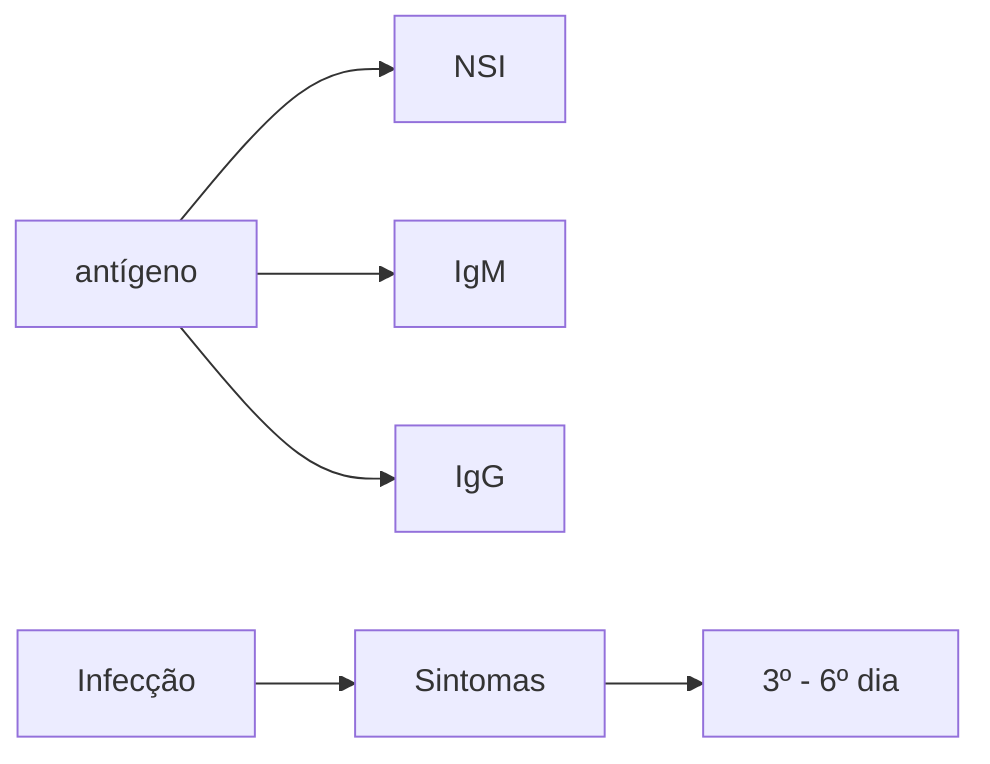

Arboviroses (CM)

# ARBOVIROSES

| * **Dengue**

* Febre de até 7 dias com + 2 sinais (mialgia, cefaleia, artralgia, dor retro-orbitária, prostração)

* **SUSPEITA É CLÍNICA, MESMO COM NS1 NEGATIVO!**

* **A:** jovem liso, prova do laço negativa: alta, hidratação VO, reavalia na defervescência (ou 5º dia);

* **B:** algo te desagrada: >65 a, gestante, prova do laço positiva: Labs + hidrata em PS;

  * se Ht aumentado, abordar como grupo C
  * se Ht normal, alta com retorno diário até 48hs após remissão da febre.

* **C:** sinal de alarme: 10ml/kg/h 2x (pode até 3);

* Surgimento de sangramentos. | - Derrames cavitários;
- Lipotimia, hipotensão postural;
- Dor abdominal refratária, vômitos persistentes, hepatomegalia > 2cm.
- **D:** choque (PA convergente, pulsos finos, TEC > 2 seg, oligúria);
- 20 ml/kg/20min 3x - avaliar albumina e vasopressor.**Chikungunya**- Aguda (< 3 semanas): analgésico + opioide. Sem corticoide;
- Subaguda (3-8 semanas): corticoide - pred 0,5mg/ kg/d;
- Crônica (>3 semanas): hidroxicloroquina 400mg. |
| --------------------------------------------------------------------------------------------------------------------------------------------------------------------------------------------------------------------------------------------------------------------------------------------------------------------------------------------------------------------------------------------------------------------------------------------------------------------------------------------------------------------------------------------------------------------------------------- | ------------------------------------------------------------------------------------------------------------------------------------------------------------------------------------------------------------------------------------------------------------------------------------------------------------------------------------------------------------------------------------------------------------------------------------------------- |

## 1. DENGUE

- No Brasil, é uma doença endêmica;
  - Acomete todo o território brasileiro;
  - Apresenta maior correlação com períodos chuvosos;
  - É uma epidemia de poucas semanas no ano;
  - A área de alcance do mosquito Aedes aegypti é de 300 metros.
- Existem 4 tipos (1 - 4) – DENV 1/2/3/4.

### 1.1 IMUNIDADE = SOROTIPO DEPENDENTE

- Ou seja, mediante a infecção por um sorotipo, a reinfecção somente ocorrerá por outro sorotipo, que não seja o previamente adquirido. Após a infecção, os anticorpos para aquele sorotipo acabam protegendo contra os outros sorotipos por 6 meses (por isso que não se tem 2 dengues no mesmo ano);
- Mas depois esses anticorpos não conseguem mais te proteger. Pelo contrário: geram uma resposta inflamatória exacerbada caso você seja exposto a um novo Cefaleia retro-orbitária; a ser anticorpos heterólogos; sorotipo. São ditos **anticorpos heterólogos**.
  - É o chamado fenômeno Antibody-dependent enhancement;
- Consequentemente, há maior risco de evoluir com dengue em forma grave, no 2 – 3° episódio de infecção.

### 1.2 CURSO CLÍNICO

- Grave, abrupto e curto;
- Picada do mosquito contaminada com o flavivirus (RNA);
  - Incubação 3 - 7 dias;
  - Período de infecção (dura 3 - 4 dias);
  - Período de defervescência (5° - 7° dia).

### 1.3 MANIFESTAÇÕES CLÍNICAS – PERÍODO DE INFECÇÃO

- Caso suspeito: caracterizada por febre de 2 – 7 dias

com, pelo menos, 2 ou mais sintomas abaixo;
- náusea, vômitos;
- exantema;
- mialgia, artralgia;
- cefaleia, dor retro-orbital;
- petéquias;
- prova do laço + e leucopenia.

| Exantema, pode ou não estar presente; apresentação tardia – surge a partir do 5 – 7° dia; caráter maculopapular, central (acomete face, tronco, membros, mas também palmas e plantas) e pode ser pruriginoso (dica). |
| -------------------------------------------------------------------------------------------------------------------------------------------------------------------------------------------------------------------- |

### 1.4 SUSPEITOU DE DENGUE?

**Teste simples para avaliar potencial de gravidade: prova do laço**

1. Insuflação do manguito até a **média das pressões** sistólica e diastólica;
2. Manter insuflação por 3 – 5 minutos;
3. Contagem de petéquias em quadro de 2,5 cm x 2,5 cm;
4. Teste positivo se a contagem indicar pelo menos 20 petéquias.

**Diagnóstico:**

Métodos:
- Fase virêmica → PCR / NS1;
  - NS1 pode vir positivo no geral até 3º dia. Mas mesmo nesse período, pode ser negativo (baixa sensibilidade)!
- S = 64%;
- E ~ 84 – 100%.
- Em período de defervescência (após 5° a 6° dia) → sorologia (teste rápido);

**Pegadinha do diagnóstico:**
- Atenção!! Do 3º – 6° dia de sintomas, nenhum teste é positivo!
- Assim, a **suspeita de dengue é clínica!**

INFECTOLOGIA

**Nota:** 1º-6º dia de doença: nenhum teste é positivo

**Figura 1 Diagnóstico: dengue**

**Laboratório geral:**
- Transaminases 200 - 300 UI;
- **Sem alargamento de coagulograma;**
- Sem aumento de bilirrubina direta;
- HT > 47% aumentado;
- Plaquetopenia – surge na fase de defervescência;
  - Grave se < 20.000/mm3 (considerar internação para monitorização diária de plaquetas)..
- IRA discreta;
- Leucopenia.

**Classificação de risco:**

**A** - "jovem saudável";
- Prova do laço negativa;
  - Sem manifestação hemorrágica espontânea ou induzida.
- Sem sinais de alarme;
- Sem comorbidades;
- Faixa etária: > 2 anos e < 65 anos;
- Não é gestante;
- Sem risco social.
- Tratamento:
  - A: hidratação 60 ml/kg/dia, sendo 1/3 em SRO (soro de reidratação oral);
  - Retorno para reavaliação no 1° dia sem febre ou no 5° dia da doença.
- Não precisa coletar exames no grupo A, mas sempre avaliar com prova do laço.

**B** - "algo já te preocupa";
- Prova do laço positiva ou manifestação hemorrágica espontânea;
- Presença de comorbidades E/OU;
- Faixa etária < 2 anos e > 65 anos E/OU;
- Gestante E/OU;
- Risco social;
- Sem sinais de alarme;
- Sem sinais de choque;
- Tratamento:
- Hidratação VO/EV na entrada, Labs iniciais;
- HT inicial normal?
  1. Hidratação igual à do grupo A e retorno em PS para reavaliar ,diário até 48hs sem febre.;
- HT aumentado, conduzir como grupo C.
- comorbidades clínicas descompensadas, risco social, recusa de ingesta oral, > 65a considerar decisão individualizada.

**C - Sinal de Alarme;**
- Sem sinais de choque;

"Sinais" de alarme;
- **Dor abdominal constante.**
  - No geral, refratária à hidratação e ao uso de analgésicos;
  - Vômitos persistentes;
  - Hepatomegalia > 2 cm;
- **Sangramento de mucosas.**
  - Gengivorragia;
  - Hematúria;
  - Sangramento de trato gastrointestinal;
- **Hipotensão postural e/ou lipotimia.**
  - PAS deitada – PAS sentada ou em pé ≥ 20 mmHg;
  - PAD deitada – PAD sentada ou em pé ≥ 10 mmHg;
- Derrames cavitários (radiografia de tórax e USG de abdome);
- Aumento do hematócrito, apesar de hidratação.

**Tratamento:**
- internação em UTI se possível (não é indicação absoluta);
- Hidratação EV 10 ml/kg na 1 e 2° hora;
1. Objetivo: diurese: ~1 ml/kg/h;
2. Reavaliação após 2 horas;
3. Houve melhora do Ht? coletar após 2hs.
- **Se não, proceder com mais uma expansão volêmica;**
1. Avaliar melhora do Ht após 3° expansão volêmica;
2. Se não houve melhora, reclassificar o paciente no grupo D;
- Se sim, administrar 25 ml/kg nas primeiras 6 horas + 25 ml/kg de 8/8 horas.
- **D** - Há sinais de choque?
- Má perfusão **(TEC > 2 seg, pulso fino, PA convergente = < 20 mmHg de diferença sistólica -diastólica);**
- Oligúria (<1,5ml/kg/h);
- Sangramento grave (TGI);
- Disfunção orgânica;
- Tratamento: UTI – choque hemorrágico + distributivo;
  - Aborda como choque distributivo;
  - Administrar 20 ml/kg em 20 minutos, por até 3x;
- Ht ou PA melhorou?
  - Não: albumina 0,5 – 1 g/kg. + vasopressor.

**Choque e administração de plaquetas:**
- Considerações:
  - O desenvolvimento do choque na dengue é **precoce, rápido e breve;**
  - Observa-se "pinçamento" da pressão arterial.
- Deve-se considerar transfusão
  - Se coagulopatia: plasma fresco + vitamina K
  - Transfusão de plaquetas apenasnas seguintes condições:
  - sangramento persistente não controlado, depois de corrigidos osfatores de coagulação e do choque,e com trombocitopenia e INR > que1,5 vez o valor normal.

Atenção: atualmente, a indicação de transfusão por plaquetopenia isolada não é mais vigente, pois pode induzir à CIVD.

- **Conduta em relação ao uso de certos AAS, clopidogrel e warfarina**

ARBOVIROSES

• Basicamente, somente haverá suspensão em casos com plaquetopenia < 30.000/mm3.
• Stent:
  • 1 mês se convencional, 6 meses se farmacológico;
  • AAS + clopidogrel;
  • Plaquetopenia > 50.000 → mantém;
  • Plaquetopenia < 30.000 → suspende.
• Warfarina:
  • Objetivar INR 1,5 – 2.
• **Critérios de internação**
  • Sinais de alarme;
• Diminuição de ingestão alimentar;

• Comprometimento respiratório
  • Idade > 65 anos;
  • Gestante;
  • Indivíduos em vulnerabilidade social;
  • Comorbidades descompensadas:
• **Critérios para alta hospitalar:**
  • Devem preencher todos os critérios a seguir:
  • Estabilização hemodinâmica durante 48 horas;
  • Ausência de febre por 24 horas;
  • Melhora visível do quadro clínico;
  • Hematócrito normal e estável por 24 horas;
  • Plaquetas em elevação.

| Stent farmacológico <6 meses ou stent convencional <1 mês em uso de DAPT (AAS e clopidogrel)                |                                                                                                              |                                                                                                                   |
| ----------------------------------------------------------------------------------------------------------- | ------------------------------------------------------------------------------------------------------------ | ----------------------------------------------------------------------------------------------------------------- |
| Plaquetas acima de 50x10₉ / L                                                                               | Plaquetas entre 30x10₉ / L e 50x10₉ / L                                                                      | Plaquetas abaixo de 50x10₉ / L                                                                                    |
| Manter o AAS e o cloridogrel

Realizar contagem diária de plaquetas, conforme protocolo de grupo B. | Manter o AAS e o cloridogrel

Admitir em leito de observação e realizar contagem diária de plaquetas | Suspender o AAS e o cloridogrel

Admitir em leitos de observação e realizar contagem diária de plaquetas. |

**Figura 2** 1 mês em uso de DAPT

## 2. CHIKUNGUNYA

• Chikungunya é um termo derivado do maconde → "aquele que dobra o joelho";
  • A marca da doença é a poliartralgia, simétrica e distal.

**Caso suspeito:**
• Febre > 38,5 °C, com duração < 14 dias, com artralgia/ artrite, sem outra causa aparente.

**Quadro clínico:**
• Febre alta, com duração de 10 dias, com poliartralgia simétrica, distal, pequenas e grandes articulações, entre 2 – 5° dia de sintomas;
• Edema periarticular;
• Rash máculopapular precoce e não pruriginoso;
• Linfadenopatia cervical;
• Hepatite branda – com transaminases entre 100 – 200 UI;
• Trombocitopenia leve (plaquetas ~100.000/mm3);
• VHS e PCR elevados.

**Fases:**

Aguda;
• Até 3 semanas;

• O tratamento é realizado apenas com uso de analgésicos simples e derivados de opioides (em alguns casos);
• Não se deve administrar AINEs e corticoide (risco de efeito rebote).

Subaguda;
• De 3 – 8 semanas;
• Manejar com:
  • AINEs;
  • **Corticoide – prednisona 0,5 mg/kg/dia;**
  • Tricíclicos e gabapentina;
  • Pacientes com contra-indicações a corticoterapia: DM, HAS refratária, osteoporose com fraturapatológica, Cushing, DRC em TSR.

**Crônica;**
• > 8 semanas;
• Grupo de maior risco: mulheres, acima de 45 anos, com substrato reumatológico.
• Manejo com:
  • Hidroxicloroquina 5mg/kg (até 400mg/dia) por 6 – 12 semanas – pilar do tratamento;
  • Sulfassalazina, se refratariedade;
  • Tricíclicos, gabapentina;
  • Corticoide.

# 3. ZIKA

• Originado da floresta de Uganda;

**Manifestações:**
• Clínica: somente em 20% dos casos;
• Febre baixa;
• Exantema maculopapular pruriginoso;
• Conjuntivite bilateral;
• Linfadenopatia;
• Artralgia.

**Problema: neurotropismo:**
• Encefalite;
• Microcefalia;
• Isquemia cerebral;
• Guillain-Barré.

Atenção: toda arbovirose é neurotrópica! Zika é apenas "a mais famosa" por isso.

**Diagnóstico:**
• PCR nos primeiros 4 – 6 dias;
• Após tal período, é por sorologia;
• Suspeita de SGB: IgM no LCR.

**Tratamento: suporte** Tabela 1

Tabela 1 quadro resumo das arboviroses

| QUADRO RESUMO DAS ARBOVIROSES | QUADRO RESUMO DAS ARBOVIROSES
Dengue | QUADRO RESUMO DAS ARBOVIROSES
Chikungunya | QUADRO RESUMO DAS ARBOVIROSES
Zika   |
| ----------------------------- | ---------------------------------------- | --------------------------------------------- | ---------------------------------------- |
| Marca principal               | Cefaleia
Hematócrito                 | Poliartralgia                                 | Febre baixa, mono-like com neurotropismo |
| Febre                         | Alta e súbita                            | Alta e súbita                                 | Baixa, se presente                       |
| Hepatite                      | Frequente                                | Rara                                          | Ausente                                  |
| Rash cutâneo                  | Tardio, 50%                              | Presente                                      | Bastante presente, precoce               |
| Conjuntivite                  | Rara                                     | 30%                                           | Presente (50 –90%)                       |
| Linfonodomegalia              | Rara                                     | 30%                                           | Bastante presente                        |
