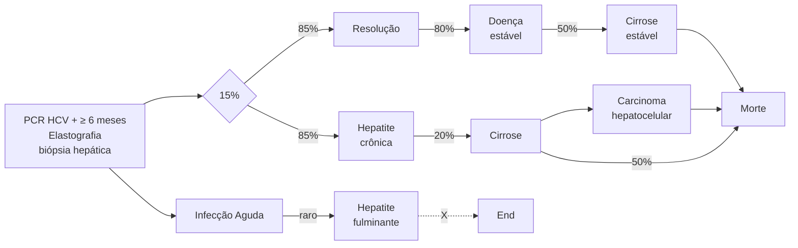

# HEPATITES VIRAIS

| \*\*Hepatite A:\*\* - Forma ictérica no adulto. vacina efetiva, não cronifica. \*\*Hepatite B\*\* - Ag é do vírus: Ag-HBS (superfície) ; Ag-HBE (replicação); - Anti é resposta imune: anti-HBS: contra a superfície ; anti-HBE: contra a replicação ; anti-HBC : contato; Sorologias pegadinhas: possuem PCR elevado e alteração de transaminases mesmo com: - Anti-HBE + = mutante pré-core; - Anti-HBS + = mutante por escape / heterótipo; - Anti-HBC isolado positivo - esqueceu-se de fazer; Anti-HBS ou tem esse mutante? Se TGP normal, revacina e avalia anti-HBs - se não responder, PCR-HBV; \*\*Tratamento se faz por evidência de dano hepático sustentado devido à replicação viral;\*\* |   | - Dano hepático: TGP >= 52 homens / 37 mulheres; - Sustentado: repetido em 3 meses; - Replicação viral: PCR > 2.000 cópias; - Outras indicações de tratamento; - Alto risco CHC: fibrose avançada / cirrose, co-infect HIV / HCV; histórico familiar; - Manifestações extra-hepáticas; - Rituximab se anti-HBC + - Profilaxia - Ig só tem indicação - Mãe ou fonte Ag-HBS + - Se não responder após 2 esquemas de vacinação \*\*Hepatite C:\*\* - PCR-HCV + > 6 meses; - Trata-se e se cura = RVS por 12 semanas. Seguimento o resto da vida depende de fibrose. |
| ------------------------------------------------------------------------------------------------------------------------------------------------------------------------------------------------------------------------------------------------------------------------------------------------------------------------------------------------------------------------------------------------------------------------------------------------------------------------------------------------------------------------------------------------------------------------------------------------------------------------------------------------------------------------------------------------------ | - | ---------------------------------------------------------------------------------------------------------------------------------------------------------------------------------------------------------------------------------------------------------------------------------------------------------------------------------------------------------------------------------------------------------------------------------------------------------------------------------------------------------------------------------------------------------------- |

## 1. HEPATITES VIRAIS AGUDAS

**Informações gerais:**
- Quadro viral agudo é observado principalmente nas hepatites A e B;
- Hepatites B e C se cronificam, a hepatite A nunca.

### 1.1 PRÓDROMO VIRAL
- Os sintomas mais proeminentes são expressos no TGI como:
  - Náuseas/Vômitos;
  - Dor abdominal;
  - Hepatomegalia dolorosa.
- Presença de mialgia e cefaleia;
- **Febre é incomum;**
  - Se estiver presente, geralmente, é uma febre baixa de 37,5°C – 37,9ºC, não tão intensa como em arboviroses, simula bastante uma GECA.

**ATENÇÃO: transaminases altíssimas → > 1.000UI/ml. Nesses casos, sempre pensar em hepatites virais agudas e febre amarela. Sempre que as transaminases forem mais brandas, na faixa dos 200-300, devemos pensar em outros diagnósticos diferenciais, como dengue, leptospirose e malária.**

- Na hepatite A sempre há cura espontânea, nunca cronifica. Na maioria das vezes ocorre na infância e passa meio oligossintomática. No adulto, mais frequentemente faz caso grave, mas ainda apresenta baixa taxa de complicações;
- Na hepatite B, até 20% dos quadros podem evoluir para a fase ictérica.

### 1.2 FASE ICTÉRICA
- Estabelecimento da síndrome colestática:
  - Aumento de bilirrubina direta;
  - Acolia fecal;

- Colúria.
- Leucopenia com linfocitose acima de 35%;
  - Diferentemente de doenças bacterianas como a colangite e leptospirose que apresentam leucocitose com desvio à esquerda.

**Tratamento na fase ictérica:**
- Hepatite A: Tratamento de suporte;
- Hepatite B: Tratamento de suporte.
- A cura da hepatite B depende da resposta imunológica; Para se ter boa resposta, há necessidade de reconhecer o vírus como non-self. Desse modo, antivirais, por diminuírem a carga viral, diminuem as chances de o sistema imune fazer esse reconhecimento e aumentam as chances de cronificação.
- Tratamento específico com antivirais apenas se houver evidências de que podem vir a fulminar, como:
  - Sintomas e icterícia caracterizada por bilirrubina total (BT) superior a 3 mg/dL ou bilirrubina direta (BD) superior a 1,5 mg/dL por mais de quatro semanas.
  - Qualquer grau de encefalopatia hepática ou ascite.

## 2. HEPATITE A

**É uma doença predominantemente da criança:**
- 50% têm quadro viral inespecífico, como de uma GECA;
- Apenas 1 – 2% evoluem para forma mais grave - icterícia.

**Em adultos:**
- 5% têm apresentação clínica inespecífica;
- 80% evoluem para forma mais grave – icterícia;
- A transmissão acontece fecal-oral;
- A hepatite A é picornavírus com apenas 1 sorotipo, por isso a eficácia da vacina.

**A vacina contra a hepatite A dura toda a vida:**
- Em imunussuprimidos → 2 doses com 6 meses de intervalo;

• A vacina entrou no PNI em 2014, então nascidos antes desse ano não receberam a vacina rotineiramente.
• Indica-se a vacina para adultos em casos de:
  • Homem que faz sexo com homem (HSH);
  • Hepatopatas;
  • Coinfeção: PVHIV, HCV ou HBV;
  • Imunossuprimidos em geral;
  • Coagulopatia, hemoglobinopatias;

![Gráfico mostrando o curso sorológico da hepatite A ao longo do tempo, com curvas para eliminação viral (3 semanas), sintomas (5 semanas), IgM e IgG]

**Figura 1** Curso sorológico da hepatite A

## 3. HEPATITE B

**Trata-se de um DNA vírus:**
• Se integra ao DNA humano;
• Tem potencial carcinogênico **independente** da cirrose;
• A hepatite B forma o **cccDNA que fica em latência virológica, ou seja, não há cura microbiológica**, apenas funcional;
• A hepatite B pode ser reativada, principalmente se tratar de paciente imunossuprimido, principalmente se a imunossupressão for feita com **antiCD20 - rituximab**.

### 3.1 A TRANSMISSÃO OCORRE POR VIAS
• Sexual: principal forma de transmissão;
• Percutânea: é o vírus com maior risco de contágio nesse tipo de acidente;
• Vertical.
• Sanguínea: lembrar que os screenings em bancos de sangue para hepatites virais surgiram na década de 90.

### 3.2 A ESTRUTURA VIRAL DA HEPATITE B
• S = Superfície = AGHBS;
• C = Core/Centro = Interpretado na sorologia como "Contato" = AGHBC;
• Não é possível dosar o AGHBC; no sangue porque o vírus não o elimina na circulação. Vê-se apenas o anti-HbC = resposta imune.

![Diagrama circular mostrando a estrutura do vírus da hepatite B com HBsAg na superfície e HBcAg no centro]

**Figura 2** HBsAg, HBcAg

### 3.3 MARCADORES SOROLÓGICOS

**Antígenos (Ag):**
• Parte do vírus;
• Aparece precoce;
• AGHBS: indica doença ou que não houve cura funcional;
• AGHBC: indica contato mas não é liberado pelo vírus no sangue. Logo, não conseguimos detectar.
• AGHBE: indica replicação.

**Anticorpo (Anti):**
• Resposta imune;
• Demora um pouco para ser sintetizado;
• Anti-HBs: Indica cura funcional ou vacinação prévia;
• Anti-HBc: Indica contato;
• Anti-HBe: Indica não haver replicação.

**Tabela 1** Hepatite B: Marcadores Sorológicos

|                                | AGHBS | Anti-HBS | Anti-HBC | AGHBE | Anti-HBE |
| ------------------------------ | ----- | -------- | -------- | ----- | -------- |
| Doença aguda                   | +     | -        | -        | +/-   | -        |
| Doença replicante              | +     | -        | +        | +     | -        |
| Não teve cura                  | +     | -        | +        | -     | -/+      |
| Cura funcional                 | -     | +        | +        | -     | +        |
| Imunidade sem contato = vacina | -     | +        | -        | -     | -        |

HEPATITES VIRAIS                                                                                                                                    3

## Figura 3 Marcadores sorológicos até a cura funcional

[Graph showing curves for Incubação, Sintomas, and Recuperação over time from 4 sem to 32 sem, with markers for AGHBS AGHBE, IgM anti-HBc, lgG anti-HBc, anti-HBs, and anti-HBe]

## Figura 4 Marcadores sorológicos ate a cronificação. Nunca faz o anti-HBs. Crônica = AGHBS por > 6 meses.

[Graph showing chronic infection pattern with note: Crônica = AgHBS por > 6 meses, with markers for AGHBS AGHBE, IgM anti-HBc, and lgG anti-HBc]

• Quanto mais cedo na vida o paciente tiver contato com o vírus, mais imaturo será o sistema imune para fazer o anti-HbS. Por conseguinte, **é na transmissão vertical que temos o maior risco de cronificação.**

**Atenção! Sorologias pegadinhas: na situação abaixo, sempre indicará que o paciente não teve cura (conversão em anti-HBs)**

### Tabela 2 Marcadores sorológicos quando o paciente não teve cura

| Não teve cura | AGHBS | Anti-HBs | Anti-HBc | AGHBE | Anti-HBe |
| ------------- | ----- | -------- | -------- | ----- | -------- |
|               | +     | -        | +        | -     | -/+      |

• No caso acima, há duas possibilidades:
  • **Portador inativo:** nunca se curou mas convive bem com o vírus;
  • **Mutante pré-core:** cepa capaz de se replicar mesmo na presença do Anti-HbE, "se escondendo" do sistema imune exatamente por não ter o AgHbE. Altera TGP (> 1,5x LSN) e PCR elevado (> 2000 UI);
  • **Mutante por escape:** deixa de produzir agHBS ou passa a produzir de outro tipo para "escapar" do Anti-HBS. Confira Figura 5 ao lado.

----

## [Flowchart] Se HBSAG NEG e anti-HBC POSITIVO

**Dosar ALT e Anti-HBs**

↓

**Anti-HBs <10 e ALT normal** | **Anti-HBs <10 e ALT alterada**

↓ | ↓

**Uma dose de vacina** | **Solicitar PCR-HBV**

↓ ↓ ↓

**Anti-HBs > 10** | **Anti-HBs < 10** | **Detectável**

↓

**HEPATITE B OCULTA**

↓

**Replica-se mesmo na presença de anti-HBS pois perdeu/fez um outro agHBS**

**Figura 5** Fluxograma Anti-HBC positivo isolado: investigação de hepatite B oculta (mutante por escape)

## 3.4 INDICAÇÕES DE TRATAMENTO NA FASE CRÔNICA

• Por causas dessas cepas mutantes é que o novo PCDT é categórico;

Pacientes com HBV-DNA ≥ 2.000 UI/mL, independentemente do status do HBeAg, se níveis elevados de ALT (≥ 52 U/L para homens e ≥ 37 U/L para mulheres) em duas medidas consecutivas, com intervalo mínimo de 3 meses, devem ser tratados

• Quem tem alto risco de fazer hepatocarcinoma;
• Cirrose ou fibrose avançada ≥ F3;
• Bx : ≥F2;
• Elasto : ≥ F3 = >9kPa (AST normal) / > 12kPA (AST 1-5x LSN)
• Histórico familiar Carcinoma Hepatocelular;
• Co-infecção HCV/HIV;
• Quem sofre muito com manifestação extra-hepática – lembrar da poliartrite nodosa;
• Todo AgHBE +:
  • ≥ de 30 anos, pois dificilmente soroconvertem;
• Transaminases > 1,5 LSN por mais de 3 meses;
• Todo imunossuprimido com contato prévio (realizar terapia preemptiva).
• Rituximab (antiCD-20);
  • Possui tempo de meia-vida longa;
  • Se o paciente já teve a cura funcional com o rituximab ele pode passar pela soro reversão → perde o antiHBS e reativa a Hepatite B;
  • **Se for usar rituximab e for antiHBC positivo, não importa o anti HBS, e deve-se fazer a terapia preemptiva;**

HEPATITES VIRAIS                                                                                                                                    5

**Figura 6 Hepatite C: Infecção Aguda**

## 4.1 FORMAS DE TRANSMISSÃO
• Sangue e perfurocortantes;
• Existe transmissão sexual, mas é bem menos importante que na hepatite B.
• **Não tem vacina e não apresenta sintomatologia até evoluir para a cirrose:**
  • RNA vírus e 7 subtipos, por isso a dificuldade em ter a vacina.

## 4.2 TRATAMENTO
• Apesar de ter vários genótipos, ao invés de realizar a genotipagem, cada vez mais têm sido preconizados esquemas pangenotípicos;
• Existem 6 genótipos para hepatite C (risco de reinfecção);
• Tratamentos pangenotípicos:
  • Sofosbuvir + daclatasvir;
  • Sofosbuvir + velpatasvir;
  • O sofosbuvir não é utilizado na insuficiência renal, devendo-se substituir por glecaprevir (ClCr < 30);
  • Ribavirina - adicionada em esquemas de pacientes cirróticos. Tem toxicidade hematológica e renal.

• O tratamento da hepatite C é contraindicado em gestantes e em descompensação hepática ou diante da RVS (resposta virológica sustentada);
  • A RVS consiste em 12 semanas após o término do tratamento, avaliada por PCR-HCV.

**Em quem realizar o seguimento pelo resto da vida? Cirrose ou fibrose (F3/F4)** - F0/F1 considera curado sem necessidade de seguimento. F2 avalia se regride após tratamento. Se sim, pode dar alta. Senão, mantém seguimento.

## 5. HEPATITE D

• Transmissão: igual à hepatite B - percutânea, materno ou sexual.
• Necessita do AGHBS:
  • Coinfecção simultânea com HBV;
  • Superinfecção com HBV crônico.
• Rápida progressão para cirrose hepática e CHC;
• Quando suspeitar;
  • Exacerbação da doença hepática com HBV-DNA suprimido (menor 2000 UI/mL), sem outra causa identificada.
