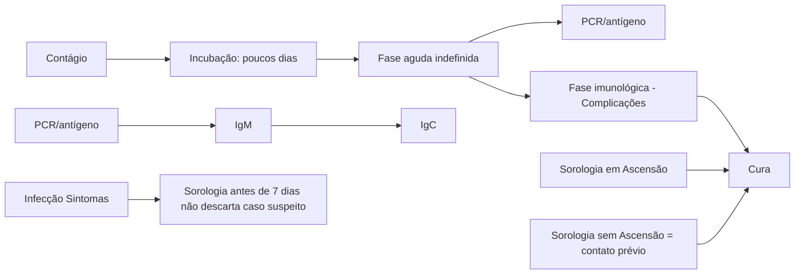
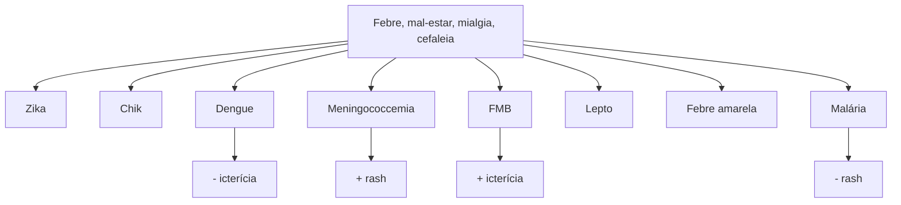

Icterícias Febris e FMB (CM)

# ICTERÍCIAS FEBRIS E FEBRE MACULOSA

## Leptospirose

• Fase febril aguda: mialgia + exposição – sem icterícia nem injúria renal (aumento de CPK);
• Dx: fase febril: PCR no sangue;
• Fase imunológica: icterícia rubínica com sufusões hemorrágicas + IRA não oligúrica e hipoKalêmica + EAP;
• Dx fase imunológica: PCR na urina ou sorologia – aumento do título em 2 semanas ou título > 1:800 (muito alto para ser antigo);
• Tratamento: diálise precoce + ceftriaxona.

**Notifique em até 24h!**

## Febre amarela

• Fase febril inespecífica – remissão parcial dos sintomas antes da fase imunológica;
• Sinal de Faget: febre sem taquicardia – não é específico, mas sugestivo;
• Falência hepática – tratamento suportivo;

## Notifique em até 24h!

### Malária

• Febre em acessos, com muito calafrio. Sem indicação de quimioprofilaxia e sorologia, gota espessa!
• Falciparum = derivado de artemisinina (ACT) – artesunato + mefloquina ou artemeter + lumefantrina. Primaquina aqui, sempre dose única;
• Vivax: cloroquina + primaquina 7 dias – atingir hipnozoítas – controle de cura até 63 dias. Grave = artesunato.

### Febre maculosa

• Espectro clínico: exantemática febril / íctero-hemorrágica / sufusões petequiais;
• Não espere relato de carrapato – área de risco nos últimos 14 dias: interior da região sudeste;
• Diagnóstico definitivo: sorologia (IFI) – repete em 14–21 dias com aumento de 4x o título – Doxiciclina empírica.

## 1. HISTÓRIA NATURAL DA DOENÇA

• No geral, as doenças icterícias febris (leptospirose, febre amarela, hepatites virais) apresentam uma história natural semelhante, resumida na figura a seguir:

**Evolução comum lepto, dengue, febre amarela e hepatites virais**

**Figura 1** Evolução clínica geral de doenças infecciosas

## 2. LEPTOSPIROSE

### 2.1 EVOLUÇÃO CLÍNICA E DIAGNÓSTICO

• > 80 sorotipos → L. Icterohaemorrhagiae;
• Contato com urina de roedores (pele íntegra e via inalatória) → período de incubação (4-30 dias, com média de 7) → fase leptospirêmica (3-5 dias) inespecífica → evolução para cura (80%) ou para fase imunológica, ou síndrome de Weil (20%).

### 2.2 FASE LEPTOSPIRÊMICA

• Nessa fase, 80% das pessoas se curam;
• Sintomas inespecíficos:
  • Febre, mal-estar;

• Náuseas, vômitos;
• **Mialgia em panturrilhas e dorso.**
• PCR detectado no sangue;
• Exames laboratoriais: aumento de CPK, TGO > TGP (ambas < 200UI/l), leucocitose com desvio à esquerda.

OBS: nesta fase, em geral, ainda não há desenvolvimento de injúria renal e icterícia.

### 2.3 FASE IMUNOLÓGICA

**Síndrome de Weil:**

• **Icterícia rubínica (alaranjada):** devido ao desenvolvimento de uma vasculite sistêmica (sufusões hemorrágicas), confere tonalidade mais alaranjada.
• Não há necrose hepatocelular intensa → TGO e TGP com valores em torno de 200–300. Ocorre colestase intra-hepática → BD elevada;
• **Dano alveolar: EAP** (principal causa de morte) e hemorragia alveolar. Rx : 25% – infiltrado bilateral reticular. **Taquipneia**, mesmo que sem dessaturação;
• **Injúria renal → não oligúrica e normo/ hipoKalemica:** até pode ocorrer oligúria indicando maior mortalidade. Evolução tardia → poliúria;
• Indicação clássica de terapia de substituição renal precocemente;

**Outras manifestações da fase imunológica:**

• **Outras manifestações – meningite asséptica:** pleocitose até 500 cels/mm³ com predomínio linfocítico, proteinorraquia de 50-100mg/ml , glicose normal, culturas negativas;
• **Outras manifestações – acometimento cardíaco:** miocardite: ECG seriado + MNM: alteração de repolarização e arritmias, BAV 1º grau, arritmias por hipoK.

## 2.4 EXAMES CONFIRMATÓRIOS

**Sorologia → ELISA.**

• A sorologia antes de 7 dias não descarta caso suspeito;
• Detecta anticorpo, não o antígeno;
• Alta endemicidade → pode ser apenas contato prévio;
• Estabelece diagnóstico se:
  • Titulação > 1:800 (muito alto para ser platô);
  • Comparação de duas titulações, com intervalo de 2 semanas e aumento de 4x da titulação.

**PCR:**

• < 7 dias → sangue;
• > 7 dias → urina.

**EXAMES CONFIRMATÓRIOS:**

| Infecção   | Fase leptospirêmica | Fase imunológica | Sintomas |
| ---------- | ------------------- | ---------------- | -------- |
| PCR sangue | PCR urina           | Sorologia        |          |

**Figura 2** Fluxograma de Leptospirose - Exames confirmatórios

## 2.5 TRATAMENTO

**Medicamentoso → Ceftriaxona 2g/dia por 7 dias.**

• Inclusive na fase imunológica;
• Alternativas: doxiciclina, azitromicina, amoxicilina ou penicilina, principalmente na fase leptospirêmica.

**Prevenção:**

• Doxiciclina 200 mg/semana **(pós-exposição: não é indicada de rotina em caso de exposição única)**;
• Indicação de profilaxia para profissionais com alto risco de exposição e de forma constante, como equipe de saneamento básico;
• Notificação imediata → saneamento básico e controle de vetores.

## 3. FEBRE AMARELA

• Transmitida pela picada do mosquito Aedes (cidade) ou Haemagogus (mata), endêmica na região amazônica;
• Picada do mosquito → incubação de 3-5 dias → período de infecção (3-5 dias) → 85% evoluem para cura e 15% evoluem para o período toxêmico (90% de letalidade), após um período de 24-48 h de remissão dos sintomas.

### 3.1 SINTOMAS DO PERÍODO DE INFECÇÃO

• Febre;
• Mal-estar;
• Náuseas e vômitos;
• Mialgia;
• Cefaleia;
• **Sinal de Faget** → a distensão hepática faz uma compressão vagal, levando a bradi/normocardia, a despeito da febre alta.

**Falência hepática aguda:**

• Clínica: rebaixamento do nível de consciência, sangramento do trato gastrointestinal e icterícia (sinais de falência hepática);
• **Classicamente antes de piorar, o paciente pode ter 12 - 24h de remissão, como se fosse apresentar melhora;**
• **Transaminases** > 1000 ui.
• **Alargamento de coagulograma;**
• Aumento de bilirrubina **direta;**
• **Plaquetopenia;**
• Coagulação intravascular disseminada **(CIVD);**
• Necrose tubular aguda **(NTA);**
• Miocardite;
• Leucopenia com linfocitose (linfócitos > 35%).

### 3.2 DIAGNÓSTICO

• Fase virêmica: PCR sérico;
• Fase imunológica: sorologia (ELISA/MAC-ELISA).

### 3.3 TRATAMENTO

• Suporte;
• Se necessário, transplante hepático;
• Prevenção: lembrar da vacinação!

**Dica:** na prova se tivermos transaminases (TGP/TGO) acima de 1.000 sempre pensar em duas etiologias - febre amarela e hepatites virais agudas.

## 4. MALÁRIA

### 4.1 INTRODUÇÃO

• Epidemiologicamente, no Brasil, é endêmica da região amazônica.

**2 principais formas:**

• **Falciparum** → é responsável por cerca de 3% das malárias em território nacional. Causa malária grave, maior parasitemia e tem preferência pelo tecido neurológico;
• **Vivax** → de principal ocorrência no território nacional. Hipnozoítas: formas hepáticas queiscentes → recorrências → primaquina → DG6PD.

**Malária**

**Tabela 1** *Maiores parasitemias; forma cerebral.

|                      | Falciparum\* (incubação de 1 semana)               | Vivax (incubação de 1-2 semanas)                                      |
| -------------------- | -------------------------------------------------- | --------------------------------------------------------------------- |
| Hipnozoítas Recaídas | X                                                  | ✓                                                                     |
| Reticulócitos        | ✓                                                  | X                                                                     |
| Tratamento           | Artesunato + mefloquina ou artemeter/ lumefantrina | Cloroquina/3 dias + primaquina/7 dias Recorrência: primaquina 14 dias |

### 4.2 CICLO EVOLUTIVO

• Picada do mosquito Anopheles → inoculação de esporozoítos;
• Esquizontes teciduais no fígado;

ICTERÍCIAS FEBRIS E FEBRE MACULOSA                                                                                            3

• Vivax libera hipnozoítas, que causam recorrência do quadro clínico. Há alteração de transaminases com menor intensidade;
• Rompimento dos hepatócitos e liberação de merozoítos na corrente sanguínea;
• Merozoítos infectam hemácias e transformam-se em esquizontes novamente.
• Lise da hemácia → Libera trofozoítos que se transformam em gametas livres (gametócitos) no sangue:
  • Aumento de bilirrubina indireta por hemólise;
  • Febre alta de 6/6 a 12/12 horas, paroxística ou não;
  • Mal-estar;
  • Calafrios, sudorese.

## 4.3 SÍNDROMES CLÍNICAS E GRAVIDADE

• **Causa mais frequente de febre no viajante.**

**O diagnóstico de malária, em pessoas procedentes de área de transmissão, deve ser pensado nas seguintes situações:**

• **Presença de febre** de qualquer intensidade, duração e frequência;
• Mal-estar, dor no corpo e nas articulações, fadiga e falta de apetite;
• **Síndrome febril hematogênica;**
• **Síndrome febril ictérica;**
• **Síndrome febril neurológica;**
• **Síndrome febril respiratória;**
• **Síndrome febril com forte do abdominal,** que pode ser ruptura do baço.

**Malária grave (tratar com artesunato):**

• Falciparum;
• Alta parasitemia (≥3+);
• Grávidas;
• SARA (falta de ar fora do acesso)
• Injúria renal
• Diurse < 400ml / 24hs
• Acidose metabólica
• Dor abdominal intensa;
• Icterícia
• Hipoglicemias recorrentes;
• HIperlactatemmia

• Hipotensão / hemorragia / CIVD;
• RNC/Convulsão = forma cerebral;
• Hipotensão/hemorragia/CIVD.

## 4.4 DIAGNÓSTICO

• **Padrão-ouro: gota espessa** (examinador dependente e em regiões não endêmicas fica mais comprometido);
• Permite identificar a espécie, a parasitemia e realizar o controle de cura;
• **Teste rápido** imunocromatográfico → ruim para vivax;
• **Sorologia** → ruim para diagnóstico.

**Quimioprofilaxia**: predomínio de infecções por P. vivax → **eficácia da profilaxia é baixa.** Assim, não se indica a quimioprofilaxia para viajantes em território nacional, mas repelentes e roupas compridas.

**Controle de cura → prolongado e com gota espessa:**

• P. falciparum → em 3, 7, 14, 21, 28 e 42 dias;
• P. vivax ou mista → 3, 7, 14, 21, 28, 42 e 63 dias;
• Confira figura abaixo.

## 4.5 TRATAMENTO

• **Falciparum:** artesunato + mefloquina ou artemeter + lumefantrina → primaquina dose única (gematócitos);
• **Vivax:** cloroquina por 3 dias + primaquina por 7 dias. Se recorrência, estender a primaquina para 14 dias + artesunato.

**Notificação:** semanal na região amazônica e Imediata na região extra-amazônica.

# 5. FEBRE MACULOSA

## 5.1 AGENTE ETIOLÓGICO

• Rickettsia → *Rickettsia rickettsii*;
• Período de incubação: 7 dias em média (2-14 dias);
• Carrapato-estrela (contato por 4 – 6 horas);
  • *Amblyomma aureolatum*: espécie mais comum na região metropolitana de São Paulo;
  • *Amblyomma sculptum*: espécie de carrapato associado à transmissão de rickettsia na região Sudeste e presente no surto recente.

| **Icterícia febril aguda**                                 |                                                    |                                                                     |                                                 |
| ---------------------------------------------------------- | -------------------------------------------------- | ------------------------------------------------------------------- | ----------------------------------------------- |
| ↓                                                          |                                                    |                                                                     | ↓                                               |
| **BI**
Febre paroxística, área
de risco, descorado |                                                    | **BD**                                                              |                                                 |
| ↓                                                          |                                                    | ↓                                                                   | ↓                                               |
| **Malária**                                                | Injúria renal proeminente
com K normal / baixo | Transaminases > 1000                                                |                                                 |
|                                                            | Transaminases 100-300
CPK aumentada            | ↓                                                                   | ↓                                               |
|                                                            | ↓                                                  | Teve período de remissão
Injúria renal
INR alargado
RNC | Sintomas em TGI
sem tanta
dramaticidade |
|                                                            | **Lepto**                                          | ↓                                                                   | ↓                                               |
|                                                            |                                                    | **Febre amarela**                                                   | **Hepatites virais**                            |

**Figura 3** Fluxograma de diagnóstico de doenças a partir da Icterícia febril aguda.

Atenção: a maior parte dos pacientes não relata ter percebido contato com carrapato!

## 5.2 FISIOPATOLOGIA;

• Ativação exacerbada de prostaglandinas.

**Evolui com:**

• Permeabilidade vascular;
• CIVD;
• Lesões teciduais múltiplas;
• Aumento da permeabilidade vascular;
  • Hipoalbuminemia;
  • Edema de subcutâneo, cerebral, pulmonar;
  • Derrames cavitários;
  • Hipovolemia;
  • Coagulação intravascular disseminada (CIVD);
  • Micro-oclusões vasculares e lesões teciduais difusas (incluindo-se necrose de extremidades);
  • Miocardite, pneumonite, lesões glomerulares e tubulares renais, necrose tecidual.

## 5.3 CLÍNICA

• **Espectro:** doença exantemática / forma íctero-hemorrágica / semelhante à meningococcemia;
• **Exantema característico:** início em extremidades e evolução centrípeta, surgimento no 3º-5º dia de doença, pode não aparecer em casos fulminantes;
• **Caso suspeito:** febre / mialgia / cefaleia / exantema que esteve em área de risco nos últimos 15 dias;
• Os testes laboratoriais atualmente disponíveis ainda **não proporcionam resultados específicos de modo ágil e oportuno** capazes de subsidiar as decisões iniciais acerca da indicação do tratamento específico;
• Confira Figura 4 Figura 5 abaixo.

**Definição de caso suspeito**

• Indivíduo que apresente febre de início súbito, cefaleia, mialgia e que tenha relatado picada de carrapatos e/ ou contato com animais domésticos e/ou silvestres e/ ou ter frequentado área sabidamente de transmissão de febre maculosa nos últimos 15 dias;
• Indivíduo que apresente febre de início súbito, cefaleia e mialgia, seguidas de aparecimento de exantema maculopapular, entre o segundo e o quinto dias de evolução, e/ou manifestações hemorrágicas;
• Confira Figura 6 Figura 7 na página seguinte.

### Mono-likes

Sarampo: febre alta + conjuntivite + *rash* craniocaudal. Paciente mal.
Sífilis 2': palmas e plantas
Hepatites virais agudas: TGI, febre baixa
CMV, Toxo, EBV

**Figura 4** fluxogramas arbovirosses + icterícias febris

[Three clinical images showing manifestations of spotted fever on different body parts - oral mucosa, skin with macular rash, and hand with rash]

**Figura 5** Imagens de febre maculosa manual do MS

ICTERÍCIAS FEBRIS E FEBRE MACULOSA                                                                                                                                                     5

![Two medical images showing skin conditions - upper image shows a back with spotted rash, lower image shows neck area with reddish lesion]

| Primeiraamostra | Segundaamostra | Interpretação ecomentário                                                       |
| --------------- | -------------- | ------------------------------------------------------------------------------- |
| Não reagente    | Não reagente   | Descartado                                                                      |
| Não reagente    | 64             | Verificar possibilidade
de surgimento/
aumento tardio de
anticorpo  |
| Não reagente    | 128            | Confirmado                                                                      |
| 64              | 64             | Verificar possibilidade
de surgimento/
aumento tardio de
anticorpos |
| 128             | 256            | Verificar possibilidade
de surgimento/
aumento tardio de
anticorpos |
| 128             | 512            | Confirmado                                                                      |
| 256             | 512            | Verificar possibilidade
de surgimento/
aumento tardio de
anticorpo  |
| 256             | 1024           | Confirmado                                                                      |

**Figura 6** FMB

## 5.4 DIAGNÓSTICO CONFIRMATÓRIO

**Sorologia (imunofluorescência indireta)**

• Preferencial;

• Coleta na suspeita diagnóstica: pode ser negativa se < 7 dias de sintomas;

• Verificar o aumento de título em 14-21 dias;

| 2 diluições / 4x títulos
1/64 - 1/128 - 1/256 |
| ------------------------------------------------- |

• Se não tiver este aumento em 14-21 dias, mas houver suspeita clínico-epidemiológica, verificar o aumento tardio, com coleta de 3ª sorologia, 14 dias após a segunda.

**PCR: somente casos graves**

Quanto ao diagnóstico molecular por RT-qPCR, é importante ressaltar que, por apresentar baixa sensibilidade para a detecção do agente na fase aguda em virtude da baixa carga bacteriana no sangue, a técnica é indicada para investigação de casos graves, quando há lesão endotelial, via de regra para pacientes internados ou para investigação de óbitos suspeitos.

## 5.5 TRATAMENTO

• Doxiciclina ou cloranfenicol (gestantes);

• 7 dias totais ou 3 dias após término da febre;

• Profilaxia: sem indicação. **Tabela 2**

**Tabela 2** Sorologia FMB e interpretação

## 6. LYME

• Lyme símile brasileira ou síndrome de Baggio-Yoshinari;

• Carrapatos: *Ixodes ricinus*, *Amblyomma cajenenses*;

• Agente: *Borrelia burgdorferi*;

• Lesão típica: eritema migratório;

• Alvo, expande lentamente, círculos vermelhos concêntricos e áreas esbranquiçadas.

**Evolução em fases**

• Precoce localizada;

• Disseminação prematura: rigidez de nuca; (meningoencefalite linfocítica) + dores articulares + EM;

• Crônica: disfunção cognitiva, cardíacos, paralisia de Bell.

![Medical image showing an arm with a circular reddish rash]

**Figura 7** Eritema migratório

## 7. NOTIFICAÇÃO

• Febre amarela - imediata (até 24 horas) para MS, SES e SMS → possui um sistema separado: Sistema de Vigilância de Epizootias em PNH;
• Leptospirose - imediata (até 24 horas) para SMS;
• Malária na região amazônica - semanal;
• Malária na região extra amazônica - imediata (até 24 horas) para MS, SES e SMS;
• Febre maculosa: imediata (até 24 horas) para MS, SES e SMS.

ICTERÍCIAS FEBRIS E FEBRE MACULOSA                                                                                                                                    7

# REFERÊNCIAS

Figura 5 Febre maculosa manual do MS.

Arquivo pessoal

Figura 6 FMB.

Arquivo pessoal

Figura 7 Eritema migratório.

Arquivo pessoal
