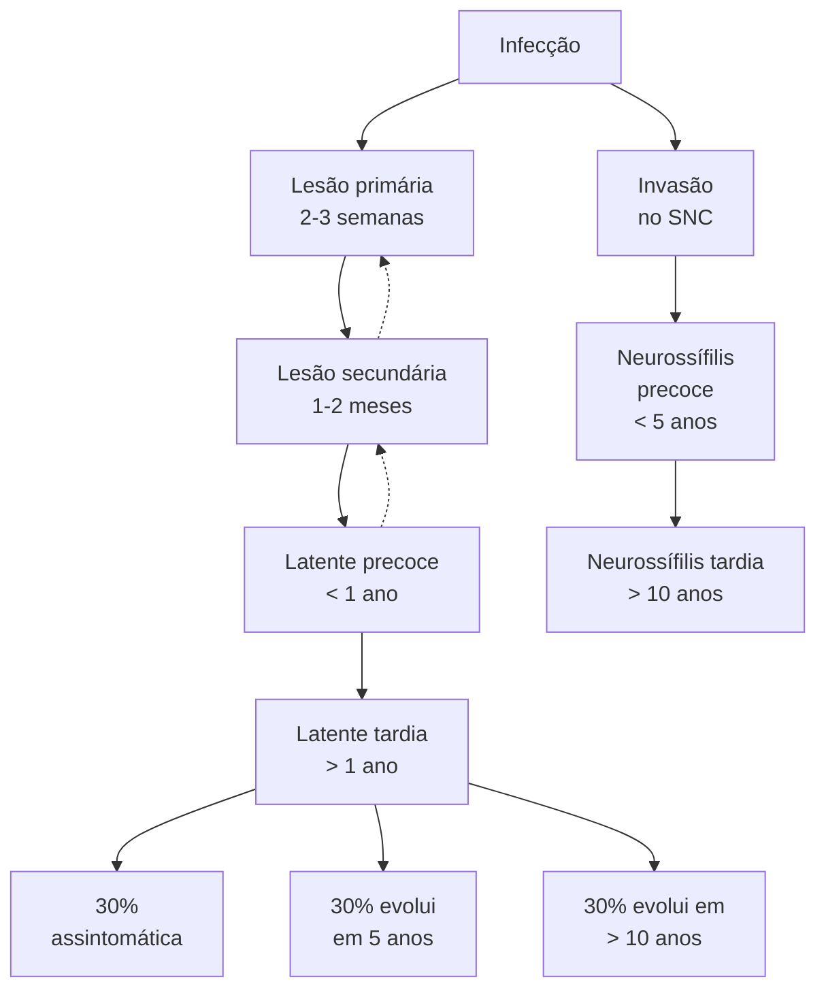
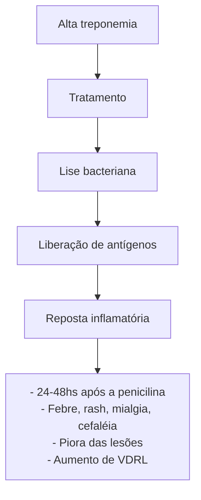
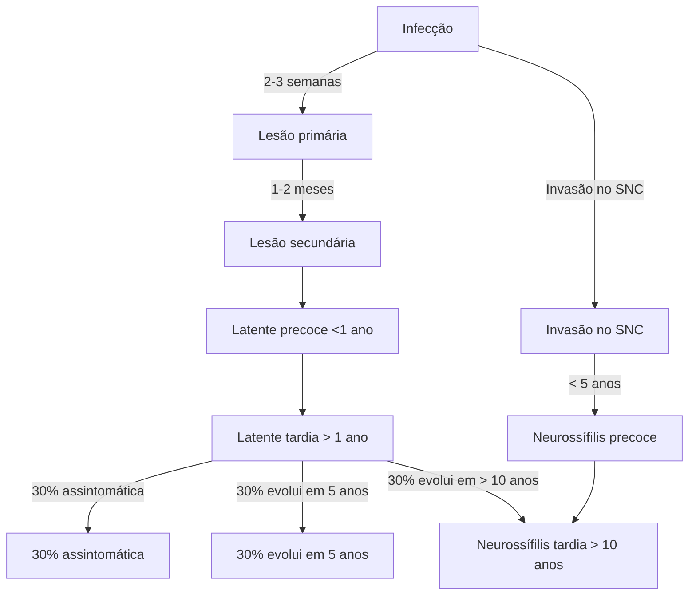
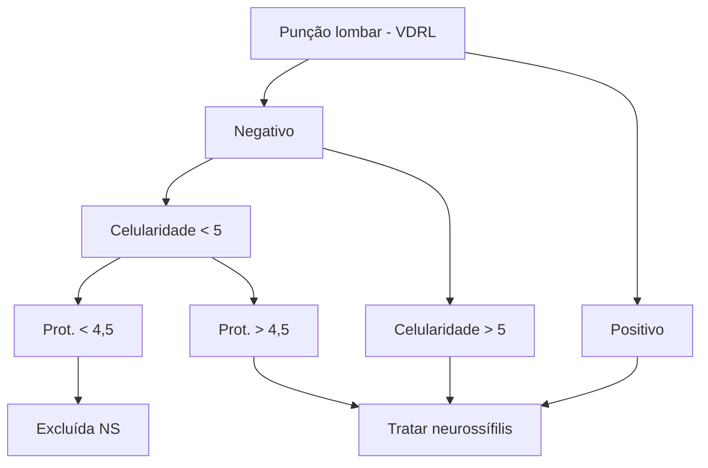

Sífilis, Uretrites Infecciosas e outras DSTs (CM)

# SÍFILIS E URETRITES INFECCIOSAS

## Sífilis - tratamento : penicilina G benzatina ou doxiciclina

• Formas precoces : 2.400.000UI – cura : queda de 2 diluições de VDRL / 6 meses
  • Primária : úlcera genital indolor – resolve sozinha, sem cicatriz, em até 2 semanas
  • Secundária : rash exantemático em palmas e plantas com sintomas sistêmicos – diferenciar farmacodermias, arboviroses e mono-likes
  • Latente precoce (até 1 ano)

• Formas tardias (latente e terciária – não sabe quando se infectou) – exames treponêmicos são mais sensíveis
  • Tratamento : 7.200.000 UI, 3 aplicações, intervalo de 7-10 dias, reiniciar se > 14 dias.
  • Critério de cura : queda de 2 diluições em 12 meses – pode ficar com VDRL positivo (serofast).

• Testes treponêmicos : FTA-ABS, sorologia, teste rápido, TPHA, CMIA – cicatriz sorologia

• Testes não treponêmicos : VDRL e RPR – controle de cura

## ISTs estranhas : doxiciclina / azitromicina

• Linfogranuloma venéreo : adenopatia inguinal, unilateral, dolorosa, coalescente, supuração, fistulização e proctite

• Donovanose : nodulação subcutânea que evolui para úlcera granulosa com sangramento fácil. Sem adenite

## Uretrites infecciosas = gonococo e Chlamydia trachomatis

• Sem agente ou identificado gonococo : ceftriaxona 500mg + azitromicina 1g

• Identificado clamídia : azitromicina 1g

## 1.INTRODUÇÃO

• História natural da doença: Figura 1

• Mesmo antes do aparecimento da úlcera genital, o treponema já pode invadir o sistema nervoso central! Sendo assim, a neurossífilis (precoce ou tardia) deve ser considerada como outra doença, e não como um sinônimo de sífilis terciária.

### Infecção

Figura 1 Curso clínico da sífilis

## 2. ETIOLOGIA E CONTÁGIO

### Considerações iniciais:

• É causada pelo *Treponema pallidum*.

• O contágio pode ocorrer:
  • Todo e qualquer contato sexual
  • Vertical (mãe → filho)
  • Transfusões sanguíneas;

• A sífilis não se adquire com acidente por objetos perfuro-cortantes;

INFECTOLOGIA

## 3. CLÍNICA - SÍFILIS PRIMÁRIA

• Período de incubação: 2 a 6 semanas.
• A lesão inicia no local de inoculação – podendo não ser visível, principalmente em mulheres;
• São lesões de características ulceradas, bordas infiltradas (elevadas), fundo limpo, indolor;
• Autolimitada: resolução em 1 - 8 semanas (média entre 2 – 3 semanas);
• Linfadenite satélite, unilateral, sem supuração.
• O diagnóstico é clínico!
  • Na sífilis primária, os testes diagnósticos não são positivos!
  • Sorologia (teste rápido) somente após 30 dias.
• Microscopia de campo escuro: operacionalmente difícil e pouco disponível.

**Figura 2** Treponema pallidum em microscopia de campo escuro e exemplos de úlcera de sífilis primária

## 4. ÚLCERAS GENITAIS: ABORDAGEM SINDRÔMICA

**Diagnósticos diferenciais:**

• Possíveis agentes etiológicos e infecção gerada:
  • *Chlamydia trachomatis* → linfogranuloma venéreo – LGV;
  • *Haemophilus ducreyi* → Cancróide - também chamada de cancro mole (dolorosa, friável, às vezes múltiplas)
  • Vírus do herpes simplex (tipo 2) → Herpes genital (vesículas que podem ulcerar, base eritematosa, queimação)
  • *Klebsiella granulomatis* → Donovanose;
  • *Treponema pallidum* → Sífilis.

**Úlcera genital com duração menor que 4 semanas: deve-se tratar para sífilis e cancro mole;**

• Cancro mole: doloroso, múltiplos, com saída de secreção e deixa cicatriz;
• Tratamento: penicilina G benzatina 2.400.000 UI + azitromicina 1g ou ceftriaxona 250mg.

**Figura 3** Cancróide (cancro mole)

**Úlcera genital com > 4 semanas de duração, avaliar entre as causas:**

• Linfogranuloma venéreo (Chlamydia trachomatis)
  1. Lesão indolor de inoculação: pápula, pústula ou exulceração;
  2. Caracteristicamente destaca-se a linfadenopatia inguinal coalescente (1 - 6 semanas após) dolorosa, unilateral com supuração/fistulização.
  3. Pode cursar com proctite/proctocolite;
  4. Tratamento: doxiciclina 21 dias ou azitromicina 3 semanas

• Donovanose
  1. Nodulação subcutânea indolor (pseudobulbão) em região de dobras que úlcera com sangramento fácil e sem adenite
  2. Diagnóstico = biópsia (corpúsculo de Donavan)
  3. Tratamento: azitromicina 3 semanas ou doxiciclina 21 dias

• Considerar biópsia para descartar câncer!

## 5. CLÍNICA - SÍFILIS SECUNDÁRIA

• Na sífilis secundária há uma disseminação hematogênica e alta treponemia, com maiores títulos de VDRL!
• Características:
  • *Rash* maculopapular, descamativo nas bordas;
  • Atinge região palmar e plantar (farmacodermia, arboviroses e monolikes também)

**Figura 4** Exemplo de sífilis secundária.

Toda erupção cutânea sem causa determinada deve ser investigada como teste para sífilis

• Podem existir sintomas sistêmicos devido a treponemia por via hematogênica;
  • Mialgia;
  • Cefaleia;
  • Linfonodomegalia generalizada – deve ser considerada a possibilidade de doenças monolike e HIV;
  • Tosse seca;
  • Faringite – placas acinzentadas em mucosas
  • Formas atípicas de manifestações de sífilis secundária

**Figura 5** Condylomata lata

SÍFILIS E URETRITES INFECCIOSAS                                                                              3

**Figura 6 Alopécia sifilítica**

• Formas atípicas :
  • Condiloma lata (plano) : placas esbranquiçadas, por vezes algo verrucosas, confluentes, em áreas de umidade.
  • Lues maligna: ulcerações com muitos sintomas sistêmicos (lembrar da comorbidade com HIV).
  • Alopécia

## 6. CLÍNICA - SÍFILIS LATENTE

### 6.1 A FORMA LATENTE (ASSINTOMÁTICA) DIVIDE-SE EM DOIS TIPOS

• Precoce;
  • Até 1 ano do contato;
  • VDRLs razoavelmente altos
  • Recorrência de sintomas da sífilis secundária;
  • Tratar como forma precoce.

• Tardia;
  • Após 1 ano (ou quando não se sabe);
  • VDRLs baixos ou negativos.
  • Tratar como forma tardia!

ATENÇÃO: Todo e qualquer título de VDRL, sem histórico de tratamento prévio, será tratado como sífilis!

## 7. DIAGNÓSTICO

### 7.1 TESTES DIAGNÓSTICOS

**Curso clínico dos testes para o diagnóstico de sífilis:**

• Treponêmicos (FTA-ABS/THPA; ELISA; Sorologia; Teste rápido; CMIA) – são mais específicos.
  • Positivam **após a lesão primária, antes dos testes não treponêmicos**, e permanecem positivos em altos títulos, inclusive após tratamento (cicatriz sorológica);
  • Não realizam controle de cura.
  • Por positivar precocemente e ter melhor sensibilidade para formas tardias, os testes treponêmicos são os preconizados pelo Ministério da Saúde para o rastreio da sífilis.
• Testes não treponêmicos – importantes para **monitorar a resposta ao tratamento**.
  • São exemplos o VDRL/RPR – enxergam uma estrutura da parede do treponema (cardiolipina), por isso **se correlacionam com a treponemia;**
  • **Pouco sensíveis nas formas tardias;**
  • Títulos altos na forma secundária e latente precoce.
  • Positivam depois dos testes treponêmicos.

| Teste treponêmico
REAGENTE

- Teste rápido
- FTA - Abs
- TPHA
- CMIA | + | Teste não
treponêmico
REAGENTE:

- VDRL
- RPR | = | Diagnóstico
de sífilis
confirmado |
| -------------------------------------------------------------------------------------------- | - | ----------------------------------------------------------------- | - | ----------------------------------------- |

**Figura 7 Fluxograma diagnóstico de sífilis**

**Curso dos testes:**

| **Treponêmicos**

FTA-ABS
TPHA
Sorologia
Teste rápido
CMIA

↓

**Cicatriz
sorológica** | **Não
treponêmicos****VDRL/
RPR**
**Controle de cura** |
| ---------------------------------------------------------------------------------------------------------------------------------- | ------------------------------------------------------------------ |

Infecção primária    secundária    latente precoce    forma tardia

**Figura 8 Gráfico de curso dos testes**

• O screening inicial de sífilis deve ser feito com **teste treponêmicos!**
  • Eles apresentam maior sensibilidade para formas latentes tardias
• O VDRL é dado de acordo com a quantidade de diluições em que ainda foi possível detectar cardiolipina. Nesse caso 1/16 > 1/4;
  • Em gestantes, idosos e pacientes reumatológicos, o VDRL pode ser falso positivo (até 1/8) confirmar com teste treponêmico sempre!
  • "O VD é o que o examinador vê" → examinador dependente. Devido a isso, valoriza-se o aumento de duas diluições ou de 4x títulos.

| ●●●●●●●●●●●●                                                                                                                      |     |     |      |
| --------------------------------------------------------------------------------------------------------------------------------- | --- | --- | ---- |
| 2x                                                                                                                                | 4x  | 8x  | 16x  |
| 1/2                                                                                                                               | 1/4 | 1/8 | 1/16 |
| Quantas vezes diluiu e
ainda foi possível detectar
cardiolipina
↓
Denominador
↓ Cardiolipina
↓ Treponemia |     |     |      |

**Figura 9** VDRL

## 8. CLÍNICA - SÍFILIS TERCIÁRIA

• O Estudo da Sífilis não tratada de Tuskegee mostrou que → 1/3 evolui rápido; 1/3 evolui devagar; 1/3 nunca vai ter nada
• Afeta qualquer órgão e sistema!
• Principais acometimentos:
  • Cardiovascular: aneurisma de aorta;
  • Pele e tecidos derivados do ectoderma: goma sifilítica;

• Neurossífilis: sinal neurológico focal, tabes dorsalis, demência.
• Treponêmicos + em altos títulos
• Não treponêmicos + em baixos títulos (<1/8)
• Biópsia de tecido
• NEUROSSÍFILIS NÃO É SÍFILIS TERCIÁRIA, É OUTRA DOENÇA!

## 9. TRATAMENTO

• Confira abaixo a **Figura 10**

**Critérios de Cura:**
• Formas precoces → maiores treponemias → reagem mais ao tratamento
  • Queda de 2 diluições em 6 meses;
  • Negativa em 1-2 anos.
• Formas tardas → menores treponemias;
  • Queda de 2 diluições em 12 meses;
  • Podem não negativar (serofast);
  • VDRL persistentemente positivo em títulos baixos.

**Reação de Jarisch-Herxheimer – quando há piora com o tratamento**
• Ocorre em formas com alta carga de treponemas, podendo estar presente em até 50% das primárias e 90% das formas secundárias. **Figura 11**

**Falha terapêutica:**
• Não existe resistência do treponema à penicilina!
• Suspeita de reinfecção:
  • Suspeitar de reinfecção em todos os pacientes sexualmente ativos;
• Critérios para retratamento
  • Ausência de queda de VDRL em 2 diluições em 6-12 meses;
  • Elevação de dois títulos ou mais (1/4 → 1/16);
• Retratamento sempre com 3 doses de penicilina G benzatina – independente do que tenha feito na primeira vez.
• Pesquisar neurossífilis (LCR) em paciente assintomático:
  • Soronegativos: sem critério de cura, em se excluindo possibilidade de re-infecção.
  • PVHIV: se não preencher critério de cura, mesmo se houver re-exposição.

| **Não sabe quando
se contaminou**
↓                                                                                    |            |                     |                                                                                                                                                  |           |
| ------------------------------------------------------------------------------------------------------------------------------ | ---------- | ------------------- | ------------------------------------------------------------------------------------------------------------------------------------------------ | --------- |
| Primária                                                                                                                       | Secundária | Latente
precoce | Latente tardia                                                                                                                                   | Terciária |
| ↓                                                                                                                              |            |                     | ↓                                                                                                                                                |           |
| **Formas Precoces**                                                                                                            |            |                     | **Formas Tardias**                                                                                                                               |           |
| Penicilina G benzatina,
**2.400,000 UI**
**Doxicilina 15 dias**
Respondem mais - maiores chances de negativar VDRL |            |                     | Penicilina G benzatina
**7.200.000 UI**
(2400.0COUI 3x com intervalo de 7-10 dias)
Doxicilina 30 dias
Respondem menos - serofast |           |
| **Cura: 2 diluições em 6 meses**                                                                                               |            |                     | **Cura : 2 diluições em 12 meses**                                                                                                               |           |

**Figura 10** Tratamento

# SÍFILIS E URETRITES INFECCIOSAS

**Figura 11** Reação de Jarisch-Herxheimer

## 10. URETRITES

### 10.1 PRINCIPAIS AGENTES ETIOLÓGICOS:

- *Chlamydia trachomatis* → Clamídia;
- *Neisseria gonorrhoeae* → Gonorreia;
- *Candida albicans* → Candidose vulvovaginal;
- *Trichomonas vaginalis* → Tricomoníase;
- *Mycoplasma genitalium* → Infecção causada por mycoplasma;
- Múltiplos agentes → vaginose bacteriana.
- *Neisseria gonorrhoeae* e *Chlamydia trachomatis*;

**Tabela 1** Tratamento de uretrites infecciosas

| CONDIÇÃO CLÍNICA                                                                                           | PRIMEIRA OPÇÃO                              | COMENTÁRIOS                                                                                        |
| ---------------------------------------------------------------------------------------------------------- | ------------------------------------------- | -------------------------------------------------------------------------------------------------- |
| Uretrite sem identificação do agente etiológico                                                            | Ceftriaxona 500mg, MAIS Azitromicina 1000mg | -                                                                                                  |
| Uretrite gonocócica e demais infecções gonocócicas NÃO complicadas (uretra, colo do útero, reto e faringe) | Ceftriaxona 500mg, MAIS Azitromicina 1000mg | -                                                                                                  |
| Uretrite não gonocócica                                                                                    | Azitromicina 1000mg                         | A resolução dos sintomas pode levar até 7 dias após a conclusão da terapia                         |
| Uretrite por clamídia                                                                                      | Azitromicina 1000mg                         | -                                                                                                  |
| Retratamento de infecções gonocócicas                                                                      | Ceftriaxona 500mg, MAIS Azitromicina 2000mg | Para casos de falha de tratamento. Possíveis reinfecções devem ser tratadas com as doses habituais |

- Pacientes assintomáticos com vida sexual ativa e fatores de risco → PCR/6 meses;
- Pacientes sintomáticos → Gram + PCR clamídia e gonococo + cultura.

### 10.2 CONDIÇÃO CLÍNICA E OPÇÕES DE TRATAMENTO:

- Uretrite sem identificação do agente etiológico;
  - 1° opção: Ceftriaxona 500mg, IM, dose única + Azitromicina 500mg, 2 comprimidos, VO, dose única;
  - 2° opção: Ceftriaxona 500mg, IM dose única + Doxiciclina 100mg, 1 comprimido, VO, 2x/dia, por 7 dias.
- Uretrite gonocócica e demais infecções gonocócicas NÃO complicadas (uretra, colo do útero, reto e faringe);
  - 1° opção: Ceftriaxona 500mg, IM, dose única + Azitromicina 500mg,
  - 2 comprimidos, VO, dose única.
- Uretrite não gonocócica ou por clamídia;
  - 1° opção: Azitromicina 500mg, 2 comprimidos, VO, dose única;
  - 2° opção: Doxiciclina 100mg, 1 comprimido, VO, 2x/ dia, por 7 dias;

**ATENÇÃO : a resolução dos sintomas pode demorar até 7 dias!**

- Confira abaixo a **Tabela 1**
- Novidade: "Doxy-pep"
  - Doxiciclina após exposição sexual para prevenir sífilis, clamídia e gonorreia.
  - Indicação: HSH e mulheres trans;
  - Dose: 200 mg de doxiciclina 24-72h após exposição;
  - Diminui o risco em 65% de ISTs.

INFECTOLOGIA

# REFERÊNCIAS

**Figura 2** Treponema pallidum em microscopia de campo escuro e exemplos de úlcera de sífilis primária

Jan R. Mekkes reproduzida com permissão

**Figura 3** Cancróide (cancro mole)

MS

**Figura 4** Exemplo de sífilis secundária.

Jan R. Mekkes reproduzida com permissão

**Figura 5** Condylomata lata

Jan R. Mekkes reproduzida com permissão

**Figura 6** Alopécia sifilítica

Jan R. Mekkes reproduzida com permissão

Sífilis, Uretrites Infecciosas e outras DSTs (CM)

# NEUROSSÍFILIS

* Comporta-se de forma diferente entre as formas da sífilis;
* Pode se apresentar como precoce ou tardia;
* Qualquer sintoma neurológico, frente a um diagnóstico sorológico de sífilis, deve tratado como neurossífilis;
* Precoce: meningite asséptica, uveíte;
* Tardia: demência, Tabes dorsalis, pupila de Argyll Robertson;
* LCR em paciente assintomático:
  * PVHIV: se retratamento, ainda que com re-exposição

* não-HIV: se falha de tratamento e sem risco de re-exposição
* Se evidência de sífilis terciária
* No LCR, tanto VDRL quanto FTA-ABS podem ser negativos. Nesse caso considerar celularidade (> 5 céls) e proteinorraquia;
* Tratamento: penicilina G cristalina ou ceftriaxona, ambos por 14 dias;

## 1. RECAPITULANDO, A HISTÓRIA NATURAL DA SÍFILIS

**Figura 1 História natural da doença**

* A neurossífilis se comporta de forma específica dentro da doença, inclusive com tratamentos diferentes;
* Após a infecção inicial, já ocorre invasão do SNC nas primeiras semanas.

## 2. O LÍQUOR

* VDRL é uma molécula grande, que não ultrapassa barreira hemato- encefálica (BHE);
* Ou seja, se estiver presente no líquor, cabe deduzir que a cardiolipina foi produzida em SNC - deste modo, apesar de ser um teste não treponêmico, se torna altamente específico (VDRL em LCR que não seja neurossífilis: carcinomatose meníngea e malária cerebral).
* Já o FTA-ABS é mais sensível – em virtude de ser uma molécula menor, ultrapassa BHE (justamente por isso, apesar de ser um teste treponêmico, perde em sensibilidade.);
* **Todavia, o LCR pode ser normal, principalmente na forma ocular;**

* Pacientes vivendo com HIV podem possuir LCR basalmente alterado por um efeito imunomodulador do HIV, mesmo com carga viral indetectável.

## 3. INDICAÇÃO DE PUNÇÃO DE LCR

* Presença de sintomas neurológicos e oftalmológicos;
* Caso de evidência de sífilis terciária ativa;
* Após falha no tratamento clínico sem re-exposição sexual.

OBS.: para PVHIV, a punção lombar está indicada após falha do tratamento, independentemente do histórico sexual.

Há uma divergência entre os documentos do MS:
* No manual de ISTs 2022, é colocado que não há benefíciod e ser realizar LCR em PVHIV com base em Cd4 e VDRL.
* Já no manual de HIV 2023, é colocado para se considerar realizar LCR se PVHIV, sem uso de TARV, com CD4< 350 ou VDRL >= 1/32 no momento do diagnóstico.

INFECTOLOGIA

## 4. QUADRO CLÍNICO

### 4.1 MUITO VARIADO
• **Qualquer sintoma neurológico, frente a um diagnóstico sorológico de sífilis**, deve ser investigado para neurossífilis.

### 4.2 PRECOCE (< 5 ANOS DA INFECÇÃO)

**Meníngea (meningite asséptica):**
• Predomínio no LCR de celularidade linfomonocitária, **bacterioscopia e culturas negativas (asséptica);**
• Meningovascular (sinal neurológico focal);
• Ocular (uveíte anterior/panuveíte): **LCR frequentemente normal.**

### 4.3 TARDIA (> 10 ANOS)
• *Tabes dorsalis* (perda da propriocepção profunda, levando a marcha alargada);
• **Demência** (uma das causas tratáveis de demência);

• Epilepsia.
• Pupila de Argyll Robertson

## 5. DIAGNÓSTICO

• Pessoas soronegativas Figura 2
• PVHIV: critérios entre o Ministério da Saúde e Diretriz Americana divergem. Figura 3

## 6. TRATAMENTO:

• Penicilina G cristalina ou ceftriaxona, ambos por 14 dias;
• Alergia à penicilina? Proceder com dessensibilização.

### 6.1 CURA
• Punção de LCR em 6 meses, com observação da melhora dos parâmetros de glicose, proteínas e celularidade

**Figura 2** Diagnóstico de Neurossífilis: Soropositivos e Soronegativos
