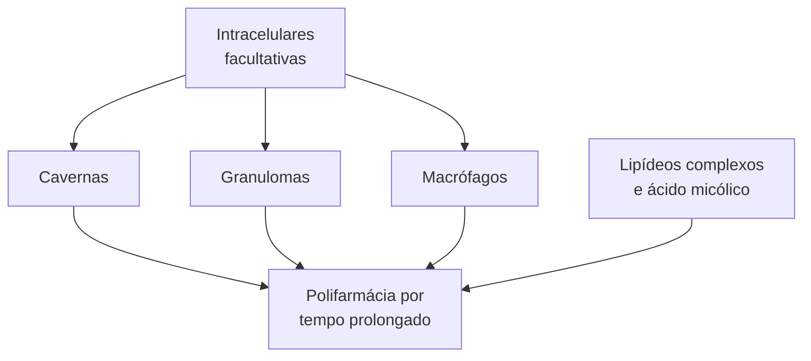
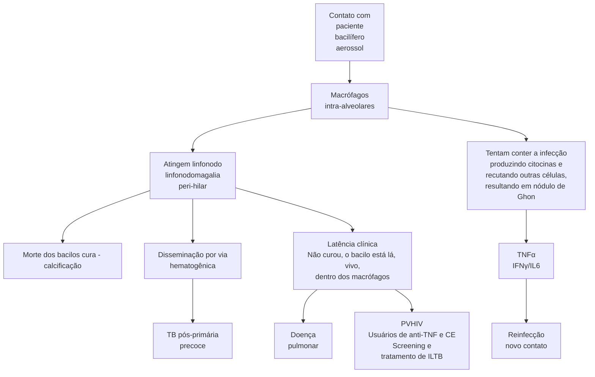
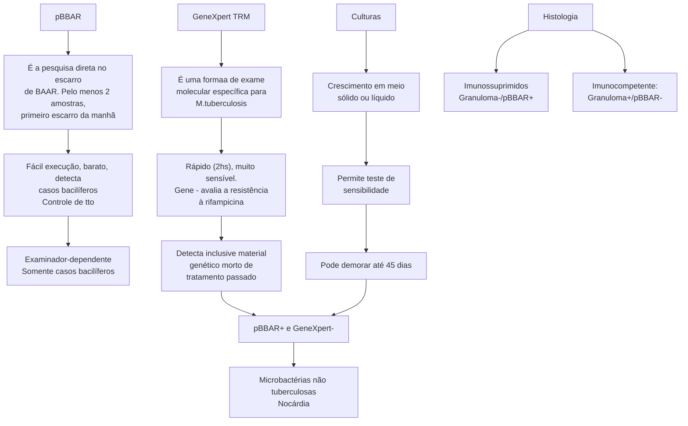
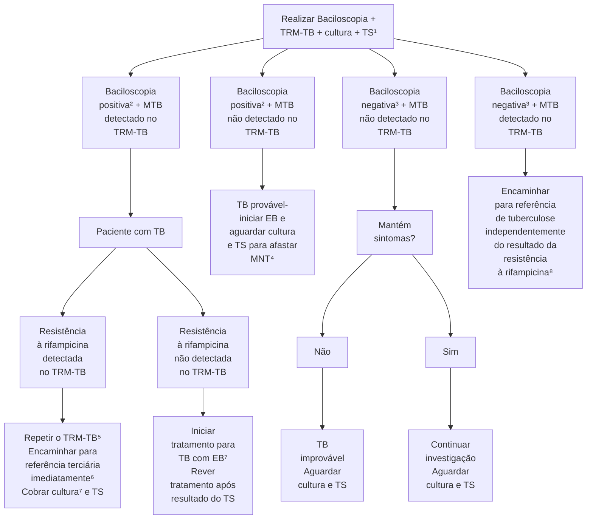
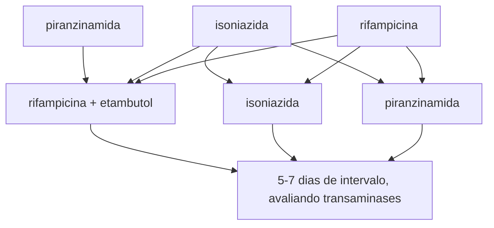
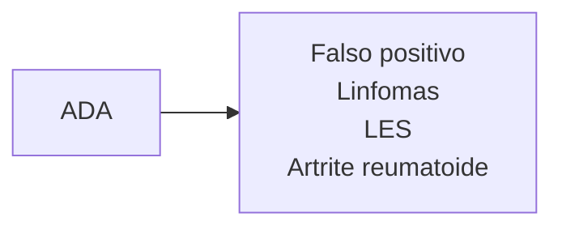

Tuberculose, MNT e Diferenciais (CM)

# TUBERCULOSE PULMONAR

## ILTB: PPD ou IGRA

• PPD >= 5 mm: PVHIV; anti-TNF; contactantes domiciliares; pred > 15 mg/d/30d:
  • Contactantes domiciliares: se PPD < 5 mm, repetir em 8 semanas e verificar **incremento** de 10 mm.
• PPD >= 10 mm: DM, DRC, neoplasias hematológicas e CP, pré-tx, trabalhadores, silicose;
• **PVHIV que são contactantes domiciliares: não depende de PPD e retrata mesmo que já tenha tratado;**
• Medicação: rifapentina + isoniazida/semana/12 sem; isoniazida/dia/9 meses (270 doses).

Sintomático respiratório: temporalidade = tosse > 3 semanas
• Populações de alto risco: tosse de qualquer duração
• Morador de área livre, albergues, comunidades terapêuticas, privados de liberdade, profissional de saúde, prisional.

Diagnóstico

## Laboratorial

• pBAAR: bacilífero, barato, examinador-dependente, controle de cura:
  • Formas disseminadas, paciente imunossuprimido: pBAAR
• TRM-TB: molecular, caro, persiste positivo mesmo após cura, sensibilidade varia com pBAAR;
• Cultura: demora até 2 meses, teste de sensibilidade;
• pBAAR +/TRM - = suspeitar de nocárdia/ micobactérias. Não tuberculosas:
  • Mas por uma questão epidemiológica, já se inicia tratamento de TB.
• LF-LAM: imediato, pesquisa TB ativa em PVHIV:
  • Indicações: gravemente doente, CD4<100 em ambulatório e < 200 em internação.
• TC: cavernas, paredes espessas, campos superiores, vidro fosco, micronódulos de aspecto árvore em brotamento, micronódulos difusos (miliar).

# 1. MICROBIOLOGIA

## 1.1 RELEMBRANDO CONCEITOS DE MICROBIOLOGIA BÁSICA

| Gram Positivos                       | Microbactérias |
| ------------------------------------ | -------------- |
| Parede celular
Membrana celular	 |                |

</td>
<td>

| Ácidos micólicos
Lipídeos complexos
Peptideoglicanos |
| ------------------------------------------------------------ |
|                                                              |

</td>
</tr>
</table>

**Figura 1** Ilustração: relembrando conceitos de microbiologia

## 1.2 COMPLEXO M. TUBERCULOSIS – SÃO 7

• M. tuberculosis;
• M. africanum;
• M. bovis – Bacilo de Calmette-Guérin (BCG);
• M. pinnipedii;
• M. canetti;
• M. microti;
• M. capra.

## 1.3 APRESENTA CRESCIMENTO LENTO - TRATAMENTO DEVE SER PROLONGADO E COM POLIFARMÁCIA, POIS FÁRMACOS ATUAM APENAS DURANTE A REPLICAÇÃO

• Podem viver em uma variedade de ambientes.
  • Populações extra e intracelulares;
• Confira **Figura 3** na página seguinte.

## 1.4 BAAR – BACILOS ÁLCOOL ÁCIDO RESISTENTES (PAREDE CELULAR RICA EM LIPÍDEOS) DIFICULTAM A PENETRAÇÃO DOS ANTIBIÓTICOS

**Figura 2** pBAAR.

INFECTOLOGIA

**Figura 3** Diversas populações de bacilos dificultando tratamento.

## CURSO CLÍNICO E FISIOPATOLOGIA

Granuloma é formado por **necrose caseosa** e contém a infecção (impede disseminação)

Depende de resposta imune celular efetiva

**Figura 4** Curso clínico e fisiopatologia.

## 2. ILTB

### 2.1 LATENTE, NÃO TEM CLÍNICA
• Contudo, apresenta os **bacilos viáveis intramacrofágicos**;
• São passíveis de reativação.

### 2.2 EM QUEM INVESTIGAR?
• Quem tem risco de reativar → **HIV, imunossuprimidos por corticosteroides (> 15 mg/dia de prednisona por 30 dias) ou anti-TNF (infliximab)**;
• Contatante domiciliar.

### 2.3 OUTROS PACIENTES COM INDICAÇÃO PARA INVESTIGAÇÃO DE ILTB
• Pessoas com **alterações radiológicas** fibróticas **sugestivas de sequela de TB**;

• **Pré-transplante** em que realização terapia imunossupressora;
• Pessoas com silicose;
• **Neoplasia de cabeça e pescoço**, linfomas e outras **neoplasias hematológicas**;
• **Insuficiência renal estágio avançado/em diálise**;
• **Diabetes mellitus**;
• Calcificação isolada (sem fibrose) na radiografia de tórax;
• **Profissionais de saúde**, pessoas que vivem ou trabalham no **sistema prisional**.

### 2.4 COMO INVESTIGAR?
• IGRA e PPD: indicam apenas o contato prévio;
  • PPD: valores de corte:

5mm:
PVHIV, imunossuprimidos (CE, pré-transplante e TNFα, alterações radiológicas

TUBERCULOSE PULMONAR                                                                                                             3

**10 mm:**
- Profissionais de saúde
- Profissionais do sistema prisional
- Neoplasias CP, hematológicas
- Silicose
- TSR
- DM

**IGRA MS 2024:**
- PVHIV e CD4 > 350 cels, que nunca tenham tratado ILTB
- 2 anos < crianças < 10 anos contactantes domiciliares de baciléferos
- Pré-TMO

Obs: no caso de contactante domiciliar → se ≥ 5 mm: tratar se < 5 mm, repetir o teste em 8 semanas → para ser positivo, é preciso aumentar 10 mm em relação ao primeiro teste PPD.

- Falso-positivos: vacinação BCG recente; infecção por micobactéria não tuberculosa;
- **Falso-negativos: tuberculose grave ou disseminada; imunodepressão avançada** (AIDS, uso de corticosteroides, outros imunossupressores e quimioterápicos); neoplasias, especialmente as de cabeça e pescoço e as doenças linfoproliferativas; desnutrição, *diabetes mellitus*, insuficiência renal e outras condições metabólicas; **idosos (> 65 anos)**.

**Tabela 1 Condições associadas a resultados falso-negativos da prova tuberculínica**

| Condições associadas a resultados falso-negativos da prova tuberculínica                                                                              |
| ----------------------------------------------------------------------------------------------------------------------------------------------------- |
| Tuberculina mal conservada: exposta à luz direta ou ultravioleta, congelada, contaminada com fungos, manutenção em frascos inadequados e desnaturação |
| Leitor inexperiente ou com vício de leitura                                                                                                           |
| Tuberculose grave ou disseminada                                                                                                                      |
| Outras doenças infecciosas agudas virais, bacterianas ou fúngicas                                                                                     |
| Imunodepressão avançada (AIDS, uso da corticosteroides, outros imunossupressores a quimioterápicos)                                                   |
| Vacinação com vírus vivos em período menor que 15 dias                                                                                                |
| Neoplasias, especialmente as de cabeça e pescoço e as doenças linfoproliferativas                                                                     |
| Desnutrição, *diabetes mellitus*, insuficiência renal e outras condições metabólicas                                                                  |
| Gravidez                                                                                                                                              |
| Crianças com menos de 3 meses de vida                                                                                                                 |
| Idosos (> 65 anos)                                                                                                                                    |
| Febre durante o período da realização da PT e nas horas que a sucedem                                                                                 |

- IGRA: mede produção de IFN mediante estimulação com antígenos de TB; células anteriormente sensibilizadas com os antígenos da tuberculose produzem altos níveis de interferon-gama:

## 2.5 PVHIV
- Que sejam contactantes domiciliares de bacilífero:
  - **Única situação em que retratamos ILTB**, mesmo se já tiver tratado previamente ou tido TB doença tratada.
- CD4<= 350 células: tratamento independentemente de teste
- Rx tórax com cicatriz radiológica de TB:
- Tratamento independentemente de teste.

## 2.6 PARA GESTANTES
- Tratar após o parto.

## 2.7 PARA GESTANTES HIV+
- Tratar após o 3° mês de gestação.

## 2.8 TRATAMENTO
**Preferencial:**
- Rifapentina + isoniazida semanal por 12 semanas (3 meses):
  - Contraindicado na gestação;
  - Abandono: 3 doses consecutivas.

**Alternativas:**
- Isoniazida 300 mg/dia por 9 meses (270 doses) + piridoxina:
  - A associação deve ser feita para prevenir neuropatia periférica;
  - Abandono: 90 dias não consecutivos.
- Rifampicina diária/4-6 meses (120 doses).

# 3. CLÍNICA E DIAGNÓSTICO

## 3.1 EPIDEMIOLOGIA
**Transmissão:**
- **Pacientes bacilíferos** (tuberculose pulmonar e laríngea com baciloscopia positiva) sustentam a cadeia de transmissão;
- **Mecanismo: aerossol:**
  - Outras doenças que apresentam a mesma via de transmissão são: **sarampo, varicela e zoster disseminado.**

**Risco em populações vulneráveis:**
- Morador de área livre → 56x maior;
- Pessoas vivendo com HIV → 28x maior;
- Pessoas privadas de liberdade → 28x maior;
- Indígenas → 3x maior.

Consultar **Figura 5** na próxima página

## 3.2 POPULAÇÃO EM GERAL: TEMPORALIDADE → TODA E QUALQUER TOSSE > 3 SEMANAS
- É uma doença de alta prevalência e grandes implicações para o paciente e para o sistema de saúde;
  - Logo, seu limiar para suspeição clínica tem que ser baixo;
  - Situações especiais:

INFECTOLOGIA

[Map of Brazil showing tuberculosis cases per 100,000 inhabitants with different shading levels]

**Figura 5** Coeficiente de incidência de tuberculose (casos por 100 mil hab.) por Unidades de Federação. Brasil, 2022

**Tabela 2** Sintomático respiratório em situações especiais.

| POPULAÇÃO                                                                                                                    | TEMPO/DURAÇÃO DETOSSE                                                                                         | EXAME DEESCARROSOLICITADO                       |
| ---------------------------------------------------------------------------------------------------------------------------- | ------------------------------------------------------------------------------------------------------------- | ----------------------------------------------- |
| Pessoas em
situação de rua                                                                                               | Qualquer duração                                                                                              | Baciloscopia
ou TRM                         |
| Albergues,
comunidades
terapêuticas de
dependentes
químicos ou
instituições
de longa
permanência | Qualquer duração                                                                                              | Baciloscopia
ou TRM-TB e
cultura com TS |
| Indígena                                                                                                                     | Qualquer duração                                                                                              | Baciloscopia
ou TRM-TBe
cultura com TS  |
| Profissionais da
saúde                                                                                                   | Qualquer duração                                                                                              | Baciloscopia
ou TRM-TBe
cultura com TS  |
| Imigrantes                                                                                                                   | Qualquer duração
em situações
de maior
vulnerabilidade                                            | Baciloscopia
ou TRM-TBe
cultura com TS  |
| *Diabetes
mellitus*                                                                                                      | 2 semanas                                                                                                     | Baciloscopia
ou TRM-TB                      |
| Contato de TB
pulmonar                                                                                                   | Qualquer duração                                                                                              | Baciloscopia
ou TRM-TB                      |
| PVHIV²                                                                                                                       | Qualquer duração.
Acrescida da
investigação
de febre ou
emagrecimento ou
sudorese noturna | Baciloscopia
ou TRM-TBe
cultura com TS  |

## 3.3 SINTOMAS CLÁSSICOS

• Febre vespertina;
• Perda ponderal;
• Sudorese noturna;
• Escarro hemoptoico;
• Tosse produtiva.

## 3.4 SINTOMAS NÃO CLÁSSICOS

• Síndromes abdominais agudas (inflamatórias, obstrutivas e perfurativas);
• Sinais neurológico focal; amaurose;
• Linfadenopatias; hepatoesplenomegalia; escrofuloderma;
• Lesão pustulosa; espondilodiscite; implante peritoneal; dor crônica;
• Uveíte; síndrome confusional; síndrome medular; mielite transversa;
• Síndromes compressivas; febre de origem indeterminada;
• Osteomielite; convulsão.

## 3.5 DIAGNÓSTICO

• Confira **Figura 6** na página seguinte.

## 3.6 O MINISTÉRIO DA SAÚDE PRECONIZA QUE

• Sempre solicitar os 3 exames laboratoriais juntos: pBAAR + TRM + Cultura com teste de sensibilidade (TS);
• Qualquer exame positivo já fecha diagnóstico, mas cuidado com TRM em reinfecção!
• pBAAR + e TRM-: iniciar EB, mas aguardar culturas para verificar caso de nocárdia / MNT (prevalência epidemiológica);
• Confira **Figura 7** nas páginas seguintes.

## 3.7 PEGADINHAS NO DIAGNÓSTICO!

• Amostras recomendadas para realização do TRM-TB;
  • Todas as formas pulmonares: escarro; escarro induzido; lavado broncoalveolar;
  • Na criança: lavado gástrico;
  • Outros tecidos: Liquor; Gânglios linfáticos e outros tecidos.
• **A positividade (sensibilidade) do TRM-TB depende da baciloscopia:**
  • **pBAAR +: 95%;**
  • **pBAAR -: 69%.** Conferir **Tabela 3**

## 3.8 TECNOLOGIA NOVA: LF-LAM - RASTREIO TB ATIVA EM PVHIV

• Confecção TB-HIV: 11,4% do total de pacientes com tuberculose;
• Urinário, imediato, a beira-leito, não cruza com MNT;
• PVHIV;
• Indicação:
  • Todo paciente gravemente doente;
  • Ambulatório: CD4 < 100;
  • Internação: CD4 < 200.

TUBERCULOSE PULMONAR

## Tabela 3 Diagnóstico de TB em PVHIV conforme imunossupressão

|                                 | Pessoas Vivendo com HIV
SEMIMUNODEFICIÊNCIAGRAVE                                      | Pessoas Vivendo com HIV
COMIMUNODEFICIÊCNIAGRAVE |
| ------------------------------- | ----------------------------------------------------------------------------------------- | ---------------------------------------------------- |
| Sintomas                        | Respiratórios e
sistêmicos                                                            | Predomínio
de sintomas
sistêmicos            |
| Radiografia de
tórax        | Padrão radiológico
típico (infiltrados e
atividades em lobo
superior direito) | Padrão
radiológico
atípico                   |
| Apresentação
extrapulmonar  | Ocasional                                                                                 | Frequente                                            |
| **Baciloscopia
de escarro** | Frequentemente
positiva                                                               | **Frequentemente
negativa**                      |
| Baciloscopia de
tecido      | Frequentemente
negativa                                                               | Frequentemente
positiva                          |
| Hemocultura                     | Negativa                                                                                  | Frequentemente
positiva                          |
| **Prova
tuberculínica**     | Frequentemente
positiva                                                               | **Frequentemente
negativa**                      |
| Histopatológica                 | Granulomas
típicos                                                                    | Granulomas
atípicos                              |

## 3.9 RADIOLOGIA
• Infinidade de padrões radiológicos;
• O mais comum é o que consta a presença de **cavernas com paredes espessadas**;
• Com presença de vidro fosco perilesional: Figura 8
• Cavitações com **paredes espessadas**. Figura 9

## 3.10 PADRÕES ATÍPICOS
• Micronódulos em árvore em brotamento: Figura 9
• Disseminação endobrônquica extensa;
• Consolidações broncogênicas; Figura 11
• TB miliar → micronódulos difusos, bilateralmente. Figura 10

Figura 6 Métodos laboratoriais de diagnóstico de tuberculose.

INFECTOLOGIA

**Figura 7** Fluxograma MS para investigação de recidiva de TB (manual de 2019)

![CT scan image showing thick-walled cavity]

**Figura 8** Caverna com paredes espessadas

![CT scan image showing extensive endobronchial dissemination with consolidations]

**Figura 9** Disseminação endobrônquica extensa, com consolidações.

![CT scan image showing miliary pattern]

**Figura 10** Disseminação hematogênica – padrão micronodular randômico – situação de imunossupressão.

![CT scan image showing tree-in-bud pattern]

**Figura 11** Exemplo de árvore em brotamento.

TUBERCULOSE PULMONAR

# REFERÊNCIAS

**Figura 2** pBAAR.

researchegate

**Figura 4** Curso clínico e fisiopatologia.

reserchegate

**Figura 5** Coeficiente de incidência de tuberculose (casos por 100 mil

hab.) por Unidades de Federação. Brasil, 2022

Sistema de Informação de Agravos de Notificação/Secretarias Estaduais

de Saúde/Ministério da Saúde; Instituto Brasileiro de Geografia e

Estatística.

**Figura 8** Caverna com paredes espessadas

Arquivo pessoal

**Figura 9** Disseminação endobrônquica extensa, com consolidações.

Arquivo pessoal

**Figura 10** Disseminação hematogênica - padrão micronodular

randômico - situação de imunossupressão.

Arquivo pessoal

**Figura 11** Exemplo de árvore em brotamento.

Arquivo pessoal

INFECTOLOGIA

# TRATAMENTO DE TUBERCULOSE E EFEITOS COLATERAIS DO RIPE

## RIPE: 2 meses, sempre

• RI depende da forma, de 4-10 meses.

**Hepatotoxicidade: TGP, 15-60 dias após início do RIPE**

• Leve: até 3x LSN sem sintomas;
• Grave: 3x LSN com sintomas dispépticos/icterícia; >5x LSN assintomático;
• Suspender RIPE e aguardar TGP < 2x LSN por até 4 semanas;
• Reintroduzir: rifampicina + etambutol - isoniazida - pirazinamida;
• Caso TGP > 2x LSN após 30 dias de suspensão; etambutol + levo + capreomicina.

**Outros efeitos colaterais RIPE**

• Rifampicina: interação medicamentosa,

mielotoxicidade, NIA, exantema, anemia hemolítica;
• Isoniazida: neurotóxica - repor B6 (piridoxina);
• Pirazinamida: ác. úrico e mioglobinúria;
• Etambutol: neurite óptica.

**Seguimento**

• Baciloscopia negativa em 15 dias, pode demorar até 2 meses (múltiplas cavernas, pBAAR +++);
• Falha de tratamento: suspeitar de má adesão;
• Reposição de baciloscopia, confirmada em 2 amostras após o 4º mês de tratamento;
• Persistência de positividade até o 4º mês (nunca negativar), sem melhora clínica.

**TB + HIV: DTG 2x**

• Tempor RIPE - TARV: 7 dias pulmonar, 4-6 semanas meníngea (se CD4 > 50: 2 semanas).

## 1. INTRODUÇÃO

### 1.1 TRATAMENTO PADRÃO

• Fase intensiva: 2 meses de RIPE, sempre:
  • Rifampicina, isoniazida, pirazinamida e etambutol.
• Fase de manutenção: RI → rifampicina e isoniazida:
  • O tempo varia de 4 a 10 meses → TB óssea e Meníngea B, estendemos até 10 meses.
• A depender do peso:
  • < 35 kg → 2 cps; 35-50 kg → 3 cps;
  • 50-70 kg → 4 cps; > 70 kg → 5 cps.

**POPULAÇÕES DIFERENTES DE BACILOS**

| Cavernas: O² e pH neutro                | RIPE |
| --------------------------------------- | ---- |
| Granulomas: sem O², mas ainda pH neutro | RIP  |
| Intramacrofágicos: sem O2 e pH ácido    | RI   |

### 1.2 POR QUE TÃO LONGO E COM TANTAS DROGAS?

• Diferente penetração dos fármacos em sítios com bacilos ativos;
• Nas cavernas: O² + pH neutro + nutrientes = crescimento rápido (RIPE);
• Nos granulomas: sem O² + pH neutro = crescimento lento (RIP);
• Nos intramacrófagos: sem O² + pH ácido = crescimento muito lento (RI).

### 1.3 INTERNAR?

• **TB meningoencefálica:**
• Intolerância incontrolável aos medicamentos antiTB em ambulatório;
• Estado geral que não permita tratamento ambulatorial;
• Intercorrências clínicas e/ou cirúrgicas relacionadas ou não à TB que necessitem de tratamento e/ou

procedimento em unidade hospitalar.

**Situação de vulnerabilidade social:**

• Ausência de residência fixa;
• Grupos com maior possibilidade de abandono de tratamento, especialmente em casos de retratamento, falência ou mutirresistência.

## 2. SEGUIMENTO

• **Figura** na página seguinte;
• Consultas:
• Mensalmente;
• Maior frequência a critério clínico;
• Oferta de teste para diagnóstico do HIV;
• No primeiro mês;
• Avaliação da adesão;
• Mensalmente;
• Baciloscopias de controle;
• Mensalmente;
• Recomendação para casos pulmonares;
• Radiografia de tórax;
• No 2° e 6° mês;
• Especialmente nos casos de baciloscopia negativa ou na ausência de expectoração;
• Repetir a critério clínico;
• Glicemia, função hepática e renal;
• No 1° mês.

## 3. EFEITOS COLATERAIS

Quando a reação adversa corresponde a uma **reação de hipersensibilidade grave, como trombocitopenia, anemia hemolítica e insuficiência renal**, o medicamento suspeito **não pode ser reiniciado após a suspensão**, pois na sua reintrodução a reação adversa pode ser ainda mais grave.

INFECTOLOGIA

**O QUE QUEREMOS?** → Negativação da baciloscopia + melhora clínica-laboratorial (radiológica...)

![Colestase icon]

**QUANDO QUEREMOS?** → Em 15 dias, podendo demorar até 2 meses (baciloscopia inicial +++)

↓

Falência de tratamento
Persistência de positividade até 4° mês se fortemente bacilífero
Nova positividade (após negativação) após o 4° mês (confirmada segunda baciloscopia)

↓

Em se excluindo má adesão/tomada errada de medicação (jejum), suspeitar de resistência

**Abandono: interrupção > 30 dias → reinicia contagem**

## 3.1 RIFAMPICINA

• Urina alaranjada;

**Figura 1** Negativação da baciloscopia + melhora clínica-laboratorial (radiológica...)

• Intolerância gástrica;

• Interação medicamentosa: indutora P450.

Reduz nível sérico:
- • Cumarínicos;
- • Anticonvulsivantes;
- • Anticoncepcionais orais;
- • Betabloqueadores;
- • NIA;
- • Anemia hemolítica;
- • Agranulocitose;
- • Trombocitopenia;
- • Icterícia isolada (BD);
- • Vasculite;
- • Exantema de hipersensibilidade.

## 3.2 ISONIAZIDA

• Neurotoxicidade: reposição de piridoxina (B6):
  - • Neuropatia periférica (bota e luva);
  - • Psicose;
  - • Crise convulsiva.

• Exantema de hipersensibilidade;

• **Mielotoxicidade.**

## 3.3 PIRAZINAMIDA

• É o fármaco mais hepatotóxico, de forma aguda!

• Aumento do ácido úrico → Cuidado em pacientes com Gota!

• Poliartralgia;

• Rabdomiólise;

• Mioglobinúria e IRA.

## 3.4 ETAMBUTOL

• Neurite óptica;

• Não deve ser usado em indivíduos < 10 anos de idade.

# 4. HEPATOTOXICIDADE

• 15-60 dias após início do RIPE, mas pode acontecer tardiamente!

• Quais são as drogas potencialmente causadoras?
  - • **Pirazinamida > isoniazida > rifampicina.**

## 4.1 INTENSIDADE

• Leve:
  - • Aumento assintomático de transaminases até 3x LSN;
  - • Sem icterícia.

• Grave:
  - • Transaminases ≥ 3x LSN com sintomas dispépticos;
  - • Incluindo icterícia em qualquer grau.

• Transaminases ≥ 5x LSN assintomática.

## 4.2 ABORDAGEM

• **Figura 2** na página seguinte;

• Aguardar normalização;

• Se não acontecer em até 4 semanas (>= 2x LSN):
  Capreomicina OU amicacina + Etambutol + Levofloxacino.

# 5. TB + HIV

• Dx: LAM:
  - • Qualquer IOs/gravemente doente;
  - • Se imunossupressão avançada;
  - • Beira-leito, urina;
  - • Detecta TB em fase pré-clínica;

• TARV → 2DTG (somente dobra a dose do dolutegravir devido indução do citocromo p450).

**Tempo RIPE-TARV**

• Pulmonar:
  - • Anterior: 14 dias;
  - • Agora: 7 dias,

• Meníngea:
  - • Antes: 8 semanas;
  - • Agora: 4 - 6 semanas, podendo ser 2 semanas se CD4 < 50;

TRATAMENTO DE TUBERCULOSE E EFEITOS COLATERAIS DO RIPE<page_header>
TRATAMENTO DE TUBERCULOSE E EFEITOS COLATERAIS DO RIPE

5-7 dias de intervalo, avaliando transaminases

**Figura 2** Fluxograma: hepatotoxicidade - abordagem.

Tuberculose, MNT e Diferenciais (CM)

# TUBERCULOSE EXTRAPULMONAR TODAS SÃO FORMAS

| • Poucos bacilos (TRM-TB, pBAAR e culturas frequentemente negativas).
**Pleural**
• Derrame unilateral em paciente jovem, febre subaguda, tosse seca;
• ADA >40 muito sugestivo; >60 quase patognomônico.
**Óssea**
• Mal de Pott;
• Coluna lombar e torácica;
• Abscesso em psoas;
• História subaguda de lombalgia com colabamento discal;
• Diferenciar de espondilodiscite por *S.aureus* em dialítico.
**Ganglionar** | • Uma única cadeia acometida, no geral mais de 1 linfonodo na cadeia;
• Sem supuração;
• PPD forte reator corrobora com o diagnóstico.
**Meningea B**
• História subaguda de meningite - cuidado com toda meningite com dias de evolução;
• Vasculite da base do crânio: sinal neurológico focal em pares cranianos; hidrocefalia aguda;
• ADA em LCR > 10 fortemente sugestivo;
• proteinorraquia proeminente, predomínio linfomono (>35% de linfócitos);
• Sempre iniciar corticoide junto. |
| ------------------------------------------------------------------------------------------------------------------------------------------------------------------------------------------------------------------------------------------------------------------------------------------------------------------------------------------------------------------------------------------------------------------------------------------------------------------ | ----------------------------------------------------------------------------------------------------------------------------------------------------------------------------------------------------------------------------------------------------------------------------------------------------------------------------------------------------------------------------------------------------------------------------------------------------------------------------------------------------------------------------- |

## 1. TB PLEURAL

• Representa 64% dos casos extrapulmonares;
  • Principal causa de derrame pleural, unilateral, em jovens.
• Quadro subagudo de tosse (seca), dor pleurítica, dispneia e eventualmente febre;
• Poucos bacilos no espaço pleural já desencadeiam resposta inflamatória granulomatosa:
  • 10% pBAAR;
  • Cultura 30%.

### 1.1 DIAGNÓSTICO

≥ 40: muito provável

≥ 60: muito muito muito provável

Amarelo citrino, exsudato linfomonocítico (mas nos primeiros 5 dias pode ser PMN), alta celularidade, alta proteína, glicose pouco baixa, pH normal → Não drenar!!!

Empiema tuberculoso: rompimento de cavitação subpleural, com extravasamento de líquido. pBAAR e culturas +, aspecto purulento, pH ácido. → drenar!!!

## 2. TB ÓSSEA

• Espondilodiscite tuberculosa (mal de Pott);
• Acomete coluna lombar e torácica (em especial a baixa), principalmente;
• Sinais neurológicos localizatórios, progressivos (paraparesia/plegia);
• Forma abscesso paravertebral em 50% dos casos – em músculo psoas, de caráter frio;
• Em paciente dialítico, importante diagnóstico diferencial de espondilodiscite por S. aureus; nos demais, com neoplasias.

### 2.1 DIAGNÓSTICO

• Cirurgia com biópsia/ punção radiointervenção;
• Estende fase de manutenção (tratamento total de 1 ano);
• Cuidado com os Anti-TNFs!
• Anticorpos monoclonais específicos TNF-a:
  • Infliximab;
  • Adalimumab;
  • Golimumab;
  • Centrolizumab;
• Proteínas de fusão → Não faz citólise mediada por complemento → Ertanecept → Menor risco que os específicos, mas ainda presente:
  • O TNF-a é importante para manutenção do granuloma. A utilização destas medicações pode desencadear quadros de TB, inclusive disseminada.

## 3. TB GANGLIONAR

• Caracteriza-se pela presença de único ou múltiplos nódulos na mesma cadeia;
• PPD → fortemente reator, corrobora com o diagnóstico;
• Aspirado no gânglio:
  • TRM-TB validado;
  • pBAAR: 20 – 25%;
  • Cultura: 50 – 90%.
• Histopatologia:

INFECTOLOGIA

• Granuloma → Paciente imunocompetente
• pBAAR → Paciente imunossuprimido.
• TB ocular: uveíte (anterior ou panuveíte), com refratariedade a tratamentos prévios, PPD forte reator (>=10 mm)
• Uveíte granulomatosa.

[Three medical CT scan images showing tuberculosis manifestations]

**Figura 2** Tb óssea

## 4. MENINGO - TUBERCULOSE

• Principal causa de meningite subaguda, podendo ter sintomas de encefalite e acontecimento de pares cranianos; hidrocefalia aguda;
• Vasculite: pode causar infartos cerebrais e hidrocefalia aguda.

**Tratamento prolongado na fase de manutenção → 2RIPE/10 RI:**
• Sempre iniciar internado;
• Corticoterapia para impedir piora inicial – 4 semanas:
  • Dexametasona injetável (0,3 a 0,4 mg/kg/dia);
  • Prednisona (1 a 2 mg/kg/dia).

Sempre suspeitar de TB em **meningite subaguda** com hiperproteínorraquia/celularidade com > 30% de linfócitos, ainda mais se acompanhada de febre **e par craniano**

**Proteína**
**Alta**
**(300 – 500 mg/dL)**

**Celularidade**
Alta,
predomínio
**linfocítico**

**Glicose**
Normal

**ADA**
Pouco valor, mas no geral fortemente
sugestivo se > 10 ui/ml

| **pBAAR**
Até 50% | **Cultura**
Até 50% | **PCR**
Até 80% |
| --------------------- | ----------------------- | ------------------- |

↓

**Aumenta com coletas seriada**

**Figura 3** Diagnóstico meningo TB: focar em proteína

# REFERÊNCIAS

**Figura 2** Tb ósses
Arquivo pessoal
