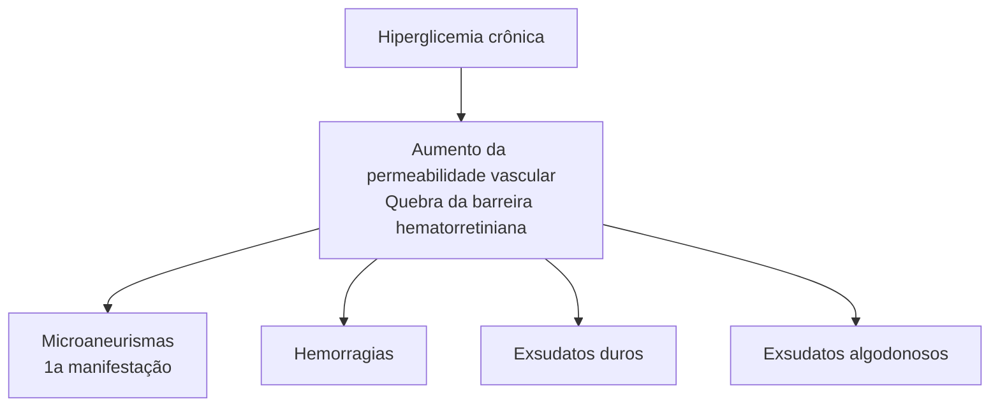

Oftalmo (CM)

# OFTALMOLOGIA I: O QUE O MÉDICO GENERALISTA PRECISA SABER?

## CONCEITOS BÁSICOS EM OFTALMOLOGIA

**FUNDO DE OLHO**
- Saber reconhecer exames normais: nervo óptico, mácula, vasos, retina periférica.

**CATARATA**
- Principal causa de cegueira no mundo;
- Não prevenível, mas reversível (único tratamento: cirurgia).

**GLAUCOMA**
- Principal causa de cegueira em negros
- Irreversível, mas prevenível (pressão intraocular é o principal fator de risco modificável)
- Tríade do glaucoma primário de ângulo aberto: aumento da PIO + alteração típica do Nervo óptico (nervo escavado) + defeito de campo visual correspondente

**PRONTO-SOCORRO OFTALMOLÓGICO**

- Corpo estranho corneano: excluir perfuração, remover corpo estranho com agulha de insulina sob anestesia tópica, orientar EPI;
- Trauma ocular: curativo oclusivo não compressivo ("copinho"), TC crânio e órbitas, repouso absoluto (evitar Valsalva), levofloxacino EV, vacina antitetânica, encaminhar ao oftalmologista para reparo cirúrgico;
- Hemorragia retrobulbar: descompressão por meio de cantotomia lateral e cantólise rapidamente;
- Queimadura química: lavagem abundante com 2-3l de Ringer Lactato;
- Fechamento angular agudo primário: tratamento temporário no PS (agentes hiperosmóticos, colírios corticoides e hipotensores) e definitivo (iridotomia bilateral);
- Conjuntivite viral: mais comum, quadro autolimitado, afastar e evitar contatos.

## 1. ANATOMIA

**Figura 1** Corte transversal da anatomia ocular.

The first diagram shows a cross-sectional view of the eye with labeled parts: Pálpebra, Pupila, Esclerótica, Íris, Corpo ciliar, Córnea, Humor vítreo, Cristalino, Corpo ciliar, Esclerótica, Retina, Coroide, Nervo óptico.

### 1.1 BULBO OCULAR:

- **O bulbo ocular é composto por 3 camadas concêntricas:**
  - **Externa (túnica fibrosa):** córnea, limbo e esclera = confere resistência e proteção ao globo ocular;
  - **Intermediária (úvea):** corpo ciliar, coroide e íris = confere nutrição e suporte;
  - **Interna (retina):** possui fotorreceptores e elementos neurais = responsável pelo

processamento visual.

### 1.2 CONJUNTIVA:

- A conjuntiva é a membrana transparente e fina que recobre a esclera (conjuntiva bulbar) e a superfície interna das pálpebras (conjuntiva tarsal).

**Figura 2** Corte transversal do olho, com destaque para as camadas do blubo ocular.

The second diagram shows a detailed cross-section of the eye with labeled structures: Esclerótica, Humor vítreo, Corpos ciliares, Ligamentos, Coroide, Retina, Íris, Fóvea central, Cristalino, Pupila, Nervo óptico, Córnea, Conjuntiva.

### 1.3 CÓRNEA:

- A córnea é a extensão transparente da esclera. A transição entre a esclera (opaca) e a córnea (transparente) ocorre abruptamente no limbo. O poder refrativo é em média 42 dioptrias, representando ⅔ de todo o poder óptico do olho.

## 1.4 CRISTALINO:

• O cristalino é uma estrutura transparente, elástica e de forma biconvexa, localizada atrás da pupila;
• É um órgão único, pois não tem nenhuma vascularização ou inervação;
• Tem poder de 21 dioptrias, sendo responsável por ⅓ do poder óptico do olho;
• Poder de acomodação → perde-se com o tempo, causando a presbiopia.

| **SEM ACOMODAÇÃO**
 | **ACOMODAÇÃO**
 |
| ---------------------------- | ------------------------ |

**Figura 3** Alteração da conformação do cristalino de acordo com a acomodação.

## 1.5 SEGMENTO ANTERIOR:

• O segmento anterior ocular, repleto de **humor aquoso**, é composto pelas câmaras anterior e posterior, separadas pela íris e pelo orifício pupilar.

## 1.6 VÍTREO:

• O vítreo é uma estrutura gelatinosa e avascular, essencial para o suporte e a nutrição da retina;
• Possui volume de 4ml (80% do volume do globo ocular) e é composto principalmente por água (98%), colágeno, ácido hialurônico, glicose e ácido ascórbico;
• Encontra-se aderido à retina em certos pontos (principalmente no nervo óptico).

**Estrutura da Retina**

Luz → Fibras nervosas → Conexão com o nervo óptico → Neurônio ganglionar → Célula amácrina → Neurônio bipolar → Célula horizontal

**Figura 4** Estrutura da retina

## 1.7 RETINA:

• A retina é responsável pela conversão da imagem luminosa em impulsos elétricos;
• Ela é composta pela retina neurossensorial e pelo epitélio pigmentar da retina;

• **Temos 2 tipos de fotorreceptores: cones e bastonetes.** Os cones são responsáveis pela visão das cores e com maior definição. No centro da mácula, não há bastonetes, apenas cones, sendo essa região responsável pela melhor acuidade visual.

**Figura 5** Demonstração esquemática das estruturas observadas na fundoscopia.

[Diagram showing: Fóvea, Mácula, Arteríolas, Vênulas, Artéria retinal central, Veia retinal central, Disco óptico]

# 2. SEMIOLOGIA

## 2.1 ACUIDADE VISUAL:

**Notação (exemplos):**
• 20/20 = 1,0 (100% de visão);
• 20/40 = 0,5 (50%).
• Sem percepção luminosa = visão mais baixa possível

| **E**                 | BAIXA VISÃO SEVERA (0,1) |    |                    |
| --------------------- | ------------------------ | -- | ------------------ |
| **F P**               |                          | 1  |                    |
| **T O Z**             |                          | 2  |                    |
| **L P E D**           |                          | 3  |                    |
| **P E C F D**         |                          | 4  | BAIXA VISÃO (0,5)  |
| **E D F C Z P**       |                          | 5  |                    |
| **F E L O P Z D**     |                          | 6  |                    |
| **D E F P O T E C**   |                          | 7  | VISÃO NORMAL (1,0) |
| **F E L O P Z D**     |                          | 8  |                    |
| **P C T Z D E P C**   |                          | 9  |                    |
| **C T P C C Z Z T D** |                          | 10 |                    |
| **• • • • • • • • •** | 11                       |    |                    |

| **E m**                                             |               |
| --------------------------------------------------- | ------------- |
| \[símbolos: pássaro, pessoas]                       | **m Ξ W**     |
| \[símbolos: xícara, bicicleta, mão]                 | **Ξ W E**     |
| \[símbolos: telefone, anel, pessoas]                | **m E W Ξ**   |
| \[símbolos: xícara, bicicleta, mão, telefone, anel] | **E m W Ξ m** |

**Figura 6** Tabela de Snellen com letras, desenhos e símbolos.

OFTALMOLOGIA I: O QUE O MÉDICO GENERALISTA PRECISA SABER?                3

## 2.2 MOTILIDADE OCULAR: TESTAR MOVIMENTO NAS 9 POSIÇÕES DO OLHAR

**Figura 7** Exame de motilidade ocular evidencia que olho esquerdo não realiza abdução.

**Figura 8** Teste de mobilidade ocular.

## 2.3 PUPILAS

• Observação geral das pupilas (simetria e formato): anisocoria?
• Reflexo fotomotor direto (via aferente);
• Reflexo fotomotor consensual (via eferente);
• Defeito pupilar aferente relativo (teste da iluminação rápida alternada).

## 2.4 BIOMICROSCOPIA DO SEGMENTO ANTERIOR:

**Usando a lâmpada de fenda, é possível analisar:**
• Glândula lacrimal e pele;
• Pálpebras e cílios;
• Conjuntiva, episclera e esclera;
• Filme lacrimal e córnea;
• Câmara anterior;
• Cristalino;
• Vítreo anterior;
• Gonioscopia (avaliação das estruturas angulares)

**Figura 9** Lâmpada de fenda

**Figura 10** Tonômetro.

## 2.5 AFERIÇÃO DA PRESSÃO INTRAOCULAR:

• Obtida com maior precisão a partir da tonometria de aplanação. Na ausência de equipamento específico, pode-se estimar a pressão por meio da tensão óculo-digital.

## 2.6 EXAME DO SEGMENTO POSTERIOR:

**Opções:**
• **Oftalmoscopia direta.**
• **Oftalmoscopia indireta → necessário uso de lente auxiliar.**

OFTALMOLOGIA

![Figura 11 - Image showing indirect ophthalmoscopy with auxiliary lens being performed on a patient wearing a mask]

**Figura 11** Oftalmoscopia indireta (uso de lente auxiliar).

![Figura 12 - Image showing direct ophthalmoscopy being performed]

**Figura 12** Oftalmoscopia direta.

## 3. FUNDOSCOPIA NORMAL

**Sistematização do exame:**
• Disco óptico → Corado ou pálido? Bordas bem delimitadas ou borradas? Escavação fisiológica ou aumentada? Presença de hemorragias peridiscais?
• Vasos → Artérias e veias de calibre habitual? Aumento de tortuosidade vascular? Cruzamento AV patológicos?
• Mácula → Coloração habitual? Hemorragias? Drusas?
• Retina periférica → Retina aplicada, sem áreas de descolamento? Presença de roturas? Neovascularização?

**Dica:** Como identificar qual o olho através da fundoscopia? Nervo óptico do lado esquerdo = olho esquerdo.

• **Em que focar?**
  • **Fundo de olho**: diferenciar normal x DM x HAS.

![Fundoscopic image showing labeled structures: Artéria (artery), Disco óptico (optic disc), and Veia (vein) marked with arrows on a retinal photograph]

**Figura 13** Fundo de olho normal

## 4. PRINCIPAIS CAUSAS DE CEGUEIRA

• 2.2 bilhões de pessoas apresentam deficiência visual no mundo. Destas, 1 bilhão poderia ter sido prevenida ou é tratável.
• **Causas de baixa de visão passíveis de prevenção:**
  • 1. Catarata;
  • 2. Erro refracional;
  • 3.Glaucoma;
  • 4.Opacidade corneana;
  • 5.Retinopatia diabética.

### 4.1 CATARATA:
• Principal causa de cegueira no mundo;
• Definida como a Opacidade do cristalino;
• A catarata é reversível por meio de tratamento cirúrgico;
• Não prevenível – Faz parte do processo de envelhecimento (algumas patologias aceleram sua formação); como uso de corticoide e cirurgias oculares prévias.
• Único tratamento: cirúrgico.

| Visão sem Catarata                                                        | Visão com Catarata                                                                    |
| ------------------------------------------------------------------------- | ------------------------------------------------------------------------------------- |
|                  |                          |
|  |  |

**Figura 14** Visão e refração da luz no olho sem e com catarata.

• **Técnica mais usada:**
  • **Facoemulsificação com implante de lente intraocular:**
  • Indicação depende de perda visual, necessidades individuais e estilo de vida;
  • **Indicação absoluta:** glaucoma facomórfico ou facolítico.

OFTALMOLOGIA I: O QUE O MÉDICO GENERALISTA PRECISA SABER?                5

![Three images showing different types of cataracts: Catarata Cortical, Catarata Nuclear, and Catarata Subcapsular]

**Figura 15** Catarata cortical, nuclear e subcapsular, respectivamente.

## 4.2 GLAUCOMA:

- Principal causa de cegueira em negros. Cerca de 7 milhões de pessoas estão bilateralmente cegas por glaucoma;
- Neuropatia óptica crônica progressiva, que pode repercutir funcionalmente no campo de visão do paciente;
- Irreversível;
- Prevenível – pressão intraocular é um importante fator de risco:

História familiar também é fator de risco, que deve sempre ser questionado.

- **Diversas formas:**
  - Glaucoma primário de ângulo aberto (GPAA – + comum);
  - Glaucoma primário de ângulo fechado;
  - Glaucoma congênito;
  - Glaucomas secundários.
- **Tríade do GPAA (assintomático):**
  - Aumento da PIO;
  - Alteração típica do nervo óptico (nervo escavado);
  - Defeito de campo visual correspondente.
- **Tratamento do glaucoma:**
  - Consiste no aumento da drenagem do humor aquoso, diminuição da secreção do humor aquoso ou aumento do escoamento.

## 5. PRONTO SOCORRO

### 5.1 HIPOSFAGMA:

- Hemorragia subconjuntival causada por traumas de intensidade variável que podem passar despercebidos pelo paciente ou formas de manobra de Valsalva (por exemplo: tosse, vômito e constipação intestinal);
- Dificilmente está associado a condições sistêmicas, apesar de ser comum o paciente ser referenciado por suspeita de quadro hipertensivo;
- Por ter uma aparência por vezes dramática, o paciente procura atendimento imediatamente;
- Não cursa com diminuição da Acuidade Visual (AV) ou dor;
- Tratamento expectante: lubrificante e orientação.

### 5.2 CORPO ESTRANHO (CE) CORNEANO:

- **Sintomas:** dor, sensação de CE, fotofobia, hiperemia conjuntival, lacrimejamento.
- **Ao exame:**
  - 1- Avaliar AV (mantida ou reduzida): objetivo é eliminar possibilidade de lesão intraocular;
  - 2- Avaliar localização, profundidade e lesões

associadas na lâmpada de fenda;
- 3- Sempre everter pálpebras e inspecionar fórnices.

![Image showing hiposfagma - subconjunctival hemorrhage in an eye]

**Figura 16** Hiposfagma

![Image showing hiposfagma - another view of subconjunctival hemorrhage]

**Figura 17** Hiposfagma

![Image showing foreign body (CE) in the cornea]

**Figura 18** CE na córnea.

![Image showing everted eyelid with foreign body]

**Figura 19** Pálpebra evertida com corpo estranho.

• **Tratamento na ausência de evidência de perfuração corneana:**
  • 1- Aplicar anestésico tópico;
  • 2- Remover corpo estranho com agulha de insulina dobrada;
  • 3- Remover o máximo possível halo ferruginoso;
  • 4- Prescrever colírio antibiótico de amplo espectro e pomada oftalmológica reepitelizante;
  • 5- Orientar EPI e avaliar status vacinal do paciente.

## 5.3 TRAUMA OCULAR:

• **Epidemiologia**: homens jovens de 20 a 40 anos (economicamente ativos), representando uma das principais causas de cegueira unilateral do mundo;
• Envolve lesões oculares diversas, incluindo globo, anexos e nervo óptico, oscilando de lesões superficiais a perdas visuais irreversíveis;
• **Classificação:**
  • Penetrante (apenas ferida de entrada) x perfurante (entrada e saída);
  • **Ruptura**: trauma de grande energia causado por objetos sem corte.

| Lesão         |                   |              |                            |
| ------------- | ----------------- | ------------ | -------------------------- |
| Globo integro |                   | Globo aberto |                            |
| Contusão      | Laceração lamelar | Laceração    | Ruptura                    |
|               |                   | Penetrante   | Corpo estranho intraocular |
|               |                   | Perfurante   |                            |

**Figura 20** Baseado em: Manual de condutas de pronto-socorro de Oftalmologia

## 5.4 CORPO ESTRANHO INTRAOCULAR - TRAUMA OCULAR PENETRANTE:

• **Atentar para o tipo de CE**: magnéticos ou não, produtores de reação inflamatória leve ou grave, inertes ou não, puros ou impuros;
• **Conduta:**
  • 1- Curativo oclusivo não compressivo - "copinho";
  • 2- TC crânio e órbitas;
  • 3- Internação, jejum e repouso absoluto;
  • 4- Analgésicos e antieméticos - evitar Valsalva;
  • 5- Antibiótico profilático: levofloxacino 500mg EV 1xd;
  • 6- Vacina antitetânica a depender do status vacinal;
  • 7- Reparo cirúrgico.

## 5.5 HEMORRAGIA RETROBULBAR:

• **Fisiopatologia:**
  • Sangramento intraconal (da artéria infraorbitária) por trauma (tipicamente) contuso;

• O sangramento dentro dessa cavidade restrita (paredes ósseas) leva ao aumento da pressão intraorbitária, resultando em Síndrome compartimental, e, por consequência, Neuropatia óptica isquêmica anterior.
• **Sinais**: proptose, equimose, tensão palpebral, restrição de MOE (musculatura ocular extrínseca), baixa acuidade visual (BAV), defeito pupilar aferente relativo, aumento da PIO, evidências de oclusão vascular retiniana, edema de disco óptico;
• **Diagnósticos diferenciais**: celulite orbitária, enfisema orbitário, fratura em blow-out;
• **Tratamento: tempo é visão (urgente!):**
  • Descompressão por meio de cantotomia lateral e cantólise deve ser instituída rapidamente (<90 minutos);
  • Pálpebra deverá afastar-se completamente do globo.
  • Pode haver drenagem espontânea do sangue represado;
  • Na maioria dos casos, ocorre cicatrização por segunda intenção.

**Figura 21** Cantotomia e cantólise lateral

## 5.6 QUEIMADURA OCULAR:

• **Químicas**: bases (saponificação) geram queimaduras mais graves que ácidos (desnaturação de proteínas);
• **Térmicas:** queimaduras diretas do globo ocular são raras graças ao reflexo de fechamento palpebral. O mais comum é a observação de lesões palpebrais. Encaminhar ao oftalmologista se suspeita de corpo estranho ou lesão direta do globo;
• **Tratamento: deve ser instituído imediatamente**
  • 1 - Descartar perfuração;
  • 2 - Lavagem abundante com Ringer Lactato por 30-60 min (mínimo 2L) até pH normalizar;
  • 3 - Anestésico tópico e limpar bem os fórnices;
  • **Nunca tentar neutralizar com outra solução em virtude de reação exotérmica!**

## 5.7 FECHAMENTO ANGULAR AGUDO PRIMÁRIO:

• **Fatores de risco:** Mulheres, asiáticas, >50 anos, ângulo estreito, câmara rasa, pequeno comprimento axial, hipermetropia;
• **Sintomas**: dor, BAV, visão de halos, náuseas;
• **Sinais**: PIO elevada, pupila média-midríase, hiperemia conjuntival, edema corneano;
• **Tratamento:** temporário no Pronto Socorro (com agentes hiperosmóticos, colírios corticoides e hipotensores) e definitivo (iridotomia bilateral).

OFTALMOLOGIA I: O QUE O MÉDICO GENERALISTA PRECISA SABER?                                                              7

**Figura 22** À direita: podemos observar hiperemia ocular, edema corneano e pupila em média-midríase.

## 5.8 CONJUNTIVITE:

• **Etiologia**: infecciosa, alérgica etc.
• **Conjuntivite viral (maior parte dos casos):**
  • Resolução espontânea;
  • Altamente contagioso (AFASTAR e evitar contatos);
  • Higiene;
  • **Sintomáticos:** lubrificante e compressa fria.
• **Como diferenciar:**
• **Viral:** folículos;
• **Bacteriana:** papilas. O quadro bacteriano é mais exuberante.

## 5.9 DESCOLAMENTO E NÃO DESLOCAMENTO DE RETINA:

• Separação da retina neural do epitélio pigmentado da retina;
• **Etiologias:**
  • Regmatogênico (rotura);
  • Exsudativo;
  • Tracional;
  • Misto.
• **Fatores de risco para descolamento regmatogênico:**
  • Alta miopia;
  • Trauma ocular ou craniano;
  • Descolamento de Retina Regmatogênico (DRR0 no olho contralateral;
  • Pseudofacia ou afacia;
  • Cirurgia intraocular prévia.

**Figura 23** Descolamento de Retina.

• **O tratamento definitivo varia de acordo com o aspecto e complexidade do descolamento, incluindo:**
  • Retinopexia a laser;
  • Retinopexia pneumática;
  • Introflexão escleral;
  • Vitrectomia pars plana.

## 5.10 OCLUSÃO DE ARTÉRIA CENTRAL DA RETINA:

• **Sintomas:** perda visual súbita (de conta-dedos a percepção luminosa), unilateral, indolor, podendo ser precedida por crises de amaurose fugaz;
• **Sinais:** retina pálida, opaca e edematosa, mácula em cereja, visualização de êmbolos, defeito aferente relativo;
• **Etiologia:** embolização (mais comumente êmbolos de colesterol advindos de placas ateroscleróticas da carótida);
• **Conduta:** nenhum tratamento para restabelecer a circulação retiniana mostrou-se efetivo, entretanto tenta-se mover o êmbolo se BAV < 24h (paracentese de câmara anterior, massagem ocular, manitol). Dada morbidade sistêmica, solicitar avaliação clínica.

**Figura 24** Oclusão de artéria central da retina.

OFTALMOLOGIA

# REFERÊNCIAS

**Figura 7** Exame de motilidade ocular evidencia que olho esquerdo não realiza abdução.

https://www.eyehealthweb.com/ophthalmopar esis-ophthalmoplegia/

**Figura 8** Teste de mobilidade ocular.

Arquivo pessoal

**Figura 9** Lâmpada de fenda

Arquivo pessoal

**Figura 10** Tonômetro.

Arquivo pessoal

**Figura 11** Oftalmoscopia indireta (uso de lente auxiliar).

Arquivo pessoal

**Figura 12** Oftalmoscopia direta.

https://blog.casamedica.com.br/exame-de-fundo-de-olho-e-o-usodo-oftalmoscopio/

**Figura 13** Fundo de olho normal

https://miguelpadilha.com.br/exame-de-fundo-de-olho/

**Figura 14** Visão e refração da luz no olho sem e com catarata.

Illustração Medcof

**Figura 15** Catarata cortical, nuclear e subcapsular, respectivamente.

https:// medicosdeolhos.com.br/catarata-o-que-e-sintomas-diagnosticoe-tratamento/.

**Figura 16** Hiposfagma

https://drmichelrubin.com.br/2014/08/01/hiposfagma/

**Figura 17** Hiposfagma

https://drmichelrubin.com.br/2014/08/01/hiposfagma/

**Figura 18** CE na córnea.

https://drmichelrubin.com.br/2014/07/31//corpo-estranho

**Figura 19** Pálpebra evertida com corpo estranho.

https://drmichelrubin.com.br/2014/07/31//corpo-estranho

**Figura 20** Baseado em: Manual de condutas de pronto-socorro de Oftalmologia

USP (2022, Ed. Atheneu).

**Figura 22** à direita: podemos observar hiperemia ocular, edema corneano e pupila em média-midríase.

prova residência USP 2018

**Figura 23** Descolamento de Retina.

eyerounds.org

**Figura 24** Oclusão de artéria central da retina.

centro cirurgico de coimba all rifhts reserved

# OFTALMOLOGIA II: INTERFACE COM OUTRAS ESPECIALIDADES

## 1. PEDIATRIA

### 1.1 TESTE DO REFLEXO VERMELHO (TRV)

**Quando?**
- MS: o primeiro exame deve ser realizado nos primeiros dias de vida, e repetido pelo menos 2-3x por ano nos primeiros 3 anos
- SBP: Deve ser realizado na maternidade, antes da alta do recém-nascido.

**Como?**
- Realizado pelo pediatra, a 30cm, em sala escura, um olho por vez
- Oftalmoscópio direto

**Por quê?**
- **Objetivo**: triagem para diversas patologias oculares
- Se alterado → encaminhar ao oftalmologista!
- Ausência de reflexo vermelho → Leucocoria

**Hipóteses diagnósticas:**
- Catarata congênita
- Glaucoma congênito
- Alterações retinianas
- Opacidades corneanas
- Retinoblastoma
- Erro refrativo
- Estrabismo

### 1.2 RETINOBLASTOMA

- Tumor intraocular maligno mais frequente da infância:
  - Achados: Leucocoria (60%), estrabismo (20%), inflamação orbitária mimetizando celulite pós ou pré-septal;

**Figura 1** Leucocoria à esquerda

**Figura 2** Exame de fundoscopia evidencia retinoblastoma próximo ao nervo óptico.

**Tratamento:**
- Quimioterapia/Radioterapia
- Enucleação
- Crioterapia
- Fotocoagulação

### 1.3 TOXOPLASMOSE CONGÊNITA

- Toxoplasmose Congênita
  - 80% da população brasileira possui sorologia IgG positiva para Toxoplasmose
  - Triagem trimestral na gestação
  - Quanto menor a idade gestacional → + grave
  - Quanto maior a idade gestacional → + chance de transmissão
- Quadro clínico: Tétrade de Sabin (presente em menos de 10% dos casos)
  - **Composta por**: retinocoroidite em "Roda de carroça", calcificações, micro/hidrocefalia, atraso DNPM

**Figura 3** Fundo de olho com lesão cicatricial da toxoplasmose na região macular, gerando perda visual grave.

**Tabela 1** Avaliação Sorológica

| IgG | IgM | Interpretação | Conduta                                                              |
| --- | --- | ------------- | -------------------------------------------------------------------- |
| -   | -   | Susceptível   | Sorologias Seriadas + cuidados                                       |
| +   | -   | Imune (80%)   |                                                                      |
| -   | +   | Falso +/-     | Repetir                                                              |
| +   | +   | !!!!!!!       | Checar avidez: > 60% → infecção > 4 meses < 30% → Infecção aguda(!!) |

### 1.4 RETINOPATIA DE PREMATURIDADE

- Recém nascidos prematuros podem apresentar a vascularização retiniana incompleta, ocasionando a formação de neovasos
- **Fatores de risco:**
  - Baixa IG (< 35 semanas)
  - Baixo peso (< 1500g)

OFTALMOLOGIA

**Tabela 2** Conjuntivites Neonatais

| Etiologia                      | Tempo de Evolução | Quadro Clínico                                               | Conduta                                                                                                                     |
| ------------------------------ | ----------------- | ------------------------------------------------------------ | --------------------------------------------------------------------------------------------------------------------------- |
| Química
(nitrato de prata) | < 24h             | Conjuntivite purulenta leve/
moderada                    | Observação (melhora em 48h)                                                                                                 |
| *Neisseria
gonorrheae*     | < 1 semana        | Conjuntivite purulenta grave,
pode ter perfuração ocular | Internação, Ceftriaxona EV/IM Coletar
secreção (gram e cultura) Tratar os
pais                                      |
| *Chlamydia
trachomatis*    | 1 a 2 semanas     | Secreção mucóide                                             | Eritromicina VO, Coletar secreção
(gram e cultura) Tratar os pais \*
Atentar para Pneumonia afebril do
lactente |

**Tabela 3** Celulites pré e pós-septal

|                                             | Pré-septal (periorbitária)                         | Pós-septal (orbitária)                                                                                                                                          |
| ------------------------------------------- | -------------------------------------------------- | --------------------------------------------------------------------------------------------------------------------------------------------------------------- |
| Etiologia                                   | S. aureus / S. pyogenes                            | S. pneumoniae / H. Influenza / Moraxella, S. aureus,
Anaeróbios                                                                                             |
| Fatores de Risco                            | Infecções cutâneas                                 | Rinossinusite, trauma, infecção dentária                                                                                                                        |
| Faixa Etária                                | Pico 0 - 10 anos e 50 - 60 anos                    | Principal causa de órbita aguda em crianças                                                                                                                     |
| QC: Dor + Calor +
Edema + Hiperemia + … | NADA(!)                                            | PROPTOSE, dor e restrição da motilidade ocular,
diplopia, quemose, baixa acuidade visual                                                                    |
| Conduta                                     | ATB VO com cobertura para Gram+                    | Cefalexina 6/6h OU Amoxicilina + Clavulanato 8/8h
– no mínimo 10 dias                                                                                       |
|                                             | ATB EV (Ceftriaxona + Metronidazol/
Oxacilina) | Internação, TC de órbita, HMG, hemocultura, VHS,
PCR, punção lombar (se suspeita de meningite)
Abscesso: drenagem cirúrgica (mais comum em
adultos) |

• Oxigenoterapia em UTI neonatal
• **Outros**: def. vitamina E, cianose, apneia, convulsões, transfusões sanguíneas
• **Achados**: dilatação e tortuosidade vascular, neovascularização, descolamento de retina

**Figura 4** Atentem para o aumento da tortuosidade vascular nos exames de fundoscopia acima.

## 1.5 CONJUNTIVITES NEONATAIS **Tabela 2**

## 1.6 CELULITES PRÉ E PÓS-SEPTAL **Tabela 3**

## 1.7 SHAKEN BABY SYNDROME

• Shaken baby syndrome (ou síndrome do bebê sacudido) ocorre quando um bebê é sacudido repetidamente, geralmente por um cuidador frustrado, em um esforço para acalmar um bebê inconsolável. A cabeça de um bebê é desproporcionalmente grande e seus vasos sanguíneos são frágeis, o que torna o cérebro e os olhos mais suscetíveis a sangrar devido a uma lesão por desaceleração.

**Figura 5** Abscesso subperiosteal: história de sinusite aguda não tratada e proptose progressiva direita há 4 dias; TC no plano axial (A) e reformatação no plano coronal (B)

OFTALMOLOGIA II: INTERFACE COM OUTRAS ESPECIALIDADES    3

Figura 6 Fundoscopia típica da Shaken baby syndrome. O sangramento pode estar acima, dentro ou abaixo da retina.

## 1.8 DOENÇA DE KAWASAKI

**Critérios diagnósticos**
- Conjuntivite bilateral não purulenta
- Alteração na membrana mucosa oral, edema ou fissura labial e língua em framboesa
- Alteração nas extremidades: eritema palmar ou plantar, edema de mãos e pés (fase aguda) e descamação periungueal (fase convalescente)
- Rash cutâneo polimórfico
- Linfadenopatias cervicais (pelo menos 1 linfonodo > 1,5cm de diâmetro)

## 1.9 PSEUDOESTRABISMO

- Condição muito comum, na qual a criança tem a falsa aparência de estrabismo
- Características que simulam: epicanto, distância interpupilar grande ou pequena
- Muitas vezes é difícil convencer os pais que a criança não tem estrabismo

Figura 7 Pseudoestrabismo secundário a epicanto

Figura 8 Pseudoestrabismo

## 2. CARDIOLOGIA

### 2.1 ENDOCARDITE

- Achado fundoscópico: Manchas de Roth
- Compõem um dos fenômenos imunológicos (critérios menores de Duke), juntamente a fator reumatóide positivo, nódulos de osler e glomerulonefrite;

Figura 9 Fundo de olho com mancha de Roth

### 2.2 RETINOPATIA HIPERTENSIVA

**Achados:**
- Estreitamento arteriolar (fio de cobre/prata) → sinal mais precoce
- Cruzamento AV patológico
- Hemorragias
- Exsudatos algodonosos
- Emergência hipertensiva → Edema de papila(!)

**Complicações → Oclusões vasculares**

Figura 10 Retinopatia hipertensiva grau III. Estreitamento arteriolar generalizado, relação e cruzamento ateriovenosos patológicos e hemorragia em chama de vela.

OFTALMOLOGIA

# 3. ENDOCRINOLOGIA

## 3.1 RETINOPATIA DIABÉTICA

**Figura 11** Fisiopatologia das alterações retinianas secundárias ao regime de hiperglicemia crônica vigente em pacientes portadores de DM.

### Fatores de Risco
- Tempo de doença
- Mal controle glicêmico
- Tipo de Diabetes → DM1 pior que DM2
- **Medicações**: insulina → Maior prevalência de RD, glitazonas → Maior associação com edema macular diabético
- **Outros**: HAS, tabagismo, gestação, nefropatia

**Figura 12** No fundo de olho, observamos diversas alterações típicas da retinopatia diabética, como microaneurismas, microhemorragias, exsudatos duros e algodonosos.

**Figura 13** Beading venoso ("Ensalsichamento")

**Figura 14** IrMA (intraretinal Microvascular Abnormality)

### Retinopatia Diabética não proliferativa → não tem neovasos

- **Classificação e risco de evolução para retinopatia diabética proliferativa de alto risco em 1 ano:**
  - leve (1%) → MA e MH em < 4Q;
  - moderada (3%),
  - grave (15%) → Um dos critérios abaixo;
  - muito Grave (45%) → 2 ou mais critérios abaixo;
- **Critérios:** 4Q com > 20 MH/MA; 2Q com beading venoso; 1Q com IrMA

### Retinopatia Diabética proliferativa
- Oclusão capilar
- Isquemia da retina → VEGF → Neovascularização

**Figura 15** Neovasos

### Tratamento
- Controle rigoroso do diabetes
- Injeção intravítrea de anti-VEGF
- Panfotocoagulação → sacrifica a retina periférica em prol da diminuição da produção de VEGF e preservação da mácula
- Vitrectomia

OFTALMOLOGIA II: INTERFACE COM OUTRAS ESPECIALIDADES                                                    5

**Figura 16** Descolamento de retina tracional por DM.

**Figura 17** Panfotocoagulação.

**Prevenção - quando encaminhar ao oftalmologista?**
- DM1: até 5 anos do diagnóstico
- DM2: no momento do diagnóstico
- Gestação: no primeiro trimestre
- Exames periódicos de fundo de olho após o primeiro exame, dependendo do estágio

## 3.2 DOENÇA OCULAR TIREOIDIANA

**Figura 18** Retração palpebral.

- 50% dos pacientes com doença de Graves terão acometimento ocular → Hipotireoidismo também pode ocasionar doença ocular
- **Fisiopatologia**: AutoAC atacam fibroblastos, acometendo músculos extraoculares e gordura orbitária
- Mais comum em mulheres jovens
- Mais grave em homens idosos
- Tabagismo é o principal fator de risco
- Curso clínico da doença independe da doença sistêmica
- **Quadro Clínico**
  - Retração palpebral – 90%
  - Proptose/Exoftalmia – 60%
  - Miopatia restritiva (diplopia, estrabismo)
  - Neuropatia óptica compressiva
- Diagnóstico
  - **2 de 3 a seguir:** clínica, exames laboratoriais, imagem sugestiva

## 4. REUMATOLOGIA

### 4.1 ESPONDILITE ANQUILOSANTE

**Figura 19** Uveíte anterior com hiperemia conjuntival e hipópio.

- Acometimento axial → manobra de Schober, limitada se variação < 5 cm
- Associada à positividade do HLA-B27
- Homens de 20 a 35 anos
- Dor lombar e sacroilíaca com características inflamatórias
- Entesite → em especial do calcâneo

**Uveíte Anterior**
- Aguda e recidivante
- Não granulomatosa
- Dor, fotofobia e BAV leve
- Não há relação entre o quadro ocular e atividade sistêmica
- **Complicações são frequentes**: Sinéquias posteriores, catarata, glaucoma secundário, edema macular cistóide

**Tratamento**
- Corticoides tópicos + Midriáticos/Ciclopléjicos → Corticoide VO
- Romper sinéquias posteriores

OFTALMOLOGIA

**Tabela 4** A forma clínica da uveíte é determinada pela localização primária da inflamação.

| Forma Clínica        | Localização primária da inflamação |
| -------------------- | ---------------------------------- |
| Uveíte anterior      | Câmara anterior                    |
| Uveíte Intermediária | Vítreo                             |
| Uveíte posterior     | Retina ou coróide                  |
| Pan-Uveíte           | Todas as partes da úvea            |

## 4.2 ARTRITE REATIVA

• Homens, Jovens
• Artrite asséptica aproximadamente 2 semanas após infecção TGI ou TGU → mais comum: Chlamydia
• Oligoartrite assimétrica de MMII
• Sacroileíte, Entesite
• Uretrite, Balanite
• Dactilite
• Ceratoderma blenorrágico
• Úlceras orais
• Conjuntivite (30 - 60%): mais comum
• **Uveíte anterior (semelhante a da Espondilite Anquilosante):** pode ocorrer, mas é menos comum do que conjuntivite
• **Lembrar da tríade da Síndrome de Reiter:** oligoartrite assimétrica de MMII, uretrite, conjuntivite;

**Figura 20** Conjuntivite asséptica.

## 4.3 VOGT-KOYANAGI-HARADA

• Doença sistêmica, granulomatosa e autoimune
• **Alvo:** melanócitos dos olhos, ouvido interno, pele, SNC
• Mais comum em mulheres, de 20 a 50 anos, mais pigmentadas
• Principal causa de uveíte não infecciosa no Brasil, junto a Behçet

**Critérios Diagnósticos**

• Ausência de trauma ocular/cirurgia prévia (DD oftalmia simpática)
• Ausência de evidência de outras doenças oculares
• Envolvimento ocular bilateral
• Alterações neurológicas/auditivas: Zumbido, meningismo, LCR com pleocitose
• Alterações dermatológicas: Alopécia, poliose, vitiligo

**Fase Aguda**

• Coroidite difusa

• Descolamento de retina seroso
• Uveíte anterior
• Inflamação vítrea

**Fase Crônica**

• Despigmentação ocular → fundo em pôr do sol, sinal de sugiura
• Uveíte anterior recorrente / crônica
• Complicações: Catarata, glaucoma

**Figura 21** Vitiligo

**Figura 22** Fundo em por do sol.

## 4.4 MACULOPATIA POR CLOROQUINA

**Figura 23** Ceratopatia verticilatta.

• Ceratopatia verticilatta → opacificação discreta da córnea que não provoca BAV nem necessita suspensão da droga

OFTALMOLOGIA II: INTERFACE COM OUTRAS ESPECIALIDADES                                                      7

**Figura 24** Maculopatia em bull's eye.

## Maculopatia cloroquínica
• Pode causar BAV grave e irreversível
• Dose dependente
• Hidroxicloroquina é opção terapêutica com menor toxicidade
• Recomenda-se um exame de fundo de olho antes do início de uso da cloroquina e seguimento anual após.

# 5. NEUROLOGIA

## 5.1 PARALISIA DA MUSCULATURA OCULAR EXTRÍNSECA

### Paralisia do VI nervo craniano (Abducente)
• Congênito
• trauma
• Infecção
• Hipertensão intracraniana

**Figura 25** Paresia ou paralisia do VI nervo (abducente) à esquerda; esotropia esquerda com grande limitação de abdução, aumentando a levoversão

### Paralisia IV nervo craniano (Troclear)
• Congênito
• Trauma
• Vasculopatia
• Idiopático
• Lembrar da posição compensatória da cabeça(!)

### Paralisia do III nervo craniano (oculomotor)
• **Causas**: congênito, vascular, trauma, infecção, infiltração, tumor, cirurgia
• **Fatores de Risco**: HAS, DM, arteriosclerose (risco de aneurisma), idosos
• Causas traumáticas envolvem pupila pois Fibras pupilares são mais periféricas
• **Quadro clínico**: Ptose; alteração MOE (exotropia) não faz elevação, depressão e adução; reflexo pupilar → sugestivo de causa compressiva se estiver acometido;

## 5.2 EDEMA DE PAPILA

**Figura 26** Edema de papila

### Causas:
• Neurite
• Neuropatia óptica isquêmica aguda (NOIA)
• Emergência Hipertensiva/HAS maligna
• Oclusão de veia central da retina

### Edema de papila ou papiledema?
• Edema de papila → qualquer causa!!
• Papiledema → Hipertensão intracraniana!

**Figura 27** Retinografia revelando disco óptico de limites nítidos no olho direito e borramento dos bordos do disco óptico no olho esquerdo

## 5.3 PSEUDOTUMOR CEREBRAL
• **Causa mais comum**: Idiopática (Hipertensão intracraniana idiopática)
• **Outras causas**: obstrução de seio venoso cerebral, medicamentosa (tetraciclina, ACO, corticoide, amiodarona)
• Mulher, obesa, 20 a 45 anos
• **Sintomas de HIC**
  • Cefaléia pulsátil
  • Escurecimento transitório da visão
  • Diplopia
  • Sinais: papiledema

OFTALMOLOGIA

Figura 28 Distúrbios das vias ópticas

Figura 29 Coriorretinite (seta amarela) em caso de sífilis ocular.

## 3º Aneurisma

Ptose + Múltiplas alterações MOE

## 4º Trauma Congênito

PPO "estranho"

## 6º Pressão Intracraniana

Reto lateral não abduz

Figura 30 Quadro clínico

OFTALMOLOGIA II: INTERFACE COM OUTRAS ESPECIALIDADES

Esquerdo | Direito
T | N | N | T

Retina temporal | Retina Nasal
Retina temporal
Nervo óptico | B | A
Quiasma óptico | C
Tracto óptico
Corpo geniculado | D
lateral
| E
| F

Radiação óptica

Área visual, área 17 (lábios do sulco calcarino)

Esquerdo | Direito

Normal

A
Cegueira total do
olho direito

B
Hemianopsia
heterônima bitemporal

C
Hemianopsia nasal
do olho direito

D
Hemianopsia
homônima esquerda

E
Quadrantanopsia homônima
superior esquerda

F
Hemianopsia
homônima esquerda

**Figura 31** Distúrbios das vias ópticas

• **Conduta**:
  • TC e RMN de Crânio → normais;
  • Solicitar líquor com pressão de abertura → pressão liquórica aumentada > 20mm H2O em decúbito lateral e composição liquórica normal
  • Aval Neurocirurgia (excluir outras causas de HIC)
  • Orientar perda de peso
  • Acetazolamida 250mg VO 1 a 2g/dia (dose máxima 4g/dia)

## 5.4 DISTÚRBIOS DAS VIAS ÓPTICAS
• Conferir **Figura 31**

## 5.5 MIASTENIA GRAVIS
• Doença autoimune que envolve a produção de AutoAC contra os receptores nicotínicos de acetilcolina, afetando a junção neuromuscular
• Mais comum em mulheres, 20 a 40 anos
  • Características clínicas: flutuação e fatigabilidade
• Acometimento ocular muito comum, 30 - 50% tem como apresentação inicial
  • Blefaroptose → mais comum. Variável, uni ou bilateral, simétrica ou assimétrica
  • Alteração de MOE. Não segue padrão específico,

mas costuma afetar antes a supravisão
• Alteração pupilar AUSENTE. Esfíncter da pupila tem receptores muscarínicos de acetilcolina

# 6. INFECTOLOGIA

## 6.1 SÍFILIS

a

**Figura 32** Coriorretinite (seta amarela) em caso de sífilis ocular.

• *Treponema pallidum*
• Contágio: Sexual, sangue, lesões

• Diversas formas clínicas
• Diagnóstico: pesquisa direta (campo escuro), testes não treponêmicos (VDRL), testes treponêmicos (FT-ABS)
• **Doença ocular adquirida**
  • Mais comum na forma secundária e latente
  • Pleomórfica: Cancro palpebral (primária), uveíte anterior (Associada a HIV), neurite óptica, coriorretinite, vasculite arterial, pseudoretinose pigmentar; mais comum acometimento posterior do que anterior
  • Se sintomas oculares → LCR
  • **Tratamento:** Penicilina Cristalina 4mi 4/4h EV por 14 dias → = neurossífilis (!!)

## 6.2 TOXOPLASMOSE
• *Toxoplasma gondii*
• IgG+ em 80% da população no Brasil
• **Doença ocular adquirida**
  • 2 - 30% das infecções

• Concomitante ou tardio ao quadro sistêmico
• Principal causa de uveíte posterior
• Unilateral em imunocompetentes
• Uni ou Bilateral em imunocomprometidos
• **Tratamento**
  • Sulfadiazina + Pirimetamina (+ ácido folínico)
  • Corticoide + Cicloplégicos tópicos
  • Associar corticoide VO em casos selecionados

## 6.3 TUBERCULOSE
• *Mycobacterium tuberculosis* (BAAR aeróbico)
• 1/3 da população mundial – Brasil: top 20
• **Primoinfecção:** 5% primária, 95% latente (20% extrapulmonar; 2% ocular);
  • 60% sem doença pulmonar ou outros sítios
  • Pleomórfica: Tuberculoma palpebral; Uveíte anterior; Tubérculo coroideano; Vasculite retiniana; Neurite óptica

OFTALMOLOGIA II: INTERFACE COM OUTRAS ESPECIALIDADES    11

# REFERÊNCIAS

**Figura 1** Leucocoria à esquerda

CBO 2016

**Figura 2** Exame de fundoscopia evidencia retinoblastoma próximo ao nervo óptico.

Aerts, L. Lumbroso-Le Rouic L., Gauthier Villars, M. et Al. Retinoblastoma. Orphanet J Rare Dis 1, 31(2006). https://doi.org/10.1186/1750.1.31

**Figura 3** Fundo de olho com lesão cicatricial da toxoplasmose na região macular, gerando perda visual grave.

https://www.institutoderetina.com.br/home/toxoplasmose-ocular/

**Figura 4** Atentem para o aumento da tortuosidade vascular nos exames de fundoscopia acima.

https://medicine.uiowa.edu/eye/

**Figura 5** Abscesso subperiosteal: história de sinusite aguda não tratada e proptose progressiva direita há 4 dias; TC no plano axial (A) e reformatação no plano coronal (B)

https://doi.org/10.5935/0034-728.020140025

**Figura 6** Fundoscopia típica da Shaken baby syndrome. O sangramento pode estar acima, dentro ou abaixo da retina.

AAO 2013

**Figura 7** Pseudoestrabismo secundário a epicanto

http://ceoportoalegre.com.br/2011/01/pseudoestrabismo/

**Figura 8** Pseudoestrabismo

http://ceoportoalegre.com.br/2011/01/pseudoestrabismo/

**Figura 9** Fundo de olho com mancha de Roth

University of Michigan - Kelogg Eye Center

**Figura 10** Retinopatia hipertensiva grau III. Estreitamento arteriolar generalizado, relação e cruzamento ateriovenosos patológicos e hemorragia em chama de vela.

http://www.ligadeoftalmo.ufc.br/?s=ensino&p=atlas

**Figura 11** Fisiopatologia das alterações retinianas secundárias ao regime de hiperglicemia crônica vigente em pacientes portadores de DM.

CBO 2016

**Figura 12** No fundo de olho, observamos diversas alterações típicas da retinopatia diabética, como microaneurismas, microhemorragias, exsudatos duros e algodonosos.

https://www.retina-specialist.com/article/clinical-trial-lessons-for-managing-diabetic-retinopathy

**Figura 13** Beading venoso ("Ensalsichamento")

clinicaroisman.com.br

**Figura 14** IrMA (intraretinal Microvascular Abnormality)

clinicaroisman.com.br

**Figura 15** Neovasos

Journal of ophthalmology

**Figura 16** Descolamento de retina tracional por DM.

eyerounds.org

**Figura 17** Panfotocoagulação.

https://www.aao.org/eyenet/article/anti-vegf-tx-as-Effectiveas-laser

**Figura 18** Retração palpebral.

Arch Soc Esp Oftalmol vol.78 no.8 ago. 2003

**Figura 19** Uveíte anterior com hiperemia conjuntival e hipópio.

imagebank.asrs. org/file/18312/hla-b27-associated-uveitis

**Figura 20** Conjuntivite asséptica.

opticanet.com.br/

**Figura 21** Vitiligo

https://dermnetnz.org/topics/vogt-koyanagi-harada-syndrome

**Figura 22** Fundo em por do sol.

Journal of Clinical Ophthalmology, 2017

**Figura 23** Ceratopatia verticilatta.

eyerounds.org - University of Iowa

**Figura 24** Maculopatia em bull`s eye..

eyerounds.org - University of Iowa

**Figura 25** Paresia ou paralisia do VI nervo (abducente) à esquerda; esotropia esquerda com grande limitação de abdução, aumentando a levoversão.

https://www.scielo.br

**Figura 26** Edema de papila

https://www.msdmanuals.co/pt/profissional

**Figura 27** Retinografia revelando disco óptico de limites nítidos no olho direito e borramento dos bordos do disco óptico no olho esquerdo

Rev. bras.oftalmol. 68 (3) • Jun 2009 • https://doi.org/10.1590/S0034-72802009000300009

**Figura 28** Paralisia do nervo troclear direito.

eyerounds.org Christopher Kirkpatrick, MD

**Figura 29** Coriorretinite (seta amarela) em caso de sífilis ocular.

**Figura 32** Coriorretinite (seta amarela) em caso de sífilis ocular.

https://joii-journal.springeropen.com/articles/

10.1186/s12348-018-0164-5
